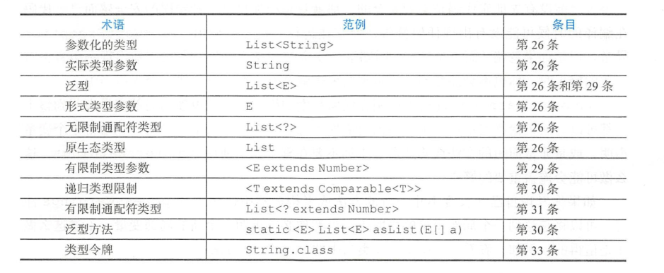
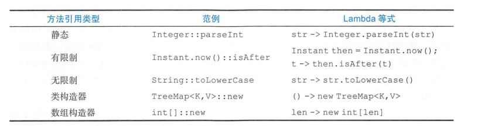
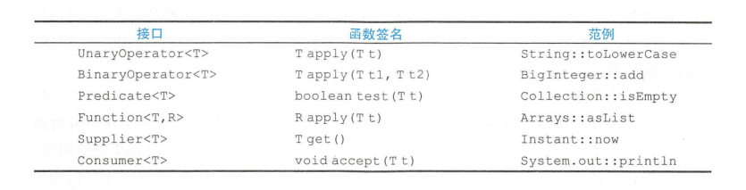

### 第2章 创建和销毁对象

#### 第1条 用静态工厂方法代替构造器

优势：

- 静态工厂方法有名称，如构造方法`BigInteger(int,int,Random)`返回的可能为素数。如果用`BigInteger.probablePrime()`的静态工厂方法，则一目明了。名称可以显示该构造函数的目的。

- 静态工厂方法可以决定是否在每次调用的时候都创建新的对象。而构造函数做不到。

  - 返回相同的对象，这样的类称为实例受控类。此种类保证是Singleton或者不可实例化。可以确保不可变的值类不会存在两个相同的实例。

- 静态工厂可以返回该类型的任何子类型对象，可以根据参数值返回不同的子类对象。如根据状态码决定子类，实现多态的好处。

- 方法返回对象所属的类，在编写包含该静态工厂方法的类时可以不存在。是服务提供者框架(*Service Provider Framework*)的基础。该框架有三个重要组件（***JDBC***为例子）：

  - 服务接口(*Service Interface*)：由服务提供者实现。如`Connection`

  - 提供者注册API(*Provider Registration API*):这是提供者用来注册实现的,如`DrierManager.registerDriver`

  - 服务访问API(*Service Access API*):客户端用来获取服务实例，如`DriverManager.getConnetion`

  - 服务提供者接口(*Service Provider Interface*):可选。产生服务接口之实例的工厂对象。如`Driver`

    (***JDBC***可以理解为：先用`DriverManager.registerDriver`告诉系统谁提供了驱动，有可能是***Mysql***,还可能是***Oracle***,你这个驱动是必须要实现`Connection`接口的，不然没法用。你实现了之后我就用`DriverManager.getConnection`来获取你的实现；此处`DriverManager.getConnection`为静态工厂方法，其实例由第三提供，满足该优点)

劣势：

- 如果不含有公有的或者受保护的构造器，就不能被子类化。
- 不容易被发现。**惯用名称举例**：
  - `from`:如`Date d = Date.from(instance)`类型转换方法，单个参数。
  - `of`:如`Set<Rank> faceCards = EnumSet.of(JACK,QUEEN,KING)`，聚合方法，多个参数。
  - `valueof`:如`BigInteger prime = BigInteger.valueof(Integer.MAX_VALUE),替代方法。`
  - `instance`或者`getInstance`:如`StackWalker luke = StackWalker.getInstance(options);`
  - `create`或者`newInstance`:如`Object newArray = Array.newInstance(classObjec,arrayLen)。确保每次调用都返回一个新的实例。`
  - `getType`如`FileStore fs = Files.getFileStore(path)。在工厂方法处于不同类型中的时候使用。`
  - `newType`如`BufferedReader br = Files.newBufferedReader(path)`，跟`newInstance`一样，不过是在工厂方法处于不同类型时使用。
  - `type`如`List<Complaint> litany =Collections.list(LegacyLitany)`。是`getType`和`newType`的简化版。

#### 第2条 遇到多个构造器参数时要考虑使用构建器

- 重叠构造器可行，但是当有许多参数的时候，客户端代码会很难编写，并且难以阅读。

  ```java
  public class NutritionFacts {
      private final int servingSize;  // (ml)             required
      private final int servings;     // (per container)  required
      private final int calories;     // (per serving)    optional
      private final int fat;          // (g/serving)      optional
      private final int sodium;       // (g/serving)      optional
      private final int carbohydrate; // (g/serving)      optional
  
      public NutritionFacts(int servingSize, int servings) {
          this(servingSize, servings, 0);
      }
  
      public NutritionFacts(int servingSize, int servings, int calories) {
          this(servingSize, servings, calories, 0);
      }
  
      public NutritionFacts(int servingSize, int servings, int calories, int fat) {
          this(servingSize, servings, calories, fat, 0);
      }
  
      public NutritionFacts(int servingSize, int servings, int calories, int fat, int sodium) {
          this(servingSize, servings, calories, fat, sodium, 0);
      }
  
      public NutritionFacts(int servingSize, int servings, int calories, int fat, int sodium, int carbohydrate) {
          this.servingSize = servingSize;
          this.servings = servings;
          this.calories = calories;
          this.fat = fat;
          this.sodium = sodium;
          this.carbohydrate = carbohydrate;
      }
  }
  ```

- ***JavaBean***模式通过`setter`可以解决阅读性问题。但***JavaBean***模式自身存在缺点。**在构造过程中JavaBean可能处于不一致的状态**。类无法仅仅通过校验构造器参数的有效性保证一致性。**JavaBean模式使得把类做成不可变得可能性不复存在**。

- 使用**构造者模式**重构：

  ```java
  public class NutritionFacts {
      private final int servingSize;  // (ml)             required
      private final int servings;     // (per container)  required
      private final int calories;     // (per serving)    optional
      private final int fat;          // (g/serving)      optional
      private final int sodium;       // (g/serving)      optional
      private final int carbohydrate; // (g/serving)      optional
  
      public static class Builder {
          private final int servingSize;
          private final int servings;
          private int calories = 0;
          private int fat = 0;
          private int sodium = 0;
          private int carbohydrate = 0;
  
          public Builder(int servingSize, int servings) {
              this.servingSize = servingSize;
              this.servings = servings;
          }
  
          public Builder calories(int val) {
              calories = val;
              return this;
          }
  
          public Builder fat(int val) {
              fat = val;
              return this;
          }
  
          public Builder sodium(int val) {
              sodium = val;
              return this;
          }
  
          public Builder carbohydrate(int val) {
              carbohydrate = val;
              return this;
          }
  
          private NutritionFacts build() {
              return new NutritionFacts(this);
          }
      }
  
      public NutritionFacts(Builder builder) {
          this.servingSize = builder.servingSize;
          this.servings = builder.servings;
          this.calories = builder.calories;
          this.fat = builder.fat;
          this.sodium = builder.sodium;
          this.carbohydrate = builder.carbohydrate;
      }
  }
  ```

- ***Builder***模式也适用于类层次结构

  ```java
  public class Pizza {
      final Set<Topping> toppings;
      public enum Topping{
          HAM,MUSHROOM,ONION,PEPPER,SAUSAGE;
      }
      abstract static class Builder<T extends Builder<T>>{
          EnumSet<Topping> toppings = EnumSet.noneOf(Topping.class);
          public T addTopping(Topping topping){
              toppings.add(Objects.requireNonNull(topping));
              return self();
          }
          abstract Pizza build();
          protected abstract T self();
      }
      Pizza(Builder<?> builder){
          toppings = builder.toppings.clone();
      }
  }
  public class NyPizza extends Pizza {
      private final Size size;
      public enum Size {
          SMALL, MEDIUM, LARGE
      }
      NyPizza(Builder builder) {
          super(builder);
          size = builder.size;
      }
      public static class Builder extends Pizza.Builder<Builder> {
          private final Size size;
  
          public Builder(Size size) {
              this.size = Objects.requireNonNull(size);
          }
          @Override
          public NyPizza build() {
              return new NyPizza(this);
          }
          @Override
          protected Builder self() {
              return this;
          }
      }
  }
  public class Calzone extends Pizza {
      private final boolean sauceInside;
      public static class Builder extends Pizza.Builder<Builder> {
          private boolean sauceInside = false; // default
          public Builder sauceInside() {
              sauceInside = true;
              return this;
          }
          @Override
          public Calzone build() {
              return new Calzone(this);
          }
          @Override
          protected Builder self() {
              return this;
          }
      }
      private Calzone(Builder builder) {
          super(builder);
          sauceInside = builder.sauceInside;
      }
  }
  // 客户端的使用
  public class Client {
      private void buildPizza(){
          NyPizza pizza = new NyPizza.Builder(SMALL)
                  .addTopping(SAUSAGE)
                  .addTopping(ONION).build();
          Calzone calzone = new Calzone.Builder().addTopping(HAM).sauceInside().build();
          
      }
  }
  ```

  每个子类的构建器中的`build`方法，都声明返回正确的子类。在该方法中，子类方法声明返回超级类中声明返回类型的子类型，这称为协变返回值类型。它允许客户端无须转换类型就能使用这些构建器。

简言之，如果类的构造器或者静态工厂中具有多个参数，设计这种类是，***Builder***模式就是一种不错的选择。


#### 第3条 用私有构造器或者枚举类型强化*Singleton*属性

有三种方法实现***Singleton***，这两种方法**都要保持构造器为私有**，并导出公有的静态成员，以便客户端能够访问该类的唯一实例:

- 第一种，公有静态成员为***final***域：私有构造器仅被调用一次，且不公开;特点：

  - 1 简单 
  - 2 *API*很清楚地表明该类是一个***Singleton***，因为公有的今天域是***final***的，故总是包含相同的引用。

  ```java
  public class Elvis {
      public static final Elvis INSTANCE = new Elvis();
      private Elvis() {
      }
      public void leadTheBuilding(){...}
  }
  ```

- 第二种，公有的成员是个静态工厂方法，该方式特点：

  - 1 灵活性，可以方便改成为每个调用该方法的线程返回一个唯一的实例 
  - 2 广泛性，静态工厂方法可以根据需要改为泛型***Singleton***工厂(*generic singleton factory*)  
  - 3 可以实现方法引用成为一个`Supplier<Elvis>`如`Elvis::instance`

  ```java
  public class Elvis {
      private static final Elvis INSTANCE = new Elvis();
      private Elvis() {
      }
      public static Elvis getInstance(){
          return INSTANCE;
      }
      public void leadTheBuilding(){...}
  }
  ```

- 第三种，声明一个包含单个元素的枚举类型 。特点：简单，已提供序列化机制；也不存在反射工具问题；不利于扩展。

  ```java
  public enum  Elvis  {
     INSTANCE;
     public void leaveTheBuilding(){}
  }
  ```

**第1，第2种方式注意点**：享有特权的客户端可以借助`AccessibleObject.setAccessible`方法，通过反射机制调用私有构造器，从而创造另一个实例。如果要防止这种做法，可以通过修改构造器在创建第二个实例时抛出异常。

***Singleton***与***Serializable***：

- ***Singleton***类要变成可序列化，仅仅声明中加入`implements Serializable`是不够的

- 必须声明所有的实例域都是瞬时的(*transient*)，并提供`readResolve`方法，防止每次反序列化时都创建新的实例

  ```java
  public class Elvis implements Serializable {
      private static final Elvis INSTANCE = new Elvis();
      private Elvis() {
      }
      public static Elvis getInstance(){
          return INSTANCE;
      }
      public void leadTheBuilding(){...}
  
      private Object readResolve(){
          return INSTANCE;
      }
  }
  ```


#### 第4条 通过私有构造器强化不可实例化的能力

- 一般来说，工具类(*utility class*)不希望被实例化，实例化对它来说没有意义。

- 企图通过将类做出抽象类来强制该类不可实例化是行不通的。且容易误导用户，以为这种类是专门为了继承而设计。

- **显示提供私有构造器，可以确保类不能被实例化**

  ```java
  public class UtilityClass {
      private UtilityClass(){
          throw  new AssertionError();//  非必须，但可以防止该类内部调用
      }
      // Remainder omitted
  }
  ```


#### 第5条 优先考虑依赖注入来引入资源

业务场景:拼写检查其使用词典来对词汇进行检查；有个检查器类，有个词典类。可能会有以下实现方式：

```java
public class SpellChecker {
    private static final Lexicon dictionary = new Lexicon();
    private SpellChecker() {
    }
    public static boolean isValid(String word){
        // check hear
        return result;
    }
    public static List<String> suggestions(String typo){...}
}
```

这种做法具有局限性，词典只能是一本词典，很明显不符合实际情况。**静态工具类和*Singleton*不适合于需要引用底层资源的类**

使用依赖注入(*dependency injection*)的方式：

```java
public class SpellChecker {
    private Lexicon dictionary;
    public SpellChecker(Lexicon dictionary) {
        this.dictionary = dictionary;
    }
    public static boolean isValid(String word) {
        // check hear
        return result;
    }
    public static List<String> suggestions(String typo) {...}
}
```

这种模式的变体：将资源工厂传给构造器。工厂是可以被重复调用来创建类型实例的一个对象。这类工厂具体表现为***工厂方法(Factory Method)***模式。接口`Supplier<T>`最适合用来表示工厂。带有`Supplier<T>`的方法，通常应该限制输入工厂的类型参数使用有限制的通配符类型。如：

```java
public class Mosaic {
    public Mosaic create(Supplier<? extends Title> titleFactory){}
}
```

这种方式可以提高灵活性、可重用性和可测试性。


#### 第6条 避免创建不必要的对象

创建重复对象的或创建对象付出“高成本”的几种情况：

- 字符串的声明：

  ```java
  String s = new String("bikini");
  // 改进
  String s ="bikini";
  ```

  改进之后只用了一个`String`实例，而不是每次执行的时候都创建一个实例。而且它可以保证，**对于所有在同一台虚拟机中运行的代码，只要它们包含相同的字符串字面常量，该对象就会被重用**

- `String`的`Match`方法

  ```java
  public class StringTest {
      public static boolean isRomanNumeral(String arg){
          return arg.matches("^(?=.)M*(C[MD])|D?C{0,3}" +
                  "(X[CL]|L?X{0,3})(I[XV]|V?I{0,3})$");
      }
  }
  // 改进
  public class StringTest {
      private static final Pattern ROMAN = Pattern.compile("^(?=.)M*(C[MD])|D?C{0,3}" +
              "(X[CL]|L?X{0,3})(I[XV]|V?I{0,3})$");
      public static boolean isRomanNumeral(String arg) {
          return ROMAN.matcher(arg).matches();
      }
  }
  ```

  虽然`String.matches`方法匹配正则简单明了，但并不适合在注重性能的情形中重复使用。因为它在内部为正则表达式创建了一个`Pattern`实例，却只用一次，之后就被回收了。**而创建一个`Pattern`实例的成本很高，因为需要将正则表达式编译成一个有限状态机**。很明显，缓存成静态变量重复使用是个明智的选择，还可以有一个清晰的名字。

- 适配器(***adapter***)情形（也叫做视图）:

  适配器是指这样一个对象：把功能委托给后备对象，从而为后备对象提供一个可以替代的接口。适配器除了后备对象之外，没有其他信息。所以针对某个给定对象的特定适配而言。它不需要创建多个适配器实例。

  ```java
  public class HashMap<K,V> extends AbstractMap<K,V>
      implements Map<K,V>, Cloneable, Serializable {
  	transient Set<K> keySet;
      public Set<K> keySet() {
          Set<K> ks = keySet;
          if (ks == null) {
              ks = new KeySet();
              keySet = ks;
          }
          return ks;
      }
  }
  ```

  `Map`接口的`KeySet`方法返回该对象的`Set`视图。对于给定的`Map`对象，实际上每次调用`KeySet`方法都返回同样的`Set`实例，虽然可以变，但功能上是等同的。创建多个`KeySet`视图对象实例并无害处，但没必要。

- 自动装箱创建多个对象：

  变量`sum`声明为`Long`而不是`long`以为着程序造了`2^31`个多于的`Long`实例(大约每次往`Long sum`中增加`long`时构造一个实例)

  ```java
   private static long sum(){
     Long sum=0L;
     for (long i = 0; i < Integer.MAX_VALUE; i++) {
         sum+=i;
     }
     return sum;
  }
  ```

  - **自动装箱使得基本类型和装箱基本类型之间的差别变得模糊起来，但是并没有完全消除。**
  - **要优先使用基本类型而不是装箱基本类型，要当心无意识的自动装箱。**

#### 第7条 消除过期的对象引用

- 内存泄露的例子

  ```java
  public class MyStack {
      private Object[] elements;
      private int size = 0;
      private static final int DEFAULT_INITIAL_CAPACITY = 16;
      public MyStack() {
          this.elements = new Object[DEFAULT_INITIAL_CAPACITY];
      }
      public void push(Object o) {
          ensureCapacity();
          elements[size++] = o;
      }
      public Object pop(){
          if (size == 0) {
              throw new EmptyStackException();
          }
          return elements[--size];
      }
      private void ensureCapacity() {
          if (elements.length == size) {
              elements = Arrays.copyOf(elements, 2 * size + 1);
          }
      }
  }
  ```

  这段程序弹栈时，栈内部仍然维护着对这些对象的过期引用(*obsolete reference*)。随着垃圾回收器活动增加，内存占用增加，甚至导致`OutOfMemoryError`错误。

  如果一个对象引用被无意识地保留起来，那么垃圾回收机制不仅不会处理这个对象，而且也不会处理被这个对象所引用的所有其他对象。更改：

  ```java
  public Object pop() {
      if (size == 0) {
        throw new EmptyStackException();
       }
      Object result = elements[--size];
      elements[size] = null;
      return result;
  }
  ```

- 清空对象引用应该是一种例外，而不是一种规范行为。

  消除过期引用的最好的办法是让包含该引用的变量结束其生命周期。应该在最紧凑的作用域范围内定义每一个变量。

  `MyStack`类问题在于，自己管理内存。存储池(*storage pool*)包含了`elements`数组的元素(对象引用单元，而不是对象本身)。数组活动区域中的元素是已分配的，而数组其余部分则是自由的。但垃圾回收器并不知道这一点；对垃圾回收器而言，`elements`数组中的所有对象引用都同等有效。

- 内存泄露的另一种常见来源是缓存。

- 第三种来源是监听器和其他回调。

#### 第8条 避免使用终结方法

- `finalizer`方法和清除方法通常是不可预测的，也是很危险的，一般情况下是不必要的。
- 总结方法和清除方法不能保证会被及时执行，注重时间的任务不应该由终结方法或者清除方法来完成。
- 依赖终结方法和清除方法的程序在不同的***JVM***中的行为可能截然不同
- 终结方法线程的优先级比该应用程序的其他线程的优先级要低得多。
- 永远不要依赖终结方法或者清除方法来更新重要的持久状态。如释放共享资源上的永久锁。
- `System.gc`和`System.runFinalization`两方法增加了终结方法跟清除方法被执行的机会，但并不保证一定会被执行。
- 终结方法和清除方法有一个非常严重的性能损失。主要是终结方法阻止了有效的垃圾回收。
- 终结方法有一个严重的安全问题。

#### 第9条 ***try-with-resources***优先于***try-finally***

- 使用`try-finally`的情况:

  ```java
  private static String firstLineOfFile(String path) throws IOException {
      BufferedReader br = new BufferedReader(new FileReader(path));
      try {
          return br.readLine();
      } finally {
          br.close();
      }
  }
  // 多个资源时
  private static void copy(String src, String dst) throws IOException {
      FileInputStream in = new FileInputStream(src);
      try {
           FileOutputStream out = new FileOutputStream(dst);
           try {
                byte[] buff = new byte[BUFFER_SIZE];
                int n;
                while ((n = in.read(buff)) > 0) {
                    out.write(buff, 0, n);
                }
           } finally {
                 out.close();
           }
      } finally {
          in.close();
      }
  }
  ```

  `try-finally`存在这一一种情况：如果`br.readLine()`中抛出异常，而`br.close()`中也抛出异常那么第二个异常就会完全抹除第一个异常。不利于定位问题。

- 使用`try-with-resources`:

  ```java
  private static String firstLineOfFile(String path) throws IOException {
      try (BufferedReader br = new BufferedReader(new FileReader(path))) {
       	return br.readLine();
      }
  }
  private static void copy(String src, String dst) throws IOException {
      try (FileInputStream in = new FileInputStream(src);
          FileOutputStream out = new FileOutputStream(dst)) {
          byte[] buff = new byte[BUFFER_SIZE];
          int n;
          while ((n = in.read(buff)) > 0) {
             out.write(buff, 0, n);
          }
      }
  }
  ```

  `try-with-resources`使代码更清晰，也更容易诊断：如果调用`br.readLine()`和(不可见的)`close()`都抛出异常。后一个异常就会被禁止，以保留第一个异常。而被禁止的异常并不是简单地被抛弃，而是会被打印在堆栈轨迹中并注明它们是被禁止的异常。


### 第三章 对于所有对象都通用的方法

### 第四章 类和接口

#### 第15条 使类和成员的可访问性最小化

- 设计良好的组件会隐藏所有的实现细节，把API与实现清晰地隔离开来。这个概念被称为封装。

- 封装之所以重要，大多是因为：它可以有效地解除组成系统的各组件之间的耦合。使这些组件可以独立地开发、测试、优化、使用、理解和修改。封装还可以提供软件的可重用性。

- ***Java***提供了许多机制来协助封装，如访问控制机制(访问修饰符`private`,`protected`,`public`)

- 规则：尽可能地使每个类或者成员不被外界访问。结合对应的功能，设置尽可能小的访问级别。

  - 类和接口：访问级别有：包级私有(没有修饰符)和公有(`private`)。尽可能使类和接口设置成包级私有
    - 如果一个包级私有的顶层类（或接口）只是在某一个类的内部被用到，就应该考虑使它成为唯一使用它的那个类的私有嵌套类。
  - 对于成员（域、方法、嵌套类、嵌套接口）：
    - `private`——该类内部才可以访问
    - 包级私有(没有修饰符)——声明该成员的包内部的任何类都可以访问;接口例外，它们默认的访问级别是公有的。
    - `protected`——声明该成员的类的子类可以访问，并且声明该成员的包内部的任何类也可以访问。
    - `public`——任何地方都可以访问。
  - 对公有类成员。如果为`protected`访问级别。其访问性增强。导出的类的受保护成员也代表了该类对于某个实现细节的公开承诺。**应该尽量少用受保护的成员**。

- 如果子类覆盖了超类中的一个方法，子类的访问级别就不允许低于超类中的访问级别。这样可以确保任何可使用超类的实例的地方也都可以使用子类的实例(**里氏替换原则**)

- **公有类的实例域绝对不能是公有的。**

- 长度非零的数组总是可变的。让类具有公有的静态final数组域，或者返回这种域的访问方法，是错误的。

  ```java
  // 存在安全漏洞
  public static final Thing[] VALUES = {...};
  
  // 改正
  private static final Thing[] PRIVATE_VALUES = {...};
  public static final List<Thing> VALUES = 	Collections.unmodifiableList(Array.asList(PRIVATE_VALUES));
  
  // 或者
  
  private static final Thing[] PRIVATE_VALUES = {...};
     public static final Thing[] values() {
     return PRIVATE_VALUES.clone();
  }
  
  ```

#### 第16条 要在公有类而非公有域中使用访问方法

- 如果类可以在它所在的包之外进行访问，就提供访问方法。以保留将来改变类的内部表示法的灵活性。
- 如果类是包级私有的，或者是私有的嵌套类，直接暴露它的数据域并没有本质的错误。这种方法比访问方法的做法更不容易产生视觉混乱。
- 公有类不应该直接暴露数据域。方面例子，***Java***类库`java.awt`包中的`Point`类和`Dimension`类

#### 第17条 使可变性最小

- 不可变类：指其实例不能被修改的类。每个实例中包含的所有信息都必须在创建该实例的时候就提供。并在对象整个生命周期内固定不变。

- 不可变类举例：`String`、基本类型的包装类、`BigInteger`、`BigDecimal`

- 不可变类优点：比可变类更加易于设计、实现、和使用。不容易出错且更安全。

- 使类称为不可变遵守的规则：

  - 不要提供任何可以修改对象状态的方法(即设置方法)

  - 保证类不会被扩展。为了方法子类化，一般做法是声明这个类称为`final`的

  - 声明所有的域为`final`

  - 声明所有的域都为`private`：防止客户端获得访问该域引用的可变对象的权限，并防止直接修改这些对象。

  - 确保对于任何可变组件的互斥访问。如果类具有指向**可变对象的域**，则必须确保该类的客户端无法获得指向这些对象的引用。并且永远不要用客户端提供的对象引用来初始化这样的域，也不要从任何访问方法中返回该对象引用。在构造器、访问方法和`readObjec`方法中请使用*保护性拷贝*。对于该点代码举例：

    ```java
    public final class ServiceInfo {
        private final String siteCode;
        private final String userId;
        private final Date date;
        public ServiceInfo(String siteCode, String userId, Date date) {
            this.siteCode = siteCode;
            this.userId = userId;
            this.date = date;
        }
        public Date getDate() {
            return date;
        }
    }
    // 测试
    public static void main(String[] args) {
         Date date = new Date();
         ServiceInfo info = new ServiceInfo("CN", "2501314", date);
         System.out.println("before change time: " + info.getDate());
         date.setYear(12);
         System.out.println("after change time:" + info.getDate());
    }
    ```

    最后输出的结果是不相同的，`Date`类为可变类，重新赋值，违反了第5点。

    ```java
    // 改进1
    public final class ServiceInfo {
        private final String siteCode;
        private final String userId;
        private final Date date;
        public ServiceInfo(String siteCode, String userId, Date date) {
            this.siteCode = siteCode;
            this.userId = userId;
            this.date = new Date(date.getTime());
        }
        public Date getDate() {
            return date;
        }
    }
    // 构造函数中重新创建一个新的对象，有效防止上面测试中的攻击，不过依然存在问题
    public static void main(String[] args) {
         Date date = new Date();
         ServiceInfo info = new ServiceInfo("CN", "2501314", date);
         Date old = info.getDate();
         System.out.println("before change time: " + old);
         old.setYear(12);
         System.out.println("after change time:" + info.getDate());
    }
    // 改进2
    public final class ServiceInfo {
        private final String siteCode;
        private final String userId;
        private final Date date;
        public ServiceInfo(String siteCode, String userId, Date date) {
            this.siteCode = siteCode;
            this.userId = userId;
            this.date = new Date(date.getTime());
        }
        public Date getDate() {
            return new Date(date.getTime());
        }
    }
    ```

- 大多数不可变类的创建使用了**函数的方法**模式。这种类的函数对数据进行操作，但并不修改它。

  ```java
  public final class Complex {
      private final double re;
    private final double im;
      public Complex(double re, double im) {
          this.re = re;
          this.im = im;
      }
      public double realPart() {
          return re;
      }
      public double imaginaryPart() {
          return im;
      }
      public Complex plus(Complex c) {
          return new Complex(re + c.re, im + c.im);
      }
      public Complex minus(Complex c) {
          return new Complex(re - c.re, im - c.im);
      }
      public Complex times(Complex c) {
          return new Complex(re * c.re - im * c.im, re * c.im + im * c.re);
      }
      public Complex dividedBy(Complex c) {
          double tmp = c.re * c.re + c.im * c.im;
          return new Complex((re * c.re + im * c.im) / tmp, (im * c.re - re * c.im) / tmp);
      }
      @Override
      public boolean equals(Object obj) {
          if (obj == this) {
              return true;
          }
          if (!(obj instanceof Complex)) {
              return false;
          }
          Complex c = (Complex) obj;
          return Double.compare(c.re, re) ==0 && Double.compare(c.im, im) == 0;
      }
  }
  ```

- 不可变对象本质上是线程安全的，它们不要求同步。没有任何线程会注意到其他线程对于不可变对象的影响。所以不可变对象可以被自由地共享。

- "不可变对象可以被自由地共享"有个特点是，永远也不需要进行保护性拷贝(*defensive copy*)。不需要也不应该为不可变对象的类提供`clone`方法或者拷贝构造器。

- 不仅可以共享不可变对象，还可以共享它们的内部信息(`negate`创建了新的对象，但重用了`signum`跟`mag`域)

  ```java
  public class BigInteger extends Number implements Comparable<BigInteger>{
  	final int signum;
  	final int[] mag;
      public BigInteger negate() {
          return new BigInteger(this.mag, -this.signum);
      }
  }
  ```

- 不可变对象无偿提供了失败的原子性。它们的状态永远不变，不存在临时不一致的状态。

- 不可变类的缺点：对于每个不同的值都需要创建一个单独对象。创建这些对象的代价可能很高特别是大型对象。

- **保证类决定不允许自身被子类化的另一种做法是(其中一种是声明为`final`)**：让类的所有构造器变成私有的或者包级私有，并添加公有的静态工厂。

  ```java
  public class Complex {
      private final double re;
      private final double im;
  
      private Complex(double re, double im) {
          this.re = re;
          this.im = im;
      }
  
      public static Complex valueOf(double re, double im) {
          return new Complex(re, im);
      }
  }
  ```

- 除非有令人信服的理由要使域变成是非`final`的，否则要使每个域都是`private final`的。构造器应该创建完全初始化的对象，并建立起所有的约束关系。

#### 第18条 复合优先于继承

- 对普通的具体类进行跨越包边界的继承，是非常危险的。

- 与方法调用不同，继承打破了封装性。如超类会发生改变，而子类可能会遭到破坏，及时它的代码没有改变。

  创建一个`InstrumentedHashSet`继承`HashSet`并重写它的`add`和`addAll`方法，目的是获取向该集合中添加的元素的次数：

  ```java
  public class InstrumentedHashSet<E> extends HashSet<E> {
      // The number of attempted element insertions
      private int addCount = 0;
      public InstrumentedHashSet() {
      }
      public InstrumentedHashSet(int initCap,float loadFactor){
          super(initCap,loadFactor);
      }
      @Override
      public boolean add(E e) {
          addCount++;
          return super.add(e);
      }
      @Override
      public boolean addAll(Collection<? extends E> c) {
          addCount+=c.size();
          return super.addAll(c);
      }
      public int getAddCount(){
          return addCount;
      }
  }
  // 测试
  public static void main(String[] args) {
       InstrumentedHashSet<String> set = new InstrumentedHashSet<>();
       set.addAll(Arrays.asList("Snap","Crackle","Pop"));
       System.out.println(set.getAddCount());
  }
  ```

  我们期望`getAddCount()`返回的是3，但实际输出的是6。查看源码可知，`HashSet`的内部，`addAll`方法循环调用了`Add`方法。

- 如果超类在后续的发行版本中获得了一个新的方法，并且不幸的是你给子类提供了一个签名相同但返回类型不同的的方法，那么这样的子类将无法通过编译。

- 复合/转发方式：

  ```java
  public class InstrumentedSet<E> extends ForwardingSet<E> {
      // The number of attempted element insertions
      private int addCount = 0;
      public InstrumentedHashSet(Set<E> s) {
          super(s);
      }
      @Override
      public boolean add(E e) {
          addCount++;
          return super.add(e);
      }
      @Override
      public boolean addAll(Collection<? extends E> c) {
          addCount+=c.size();
          return super.addAll(c);
      }
      public int getAddCount(){
          return addCount;
      }
  }
  public class ForwardingSet<E> implements Set<E> {
      private final Set<E> s;
      public ForwardingSet(Set<E> s) {
          this.s = s;
      }
      @Override
      public int size() {return s.size();}
      @Override
      public boolean isEmpty() {return s.isEmpty();}
      @Override
      public boolean contains(Object o) {return s.contains(o);}
      @Override
      public Iterator<E> iterator() {return s.iterator();}
      @Override
      public Object[] toArray() {return s.toArray();}
      @Override
      public <T> T[] toArray(T[] a) {return s.toArray(a);}
      @Override
      public boolean add(E e) {return s.add(e);}
      @Override
      public boolean remove(Object o) {return s.remove(o);}
      @Override
      public boolean containsAll(Collection<?> c) {return s.containsAll(c);}
      @Override
      public boolean addAll(Collection<? extends E> c) {return s.addAll(c);}
      @Override
      public boolean retainAll(Collection<?> c) {return s.retainAll(c);}
      @Override
      public boolean removeAll(Collection<?> c) {return s.retainAll(c);}
      @Override
      public void clear() {s.clear();}
  }
  ```

  `InstrumentedSet`实现了`Set`并在内部拥有单个构造器，从本质上讲这个类把一个`Set`转变成了另一个`Set`，同时增加了计数功能。而且这里的包装类，可以用来包装任何`Set`实现。

  ```java
  Set<Instant> times = new InstrumentedSet<>(new HashSet<>(INIT_CAPACITY));
  Set<Instant> s = new InstrumentedSet<>(new TreeSet<>());
  ```

  `InstrumentedSet`类被称为包装类，对一个集合进行了修饰，增加了计数特征，这正是装饰者模式。

- 对于两个类A和B，只有两者确实存在*"is-a"*关系的时候，B才应该扩展A。如果在适合使用复合的地方使用了继承，则会不必要地暴露实现细节。

- 包装类不仅比子类更加健壮，而且功能也更加强大。

#### 第19条 要么设计继承并提供文档说明，要么禁止继承

- 该类的文档必须精确的描述覆盖每个方法所带来的影响。换句话说，该类必须有文档说明它可覆盖(*overridable*)的方法的自用性。(所谓可覆盖的方法，是指非`final`的、公有的或受保护的)

  `java.util.AbstractCollection`的规范：

  ```java
   /**
     * {@inheritDoc}
     *
     * <p>This implementation iterates over the collection looking for the
     * specified element.  If it finds the element, it removes the element
     * from the collection using the iterator's remove method.
     *
     * <p>Note that this implementation throws an
     * <tt>UnsupportedOperationException</tt> if the iterator returned by this
     * collection's iterator method does not implement the <tt>remove</tt>
     * method and this collection contains the specified object.
     *
     * @throws UnsupportedOperationException {@inheritDoc}
     * @throws ClassCastException            {@inheritDoc}
     * @throws NullPointerException          {@inheritDoc}
     */
  public boolean remove(Object o) {...}
  ```

  这份文档描述了`iterator`方法返回的`Iterator`的行为会怎样影响`remove`方法。

- 好的**API**文档应该描述一个给定的方法做了什么工作，而不是描述它是如何做到的。上面的做法违反了这一格言，正是继承破坏了封装性带来的后果：为了能够被安全地子类化，必须在文档中描述清楚有可能未定义的实现细节。

- 类必须以精心挑选的受保护的方法的形式，提供适当的钩子，以便进入其内部工作。`java.util.AbstractList`：

  ```java
  /**
       * Removes from this list all of the elements whose index is between
       * {@code fromIndex}, inclusive, and {@code toIndex}, exclusive.
       * Shifts any succeeding elements to the left;(将所有符合条件的元素移到左边) (reduces their index).
       * This call shortens the list by {@code (toIndex - fromIndex)} elements.
       * (If {@code toIndex==fromIndex}, this operation has no effect.)
       *
       * <p>This method is called by the {@code clear} operation on this list
       * and its subLists.  Overriding this method to take advantage of
       * the internals of the list implementation can <i>substantially</i>
       * improve the performance of the {@code clear} operation on this list
       * and its subLists.（覆盖这个方法来利用列表实现信息，可以充分地改善这个列表及其子列表的clear操作性能）
       * 实现要求：
       * <p>This implementation gets a list iterator positioned before
       * {@code fromIndex}, and repeatedly calls {@code ListIterator.next}
       * followed by {@code ListIterator.remove} until the entire range has
       * been removed.  <b>Note: if {@code ListIterator.remove} requires linear
       * time, this implementation requires quadratic time.</b>
       *
       * @param fromIndex index of first element to be removed
       * @param toIndex index after last element to be removed
       */
      protected void removeRange(int fromIndex, int toIndex) {}
  ```

- 构造器决不能调用可被覆盖的方法。无论是直接调用还是间接调用。超类的构造器在子类的构造器之前执行。所以子类中覆盖版本的方法将会在子类构造运行之前先被调用。如下将会产生控空指针异常

  ```java
  public class Super {
      public Super(){
          overrideMe();
      }
      public void overrideMe(){}
  }
  public final class Sub  extends Super{
      private final Instant instant;
      public Sub() {
          this.instant = Instant.now();
      }
      @Override
      public void overrideMe() {
          System.out.println("NullPointException occur");
          instant.getNano();
      }
      public static void main(String[] args) {
          Sub sub = new Sub();
          sub.overrideMe();
      }
  }
  ```

- 为了继承而设计的类在实现`Cloneable`或者`Serializable`接口时，子类出现困难：

  - `clone`和`readObjec`方法在行为上类似构造器。这两个方法都不可以调用可覆盖的方法(会导致程序失败)。
    - `readObject`：覆盖的方法将在子类的状态被反序列化之前先被运行。
    - `clone`：覆盖的方法在子类的`clone`方法有机会修正被克隆对象的状态之前先被执行。

- 为继承而设计的类实现了`Serializable`接口，并且该类有一个`readResolve`或者`writeReplace`方法。那么就要将这两个方法声明为`protected`而不是`private`。不然就会被子类忽略掉。这正是“为了允许继承，而把实现细节变成一个类的**API**的一部分”的另一种情形。

- 对于那些并非为了安全地进行子类化而设计和编写的文档的类，要禁止子类化。有两种方法：

  - 把这个类声明为`final`的
  - 把所有的构造器都变成私有，或者包级私有，并增加一些公有的静态工厂来替代构造器。

- 如果非要继承，一定要确保这个类永远不会调用它的任何可覆盖的的方法，并在文档中说明。


#### 第20条 接口优于抽象类

- 因为***JAVA***只允许单继承，所以用抽象类作为类型定义受到了限制。

- 使用接口，可以很容易地更新现有的一个或多个类，如***Java***引入`Comparable`、`Iterable`、`Autocloseable`时，更新了许多现有的类，以实现这些接口。而抽象类，你必须将它放到类层次的高处。

- 接口是定义**mixin(混合类型)**的理想选择。**mixin**是指，类除了实现它的“基本类型”之外，还可以实现这个**mixin**类型，以表明它提供了某些可供选择的行为。如`Comparable`，它允许任选的功能(排序)被混合到类型的主要功能中。

- 接口允许定义非层次结构的类型框架。

  如有`Singer`(歌唱家)接口，和`Songwriter`(作曲家)接口。这两种类型构不成层次结构。而且在实际的生活中有些有些歌唱家本身也是作曲家。

  ```java
  public interface Singer {
      AudioClip sing(Song s);
  }
  public interface Songwriter {
      Song compose(int chartPosition);
  }
  public interface SingerSongwriter extends Singer,Songwriter{
      AudioClip strum();
      void actSensitive();
  }
  ```

- 包装类模式，接口使得安全地增强类的功能成为可能。而使用抽象类定义，只能使用继承的手段来增强。

- **接口中不允许包含实例域或者非公有的静态成员(私有的静态方法除外)**

- 抽象的骨架实现类(*skeletal implementation*)可以把接口和抽象类的有点接和起来。接口负责定义类型，而骨架实现类负责实现除基本类型接口方法之外，剩下的非基本类型接口方法。这就是**模板方法(*Template Method*)模式**

- 骨架实现类常命名为`AbstractInterface`。如`AbstractCollection`、`AbstractSet`、`AbstractList`和`AbstractMap`

  ```java
  public static List<Integer> intArrayAsList(int[] a) {
       Objects.requireNonNull(a);
       return new AbstractList<Integer>() {
           @Override
           public Integer get(int index) {
               return a[index];
           }
           @Override
           public Integer set(int index, Integer element) {
               int oldVal = a[index];
               a[index] = element;
               return oldVal;
           }
           @Override
           public int size() {
               return a.length;
           }
       };
  }
  ```

  这例子包含了一个完整的、功能全面的`List`实现。体现了骨架实现的强大。骨架实现类，为实现提供了实现上的帮助，但又不强加“抽象类被用作类型定义时”所特有的严格限制(例子中你不需要继承`AbstractList`)。

- **模拟多重继承**(*simulated multiple inheritance*):实现了这个接口的类可以把对于接口方法的调用转发到一个内部私有类的实例上，这个内部私有类扩展了骨架实现类。跟包装类模式密切相关。

  ```java
  public class ArrayList<E> extends AbstractList<E>
          implements List<E>, RandomAccess, Cloneable，Serializable
  {
      public List<E> subList(int fromIndex, int toIndex) {
          subListRangeCheck(fromIndex, toIndex, size);
          return new SubList(this, 0, fromIndex, toIndex);
      }
      private class SubList extends AbstractList<E> implements RandomAccess {
          private final AbstractList<E> parent;
          private final int parentOffset;
          private final int offset;
          int size;
  
          SubList(AbstractList<E> parent,
                  int offset, int fromIndex, int toIndex) {
              this.parent = parent;
              this.parentOffset = fromIndex;
              this.offset = offset + fromIndex;
              this.size = toIndex - fromIndex;
              this.modCount = ArrayList.this.modCount;
          }
          ...
      }
  }
  ```

- 编写骨架实现类步骤

  - 研究接口，确认基本方法。基本方法将成为骨架实现类中的抽象方法
  - 在接口中为所有可以在基本方法之上直接实现的方法提供缺省方法(*default method*)。
  - 不能为`Object`的方法提供缺省方法

  ```java
  public abstract class AbstractMapEntry<K, V> implements Map.Entry {
      // Entries in a modifiable map must override this method
      @Override
      public Object setValue(Object value) {
          return new UnsupportedOperationException();
      }
  
      @Override
      public boolean equals(Object obj) {
          if (obj == this) {
              return true;
          }
          if ((!(obj instanceof Map.Entry))) {
              return false;
          }
          Map.Entry<?, ?> e = (Map.Entry) obj;
          return Objects.equals(e.getKey(), getKey())
                  && Objects.equals(e.getValue(), getValue());
      }
      @Override
      public int hashCode() {
          return Objects.hashCode(getKey())
                  ^Objects.hashCode(getValue());
      }
      @Override
      public String toString() {
          return getKey() + " = " + getValue();
      }
  }
  ```


#### 第21条 为后代设计接口

- ***Java 8***中为接口增加了缺省方法(*default method*)。这是给实现了该接口但没有实现默认方法的所有类使用的。但是不能确保这些方法在已存在的类中都能良好运行，因为这些默认的方法是被“注入”到现有实现中，实现者并不知道，也没有许可。

  ```java
  default boolean removeIf(Predicate<? super E> filter) {
          Objects.requireNonNull(filter);
          boolean removed = false;
          final Iterator<E> each = iterator();
          while (each.hasNext()) {
              if (filter.test(each.next())) {
                  each.remove();
                  removed = true;
              }
          }
          return removed;
      }
  ```

- 有了缺省方法，接口的现有实现就不会出现编译时没有报错或警告，运行时却失败的情况。

- 尽管缺省方法现在已经是***Java***平台的组成部分，但谨慎设计接口仍然是至关重要的。

#### 第22条 接口只用于定义类型

- 常量接口：不包含任何方法，只包含静态`final`域，每个域都导出一个常量值。实现这个接口就可以不用类名修饰常量名而直接使用。

  ```java
  public interface ServiceConstants {
      static final int ZIP_TYPE = 0;
      static final int JPG_TYPE = 1;
      static final int HWT_TYPE = 2;
  }
  public class FileTypeClient implements ServiceConstants {
      public String fileTypeSuffix(int val) {
          if (val == ZIP_TYPE) {
              return "zip";
          }
          return null;
      }
  }
  ```

- **常量接口模式是对接口的不良使用**。类在内部使用某些常量，这纯粹是实现细节。实现常量接口会导致把这样的实现细节泄露到该类的导出**API**中。同时它代表了一种承诺：如果在将来的发行版本中，这个类被修改而不再使用这些常量了，它依然必须实现这个接口。以确保二进制兼容性。如果非`final`类实现了常量接口，它的所有子类的命名空间也会被接口中的常量所“污染”。

- 导出常量的几种方法：

  - 如果常量只与某个类或接口有关，最好将其声明在这个类或接口中(`private`)
  - 使用枚举类型(*enum type*)导出
  - 使用不可实例化的工具类(*utility class*)导出

- 大量利用工具类导出的常量，可以利用静态导入机制，从而避免用类名修饰：

  ```java
  import static com.study.chapter04.ServiceConstants.*;
  public class FileTypeClient  {
      public String fileTypeSuffix(int val) {
          if (val == ZIP_TYPE) {
              return "zip";
          }
          return "";
      }
  }
  ```

#### 第23条 类层次优先于标签类

- 标签类：

  ```java
  public class Figure {
      enum Shape {RECTANGLE, CIRCLE};
      // Tag field - the shape of this figure
      final Shape shape;
      // These fields is used only if shape is RECTANGLE
      private double length;
      private double width;
      // This fields is used only if shape is CIRCLE
      private double radius;
  
      public Figure(double length, double width) {
          this.shape = Shape.RECTANGLE;
          this.length = length;
          this.width = width;
      }
      public Figure(double radius) {
          this.shape = Shape.CIRCLE;
          this.radius = radius;
      }
      double area() {
          switch (shape) {
              case CIRCLE:
                  return Math.PI * (radius * radius);
              case RECTANGLE:
                  return length * width;
              default:
                  throw new AssertionError(shape);
          }
      }
  }
  ```

  缺点：承担着属于其他风格的不相干的域。如果要添加风格(如上例添加一个形状)，就必须记得每个条件语句增加一个条件，否则出错。标签类过于冗长，容易出错，且效率低下。

  ```java
  public abstract class Figure {
      abstract double area();
  }
  public class Rectangle extends Figure {
      private final double length;
      private final double width;
      public Rectangle(double length, double width) {
          this.length = length;
          this.width = width;
      }
      @Override
      double area() {
          return length * width;
      }
  }
  public class Circle extends Figure {
      private final double radius;
      public Circle(double radius) {
          this.radius = radius;
      }
      @Override
      double area() {
          return Math.PI * (radius * radius);
      }
  }
  ```

  类层次好处：代码清晰，容易扩展，子类之间互不影响

#### 第24条 静态成员类优先于非静态成员类

- **嵌套类**(*nested class*)：指定义在另一个类的内部的类，其应该只是为它的外围类(*enclosing class*)提供服务。一共有四种：

  - 静态成员类(*static member class*)
  - 非静态成员类(*nonstatic member calss*)
  - 匿名类(*anonymous class*)
  - 局部类(*local class*)

  除第一种外，其他都称为**内部类**(*inner class*)

- **静态成员类**，是外围类的静态成员，与其他静态成员有同样访问规则。如果为私有，则只能在外围类内部使用。它可以访问外围类所有成员，包括私有的。

- 静态成员类的一种常见用法是作为公有类的辅助类，只有与它的外部类一起使用才有意义。

- 非静态成员类的每个实例都隐含地与外围类的一个外围实例(*enclosing instance*)相关联(在没有外围实例的情况下，想创建非静态成员类是不可能的)。在非静态成员类的实例方法内部，可以调外围实例的方法。

- 当非静态成员类的实例被创建的时候，它和外围实例之间的关联关系也随之建立起来了，且以后不能修改。

- 非静态成员类的常见用法：*Adapter*

  ```java
  public class MySet<E> extends AbstractSet<E> {
      @Override
      public Iterator<E> iterator() {
          return new MyIterator();
      }
      ...
      private class MyIterator implements Iterator<E>{
         ...
      }
  }
  ```

- 在不要求访问外围类实例下，静态成员类优于非静态成员类，原因是，非静态成员类都将包含一个额外的指向外围类的引用，并致使外围实例在符合垃圾回收时仍然保留。造成内存泄露。浪费空间和时间。

  正确示例：

  ```java
  public class HashMap<K,V> extends AbstractMap<K,V>
      implements Map<K,V>, Cloneable, Serializable {
      ...
       static class Node<K,V> implements Map.Entry<K,V> {
       	final int hash;
          final K key;
          V value;
          Node<K,V> next;
          ...    
      }
  }
  ```

  `node`不需要访问外围`HashMap`实例的方法，故应该将其声明为`static`的，避免浪费时间和空间。

- 匿名类：不是外围类的一个成员。它并不与其他成员一起被声明，而是在使用的时被声明和实例化。不能拥有任何静态成员，而是拥有常数变量(是`final`基本类型，或者被初始化成常量表达式的字符串域)。

- 局部类：在任何“可以声明局部变量”的地方，都可以声明局部类，同时遵循同样的作用域规则。也不能包含静态成员。

#### 第25条 限制源文件为单个顶级类

- 一个源文件中定义多个顶级类，可能导致给一个类提供多个定义。哪一个定义会被用到，取决于源文件被传给编译器的顺序。

  有一个名为`Utensil.java`源文件：

  ```java
  class Utensil {
      static final String NAME = "pan";
  }
  class Dessert {
      static final String NAMW = "cake";
  }
  ```

  恰巧有另外一个名为`Dessert.java`的源文件(在idea中是无法通过编译的)

  ```java
  class Dessert{
      static final String NAME = "pie";
  }
  class Utensil {
      static final String NAMW = "pot";
  }
  ```

  测试类

  ```java
  public class Main {
      public static void main(String[] args) {
          System.out.println(Utensil.NAME + Dessert.NAMW);
      }
  }
  ```

  命令 *javac Main.java Dessert.java*编译，会失败。原因：先编译`Main.java`，遇到`Utensil.java`的引用，在该文件中有`Utensil`和`Dessert`两个类。继续执行命令行时，遇到`Dessert.java`。又遇到`Utensil`和`Dessert`的引用。故报错。

- 改进：

  ```java
  public class Test {
      public static void main(String[] args) {
          System.out.println(Utensil.NAME + Dessert.NAMW);
      }
      private static class Utensil {
          static final String NAME = "pan";
      }
      private static class Dessert {
          static final String NAMW = "cake";
      }
  }
  ```


### 第五章 泛型

#### 第26条 请不要使用原生态类型

- 声明中具有一个或者多个类型参数(*type parameter*)的类或者接口，就是泛型(*generic*)类或者接口泛型类或者接口，统称为泛型。

- 相关术语

  

- 原生态类型：不带任何实际类型参数的泛型名称。如`List<E>`对应的原生类型是`List`。

- 有错最好能尽快发现，最好是指编译阶段。泛型做到了，原生类型在运行阶段才出错。泛型具有安全性和描述性方面的优势。原生类型依然存在，只要是兼容老代码。

- `List`和`List<Object>`的区别：

  - `List<String>`是`List`的子类型，但不是`List<Object>`的子类型。
  - `List`会失掉编译阶段的类型安全检查，而`List<Object>`则不会。

  ```java
  public class Client {
      public static void main(String[] args) {
          List<String> strings = new ArrayList<>();
          unsafeAdd(strings,Integer.valueOf(42));
          String s = strings.get(0);// Has compiler-generated cast
      }
  
      private static void unsafeAdd(List list,Object o){
          list.add(o);
      }
  }
  ```

  该例子编译时通过，但会在运行时抛出`java.lang.ClassCastException`。而如果将`unsafeAdd(List list,Object o)`改为`unsafeAdd(List<Object> list,Object o)`在编译阶段则不会通过。

- `Set<?>`和`Set`:

  假如有两个集合，**你不关心他们的类型时，可以使用无限制通配符**。要找出他们拥有公共元素的数量：

  ```java
  private static int numElementInCommon(Set<?> s1, Set<?> s2) {
          int result = 0;
          for (Object o : s1) {
              if (s2.contains(s1)) {
                  result++;
              }
          }
          return result;
      }
  ```

  `Set<?>`相比`Set`在编译阶段也能做类型检查。相对更加安全。

#### 第27条 消除非受检的警告

- 使用泛型常见警告

  - 非受检转换警告(*unchecked cast warning*)
  - 非受检方法调用警告
  - 非受检参数化可变参数类型警告(*unchecked parameterized vararg type warning*)
  - 非受检转换警告(*uncheck*)

- 尽可能小范围使用`SuppressWarnings("unchecked")`注解。且使用时，加上一行注释说明为什么这么做是安全的

  - 永远不要用在整个类上，会掩盖重要的警告
  - 可以用在局部变量声明上

  ```java
  @SuppressWarnings("unchecked")
  public <T> T[] toArray(T[] a) {
          if (a.length < size)
              // Make a new array of a's runtime type, but my contents:
              return (T[]) Arrays.copyOf(elementData, size, a.getClass());
          System.arraycopy(elementData, 0, a, 0, size);
          if (a.length > size)
              a[size] = null;
          return a;
      }
  ```

  `ArrayList`中的`toArray`方法的`return (T[]) Arrays.copyOf(elementData, size, a.getClass());`会有一条警告`Unchecked cast:'java.land.Object[]' to 'T[]'`。显然将`@SuppressWarnings("unchecked")`放在整个方法上不是最佳实践。

  ```java
  public <T> T[] toArray(T[] a) {
          if (a.length < size) {
              {
                  @SuppressWarnings("unchecked") T[] result =
                          (T[]) Arrays.copyOf(elementData, size, a.getClass());
                  return result;
              }
              System.arraycopy(elementData, 0, a, 0, size);
          }
          if (a.length > size)
              a[size] = null;
          return a;
      }
  ```

#### 第28条 列表优于数组

- 数组是协变的，泛型是可变的

  - `Sub`是`Super`子类型，则`Sub[]`是`Super[]`子类型
  - 任意不同类型`Type1`和`Type2`，`List<Type1>`既不是`List<Type2>`的子类型，也不是`List<Type2>`的超类型。

  ```java
  // fail at runtime:ArrayStoreException
  Object[] objects = new Long[1];
  objects[0] = "I don't fit in";
  
  // Won't compile
  List<Object> ol = new ArrayList<Long>();
  ```

- 数组是具体的，在运行时知道和强化它们的元素类型。泛型在编译时强化类型信息，运行时擦除类型信息。

- 当创建泛型数组错误时，优先考虑使用集合类型`List<E>`而不是数组类型`E[]`

  使用示例演变：

  ```java
  // first
  public class Chooser {
      private final Object[] choiceArray;
  
      public Chooser(Collection choices) {
          this.choiceArray = choices.toArray();
      }
      public Object choose() {
          ThreadLocalRandom random = ThreadLocalRandom.current();
          return choiceArray[random.nextInt(choiceArray.length)];
      }
  }
  ```

  使用`choose`方法时，得到返回之后都要对`Object`类型转换成想要的类型，如果搞错类型，转换则会在。这时候应该考虑泛型

  ```java
  public class Chooser<T> {
      private final T[] choiceArray;
  
      public Chooser(Collection<T> choices) {
          this.choiceArray = choices.toArray();
      }
      public T choose() {
          ThreadLocalRandom random = ThreadLocalRandom.current();
          return choiceArray[random.nextInt(choiceArray.length)];
      }
  }
  ```

  很明显，构造器无法通过编译：`Required T[],Found Object[] `。可以通过强转来解决

  ```java
  public Chooser(Collection<T> choices) {
       this.choiceArray =(T[]) choices.toArray();
  }
  ```

  但存在告警：`Unchecked cast:'java.lang.Object[]' to 'T[]'`。还不是最好的办法。可用集合。

  ```java
  public class Chooser<T> {
      private final List<T> choiceList;
  
      public Chooser(Collection<T> choices) {
          this.choiceList =new ArrayList<>(choices);
      }
      public T choose() {
          ThreadLocalRandom random = ThreadLocalRandom.current();
          return choiceList.get(random.nextInt(choiceList.size()));
      }
  }
  ```


#### 第29条 优先考虑泛型

- 先看之前的例子`MyStack`

  ```java
  public class MyStack {
      private Object[] elements;
      private int size = 0;
      private static final int DEFAULT_INITIAL_CAPACITY = 16;
      public MyStack() {
          this.elements = new Object[DEFAULT_INITIAL_CAPACITY];
      }
      public void push(Object o) {
          ensureCapacity();
          elements[size++] = o;
      }
      public Object pop() {
          if (size == 0) {
              throw new EmptyStackException();
          }
          Object result = elements[--size];
          elements[size] = null;
          return result;
      }
      private void ensureCapacity() {
          if (elements.length == size) {
              elements = Arrays.copyOf(elements, 2 * size + 1);
          }
      }
  }
  ```

  这里使用了`Object[]`,将其该成泛型

  ```java
  public class MyStack<E> {
      private E[] elements;
      private int size = 0;
      private static final int DEFAULT_INITIAL_CAPACITY = 16;
      public MyStack() {
          this.elements = new E[DEFAULT_INITIAL_CAPACITY];// error:generic array creation
      }
      public void push(E o) {
          ensureCapacity();
          elements[size++] = o;
      }
      public E pop() {
          if (size == 0) {
              throw new EmptyStackException();
          }
          E result = elements[--size];
          elements[size] = null;
          return result;
      }
      private void ensureCapacity() {
          if (elements.length == size) {
              elements = Arrays.copyOf(elements, 2 * size + 1);
          }
      }
  }
  ```

  但是这里创建`new E[DEFAULT_INITIAL_CAPACITY]`出现错误。解决该错误有两种方式。**第一种**通过强转换并添加去除警告

  ```java
   @SuppressWarnings("unchecked")
      public MyStack() {
          this.elements = (E[])new Object[DEFAULT_INITIAL_CAPACITY];
      }
  ```

  `this.elements`是一个私有域，且`elements`中的元素是通过`push(E e)`方法添加，可以确保`elements`中的元素只有`E`这种类型，这时候强装为`E[]`并且添加注解` @SuppressWarnings("unchecked")`是安全的。

  **第二种**方法是创建`Object[]`数组，但在取出元素是转换成泛型`E`

  ```java
  public class MyStack<E> {
      private java.lang.Object[] elements;
    	...
      public MyStack() {
          this.elements = new Object[DEFAULT_INITIAL_CAPACITY];
      }
      public E pop() {
          if (size == 0) {
              throw new EmptyStackException();
          }
          @SuppressWarnings("unchecked") E result = (E)elements[--size];
          elements[size] = null;
          return result;
      }
    ...
  }
  ```

  测试

  ```java
  public class Client {
      public static void main(String[] args) {
          MyStack<String> stack = new MyStack<>();
          for (String s : "Today is Monday".split(" ")) {
              stack.push(s);
          }
          while (!stack.isEmpty()) {
              System.out.println(stack.pop().toUpperCase());
          }
      }
  }
  
  ```

- 使用泛型比使用需要在客户端代码中进行转换的类型来得 更加安全。

#### 第30条 优先考虑泛型方法

- 静态工具方法尤其适合于泛型化。如`Collections`中的`binarySearch`跟`sort`方法。

- 基本使用

  ```java
  public class GenericMethod {
      // 并集
      public static <E> Set<E> union(Set<E> s1,Set<E> s2){
          Set<E> result = new HashSet<>();
          result.addAll(s2);
          return result;
      }
  }
  ```

  `union`方法的局限性在于三个集合的类型(两个输入参数和一个返回值)必须相同。利用有限制的通配符类型可以使方法更加灵活。

- 泛型单例工厂：有时候可能需要创建一个不可变但又适用于许多不同类型的对象。需要编写一个静态工厂方法，让它重复地给每个必要的的类型参数分发对象。

  ```java
  public class GenericFactory {
      private static UnaryOperator<Object> IDENTITY_FN = (t) ->t;
      @SuppressWarnings("unchecked")
      public static <T> UnaryOperator<T> identityFunction(){
          return(UnaryOperator<T>) IDENTITY_FN;
      }
  
      public static void main(String[] args) {
          String [] strings = {"jute","hemp","nylon"};
          UnaryOperator<String> sameString  = identityFunction();
          for (String s : strings) {
              System.out.println(sameString.apply(s));
          }
          Number[] numbers = {1,2.0,3L};
          UnaryOperator<Number> sameNumber = identityFunction();
          for (Number number : numbers) {
              System.out.println(sameNumber.apply(number));
          }
      }
  }
  ```

  这里为什么能够适用`@SuppressWarnings("unchecked")`。因为对于恒等函数，它返回未被修改的的参数。所以无论`T`的值是什么，跟`Object`之间的转换都是类型安全的。

- **递归类型限制**：如`<E extends Comparable<E>`可以读做，“针对可以与自身进行比较的每个类型E”

  ```java
  public class RecursiveType {
      public static <E extends Comparable<E>> E max(Collection<E> c){
          if (c.isEmpty()) {
              throw new IllegalArgumentException("Empty Collection");
          }
          E result = null;
          for (E e : c) {
              if (result == null || e.compareTo(result)>0) {
                  result = Objects.requireNonNull(e);
              }
          }
          return result;
      }
  }
  ```

- 泛型方法就跟泛型一样，使用起来比要求客户端转换输入参数并返回值的方法来得更加安全。

#### 第 31 条  利用有限制通配符来提升API的灵活性

- 泛型类存在不灵活性：初始化时必须确定了参数化类型。如前面用到`MyStack`类

  ```java
  public class MyStack<E> {
      private Object[] elements;
      public MyStack() {
          this.elements = new Object[DEFAULT_INITIAL_CAPACITY];
      }
      public void push(E o) {
          ensureCapacity();
          elements[size++] = o;
      }
      public E pop() {
          if (size == 0) {
              throw new EmptyStackException();
          }
          @SuppressWarnings("unchecked") E result = (E)elements[--size];
          elements[size] = null;
          return result;
      }
     ...
  }
  ```

  加入现在增加了一个方法，要将一系列的元素添加到堆栈中：

  ```java
  public void pushAll(Iterable<E> src){
          for (E e : src) {
              push(e);
          }
      }
  ```

  这个方法看似没有问题，但其实不够灵活。如下例中不能将`ArrayList<Integer>`传给方法`pushAll`。(虽然`Integer`是`Number`的子类型，但`Iterable<Integer>`不是`Iterable<Number>`的子类型)。

  ```java
  public static void main(String[] args) {
          MyStack<Number> numberStack = new MyStack<>();
          ArrayList<Number> numbers = new ArrayList<>();
          numberStack.pushAll(numbers); // ok
          ArrayList<Integer> integers = new ArrayList<>();
          numberStack.pushAll(integers);// error:cannot be applied to  
      }
  ```

- **有限制的通配符类型**：如`Iterable<? extends E>`表示的是，`E`的某个子类型的`Iterable`接口(在这里自身也属于自己的子类型)

  ```java
  public void pushAll(Iterable<? extends E> src){
         for (E e : src) {
            push(e);
       }
   }
   public static void main(String[] args) {
          MyStack<Number> numberStack = new MyStack<>();
          ArrayList<Number> numbers = new ArrayList<>();
          numberStack.pushAll(numbers);
          ArrayList<Integer> integers = new ArrayList<>();
          numberStack.pushAll(integers);// ok 
      }
  ```

- **场景2**：编写一个`popAll`方法，并将栈堆中弹出的元素添加到指定的集合中。不使用通配符的情况：

  ```java
  public void popAll(Collection<E> dst) {
          while (!isEmpty()) {
              dst.add(pop());
          }
      }
      public static void main(String[] args) {
          MyStack<Number> numberStack = new MyStack<>();
          Collection<Number> numbers = new ArrayList<>();
          numberStack.popAll(numbers);// ok
          Collection<Object> objects = new ArrayList<>();
          numberStack.popAll(objects);// error: cannot be applied to
      }
  ```

  可用`<? super E>`修改，读作：`E`的某种超类的集合(这里自身为自身的超类)。	

  ```java
  public void popAll(Collection<? super E> dst) {
          while (!isEmpty()) {
              dst.add(pop());
          }
      }
  ```

- 为了获得最大限度的灵活性，要在表示生产者或者消费者的输入参数上使用通配符类型。如果某个参数既是生产者又是消费者，就不应该使用通配符。

- **PECS 表示 producer-extends,consumer-super**

  在`MyStack`例子中，`pushAll`的参数`src`参数产生`E`实例供`MyStack<E>`使用，属于生产者，用`<? extends E>`;`popAll`的`dst`参数通过`MyStack<E>`消费实例`E`,是消费者，使用`<? super E>`。**是生产者还是消费者，要站在这个方法的实例的角度，比较这个实例跟参数的关系**。

- 改进前面第30条提到的`max`方法：

  ```java
  public static <E extends Comparable<? super E>> E max(List <? extends E> c){
          if (c.isEmpty()) {
              throw new IllegalArgumentException("Empty Collection");
          }
          E result = null;
          for (E e : c) {
              if (result == null || e.compareTo(result)>0) {
                  result = Objects.requireNonNull(e);
              }
          }
          return result;
      }
  ```

  对方法`max`来说，参数`c`产生实例，属于生产者，入参改为`List<? extends E>`。对于`Comparable`中的方法`compareTo`来说，他的入参要消费`Comparable`的实例来比较，属于消费者。故用`Comparable<? super E>。`所有的`Comparable`和`Comparator`都是消费者。

#### 第 32 条 谨慎并用泛型和可变参数

- 当一个参数化类型的变量指向一个不是该类型的对象时，会产生堆污染。将值保存在泛型可变参数数组参数中是不安全的。

  ```java
  private static void dangerous(List<String>... stringList){
          List<Integer> intList = new ArrayList<Integer>();
          Object[] objects = stringList;
          objects[0] = intList; //  堆污染
          String s = stringList[0].get(0); // ClassCastException
      }
  ```

#### 第 33 条 优先考虑类型安全的异构容器

- 参数化容器：如`Set<E>`、`Map<K,V>`、`ThreadLocal<T>`、`AtomicReference<T>`。

- 有时需要更多的灵活性，如：数据库的行可以有任意数量的列，若干能够以类型安全的方式访问就好了。此时可以用：将键进行参数化而不是将容器进行参数化。然后将参数化的键提交给容器来插入或者获取值。

  ```java
  public class Favorites {
      private Map<Class<?>, Object> favorites = new HashMap<>();
      public <T> void putFavorite(Class<T> type,T instance){
          favorites.put(Objects.requireNonNull(type), instance);
      }
      public <T> T getFavorite(Class<T> type){
          return type.cast(favorites.get(type));
      }
  
      public static void main(String[] args) {
          Favorites f = new Favorites();
          f.putFavorite(String.class, "Java");
          f.putFavorite(Integer.class, 0xcafebabe);
          f.putFavorite(Class.class, Favorites.class);
          f.putFavorite(Integer.class,"123"); // error
          String favoriteString = f.getFavorite(String.class);
          int favoriteInteger = f.getFavorite(Integer.class);
          Class<?> favoriteClass = f.getFavorite(Class.class);
          System.out.printf("%s %x %s%n", favoriteString,
                  favoriteInteger, favoriteClass.getName());
      }
  }
  
  ```

  `Favorites`实例是类型安全的：当你向它请求`String`时，它不会返回一个`Integer`。同时它也是异构的：不想普通的映射，它的所有键都是不同类型的。因此我们将`Favorites`称做**类型安全的异构容器**。(普通的`Map`只能存放一种类型的键对应一种类型的值)

- `getFavorite`需要返回的是一个`T`，而`Map`中存储的是一个`Object`类型，所以要利用`Class`的`cast`方法将对象引用动态地转换成`Class`对象所表示的类型。

- 类型令牌：一个类的字面被用在方法中，来传达编译时和运行时的类型信息。如：`String.class`属于`Class<String>`类型，`Integer.class`属于`Class<Integer>`。

- `java.util.Collections`的`checkedSet`、`checkedList`、`checkedMap`用了同样的技巧。

- `Favorites`类的一个限制是，它不能用在不可具体化的类型中。`List<String>.class`是个语法错误。

  ```java
  public static void main(String[] args) {
          Favorites f = new Favorites();
          f.putFavorite(List<String>.class,new ArrayList<String>()); // error
      }
  ```


### 第六章 枚举和注解

#### 第 34 条 用enum 代替int常量

- `int`枚举模式：用一组`int`常量来表示枚举类型。

  ```java
  public class ServiceConstance {
      public static final int APPLE_FUJI = 0;
      public static final int APPLE_PIPPIN = 1;
      public static final int APPLE_GRANNY_SMITH = 2;
  
      public static final int ORANGE_NAVEL = 0;
      public static final int ORANGE_TEMPLE = 1;
      public static final int ORANGE_BLOOD = 2;
  }
  ```

- `int`枚举模式不具有类型安全性，也几乎没有描述性可言。

- `int`枚举模式使脆弱的。它是编译时常量，它们的`int`值会被编译到它们的客户端中。如果与`int`枚举常量关联的值发生了变化，客户端必须重新编译。若不需要重新编译，其行为也可能不在准确了。

- 枚举类型可以取代`int`跟`String`枚举模式，***java***的枚举本质上是`int`值。

  ```java
  public enum Apple {
      FUJI,PIPPIN,GRANNY_SMITH
  }
  ```

- 枚举类型没有可以访问的构造器，客户端不能创建枚举类型实例，也不能扩展，是实例受控的真正的***final***类。

- 如果想将数据与它的常量关联起来，那么可以在枚举类型中添加方法或者域。

  ```java
  public enum Planet {
      MERCURY(3.302e+23, 2.439e6),
      VENUS(4.869e+24, 6.052e6),
      EARTH(5.975e+24, 6.378e6),
      MARS(6.419e+23, 3.393e6),
      JUPITER(1.899e+27, 7.149e7),
      SATURN(5.685e+26, 6.027e7),
      URANUS(8.683e+25, 2.556e7),
      NEPTUNE(1.024e+26, 2.477e7);
      private final double mass; // In kilograms
      private final double radius; // In meters
      private final double surfaceGravity; // In m / s^2
      // Universal gravitational constant in m^3 / kg s^2
      private static final double G = 6.67300E-11;
  
      Planet(double mass, double radius) {
          this.mass = mass;
          this.radius = radius;
          surfaceGravity = G * mass / (radius * radius);
      }
      public double mass() {
          return mass;
      }
      public double radius() {
          return radius;
      }
      public double surfaceGravity() {
          return surfaceGravity;
      }
      public double surfaceWeight(double mass) {
          return mass * surfaceGravity; // F = ma
      }
  }
  // 根据物体在地球上的重量，打印一张表格用来显示该物体在所有8颗行星中的重量
  public class WeightTable {
      public static void main(String[] args) {
          double earthWeight = Double.parseDouble("185");
          double mass = earthWeight / Planet.EARTH.surfaceGravity();
          for (Planet p : Planet.values()) {
              System.out.printf("Weight on %s %f%n",p,p.surfaceWeight(mass));
          }
      }
  }
  
  ```

- 有些与枚举常量相关的行为，可能只会用在枚举类型的定义类或者所在的包中，枚举中的方法最好被实现成私有的或者包级私有。

- 如果一个枚举具有普遍使用性，它就应该成为一个顶层类；如果它只是用在一个特定的顶层类中它就应该成为该顶层类的一个成员类。

- 在枚举中将行为与每个常量关联起来

  ```java
  public enum Operation {
      PLUS, MINUS, TIMES, DIVIDE;
      public double apply(double x, double y) {
          switch (this) {
              case PLUS:
                  return x + y;
              case MINUS:
                  return x - y;
              case TIMES:
                  return x * y;
              case DIVIDE:
                  return x / y;
          }
          throw new AssertionError("Unknown op" + this);
      }
  }
  ```

  这段代码时脆弱的，如果新增一种计算，但是如果忘记添加`switch`分支，则编译通过，但运行可能出现错误。可以使用特定于常量的方法替代。

  ```java
  public enum Operation {
      PLUS {
          @Override
          public double apply(double x, double y) {
              return x + y;
          }
      }, MINUS {
          @Override
          public double apply(double x, double y) {
              return x - y;
          }
      }, TIMES {
          @Override
          public double apply(double x, double y) {
              return x * y;
          }
      }, DIVIDE {
          @Override
          public double apply(double x, double y) {
              return x / y;
          }
      };
  
      public abstract double apply(double x, double y);
  }
  ```

  如果新增新的枚举实例，而没有实现`apply`方法，编译器就会提醒。

  特定常量方法与特定常量数据结合：

  ```java
  public enum Operation3 {
      PLUS("+") {
          @Override
          public double apply(double x, double y) {
              return x + y;
          }
      },
      MINUS("-") {
          @Override
          public double apply(double x, double y) {
              return x - y;
          }
      },
      TIMES("*") {
          @Override
          public double apply(double x, double y) {
              return x * y;
          }
      },
      DIVIDE("/") {
          @Override
          public double apply(double x, double y) {
              return x * y;
          }
      };
      private final String symbol;
      
      Operation3(String symbol) {
          this.symbol = symbol;
      }
      public abstract double apply(double x, double y);
  
      @Override
      public String toString() {
          return symbol;
      }
  }
  ```

- 考虑一种场景：给工人计算工资。五个工作日超过八小时部分，另外算加班工资，节假日所有工作都算加班。

  不使用特定于常量方法的实现：

  ```java
  public enum PayrollDay {
      MONDAY, TUESDAY, WEDNESDAY, THURSDAY, FRIDAY, SATURDAY, SUNDAY;
      private static final int MINS_PER_SHIFT = 8 * 60;
  
      int pay(int minutesWorked, int payRate) {
          int basePay = minutesWorked * payRate;
          int overtimePay;
          switch (this) {
              case SATURDAY:
              case SUNDAY:
                  overtimePay = basePay * 2;
                  break;
              default:
                  overtimePay = minutesWorked <= MINS_PER_SHIFT ?
                          0 : (minutesWorked - MINS_PER_SHIFT) * payRate / 2;
          }
          return overtimePay + basePay;
      }
  }
  ```

  这里不使用常量特定方法，会出现上面提到的问题(代码的脆弱性)。但如果使用常量特定方法，必定会产生大量重复代码(或者是额外辅助代码(由重复的部分抽取出来))，降低可读性。

  ```java
  public enum PayrollDay2 {
      MONDAY {
          @Override
          int pay(int minutesWorked, int payRate) {
              return workDayPay(minutesWorked,payRate);
          }
      }, TUESDAY {
          @Override
          int pay(int minutesWorked, int payRate) {
              return workDayPay(minutesWorked,payRate);
          }
      }, WEDNESDAY {
          @Override
          int pay(int minutesWorked, int payRate) {
              return workDayPay(minutesWorked,payRate);
          }
      }, THURSDAY {
          @Override
          int pay(int minutesWorked, int payRate) {
              return workDayPay(minutesWorked,payRate);
          }
      }, FRIDAY {
          @Override
          int pay(int minutesWorked, int payRate) {
              return workDayPay(minutesWorked,payRate);
          }
      }, SATURDAY {
          @Override
          int pay(int minutesWorked, int payRate) {
              return weekendPay(minutesWorked,payRate);
          }
      }, SUNDAY {
          @Override
          int pay(int minutesWorked, int payRate) {
              return weekendPay(minutesWorked,payRate);
          }
      };
      private static final int MINS_PER_SHIFT = 8 * 60;
  
      int weekendPay(int minutesWorked, int payRate) {
          int basePay = minutesWorked * payRate;
          int overtimePay = basePay * 2;
          return basePay + overtimePay;
      }
  
      int workDayPay(int minutesWorked, int payRate) {
          int basePay = minutesWorked * payRate;
          int overtimePay = minutesWorked <= MINS_PER_SHIFT ?
                  0 : (minutesWorked - MINS_PER_SHIFT) * payRate / 2;
          return basePay + overtimePay;
      }
  
      abstract int pay(int minutesWorked, int payRate);
  }
  ```

  再看另一种改进：

  ```java
  public enum PayrollDay3 {
      MONDAY, TUESDAY, WEDNESDAY, THURSDAY, FRIDAY, SATURDAY {
          @Override
          int pay(int minutesWorked, int payRate) {
              return weekendPay(minutesWorked, payRate);
          }
      }, SUNDAY{
          @Override
          int pay(int minutesWorked, int payRate) {
              return weekendPay(minutesWorked, payRate);
          }
      };
      private static final int MINS_PER_SHIFT = 8 * 60;
  
      int pay(int minutesWorked, int payRate) {
          int basePay = minutesWorked * payRate;
          int overtimePay = minutesWorked <= MINS_PER_SHIFT ?
                  0 : (minutesWorked - MINS_PER_SHIFT) * payRate / 2;
          return basePay + overtimePay;
      }
  
      int weekendPay(int minutesWorked, int payRate) {
          int basePay = minutesWorked * payRate;
          int overtimePay = basePay * 2;
          return basePay + overtimePay;
      }
  }
  ```

  这样似乎好一点，但依然存在跟`switch`语句一样的问题:添加一种枚举实例如果忘记覆盖方法，其行为就会不准确。使用枚举策略与内嵌枚举改进：

  ```java
  public enum PayrollDay4 {
      MONDAY, TUESDAY, WEDNESDAY, THURSDAY, FRIDAY,
      SATURDAY(PayType.WEEKEND), SUNDAY(PayType.WEEKEND);
      private final PayType payType;
      PayrollDay4(PayType payType) {
          this.payType = payType;
      }
  
      PayrollDay4() {
          this(PayType.WEEKDAY);
      }
      private enum PayType {
          WEEKDAY {
              @Override
              int overtimePay(int minutesWorked, int payRate) {
                  return minutesWorked <= MINS_PER_SHIFT ?
                          0 : (minutesWorked - MINS_PER_SHIFT) * payRate / 2;
              }
          },
          WEEKEND {
              @Override
              int overtimePay(int minsWorked, int payRate) {
                  return minsWorked * payRate / 2;
              }
          };
          abstract int overtimePay(int mins, int payRate);
          private static final int MINS_PER_SHIFT = 8 * 60;
          int pay(int minutesWorked, int payRate) {
              int basePay = minutesWorked * payRate;
              return basePay + overtimePay(minutesWorked, payRate);
          }
      }
  }
  ```

  如果有多个(但非所有)枚举常量同时共享相同的行为，要考虑枚举策略。

- ***switch***语句在枚举中的应用:枚举中的`switch`语句适合于给外部的枚举类型增加特定于常量的行为。如下对`Operation`取反运算：

  ```java
  public static Operation inverse(Operation op){
          switch (op){
              case PLUS:return Operation.MINUS;
              case MINUS:return Operation.PLUS;
              case TIMES:return Operation.DIVIDE;
              case DIVIDE:return Operation.TIMES;
              default:throw new AssertionError("Unknown op: " + op);
          }
      }
  ```


#### 第35条 用实例域代替序数

- 枚举有个`ordinal()`方法，返回每个枚举常量在类型中的数字位置

  ```java
  public enum Ensemble {
      SOLO, DUET, TRIO, QUARTET, QUINTET, SEXTET, SEPTET, OCTET, NONET, DECTET;
      public int numberOfMusicians() {
          return ordinal() + 1;
      }
  
      public static void main(String[] args) {
          System.out.println(Ensemble.SOLO.numberOfMusicians()); // 1
      }
  }
  ```

  永远不要用这种方法(根据枚举的序数)导出与它关联的值。如果打乱常量的次序或是添加一个常量，或是常量的次序跟实际情况并不符合，那么`numberOfMusicians()`就会遭到破坏。

  要想导出跟常量相关的`int`值，应该将其保存在实例域中。

  ```java
  public enum Ensemble2 {
      SOLO(1), DUET(2), TRIO(3),
      QUARTET(4), QUINTET(5), SEXTET(6),
      SEPTET(7), OCTET(8), DOUBLE_QUARTET(8),
      NONET(9), DECTET(10), TRIPLE_QUARTET(12);
      private final int numberOfMusicians;
  
      Ensemble2(int size) {
          this.numberOfMusicians = size;
      }
      public int numberOfMusicians() {
          return numberOfMusicians;
      }
  }
  ```

#### 第36条 用EnumSet代替位域

- 位域：用**OR**运算符将几个常量合并到一个集合中，称作位域(**bit field**)

  ```java
  public class Text {
      public static final int STYLE_BOLD = 1 << 0;
      public static final int STYLE_ITALIC = 1 << 1;
      public static final int STYLE_UNDERLINE = 1 << 2;
      public static final int STYLE_STRIKETHROUGH = 1 << 3;
      public void applyStyle(int style){
          System.out.println(style);
      }
  }
  // 客户端
  text.applyStyle(STYLE_BOLD | STYLE_ITALIC);
  ```

  位域具有`int`枚举常量的所有缺点，甚至更多。可以使用`EnumSet`替代。

- **java.util.EnumSet**有效地表示从单个枚举类型中提取的多个值的多个集合。功能丰富，类型安全。如果枚举类型要应用到集合中，应该使用`EnumSet`。

  ```java
  public class Text {
      public enum Style {
          BOLD, ITALIC, UNDERLINE, STRIKETHROUGH
      }
  
      public  void applyStyles(Set<Style> styles) {
      }
  
     
  }
  // 客户端
  text.applyStyles(EnumSet.of(Style.BOLD,Style.ITALIC));
  ```


#### 第37条 用EnumMap代替序数索引

#### 第38条 用接口模拟可扩展的枚举

- 枚举类型不可扩展，但可以通过用接口来组织枚举，达到扩展枚举的目的。

  ```JAVA
  public enum BasicOperation implements Operation {
      PLUS("+") {
          @Override
          public double apply(double x, double y) {
              return x + y;
          }
      },
      MINUS("-") {
          @Override
          public double apply(double x, double y) {
              return x - y;
          }
      },
      TIMES("*") {
          @Override
          public double apply(double x, double y) {
              return x * y;
          }
      },
      DIVIDE("/") {
          @Override
          public double apply(double x, double y) {
              return x / y;
          }
      };
      private final String symbol;
      BasicOperation(String symbol) {
          this.symbol = symbol;
      }
      @Override
      public String toString() {
          return symbol;
      }
  }
  ```

  再定义一个枚举类型，对上述的操作进行扩展。只要实现`Operation`接口

  ```java
  public enum ExtendedOperation implements Operation {
      EXP("^"){
          @Override
          public double apply(double x, double y) {
              return Math.pow(x,y);
          }
      },REMAINDER("%"){
          @Override
          public double apply(double x, double y) {
              return x % y;
          }
      };
      private final String symbol;
      ExtendedOperation(String symbol) {
          this.symbol = symbol;
      }
      @Override
      public String toString() {
          return super.toString();
      }
  }
  ```

-  客户端调用的两种方式

  ```java
  public class Client {
      public static void main(String[] args) {
          double x = 2;
          double y = 4;
          test(ExtendedOperation.class, x, y);
          test(Arrays.asList(ExtendedOperation.values()),x,y);
      }
  
      // 第一种
      private static <T extends Enum<T> & Operation> void test(
              Class<T> opEnumType, double x, double y) {
          for (Operation op : opEnumType.getEnumConstants()) {
              System.out.printf("%f %s %f = %f%n", x, op, y, op.apply(x, y));
          }
      }
      // 第二种
      private static void test(Collection<? extends Operation> opSet,
                               double x, double y) {
          for (Operation op : opSet) {
              System.out.printf("%f %s %f = %f%n", x, op, y, op.apply(x, y));
          }
      }
  }
  ```

- 用接口模拟可伸缩枚举有个小小的不足，即无法将实现从一个枚举类型继承到另一个枚举类型。如果实现代码不依赖于任何状态，可以将缺省实现放到接口中。又或者，如果共享的功能比较多，则可以将它封住在一个辅助类或者静态辅助方法中，来避免代码的复制工作。

#### 第39条 注解优先于命名模式

- 命名模式：如，***JUnit***测试框架早期版本中，要求用户一定要用test作为测试方法名称的开头。

- 命名模式的缺点：

  - 容易拼写错误且没有任何提示
  - 作用范围限制：如想测试一个类中的所有方法，不能通过命名类型来达到目的，要每个方法都要符合命名规则。

- 编写注解测试框架

  ```java
  // Use only on parameterless static methods
  @Retention(RetentionPolicy.RUNTIME)
  @Target(ElementType.METHOD)
  public @interface Test {
  }
  public class Sample {
      @Test
      public static void m1() {
      } // Test should pass
  
      public static void m2() {
      }
      @Test
      public static void m3() {
          throw new RuntimeException("Boom");
      }
      public static void m4() {
      }
      @Test
      public void m5() {
      } // INVALID USE: nonstatic method
  
      public static void m6() {
      }
      @Test
      public static void m7() { // Test should fail
          throw new RuntimeException();
      }
      public static void m8() {
      }
  }
  public class RunTests {
      public static void main(String[] args) throws ClassNotFoundException {
          int tests = 0;
          int passed = 0;
          Class<?> testClass = Class.forName("com.study.chapter06.item39.Sample");
          for (Method m : testClass.getDeclaredMethods()) {
              if (m.isAnnotationPresent(Test.class)) {
                  tests ++;
                  try {
                      m.invoke(null);
                      passed ++;
                  } catch (InvocationTargetException e) {
                      Throwable cause = e.getCause();
                      System.out.println(m + " failed: " + cause );
                  } catch (Exception e) {
                      System.out.println("Invalid @Test: " + m);
                  }
              }
          }
          System.out.printf("Passed: %d,Failed: %d%n", passed,tests -passed);
      }
  }
  
  ```

- 定义处理异常的注解

  ```java
  /**
   * Indicate that the annotated method is a test method that
   * must throw the designated exception to succeed
   */
  @Retention(RetentionPolicy.RUNTIME)
  @Target(ElementType.METHOD)
  public @interface ExceptionTest {
      Class<? extends Throwable> value();
  }
  public class Sample2 {
      @ExceptionTest(ArithmeticException.class)
      public static void m1(){ // Test should pass
          int i = 0;
          i = i/i;
      }
      @ExceptionTest(ArithmeticException.class)
      public static void m2(){ // should fail (wrong exception)
          int[] a = new int[0];
          int i = a[1];
      }
      @ExceptionTest(ArithmeticException.class)
      public static void m3(){ // Should fail (no exception)
      }
  }
  public class RunTests2 {
      public static void main(String[] args) throws ClassNotFoundException {
          int tests = 0;
          int passed = 0;
          Class<?> testClass = Class.forName("com.study.chapter06.item39.Sample2");
          for (Method m : testClass.getDeclaredMethods()) {
              if (m.isAnnotationPresent(ExceptionTest.class)) {
                  tests++;
                  try {
                      m.invoke(null);
                      System.out.printf("Test %s failed: no exception %n", m);
                  } catch (InvocationTargetException e) {
                      Throwable cause = e.getCause();
                      Class<? extends Throwable> value = m.getAnnotation(ExceptionTest.class).value();
                      if (value.isInstance(cause)) {
                          passed++;
                      } else {
                          System.out.printf("Test %s failed: exception %s, got %s%n", m, value.getName(), cause);
                      }
                      System.out.println(m + " failed: " + cause);
                  } catch (Exception e) {
                      System.out.println("Invalid @Test: " + m);
                  }
              }
          }
          System.out.printf("Passed: %d,Failed: %d%n", passed, tests - passed);
      }
  }
  ```

  为了可以在抛出任何一种指定的异常时都能够通过。把注解参数变成数组。

  ```java
  @Retention(RetentionPolicy.RUNTIME)
  @Target(ElementType.METHOD)
  public @interface ExceptionTest2 {
      Class<? extends Throwable>[] value();
  }
  public class Sample2 {
      @ExceptionTest2({IndexOutOfBoundsException.class,NullPointerException.class})
      public static void doubleBad(){
          List<String> list = new ArrayList<>();
          // throw either IndexOutOfBoundsException or NullPointException
          list.addAll(5,null);
      }
     ....
  }
  public class RunTests3 {
      public static void main(String[] args) throws ClassNotFoundException {
          int tests = 0;
          int passed = 0;
          Class<?> testClass = Class.forName("com.study.chapter06.item39.Sample2");
          for (Method m : testClass.getDeclaredMethods()) {
              if (m.isAnnotationPresent(ExceptionTest.class)) {
                  tests++;
                  try {
                      m.invoke(null);
                      System.out.printf("Test %s failed: no exception %n", m);
                  } catch (Throwable e) {
                      Throwable exc = e.getCause();
                      int oldPassed = passed;
                      Class<? extends Throwable>[] excTypes = m.getAnnotation(ExceptionTest2.class).value();
                      for (Class<? extends Throwable> excType : excTypes) {
                          if (excType.isInstance(exc)) {
                              passed ++;
                              break;
                          }
                      }
                      if (passed ==oldPassed) {
                          System.out.printf("Test %s failed: %s %n",m,exc);
                      }
                  }
              }
          }
          System.out.printf("Passed: %d,Failed: %d%n", passed, tests - passed);
      }
  }
  ```

#### 第40条 坚持使用Override注解

- ***@Override***注解，只能用在方法声明中，它表示被注解的方法声明覆盖了超类型中的一个方法声明。用这个注解可以防止一大类非法错误。

  ```java
  public class Bigram {
      private final char first;
      private final char second;
      public Bigram(char first, char second) {
          this.first = first;
          this.second = second;
      }
      public boolean equals(Bigram b){
          return b.first == first && b.second ==second;
      }
      public int hashCode(){
          return 31 * first + second;
      }
  
      public static void main(String[] args) {
          Set<Bigram> s = new HashSet<>();
          for (int i = 0; i < 10; i++) {
              for (char ch = 'a';ch <='z';ch++){
                  s.add(new Bigram(ch,ch));
              }
          }
          System.out.println(s.size());
      }
  }
  ```

  正常来说，由于`Set`的去重作用，这里打印出来的`s.size()`应该是26，但是实际打印出的是260。问题在哪？

  从程序中看出，`Bigram`本是要覆盖`equals`方法，但是却重载了`equals`方法(`Object`的`equals`方法的入参是`Object`类型)。导致了在集合`Set`中还是使用了父类`Object`中的`equals`方法来比较地址值，所以很明显，每次`new`出来的`Bigram`都不一样。故最终添加到集合中的数据不是预期想要的。使用`@Override`注解可以在编译阶段发现这问题。


#### 第41条 用标记接口定义类型

- 标记接口(*marker interface*):不包含方法声明的接口，它只是指明一个类实现了具有某种属性的接口。如`Serializable`
- 标记接口相比标记注解有两个方面有点：
  - 标记接口允许你在编译时就能捕捉到在使用标记注解的情况下要到运行时才能捕捉到的错误。
  - 标记接口可以更加精确地进行锁定(作用范围更加明确)
- 如果标记是应用于任何程序元素而不是类或者接口，就必须使用注解。
- 如果标记只应用于类和接口，就应该优先使用标记接口而非注解。


### 第七章 Lambda和Stream

#### 第42条 Lambda优先于匿名类

- 使用函数式接口代替匿名类的例子

  ```java
  public class CompareStr {
      private void anonymous(List<String> words) {
          words.sort(new Comparator<String>() {
              @Override
              public int compare(String o1, String o2) {
                  return Integer.compare(o1.length(), o2.length());
              }
          });
      }
  
      private void lambda(List<String> words) {
          words.sort((a, b) -> Integer.compare(a.length(), b.length()));
      }
  }
  ```

- 使用***Lambda***修改第34条中的`Operation`

  ```java
  public enum Operation {
      PLUS("+") {
          @Override
          public double apply(double x, double y) {
              return x + y;
          }
      },
      MINUS("-") {
          @Override
          public double apply(double x, double y) {
              return x - y;
          }
      },
      TIMES("*") {
          @Override
          public double apply(double x, double y) {
              return x * y;
          }
      },
      DIVIDE("/") {
          @Override
          public double apply(double x, double y) {
              return x * y;
          }
      };
      private final String symbol;
      Operation(String symbol) {
          this.symbol = symbol;
      }
      public abstract double apply(double x, double y);
      @Override
      public String toString() {return symbol;}
  }
  
  public enum Operation {
      PLUS("+", (x, y) -> x + y),
      MINUS("-", (x, y) -> x - y),
      TIMES("*", (x, y) -> x * y),
      DIVIDE("/", (x, y) -> x / y);
      private final String symbol;
      private final DoubleBinaryOperator op;
      Operation(String symbol, DoubleBinaryOperator op) {
          this.symbol = symbol;
          this.op = op;
      }
      public double apply(double x, double y) {
          return op.applyAsDouble(x, y);
      }
      @Override
      public String toString() {
          return symbol;
      }
  }
  ```

- ***Lambda***没有没有名称和文档；如果一个计算本身不是自描述的，或者超出了几行，那就不要把它放在***Lambda***中，一行最理想，三行是极限。

- Lambda无法获得对自身的引用。在Lambda中，关键字this是指外围类。在匿名类中，关键字this是指匿名类实例。如果需要从函数对象的主题内部访问它，就必须使用匿名类。

#### 第43条 方法引用优先于Lambda

- 先看使用***Lambda***使用的例子

  ```java
  public class MapMerge {
      private void methodReference(Map<Integer, Integer> map, int key) {
          map.merge(key, 1, (count, incr) -> count + incr);
      }
  }
  ```

  `Map`的`merge`方法表示的意思是：如果指定的键没有映射，该方法就会插入指定的值(1);如果存在，就会将指定的函数应用到当前值和指定值上，并用结果覆盖当前值。

  通过查看源码可以看到，其实在Lambda表达式中，`(count,incr)`没有太多添加的价值，却占用了不少空间。可以使用方法引用改进

  ```java
  public class MapMerge {
      private void methodReference(Map<Integer, Integer> map, int key) {
          map.merge(key, 1, Integer::sum);
      }
  }
  ```

- 如果***Lambda***太长，或者过于复杂，可以有另一种选择：从***Lambda***中提取代码，放到一个新的方法中，并用该方法的一个引用代替***Lambda***

- 方法引用概括：

  

#### 第44条 坚持使用标准的函数接口

- 6个基础接口

  ​	

- 大多数标准函数接口都只支持基本类型。千万不要用带包装类型的基础函数接口来代替基本函数接口。只要是出于性能考虑。

- ***@FunctionalInterface***这个注解的本质与@Override类似。这是一个标注了程序员设计意图的语句。有三个目的：告诉这个类及其文档的读者，这个接口是针对***Lambda***设计的；这个接口不会进行编译，除非它只有一个抽象方法；避免后续维护人员不小心给该接口添加抽象方法。


#### 第45条 谨慎使用Stream

- 需求场景：读取一份文件，并打印出单词长度符合用户指定的最低值的所有换位词。换位词就是，包含相同的字母，但是字符顺序不同的两个词称为换位词(*anagram*)。

  ```java
  public class Anagrams {
      public static void main(String[] args) throws FileNotFoundException {
          File dictionary = new File(args[0]);
          int minGroupSize = Integer.parseInt(args[1]);
          Map<String, Set<String>> groups = new HashMap<>();
          try (Scanner s = new Scanner(dictionary)) {
              while (s.hasNext()) {
                  String word = s.next();
                  // 以排列好顺序的字符作为键，换位词放到一个Set集合中
                  groups.computeIfAbsent(alphabetize(word), (unused) -> new TreeSet<>()).add(word);
              }
          }
          for (Set<String> group : groups.values()) {
              if (group.size() > minGroupSize) {
                  System.out.println(group.size() + ": " + group);
              }
  
          }
      }
  
      private static String alphabetize(String word) {
          char[] a = word.toCharArray();
          Arrays.sort(a);
          return new String(a);
      }
  }
  ```

  查看源码可知`Map`的`computeIfAbsent`方法会根据指定的键查找值，如果值存在，就返回该值，如果值不存在，该方法就会应用指定的函数算出一个值，并将这个值与指定键关联起来，返回这个计算出的值。可以说，这个方法简化了将多个值与同一个键关联的映射实现。

- 使用流实现上述场景

  ```java
  public class AnagramsWithStream {
      public static void main(String[] args) throws IOException {
          Path dictionary = Paths.get(args[0]);
          int minGroupSize = Integer.parseInt(args[1]);
          try (Stream<String> words = Files.lines(dictionary)) {
              words.collect(groupingBy(word -> word.chars()
                      .sorted()
                      .collect(StringBuilder::new,
                              (sb, c) -> sb.append((char) c),
                              StringBuilder::append).toString()))
                      .values()
                      .stream()
                      .filter(group -> group.size() >= minGroupSize)
                      .map(group -> group.size() >= minGroupSize)
                      .forEach(System.out::println);
          }
      }
  }
  ```

  虽然使用流能达到目的，但很明显，代码非常难懂,不应该滥用***Stream***。对上例进行改进

  ```java
  public class Anagrams2 {
      public static void main(String[] args) throws IOException {
          Path dictionary = Paths.get(args[0]);
          int minGroupSize = Integer.parseInt(args[1]);
          try (Stream<String> words = Files.lines(dictionary)) {
              words.collect(Collectors.groupingBy(word ->alphabetize(word),Collectors.toSet()))
                      .values().stream()
                      .filter(group ->group.size() >= minGroupSize)
                      .forEach(g -> System.out.println(g.size() +": " + g));
          }
  
      }
      private static String alphabetize(String word) {
          char[] a = word.toCharArray();
          Arrays.sort(a);
          return new String(a);
      }
  }
  ```

- 下列情况只能通过代码块，而不能通过函数对象来完成

  - 从代码块中，可以读取或者修改范围内的任意局部变量；从***Lambda***中只能读取***final***或者有效***final***的变量，并且不能修改任何变量。
  - 从代码块中，可以从外围方法中***return***、***break***、或***continue***外围循环，或者抛出该方法声明要抛出的任何受检异常；从***Lambda***中则完全无法完成这些事情。

- 使用***Stream***存在这样一种情况:同时从一个pipeline的多个阶段去访问相应的元素，一旦将一个值映射到其他某个值，原来的值就丢失了。这个时候最好的解决方法是，当需要访问较早阶段的值时，将映射颠倒过来。

  场景：打印出前20个梅森素数(*Mersenne primes*)。梅森素数是一个形式为2^p-1的数字。如果p是一个素数，相应的梅森数字也是素数，那么它就是梅森素数。

  ```java
  public class Prime {
      private static final BigInteger TWO = BigInteger.valueOf(2);
  
      public static void main(String[] args) {
          primes().map(p -> TWO.pow(p.intValueExact()).subtract(ONE))
                   // 50是个神奇的数字，控制这个概率素性测试
                  .filter(mersenne -> mersenne.isProbablePrime(50))
                  .limit(6)
                  .forEach(System.out::println);
      }
      private static Stream<BigInteger> primes() {
          return Stream.iterate(TWO, BigInteger::nextProbablePrim	e);
      }
  }
  ```

- 迭代跟***Stream***的比较：假设`Card`是个不变值类，用于封装`Rank`和`Suit`,两种都是枚举类型。如下两种方式计算笛卡尔积

  ```java
  public class Card {
      public enum Suit {SPADE, HEART, DIAMOND, CLUB}
  
      public enum Rank {
          ACE, DEUCE, THREE, FOUR, FIVE, SIX, SEVEN,
          EIGHT, NINE, TEN, JACK, QUEEN, KING
      }
  
      private final Suit suit;
      private final Rank rank;
  
      @Override
      public String toString() {
          return rank + " of " + suit + "S";
      }
  
      public Card(Suit suit, Rank rank) {
          this.suit = suit;
          this.rank = rank;
  
      }
      private static List<Card> iterateMethod() {
          ArrayList<Card> result = new ArrayList<>();
          for (Suit suit : Suit.values()) {
              for (Rank rank : Rank.values()) {
                  result.add(new Card(suit,rank));
              }
          }
          return result;
      }
      private static List<Card> streamMethod(){
          return Arrays.stream(Suit.values()).flatMap(suit -> Stream.of(Rank.values())
                  .map(rank ->new Card(suit,rank)))
                  .collect(Collectors.toList())
      }
  }
  ```

#### 第46条 优先选择Stream中没副作用的函数

- 看并非真正使用流的例子

  ```java
  public class Fred {
      public static void main(String[] args) throws IOException {
          Path req = Paths.get(args[0]);
          // Uses the streams API but not the paradigm--Don't do this!
          Map<String, Long> freq = new HashMap<>();
          try (Stream<String> words = Files.lines(req)){
              words.forEach(word ->
                      freq.merge(word.toLowerCase(Locale.US),1L,Long::sum));
          }
      }
  }
  ```

  这段代码利用一个改变外部状态的***Lambda***，完成了在终止操作的***forEach***中的所有工作。看似是***Stream***，只不过是伪装成***Stream***代码的迭代式代码。改进

  ```java
  public class Fred {
      public static void main(String[] args) throws IOException {
          Path req = Paths.get(args[0]);
          Map<String, Long> freq;
          try (Stream<String> words = Files.lines(req)) {
              freq = words.collect(Collectors.groupingBy(
                      String::toLowerCase, Collectors.counting()));
          }
      }
  }
  ```

- 使用***Collectors***

  ```java
  import static java.util.stream.Collectors.*;
  public class Fred {
      public static void main(String[] args) throws IOException {
          Path req = Paths.get(args[0]);
          Map<String, Long> freq;
          try (Stream<String> words = Files.lines(req)) {
              freq = words.collect(groupingBy(
                      String::toLowerCase, counting()));
          }
          List<String> topTen = freq.keySet()
                  .stream()
                  .sorted(Comparator.comparing(a->freq.get(a)).reversed())
                  .limit(10).collect(toList());
      }
  }
  ```

  

