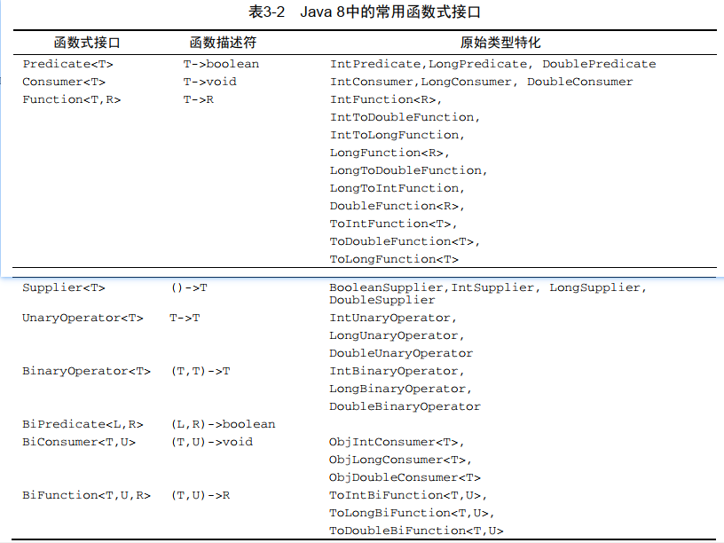
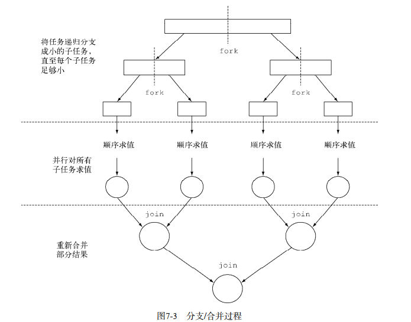
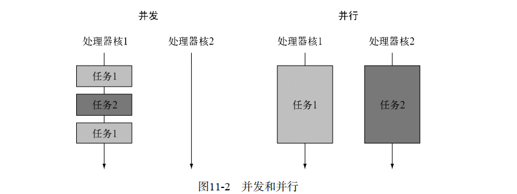
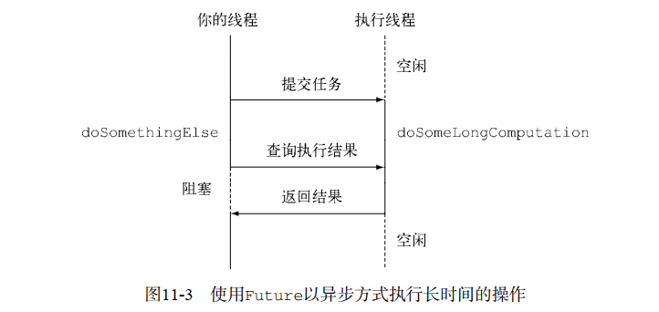
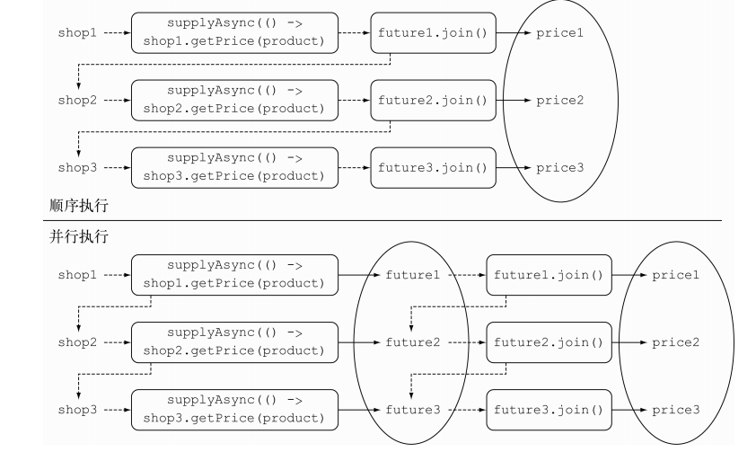

# java8实战

## 行为参数化

行为参数化就是可以帮助你处理频繁变更的需求的一种软件开发模式。一言以蔽之，它意味着拿出一个代码块，把它准备好却不去执行它。这个代码块以后可以被你程序的其他部分调用，这意味着你可以推迟这块代码的执行  
有个应用程序是帮助农民了解自己的库存的。这位农民可能想有一个查找库存中所有绿色苹果的功能。但到了第二天，他可能会告诉你：“其实我还想找出所有重量超过150克的苹果。”又过了两天，农民又跑回来补充道：“要是我可以找出所有既是绿色，重量也超过150克的苹果，那就太棒了。”你要如何应对这样不断变化的需求？  

### 案例展示

筛选绿苹果第一版：

```java
public class FilterApp {
    public static List<Apple> filterApple(List<Apple> inventory, String color) {
        ArrayList<Apple> result = new ArrayList<>();
        for (Apple apple : inventory) {
            if (color.equals(apple.getColor())) {
                result.add(apple);
            }
        }
        return result;
    }
}
class client {
    public static void main(String[] args) {
        FilterApp.filterApple(inventory,"green");
        FilterApp.filterApple(inventory,"red");
    }
}
```

位农民又跑回来和你说：“要是能区分轻的苹果和重的苹果就太好了。重的苹果一般是重量大于150克。”  

```java
 public static List<Apple> filterApplesByWeight(List<Apple> inventory, int weight) {
        List<Apple> result = new ArrayList<Apple>();
        for (Apple apple: inventory){
            if ( apple.getWeight() > weight ){
                result.add(apple);
            }
        }
        return result;
    }
```

解决方案不错，但是请注意，你复制了大部分的代码来实现遍历库存，并对每个苹果应用筛选条件。这有点儿令人失望，因为它打破了DRY（ Don’t Repeat Yourself，不要重复自己）的软件工程原则。  
下面使用行为参数化：

```java
public interface ApplePredicate {
    public boolean test(Apple apple);
}
 public static List<Apple> filterApples(List<Apple> inventory, ApplePredicate p) {
        ArrayList<Apple> result = new ArrayList<>();
        for (Apple apple : inventory) {
            if (p.test(apple)) {
                result.add(apple);
            }
        }
        return result;
    }
class client {
    public static void main(String[] args) {
        ArrayList<Apple> apples = new ArrayList<>();
        FilterApp.filterApples(apples, (Apple apple) -> "red".equals(apple.getColor())); // 根据颜色筛选
        FilterApp.filterApples(apples, (Apple apple) -> apple.getWeight() > 5);// 根据重量筛选
    }
}
```

对类型进行抽象化

```java
public static <T> List<T> filterApples(List<T> list, Predicate<T> p) {
        ArrayList<T> result = new ArrayList<>();
        for (T t : list) {
            if (p.test(t)) {
                result.add(t);
            }
        }
        return result;
    }
```

在你可以把filter方法用在香蕉、桔子、 Integer或是String的列表上了。这里有一个使用Lambda表达式的例子 

## Lambda表达式

### 环绕执行模式

 使用Lambda改进如下代码：

```java
public class FileUtil {
    public static String processFile() throws IOException {
        try (BufferedReader br = new BufferedReader(new FileReader(""))) {
            return br.readLine();
        }
    }
}
```

行为参数化：

```java
@FunctionalInterface
public interface BufferedReaderProcessor {
    String process(BufferedReader a) throws IOException;
}
public class FileUtil {
    public static String processFile(BufferedReaderProcessor bp) throws IOException {
        try (BufferedReader br = new BufferedReader(new FileReader(""))) {
            return bp.process(br);
        }
    }
}
class UseFileApp {
    public static void main(String[] args) throws IOException {
        String oneLine = FileUtil.processFile(br -> br.readLine());// 传递一个行为
        String twoLine = FileUtil.processFile(br -> br.readLine() + br.readLine());
    }
}
```

### 函数式接口

- Predicate

  ```java
  public class FunctionUtil {
      public static <T> List<T> filter(List<T> list, Predicate<T> p) {
          return list.stream()
                  .filter(p)
                  .collect(ArrayList::new, ArrayList::add, ArrayList::addAll);
      }
  }
  ```

- Consumer

  ```java
  public class FunctionUtil {
    public static <T> void forEach(List<T> list, Consumer<T> c) {
          for (T t : list) {
              c.accept(t);
          }
      }
  }
  class UtilApp{
      public static void main(String[] args) {
          FunctionUtil.forEach(Arrays.asList(1,3,5,7), System.out::println);
      }
  }
  ```

- Function

  ```java
  public class FunctionUtil {
     public static <T, R> List<R> map(List<T> list, Function<T, R> f) {
          List<R> result = new ArrayList<>();
          for (T t : list) {
              result.add(f.apply(t));
          }
          return result;
      }
  }
  
  class UtilApp {
      public static void main(String[] args) {
          FunctionUtil.map(Arrays.asList("lambdas", "in", "action"), String::length);
      }
  }
  ```

- 其他函数式接口

  回顾一下： Java类型要么是引用类型（比如Byte、 Integer、 Object、 List），要么是原始类型（比如int、 double、 byte、 char）。但是泛型（比如`Consumer<T>`中的T）只能绑定到引用类型。这是由泛型内部的实现方式造成的。因此，在Java里有一个将原始类型转换为对应的引用类型的机制。这个机制叫作装箱（boxing）。相反的操作，也就是将引用类型转换为对应 的原始类型，叫作拆箱（ unboxing）。 Java还有一个自动装箱机制来帮助程序员执行这一任务：装箱和拆箱操作是自动完成的。**但这在性能方面是要付出代价的。装箱后的值本质上就是把原始类型包裹起来，并保存在堆里。因此，装箱后的值需要更多的内存，并需要额外的内存搜索来获取被包裹的原始值。**  

  Java 8为我们前面所说的函数式接口带来了一个专门的版本，以便在输入和输出都是原始类型时避免自动装箱的操作。比如，在下面的代码中，使用IntPredicate就避免了对值1000进行装箱操作，但要是用Predicate<Integer>就会把参数1000装箱到一个Integer对象中：  

  ```java
  IntPredicate evenNumbers = (int i) -> i % 2 == 0;
  evenNumbers.test(1000); // 无装箱
  Predicate<Integer> oddNumbers = (Integer i) -> i % 2 == 1;
  oddNumbers.test(1000);// 装箱
  ```

  一般来说，针对专门的输入参数类型的函数式接口的名称都要加上对应的原始类型前缀，比如`DoublePredicate`、 `IntConsumer`、 `LongBinaryOperator`、 `IntFunction`等。 `Function`接口还有针对输出参数类型的变种： `ToIntFunction<T>`、 `IntToDoubleFunction`等。

    

     

### 局部变量

Lambda可以没有限制地捕获（也就是在其主体中引用）实例变量和静态变量。但局部变量必须显式声明为final，或事实上是final。换句话说， Lambda表达式只能捕获指派给它们的局部变量一次。（注：捕获实例变量可以被看作捕获最终局部变量this。）  
为什么局部变量有这些限制。第一，实例变量和局部变量背后的实现有一个关键不同。实例变量都存储在堆中，而局部变量则保存在栈上。如果Lambda可以直接访问局部变量，而且Lambda是在一个线程中使用的，则使用Lambda的线程，可能会在分配该变量的线程将这个变量收回之后，去访问该变量。因此， Java在访问自由局部变量时，实际上是在访问它
的副本，而不是访问原始变量。如果局部变量仅仅赋值一次那就没有什么区别了——因此就有了这个限制。  
第二，这一限制不鼓励你使用改变外部变量的典型命令式编程模式

### 方法引用

方法引用主要有三类。

- 指向静态方法的方法引用（例如Integer的parseInt方法， 写作`Integer::parseInt`）。  
- 指向任意类型实例方法的方法引用（例如String的length方 法,写作`String::length`）。  
- 指向现有对象的实例方法的方法引用（假设你有一个局部变量`expensiveTransaction`用于存放`Transaction`类型的对象，它支持实例方法getValue，那么你就可以写`expensiveTransaction::getValue`）。

第二种和第三种方法引用可能乍看起来有点儿晕。类似于`String::length`的第二种方法引用的思想就是你在引用一个对象的方法，而这个对象本身是Lambda的一个参数。例如， Lambda表达式`(String s) -> s.toUppeCase()`可以写作`String::toUpperCase`。但第三种方法引用指 的 是 ， 你 在 Lambda 中 调 用 一 个 已 经 存 在 的 外 部 对 象 中 的 方 法。 例 如 ， Lambda 表 达 式`()->expensiveTransaction.getValue()`可以写作`expensiveTransaction::getValue`

### 构造函数引用

无参：

```java
Supplier<Apple> c = () -> new Apple();
Apple apple = c.get();
// 相当于
Supplier<Apple> c1 = Apple::new;
Apple apple2 = c1.get();
```

一个参数：

```java
 public static void oneArg() {
        Function<Integer, Apple> c = Apple::new;
        Apple apple = c.apply(110);
 }

 public static List<Apple> map(List<Integer> list, Function<Integer, Apple> f) {
        ArrayList<Apple> result = new ArrayList<>();
        for (Integer each : list) {
            result.add(f.apply(each));
        }
        return result;
    }
```

两个参数：

```java
public static void twoArg() {
        BiFunction<String,Integer,Apple> c3 = Apple::new;
        Apple apple = c3.apply("green", 110);
 }
static Map<String,Function<Integer, Fruit>> map = new HashMap<>();
    static {
        map.put("apple",Apple::new);
        map.put("orange", Orange::new);
    }
    public static Fruit getFruit(String type,Integer weight){
        return map.get(type).apply(weight);
    }
```

### 方法引用实战

用不同的排序策略给一个Apple列表排序  

```java
public static void sort() {
        ArrayList<Apple> inventory = new ArrayList<>();
        inventory.sort((a,b) ->a.getWeight().compareTo(b.getWeight())); // lambda
        inventory.sort(Comparator.comparing(Fruit::getWeight)); // 方法引用
    }
```

### 复合Lambda表达式

- 比较器复合

  ```java
   public static void compare() {
          List<Apple> inventory = new ArrayList<Apple>();
          Comparator<Apple> defCom = Comparator.comparing(Apple::getWeight);
          inventory.sort(defCom); // 默认排序
          inventory.sort(defCom.reversed());// 逆序
          inventory.sort(defCom.reversed().thenComparing(Apple::getColor)); //先按照重量递减排序，重量相同则按照颜色排序
      }
  ```

- 谓词复合

  ```java
  public static void predicate() {
          Predicate<Apple> redApp = a -> "red".equals(a.getColor()); // 红苹果
          Predicate<Apple> redHeavyApp =
                  redApp.and(a -> a.getWeight() > 150);//既是红色，同时重量>150
          Predicate<Apple> redHeavyOrGreenApp =
                  redHeavyApp.or(a -> "green".equals(a.getColor()));// 要么是重150克以上的红苹果，要么是绿苹果
      }
  ```

- 函数复合

  ```java
  public static void funComposite() {
          Function<Integer,Integer> af = x -> x + 1;
          Function<Integer,Integer> ag = x -> x * 2;
          Function<Integer,Integer> ah = af.andThen(ag);// 先计算af,再计算ag
          int result = ah.apply(1); // 结果为4
  
          Function<Integer, Integer> f = x -> x + 1;
          Function<Integer, Integer> g = x -> x * 2;
          Function<Integer, Integer> h = f.compose(g); // 先计算g,结果为参数来计算f
          int results = h.apply(1); // 结果为3
      }
  ```

## 函数式数据处理

### 流

- **flatMap**

流的扁平化:对于一张单词 表 ,如何返回一张列表，列出里面各不相同的字符呢？例如，给定单词列表["Hello","World"]，你想要返回列表["H","e","l", "o","W","r","d"]。  

```java
public static void flatMap() {
        String[] words = {"Hello", "World"};
        List<String[]> arr = Arrays.stream(words).map(word -> word.split(""))
                .distinct()
                .collect(Collectors.toList()); // 很明显这样的返回值不是我们想要的

        List<Stream<String>> list = Arrays.stream(words).map(word -> word.split(""))
                .map(Arrays::stream)
                .distinct()
                .collect(Collectors.toList()); // don't fit

        List<String> result = Arrays.stream(words).map(word -> word.split(""))
                .flatMap(Arrays::stream)
                .distinct()
                .collect(Collectors.toList()); // what we want
    }
```

给定两个数字列表，如何返回所有的数对呢？例如，给定列表[1, 2, 3]和列表[3, 4]，应该返回[(1, 3), (1, 4), (2, 3), (2, 4), (3, 3), (3, 4)]。  

```java
 public static void flatMap2() {
        Integer[] a = {1, 2, 3};
        Integer[] b = {3, 4};
        List<int[]> pairs = Arrays.stream(a).flatMap(i -> Arrays.stream(b)
                .map(j -> new int[]{i, j}))
                .collect(Collectors.toList());
        
    }
```

- **reduce**

```java
// 求和
 public static void sum(List<Integer> numbers) {
        int sum = numbers.stream().
                reduce(0, (a, b) -> a + b);
    }
// 最小值
 public static void min(List<Integer> numbers) {
        Optional<Integer> min = numbers.stream()
                .reduce((x, y) -> x < y ? x : y);
    }
// 最后一个元素
public static void findLast(List<Integer> numbers) {
        Optional<Integer> first = numbers.stream().findFirst();
        Optional<Integer> last = numbers.stream().reduce((a, b) -> b);
    }
```

### 数值流

先看如下代码：

```java
int calories = menu.stream().map(Dish::getCalories)
					.reduce(0, Integer::sum);
```

这段代码的问题是，它有一个暗含的装箱成本。每个Integer都必须拆箱成一个原始类型，再进行求和。  
Java 8引入了三个原始类型特化流接口来解决这个问题： `IntStream`、 `DoubleStream`和`LongStream`，分别将流中的元素特化为int、 long和double，从而避免了暗含的装箱成本。每个接口都带来了进行常用数值归约的新方法，比如对数值流求和的sum，找到最大元素的max。此外还有在必要时再把它们转换回对象流的方法。要记住的是，这些特化的原因并不在于流的复杂性，而是装箱造成的复杂性——即类似int和Integer之间的效率差异。
**映射到数值流**

```java
 public static void mapToPri(List<Dish> menu){
        int calories = menu.stream().mapToInt(Dish::getCalories).sum();
    }
```

`mapToInt`会从每道菜中提取热量（用一个Integer表示），并返回一个`IntStream`（而不是一个`Stream<Integer>`）。然后你就可以调用`IntStream`接口中定义的sum方法，对卡路里求和了！请注意，如果流是空的， sum默认返回0。 `IntStream`还支持其他的方便方法，如max、min、average等
**转换回对象流**

```java
Stream<Integer> integerStream = menu.stream().mapToInt(Dish::getCalories).boxed();
```

**默认值OptionalInt**  

```java
 OptionalInt maxc = menu.stream().mapToInt(Dish::getCalories).max();
        int max = maxc.orElse(1);
```

**数值范围**  

```java
public static void range() {
        IntStream evenNum = IntStream.rangeClosed(1, 100).filter(n -> n % 2 == 0); //从1到100的偶数流，包括100
        //IntStream.range(1, 100).filter(n -> n % 2 == 0) 不包括100
    }
```

### 用流收集数据

**计算个数**

```java
public static void count(List<Dish> menu) {
        long count = menu.stream().count();
        Long result = menu.stream().collect(counting());
}
```

**找出菜单中热量最高的菜**  

```java
  public static void max(List<Dish> menu) {
        Comparator<Dish> dishCaloriesComparator =
                Comparator.comparingInt(Dish::getCalories);
        Optional<Dish> menus = menu.stream().collect(maxBy(dishCaloriesComparator));
        Optional<Dish> result = menu.stream().max(dishCaloriesComparator);
    }
```

**计算菜单热量总和**

```java
 public static void sum(List<Dish> menu) {
        Integer collect = menu.stream().collect(summingInt(Dish::getCalories));
        int sum = menu.stream().mapToInt(Dish::getCalories).sum();
    }
```

**计算热量的平均数** 

```java
public static void avg(List<Dish> menu) {
        Double avg = menu.stream().collect(averagingInt(Dish::getCalories));
    }
```

**IntSummaryStatistics**  

```java
 public static void intSum(List<Dish> menu) {
        IntSummaryStatistics menuStatics = menu
                .stream()
                .collect(summarizingInt(Dish::getCalories));
        long count = menuStatics.getCount();
        long sum = menuStatics.getSum();
        double avg = menuStatics.getAverage();
    }
```

**连接字符串**

```java
public static void join(List<Dish> menu) {
        String result = menu.stream()
                .map(Dish::getName)
                .collect(joining(","));
    }
```

`joining`在内部使用了`StringBuilder`来把生成的字符串逐个追加起来。此外还要注意，如果`Dish`类有一个`toString`方法来返回菜肴的名称，那你无需用提取每一道菜名称的函数来对原流做映射就能够得到相同的结果：
`String shortMenu = menu.stream().collect(joining());  `

### 使用reduce进行归约

我们已经讨论的所有收集器，都是一个可以用`reducing`工厂方法定义的归约过程的特殊情况而已。 `Collectors.reducing`工厂方法是所有这些特殊情况的一般化。可以说，先前讨论的案例仅仅是为了方便程序员而已 。使用`reduce`替代上述方法： 

```java
public static void reduce(List<Dish> menu) {
        // 菜单的总热量
        menu.stream().collect(reducing(0, Dish::getCalories, (i, j) -> i + j));
        Integer total = menu.stream().map(Dish::getCalories).reduce(Integer::sum).get();
        int sum = menu.stream().mapToInt(Dish::getCalories).sum();

        // 最高热量的菜
        menu.stream().collect(reducing((d1, d2) ->
                d1.getCalories() > d2.getCalories() ? d1 : d2));

        // 连接字符串
        String str = menu.stream().map(Dish::getName)
                .collect(reducing((s1, s2) -> s1 + s2)).get();
        String shortMenu = menu.stream()
                .collect( reducing( "",Dish::getName, (s1, s2) -> s1 + s2 ) );
    }
```

### 分组

**一级分组**

```java
public static void group(List<Dish> menu) {
        Map<Dish.Type, List<Dish>> dishesByType = menu.stream()
                .collect(groupingBy(Dish::getType)); // 按照菜单类型分组

        menu.stream().collect(groupingBy(dish -> {
            if (dish.getCalories() <= 400) {
                return CaloricLevel.DIET;
            } else if (dish.getCalories() <= 700) {
                return CaloricLevel.NORMAL;
            } else {
                return CaloricLevel.FAT;
            }
        }));
    }
```

**多级分组**

```java
public static void mulGroup(List<Dish> menu) {
        Map<Dish.Type, Map<CaloricLevel, List<Dish>>> result = menu
                .stream()
                .collect(groupingBy(Dish::getType, groupingBy(dish -> {
            if (dish.getCalories() <= 400) {
                return CaloricLevel.DIET;
            } else if (dish.getCalories() <= 700) {
                return CaloricLevel.NORMAL;
            } else {
                return CaloricLevel.FAT;
            }
        })));
    }
```

二级分组的结果就是像下面这样的两级Map：

```java
{MEAT={DIET=[chicken], NORMAL=[beef], FAT=[pork]},
FISH={DIET=[prawns], NORMAL=[salmon]},
OTHER={DIET=[rice, seasonal fruit], NORMAL=[french fries, pizza]}}  
```

**按子组收集数据** 

```java
public static void subGroup(List<Dish> menu) {
        Map<Dish.Type, Long> typesCount = menu
                .stream()
                .collect(groupingBy(Dish::getType, counting()));
        // // {MEAT=3, FISH=2, OTHER=4}
        Map<Dish.Type, Optional<Dish>> mostCaloricByType = menu.stream()
                .collect(groupingBy(Dish::getType, maxBy(Comparator.comparingInt(Dish::getCalories))));
        // {FISH=Optional[salmon], OTHER=Optional[pizza], MEAT=Optional[pork]}
    Map<Dish.Type, Integer> totalCaloriesByType =
                menu.stream().collect(groupingBy(Dish::getType,
                        summingInt(Dish::getCalories)));
    }
```

**把收集器的结果转换为另一种类型**  

```java
public static void convert(List<Dish> menu) {
        Map<Dish.Type, Dish> mostCaloricByType = menu.stream()
                .collect(groupingBy(Dish::getType,
                        collectingAndThen(maxBy(Comparator.comparingInt(Dish::getCalories)), Optional::get)));
        Map<Dish.Type, Dish> mostCaloricByTypes = menu.stream()
                .collect(toMap(Dish::getType, Function.identity(),
                        BinaryOperator.maxBy(Comparator.comparingInt(Dish::getCalories))));
    }
```

**groupingBy联合mapping 使用** 

```java
public static void mappings(List<Dish> menu) {
        Map<Dish.Type, Set<CaloricLevel>> caloricLevelsByType = menu.stream().collect(
                groupingBy(Dish::getType, mapping(
                        dish -> {
                            if (dish.getCalories() <= 400) return CaloricLevel.DIET;
                            else if (dish.getCalories() <= 700) return CaloricLevel.NORMAL;
                            else return CaloricLevel.FAT;
                        },
                        toSet())));
    }
```

这 里 ， 就 像 我 们 前 面 见 到 过 的 ， 传 递 给 映 射 方 法 的 转 换 函 数 将Dish映 射 成 了 它 的`CaloricLevel`：生成的CaloricLevel流传递给一个toSet收集器，它和toList类似，不过是把流中的元素累积到一个Set而不是List中，以便仅保留各不相同的值。如先前的示例所示，这个映射收集器将会收集分组函数生成的各个子流中的元素，让你得到这样的Map结果：  

```java
{OTHER=[DIET, NORMAL], MEAT=[DIET, NORMAL, FAT], FISH=[DIET, NORMAL]}
```

### 分区

分区是分组的特殊情况：由一个谓词（返回一个布尔值的函数）作为分类函数，它称分区函数。分区函数返回一个布尔值，这意味着得到的分组Map的键类型是Boolean，于是它最多可以分为两组——true是一组， false是一组  

```java
public static void partition(List<Dish> menu) {
        Map<Boolean, List<Dish>> partitionedMenu =
                menu.stream().collect(partitioningBy(Dish::isVegetarian));
    }
```

**多个收集器**

```java
public static void mulCollect(List<Dish> menu){
        Map<Boolean, Map<Dish.Type, List<Dish>>> vegetarianDishesByType = menu.stream()
                .collect(partitioningBy(Dish::isVegetarian, groupingBy(Dish::getType)));
        Map<Boolean, Dish> mostCaloricPartitionedByVegetarian =
                menu.stream().collect(
                        partitioningBy(Dish::isVegetarian,
                                collectingAndThen(
                                        maxBy(comparingInt(Dish::getCalories)),
                                        Optional::get)));
    }
```

**将数字按质数和非质数分区**  

```java
public static boolean isPrime(int candidate) {
        int candidateRoot = (int) Math.sqrt((double) candidate);
        return IntStream.rangeClosed(2, candidateRoot).noneMatch(i -> candidate % i == 0);
    }

    public static Map<Boolean, List<Integer>> partitionPrimes(int n) {
        return IntStream.rangeClosed(2, n).boxed()
                .collect(partitioningBy(candidate -> isPrime(candidate)));
    }
```

### 开发自己的收集器

**首先改进上面提到的区分质数跟非质数的例子:仅用质数做除数** 
 一个可能的优化是仅仅看看被测试数是不是能够被质数整除。要是除数本身都不是质数就用不着测了。所以我们可以仅仅用被测试数之前的质数来测试。然而我们目前所见的预定义收集器的问题，也就是必须自己开发一个收集器的原因在于，在收集过程中是没有办法访问部分结果的。这意味着，当测试某一个数字是否是质数的时候，你没法访问目前已经找到的其他质数的列表  

```java
public static boolean isPrime(List<Integer> primes, int candidate) {
        int candidateRoot = (int) Math.sqrt((double) candidate);
        return takeWhile(primes, i -> i <= candidateRoot)
                .stream()
                .noneMatch(p -> candidate % p == 0);
    }

    public static <A> List<A> takeWhile(List<A> list, Predicate<A> p) {
        int i = 0;
        for (A item : list) {
            if (!p.test(item)) {
                return list.subList(0, i);
            }
            i++;
        }
        return list;
    }
```

接着定义自己的接口

```java
public class PrimeNumbersCollector implements
        Collector<Integer, Map<Boolean, List<Integer>>, Map<Boolean, List<Integer>>> {
    @Override
    public Supplier<Map<Boolean, List<Integer>>> supplier() {
        return () -> new HashMap<Boolean, List<Integer>>() {
            {
                put(true, new ArrayList<Integer>());
                put(false, new ArrayList<Integer>());
            }
        };
    }

    @Override
    public BiConsumer<Map<Boolean, List<Integer>>, Integer> accumulator() {
        return (Map<Boolean, List<Integer>> acc, Integer candidate) -> {
            acc.get(isPrime(acc.get(true), candidate)).add(candidate);
        };
    }

    @Override
    public BinaryOperator<Map<Boolean, List<Integer>>> combiner() {
        return (Map<Boolean, List<Integer>> map1, Map<Boolean, List<Integer>> map2) -> {
            map1.get(true).addAll(map2.get(true));
            map1.get(false).addAll(map2.get(false));
            return map1;
        };
    }

    @Override
    public Function<Map<Boolean, List<Integer>>, Map<Boolean, List<Integer>>> finisher() {
        return Function.identity();
    }

    @Override
    public Set<Characteristics> characteristics() {
        return Collections.unmodifiableSet(EnumSet.of(IDENTITY_FINISH));
    }
}

```

**对结果容器应用最终转换： `finisher`方法**
在遍历完流后， `finisher`方法必须返回在累积过程的最后要调用的一个函数，以便将累加器对象转换为整个集合操作的最终结果。通常，就像`PrimeNumbersCollector`的情况一样，累加器对象恰好符合预期的最终结果，因此无需进行转换。所以finisher方法只需返回`identity`函数：
**合并两个结果容器： combiner方法**  
四个方法中的最后一个——combiner方法会返回一个供归约操作使用的函数，它定义了对流的各个子部分进行并行处理时，各个子部分归约所得的累加器要如何合并。
**characteristics方法**  
最后一个方法——`characteristics`会返回一个不可变的`Characteristics`集合，它定义了收集器的行为——尤其是关于流是否可以并行归约，以及可以使用哪些优化的提示。`Characteristics`是一个包含三个项目的枚举。

- UNORDERED——归约结果不受流中项目的遍历和累积顺序的影响。  
- CONCURRENT——accumulator函数可以从多个线程同时调用，且该收集器可以并行归约流。如果收集器没有标为UNORDERED，那它仅在用于无序数据源时才可以并行归约。  
- IDENTITY_FINISH——这表明完成器方法返回的函数是一个恒等函数，可以跳过。这种情况下，累加器对象将会直接用作归约过程的最终结果。这也意味着，将累加器A不加检查地转换为结果R是安全的  

**比较收集器的性能：**

```java
public class CollectorHarness {
    public static void main(String[] args) {
        long fastest = Long.MAX_VALUE;
        for (int i = 0; i < 10; i++) {
            long start = System.nanoTime();
            PrimeCollect.partitionPrimes(1_000_000); // 结果为560
            partitionPrimesWithCustomCollector(1_000_000); // 结果为340
            long duration = (System.nanoTime() - start) / 1_000_000;
            if (duration < fastest) {
                fastest = duration;
            }
        }
        System.out.println("Fastest execution done in " + fastest + " msecs");
    }
    public static Map<Boolean, List<Integer>> partitionPrimesWithCustomCollector(int n) {
        return IntStream.rangeClosed(2, n).boxed()
                .collect(new PrimeNumbersCollector());
    }
}
```

## 并行数据处理与性能

### 并行流

```java
public class ParallelStreams {
    public static long sequentialSum(long n) {
        return Stream.iterate(1L, i -> i + 1)
                .limit(n)
                .parallel()
                .reduce(0L, Long::sum);
    }

    public static long iterativeSum(long n) {
        long result = 0;
        for (long i = 1L; i <= n; i++) {
            result += i;
        }
        return result;
    }

    public static long sequentialSums(long n) {
        return Stream.iterate(1L, i -> i + 1)
                .limit(n)
                .reduce(0L, Long::sum);
    }

    public static long rangedSum(long n) {
        return LongStream.rangeClosed(1, n)
                .reduce(0L, Long::sum);
    }

    public static long parallelRangedSum(long n) {
        return LongStream.rangeClosed(1, n)
                .parallel()
                .reduce(0L, Long::sum);
    }
}
```

分别对以上四个方法进行性能测试，以下为测试代码，注释为测试结果

```java
public class ParallelStream {
    public static long measureSumPer(Function<Long, Long> adder, long n) {
        long fastest = Long.MAX_VALUE;
        for (int i = 0; i < 10; i++) {
            long start = System.nanoTime();
            long sum = adder.apply(n);
            long duration = (System.nanoTime() - start) / 1_000_000;
            System.out.println("Result: " + sum);
            if (duration < fastest) fastest = duration;
        }
        return fastest;
    }

    public static void main(String[] args) {
        System.out.println("Sequential sum done in:" +
                measureSumPer(ParallelStreams::iterativeSum, 10_000_000) + " msecs"); // 8 msecs
        System.out.println("Sequential sum done in:" +
                measureSumPer(ParallelStreams::sequentialSums, 10_000_000) + " msecs"); // 145 msecs
        System.out.println("Sequential sum done in:" +
                measureSumPer(ParallelStreams::sequentialSum, 10_000_000) + " msecs"); // 281 msecs
        System.out.println("Sequential sum done in:" +
                measureSumPer(ParallelStreams::rangedSum, 10_000_000) + " msecs"); // 8 msecs
        System.out.println("Sequential sum done in:" +
                measureSumPer(ParallelStreams::parallelRangedSum, 10_000_000) + " msecs");// 4 msecs
    }
}
```

用传统for循环的迭代版本执行起来应该会快很多，因为它更为底层，更重要的是不需要对原始类型做任何装箱或拆箱操作。  使用Stream有以下几个问题：

1. `iterate`生成的是装箱的对象，必须拆箱成数字才能求和；  
2. 我们很难把`iterate`分成多个独立块来并行执行 (也就是为什么调用`parallel`没有任何效果)
3. `LongStream.rangeClosed`直接产生原始类型的long数字，没有装箱拆箱的开销。  
4. `LongStream.rangeClosed`会生成数字范围， 很容易拆分为独立的小块  

**正确使用并行流**
先看例子

```java
 public static long sideEffectParallelSum(long n) {
        Accumulator accumulator = new Accumulator();
        LongStream.rangeClosed(1, n).parallel().forEach(accumulator::add);
        return accumulator.total;
    }
public static void main(String[] args) {
        System.out.println("SideEffect parallel sum done in: " +
                measureSumPer(ParallelStreams::sideEffectParallelSum, 10_000_000L) + "msecs");
    }
/**
     * Result: 30449226149347
     * Result: 36607772808669
     * Result: 21428990404745
     * Result: 17401489517013
     * Result: 23080876476668
     * Result: 16712478270742
     * Result: 22630709630199
     * Result: 18032786778608
     * Result: 21578821758039
     * Result: 15541389282411
     * SideEffect parallel sum done in: 4msecs
     */
```

这回方法的性能无关紧要了，唯一要紧的是每次执行都会返回不同的结果，都离正确值50000005000000差很远。这是由于多个线程在同时访问累加器，执行total += value，而这一句虽然看似简单，却不是一个原子操作。问题的根源在于， forEach中调用的方法有副作用，它会改变多个线程共享的对象的可变状态。要是你想用并行Stream又不想引发类似的意外，就必须避免这种情况。  

### 高效使用并行流  

- 留意装箱。自动装箱和拆箱操作会大大降低性能。 Java 8中有原始类型流（ `IntStream`、`LongStream`、 `DoubleStream`）来避免这种操作，但凡有可能都应该用这些流。  
- 有些操作本身在并行流上的性能就比顺序流差。特别是`limit`和`findFirst`等依赖于元素顺序的操作，它们在并行流上执行的代价非常大。例如， `findAny`会比`findFirst`性能好，因为它不一定要按顺序来执行。你总是可以调用`unordered`方法来把有序流变成无序流。那么，如果你需要流中的n个元素而不是专门要前n个的话，对无序并行流调用`limit`可能会比单个有序流（比如数据源是一个`List`）更高效。  
- 还要考虑流的操作流水线的总计算成本。设N是要处理的元素的总数， Q是一个元素通过流水线的大致处理成本，则N*Q就是这个对成本的一个粗略的定性估计。 Q值较高就意味着使用并行流时性能好的可能性比较大。  
- 对于较小的数据量，选择并行流几乎从来都不是一个好的决定。并行处理少数几个元素的好处还抵不上并行化造成的额外开销。  
- 要考虑流背后的数据结构是否易于分解。例如， `ArrayList`的拆分效率比`LinkedList`高得多，因为前者用不着遍历就可以平均拆分，而后者则必须遍历。  

### 分支/合并框架  



```java
public class ForkJoinSumCalculator extends RecursiveTask<Long> {
    private final long[] numbers;
    private final int start;
    private final int end;
    public static final long THRESHOLD = 10_000;

    public ForkJoinSumCalculator(long[] numbers) {
        this(numbers, 0, numbers.length);
    }

    private ForkJoinSumCalculator(long[] numbers, int start, int end) {
        this.numbers = numbers;
        this.start = start;
        this.end = end;
    }

    @Override
    protected Long compute() {
        int length = end - start;
        if (length <= THRESHOLD) {
            return computeSequentially(); // 小于设定的值则直接计算结果
        }
        ForkJoinSumCalculator leftTask =
                new ForkJoinSumCalculator(numbers, start, start + length / 2);
        leftTask.fork(); // 利用另一个线程异步执行新创建的子任务创建一个任
        ForkJoinSumCalculator rightTask =
                new ForkJoinSumCalculator(numbers, start + length / 2, end);
        Long rightResult = rightTask.compute();
        Long leftResult = leftTask.join();
        return rightResult + leftResult;
    }

    private long computeSequentially() {
        long sum = 0;
        for (int i = start; i < end; i++) {
            {
                sum += numbers[i];
            }
        }
        return sum;
    }

    public static long forkJoinSum(long n) {
        long[] numbers = LongStream.rangeClosed(1, n).toArray();
        ForkJoinTask<Long> task = new ForkJoinSumCalculator(numbers);
        return new ForkJoinPool().invoke(task);
    }
}
```

请注意在实际应用时，使用多个ForkJoinPool是没有什么意义的。正是出于这个原因，一般来说把它实例化一次，然后把实例保存在静态字段中，使之成为单例，这样就可以在软件中任何部分方便地重用了。这里创建时用了其默认的无参数构造函数，这意味着想让线程池使用JVM能够使用的所有处理器。更确切地说，该构造函数将使用Runtime.availableProcessors的返回值来决定线程池使用的线程数。请注意availableProcessors方法虽然看起来是处理器，但它实际上返回的是可用内核的数量，包括超线程生成的虚拟内核。  

## 重构、测试、调试

### 改善代码灵活性

**Lambda代替内部类**

```java
public class ReStructure {
    public void lambdaPrefer() {
        Runnable r = new Runnable() {
            @Override
            public void run() {
                System.out.println("Say Hello");
            }
        };
        Runnable r2 = () -> System.out.println("Say Hello again!");
    }
}
```

**方法引用**

```java
public void methodRef(List<Dish> menu) {
        Map<CaloricLevel, List<Dish>> dishesByCaloricLevel =
                menu.stream()
                        .collect(
                                groupingBy(dish -> {
                                    if (dish.getCalories() <= 400) return CaloricLevel.DIET;
                                    else if (dish.getCalories() <= 700) return CaloricLevel.NORMAL;
                                    else return CaloricLevel.FAT;
                                }));
    }

public void methodRef(List<Dish> menu) {
        Map<CaloricLevel, List<Dish>> dishesByCaloricLevel =
                menu.stream()
                        .collect(
                                groupingBy(Dish::getCaloricLevel));
    }

public class Dish {
    public CaloricLevel getCaloricLevel(){
        if (this.getCalories() <= 400) return CaloricLevel.DIET;
        else if (this.getCalories() <= 700) return CaloricLevel.NORMAL;
        else return CaloricLevel.FAT;
    }
}
```

### 使用 Lambda 重构设计模式  

**策略模式**
先看使用Lambda前的代码

```java
public interface ValidationStrategy {
    boolean execute(String s);
}
public class IsAllLowerCase implements ValidationStrategy {
    @Override
    public boolean execute(String s) {
        return s.matches("[a-z]+");
    }
}
public class IsNumeric implements ValidationStrategy {
    @Override
    public boolean execute(String s) {
        return s.matches("\\d+");
    }
}
public class Validator {
    private final ValidationStrategy strategy;

    public Validator(ValidationStrategy strategy) {
        this.strategy = strategy;
    }
    public boolean validate(String a){
        return strategy.execute(a);
    }
    public void oldFashion(){
        Validator numericValidator = new Validator(new IsNumeric());
        boolean b1 = numericValidator.validate("aaaa");
        Validator lowerCaseValidator = new Validator(new IsAllLowerCase ());
        boolean b2 = lowerCaseValidator.validate("bbbb");
    }
}
```

**使用Lambda**

```java
 public void lambda(){
        Validator numericValidator =
                new Validator((String s) -> s.matches("[a-z]+"));
        boolean b1 = numericValidator.validate("aaaa");
        Validator lowerCaseValidator =
                new Validator((String s) -> s.matches("\\d+"));
        boolean b2 = lowerCaseValidator.validate("bbbb");
    }
}
```

**模板方法**
老方式

```java
public abstract class OnlineBanking {
    public void processCustomer(int id) {
        Custommer c = Database.getCustomerById(id);
        makeCustomerHappy(c);
    }
    abstract void makeCustomerHappy(Customer c);
}
```

processCustomer方法搭建了在线银行算法的框架：获取客户提供的ID，然后提供服务让用户满意。不同的支行可以通过继承OnlineBanking类，对该方法提供差异化的实现。  
**使用Lambda表达式**  

```java
public class OnlineBankingLambda {
    public void processCustomer(int id, Consumer<Customer> make) {
        Customer c = Database.getCustomerById(id);
        make.accept(c);
    }

    public static void main(String[] args) {
        new OnlineBankingLambda().processCustomer(1337, (Customer c) ->
                System.out.println("Hello " + c.getName())); // 这里传入具体的处理
    }
}
```

**观察者模式**
你需要为Twitter这样的应用设计并实现一个定制化的通知系统。想法很简单：好几家报纸机构，比如《纽约时报》《卫报》以及《世界报》都订阅了新闻，他们希望当接收的新闻中包含他们感兴趣的关键字时，能得到特别通知。  

```java
public interface Observer {
    void notify(String tweet);
}
public class NYTimes implements Observer {
    @Override
    public void notify(String tweet) {
        if (tweet != null && tweet.contains("money")) {
            System.out.println("Breaking news in NY! " + tweet);
        }
    }
}
public class LeMonde implements Observer {
    @Override
    public void notify(String tweet) {
        if(tweet != null && tweet.contains("wine")){
            System.out.println("Today cheese, wine and news! " + tweet);
        }
    }
}
public class Guardian implements Observer{
    @Override
    public void notify(String tweet) {
        if(tweet != null && tweet.contains("queen")){
            System.out.println("Yet another news in London... " + tweet);
        }
    }
}
public interface Subject {
    void registerObserver(Observer o);
    void notifyObservers(String tweet);
}
public class Feed implements Subject {
    private final List<Observer> observers = new ArrayList<>();
    @Override
    public void registerObserver(Observer o) {
        this.observers.add(o);
    }

    @Override
    public void notifyObservers(String tweet) {
        observers.forEach(o -> o.notify(tweet));
    }
}
public class Client {
    public static void main(String[] args) {
        Feed f = new Feed();
        f.registerObserver(new NYTimes());
        f.registerObserver(new Guardian());
        f.registerObserver(new LeMonde());
        f.notifyObservers("The queen said her favourite book is Java 8 in Action!");
    }
}
```

**使用Lambda表达式**  
很明显这种方式比较使用于处理逻辑相对简单的情况

```java
public class Client {
    public static void main(String[] args) {
        Feed f = new Feed();
        f.registerObserver((String tweet) -> {
            if(tweet != null && tweet.contains("money")){
                System.out.println("Breaking news in NY! " + tweet);
            }
        });
        f.registerObserver((String tweet) -> {
            if(tweet != null && tweet.contains("queen")){
                System.out.println("Yet another news in London... " + tweet);
            }
        });
    }
}
```

**责任链模式**

不使用Lambda表达式的情况

```java
public abstract class ProcessingObject<T> {
    protected ProcessingObject<T> successor;

    public void setSuccessor(ProcessingObject<T> successor) {
        this.successor = successor;
    }
    public T handle(T input){
        T t = handleWord(input);
        if (successor != null) {
            return successor.handle(input);
        }
        return t;
    }
    abstract protected T handleWord(T input);
}
public class SpellCheckerProcessing extends ProcessingObject<String> {
    @Override
    protected String handleWord(String text) {
        return text.replaceAll("labda", "lambda");
    }
}
public class HeaderTextProcessing extends ProcessingObject<String> {
    @Override
    protected String handleWord(String text) {
        return "From Raoul, Mario and Alan: " + text;
    }
}
public class Responsibility {
    public static void main(String[] args) {
        ProcessingObject<String> p1 = new HeaderTextProcessing();
        ProcessingObject<String> p2 = new SpellCheckerProcessing();
        p1.setSuccessor(p2);
        String result = p1.handle("Aren't labdas really sexy?!!");
        System.out.println(result);
    }
}

```

使用Lambda的情况

```java
public class Responsibility {
    public static void main(String[] args) {
        UnaryOperator<String> headerProcessing =
                (String text) -> "From Raoul, Mario and Alan: " + text;
        UnaryOperator<String> spellCheckerProcessing =
                (String text) -> text.replaceAll("labda", "lambda");
        Function<String, String> pipeline =
                headerProcessing.andThen(spellCheckerProcessing);
        String result = pipeline.apply("Aren't labdas really sexy?!!");
    }
}
```

## 默认方法

### 抽象类和抽象接口

那么抽象类和抽象接口之间的区别是什么呢？它们不都能包含抽象方法和包含方法体的实现吗？
首先，一个类只能继承一个抽象类，但是一个类可以实现多个接口。
其次，一个抽象类可以通过实例变量（字段）保存一个通用状态，而接口是不能有实例变量的。

### 不同类型的兼容性  

变更对Java程序的影响大体可以分成三种类型的兼容性，分别是：二进制级的兼容、源代码级的兼容，以及函数行为的兼容。 刚才我们看到，向接口添加新方法是二进制级的兼容，但最终编译实现接口的类时却会发生编译错误。了解不同类型兼容性的特性是非常有益的，下面我们会深入介绍这部分的内容。

二进制级的兼容性表示现有的二进制执行文件能无缝持续链接（包括验证、准备和解析）和运行。比如，为接口添加一个方法就是二进制级的兼容，这种方式下，如果新添加的方法不被调用，接口已经实现的方法可以继续运行，不会出现错误。 

简单地说，源代码级的兼容性表示引入变化之后，现有的程序依然能成功编译通过。比如，向接口添加新的方法就不是源码级的兼容，因为遗留代码并没有实现新引入的方法，所以它们无法顺利通过编译。

最后，函数行为的兼容性表示变更发生之后，程序接受同样的输入能得到同样的结果。比如，为接口添加新的方法就是函数行为兼容的，因为新添加的方法在程序中并未被调用（抑或该接口在实现中被覆盖了）。         

### 解决冲突的规则  

我们知道Java语言中一个类只能继承一个父类，但是一个类可以实现多个接口。随着默认方法在Java 8中引入，有可能出现一个类继承了多个方法而它们使用的却是同样的函数签名。这种情况下，类会选择使用哪一个函数？  

```java
public interface A {
    default void hello() {
        System.out.println("Hello from A");
    }
}
public interface B extends A {
    default void hello() {
        System.out.println("Hello from B");
    }
}
public class C implements B, A {
    public static void main(String[] args) {
        new C().hello();
    }
}
// Hello from B
```

三条规则：

1. 类中的方法优先级最高。类或父类中声明的方法的优先级高于任何声明为默认方法的优先级。  
2. 如果无法依据第一条进行判断，那么子接口的优先级更高：函数签名相同时，优先选择拥有最具体实现的默认方法的接口，即如果B继承了A，那么B就比A更加具体。
3. 最后，如果还是无法判断，继承了多个接口的类必须通过显式覆盖和调用期望的方法，  显式地选择使用哪一个默认方法的实现  

```java
class D implements A {
}

class E extends D implements B, A {
    public static void main(String[] args) {
        new E().hello();
    }
}
// Hello from B
```

依据规则(1)，类中声明的方法具有更高的优先级。 D并未覆盖hello方法，可是它实现了接口A。所以它就拥有了接口A的默认方法。规则(2)说如果类或者父类没有对应的方法，那么就应该选择提供了最具体实现的接口中的方法。因此，编译器会在接口A和接口B的hello方法之间做选择。由于B更加具体，所以程序会再次打印输出“Hello from B”。  

## Optional

### 为什么使用Optional

```java
public class Person {
    private Optional<Car> car; // 人可能有车，也可能没有车
    public Optional<Car> getCar() { return car; }
}
public class Car {
    private Optional<Insurance> insurance; //车可能进行了保险，也可能没有保险
    public Optional<Insurance> getInsurance() { return insurance; }
}
public class Insurance {
    private String name; // 保险公司必须有名字
    public String getName() { return name; }
}
```

代码中person引用的是`Optional<Car>`，而`car`引用的是`Optional<Insurance>`，这种方式非常清晰地表达了你的模型中一个`person`可能拥有也可能没有`car`的情形，同样， `car`可能进行了保险，也可能没有保险。与此同时，我们看到`insurance`公司的名称被声明成`String`类型，而不是`Optional<String>`，这非常清楚地表明声明为insurance公司的类型必须提供公司名称。使用这种方式，一旦解引用`insurance`公司名称时发生`NullPointerException`，你就能非常确定地知道出错的原因，不再需要为其添加null的检查，因为null的检查只会掩盖问题，并未真正地修复问题。`insurance`公司必须有个名字，所以，如果你遇到一个公司没有名称，你需要调查你的数据出了什么问题，而不应该再添加一段代码，将这个问题隐藏。  

在你的代码中始终如一地使用`Optional`，能非常清晰地界定出变量值的缺失是结构上的问题，还是你算法上的缺陷，抑或是你数据中的问题。另外，我们还想特别强调，引入`Optional`类的意图并非要消除每一个`null`引用。与此相反，它的目标是帮助你更好地设计出普适的API，让程序员看到方法签名，就能了解它是否接受一个`Optional`的值。这种强制会让你更积极地将变量从`Optional`中解包出来，直面缺失的变量值。  

### 两个 Optional 对象的组合  

我们还假设你想要该方法的一个`null`安全的版本，它接受两个`Optional`对象作为参数，返回值是一`Optional<Insurance>`对象，如果传入的任何一个参数值为空，它的返回值亦为空。 `Optional`类还提供了一个`isPresent`方法，如果`Optional`对象包含值，该方法就返回true，所以你的第一想法可能是通过下面这种方式实现该方法：  

```java
public class Client {
    public Optional<Insurance> findCheapestInsurance(Optional<Person> person,
                                                     Optional<Car> car) {
        if (person.isPresent() && car.isPresent()) {
            return Optional.of(findInsurance(person.get(), car.get()));
        } else {
            return Optional.empty();
        }
    }
}
```

改用Optional

```java
public class Client {
    public Optional<Insurance> findCheapestInsurance(Optional<Person> person,
                                                     Optional<Car> car) {
        return person.flatMap(p -> car.map(c -> findInsurance(p, c)));
    }
}
```

### 异常与 Optional   

```java
public class OptionalUtility {
    public static Optional<Integer> stringToInt(String s) {
        try {
            return Optional.of(Integer.parseInt(s));
        } catch (NumberFormatException e) {
            return Optional.empty();
        }
    }
}
class client{
    public int readDuration(Properties props, String name) {
        return Optional.ofNullable(props.getProperty(name))
                .flatMap(OptionalUtility::stringToInt)
                .filter(i -> i > 0)
                .orElse(0);
    }
}
```

## CompletableFuture: 组合式异步编程

很多场景应用了多任务程序设计。第7章中介绍的分支/合并框架以及并行流是实现并行处理的宝贵工具；它们将一个操作切分为多个子操作，在多个不同的核、 CPU甚至是机器上并行地执行这些子操作。与此相反，如果你的意图是实现并发，而非并行，或者你的主要目标是在同一个CPU上执行几个松耦合的任务，充分利用CPU的核，让其足够忙碌，从而最大化程序的吞吐量，那么你其实真正想做的是避免因为等待远程服务的返回，或者对数据库的查询，而阻塞线程的执行，浪费宝贵的计算资源，因为这种等待的时间很可能相当长。通过本章中你会了解， `Future`接口，尤其是它的新版实现`CompletableFuture`，是处理这种情况的利器。图11-2说明了并行和并发的区别。  



### Future 接口  

`Future`接口在Java 5中被引入，设计初衷是对将来某个时刻会发生的结果进行建模。它建模了一种异步计算，返回一个执行运算结果的引用，当运算结束后，这个引用被返回给调用方。在`Future`中触发那些潜在耗时的操作把调用线程解放出来，让它能继续执行其他有价值的工作，不再需要呆呆等待耗时的操作完成。打个比方，你可以把它想象成这样的场景：你拿了一袋子衣服到你中意的干洗店去洗。干洗店的员工会给你张发票，告诉你什么时候你的衣服会洗好（这就是一个`Future`事件）。衣服干洗的同时，你可以去做其他的事情。 `Future`的另一个优点是它比更底层的`Thread`更易用。要使用`Future`，通常你只需要将耗时的操作封装在一个`Callable`对象中，再将它提交给`ExecutorService`，就万事大吉了。下面这段代码展示了Java 8之前使用`Future`的一个例子。  

```java
public class FutureImpl {
    public void useFutureBefore() {
        // 创建该对象，通过它可以向线程池提交任务
        ExecutorService executor = Executors.newCachedThreadPool();
        Future<Double> future = executor.submit(new Callable<Double>() { // 提交一个Callable对象
            @Override
            public Double call() throws Exception {
                return doSomeLongComputation(); // 以异步方式在新的线程池中执行耗时的操作
            }
        });
        doSomethingElse(); // 异步操作进行的同时，可以做其他的事情
        try {
            // 获取异步操作的结果，如果最终被阻塞，无法得到结果，那么在最多等待1秒中之后退出
            Double result = future.get(1, TimeUnit.SECONDS);
        } catch (InterruptedException e) {
            // 当前线程在等待过程中被中断
        } catch (ExecutionException e) {
            // 计算抛出一个异常
        } catch (TimeoutException e) {
            // 在Future对象完成之前超过已过期
        }
    }
}
```

正像图11-3介绍的那样，这种编程方式让你的线程可以在ExecutorService以并发方式调用另一个线程执行耗时操作的同时，去执行一些其他的任务。接着，如果你已经运行到没有异步操作的结果就无法继续任何有意义的工作时，可以调用它的get方法去获取操作的结果。如果操作已经完成，该方法会立刻返回操作的结果，否则它会阻塞你的线程，直到操作完成，返回相应的结果。  你能想象这种场景存在怎样的问题吗？如果该长时间运行的操作永远不返回了会怎样？为了处理这种可能性，虽然Future提供了一个无需任何参数的get方法，我们还是推荐大家使用重载版本的get方法，它接受一个超时的参数，通过它，你可以定义你的线程等待Future结果的最长时间，而不是像代码清单11-1中那样永无止境地等待下去。  



### 使用 CompletableFuture 构建异步应用  

为了展示`CompletableFuture`的强大特性，我们会创建一个名为“最佳价格查询器”（ best-price-finder）的应用，它会查询多个在线商店，依据给定的产品或服务找出最低的价格  

> 同步API与异步API  
> 同步API其实只是对传统方法调用的另一种称呼：你调用了某个方法，调用方在被调用方
> 运行的过程中会等待，被调用方运行结束返回，调用方取得被调用方的返回值并继续运行。即
> 使调用方和被调用方在不同的线程中运行，调用方还是需要等待被调用方结束运行，这就是阻
> 塞式调用这个名词的由来。
> 与此相反， 异步API会直接返回，或者至少在被调用方计算完成之前，将它剩余的计算任
> 务交给另一个线程去做，该线程和调用方是异步的——这就是非阻塞式调用的由来。执行剩余
> 计算任务的线程会将它的计算结果返回给调用方。返回的方式要么是通过回调函数，要么是由
> 调用方再次执行一个“等待，直到计算完成”的方法调用。这种方式的计算在I/O系统程序设
> 计中非常常见：你发起了一次磁盘访问，这次访问和你的其他计算操作是异步的，你完成其他
> 的任务时，磁盘块的数据可能还没载入到内存，你只需要等待数据的载入完成。  

```java
public class Shop {
    Random random = new Random();

    private double calculatePrice(String pro) {
        return random.nextDouble() * pro.charAt(0) + pro.charAt(1);
    }

    public Future<Double> getPriceAsync(String product) {
        // 创建一个包含计算结果的CompletableFuture对象
        CompletableFuture<Double> future = new CompletableFuture<>();
        // 在另一个线程中以异步的方式执行计算
        new Thread(() -> {
            double price = calculatePrice(product);
            future.complete(price); // 设置返回值
        }).start();
        return future;// 无需等待还没结束的计算，直接返回该对象
    }
}

class ShopTest {
    private void asyncGetPrice() {
        Shop shop = new Shop();
        long start = System.nanoTime();
        Future<Double> futurePrice = shop.getPriceAsync("my favorite product");
        long invocationTime = ((System.nanoTime() - start) / 1_000_000);
        System.out.println("Invocation returned after " + invocationTime
                + " msecs");
        // 执行更多任务，比如查询其他商店
        doSomethingElse();
        // 在计算商品价格的同时
        double price = 0;
        try {
            price = futurePrice.get();
            System.out.printf("Price is %.2f%n", price);
        } catch (InterruptedException | ExecutionException e) {
            e.printStackTrace();
        }
        long retrievalTime = ((System.nanoTime() - start) / 1_000_000);
        System.out.println("Price returned after " + retrievalTime + " msecs");
    }

    private void doSomethingElse() {
    }
}
```

如果没有意外，我们目前开发的代码工作得很正常。但是，如果价格计算过程中产生了错误会怎样呢？非常不幸，这种情况下你会得到一个相当糟糕的结果：用于提示错误的异常会被限制在试图计算商品价格的当前线程的范围内，最终会杀死该线程，而这会导致等待`get`方法返回结果的客户端永久地被阻塞。
客户端可以使用重载版本的`get`方法，它使用一个超时参数来避免发生这样的情况。这是一种值得推荐的做法，你应该尽量在你的代码中添加超时判断的逻辑，避免发生类似的问题。使用这种方法至少能防止程序永久地等待下去，超时发生时，程序会得到通知发生了`TimeoutException`。不过，也因为如此，你不会有机会发现计算商品价格的线程内到底发生了什么问题才引发了这样的失效。为了让客户端能了解商店无法提供请求商品价格的原因，你需要使用`CompletableFuture`的`completeExceptionally`方法将导致`CompletableFuture`内发生问题的异常抛出。  
**处理异常**

```java
public Future<Double> getPriceAsync(String product) {
        // 创建一个包含计算结果的CompletableFuture对象
        CompletableFuture<Double> future = new CompletableFuture<>();
        // 在另一个线程中以异步的方式执行计算
        new Thread(() -> {
            try {
                double price = calculatePrice(product);
                future.complete(price); // 如果价格计算正常结束，完成Future操作并设置商品价格
            } catch (Exception e) {
                future.completeExceptionally(e);// 否则抛出导致失败的异常，完成这次future操作
            }
        }).start();
        return future;// 无需等待还没结束的计算，直接返回该对象
    }
```

**最终优化**

```java
	//  该种方式实现与上面手动实现的方式一致
    public Future<Double> getPriceAsync(String pro){
        return CompletableFuture.supplyAsync(() -> calculatePrice(pro));
    }
```

`supplyAsync`方法接受一个生产者（ `Supplier`）作为参数，返回一个`CompletableFuture`对象，该对象完成异步执行后会读取调用生产者方法的返回值。生产者方法会交由`ForkJoinPool`池中的某个执行线程（ `Executor`）运行，但是你也可以使用`supplyAsync`方法的重载版本，传递第二个参数指定不同的执行线程执行生产者方法。一般而言，向`CompletableFuture`的工厂方法传递可选参数，指定生产者方法的执行线程是可行的  

### 应用

在一个商店列表中，去使用异步的方式查询同一个商品的价格，找出最佳价格

使用CompletableFuture版本

```java
public class Shop {
    Random random = new Random();

    public String getName() {
        return name;
    }

    private String name;

    public Shop(String name) {
        this.name = name;
    }

    public double getPrice(String pro) {
        return random.nextDouble() * pro.charAt(0) + pro.charAt(1);
    }
}
public class Application {
    private List<String> findPrices(String product) {
        List<Shop> shops = Arrays.asList(new Shop("BestPrice"),
                new Shop("LetsSaveBig"),
                new Shop("MyFavoriteShop"),
                new Shop("BuyItAll"));
        List<CompletableFuture<String>> priceFutures =
                shops.stream()
                        .map(shop -> CompletableFuture.supplyAsync(
                                () -> String.format("%s price is %.2f",
                                        shop.getName(), shop.getPrice(product))))
                        .collect(toList());
        return priceFutures.stream().map(CompletableFuture::join)
                .collect(Collectors.toList());
    }
}
```

注意到了吗？这里使用了两个不同的Stream流水线，而不是在同一个处理流的流水线上一个接一个地放置两个map操作——这其实是有缘由的。考虑流操作之间的延迟特性，如果你在单一流水线中处理流，发向不同商家的请求只能以同步、顺序执行的方式才会成功。因此，每个创建CompletableFuture对象只能在前一个操作结束之后执行查询指定商家的动作、通知join方法返回计算结果。图11-4解释了这些重要的细节。  



上半部分展示了使用单一流水线处理流的过程，我们看到，执行的流程（以虚线标识）是顺序的。事实上，新的`CompletableFuture`对象只有在前一个操作完全结束之后，才能创建。与此相反，图的下半部分展示了如何先将`CompletableFutures`对象聚集到一个列表中（即图中以椭圆表示的部分），让对象们可以在等待其他对象完成操作之前就能启动。  不过该版本还有改进的地方。

使用并行流的版本

```java

  private List<String> findPricePara(String prod) {
        List<Shop> shops = Arrays.asList(new Shop("BestPrice"),
                new Shop("LetsSaveBig"),
                new Shop("MyFavoriteShop"),
                new Shop("BuyItAll"));
        return shops.parallelStream()
                .map(shop -> String.format("%s price is %.2f",
                        shop.getName(), shop.getPrice(prod)))
                .collect(toList());
    }
```

在执行任务适当的情况下，以上两个版本的在时间上的时间效果是不分伯仲的。究其原因都一样：它们内部采用的是同样的通用线程池，默认都使用固定数目的线程，具体线程数取决于Runtime.getRuntime().availableProcessors()的返回值。随着执行任务的增多(这里是商店的增多)，ompletableFuture具有一定的优势，因为它允许你对执行器（ Executor）进行配置，尤其是线程池的大小，让它以更适合应  用需求的方式进行配置，满足程序的要求，而这是并行流API无法提供的。

### 使用定制的执行器

确定线程池的大小

> 线程池大小与处理器的利用率之比可以使用下面的公式进行估算：
> Nthreads = NCPU * UCPU * (1 + W/C)
> 其中：
>  NCPU是处理器的核的数目，可以通过Runtime.getRuntime().availableProcessors()得到
>  UCPU是期望的CPU利用率（该值应该介于0和1之间）
>  W/C是等待时间与计算时间的比率  

```java
public class Application {
    private List<String> findPrices(String product) {
        List<Shop> shops = Arrays.asList(new Shop("BestPrice"),
                new Shop("LetsSaveBig"),
                new Shop("MyFavoriteShop"),
                new Shop("BuyItAll"));
        Executor executor = getExecutor(shops); //获取定制的执行器
        List<CompletableFuture<String>> priceFutures =
                shops.stream()
                        .map(shop -> CompletableFuture.supplyAsync(
                                () -> String.format("%s price is %.2f",
                                        shop.getName(), shop.getPrice(product)), executor))
                        .collect(toList());
        return priceFutures.stream().map(CompletableFuture::join)
                .collect(Collectors.toList());
    }

    private Executor getExecutor(List<Shop> shops) {
        // 创建一个固定大小的线程池
        return Executors.newFixedThreadPool(Math.min(shops.size(), 100), new ThreadFactory() {
            @Override
            public Thread newThread(Runnable r) {
                Thread thread = new Thread();
                thread.setDaemon(true);// 使用守护线程，这种方式不会阻止程序的关停
                return thread;
            }
        });
    }
}
```

正创建的是一个由守护线程构成的线程池。 Java程序无法终止或者退出一个正在运行中的线程，所以最后剩下的那个线程会由于一直等待无法发生的事件而引发问题。与此相反，如果将线程标记为守护进程，意味着程序退出时它也会被回收。这二者之间没有性能上的差异。  

> 并行——使用流还是CompletableFutures？
> 目前为止，你已经知道对集合进行并行计算有两种方式：要么将其转化为并行流，利用map这样的操作开展工作，要么枚举出集合中的每一个元素，创建新的线程，在CompletableFuture内对其进行操作。后者提供了更多的灵活性，你可以调整线程池的大小，而这能帮助你确保整体的计算不会因为线程都在等待I/O而发生阻塞。
> 我们对使用这些API的建议如下。
> ❑ 如果你进行的是计算密集型的操作，并且没有I/O，那么推荐使用Stream接口，因为实
> 现简单，同时效率也可能是最高的（如果所有的线程都是计算密集型的，那就没有必要
> 创建比处理器核数更多的线程）。
> ❑ 反之，如果你并行的工作单元还涉及等待I/O的操作（包括网络连接等待），那么使用
> CompletableFuture灵活性更好，你可以像前文讨论的那样，依据等待/计算，或者
> W/C的比率设定需要使用的线程数。这种情况不使用并行流的另一个原因是，处理流的
> 流水线中如果发生I/O等待，流的延迟特性会让我们很难判断到底什么时候触发了等待。  


## 时间与日期API

### LocalDate 和 LocalTime  

```java
public class Local {
    public static void main(String[] args) {
        localDate();
        localTime();
    }

    private static void localDate() {
        LocalDate date = LocalDate.of(2020, 3, 18);

        // LocalDate date = LocalDate.parse("2020-07-12");
        printLocalDate(date);
    }

    private static void printLocalDate(LocalDate date) {
        int year = date.getYear();
        Month month = date.getMonth();
        int dayOfMonth = date.getDayOfMonth();
        DayOfWeek dayOfWeek = date.getDayOfWeek();
        int len = date.lengthOfMonth();
        System.out.println(date);
    }

    private static void localTime() {
//        LocalTime time = LocalTime.parse("13:45:20");
        LocalTime time = LocalTime.of(13, 45, 20);
        int hour = time.getHour();
        int minute = time.getMinute();
        int second = time.getSecond();
        System.out.println(time);
    }
}

```

### 合并时间和日期

这个复合类名叫`LocalDateTime`，是`LocalDate`和`LocalTime`的合体  

```java
private static void localDateTime() {
        LocalDate date = LocalDate.of(2014, Month.MARCH, 18);
        LocalTime time = LocalTime.of(13, 45, 20);
        LocalDateTime ldt = LocalDateTime
                .of(2014, Month.MARCH, 18, 13, 45, 20);
        LocalDateTime ldt2 = date.atTime(time);
        LocalDateTime ldt3 = time.atDate(date);
        LocalDate ld = ldt.toLocalDate();
        LocalTime t = ldt.toLocalTime();
    }
```

### Instant  ,Duration , Period  

作为人，我们习惯于以星期几、几号、几点、几分这样的方式理解日期和时间。毫无疑问，这种方式对于计算机而言并不容易理解。从计算机的角度来看，建模时间最自然的格式是表示一个持续时间段上某个点的单一大整型数。这也是新的`java.time.Instant`类对时间建模的方式，基本上它是以Unix元年时间（传统的设定为`UTC`时区1970年1月1日午夜时分）开始所经历的秒数进行计算。  

`LocalDateTime`和`Instant`是为不同的目的而设计的，一个是为了便于人阅读使用，另一个是为了便于机器处理  

```java
public class Instants {
    private void duration() {
        Duration d1 = Duration.between(time1, time2);
        Duration d2 = Duration.between(dateTime1, dateTime2);
        Duration d3 = Duration.between(instant1, instant2);
        Duration threeMinutes = Duration.ofMinutes(3);
        Duration threeMinutes2 = Duration.of(3, ChronoUnit.MINUTES);
    }

    private void period(){
        Period tenDays = Period.between(LocalDate.of(2014, 3, 8),
                LocalDate.of(2014, 3, 18));
        Period tenDays2 = Period.ofDays(10);
        Period threeWeeks = Period.ofWeeks(3);
        Period twoYearsSixMonthsOneDay = Period.of(2, 6, 1);
    }
}
```

### 操纵、解析和格式化日期  