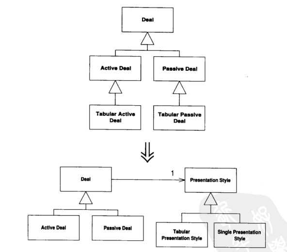
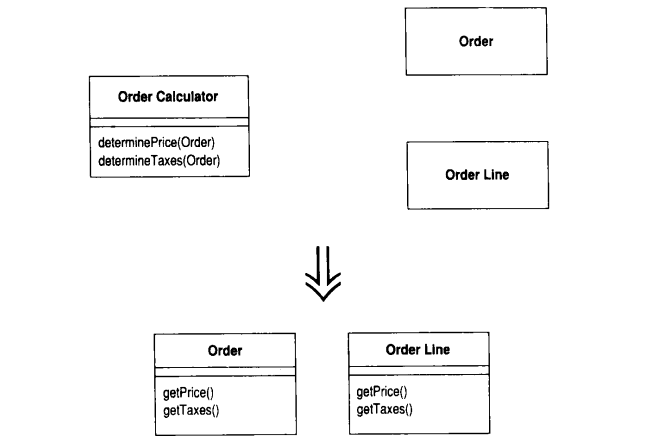

### 第一章first cast

#### code

 ```java
/**
 * @author ocean
 * @since 2020/3/7
 */
public class Customer {
    private String name;
    private Vector<Rental> rentals = new Vector<>();

    public Customer(String name) {
        this.name = name;
    }

    public void addRental(Rental arg) {
        rentals.addElement(arg);
    }

    public String getName() {
        return name;
    }

    public String statement() {
        double totalAmount = 0;
        int frequentRenterPoints = 0;
        Enumeration<Rental> rentalList = rentals.elements();
        String result = "Rental Record for " + getName() + "\n";

        while (rentalList.hasMoreElements()) {
            double thisAmount = 0;
            Rental each = rentalList.nextElement();
            switch (each.getMovie().getPriceCode()) {
                case Movie.REGULAR:
                    thisAmount += 2;
                    if (each.getDaysRented() > 2) {
                        thisAmount += (each.getDaysRented() - 2) * 1.5;
                    }
                    break;
                case Movie.NEW_RELEASE:
                    thisAmount += (each.getDaysRented() - 2) * 1.5;
                    break;
                case Movie.CHILDRENS:
                    thisAmount += 1.5;
                    if (each.getDaysRented() > 3) {
                        thisAmount += (each.getDaysRented() - 3) * 1.5;
                    }
                    break;
            }

            frequentRenterPoints++;
            if ((each.getMovie().getPriceCode() == Movie.NEW_RELEASE) && each.getDaysRented() > 1) {
                frequentRenterPoints++;
            }
            result += "\t" + each.getMovie().getTitle() + "\t" + String.valueOf(thisAmount) + "\n";
            thisAmount += thisAmount;
        }
        result += "Amount owed is " + String.valueOf(totalAmount) + "\n";
        result += "You earned " + String.valueOf(frequentRenterPoints) + " frequent renter points";
        return result;
    }
}


/**
 * @author ocean
 * @since 2020/3/7 
 */
public class Movie {
    public static final int CHILDRENS = 2;
    public static final int REGULAR = 0;
    public static final int NEW_RELEASE = 1;

    private String title;
    private int priceCode;

    public Movie(String title, int priceCode) {
        this.title = title;
        this.priceCode = priceCode;
    }

    public String getTitle() {
        return title;
    }

    public void setTitle(String title) {
        this.title = title;
    }

    public int getPriceCode() {
        return priceCode;
    }

    public void setPriceCode(int priceCode) {
        this.priceCode = priceCode;
    }
}

/**
 * @author ocean
 * @since 2020/3/7
 */
public class Movie {
    public static final int CHILDRENS = 2;
    public static final int REGULAR = 0;
    public static final int NEW_RELEASE = 1;

    private String title;
    private int priceCode;

    public Movie(String title, int priceCode) {
        this.title = title;
        this.priceCode = priceCode;
    }

    public String getTitle() {
        return title;
    }

    public void setTitle(String title) {
        this.title = title;
    }

    public int getPriceCode() {
        return priceCode;
    }

    public void setPriceCode(int priceCode) {
        this.priceCode = priceCode;
    }
}

/**
 * @author ocean
 * @since 2020/3/7
 */
public class Rental {
    private Movie movie;
    private int daysRented;

    public Rental(Movie movie, int daysRented) {
        this.movie = movie;
        this.daysRented = daysRented;
    }

    public Movie getMovie() {
        return movie;
    }

    public int getDaysRented() {
        return daysRented;
    }
}
 ```

#### experience

- 代码块愈小，代码的功能就愈容易管理
- 将代码移到更合适的类
- 任何一个傻瓜都能写出计算机理解的代码，唯有写出人类容易理解的代码，才是优秀的程序员。
- 尽量除去临时变量
- 最好不要在另一个对象的属性基础上运用switch语句。如果不得不使用，应该在对象自己的数据上使用。而不是在别人的数据上使用                                                                                                                                                                                                                                                                                                                                                                                                                                                                                                                                                                                                                                                                                                                                                                                                                                                                                                                                                                                                                                                                                                                                                                                                                                                                                                                                                                                                                                                                                                                                                                                                                                                                                                                                                                                                                                                                                                                                                                                                                                                                                                                                                                                                                                                                                                                                                                                                                                                                                                                                                                                                                                                                                                                                                                                                                                                                                                                                                                                                                                                                                                                                                                                                                                                                                                                                                                                                                                                                                                                                                                                                                                                                                                                                                                                                                                                                                                                                                                                                                                                                                                                                                                                                                                                                                                                                                                                                                                                                                                                                                                                                                                                                                                                                                                                                                                                                                                                                                                                                                                                                                                                                                                                                                                                                                                                                                                                                                                                                                                                                                                                                                                                                                                                                                                                                                                                                                                                                                                                                                                                                                                                                                                                                                                                                                                                                                                                                                                                                                                                                                                                                                                                                                                                                                                                                                                                                                                                                                                                                                                                                                                                                                                                                                                                                                                                                                                                                                                                                                                                                                                                                                                                                                                                                                                                                                                                                                                                                                                                                                                                                                                                                                                                                                                                                                                                                                                                                                                                                                                                                                                                                                                                                                                                                                                                                                                                                                                                                                                                                                                                                                                                                                                                                                                                                                                                                                                                                                                                                                                                                                                                                                                                                                                                                                                                                                                                                                                                                                                                                                                                                                                                                                                                                                                                                                                                                                                                                                                                                                                                                                                                                                                                                                                                                                                                                                                                                                                                                                                                                                                                                                                                                                                                                                                                                                                                                                                                                                                                                                                                                                                                                                                                                                                                                                                                                                                                                                                                                                                                                                                                                                                                                                                                                                                                                                                                                                                                                                                                                                                                                                                                                                                                                                                                                                                                                                                                                                                                                                                                                                                                                                                                                                                                                                                                                                                                                                                                                                                                                                                                                                                                                                                                                                                                                                                                                                                                                                                                                                                                                                                                                                                                                                                                                                                                                                                                                                                                                                                                                                                                                                                                                                                                                                                                                                                                                                                                                                                                                                                                                                                                                                                                                                                                                                                                                                                                                                                                                                                                                                                                                                                                                                                                                                                                                                                                                                                                                                                                                                                                                                                                                                                                                                                                                                                                                                                                                                                                                                                                                                                                                                                                                                                                                                                                                                                                                                                                                                                                                                                                                                                                                                                                                                                                                                                                                                                                                                                                                                                                                                  

#### 案例步骤

- 抽取switch语句
- 给变量命一个好名字
- 绝大多数情况下，函数应该放在它所使用的数据的所属对象内。
- 从Customer中将amountFor方法移动到Rental类中
- 将thisAmount替换掉
- 抽取常客积分的计算方式
- 去除临时变量
- 引入state/strategy模式，在父类总建立抽象方法跟公用方法


### 第二章 重构原则

#### 重构：

- 对软件内部结构的一种调整，在不改变软件可观察行为的前提下，提高其可理解性

#### 两顶帽子

- 添加新功能以及重构。添加新功能时，不应该修改既有代码。重构时，不能新添加新功能。

#### 重构改进软件设计

- 消除重复代码，方便未来修改。
- 是软件更容易理解
- 提高编程速度

#### 何时重构

- 三次法则（事不过三，三则重构）
- 添加新功能时
- 修补错误时
- 复审代码时--一个复审者搭配一个原作者。


### 第三章 代码的坏味道

- Duplicated Code
- Long Method
  - 每当感觉需要以注释来说明点什么的时候。我们就把需要说明的东西写进一个独立的函数中，并以**其用途**命名
  - 条件表达式常常也是提炼的信号
- Large Class
- Long Parameter List
  - 如果向已有的对象发出一条请求就可以取代一个参数，那么应该激活重构手法Replace Parameter with Method,或者用Preserve Whole Object将来自同一对象的一堆数据收集起来。并用对象替换他们。如果某个参数缺乏合理的对象归属，可用Introduce Parameter Object 为他们制造一个参数对象。
- Divergent Change(发散式变化)
  - 如果某个类因为不同的原因在不同的方向上发生变化，Divergent Change就出现了。可以考虑将变化分别封装到不同的类中。针对某一外界变化的所有相应的修改，都只应该发生在单一类中。**一个类受多种变化的影响**
- Shotgun Surgery 散弹式修改
  - 如果遇到某种变化，都必须在许多不同的类内做出许多小修改。此时面临的就是ShotgunSurgery。可使用Move Method 和Move Field把所有需要修改的代码放到同一个类中。或者使用Inline Class。**一种变化引发多个类相应修改**
- Feature Envy(依恋情结)
  - 对象技术的全部要点在于：这是一种“将数据和对数据的操作行为包装在一起”。
  - 经典坏味道：函数对某个类的兴趣高过对自己所处类的兴趣。
  - 疗法：将这个函数移到合适的地方。或者提炼其中的部分。判断哪个类拥有最多被此类函数使用的数据，就讲这个函数和那些数据摆在一起。
- Data Clumps(数据泥团)
  - 两个类中相同的字段、许多函数签名中相同的参数。这些总是绑定在一起出现的数据应该拥有属于他们自己的对象。
- Primitive Obsession(基本类型偏执)
  - 可以运用Replace Data Value with Object将原本独立存在的数据替换为对象
  - Replace Type Code with Class && Rplace TypeCode with subClass && Replace Type Code with State/Strategy
  - 如果发现正从数组总挑选数据，可运用 Replace Array with Object
- Switch statements
- Parallel Inheritance Hierarchies(平行继承关系)
  - 使用复合，少用继承。
- Lazy Class(冗赘类)
  - 如果某些子类没有做足够的工作，试试Collapse Hierarchy。对于几乎没用的组件，应该以Inline Class对付他们。
- Speculative Generality(夸夸奇谈未来性)
  - 如果某个抽象类没有太大作用，请运用Collapse Hierarchy。不必要的委托可运用Inline Class除掉。如果函数的某些参数未被用上，可对他实施remove parameter。
- Temporary Field
- Message Chains(过度耦合的消息链)
  - 如果向一个对象请求另一个对象，然后再向后者请求另一个对象，然后再请求另一个对象。。。这就是消息链。
- Middle Man(中间人)
  - 对象的基本特征之一是封装---对外部世界隐藏内部细节。封装往往伴随委托。你也许会看到某个类有一半的函数都委托给其他类，这样就是过度运用。
  - 应该直接跟真正负责的对象打交道


### 第六章 重新组织函数

#### 提炼函数

- 将代码独立出来，并用函数名称解释函数用途

- 如果临时变量值被修改了，看是否可以将被提炼代码**处理为一个查询**，并将结果赋值给相关变量

  ~~~java
  private void printOwing(double amount){
       printBanner();
       System.out.println("name: " + name);
       System.out.println("amount: " + amount);
  }
  private void printDetail(double amount) {
       System.out.println("name: " + name);
       System.out.println("amount: " + amount);
  }
  ~~~

  处理局部变量

  ~~~java
  private void printOwing() {
       Enumeration<Order> orderList = orders.elements();
       double outstanding = 0;
       while (orderList.hasMoreElements()) {
          Order each = orderList.nextElement();
          outstanding += each.getAmount();
       }
       printBanner();
       printDetail(outstanding);
  }
  private void printOwing() {
          printBanner();
          double outstanding = getOutStanding();
          printDetail(outstanding);
      }
  
  private double getOutStanding() {
       Enumeration<Order> orderList = orders.elements();
       double outstanding = 0;
       while (orderList.hasMoreElements()) {
          Order each = orderList.nextElement();
          outstanding += each.getAmount();
      }
       return outstanding;
  }
  ~~~


#### 内联临时变量

- 有一个临时变量，只被一个简单表达式赋值一次。而它妨碍了其他的重构手法。

  ~~~java
  private boolean tempField() {
     double basePrice = anOrder.basePrice();
     return (basePrice > 10000);
  }
  ~~~

#### 引入解释性变量

- 将复杂表达式的结果放进一个临时变量，以此变量名称来解释表达式用途。

  ~~~java
  if (plateform.toUpperCase().indexOf("MAC") > -1 &&
        browser.toUpperCase().indexof("IE") > -1 && resize > -1
           && wasInitialized()) {
        //do something
  }
  
  final boolean isMacOs = plateform.toUpperCase().indexOf("MAC") > -1;
  final boolean isIEBrowser = browser.toUpperCase().indexOf("IE") > -1;
  final boolean wasResized = resize > -1;
  if (isMacOs && isIEBrowser && wasInitialized() && wasResized) {
  	// do something
  }
  ~~~


#### 分解临时变量

- 你的程序有某个临时变量被赋值超过一次，它既不是临时变量，也不被用于收集计算结果。针对每一次赋值，创造一个独立的、对应的临时变量。(被赋值超过一次，就意味着它在函数中承担了一个以上的责任)。

  ~~~java
  private void temp() {
  	double temp = 2 * (height + width);
  	System.out.println(temp);
  	temp = height * width;
  }
  
  private void temp() {
  	final double perimeter = 2 * (height + width);
  	System.out.println(perimeter);
  	final double area = height * width;
  	System.out.println(area);
  }
  ~~~

#### 移除对参数的赋值

-  在java中，不要对参数进行赋值，因为如果传的是一个对象，那么对参数赋值就会改变这个对象的值。这似乎不是调用方法是所需要的。

- 建立一个临时变量，把待处理的值赋给它。

- java的基本类型按值传递，非基本类型按引用传递。

  ~~~java
  private int discount(int inputVal, int quantity, int yearToDate) {
  	if (inputVal > 10) {
  		inputVal -= 2;
      }
  	if (quantity > 100) {
       	inputVal -= 1;
      }
  	if (yearToDate > 10000) {
  		inputVal -= 4;
  	}
  	return inputVal
  }
  
  private int discount(int inputVal, int quantity, int yearToDate) {
  	int result = inputVal;
  	if (inputVal > 10) {
      	result -= 2;
  	}
  	if (quantity > 100) {
  		result -= 1;
  	}
  	if (yearToDate > 10000) {
      	result -= 4;
  	}
      return result;
  }
  ~~~

#### 以函数对象取代函数（面向对象）

- 将所有局部变量都变成新创建对象的字段

- 原函数的方法转移到新创建的对象中，并将原对象传值的方式传递给方法。

- 最后可以在新建对象的方法中进行临时变量拆减。

  ~~~java
  public class Account {
      int gamma(int inputVal, int quantity, int yearToDate) {
          int totalValue = (inputVal * quantity) + delta();
          int yearValue = (inputVal * yearToDate) + 100;
          if ((yearToDate - totalValue) > 100) {
              yearValue -= 20;
          }
          int mulValue = yearValue * 7;
          return mulValue - 2 * totalValue;
      }
      //....
  }
  // 改动如下：
  public class Gamma {
      private final Account account;
      private int inputVal;
      private int quantity;
      private int yearToDate;
      private int totalValue;
      private int yearValue;
      private int mulValue;
  
      public Gamma(Account account, int inputVal, int quantity, int yearToDate) {
          this.account = account;
          this.inputVal = inputVal;
          this.quantity = quantity;
          this.yearToDate = yearToDate;
      }
  
      private int compute() {
          totalValue = (inputVal * quantity) + account.delta();
          yearValue = (inputVal * yearToDate) + 100;
          if ((yearValue - totalValue) > 100) {
              yearValue -= 20;
          }
          mulValue = yearValue * 7;
          return mulValue - 2 * totalValue;
      }
  }
  
  public class Account {
      int gamma(int inputVal, int quantity, int yearToDate) {
          return new Gamma(this, inputVal, quantity, yearToDate).compute();
      }
  	
      public int delta() {
          return 0;
      }
  }
  // 可以轻松地在compute方法中使用Extract Method。
  ~~~

### 第七章 在对象之间搬移特性

#### 搬移函数

-  有个函数与其所驻类之外的另一个类进行更多交流，调用后者或者被后者调用。

- 如果一个类与另一个类有太多合作而形成高度耦合。就要搬移函数。

- 检查源类中的所有字段和函数，考虑他们是否需要搬移。

  ~~~java
  // 重构前
  public class Account {
      private AccountType type;
      private int daysOverdraw;
      private double overdrawCharge() {
          if (type.isPremium()) {
              double result = 10;
              if (daysOverdraw > 7) {
                  result += daysOverdraw - 7 * 0.85;
              }
              return result;
          } else {
              return daysOverdraw * 1.75;
          }
      }
      private double bankCharge() {
          double result = 4.5;
          if (daysOverdraw > 0) {
              result += overdrawCharge();
          }
          return result;
      }
  }
  ~~~

  假设有几种新账户，每一种都有自己的“透支金额计费规则”。所以我希望将overdrawCharge()搬移到AccountType中。（**此时要观察该方法使用的每一项特性，考虑是否一起移动**）

  ~~~java
  public class Account {
      private AccountType type;
      private int daysOverdraw;
      private double bankCharge() {
          double result = 4.5;
          if (daysOverdraw > 0) {
              result += type.overdrawCharge(daysOverdraw);
          }
          return result;
      }
  }
  public class AccountType {
      public boolean isPremium() {
          return true;
      }
      public double overdrawCharge(int daysOverdraw) {
          if (isPremium()) {
              double result = 10;
              if (daysOverdraw > 7) {
                  result += daysOverdraw - 7 * 0.85;
              }
              return result;
          } else {
              return daysOverdraw * 1.75;
          }
      }
  }
  ~~~

  如果需要源函数更多的特性，就将*源函数以对象的形式*传给目标函数。

#### 搬移字段（Move Field）

-  某个字段被其所驻类之外的另一个类更多地**使用**。

- 所谓“使用”可能是通过设置/取值函数间接进行

  ~~~java
  public class Account {
      private AccountType type;
      private double interestRate;
      private double interestForAmountDays(double amount, int days) {
          return interestRate * amount * days / 365;
      }
  }
  ~~~

  将interestRate字段搬到AccountType中

  ~~~java
  public class Account {
      private AccountType type;
      private double interestForAmountDays(double amount, int days) {
          return type.getInterestRate() * amount * days / 365;
      }
  }
  public class AccountType {
      private double interestRate;
      public double getInterestRate() {
          return interestRate;
      }
  
      public void setInterestRate(double interestRate) {
          this.interestRate = interestRate;
      }
  }
  ~~~

  如果有很多的函数使用了该字段，应该先试用SelfEncapsulate Field（自我封装）

  ~~~java
  // 源函数
  public class Account {
      private AccountType type;
      private double interestRate;
  
      private double interestForAmountDays(double amount, int days) {
          return getInterestRate() * amount * days / 365;
      }
      public double getInterestRate() {
          return interestRate;
      }
      public void setInterestRate(double interestRate) {
          this.interestRate = interestRate;
      }
  }
  // 改进；去掉Account中的 interestRate字段
  public class Account {
      private AccountType type;
      private double interestForAmountDays(double amount, int days) {
          return getInterestRate() * amount * days / 365;
      }
      public double getInterestRate() {
          return type.getInterestRate();
      }
      public void setInterestRate(double interestRate) {
          type.setInterestRate(interestRate);
      }
  }
  ~~~

#### Extract Class(提炼类)

- 某个类做了应该由两个类做的事

- 使用Move Field将必要函数搬到新类。先搬移较低层函数（也就是“被其他函数调用”多于“调用其他函数”者），再搬移高层函数。
#### Inline Class(将类内联化)

- 某个类没有做太多的事情，将这个类的所有特性搬移到另一个类中，然后移除源类。
- 考虑使用内部类。

#### Hide Delegate(隐藏“委托关系”)

- 封装是对象的关键特征，封装以为着每个对象尽可能少了解系统的其他部分。这样一来，一旦有变化，需要了解这一变化的对象就会比较少。

- 如果某个客户先通过服务对象的字段得到另一个对象，然后调用后者的函数，那么客户就必须知道这一层委托关系。如果委托关系变化，客户也得发生改变。

- 可以在服务对象上放置一个简单的**委托函数**，将委托关系隐藏起来。

  ~~~java
  // client
  public class Client {
      public static void main(String[] args) {
          Staff someOne = new Staff();
          //想要知道该员工的经理，必须先获取该员工的部门
          Staff manager = someOne.getDepartment().getManager();
          // 这样的编码就暴露了Department的工作原理，于是客户知道：Department用以追踪“经理”这条信息
          // 要对客户隐藏Department,减少耦合
      }
  }
  // service
  public class Staff {
      private Department department;
      public Department getDepartment() {
          return department;
      }
      public void setDepartment(Department department) {
          this.department = department;
      }
  }
  // delegate
  public class Department {
      private Staff manager;
      public Staff getManager() {
          return manager;
      }
      public void setManager(Staff manager) {
          this.manager = manager;
      }
  }
  ~~~

  在`Staff`中建立一个简单的委托函数,同时改变`Client`的调用方式：

  ~~~java
  // staff
  public Staff getManager() {
    return department.getManager();
  }
  // client
  public static void main(String[] args) {
     Staff someOne = new Staff()
     Staff manager = someOne.getManager();
  }
  ~~~

#### 移除中间人

-  某个类做了过多的简单委托动作。让客户直接调受托类。
- 封装受托对象有好处，但也有代价，如每当客户要使用受托类的新特性时，你就必须在服务端添加一个简单的委托函数，随着受托类的特性增加，服务类就出现称为“中间人”。

#### Introduce Foreign Method(引入外加函数)

-  你需要为提供服务的类增加一个函数，但服务修改这个类。


####  Introduce Local Extension(引入本地扩展)

- 所谓本地扩展是一个独立的类，但也是被扩展类的**子类型**：它提供源类的一切特性，同时额外添加新特性。
- 使用本地扩展使你得以坚持“**函数和数据应该被统一封装**”的原则。
- 扩展类有两种，子类和包装类（委托）


### 第八章 重新组织数据

#### Self Encapsulate Field

- 直接访问一个字段，但字段之间的耦合关系逐渐笨拙

- 为这个字段建立取值/设置函数

- 间接访问字段的好处是，**子类可以通过复写一个函数而改变获取数据的途径**，更灵活

- 直接获取的好处是，更容易理解跟阅读。

  ~~~java
  public class IntRange {
      private int low;
      private int high;
      public IntRange(int low, int high) {
          this.low = low;
          this.high = high;
      }
      boolean includes(int arg) {
          return arg >= low && arg <= high;
      }
  }
  ~~~

  增加取值函数，并增加一个子类，对“范围上限”做了修改，体现其灵活性

  ~~~java
  public class IntRange {
      private int low;
      private int high;
  
      public IntRange(int low, int high) {
          this.low = low;
          this.high = high;
      }
      public boolean includes(int arg) {
          return arg >= getLow() && arg <= getHigh();
      }
      public int getLow() {
          return low;
      }
      public int getHigh() {
          return high;
      }
  }
  public class CappedRange extends IntRange {
      private int cap;
      public CappedRange(int low, int high, int cap) {
          super(low, high);
          this.cap = cap;
      }
      public int getCap() {
          return cap;
      }
      public int getHigh() {
          return Math.min(super.getHigh(), getCap());
      }
  }
  ~~~

  

#### Replace Data Value with Object

- 你有一个数据项，需要与其他数据和行为一起使用才有意义。
- 将数据项变成对象

#### Change Value to Reference

- 从一个类衍生出许多彼此相等的实例，希望将它替换为同一个对象

#### Change Reference to Value

- 你有一个引用对象，很小且不可变，而且不易管理。

#### Replace Array with Object

- 有一个数组，其中的元素各自代表不同的东西。

- 以对象替换数组，对数组中的每个元素，以一个字段来表示

  ~~~java
  public class Performance {
      public void deal(String url) {
          String[] fileAttribute = url.split("/");
          String uri = fileAttribute[0];
          String diskStore = fileAttribute[1];
          String fileName = fileAttribute[2];
          String suffix = fileAttribute[3];
          // do something
          Client.doSomethis(uri,diskStore,fileName,suffix);
      }
  }
  // 改进
  public class Performance {
      private String uri;
      private String diskStore;
      private String fileName;
      private String suffix;
      public void deal(String url) {
          String[] fileAttribute = url.split("/");
          this.uri = fileAttribute[0];
          this.diskStore = fileAttribute[1];
          this.fileName = fileAttribute[2];
          this.suffix = fileAttribute[3];
          // do something
          Client.doSomethis(this);
      }
  }
  ~~~

#### Duplicate Observed Data(复制“被监视的数据”)

​	观察者模式

#### Change Unidirectional Association to Bidirectional(将单向关联改为双向关联)

#### 以字面常量取代魔法数

#### Encapsulate Field 封装字段

-  如果一个类处理访问函数外不能提供其他行为，它终究只是一个哑巴类。这样的类并不能享受对象技术带来的好处。寻找机会，看能否将函数移到新类中

#### 封装集合

- 有个函数返回一个集合，取值函数不该返回集合自身，因为这样会让用户得以修改集合自身而集合拥有者却一无所知。这也会向用户暴露过多对象内部数据结构信息。

- 不应该为这整个集合提供一个设置函数，但应该提供用以，为集合添加、移除元素的函数。这样集合的拥有者就可以控制集合的添加和移除。

- 考虑为集合设置函数命名：从setXxx( ）改为initializeXxx（）或replaceXxx( ).

  ~~~java
  public class Course {
      private String name;
      private boolean isAdvanced;
      public Course(String name, boolean isAdvanced) {
          this.name = name;
          this.isAdvanced = isAdvanced;
      }
  }
  public class Person {
      private Set<Course> courses;
      public Set<Course> getCourses() {
          return courses;
      }
      public void setCourses(Set<Course> courses) {
          this.courses = courses;
      }
  }
  public class Client {
      public static void main(String[] args) {
          Person ocean = new Person();
  
      }
      private static void addCourse(Person ocean) {
          Set<Course> courses = new HashSet<>();
          courses.add(new Course("math", true));
          courses.add(new Course("english", false));
          ocean.setCourses(courses);
      }
      private static void updateCourse(Person ocean) {
          Course refactoring = new Course("Refactoring", true);
          ocean.getCourses().add(refactoring);
      }
      private static void getCourse(Person ocean){
          for (Course each : ocean.getCourses()) {
              System.out.println(each);
          }
      }
  }
  ~~~

  `Course`类中应添加合适的修改集合的函数。同时初始化集合。同时修改设置函数,为设置函数取一个合适的名字。同时，取值函数返回一个只读副本。

  ```java
  public class Person {
      private Set<Course> courses = new HashSet<>();
  
      public Set<Course> getCourses() {
          return Collections.unmodifiableSet(courses);
      }
      public void initializeCourses(Set<Course> courses) {
          this.courses.addAll(courses);
      }
      // 也可通过该函数直接设置，但此函数跟initializeCourse只能留其一，根据调用端决定
      public void addCourse(Course arg) {
          courses.add(arg);
      }
      public void removeCourse(Course arg) {
          courses.remove(arg);
      }
  }
  ```

  不能直接把传入的`Set`赋值给成员变量集合`courses`,就算这个集合是空的也不行。因为如果用户修改传入的`Set`，那么`Person`的`courses`同时会受到影响，破坏封装。必须创建一个副本。

  **数组范例：**

  ```java
  public class Hero {
      private String[] skills;
      public String[] getSkills() {
          return skills;
      }
      public void setSkills(String[] skills) {
          this.skills = skills;
      }
  }
  ```

  添加设置函数

  ```java
  public class Hero {
      private String[] skills;
      public String[] getSkills() {
          return skills;
      }
      public void setSkills(String[] skills) {
          this.skills = skills;
      }
  }
  // 
  public class Hero {
      private String[] skills = {};
      public String[] getSkills() {
          String[] result = new String[skills.length];
          System.arraycopy(skills, 0, result, 0, skills.length);
          return result;
      }
  
      public void setSkill(int index, String newSkill) {
          skills[index] = newSkill;
      }
      public void setSkills(String[] arg) {
          skills = new String[arg.length];
          for (int i = 0; i < arg.length; i++) {
              setSkill(i, arg[i]);
          }
      }
  }
  ```

  

#### Replace Record with Data Class(以数据类取代记录)

#### Replace Type Code with Class

- 符号名终究只是个别名、编译器看见的、进行类型检验的还是背后那个数值。任何接受类型码最为参数的函数，所期望的实质上是一个数值。无法强制使用符号名。大大降低代码可读性，称为bug之源。

- int 枚举模式类型不安全，也几乎没有描述性可言。

- int枚举类型是编译时常量，它们的int值会被编译到使用到它们的客户端中。如果与int值相关联的值发生变化，客户端必须重新编译。如果没有重新编译，客户端程序还是可以运行。不过其行为已经不再准确。

- Java的枚举实质上是int值

  ~~~java
  public class People {
      public static final int O = 0;
      public static final int A = 1;
      public static final int B = 2;
      public static final int AB = 3;
      private int bloodGroup;
  
      public People(int bloodGroup) {
          this.bloodGroup = bloodGroup;
      }
  
      public int getBloodGroup() {
          return bloodGroup;
      }
  
      public void setBloodGroup(int bloodGroup) {
          this.bloodGroup = bloodGroup;
      }
  }
  
  public class People {
      public static final int O = BloodGroup.O.code;
      public static final int A = BloodGroup.A.code;
      public static final int B = BloodGroup.B.code;
      public static final int AB = BloodGroup.AB.code;
      private int bloodGroup;
      public enum BloodGroup {
          O(0), A(1), B(2), AB(3);
          private final int code;
          BloodGroup(int code) {
              this.code = code;
          }
          public int getCode() {
              return code;
          }
      }
  }
  ~~~

#### Replace Type Code with Subclasses(以子类取代类型码)

- 如果类型码不会影响宿主类的行为，可以使用Replace Type Code with Class来处理它们。但如果类型码会影响到宿主类的行为，那最好的办法是借助多态来处理变化行为（以类型码的宿主类为基类，针对每种类型码建立相应的子类）。

- 有两种情况不能这么做：1 类型码值在对象创建之后发生了改变 2 某种原因，类型码宿主类已经有了子类；此时考虑用 Replace Type Code with State/Strategy

- Replace Type Code with Subclasses的主要作用是搭建一个舞台，让Replace Conditional with Polymorphism得以一展身手。如果宿主类中并没有出现条件表达式，那么Replace Type Code with Class更合适。

  ~~~java
  public class Employee {
      private int type;
      private static final int ENGINEER = 0;
      private static final int SALESMAN = 1;
      private static final int MANAGER = 2;
  
      public Employee(int type) {
          this.type = type;
      }
  }
  ~~~

  重构：为每个类型码建立一个子类，建立类型码的取值函数，同时将构造函数更换为工程函数：

  ```java
  public abstract class Employee {
      private int type;
      public static final int ENGINEER = 0;
      public static final int SALESMAN = 1;
      public static final int MANAGER = 2;
  
      public static Employee getInstance(int type) {
          switch (type) {
              case ENGINEER:
                  return new Engineer();
              case SALESMAN:
                  return new Salesman();
              case MANAGER:
                  return new Manager();
              default:
                  throw new IllegalArgumentException("Incorrect type code value");
          }
      }
      // 改为抽象方法
      abstract int getType();
  }
  // 子类
  public class Manager extends Employee {
      @Override
      int getType() {
          return Employee.MANAGER;
      }
  }
  ```

#### Replace Type Code with State/Strategy

- 类型码会影响类的行为或者类型码的值在对象生命器中发生变化，可以使用本重构。

  ~~~java
  public class Employee {
      private int type;
      private int monthlySalary;
      private int commission;
      private int bonus;
  
      public static final int ENGINEER = 0;
      public static final int SALESMAN = 1;
      public static final int MANAGER = 2;
  
      public Employee(int type) {
          this.type = type;
      }
      public int payAmount() {
          switch (type) {
              case ENGINEER:
                  return monthlySalary;
              case SALESMAN:
                  return monthlySalary + commission;
              case MANAGER:
                  return monthlySalary + bonus;
              default:
                  throw new RuntimeException("Incorrect Employee");
          }
      }
  }
  ~~~

  重新声明一个抽象的状态类，为为创造子类。在`Employee`类中使用工厂方法，更加状态码返回子类型。
  
  ```java
  public abstract class EmployeeType {
      public static final int ENGINEER = 0;
      public static final int SALESMAN = 1;
      public static final int MANAGER = 2;
      abstract int getTypeCode();
      abstract int payAmount(Employee employee);
      static EmployeeType newType(int code){
          switch (code) {
              case ENGINEER:
                  return new Engineer();
              case SALESMAN:
                 return new Salesman();
              case MANAGER:
                  return new Manager();
              default:
                  throw new IllegalArgumentException("Incorrect Employee Code");
          }
      }
  }
  public class Engineer extends EmployeeType {
      @Override
      public int getTypeCode() {
          return ENGINEER;
      }
      @Override
      int payAmount(Employee employee) {
          return employee.getMonthlySalary();
      }
  }
  ```
  
  更改`Employee`中的`payAmount()`方法，使用***Replace Conditional with Polymorphism***进行处理
  
  ```java
  public class Employee {
      private EmployeeType type;
      private int monthlySalary;
      private int commission;
      private int bonus;
  
      void setType(int arg) {
          type = EmployeeType.newType(arg);
      }
      public int payAmount() {
          return Optional.ofNullable(type.payAmount(this)).orElseThrow(() -> {
              return new IllegalArgumentException("Incorrect type");
          });
      }
  }    
  ```

#### Replace Subclass with Fields(以字段取代子类)

- 各个子类的唯一差别只在“返回常量数据”的函数身上。

  ```java
  public abstract class Person {
      abstract boolean isMale();
      abstract char getCode();
  }
  public class Man extends Person {
      @Override
      boolean isMale() {
          return true;
      }
      @Override
      char getCode() {
          return 'M';
      }
  }
  public class Female extends Person {
      @Override
      boolean isMale() {
          return false;
      }
      @Override
      char getCode() {
          return 'F';
      }
  }
  ```

  首先使用***Replace Constructor with Factory Method***，即将`Person kent = new Male()`变成`Person kent = Person.createMale()`,消除所有对子类的直接引用。针对每个常量函数，声明一个相应的字段。同时在父类中声明`protected`的构造方法，子类饮用该构造方法

  ```java
  public abstract class Person {
      private final boolean isMale;
      private final char code;
      protected Person(boolean isMale, char code) {
          this.isMale = isMale;
          this.code = code;
      }
  
      public static Person createMale(){
          return new Man();
      }
      public static Person createFemale(){
          return new Female();
      }
      public boolean isMale(){
          return isMale;
      }
      public char getCode(){
          return code;
      }
  }
  public class Man extends Person {
      protected Man() {
          super(true,'M');
      }
  }
  public class Female extends Person {
      protected Female() {
          super(false, 'F');
      }
  }
  ```

  如上，常量函数已转移到父类之中，此时可去掉`Male`跟`Female`子类，使用***Inline Method***将子类构造函数内联到超类的工厂函数中,去掉`Person`的`abstract`操作符。

  ```java
  public  class Person {
      private final boolean isMale;
      private final char code;
      protected Person(boolean isMale, char code) {
          this.isMale = isMale;
          this.code = code;
      }
      public static Person createMale(){
          return new Person(true,'M');
      }
      public static Person createFemale(){
          return new Person(false,'F');
      }
  }
  ```

  

### 第九章 简化条件表达式

 #### Decompose Conditional(分解条件表达式)

- 将条件表达式抽取方法

  ```java
  private double totalPrice(LocalDate date, int quantity) {
     double charge;
     if (date.isBefore(SUMMER_START) || date.isAfter(SUMMER_END)) {
       charge = quantity * winterRate + winterServiceCharge;
     } else {
       charge = quantity * summerRate;
     }
      return charge;
  }
  ```

  ```java
  private double totalPrice(LocalDate date, int quantity) {
     double charge;
     if (notSummer(date)) {
        charge = winterCharge(quantity);
      } else {
        charge = summerCharge(quantity);
      }
      return charge;
  }
  
  private boolean notSummer(LocalDate date) {
     return date.isBefore(SUMMER_START) || date.isAfter(SUMMER_END);
  }
  
  private double summerCharge(int quantity) {
    return quantity * summerRate;
  }
  private double winterCharge(int quantity) {
    return quantity * winterRate + winterServiceCharge;
  }
  ```


#### Replace Conditional with Polymorphism(以多态取代条件表达式)

- 手上的条件表达式，根据对象类型的不同而选择不同的行为

- 使用条件表达式时，如果你想添加一种新类型。就必须查找并更新所有条件表达式

- 如果用多态之需建立一个新的子类并在其中提供恰当的函数

  使用该手法之前，首先必须有一个继承结构。可以使用***Replace Type Code with Subclass***或者***Replace Type Code with State/Strategy***

  ```java
  public class Employee {
      private EmployeeType type;
      private int monthlySalary;
      private int commission;
      private int bonus;
      void setType(int arg) {
          type = EmployeeType.newType(arg);
      }
      public int payAmount() {
          switch (getType()) {
              case EmployeeType.ENGINEER:
                  return monthlySalary;
              case EmployeeType.MANAGER:
                  return monthlySalary + bonus;
              case EmployeeType.SALESMAN:
                  return monthlySalary + bonus;
              default:
                  throw new RuntimeException("Incorrect Employee");
          }
      }
      public int getType() {
          return type.getTypeCode();
      }
  }
  public abstract class EmployeeType {
      public static final int ENGINEER = 0;
      public static final int SALESMAN = 1;
      public static final int MANAGER = 2;
      abstract int getTypeCode();
      static EmployeeType newType(int code){
          switch (code) {
              case ENGINEER:
                  return new Engineer();
              case SALESMAN:
                 return new Salesman();
              case MANAGER:
                  return new Manager();
              default:
                  throw new IllegalArgumentException("Incorrect Employee Code");
          }
      }
  }
  public class Engineer extends EmployeeType {
      @Override
      public int getTypeCode() {
          return ENGINEER;
      }
  }
  ```

  如上，已经使用***Replace Type Code with State/Strategy***创建了继承结构。将`payAmount()`方法移到`EmployeeType`类中

  ```java
  public class Employee {
      private EmployeeType type;
      private int monthlySalary;
      private int commission;
      private int bonus;
  
      void setType(int arg) {
          type = EmployeeType.newType(arg);
      }
  
      public int payAmount() {
         return type.payAmount(this);
      }
  
      public int getType() {
          return type.getTypeCode();
      }
      public int getMonthlySalary() {
          return monthlySalary;
      }
      public int getCommission() {
          return commission;
      }
      public int getBonus() {
          return bonus;
      }
  }
  public class Engineer extends EmployeeType {
      @Override
      public int getTypeCode() {
          return ENGINEER;
      }
      public int payAmount(Employee employee){
          return employee.getMonthlySalary();
      }
  }
  ```


#### Introduce Null Object(引入Null对象)

- 你需要再三检查对象是否为空的情况下

  ```java
  public class Customer {
      private String name;
      private BillingPlan billingPlan;
      private PaymentHistory paymentHistory;
  
      public String getName() {
          return name;
      }
  
      public BillingPlan getBillingPlan() {
          return billingPlan;
      }
  
      public PaymentHistory getPaymentHistory() {
          return paymentHistory;
      }
  }
  public class Client {
      public void useSite(Site site) {
          Customer customer = site.getCustomer();
          BillingPlan plan;
          if (customer == null) {
              plan = BillingPlan.basic();
          } else {
              plan = customer.getBillingPlan();
          }
          String customerName;
          if (customer == null) {
              customerName = "occupant";
          } else {
              customerName = customer.getName();
          }
      }
  }
  ```

  首先创建一个`NullCustomer`类继承`Customer`类，并可在`Customer`类中加入以下方法

  ```java
  protected Customer() {
  }
  
  static Customer newNull() {
    return new NullCustomer();
  }
  
  public boolean isNull() {
     return false;
  }
  ```

  对所有返回`null`的地方，改为返回`null`对象,把`==null`的检查替换成`isNull` ，在`NullCustomer`类中加入合适的方法后，就可以去掉条件表达式了

  ```java
  public class Site {
      private Customer customer;
      public Customer getCustomer() {
          return customer == null ? Customer.newNull() : customer;
      }
  }
  public class NullCustomer extends Customer {
      @Override
      public boolean isNull() {
          return true;
      }
      public String getName() {
          return "occupant";
      }
      public BillingPlan getBillingPlan(){
          return BillingPlan.basic();
      }
  }
  public class Client {
      public void useSite(Site site) {
          Customer customer = site.getCustomer();
          BillingPlan plan = customer.getBillingPlan();
          String customerName = customer.getName();
      }
  }
  ```

  

### 第10章 简化函数调用

#### Rename Method(函数改名)

- 函数的名称未能揭示函数的用途
- 要想成为一个真正的编程高手，起名的水平是至关重要的
- 函数命名：动词短语

#### Add Parameter(添加参数)

- 某函数需要从调用端得到更多的信息
- 为此函数添加一个对象参数
- 过长的参数类往往伴随着坏味道Data Clumps

#### Remove Parameter(移除参数)

-  函数本体不再需要某个函数

#### Separate Query from Modifier(将查询函数和修改函数分离)

- 一个函数既返回对象状态值，又修改对象状态

- 建立两个不同的函数，一个进行查询，一个进行修改

- 任何有返回值的函数，都不应该有看得到的副作用

  ```java
  public class SeparateMethod {
      private String foundMiscreant(String[] people) {
          for (String person : people) {
              if ("Don".equals(person)) {
                  sendAlert();
                  return "Don";
              }
              if ("John".equals(person)) {
                  sendAlert();
                  return "John";
              }
          }
          return "";
      }
  
      private void sendAlert() {
          //do something
      }
     
  }
  // foundMiscreant的调用函数
  public void checkSecurity(String[] people){
      String found = foundMiscreant(people);
      somelaterCode(found);
  }
  ```

  此处函数`foundMiscreant`既实施了查询（有返回值），又有修改（调`sendAlert`方法）。将这两部分分开

  ```java
  public class SeparateMethod {
      private void sendAlert(String[] people) {
          if (!"".equals(fondPerson(people))) {
              sendAlert();
          }
      }
      private void sendAlert() {
          //do something
      }
      public String fondPerson(String[] people) {
          for (String person : people) {
              if ("Don".equals(person)) {
                  sendAlert();
                  return "Don";
              }
              if ("John".equals(person)) {
                  sendAlert();
                  return "John";
              }
          }
          return "";
      }
  }
  // 调用端
  public void checkSecurity(String[] people) {
     sendAlert(people);
     String found = fondPerson(people);
     somelaterCode(found);
  }
  ```

#### Parameterize Method(令函数携带参数)

- 若干函数做了类似的工作，但因少数几个值致使行为略有不同
- 通过函数参数来处理 这种变化

#### Replace Parameter with Explicit Methods(以明确函数取代参数)

- 本项刚好与**Parameterize**相反

- 函数内部如果有多个条件表达式根据参数不同的值而执行不同的行为，适合使用本项。

  ```java
  public class ExplicitMethod {
      private int height;
      private int width;
      void setValue(String name,int value){
          if ("height".equals(name)) {
              height = value;
          }
          if ("width".equals(name)) {
              width = value;
          }
      }
  }
  // 重构
  public class ExplicitMethod {
      private int height;
      private int width;
  
      public void setHeight(int height) {
          this.height = height;
      }
  
      public void setWidth(int width) {
          this.width = width;
      }
  }
  ```

#### 保留对象完整

- 从某个对象中取出若干值，作为参数传递给函数
- 传递整个对象
- 本重构之前，如果还没有定义一个完整的对象。那么应该先使用***Introduce Parameter Object***
- 缺点：被调用函数需要依赖对象

#### Replace Parameter with Methods(以函数取代参数)

- 对象调用某个函数，并将所得结果作为参数，传递给另一个函数
- 而接受该参数的函数也能够调用前一个函数。那么可以直接调用
- 但，如果参数值的调用依赖调用端的某个参数，那么本重构就不适合

#### Introduce Parameter Object(引入参数对象)

-  某些参数在多个函数中多次出现
- 将重复出现的参数封装成对象

#### Remove Setting Method(移除设置函数)

- 类中的某个字段应该在对象创建时被设置，然后就不再改变
- 去掉该字段的所有设置函数
- 为某个字段提供设置函数，意味着这个字段值可以被改变

#### Hide Method(隐藏函数)

- 有一个函数，从类没有被其他任何类用到
- 将这个函数修改为private

#### Replace Constructor with Factory Method(工厂函数取代构造函数)

-  在创建对象时有其他动作，如根据参数创建不同的子类对象
- 工厂函数又明确的名称

#### Encapsulate Downcast(封装向下转型)

- 不要在函数的调用端进行转换，应该在函数内部转化好再返回去

#### Replace Error Code with Exception

-  某个函数返回一个特定的代码，用以表示某种错误情况
- 改用异常
- 需要让调用端知道这个错误
- 决定抛出受控异常还是非受控异常


### 第11章 处理概况关系

#### Pull Up Field(字段上移)

-  两个子类拥有相同的字段，将该字段移到超类中

#### Pull Up Method(函数上移)

- 有些函数在各个子类中产生完全相同的效果，将该函数移到超类
- 有一种情况：子类的函数覆写了超类的函数，但却仍然做相同的工作，也适用本重构

#### Pull Up Constructor Body(构造函数本体上移)

- 在各个子类中拥有一些构造函数，它们的本体几乎完全一致
- 在超类中新建一个构造函数，并在子类构造函数中调用它们

#### Push Down Method(函数下移动)

- 超类中的某个函数只与部分子类有关，将这个函数移到相关的子类中

#### Push Down Field(字段下移)

- 超类中某个字段只被部分子类用到，将这个字段移到需要它的子类中

#### Extract Subclass(提炼子类)

- 类中的某些特性只被某些（非全部）实例用到

- 新建一个子类，将上面所说的那一部分特性移到子类中

  有一个`JobItem`类，用来决定当地修车厂的报价

  ```java
  public class JobItem {
      private int unitPrice;
      private int quantity;
      private Employee employee;
      private boolean isLabor;
      public JobItem(int unitPrice, int quantity, Employee employee, boolean isLabor) {
          this.unitPrice = unitPrice;
          this.quantity = quantity;
          this.employee = employee;
          this.isLabor = isLabor;
      }
      public int getUnitPrice() {
          return unitPrice;
      }
      public int getQuantity() {
          return quantity;
      }
      public Employee getEmployee() {
          return employee;
      }
      public boolean isLabor() {
          return isLabor;
      }
  }
  ```

  实际情况是，某些行为和数据只在按工时(*labor*)收费的情况下才需要。此时建立一个子类。`JobItem`类中增加一个构造函数，并将原有的构造函数改为`protected`。

  ```java
  public class JobItem {
      private int unitPrice;
      private int quantity;
      private Employee employee;
      private boolean isLabor;
      protected JobItem(int unitPrice, int quantity, boolean isLabor, Employee employee) {
          this.unitPrice = unitPrice;
          this.quantity = quantity;
          this.employee = employee;
          this.isLabor = isLabor;
      }
  
      public JobItem(int unitPrice, int quantity) {
        this(unitPrice,quantity,false,null);
      }
  
      public int getUnitPrice() {
          return unitPrice;
      }
      public int getQuantity() {
          return quantity;
      }
      public Employee getEmployee() {
          return employee;
      }
      public boolean isLabor() {
          return isLabor;
      }
  }
  public class LaborItem extends JobItem {
      public LaborItem( int quantity,Employee employee) {
          super(0, quantity, true, employee);
      }
  }
  ```

  将`employee`从`JobItem`搬移到`LaborItem`，包括构造方法，成员变量，和构造函数；同时将`isLable`字段移除；可以更加实际，同样的方法处理`unitPrice`字段，最终可以将`JobItem`变为抽象类。

  ```java
  public class JobItem {
      private int unitPrice;
      private int quantity;
      protected Employee employee;
      protected JobItem(int unitPrice, int quantity) {
          this.unitPrice = unitPrice;
          this.quantity = quantity;
      }
  
      public int getUnitPrice() {
          return unitPrice;
      }
      public int getQuantity() {
          return quantity;
      }
  
      public boolean isLabor() {
          return false;
      }
  }
  public class LaborItem extends JobItem {
      public LaborItem(int quantity, Employee employee) {
          super(0, quantity);
          this.employee = employee;
      }
      public Employee getEmployee() {
          return employee;
      }
      @Override
      public boolean isLabor() {
          return true;
      }
  }
  ```

#### Extract Superclass(提炼超类)

- 两个类具有相似的特性

- 为这两个类建立一个超类，运用***Pull Up Field、Pull Up Method***和***Pull Up Constructor Body***逐一将子类的共同元素上移到超类。

  ```java
  public class Department {
      private String name;
      private Vector<Employee> staff = new Vector<>();
      public Department(String name) {
          this.name = name;
      }
      public Enumeration<Employee> getStaff(){
          return staff.elements();
      }
      public void addStaff(Employee arg){
          staff.addElement(arg);
      }
      public int getTotalAnnualCost(){
          Enumeration<Employee> staffs = getStaff();
          int result = 0;
          while (staffs.hasMoreElements()) {
              Employee each = staffs.nextElement();
              result +=each.getAnnualCost();
          }
          return result;
      }
  }
  public class Employee {
      private String name;
      private int annualCost;
      private String id;
      public Employee(String name, int annualCost, String id) {
          this.name = name;
          this.annualCost = annualCost;
          this.id = id;
      }
      public String getName() {
          return name;
      }
      public int getAnnualCost() {
          return annualCost;
      }
      public String getId() {
          return id;
      }
  }
  
  ```

  这里有两个共同点:员工和部门都有名称，都有年度成本。建立一个超类。

  ```java
  public abstract class Party {
      private String name;
      public abstract int getAnnualCost();
      public String getName() {
          return name;
      }
  
      public Party(String name) {
          this.name = name;
      }
  }
  public class Employee extends Party {
      private int annualCost;
      private String id;
      public Employee(String name, int annualCost, String id) {
          super(name);
          this.annualCost = annualCost;
          this.id = id;
      }
      @Override
      public int getAnnualCost() {
          return annualCost;
      }
      public String getId() {
          return id;
      }
  }
  public class Department extends Party{
      private Vector<Employee> staff = new Vector<>();
      public Department(String name) {
          super(name);
      }
      public Enumeration<Employee> getStaff(){
          return staff.elements();
      }
      public void addStaff(Employee arg){
          staff.addElement(arg);
      }
      @Override
      public int getAnnualCost(){
          Enumeration<Employee> staffs = getStaff();
          int result = 0;
          while (staffs.hasMoreElements()) {
              Employee each = staffs.nextElement();
              result +=each.getAnnualCost();
          }
          return result;
      }
  }
  ```

#### Extract Interface(提炼接口)

- 两个类的接口有部分相同
- 将相同的子集提炼到一个独立的接口中
- ***Extract Interface***和***Extract Superclass***之间有相似之处。前者只能提炼共通接口，不能提炼共通代码。前者可能造成“重复”的坏味道。不过可以用***Extract class***先把共通行为放进一个组件中，然后将工作委托该组件。从而解决这个问题。
- 你想要描述一个类的外部依赖接口（即这个类要求服务提供方提供的操作，如JDBC）。如果打算将来加入其它种类的服务对象，只需要它们实现这个接口即可。

#### Collapse Hierarchy(折叠继承关系)

-  超类跟子类之间无太大的区别，则可将它们合在一起。

#### Form Template Method(塑造模板函数)

- 有一些子类，其中相应的某些函数以相同的顺序执行类似的操作，但操作的细节又有所差异

  以第一章的`Customer`中的两个方法`statement`和`htmlStatement`进行举例。其中这个两个方法的不同在于，一个时以文本格式打印，一个时以*html*格式打印。

  ```java
  public class Customer {
      private String name;
      private Vector<Rental> rentals = new Vector<>();
      public Customer(String name) {
          this.name = name;
      }
      public void addRental(Rental arg) {
          rentals.addElement(arg);
      }
      public String getName() {
          return name;
      }
      public String statement() {
          Enumeration<Rental> rentalList = rentals.elements();
          String result = "Rental Record for " + getName() + "\n";
          while (rentalList.hasMoreElements()) {
              Rental each = rentalList.nextElement();
              result += "\t" + each.getMovie().getTitle() + "\t" + String.valueOf(each.getCharge()) + "\n";
          }
          result += "Amount owed is " + String.valueOf(getTotalCharge()) + "\n";
          result += "You earned " + String.valueOf(getTotalFrequentRenterPoint()) + " frequent renter points";
          return result;
      }
      public String htmlStatement() {
          Enumeration<Rental> rentalList = rentals.elements();
          String result = "<H1>Rentals for <em>" + getName() +"<em></H1><P>\n";
          while (rentalList.hasMoreElements()) {
              Rental each = rentalList.nextElement();
              result += "\t" + each.getMovie().getTitle() + ": " + String.valueOf(each.getCharge()) + "<BR>\n";
          }
          result += "<P>You owe <em>" + String.valueOf(getTotalCharge()) + "</EM><P>\n";
          result += "on this rental you earned <em>" + String.valueOf(getTotalFrequentRenterPoint()) + "</em> frequent renter points<P>";
          return result;
      }
      public double getTotalCharge() {
          double result = 0;
          Enumeration<Rental> rentalList = rentals.elements();
          while (rentalList.hasMoreElements()) {
              Rental each = rentalList.nextElement();
              result += each.getCharge();
          }
          return result;
      }
      public int getTotalFrequentRenterPoint() {
          int result = 0;
          for (Rental each : rentals) {
              result += each.getFrequentRentalPoint();
          }
          return result;
      }
      public Vector<Rental> getRentals() {
          return rentals;
      }
  }
  ```

  重构：针对这两个方法创建一个策略继承体系。将`Customer`中的这个两个方法分别搬出，并命名一致`value`。

  ```java
  public class Customer {
      private String name;
      private Vector<Rental> rentals = new Vector<>();
      public Customer(String name) {
          this.name = name;
      }
      public void addRental(Rental arg) {
          rentals.addElement(arg);
      }
      public String getName() {
          return name;
      }
      public String statement() {
          return new TextStatement().value(this);
      }
      public String htmlStatement() {
          return new HtmlStatement().value(this);
      }
      public double getTotalCharge() {
          double result = 0;
          Enumeration<Rental> rentalList = rentals.elements();
          while (rentalList.hasMoreElements()) {
              Rental each = rentalList.nextElement();
              result += each.getCharge();
          }
          return result;
      }
      public int getTotalFrequentRenterPoint() {
          int result = 0;
          for (Rental each : rentals) {
              result += each.getFrequentRentalPoint();
          }
          return result;
      }
      public Vector<Rental> getRentals() {
          return rentals;
      }
  }
  public class TextStatement extends Statement {
      public String value(Customer aCustomer) {
          Vector<Rental> rentals = aCustomer.getRentals();
          Enumeration<Rental> rentalList = rentals.elements();
          String result = "Rental Record for " + aCustomer.getName() + "\n";
          while (rentalList.hasMoreElements()) {
              Rental each = rentalList.nextElement();
              result += "\t" + each.getMovie().getTitle() + "\t" + String.valueOf(each.getCharge()) + "\n";
          }
          result += "Amount owed is " + String.valueOf(aCustomer.getTotalCharge()) + "\n";
          result += "You earned " + String.valueOf(aCustomer.getTotalFrequentRenterPoint()) + " frequent renter points";
          return result;
      }
  }
  public class HtmlStatement extends Statement {
      public String value(Customer aCustomer) {
          Vector<Rental> rentals = aCustomer.getRentals();
          Enumeration<Rental> rentalList = rentals.elements();
          String result = "<H1>Rentals for <em>" + aCustomer.getName() + "<em></H1><P>\n";
          while (rentalList.hasMoreElements()) {
              Rental each = rentalList.nextElement();
              result += "\t" + each.getMovie().getTitle() + ": " + String.valueOf(each.getCharge()) + "<BR>\n";
          }
          result += "<P>You owe <em>" + String.valueOf(aCustomer.getTotalCharge()) + "</EM><P>\n";
          result += "on this rental you earned <em>" + String.valueOf(aCustomer.getTotalFrequentRenterPoint()) + "</em> frequent renter points<P>";
          return result;
      }
  }
  ```

  提炼这两个函数的不同部分：

  ```java
  public class TextStatement extends Statement {
      String headerString(Customer aCustomer) {
          return "Rental Record for " + aCustomer.getName() + "\n";
      }
      String eachRentalString(Rental each) {
          return "\t" + each.getMovie().getTitle() + "\t" + String.valueOf(each.getCharge()) + "\n";
      }
      String footerString(Customer aCustomer) {
          return "Amount owed is " + String.valueOf(aCustomer.getTotalCharge()) + "\n" +
                  "You earned " + String.valueOf(aCustomer.getTotalFrequentRenterPoint()) + " frequent renter points";
      }
      public String value(Customer aCustomer) {
          Vector<Rental> rentals = aCustomer.getRentals();
          Enumeration<Rental> rentalList = rentals.elements();
          String result = headerString(aCustomer);
          while (rentalList.hasMoreElements()) {
              Rental each = rentalList.nextElement();
              result += eachRentalString(each);
          }
          result += footerString(aCustomer);
          return result;
      }
  }
  public class HtmlStatement extends Statement {
      String headerString(Customer aCustomer) {
          return "<H1>Rentals for <em>" + aCustomer.getName() + "<em></H1><P>\n";
      }
  
      String eachRentalString(Rental each) {
          return "\t" + each.getMovie().getTitle() + ": " + String.valueOf(each.getCharge()) + "<BR>\n";
      }
  
      String footerString(Customer aCustomer) {
          return "<P>You owe <em>" + String.valueOf(aCustomer.getTotalCharge()) + "</EM><P>\n" +
                  "on this rental you earned <em>" + String.valueOf(aCustomer.getTotalFrequentRenterPoint()) + "</em> frequent renter points<P>";
      }
  
      public String value(Customer aCustomer) {
          Vector<Rental> rentals = aCustomer.getRentals();
          Enumeration<Rental> rentalList = rentals.elements();
          String result = headerString(aCustomer);
          while (rentalList.hasMoreElements()) {
              Rental each = rentalList.nextElement();
              result += eachRentalString(each);
          }
          result += footerString(aCustomer);
          return result;
      }
  }
  ```

  最后将相同的函数放到父类（即模板），将不同的函数，在父类中声明为抽象：

  ```java
  public abstract class Statement {
      public String value(Customer aCustomer) {
          Vector<Rental> rentals = aCustomer.getRentals();
          Enumeration<Rental> rentalList = rentals.elements();
          String result = headerString(aCustomer);
          while (rentalList.hasMoreElements()) {
              Rental each = rentalList.nextElement();
              result += eachRentalString(each);
          }
          result += footerString(aCustomer);
          return result;
      }
      protected abstract String footerString(Customer aCustomer);
      protected abstract String eachRentalString(Rental each);
      public abstract String headerString(Customer aCustomer);
  
  }
  public class TextStatement extends Statement {
      @Override
      public String headerString(Customer aCustomer) {
          return "Rental Record for " + aCustomer.getName() + "\n";
      }
      @Override
      public String eachRentalString(Rental each) {
          return "\t" + each.getMovie().getTitle() + "\t" + String.valueOf(each.getCharge()) + "\n";
      }
      @Override
      public  String footerString(Customer aCustomer) {
          return "Amount owed is " + String.valueOf(aCustomer.getTotalCharge()) + "\n" +
                  "You earned " + String.valueOf(aCustomer.getTotalFrequentRenterPoint()) + " frequent renter points";
      }
  }
  public class HtmlStatement extends Statement {
      @Override
      public String headerString(Customer aCustomer) {
          return "<H1>Rentals for <em>" + aCustomer.getName() + "<em></H1><P>\n";
      }
      @Override
      public String eachRentalString(Rental each) {
          return "\t" + each.getMovie().getTitle() + ": " + String.valueOf(each.getCharge()) + "<BR>\n";
      }
      @Override
      public String footerString(Customer aCustomer) {
          return "<P>You owe <em>" + String.valueOf(aCustomer.getTotalCharge()) + "</EM><P>\n" +
                  "on this rental you earned <em>" + String.valueOf(aCustomer.getTotalFrequentRenterPoint()) + "</em> frequent renter points<P>";
      }
  }
  ```


#### Replace Inheritance with  Delegate(以委托取代继承)

- 超类中的许多操作并不适用于子类。
- 委托取代继承，可以灵活地选择需要的功能。

#### Replace Delegate with Inheritance(以继承取代委托)

- 如果需要用到委托类中的所有函数


### 第12章 大型重构

#### Tease Apart Inheritance(梳理并分解继承体系)

- 某个继承体系同时承担两项责任

- 建立两个继承体系，并通过委托关系让其中一个可以调另一个

  
  
  

#### Convert Procedural Design to Objects(将过程化设计转化成对象设计)

-  将数据记录变成对象，将大块的行为分成小块，并将行为移入相关对象之中

  


#### Separate Domain from Presentation(将领域和显示分离)

- 将领域逻辑分离出来，为它们建立独立的领域类
- ***MVC***(*模型-视图-控制器*)模式，最核心的价值在于，他将用户界面代码和领域逻辑分离了，展现类只含用以处理用户界面的逻辑；领域类不含任何与程序外观相关的代码，只含业务逻辑相关代码。


#### Extract Hierarchy(提炼继承体系)

- 有一个类做了太多的工作，其中一部分工作是以大量条件表达式完成的。
- 建立继承体系，以一个类来表示一种特殊情况。


### 第13章 重构，复用和实现

