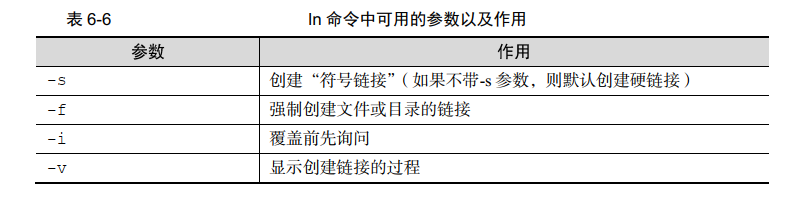

第1章 安装Linux

### RPM

- 红帽软件包管理器，有点像***Window***系统中的控制面板，会建立统一的数据库文件，详细记录软件信息并能够自动分析依赖关系。

- 常用命令

  

### Yum软件仓库

- ***Yum***软件仓库可以根据用户的要求分析出所需要软件包及其相关的依赖关系，然后自动从服务器下载软件包并安装到系统。

- 常用命令

  

### systemd 初始化进程

- ***RHEL 7*** 系统选择 ***systemd*** 初始化进程服务  

- ***systemd*** 与 ***System V init***的区别以及作用  

  

- ***systemctl*** 管理服务的启动、重启、停止、重载、查看状态等常用命令  

  

- 其他命令：查看某个服务的运行状态：`systemctl status 服务名.service`；其中`.service`可以省略。


## 第2章 必须掌握的Linux命令

### 强大好用的shell

- ***Shell***(也称为*终端* 或*壳*)是人与计算机内核进行交互的命令行工具
- 包括红帽系统在内的许多主流***Linux***系统默认使用的终端是 ***Bash***(*Bourne-Again SHell*)解释器  
  - 通过上下方向键来调取过往执行过的 Linux 命令 
  - 命令或参数仅需输入前几位就可以用 Tab 键补全 
  - 具有强大的批处理脚本  
  - 具有实用的环境变量功能  

### 执行查看帮助命令

- 常见命令格式(对象之间用空格键分隔 )：

  > 命令名称 [命令参数] [命令对象]

- 命令参数长格式与短格式

  

- **格式的合并**

  长格式和长格式之间不能合并，长格式和短格式之间也不能合并。短格式之间可合并，合并之后仅保留一个-(减号)即可。如查看进程：**ps -aux**

- 展示页常用按键和命令

  

- **Ctrl + c**组合键

  如果在终端执行一个命令后想立即停止它，可以按下**Ctrl + c**组合键。或者有些命令在执行时不断地在屏幕上输出信息，影响后续命令的输入，则可以在执行命令时在末尾添加一个**&**符号，这样命令将进入系统后台来执行。

- ***man***命令信息结构

  

### 常用系统工作命令

- ***echo***命令:在终端输出字符串或变量提取后的值：

  >格式：echo [字符串|$变量]	
  >

  ```shell
  # 示例：
  [root@linuxprobe ~] echo $SHELL
  ```

  

- ***date***命令：显示及设置系统的时间和日期：

  > 格式：date [选项] [+指定的格式]  
  >

  ```bash
  # 示例：指定格式查看
  root@linuxprobe ~]#  date  "+%Y-%m-%d %H:%M:%S"
  # 设置当前体统时间到指定时间
  root@linuxprobe ~]# date -s "20170901 8:30:00"  
  # 查看系统当前时间是今年中的第几天
  [root@linuxprobe ~]# date "+%j"
  ```

- ***date***命令中参数及作用

  

- ***reboot***命令：重启系统(默认只能用**root**来重启)

  ```shell
  [root@linuxprobe ~]reboot
  ```

- ***wget***命令：用于在终端中下载网络文件

  > 格式：wget [参数] 下载地址
  >

  ```shell
  # 示例：
  [root@linuxprobe ~]wget http://www.linuxprobe.com/docs/LinuxProbe.pdf
  ```

- ***wget***命令参数中意义

  

- ***ps***命令：参看进程状态

  > 格式：ps[参数]
  >

  ```shell
  root@ocean ~] ps -aux
  USER        PID %CPU %MEM    VSZ   RSS TTY      STAT START   TIME COMMAND
  root          1  0.0  0.4  53804  7744 ?        Ss   12:38   0:03 /usr/lib/sys
  root          2  0.0  0.0      0     0 ?        S    12:38   0:00 [kthreadd]
  root          3  0.0  0.0      0     0 ?        S    12:38   0:00 [ksoftirqd/0
  ```

  

  **ps命令参数及作用**

  

  **进程状态及说明:**

  | 进程状态(STAT) | 说明                                                         |
  | -------------- | ------------------------------------------------------------ |
  | R(运行)        | 进程正在运行或在运行队列中等待                               |
  | S(中断)        | 进程处于休眠状态，当某个条件形成后或收到信号时，则脱离该状态 |
  | D(不可中断)    | 进程不相应系统异步信息，即便用**kill**命令也不能将其中断     |
  | Z(僵死)        | 进车已经终止，但进程描述符依然存在，直到夫进程调**wait4()**函数后将进程释放 |
  | T(停止)        | 进程收到停止信号后停止运行                                   |

  **ps命令展示信息解释**

  

- **top**命令：动态监视进程活动与系统负载等信息。可以理解为“强化版Windows任务管理器”

  > 格式：top
  >

  ```shell
  # 示例：
  [root@linuxprobe ~]top
  ```

  **top命令信息含义**

  

- **pidof**命令：查询某个指定服务进程的**PID**值。**PID**值是唯一的。

  > 格式：pidof[参数] [服务名称]
  >

  ```shell
  [root@ocean ~]pidof sshd
  1730
  ```

- **kill**命令：用于终止某个指定**PID**的服务进程。

  > 格式：kill[参数] [进程PID]
  >

  ```shell
  [root@linuxprobe ~]kill 2156
  ```

- **killall**命令：终止某个指定名称的服务所对应的全部进程

  > 格式：killall [参数] [服务名称]
  >
  
  ```shell
  [root@linuxprobe ~] pidof nginx
  13581 13580 13579 13578 13577 13576  
  [root@linuxprobe ~] killall nginx
  ```

### 系统状态检测命令

- **ifconfig**命令：获取网卡配置与网络状态等信息。

  > 格式：ifconfig [网络设备] [参数]
  >

  ```shell
  [root@ocean ~]ifconfig
  eno16777728: flags=4163<UP,BROADCAST,RUNNING,MULTICAST>  mtu 1500
          inet 192.168.10.10  netmask 255.255.255.0  broadcast 192.168.10.255
          inet6 fe80::20c:29ff:fe99:1f8f  prefixlen 64  scopeid 0x20<link>
  ```

- **uname**命令：查看系统内核与系统版本等信息，或者**cat /etc/redhat-release  **。

  > 格式：uname [-a]
  >
  > 示例：[root@linuxprobe ~]# uname -a
  >
  > 示例：[root@linuxprobe ~]# cat /etc/redhat-release

- **uptime**命令：查看系统的负载信息(相当于top命令中的第一行)

  > 格式：uptime
  >
  > 示例：[root@linuxprobe ~]# uptime

- **free**命令：用于显示当前系统中内存的使用量信息,用于关注内存的使用量(-h参数表示human可读的方式)。

  > 格式：free [-h]
  >
  > 示例：[root@linuxprobe ~]# free -h

  **free命令信息解释**：

  

- **who**命令：查看当前登入主机的用户终端信息

  > 格式：who [参数]
  >
  > 示例：[root@linuxprobe ~]# who

  **信息解释**：

  

- **last**命令：用于查看所有系统的登录记录。

  > 格式： last
  >
  > 示例：[root@linuxprobe ~]# last

- **history**命令：用于显示历史执行过的命令 。显示出当前用户在本地计算机中执行过的最近 1000 条命令记录。可以在**/etc/profile**文件中设置**HISTSIZE**变量值 

  > 格式：history [-c]
  >
  > 示例(-c 清空所有的历史命令记录)：[root@linuxprobe ~]# history -c 

  历史命令保存在用户家目录中的**.bash_history**文件中(做此笔记时，没有找到该文件)

- **sosreport**命令：用于收集系统配置及架构信息并输出诊断文档。

  > 格式：sosreport
  >
  > 示例：[root@linuxprobe ~]# sosreport

  该命令会生成一个文件跟校验码：

  **/var/tmp/sosreport-linuxprobe.com-20170905230631.tar.xz**
  **The checksum is:  79436cdf791327040efde48c452c6322  **

### 工作目录切换命令

- **pwd**命令：显示用户当前工作目录

  > 格式：pwd [选项]

- **cd**命令：用于切换工作目录。“**cd -**”返回到上一次所处的目录。“**cd ~**”到用户家目录。

  > 格式：cd [目录名称]

- **ls**命令：用于显示目录中的文件信息

  > 格式：ls [选项] [文件]
  >
  > 示例(-a显示全部文件包括隐藏文件，-l显示文件属性，大小等信息)：[root@linuxprobe ~]# ls -al
  >
  > 示例(-d查看目录属性信息)：[root@linuxprobe ~]# ls -ld /etc
  >
  > 示例(-h便于human阅读的方式显示)：[root@linuxprobe ~]# ll -h


### 文本文件编辑命令

- **cat**命令：查看内容较少的纯文本文件。**-n**参数可以在查看是显示行号。

  > 格式：cat [选项] [文件]
  >
  > 示例：[root@linuxprobe ~]# cat -n initial-setup-ks.cfg  

- **more**命令：查看内容较多的纯文本文件。查看时用**空格或者回车可以翻页**。

  > 格式：more [选项] [文件]
  >
  > 示例：[root@linuxprobe ~]# more initial-setup-ks.cfg  

- **head**命令：查看纯文本文档的前**N**行

  > 格式：head [选项] [文件]
  >
  > 示例(查看前20行)：[root@linuxprobe ~]# head -n 20 initial-setup-ks.cfg  

- **tail**命令：查看纯文本文档的后N行或持续刷新内容；**-f参数**查看持续刷新内容

  > 格式：tail [选项] [文件]
  >
  > 示例(查看持续刷新内容)：[root@linuxprobe ~]# tail -f /var/log/messages
  >
  > 示例(查看尾部20行)：[root@linuxprobe ~]# tail -n 20 /var/log/messages

- **tr**命令：替换文本文件中指定字符。往往配合管道符跟正则使用。

  > 格式：tr [原始字符] [目标字符]
  >
  > 示例(将英文字符替换成小写输出)：[root@linuxprobe ~]# cat test.cfg | tr [a-z] [A-Z

- **wc**命令：用于统计指定文本的行数、字数、字节数

  > 格式：wc [参数] 文本
  >
  > 示例(统计文件有多少行)：[root@linuxprobe ~]# wc -l /etc/passwd
  >
  > 示例(查看该目录下有多少文件)：[root@linuxprobe ~]# ll | grep "^-"|wc -l

  **wc的参数说明**：

  

- **stat**命令：用于查看文件的具体存储信息和时间等信息  

  > 格式：stat 文件名称
  >
  > 示例：[root@linuxprobe ~]# stat anaconda-ks.cfg

- **cut**命令：按“列”提取文本字符；**-f**参数设置需要看的列数，**-d**参数设置间隔符号。

  > 格式：cut [参数] [文本] 
  >
  > 示例(提取出 passwd 文件中的用户名信息  )：
  >
  > [root@linuxprobe ~]# head -n 2 /etc/passwd
  > root: ​x :0:0:root:/root:/bin/bash
  > bin: x:1:1:bin:/bin:/sbin/nologin
  >
  > [root@linuxprobe ~]# cut -d: -f1 /etc/passwd

- **diff**命令：用于比较多个文本文件的差异 ；**--brief**参数来确认两个文件是否不同 ；**-c** 参数来详细比较出多个文件的差异之处(不同的行会有！号标识) 。

  > 格式：diff [参数] 文件
  >
  > 示例(查看两个文件是否不同)：[root@linuxprobe ~]# diff --brief diff_A.txt  diff_B.txt
  >
  > 示例(查看两个不同文件的差异之处)：[root@linuxprobe ~]# diff -c diff_A.txt diff_B.txt


### 文件目录管理命令

- **touch**命令：用于创建空白文件或设置文件的时间；该命令可以设置文件内容的修改时间(**mtime**)、文件权限或属性的更改时间(**ctime**)、文件的读取时间(**atime**) 。

  > 格式：touch [选项] [文件]
  >
  > 示例：
  >
  > 查看文件的修改时间：
  >
  > [root@linuxprobe ~]# ll anaconda-ks.cfg 
  > -rw-------. 1 root root 1032 **Apr 11 19:48** anaconda-ks.cfg
  >
  > 修改该文件：[root@linuxprobe ~]# echo "Visit the linuxprobe.com to learn linux skill" >> anaconda-ks.cfg 
  >
  > 再次查看：[root@linuxprobe ~]# ll anaconda-ks.cfg 
  > -rw-------. 1 root root 1078 **Apr 13 22:07** anaconda-ks.cfg
  >
  > 更改文件的修改时间：[root@linuxprobe ~]# touch -d "2020-04-11 19:48" anaconda-ks.cfg
  >
  > 再次查看：[root@linuxprobe ~]# ll anaconda-ks.cfg 
  > -rw-------. 1 root root 1078 **Apr 11 19:48** anaconda-ks.cfg

  **参数说明**：

  

- **mkdir**命令：创建空白目录；-p参数可以递归创建出具有嵌套层级关系的文件目录。

  > 格式：mkdir [选项] 目录
  >
  > 示例：[root@linuxprobe ~]# mkdir -p linuxprobe/test

- **cp**命令：复制文件或目录。

  > 格式：cp [选项] 源文件 目标文件
  >
  > 示例(复制并重命名为test.log)：[root@linuxprobe ~]# cp install.log test.log

  如果目标文件也是文件，则会询问是否需要覆盖；如果目标文件不存在，则正常复制并复制后重命名为目标文件的文件名。

  **参数说明：**

  

- **mv**命令：用于剪切文件或将文件重命名 ；它会默认把源文件删除掉，只保留剪切后的文件  

  > 格式：mv [选项] 源文件 [目标路径|目标文件名]
  >
  > 示例(剪切并重命名)：[root@linuxprobe ~]# mv test.log linuxprobe/install.log
  >
  > 示例(剪切保留原来的名字)：[root@linuxprobe linuxprobe]# mv install.log /root/

- **rm**命令：删除文件或目录，-r参数递归删除，-f参数强制删除(不询问)

  > 格式：rm [选项] 文件
  >
  > 示例：[root@linuxprobe ~]# rm install.log  

- **dd**命令：用于按照指定大小和个数的数据块来复制文件或转换文件 (**Linux** 系统中有一个名为**/dev/zero** 的设备文件。这个文件不会占用系统存储空间，但却可以提供无穷无尽的数据，因此可以使用它作为 **dd** 命令的输入文件，来生成一个指定大小的文件 ) 

  > 格式：dd [参数]
  >
  > 示例(从/dev/zero 设备文件中取出一个大小为 560MB 的数据块)：
  >
  > [root@linuxprobe ~]# dd if=/dev/zero of=560_file count=1 bs=560M
  >
  > 或者：  [root@linuxprobe ~]# dd if=/dev/zero of=2_280_file count=2 bs=280M

  示例中两条命令执行的结果生成的文件大小是一样的。也就是 参数**count**跟参数**bs**可以随意搭配。

  **参数说明**：

  

- **file**命令：查看文件的类型。

  > 格式：file  文件名
  >
  > 示例：
  >
  > [root@linuxprobe ~]# file 560_file
  > 560_file: data
  > [root@linuxprobe ~]# file anaconda-ks.cfg 
  > anaconda-ks.cfg: ASCII text


### 打包压缩与搜索命令

- **tar**命令:对文件进行打包压缩或解压(**tar**命令指示打包，配合**-z**,或者**-j**进行压缩)

  > 格式：tar [选项] [文件]

  **参数解释**：

  | 参数 | 作用                                    |
  | ---- | --------------------------------------- |
  | -c   | 创建压缩文件(**-c -x不能同时使用**)     |
  | -x   | 解开压缩文件                            |
  | -t   | 查看压缩包内有哪些文件                  |
  | -z   | 用**Gzip**压缩或解压(文件后缀为**.gz**) |
  | -j   | 用**bzip2**压缩或解压                   |
  | -v   | 显示压缩或解压的过程                    |
  | -f   | 目标文件名(**必须放到参数的最后一位**)  |
  | -p   | 保留原始的权限和属性                    |
  | -P   | 使用绝对路径来压缩                      |
  | -C   | 指定解压到的目录                        |

  ```shell
  # 把/etc 目录通过 gzip 格式进行打包压缩，并把文件命名为 etc.tar.gz
  [root@linuxprobe ~] tar -czvf etc.tar.gz /etc 
  # 将打包后的压缩包文件指定解压到/root/etc 目录中 :
  [root@linuxprobe ~] tar -xzvf etc.tar.gz -C /root/etc
  ```

  

- **grep**命令：用于在文本中执行关键词搜索，并显示匹配的结果 

  >  格式：grep [选项] [文件]

  **grep命令参数说明**：

  

  ```shell
  # 示例(查看/etc/passwd文件中，含有/sbin/nologin 关键字的行)：
  grep /sbin/nologin /etc/passwd
  ```

- **find**命令:用于按照指定条件来查找文件(可以按照如文件名、大小、修改时间、权限等信息来查找) 

  > 格式：find [查找路径] 寻找条件 操作
  >
  
  ```bash
  # 示例：查找/etc目录下以host文件开头的文件列表：
  find /etc/ -name "host*" -print
  # 整个系统中搜索权限中包括 SUID 权限（-4000）的所有文件:
  find / -perm -4000 -print
  # 在整个文件系统中找出归属于ocean用户的文件，并拷贝到/root/findresult:
  find / -user ocean -exec cp -a {} /root/findresult/ \;
  # 查找名字后缀了.sh的大小大于50k的文件
  find / -size +5k -name "*.sh"
  ```
  
  

  **参数说明**：

  

  **exec**参数用于把 **find**命令搜索到的结果交由紧随其后的命令作进一步处理，它十分类似于第 3 章将要讲解的管道符技术 
  
  做此笔记时，-size 参数后面应接 `+50KB`命令无效，`+50k`有效，`k`为小写。


## 第3章 管道符、重定向与环境变量

### 输入输出重定向

- 输入重定向是指把文件导入到命令中，而输出重定向则是把原本要输出到屏幕中的数据信息写入到指定文件中

- 输出重定向中用到的符号和作用：

  | 符号              | 作用                                             |
  | ----------------- | ------------------------------------------------ |
  | 命令 > 文件       | 标准输出重定向到指定文件中，清空原有文件中的数据 |
  | 命令 2> 文件      | 将错误输出到指定文件中，清空原有文件             |
  | 命令 >> 文件      | 标准输出重定向**追加到**指定文件中               |
  | 命令 2>> 文件     | 错误输出重定向追加到指定文件中                   |
  | 命令 >> 文件 2>&1 | 将标准输出与错误输出共同追加到指定文件           |
  | 命令 &>> 文件     | 同上                                             |

  示例：

  > 将命令man bash 输出的内容重定向到readme.txt:[root@linuxprobe ~]# man bash > readme.txt  
  >
  > 覆盖：[root@linuxprobe ~]# echo "Welcome to LinuxProbe.Com" > readme.txt 
  >
  > 追加：[root@linuxprobe ~]# echo "Quality linux learning materials" >> readme.txt
  >
  > 将错误的信息输出到指定的文件：
  >
  > [root@linuxprobe ~]# ll xxxx
  > ls: cannot access xxxx: No such file or directory
  > [root@linuxprobe ~]# ll xxxx > /root/stderr
  > ls: cannot access xxxx: No such file or directory
  > [root@linuxprobe ~]# ll xxxx 2> /root/stderr
  > [root@linuxprobe ~]# cat stderr 
  > ls: cannot access xxxx: No such file or directory   

- 输入重定向

  符号及意义：

  | 符号                  | 作用                                         |
  | --------------------- | -------------------------------------------- |
  | 命令 < 文件           | 将文件作为命令的标准输入                     |
  | 命令 << 分解符        | 从标准输入中读入，直到遇见分解符才停止       |
  | 命令 < 文件1  > 文件2 | 将文件1作为命令的标准输入并将标准输出到文件2 |

  示例：

  > 统计指定文件的内容行数：
  >
  > [root@linuxprobe ~]# wc -l < readme.txt 
  > 2
  >
  > 或者：
  >
  > [root@linuxprobe ~]# cat readme.txt |wc -l
  > 2

### 管道符命令

- 把前一个命令原本输出到屏幕的标准正常数据当做是后一个命令的标准输入

- 执行格式：命令A | 命令B

  > 示例
  >
  > 统计被限制登陆系统的用户个数：
  >
  > [root@linuxprobe ~]# grep "/sbin/nologin" /etc/passwd | wc -l
  > 33
  >
  > 翻页查看/etc目录下的文件信息：
  >
  > [root@linuxprobe ~]# ll /etc/ | more

### 命令行的通配符

- 通配符：通用的匹配信息的符号

  常用通配符：

  | 符号  | 意义                                |
  | ----- | ----------------------------------- |
  | *     | 代表匹配零个或多个字符              |
  | ？    | 匹配单个字符                        |
  | [0-9] | 匹配0~9之间的单个数字的字符         |
  | [abc] | 匹配a、b、c三个字符中的任意一个字符 |

- 示例

  > 查看/dev目录下以sda开头的文件：
  >
  > [root@linuxprobe ~]# ll /dev/sda*
  >
  > brw-rw----. 1 root disk 8, 0 Apr 15  2020 /dev/sda
  > brw-rw----. 1 root disk 8, 1 Apr 15  2020 /dev/sda1
  > brw-rw----. 1 root disk 8, 2 Apr 15  2020 /dev/sda2
  >
  > [root@linuxprobe ~]# ll /dev/sda?
  > brw-rw----. 1 root disk 8, 1 Apr 15  2020 /dev/sda1
  > brw-rw----. 1 root disk 8, 2 Apr 15  2020 /dev/sda2
  >
  > [root@linuxprobe ~]# ll /dev/sda[0-9]
  > brw-rw----. 1 root disk 8, 1 Apr 15  2020 /dev/sda1
  > brw-rw----. 1 root disk 8, 2 Apr 15  2020 /dev/sda2
  >
  > [root@linuxprobe ~]# ll /dev/sda[135]
  > brw-rw----. 1 root disk 8, 1 Apr 15  2020 /dev/sda1

### 常用的转义字符

- 常用字符及含义

  | 符号      | 说明                                 |
  | --------- | ------------------------------------ |
  | 反斜杠\   | 反斜杆后面的一个变量变为单纯的字符串 |
  | 单引号‘ ’ | 转义其中所有的变量为单纯的字符串     |
  | 双引号" " | 保留其中的变量属性，不进行转义处理   |
  | 反引号``  | 把其中的命令执行后返回结果           |

- 示例

  ```shell
  PRICE=5
  echo "Price is $PRICE"
  # 输出
  Price is 5
  # 不用反斜杠转义($$ 显示当前的进程ID号)：
   echo "Price is $$PRICE"
   Price is 3484PRICE
  ```
  
  如果只需要某个命令的输出值时，可以像`命令`这样，将命令用反引号括起来 。
  
  ```shell
  # 查看Linux版本和内核信息
  echo `uname -a`
  Linux linuxprobe.com 3.10.0-123.el7.x86_64 #1 SMP Mon May 5 11:16:57 EDT 2014 x86_64 x86_64 x86_64 GNU/Linux
  ```

### 重要的环境变量

- 变量是计算机系统用于保存可变值的数据类型。**Linux**中一般使用大写表示变量。

- 命令在**Linux**中的执行步骤：

  - 第一步：判断用户是否以绝对路径或相对路径的方式输入命令。如果是则直接执行。

  - 第二步：检查用户输入的是否为别名命令。

    创建别名：`alias 别名=命令`，取消别名：`unalias 别名`

  - 第三步：**Bash**命令解析器判断用户输入的是内部命令还是外部命令(可以用**type**命令名称来查看)

  - 第四部：系统在变量为**PATH**中的路径查找用户输入的命令文件，告诉**Bash**解析器待执行命令的的可能存放位置(**PATH**中的路径由冒号分隔开)

- **env**查看系统中所有环境变量s

  
  
  ```shell
  #设置一个变量
  [root@linuxprobe ~] WORKDIR=/home/workdir
  [root@linuxprobe ~] cd $WORKDIR
  [root@linuxprobe workdir] pwd
  /home/workdir
  ```


## 第4章 Vim编辑器与Shell命令脚本

### Vim文本编辑器

- **Vim**编辑器的三种模式

  - 命令模式：控制光标移动，可对文本进行复制、粘贴、删除和查找工作。
  - 输入模式：正常的文本录入(命令模式输入**a**,**i**,**o**可进入输入模式，**a**:光标后一位进入；**i**:光标当前位置进入；**o**:光标下方再创建一行)。
  - 末行模式：保存或退出文档，以及设置编辑环境。

- **Vim**命令模式常用命令

  | 命令      | 作用                                           |
  | --------- | ---------------------------------------------- |
  | dd        | 删除(剪切)光标所在的整行                       |
  | 数字(n)dd | 从光标处删除(剪切)n行                          |
  | yy        | 赋值光标所在的行                               |
  | 数字(n)yy | 从光标处开始赋值n行                            |
  | n         | 向下搜索命令定位到的下一个字符串               |
  | N         | 向上搜索命令定位到的上一个字符串               |
  | u         | 撤销上一步的操作                               |
  | p         | 将之前删除(dd)或复制(yy)过的数据粘贴到光标后面 |

- **Vim**末行模式

  在命令模式总输入一个冒号即可进入末行模式

  | 命令          | 作用                                 |
  | ------------- | ------------------------------------ |
  | :w            | 保存                                 |
  | :q            | 退出                                 |
  | :q!           | 强制退出，放弃对文档的修改           |
  | :wq!          | 强制保存退出                         |
  | :set nu       | 显示行号                             |
  | :set nonu     | 不显示行号                           |
  | :命令         | 执行该命令                           |
  | :整数n        | 跳转到该行                           |
  | :s/one/two    | 将当前光标所在行的第一个one替换成two |
  | :s/one/two/g  | 将当前光标所在行的所有one替换成two   |
  | :%s/one/two/g | 将全文所有的one替换成two             |
  | ?字符串       | 在文本中从下至上搜索该字符串         |
  | /字符串       | 在文本中从上至下搜索该字符串         |

- 编写简单文档

  (这里比较简单就不记录了)

- 配置主机名称

  通过更改**/etc/hostname **文件来更改主机名称

  ```shell
  [root@linuxprobe ~] vim /etc/hostname
  # 该命令查看是否生效
  [root@linuxprobe ~] hostname
  ocean.com
  ```

- **配置网卡信息**

  - 网卡**IP**地址配置得是否正确是两台服务器是否能够相互通信的前提。

  - 在**RHEL5**、**RHEL6**中，网卡配置文件的前缀为**eth**，第1块网卡为**eth0**，第2块网卡为**eth1**，以此类推。在**RHEL7**中网卡配置文件前缀为**ifcfg**，加上网卡名称共同组成了网卡配置文件的名字，如：**ifcfg-eno16777728**

  - 将网卡设备**ifcfg-eno16777736 ** 设置成开机启动

    ```shell
    # 1 切换到/etc/sysconfig/network-scripts
    # 2 将一下信息写入ifcfg-eno16777728
        # 设备类型： TYPE=Ethernet
        # 地址分配模式： BOOTPROTO=static
        # 网卡名称： NAME=eno16777728(有ifconfig命令获取)
        # 是否启动： ONBOOT=yes
        # IP 地址： IPADDR=192.168.10.10
        # 子网掩码： NETMASK=255.255.255.0
        # 网关地址： GATEWAY=192.168.10.1
        # DNS 地址： DNS1=192.168.10.1
    [root@linuxprobe network-scripts] vim ifcfg-eno16777728
    # 3 重启网络服务并测试网络是否连通
    [root@linuxprobe network-scripts] systemctl restart network
    [root@linuxprobe network-scripts] ping 192.168.10.10
    PING 192.168.10.10 (192.168.10.10) 56(84) bytes of data.
    64 bytes from 192.168.10.10: icmp_seq=1 ttl=64 time=0.080 ms
    64 bytes from 192.168.10.10: icmp_seq=2 ttl=64 time=0.085 ms
    ```

- 配置**Yum**软件库

  - 可以把Yum想象成一个很大的软件仓库，里面保存着几乎所有常用的工具。

  配置步骤如下

  ```shell
  # 1 进入到/etc/yum.repos.d/目录，该目录存放着Yum软件仓库的配置地址
  [root@ocean Desktop] cd /etc/yum.repos.d/
  # 2 创建rhel7.repo 文件并经一下内容写入该文件(冒号后面为说明，不许要写入)
    #[rhel-media]：Yum 软件仓库唯一标识符，避免与其他仓库冲突。
      #name=linuxprobe
      #baseurl=file:///media/cdrom
      #enabled=1
      #gpgcheck=1
      #gpgkey=file:///media/cdrom/RPM-GPG-KEY-redhat-release
  [root@ocean yum.repos.d] vim rhel7.repo
  
  # 3 按配置参数的路径挂载光盘
  [root@ocean yum.repos.d] mkdir -p /media/cdrom
  [root@ocean yum.repos.d] mount /dev/cdrom /media/cdrom
  mount: /dev/sr0 is write-protected, mounting read-only
  # 4 将光盘挂载信息写入到/etc/fstab文件中
  	# /dev/cdrom /media/cdrom iso9660 defaults 0 0
  [root@ocean yum.repos.d] vim /etc/fstab
  # 5 使用“yum install httpd -y 命令检查 Yum 软件仓库是否已经可用。
  [root@ocean ~]# yum install httpd
  ```
  

### 编写Shell脚本

- **Shell**脚本命令工作的方式有两种：

  - 交互式(*Interactive*)：用户每输入一条命令就立即执行
  - 批处理(*Batch*)：由用户事先编写好一个完整的**Shell**脚本，**Shell**会一次性执行脚本中诸多的命令。

- 编写简单的脚本

  **Shell** 脚本文件的名称可以任意，但为了避免被误以为是普通文件，建议将**.sh** 后缀加上 。第一行的(**#!**）用来告诉系统使用哪种**Shell**解释器来执行该脚本；第二行的注释信息（**#**）是对脚本功能和某些命令的介绍信息，使得自己或他人在日后看到这个脚本内容时，可以快速知道该脚本的作用或一些警告信息  

  ```shell
  [root@ocean ~] vim example.sh
  #!/bin/bash
  #For example by ocean
  pwd
  ls -al
  # 执行
  [root@ocean ~] bash example.sh
  # 或者赋予权限后执行
  [root@ocean ~] chmod u+x example.sh
  [root@ocean ~]./example.sh
  ```

- 接受用户的参数

  用户输入的参数相关格式如下：

  

  ```shell
  # 编辑，输入一下参数
  #echo "The current script name is $0"
  #echo "There are $# parameters,$*"
  #echo "The first parameter is $1 and The the 5th is $5"
  [root@ocean ~] vim example.sh
  # 执行
  [root@ocean ~]# ./example.sh one two three four five six
  The current script name is ./example.sh
  There are 6 parameters,one two three four five six
  The first parameter is one and The the 5th is five
  ```

- 判断用户的参数

  - Shell脚本中的条件测试语法可以判断表达式是否成立，如条件成立则返回数字0，否则返回其他随机数值。
  - 语法格式(条件表达式两边都有一个空格)：[ 条件表达式 ]
  - 条件测试语句可分为：文件测试语句、逻辑测试语句、整数值测试语句、字符串比较语句。

  **文件测试语句参数**：

  | 运算符 | 作用                                       |
  | ------ | ------------------------------------------ |
  | -d     | 测试文件是否为目录类型(**0 true 1 false**) |
  | -e     | 测试文件是否存在                           |
  | -f     | 判断文件是否为一般文件(**0 true 1 false**) |
  | -r     | 测试当前用户是否有权限读取                 |
  | -w     | 测试当前用户是否有权限写入                 |
  | -x     | 测试当前用户是否有权限执行                 |

  ```shell
  # 判断/etc/fstab是否为一个目录类型文件($?变量显示上一条命令执行后的返回值)
  [root@ocean ~][ -d /etc/fstab ]
  [root@ocean ~] echo $?
  1
  [root@ocean ~] [ -f /etc/fstab ]
  [root@ocean ~] echo $?
  0
  [root@ocean ~] [ -e /dev/cdrom ] && echo "Exit"
  Exit
  [root@ocean ~] echo $USER
  root
  # || 表示前面的条件不成立后才执行后面的条件语句
  [root@ocean ~] [ $USER == ocean ] || echo "user"
  user
  # ！表示取反
  [root@ocean ~][ ! $USER == root ] || echo "administrator"
  administrator
  
  ```

  **整数值测试语句参数**：

  | 运算符 | 作用           |
  | ------ | -------------- |
  | -eq    | 是否等于       |
  | -ne    | 是否不等于     |
  | -gt    | 是否大于       |
  | -lt    | 是否小于       |
  | -le    | 是否小于或等于 |
  | -ge    | 是否大于或等于 |

  ```shell
  [root@ocean ~][ 10 -gt 10 ]
  [root@ocean ~] echo $?
  1
  [root@ocean ~]# [ 10 -eq 10 ]
  [root@ocean ~]# echo $?
  0
  
  # 截取free命令总的 free项
  [root@ocean ~]free -m
               total       used       free     shared    buffers     cached
  Mem:          1826       1180        645         10          1        424
  -/+ buffers/cache:        754       1072
  Swap:         2047          0       2047
  # 先取第"Mem:"行，再截取第4列
  [root@ocean ~]free -m | grep "Mem:" | awk '{print $4}'
  645
  [root@ocean ~]FreeMem=`free -m | grep "Mem:" | awk '{print $4}'`
  [root@ocean ~]echo $FreeMem
  645
  # 判断内存大小
  [root@ocean ~]# [ $FreeMem -lt 1024 ] && echo "insufficient memory"
  insufficient memory
  ```

  **字符串比较语句**	：

  | 运算符 | 作用                   |
  | ------ | ---------------------- |
  | =      | 比较字符串内容是否相同 |
  | !=     | 比较字符串内容是否不同 |
  | -z     | 判断字符串内容是否为空 |

  ```shell
  # 判断字符串是否为空,进而判断了是否定义了这个变量
  [root@ocean ~][ -z $String ]
  [root@ocean ~] echo $?
  0
  [root@ocean ~] echo $LANG
  en_US.UTF-8
  [root@ocean ~] [ $LANG != "en.US" ] && echo "Not en.US" 
  Not en.US
  ```
  
### 流程控制语句

- **if条件测试语句**:单分支结构：由 **if、then、fi**组成

  

  ```shell
  # 判断文件夹是否存在再去创建
  [root@ocean ~] vim mkcdrom.sh
  #!/bin/bash
  # make directory
  DIR="/media/test"
  if [ ! -e $DIR ]
  then
  mkdir -p $DIR
  fi
  [root@ocean ~] ll /media/test
  ls: cannot access /media/test: No such file or directory
  [root@ocean ~] ./mkcdrom.sh 
  [root@ocean ~] ll /media/test/
total 0
  ```

- **if**条件双分支结构：**if**、**then**、 **else**、 **fi**关键词组成 

  

  ```shell
  # ping某台主机的情况
  [root@ocean practice] vim chkhost.sh
  #!/bin/bash
  ping -c 3 -i 0.2 -W 3 $1 &> /dev/null
  if [ $? -eq 0 ]
  then
  echo "Host $1 is On-line." 
  else
  echo "Host $1 is Off-line."
  fi
  [root@ocean practice]bash chkhost.sh 192.168.10.10
  Host 192.168.10.10 is On-line.
  [root@ocean practice] bash chkhost.sh 192.168.10.20
  Host 192.168.10.20 is Off-line.
  ```

  **ping**命令的参数说明：**-c**:规定尝试的次数，**-i**:每个数据报的发送间隔，**-W**:等待超时时间。

  **/dev/null**是一个被称作 **Linux**黑洞的文件，把输出信息重定向到这个文件等同于删除数据（类似于没有回收功能的垃圾箱），可以让用户的屏幕窗口保持简洁。  

- **if**条件多分支结构

  

  根据用户输入的成绩显示不同的结果：

  ```shell
  [root@ocean practice] vim chkscore.sh
  #!/bin/bash
  read -p "Enter your score (0-100):" GRADE
  if [ $GRADE -ge 80 ] && [ $GRADE -le 100 ]; then
  echo "$GRADE is Excellent"
  elif [ $GRADE -ge 70 ] && [ $GRADE -le 84 ];then
  echo "$GRADE is Pass" 
  else
  echo "$GRADE is fail"
  fi
  [root@ocean practice] bash chkscore.sh 
  Enter your score (0-100):88
  88 is Excellent
  [root@ocean practice] bash chkscore.sh 
  Enter your score (0-100):77
  77 is Pass
  [root@ocean practice] bash chkscore.sh 
  Enter your score (0-100):60
  60 is fail
  ```

  **read**命令(读取用户输入信息的命令，把接收到的用户输入信息赋值给后面的指定变量   )说明：**-p**：用于向用户显示一定的提示信息。

- **for**条件循环语句

  

  读取指定文件，循环创建用户

  ```shell
  # 创建一个users.txt文件
  [root@ocean practice] vim users.txt
  andy
  barry
  carl
  duke
  eric
  george
  # 创建一个脚本
  [root@ocean practice] vim usercount.sh
  #!/bin/bash
  read -p "Enter The Users Password : " PASSWD
  
  for UNAME in `cat users.txt`
  do
    id $UNAME &> /dev/null
  if [ $? -eq 0 ]
  then
  echo "$UUNAME Already exit"
  else
    useradd $UNAME &> /dev/null
  echo "$PASSWD" | passwd --stdin $UNAME &> /dev/null
  if [ $? -eq 0 ]
  then
  echo "$UNAME, Create success"
  else
  echo "$UNAME, Create failure"
  fi
  fi
  done
  # 执行脚本
  [root@ocean practice] bash usercount.sh 
  Enter The Users Password : linuxprobe
  andy, Create success
  barry, Create success
  carl, Create success
  duke, Create success
  eric, Create success
  george, Create success
  # 查看用户是否创建成功
  [root@ocean practice] tail -6 /etc/passwd
  andy:x:1001:1001::/home/andy:/bin/bash
  barry:x:1002:1002::/home/barry:/bin/bash
  carl:x:1003:1003::/home/carl:/bin/bash
  duke:x:1004:1004::/home/duke:/bin/bash
  eric:x:1005:1005::/home/eric:/bin/bash
  george:x:1006:1006::/home/george:/bin/bash
  ```

  从文件中读取主机列表，然后脚本执行**ping**命令：

  脚本中出现的**$**（命令）是一种完全类似于第 3 章的转义字符中反引号`命令`的**Shell**操作符，效果同样是执行括号或双引号括起来的字符串中的命令  `HLIST=$(cat /root/practice/iplist.txt)`等号之间不能有空格。

  ```shell
  # 创建一个主机列表文件
  [root@ocean practice] vim iplist.txt
  192.168.10.10
  192.168.10.11
  192.168.10.12
  # 编写脚本
  [root@ocean practice] vim checkHost.sh
  #!/bin/bash
  HLIST=$(cat /root/practice/iplist.txt)
  for IP in $HLIST
  do
  ping -c 3 -i 0.2 -W 3 $IP &> /dev/null
  if [ $? -eq 0 ]
  then
  echo "Host $IP is on-line."
  else
  echo "Host $IP is off-line."
  fi
  done
  # 执行脚本
  [root@ocean practice]./checkHost.sh 
  Host 192.168.10.10 is on-line.
  Host 192.168.10.11 is off-line.
  Host 192.168.10.12 is off-line.
  ```

- **while**循环语句：

  

  随机产生一个数据，用户输入数据与之比较，猜中则停止（该脚本使用**$RANDOM**变量来调取出一个随机的数值（范围为 0～32767），将这个随机数对 1000 进行取余操作  ）

  ```shell
  [root@ocean practice]vim guess.sh
  #!/bin/bash
  PRICE=$(expr $RANDOM % 1000)
  TIMES=0
  echo "The Item Price between 0 and 999,have a guess!"
  while true
  do
  read -p  "Enter your guess price:" INT
  let TIMES++
  if [ $INT -eq $PRICE ];then
  echo "You are right,The real price is $PRICE "
  echo "You have guess $TIMES times"
  exit 0
  elif [ $INT -gt $PRICE ]
  then
  echo "Higher!"
  else
  echo "Lower"
  fi
  done
  [root@ocean practice] bash guess.sh 
  The Item Price between 0 and 999,have a guess!
  Enter your guess price:500
  Lower
  Enter your guess price:750 
  Lower
  Enter your guess price:875
  Lower
  Enter your guess price:937
  Lower
  Enter your guess price:968 
  Higher!
  Enter your guess price:953
  Lower
  Enter your guess price:960
  Higher!
  Enter your guess price:956
  Higher!
  Enter your guess price:954
  You are right,The real price is 954 
  You have guess 9 times
  
  ```

- **case**条件测试语句

  

  guess.sh 脚本中有一个致命的弱点—只能接受数字！您可以尝试输入一个字母，会发现脚本立即就崩溃了。原因是字母无法与数字进行大小比较。可以使用case跟正则给出提示。

  ```shell
  [root@ocean practice] vim checkkeys.sh
  #!/bin/bash
  read -p "Please input a character and then key Enter to confirm: " KEY
  case "$KEY" in
  [a-z]|[A-Z])
  echo "You input a letter."
  ;;
  [0-9])
  echo "You input a number."
  ;;
  *)
  echo "您输入的是 空格、功能键或其他控制字符"
  esac
  
  [root@ocean practice] bash checkkeys.sh 
  Please input a character and then key Enter to confirm: i
  You input a letter.
  ```

  

### 计划任务服务程序

- 计划任务分为一次性计划任务和长期性计划任务

- 一次性计划任务只执行一次。用**at**令实现这种功能，默认采用的是交互式的方法。**at -l** 查看设置好但未执行的一次性任务；

  ```shell
  # 设置系统在今晚23：30自动重启网站服务
  [root@ocean practice] at 23:30
  at> systemctl restart httpd
  at> <EOT> # 此处用ctrl +D组合键结束任务编写
  job 1 at Mon Apr 20 23:30:00 2020
  # 查看
  [root@ocean practice] at -l
  1	Mon Apr 20 23:30:00 2020 a root
  # 或者
  [root@ocean practice]# echo "systemctl restart httpd" | at 23:30
  job 2 at Mon Apr 20 23:30:00 2020
  [root@ocean practice]# at -l
  1	Mon Apr 20 23:30:00 2020 a root
  2	Mon Apr 20 23:30:00 2020 a root
  # 删除任务
  [root@ocean practice]# atrm 2
  [root@ocean practice]# at -l
  1	Mon Apr 20 23:30:00 2020 a root
  ```

- 长期性任务：创建、编辑计划任务的命令为**crontab -e**，查看当前计划任务的命令为**crontab -l**，删除某条计划任务的命令为**crontab -r**。另外，如果您是以管理员的身份登录的系统，还可以在 **crontab**命令中加上**-u **参数来编辑他人的计划任务。  

- **crond**任务的格式与参数

  

  参数：

  | 字段 | 说明                                  |
  | ---- | ------------------------------------- |
  | 分   | 取值为0~59的整数                      |
  | 时   | 取值为0~23的任意整数                  |
  | 日   | 取值为1~31任意整数                    |
  | 月   | 取值为1~12的任意整数                  |
  | 星期 | 取值为0~7任意整数，其中0和7均为星期日 |
  | 命令 | 要执行的命令或程序脚本                |

  ```shell
  # 每周一、三、五的凌晨3点25分，使用tar命令把某个网站的数据目录进行打包处理，使其作为一个备份文件
  # 执行以下命令后会出现编辑文件框，输入想要的任务：
  # 25 3 * * 1,3,5 /usr/bin/tar -czvf backup.tar.gz /home/wwwroot
  [root@ocean practice] crontab -e
  no crontab for root - using an empty one
  crontab: installing new crontab
  # 查看
  [root@ocean practice]# crontab -l
  25 3 * * 1,3,5 /usr/bin/tar -czvf backup.tar.gz /home/wwwroot
  ```

  **crond**语法补充说明：

  1 用逗号（ ,）来分别表示多个时间段，例如“8,9,12”表示 8 月、 9 月和 12 月。还可以用减号（ -）来表示一段连续的时间周期（例如字段“日”的取值为“12-15”，则表示每月的 12～15 日）。以及用除号（ /）表示执行任务的间隔时间（例如“*/2”表示每隔2 分钟执行一次任务）。  

  2 在**crond**服务的计划任务参数中，所有命令一定要用绝对路径的方式来写 。如上例中的**/usr/bin/tar**。如果不知道绝对路径，使用**whereis**命令

  ```shell
  # 取 /usr/bin/rm
  [root@ocean practice]whereis rm
  rm: /usr/bin/rm /usr/share/man/man1/rm.1.gz /usr/share/man/man1p/rm.1p.gz
  ```
  
- 在原来的计划任务上添加计划任务

  ```shell
  [root@ocean practice] crontab -e
  25 3 * * 1,3,5 /usr/bin/tar -czvf backup.tar.gz /home/wwwroot
  0 1 * * 1-5 /usr/bin/rm -rf /tmp/*
                                                                                     
  -- INSERT --
  # 查看
  [root@ocean practice]# crontab -l
  25 3 * * 1,3,5 /usr/bin/tar -czvf backup.tar.gz /home/wwwroot
  0 1 * * 1-5 /usr/bin/rm -rf /tmp/*
  ```

- 在 **crond **服务的配置参数中，可以像 Shell 脚本那样以#号开头写上注释信息，这样在日后回顾这段命令代码时可以快速了解其功能、需求以及编写人员等重要信息  

- 计划任务中的“分”字段必须有数值，绝对不能为空或是*号，而“日”和“星期”字段不能同时使用，否则就会发生冲突。  

## 第5章 用户身份与文件权限

### 用户身份与能力

- 在**RHEL7**系统中，用户身份有下面这些：
  - 管理员**UID**为0：系统的管理员用户。
  - 系统用户UID为1~999：为了避免某个服务程序出现漏洞而被黑客提权至整个服务器，默认服务程序会有独立的系统用户负责运行，进而有效控制被破坏范围。
  - 普通用户UID从**1000**开始：由管理员创建的用于日常工作的用户。

- **useradd**命令

  > 格式：useradd [选项] 用户名

  该命令会产生以下三个默认：

  - 默认用户家目录会存放在**/home**
  - 默认**Shell**解析器为**/bin/bash**
  - 默认创建一个与该用户同名的的基本用户组

  参数：

  

  ```shell
  [root@ocean practice]adduser -d /home/linux -u 8888 -s /sbin/nologin linuxprobe
  [root@ocean practice] id linuxprobe
  uid=8888(linuxprobe) gid=8888(linuxprobe) groups=8888(linuxprobe)
  ```

- **groupadd**命令

  > 格式：groupadd [选项] 群组名

  ```shell
  # 创建分组
  [root@ocean practice]groupadd ronny
  ```

- **usermod**：用于修改用户的属性，用户信息保存在**/etc/passwd**文件中

  > 格式：usermod [选项] 用户名

  参数：

  

  ```shell
  [root@ocean practice] id linuxprobe
  uid=8888(linuxprobe) gid=8888(linuxprobe) groups=8888(linuxprobe)
  # 将该用户添加到root用户组
  [root@ocean practice] usermod -G root linuxprobe
  # 修改用户uid号码
  [root@ocean practice]id linuxprobe
  uid=9999(linuxprobe) gid=8888(linuxprobe) groups=8888(linuxprobe),0(root)
  ```

- **passwd**命令：修改用户密码、过期时间、认证信息等。

  > 格式：passwd [选项] [用户名]

  参数：

  

  ```shell
  # root用户更自己的密码 不需要旧密码认证
  [root@ocean practice] passwd
  Changing password for user root.
  New password: 
  Retype new password: 
  passwd: all authentication tokens updated successfully.
  # root可以修改其他用户的密码
  [root@ocean practice] passwd linuxprobe
  Changing password for user linuxprobe.
  New password: 
  Retype new password: 
  passwd: all authentication tokens updated successfully.
  ```

- **userdel**命令:删除用户,在执行删除操作时，该用户的家目录默认会保留下来，此时可以使用-r 参数将其删除 . 

  > 格式：userdel [选项] 用户名
  
  
  
  ```shell
  [root@ocean Desktop]# id linuxprobe
  uid=9999(linuxprobe) gid=8888(linuxprobe) groups=8888(linuxprobe),0(root)
  [root@ocean Desktop]# userdel -r linuxprobe
  ```

### 文件权限与归属

常见的文件字符：

- -:普通文件
- d:目录文件
- l:链接文件
- b:块设备文件
- c:字符设备文件
- p:管道文件

每个文件都有所属的**所有者**和**所有组**，并且规定了文件的**所有者、所有组以及其他人**对文件所拥有的可读（ r）、可写（ w）、可执行（ x）等权限。对于一般文件来说，权限比较容易理解：“可读”表示能够读取文件的实际内容；“可写”表示能够编辑、新增、修改、删除文件的实际内容；“可执行”则表示能够运行一个脚本程序。  


### 文件的特殊权限

#### SUID

文件特殊权限有SUID、SGID 与 SBIT。可以与一般权限同时使用，以弥补一般权限不能实现的功能。  

SUID 是一种对二进制程序进行设置的特殊权限，可以让二进制程序的执行者临时拥有属主的权限（仅对拥有执行权限的二进制程序有效）。例如，所有用户都可以执行 passwd 命令来修改自己的用户密码，而用户密码保存在/etc/shadow 文件中。仔细查看这个文件就会发现它的默认权限是 000，也就是说除了 root 管理员以外，所有用户都没有查看或编辑该文件的权限。但是，在使用 passwd 命令时如果加上 SUID 特殊权限位，就可让普通用户临时获得程序所有者的身份，把变更的密码信息写入到 shadow 文件中。这很像我们在古装剧中见到的手持尚方宝剑的钦差大臣， 他手持的尚方宝剑代表的是皇上的权威，因此可以惩戒贪官，但这并不意味着他永久成为了皇上。因此这只是一种有条件的、临时的特殊权限授权方法。  

#### SGID

SGID 主要实现如下两种功能：  

- 让执行者临时拥有属组的权限（对拥有执行权限的二进制程序进行设置）；  
- 在某个目录中创建的文件自动继承该目录的用户组（只可以对目录进行设置）。  

#### chmod命令：

用来设置文件或目录的权限 

> 格式：chmod [参数] 权限 文件或目录名称

```shell
[root@ocean practice]# ll -a guess.sh 
-rw-r--r--. 1 root root 358 Apr 19 21:08 guess.sh
[root@ocean practice] chmod 760 guess.sh 
[root@ocean practice] ll -a guess.sh 
-rwxrw----. 1 root root 358 Apr 19 21:08 guess.sh
```

#### chown

以设置文件或目录的所有者和所属组  

> 格式：chown [参数] 所有者:所属组 文件或目录名称

chmod 和 chown 命令是用于修改文件属性和权限的最常用命令，它们还有一个特别的共性，就是针对目录进行操作时需要加上大写参数-R 来表示递归操作，即对目录内所有的文件进行整体操作。  

```shell
[root@linuxprobe ~] ls -l test
-rwxrw----. 1 linuxprobe root 15 Feb 11 11:50 test
[root@linuxprobe ~] chown root:bin test
[root@linuxprobe ~] ls -l test
-rwxrw----. 1 root bin 15 Feb 11 11:50 test
```

#### SBIT  

SBIT 特殊权限位可确保用户只能删除自己的文件，而不能删除其他用户的文件。换句话说，当对某个目录设置了 SBIT 粘滞位权限后，那么该目录中的文件就只能被其所有者执行删除操作了。  


### 文件隐藏属性

- **chattr 命令**  

  **chattr** 命令用于设置文件的隐藏权限，格式为“chattr [参数] 文件”。如果想要把某个隐藏功能添加到文件上，则需要在命令后面追加“+参数”，如果想要把某个隐藏功能移出文件，则需要追加“-参数”。  

  > 格式：chattr [参数] 文件


```shell
[root@ocean practice] echo "for test" > linuxprobe 
[root@ocean practice] chattr +a linuxprobe
[root@ocean practice] rm linuxprobe 
rm: remove regular file ‘linuxprobe’? y
rm: cannot remove ‘linuxprobe’: Operation not permitted
```

- **lsattr命令**

  lsattr 命令用于显示文件的隐藏权限  

  > 格式： lsattr [参数] 文件 

  ```shell
  [root@ocean practice] lsattr linuxprobe 
  -----a---------- linuxprobe
  [root@ocean practice] chattr -a linuxprobe 
  [root@ocean practice] lsattr linuxprobe 
  ---------------- linuxprobe
  [root@ocean practice] rm linuxprobe 
  rm: remove regular file ‘linuxprobe’? y
  
  ```

### 文件访问控制列表

前文讲解的一般权限、特殊权限、隐藏权限其实有一个共性—权限是针对某一类用户设置的。如果希望对某个指定  的用户进行单独的权限控制， 就需要用到文件的访问控制列表（ ACL）了。通俗来讲，基于普通文件或目录设置 ACL  其实就是针对指定的用户或用户组设置文件或目录的操作权限。另外，如果针对某个目录设置了 ACL，则目录中的文件会继承其 ACL；若针对文件设置了 ACL，则文件不再继承其所在目录的 ACL。为了更直观地看到 ACL 对文件权限控制的强大效果，我们先切换到普通用户，然后尝试进入 root 管理员的家目录中。在没有针对普通用户对 root 管理员的家目录设置 ACL之前，其执行结果如下所示：  

```shell
[root@ocean practice]# su ocean
[ocean@ocean practice]$ cd /root/
bash: cd: /root/: Permission denied
[ocean@ocean practice]$ exit
exit
[root@ocean practice]# 
```

- **setfacl命令**

  setfacl 命令用于管理文件的 ACL 规则，文件的 ACL提供的是在所有者、所属组、其他人的读/写/执行权限之外的特殊权限控制，使用 setfacl 命令可以针对单一用户或用户组、单一文件或目录来进行读/写/执行权限的控制。其中，针对目录文件需要使用-R 递归参数；针对普通文件则使用-m 参数；如果想要删除某个文件的 ACL，则可以使用-b 参数。下面来设置用户在/root 目录上的权限：  

  > 格式：setfacl [参数] 文件名称

  ```shell
  [root@ocean practice]# setfacl -Rm u:ocean:rwx /root
  [root@ocean practice]# su ocean
  [ocean@ocean practice]$ cd /root/
  [ocean@ocean root]$ 
  ```

  常用的 ls 命令是看不到 ACL 表信息的，但是却可以看到文件的权限最后一个点（ .）变成了加号（ +） ,这就意味着该文件已经设置了 ACL 了。

  ```shell
  [ocean@ocean root]$ ls -ld /root/
  dr-xrwx---+ 18 root root 4096 May 27 06:33 /root/
  ```

- **getfacl 命令**  

  getfacl 命令用于显示文件上设置的 ACL 信息  

  > 格式：getfacl 文件名称

  ```shell
  # getfacl 命令显示在 root 管理员家目录上设置的所有 ACL 信息。
  [ocean@ocean root]$ getfacl /root/
  getfacl: Removing leading '/' from absolute path names
  # file: root/
  # owner: root
  # group: root
  user::r-x
  user:ocean:rwx
  group::r-x
  mask::rwx
  other::---
  
  ```

- **su命令与sudo服务**

  su 命令可以 使得当前用户在不退出登录的情况下，顺畅地切换到其他用户，比如从 root 管理员切换至普通用户：   

  ```shell
  [root@ocean practice]# id
  uid=0(root) gid=0(root) groups=0(root) context=unconfined_u:unconfined_r:unconfined_t:s0-s0:c0.c1023
  [root@ocean practice]# su - ocean
  Last login: Wed May 27 06:57:13 CST 2020 on pts/0
  [ocean@ocean ~]$ id
  uid=1000(ocean) gid=1000(ocean) groups=1000(ocean),10(wheel) context=unconfined_u:unconfined_r:unconfined_t:s0-s0:c0.c1023
  
  ```

  上面的 su 命令与用户名之间有一个减号（ -），这意味着完全切换到新的用户，即把环境变量信息也变更为新用户的相应信息，而不是保留原始的信息。强烈建议在切换用户身份时添加这个减号（ -）。  另外，当从 root 管理员切换到普通用户时是不需要密码验证的，而从普通用户切换成 root管理员就需要进行密码验证了。

   sudo 命令用于给普通用户提供额外的权限来完成原本 root 管理员才能完成的任务

  > 格式：sudo  [参数]  命令名称 

  如果担心直接修改配置文件会出现问题，则可以使用 sudo 命令提供的 visudo 命令来配置用户权限。这条命令在配置用户权限时将禁止多个用户同时修改 sudoers 配置文件，还可以对配置文件内的参数进行语法检查，并在发现参数错误时进行报错。  （只有管理员才可以使用visudo命令编辑sudo服务的配置文件）。使用 visudo 命令配置 sudo 命令的配置文件时，其操作方法与 Vim 编辑器中用到的方法一致，因此在编写完成后记得在末行模式下保存并退出。在 sudo 命令的配置文件中，按照下面的格式将第 99 行（大约）填写上指定的信息：  

  ```shell
  # 谁可以使用 允许使用的主机=(以谁的身份) 可执行命令的列表
  ##
       97 ## Allow root to run any commands anywhere
       98 root    ALL=(ALL)       ALL
       99 root    ALL=(ALL)       ALL
      100 ## Allows members of the 'sys' group to run networking, software,
      101 ## service management apps and more.
  ```

  切换至指定的普通用户身份，此时就可以用 sudo -l 命令查看到所有可执行的命令了  

  ```shell
  [root@ocean practice]# su - ocean
  Last login: Wed May 27 06:58:46 CST 2020 on pts/0
  [ocean@ocean ~]$ sudo -l
  
  We trust you have received the usual lecture from the local System
  Administrator. It usually boils down to these three things:
  
      #1) Respect the privacy of others.
      #2) Think before you type.
      #3) With great power comes great responsibility.
  
  [sudo] password for ocean: 
  Matching Defaults entries for ocean on this host:
      requiretty, !visiblepw, always_set_home, env_reset, env_keep="COLORS
      DISPLAY HOSTNAME HISTSIZE INPUTRC KDEDIR LS_COLORS", env_keep+="MAIL PS1
      PS2 QTDIR USERNAME LANG LC_ADDRESS LC_CTYPE", env_keep+="LC_COLLATE
      LC_IDENTIFICATION LC_MEASUREMENT LC_MESSAGES", env_keep+="LC_MONETARY
      LC_NAME LC_NUMERIC LC_PAPER LC_TELEPHONE", env_keep+="LC_TIME LC_ALL
      LANGUAGE LINGUAS _XKB_CHARSET XAUTHORITY",
      secure_path=/sbin\:/bin\:/usr/sbin\:/usr/bin
  
  User ocean may run the following commands on this host:
      (ALL) ALL
  ```

  作为一名普通用户，是肯定不能看到 root 管理员的家目录（ /root）中的文件信息的，但是，只需要在想执行的命令前面加上 sudo 命令就可以了：  


## 第6章 存储结构与磁盘划分

### 目录结构


### 物理设备命名规范

在 Linux 系统中一切都是文件，硬件设备也不例外。既然是文件，就必须有文件名称。


一台主机上可以有多块硬盘，因此系统采用 a～p 来代表 16 块不同的硬盘（默认从 a 开始

分配），而且硬盘的分区编号也很有讲究：

➢ 主分区或扩展分区的编号从 1 开始，到 4 结束；

➢ 逻辑分区从编号 5 开始。


### 文件系统与数据资料

用户在硬件存储设备中执行的文件建立、写入、读取、修改、转存与控制等操作都是依靠文件系统来完成的。文件系统的作用是合理规划硬盘，以保证用户正常的使用需求。

-  Ext3:是一款日志文件系统，能够在系统异常宕机时避免文件系统资料丢失，并能自动修复数据的不一致与错误。  
- Ext4:Ext3 的改进版本，作为 RHEL 6 系统中的默认文件管理系统，它支持的存储容量高达 1EB（1EB=1,073,741,824GB），且能够有无限多的子目录。另外， Ext4 文件系统能够批量分配 block 块，从而极大地提高了读写效率  
- XFS:是一种高性能的日志文件系统，而且是 RHEL 7 中默认的文件管理系统，它的优势在发生意外宕机后尤其明显，即可以快速地恢复可能被破坏的文件

### 挂载硬件设备

### 添加硬盘设备

### 添加交换分区

### 磁盘容量配额

root 管理员就需要使用磁盘容量配额服务来限制某位用户或某个用户组针对特定文件夹可以使用的
最大硬盘空间或最大文件个数，一旦达到这个最大值就不再允许继续使用。可以使用 quota 命
令进行磁盘容量配额管理，从而限制用户的硬盘可用容量或所能创建的最大文件个数。 quota
命令还有软限制和硬限制的功能。  

➢ 软限制：当达到软限制时会提示用户，但仍允许用户在限定的额度内继续使用。
➢ 硬限制：当达到硬限制时会提示用户，且强制终止用户的操作  

### 软硬方式链接 

在 Linux 系统中存在硬链接和软连接两种文件。  

➢ 可以将它理解为一个“指向原始文件 inode 的指针”，系统不为它分配独立的 inode 和文件。所以，硬链接文件与原始文件其实是同一个文件，只是名字不同。我们每添加一个硬链接，该文件的 inode 连接数就会增加 1；而且只有当该文件的 inode 连接数为 0 时，才算彻底将它删除。换言之，由于硬链接实际上是指向原文件 inode 的指针，因此即便原始文件被删除，依然可以通过硬链接文件来访问。需要注意的是，由于技术的局限性，我们不能跨分区对目录文件进行链接  

➢ 仅仅包含所链接文件的路径名，因此能链接目录文件，也可以跨越文件系统进行链接。但是，当原始文件被删除后，链接文件也将失效，从这一点上来说与 Windows 系统中的“快捷方式”具有一样的性质  

- **ln命令**：ln 命令用于创建链接文件  

  > 格式：ln [选项] 目标  

  

  ```shell
  [root@linuxprobe ~]# echo "Welcome to linuxprobe.com" > readme.txt
  [root@linuxprobe ~]# ln -s readme.txt readit.txt
  [root@linuxprobe ~]# cat readme.txt
  Welcome to linuxprobe.com
  [root@linuxprobe ~]# cat readit.txt
  Welcome to linuxprobe.com
  [root@linuxprobe ~]# ls -l readme.txt
  -rw-r--r-- 1 root root 26 Jan 11 00:08 readme.txt
  [root@linuxprobe ~]# rm -f readme.txt
  [root@linuxprobe ~]# cat readit.txt
  cat: readit.txt: No such file or directory
  ```

## 第7章 使用RAID于LVM磁盘阵列技术

## 第8章 iptables与firewalled

在 RHEL 7 系统中， firewalld 防火墙取代了 iptables 防火墙。  其实， iptables 与 firewalld 都不是真正的防火墙，它们都只是用来定义防火墙策略的防火墙管理工具而已，或者说，它们只是一种服务。 iptables服务会把配置好的防火墙策略交由内核层面的 netfilter 网络过滤器来处理，而 firewalld 服务则是把配置好的防火墙策略交由内核层面的 nftables 包过滤框架来处理。换句话说，当前在Linux 系统中其实存在多个防火墙管理工具，旨在方便运维人员管理 Linux 系统中的防火墙策略，我们只需要配置妥当其中的一个就足够了。  

###  iptables

- 策略与规则链

  防火墙会从上至下的顺序来读取配置的策略规则，在找到匹配项后就立即结束匹配工作并去执行匹配项中定义的行为（即放行或阻止）。如果在读取完所有的策略规则之后没有匹配项，就去执行默认的策略。一般而言，防火墙策略规则的设置有两种：一种是“通”（即放行），一种是“堵”（即阻止）。  

  **iptables**服务把用于处理或过滤流量的策略条目称之为规则，多条规则可以组成一个规则链，而规则链则依据数据包处理位置的不同进行分类，具体如下：
  ➢ 在进行路由选择前处理数据包（*PREROUTING*）；
  ➢ 处理流入的数据包（ *INPUT*）；
  ➢ 处理流出的数据包（ *OUTPUT*）；
  ➢ 处理转发的数据包（ *FORWARD*）；
  ➢ 在进行路由选择后处理数据包（ *POSTROUTING*）。 

  一般来说，从内网向外网发送的流量一般都是可控且良性的，因此我们使用最多的就是INPUT 规则链，该规则链可以增大黑客人员从外网入侵内网的难度。  

  比如在您居住的社区内，物业管理公司有两条规定：禁止小商小贩进入社区；各种车辆在进入社区时都要登记。显而易见，这两条规定应该是用于社区的正门的（流量必须经过的地方），而不是每家每户的防盗门上。根据前面提到的防火墙策略的匹配顺序，可能会存在多种情况。比如，来访人员是小商小贩，则直接会被物业公司的保安拒之门外，也就无需再对车辆进行登记。如果来访人员乘坐一辆汽车进入社区正门，则“禁止小商小贩进入社区”的第一条规则就没有被匹配到，因此按照顺序匹配第二条策略，即需要对车辆进行登记。如果是社区居民要进入正门，则这两条规定都不会匹配到，因此会执行默认的放行策略。 但是，仅有策略规则还不能保证社区的安全，保安还应该知道采用什么样的动作来处理这些匹配的流量，比如“允许”、“拒绝”、“登记”、“不理它”。这些动作对应到 iptables 服务的术语中分别是 ACCEPT（允许流量通过）、 REJECT（拒绝流量通过）、 LOG（记录日志信息）、DROP（拒绝流量通过）。“允许流量通过”和“记录日志信息”都比较好理解，这里需要着重讲解的是 REJECT 和 DROP 的不同点。就 DROP 来说，它是直接将流量丢弃而且不响应；REJECT 则会在拒绝流量后再回复一条“您的信息已经收到，但是被扔掉了”信息，从而让流量发送方清晰地看到数据被拒绝的响应信息。     

- iptables 中基本的命令参数  

## 第9章 使用ssh服务管理远程主机

