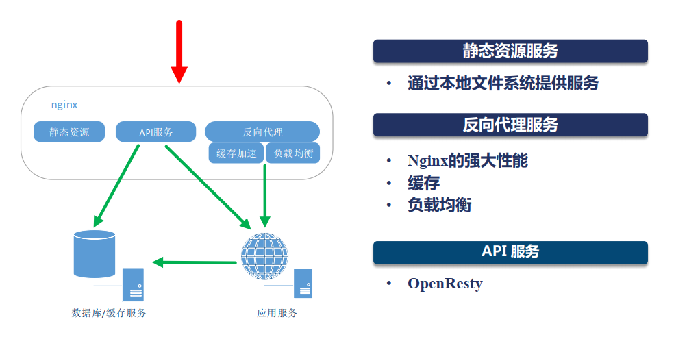
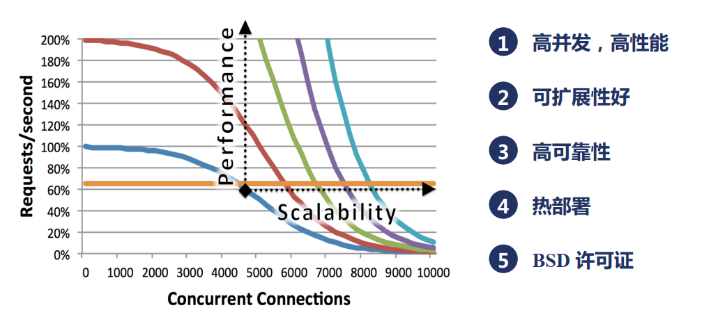

# Nginx基础

## 主要应用场景



## nginx的优点



- 可扩展性：表示围绕nginx开发出了很多周边产品
- 热部署：不用重启可以直接使配置生效
- BSD许可：nginx是免费的，开源的

## 主要组成部分


## linux上编译安装

1. 解压压缩包：`tar -xzvf nginx-1.18.0.tar.gz`

   ```shell
   drwxr-xr-x. 6 andy andy   4096 Jul 14 21:47 auto
   -rw-r--r--. 1 andy andy 302863 Apr 21 22:09 CHANGES
   -rw-r--r--. 1 andy andy 462213 Apr 21 22:09 CHANGES.ru
   drwxr-xr-x. 2 andy andy   4096 Jul 14 21:47 conf
   -rwxr-xr-x. 1 andy andy   2502 Apr 21 22:09 configure # 导入第三方模块
   drwxr-xr-x. 4 andy andy     68 Jul 14 21:47 contrib # 
   drwxr-xr-x. 2 andy andy     38 Jul 14 21:47 html # 默认的页面
   -rw-r--r--. 1 andy andy   1397 Apr 21 22:09 LICENSE
   drwxr-xr-x. 2 andy andy     20 Jul 14 21:47 man # 命令帮助
   -rw-r--r--. 1 andy andy     49 Apr 21 22:09 README
   drwxr-xr-x. 9 andy andy     84 Jul 14 21:47 src # 存放源码
   
   ```

2. 创建一个nginx的安装目录：`/usr/local/software/nginx`

3. 查看`nginx`支持的参数：`./configure --help`

   ```shell
   --prefix=PATH                      set installation prefix # 默认使用此项
   --with-http_ssl_module             enable ngx_http_ssl_module # with开头 表示手动添加该模块
   --without-http_charset_module      disable ngx_http_charset_module # 表示手动禁止该模块
   ```

4. 执行导入命令：`./configure --prefix=/usr/local/software/nginx`，期间解决对应的错误

5. 安装GCC编译器：`yum install -y gcc`

6. 安装PCRE库：`yum install -y pcre pcre-devel`

7. 安装zlib库： yum install -y zlib zlib-devel

   ```shell
   # 成功
   Configuration summary
     + using system PCRE library
     + OpenSSL library is not used
     + using system zlib library
   
     nginx path prefix: "/usr/local/software/nginx"
     nginx binary file: "/usr/local/software/nginx/sbin/nginx"
     nginx modules path: "/usr/local/software/nginx/modules"
     nginx configuration prefix: "/usr/local/software/nginx/conf"
     nginx configuration file: "/usr/local/software/nginx/conf/nginx.conf"
     nginx pid file: "/usr/local/software/nginx/logs/nginx.pid"
     nginx error log file: "/usr/local/software/nginx/logs/error.log"
     nginx http access log file: "/usr/local/software/nginx/logs/access.log"
     nginx http client request body temporary files: "client_body_temp"
     nginx http proxy temporary files: "proxy_temp"
     nginx http fastcgi temporary files: "fastcgi_temp"
     nginx http uwsgi temporary files: "uwsgi_temp"
     nginx http scgi temporary files: "scgi_temp"
   
   ```

8. 导入的模块在obs目录中

9. 编译：`[root@ocean nginx-1.18.0]# make`

10. 安装：`[root@ocean nginx-1.18.0]# make install`

11. 到安装目录下可查看到安装后的目录结构

    ```shell
    drwxr-xr-x. 2 root root 4096 Jul 14 22:12 conf # 配置文件
    drwxr-xr-x. 2 root root   38 Jul 14 22:12 html
    drwxr-xr-x. 2 root root    6 Jul 14 22:12 logs # 日志文件
    drwxr-xr-x. 2 root root   18 Jul 14 22:12 sbin # 二进制文件
    
    ```


## 基本命令

### 启动

1. 默认方式启动：

   ```shell
   ./nginx # 会读取安装路径下的nginx.conf文件
   ```

2. 另指定配置文件

   ```bash
   ./nginx -c tmpnginx.conf # 使用-c参数指定配置文件,会读取-c参数后指定nginx.conf配置文件来启动Nginx。
   ```

3. 测试配置信息

   ```bash
   ./nginx -t # 在不启动Nginx的情况下，使用-t参数仅测试配置文件是否有错误,执行结果中显示配置是否正确
   ```

4. 显示版本

   ```bash
   ./nginx  -v # 使用-v参数显示Nginx的版本信息
   ```

### 停止

1. 快速地停止服务

   ```bash
   # 强制停止Nginx服务。-s参数其实是告诉Nginx程序向正在运行的Nginx服务发送信号量，Nginx程序通过nginx.pid文件中得到master进程的进程ID，再向运行中的master进程发送TERM信号来快速地关闭Nginx服务
   ./nginx -s stop
   ```

2. 直接通过kill命令来发送信号

   ```bash
   kill -s SIGTERM 10800  # 先通过ps命令来查看nginx master的进程ID，再使用kill
   ```

3. “优雅”地停止服务

   ```bash
   #如果希望Nginx服务可以正常地处理完当前所有请求再停止服务，那么可以使用-s quit参数来停止服务。该命令与快速停止Nginx服务是有区别的。当快速停止服务时，worker进程与master进程在收到信号后会立刻跳出循环，退出进程。而“优雅”地停止服务时，首先会关闭监听端口，停止接收新的连接，然后把当前正在处理的连接全部处理完，最后再退出进程
   /nginx nginx -s quit
   ```

4. 使运行中的Nginx重读配置项并生效

   ```bash
   ./nginx -s reload # 更改配置项后重新加载生效
   ```

### 热部署

就是升级nginx的版本，主要还是升级二进制文件 nginx

1. 查看nginx的master进程，这里是54388

   ```bash
   root      54388      1  0 07:42 ?        00:00:00 nginx: master process ./nginx
   nobody    54389  54388  0 07:42 ?        00:00:00 nginx: worker process
   ```

   

2. 备份久版本的nginx文件：`cp nginx nginx.old`

3. 将新版本的nginx文件拷贝到暗转nginx目录中(也是上面提到的备份目录)：

   `cp  nginx/usr/local/software/nginx/sbin `

4. 向master进程发出升级的信息：`kill -USR2 54388`
   以上命令执行完后，新的nginx就会启动，老的nginx进程也会存在（ps命令可查看

5. 向老的nginx进程发出关闭命令：`kill -WINCH 54388 `
   通过ps命令可以看到，老的nignx的master依然存在，但woker进程已经退出了。master存在的作用主要是为了用户进行版本回退。

## nginx.conf

官方文档：http://nginx.org/en/docs/

**这里演示5配置：**

1. server的日志输出配置 
2. alias的使用  
3. autoindex使用 
4. 压缩传输 
5. 传输速率限制

```shell
#user  nobody;
worker_processes  1;
events {
    worker_connections  1024;
}

http {
    include       mime.types;
    default_type  application/octet-stream;
    # 配置日志的输出格式，该格式名称为 main 下面在server中指定main的输出文件
    log_format  main  '$remote_addr - $remote_user [$time_local] "$request" '
                      '$status $body_bytes_sent "$http_referer" '
                      '"$http_user_agent" "$http_x_forwarded_for"';

    #access_log  logs/access.log  main;
    sendfile        on;
    #tcp_nopush     on;
    #keepalive_timeout  0;
    keepalive_timeout  65;
    gzip  on; # 打开 表示 向浏览器传输的文件 会经过压缩
    gzip_min_length 1;# 小于1字节 不再压缩
    gzip_comp_level 2;# 压缩级别
    gzip_types text/plain application/x-javascript text/css application/xml text/javascript application/x-httpd-php image/jpeg image/gif image/png # 表示压缩的类型
    server {
        listen       8080;
        server_name  localhost;
        #charset koi8-r;
        # 访问这个server的日志的输出位置 格式采用main
         access_log  logs/tcs.access.log  main;
        location / { # 这里配置项目路径
           #root   html;
	   	   alias dlib/dlib20/docs/; # 资源路径； 该目录下的文件 项目路径中的文件，会到该目录下找
 	   	   autoindex on; # 打开 页面将以目录结构的形式展示，要求上面的资源路径下不能有index.html文件
 	   	   set $limit_rate 1k;# 控制传输速度 1kB/s
           #index  index.html index.htm;
        }
        error_page   500 502 503 504  /50x.html;
        location = /50x.html {
            root   html;
        }
        
    }
}
```

反向代理(官网中的 ngx_http_proxy_module)

```shell
#user  nobody;
worker_processes  1;
events {
    worker_connections  1024;
}

http {
    include       mime.types;
    default_type  application/octet-stream;
  
    #access_log  logs/access.log  main;
    sendfile        on;
    #tcp_nopush     on;
    #keepalive_timeout  0;
    keepalive_timeout  65;
    upstream local { # 负载均衡池 命名为local
    	server 127.0.0.1:8080; # 上游服务器的地址
    }
    server {
        listen       80;
        server_name  ocean.tcs.com;
        #charset koi8-r;
        location / { # 这里配置项目路径
        	# 将访问方(如浏览器)的ip地址 设置到请求中，不然上游服务器获取的是本nginx所在的ip,下面相同
         	proxy_set_header Host $host; 
         	proxy_set_header X-Real-IP $remote_addr;
         	proxy_set_header X-Forwarded-For $proxy_add_x_forwarded_for;
         	proxy_pass http://local;# 请求给名字为local的负载均衡池处理
        }
        error_page   500 502 503 504  /50x.html;
        location = /50x.html {
            root   html;
        }
        
    }
}
```


