# http模块

## 基本配置块

```nginx
main
http {
    upstream { … }
    split_clients {…}
    map {…}
    geo {…}
    server {
        if () {…}
        location {
            limit_except {…}
        }
        location {
            location {
            }
        }
    }
    server {
    }
}
```

**官方指令解读**

```nginx
Syntax: log_format name [escape=default|json|none] string ...;
Default: log_format combined "...";
Context: http # 表示这条指令可以出现的上下文(只能在http块中)

Syntax: access_log path [format [buffer=size] [gzip[=level]] [flush=time] [if=condition]];
access_log off;
Default: access_log logs/access.log combined;
Context: http, server, location, if in location, limit_except
```

**指令覆盖(存储值的指令)**

```nginx
server { 
    listen 8080;
    root /home/geek/nginx/html; # 父配置块存在
    access_log logs/geek.access.log main;
    location /test {
        root /home/geek/nginx/test; # 子配置跟父配置同时存在，则会覆盖父配置
        access_log logs/access.test.log main;
    }
    location /dlib {
    	alias dlib/;
    }
    location / {
		# 这里不存在root获取alias 直接使用父配置块中的root指令
    }
}
```

## Listen指令

```nginx
Syntax:
listen address[:port] [default_server] [ssl] [http2 | spdy] [proxy_protocol] [setfib=number] [fastopen=number] [backlog=number] [rcvbuf=size]
[sndbuf=size] [accept_filter=filter] [deferred] [bind] [ipv6only=on|off] [reuseport] [so_keepalive=on|off|[keepidle]:[keepintvl]:[keepcnt]];
listen port [default_server] [ssl] [http2 | spdy] [proxy_protocol] [setfib=number] [fastopen=number] [backlog=number] [rcvbuf=size] [sndbuf=size]
[accept_filter=filter] [deferred] [bind] [ipv6only=on|off] [reuseport] [so_keepalive=on|off|[keepidle]:[keepintvl]:[keepcnt]];
listen unix:path [default_server] [ssl] [http2 | spdy] [proxy_protocol] [backlog=number] [rcvbuf=size] [sndbuf=size] [accept_filter=filter] [deferred]
[bind] [so_keepalive=on|off|[keepidle]:[keepintvl]:[keepcnt]];
Default: listen *:80 | *:8000;
Context: server
```

示例

```nginx
listen unix:/var/run/nginx.sock;
listen 127.0.0.1:8000;
listen 127.0.0.1;
listen 8000;
listen *:8000;
listen localhost:8000 bind;
listen [::]:8000 ipv6only=on;
listen [::1];
```

## 接收请求的流程

**接收请求事件模块**

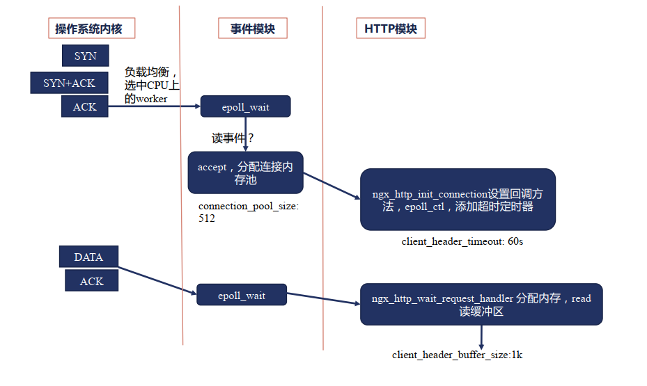

这个阶段分配连接内存池

**接收请求HTTP模块**

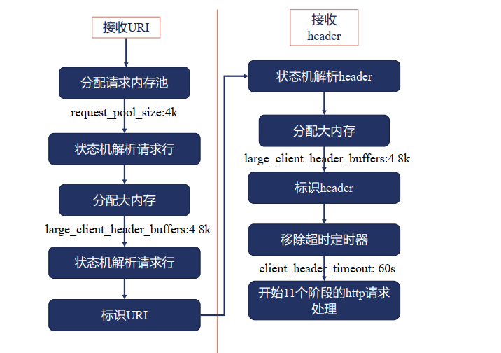

当请请求行过大时，会重新分配大内存即`large_client_header_buffer:4 8k`,意思是先分配一个8k,如果这个8k仍然不够用，那么就分配第二个8k,最多分配4个8k
标识URI即是，维护指向该URI的指针，有利于之后从该URI中获取信息

```nginx
Syntax: client_header_buffer_size size;
Default: client_header_buffer_size 1k;
Context: http, server

Syntax: large_client_header_buffers number size;
Default: large_client_header_buffers 4 8k;
Context: http, server
```


## nginx正则表达式

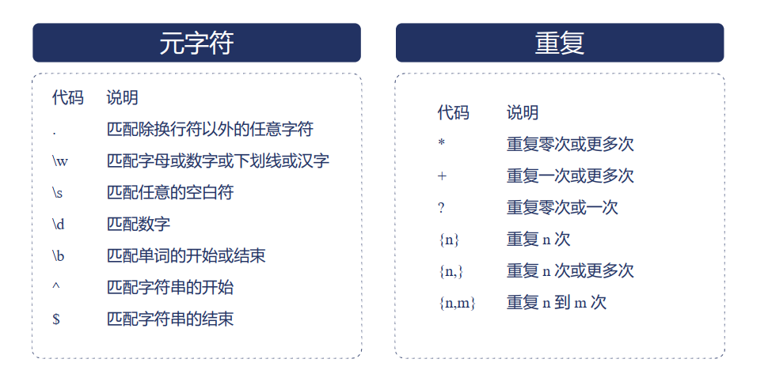

```nginx
# 示例
# 原始url
/admin/website/article/35/change/uploads/party/5.jpg
# 目标url
/static/uploads/party/5.jpg
# 使用正则表达式
/^\/admin\/website\/article\/(\d+)\/change\/uploads\/(\w+)\/(\w+)\.(png|jpg|gif|jpeg|bmp)$/
rewrite^/admin/website/solution/(\d+)/change/uploads/(.*)\.(png|jpg|gif|jpeg|bmp)$
/static/uploads/$2/$3.$4 last;
```

这里的()小括号 可以起到分组提取的作用，下面可以通过变量的方式进行引用。

## server_name  

**有以下几种配置方式**

```nginx
# 精确匹配 多个域名用空格隔开
server {
	server_name primary.ocean.com second.ocean.com;
}
# *泛域名：仅支持在最前或者最后
server {
	server_name *.ocean.com main.ocean.*; 
}
# 使用正则表达式：加~前缀
server {
	server_name ~^www\d+\.ocean\.com$; 
}
# 这种表达式还可以创建变量
server {
	server_name  ~^(www\.)?(.+)$;; 
    location / {
        root /site/$2;
    }       
}
# 或者是给正则表达式的分组命名 然后直接引用名字
server {
    server_name ~^(www\.)?(?<domain>.+)$; # ?<domain> 这种方式命名为domain
    location / { 
        root /sites/$domain; # 直接引用命名
    }
}
```

**匹配顺序**

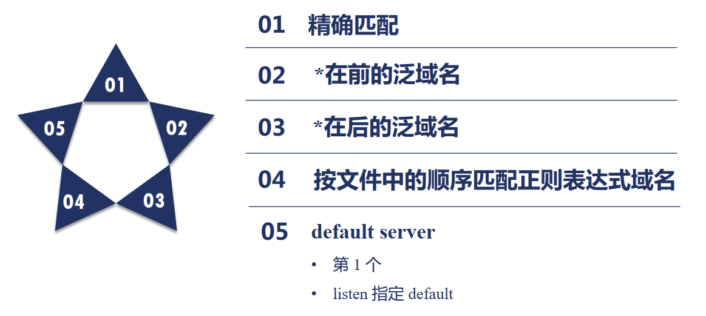

第5点就是确保http中有一个server块能够处理用户的请求。(用户的请求中，如果没有匹配到任何一个server,则使用该默认server)，default server有两种方式，一种是如果没有显式指定，则在配置文件中，第一个server则是default server。第二种是，在listen指令中如果有default 则该指令所在的server则为default server。

**server_name_in_redirect**  的使用

```nginx
Syntax server_name_in_redirect on | off;
Default server_name_in_redirect off;
Context http, server, location
```

有以下配置文件，下面演示该指令的用法：

```nginx
server {
        server_name primary.ocean.com second.ocean.com; # 写在前面的为主域名
        server_name_in_redirect off; # 这里关闭
        return 302 /redirect;
}
```

执行` curl second.ocean.com -I`返回以下信息(-I参数用于查看返回信息)

```shell
HTTP/1.1 302 Moved Temporarily
Server: nginx/1.18.0
Date: Thu, 30 Jul 2020 13:01:20 GMT
Content-Type: text/html
Content-Length: 145
Location: http://second.ocean.com/redirect # 返回了curl的域名
Connection: keep-alive
```

将`server_name_in_redirect`设置为on，执行` curl second.ocean.com -I`

```shell
HTTP/1.1 302 Moved Temporarily
Server: nginx/1.18.0
Date: Thu, 30 Jul 2020 13:05:29 GMT
Content-Type: text/html
Content-Length: 145
Location: http://primary.ocean.com/redirect # 返回主域名
Connection: keep-alive
```

## HTTP处理的11个阶段

**阶段划分**

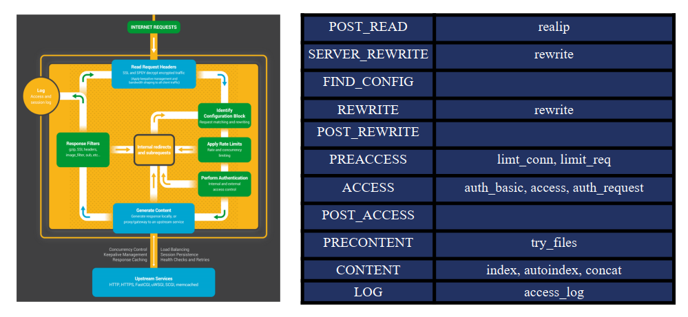

**阶段处理顺序**

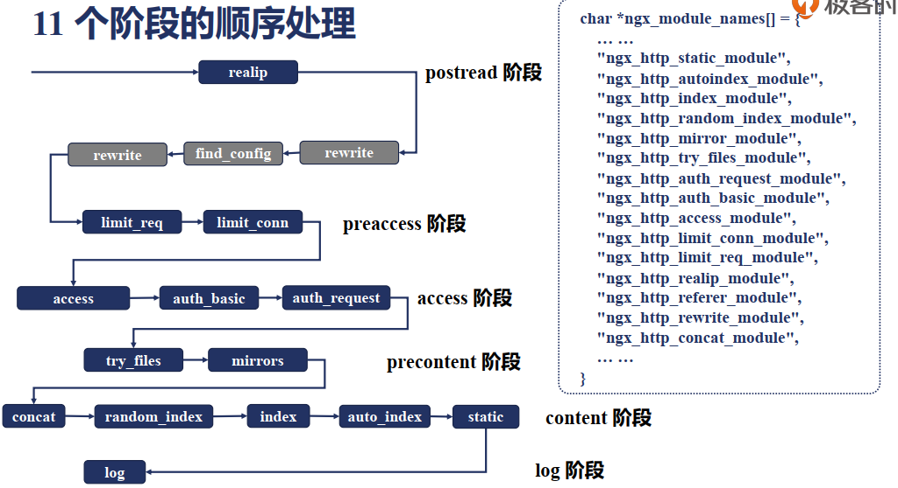

1. 总体上来说说按照上图中的顺序执行
2. 也可能出现同一阶段中，如果其中的一个执行满足执行，就不会执行另外一个指令了。如index执行先与auto_index执行执行，满足index执行条件而执行index指令后，就不执行auto_index指令了。
3. 阶段间是固定的，同一阶段内的各模块是倒序的(相对于ngx_module_names[] 这个数组中出现的顺序)

## postread阶段：realip模块

问题：如何获取到请求用户的真实地址
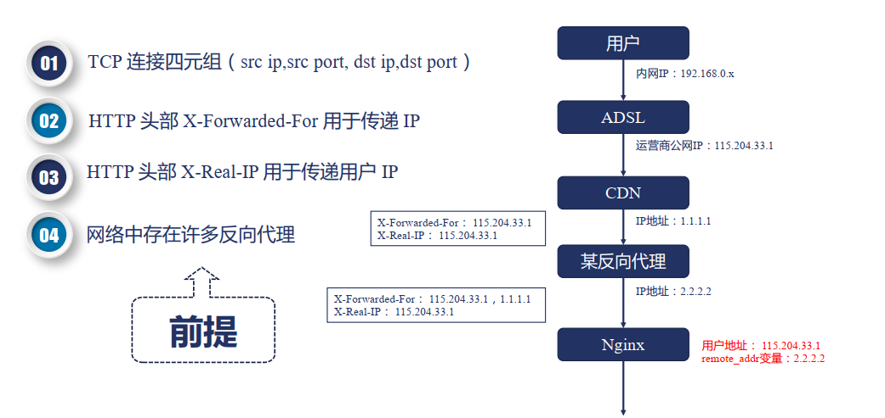

假设用户有一个内网地址192.168.0.x,对应的运行商分配的公网地址是115.204.33.1(也就是用户的真实ip),限速或者链接控制，也是基于公网地址。在Nginx端，如果通过remote_addr变量，那么获取到的可能是上游某个反向代理的ip（如上面的2.2.2.2)

通过http头部的X-Forwarded-For跟X-Real-IP都可以传递真实的用户ip，X-Forwarded-For相对于X-Real-IP可以添加多个IP，如上图所示，而X-Real-IP没有这个功能。

realip模块默认是不编译的。通过 --with-http_realip_module启用 同时realip模块提供了以下新的变量和指令

```nginx
# 变量
realip_remote_addr
realip_remote_port
```

**指令**

```nginx
# 表示在该nginx中设置得信任ip是哪个，也就是从哪里发过来的请求是可控的 即白名单
Syntax: set_real_ip_from address | CIDR | unix:; 
Default: —
Context: http, server, location

# 表示real_ip_header这个变量的值 从http的那个field来取
Syntax: real_ip_header field | X-Real-IP | X-Forwarded-For | proxy_protocol;
Default: real_ip_header X-Real-IP;
Context: http, server, location

# 递归搜索是否开启 这一项要结合set_real_ip_from来使用，其目的是 找到除信任地址外的客户端地址
# 如果是开启，会继续在X-Forwarded-For中从后面开始找，如果是信任地址，则pass掉，知道找到非信任地址
Syntax: real_ip_recursive on | off;
Default: real_ip_recursive off;
Context: http, server, location
```

以下面的配置进行演示

```nginx
server {
        listen 8081;
     	# 在hosts文件中添加映射 192.168.158.110 realip.ocean.com
        server_name realip.ocean.com;
        error_log logs/myerror.log debug;
        set_real_ip_from  192.168.158.110;
        #real_ip_header X-Real-IP;
        real_ip_recursive off;
        #real_ip_recursive on;
        real_ip_header    X-Forwarded-For;

        location /{
                return 200 "Client real ip: $remote_addr\n";
        }

}

```

执行`curl -H  "X-Forwarded-For: 167.156.88.199,192.168.158.110" http://realip.ocean.com:8081/`（-H 表示用来添加头部）

返回结果

```shell
[root@ocean nginx]# curl -H  "X-Forwarded-For:167.156.88.199,192.168.158.110" http://realip.ocean.com:8081/
Client real ip: 192.168.158.110 # 未打开循环搜索

Client real ip: 167.156.88.199 # 打开循环搜索 就会查找返回除信任地址外的地址
```


## rewrite模块

### return指令

```nginx
Syntax:
        return code [text];
        return code URL;
        return URL;	# 没有状态码，表示临时重定向
Default: —
Context: server, location, if
```

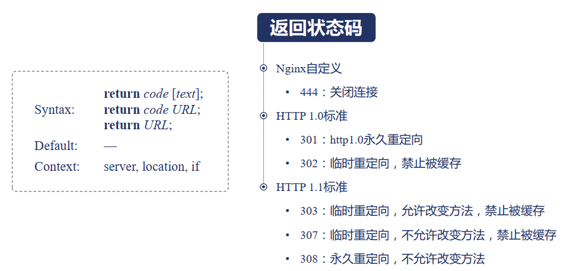

永久重定向：假设nginx所在服务器为a，nginx向客户端返回了重定向的地址b,永久重定向就是指客户端会缓存b的地址，下次要访问b时就不再访问a而直接访问b了。临时重定向则要求客户端不能缓存b的地址，下次依然访问a。

允许改变方法则是指，在访问a使用的方法(举例：post)在重定向时运行改成get方法。

### return 与 error_page  

```nginx
Syntax: error_page code ... [=[response]] uri;# response可自定义内容，比如返回一个友好的提示页面
Default: —
Context: http, server, location, if in location
```

示例：

```nginx
1. error_page 404 /404.html;
2. error_page 500 502 503 504 /50x.html;
3. error_page 404 =200 /empty.gif;
4. error_page 404 = /404.php;
5. location / {
	error_page 404 = @fallback;
   }
  location @fallback {
	proxy_pass http://backend;
  }
6. error_page 403 http://example.com/forbidden.html;
7. error_page 404 =301 http://example.com/notfound.html;
```

> 问题1：server与location中return指令的关系是如何？
> 问题2：return与error_page指令关系

**演示**
配置1：

```nginx
server {
	server_name return.ocean.com;
	listen 8181;
	root html/;
	error_page 404 /403.html;# 出现404时 就向用户返回该页面(自定义该页面)
	# return 405;
	location /{
		# return 404 "find nothing!\n";
	}
}
```

执行`curl return.ocean.com:8181/a.html`其中a.html为不存在页面。返回以下结果

```shell
<p>test 403 forbident</p> # 该内容为403.html中的内容 表明 error_page 404 /403.html生效
```

配置2：

```nginx
server {
	server_name return.ocean.com;
	listen 8181;
	root html/;
	error_page 404 /403.html;# 出现404时 就向用户返回该页面(自定义该页面)
	# return 405;
	location /{
		return 404 "find nothing!\n"; # 相比配置1 打开了该位置
	}
}
```

执行`curl return.ocean.com:8181/a.html` 返回以下结果

```shell
find nothing! # 此时location中的return生效
```

配置3：

```nginx
server {
        server_name return.ocean.com;
        listen 8181;
        root html/;
        error_page 404 /403.html;
        return 405; # 相比配置2打开此处
        location /{
                return 404 "find nothing!\n";
        }
}
```

返回结果为

```shell
# 这里表明server中的return生效
<html>
<head><title>405 Not Allowed</title></head>
<body>
<center><h1>405 Not Allowed</h1></center>
<hr><center>nginx/1.18.0</center>
</body>
</html>
```

**结论：return指令会先于error_page指令执行， server 中的return 属于SERVER_REWRITE 阶段，location 中的 return属于 REWRITE 阶段，SERVER_REWRITE先于REWRITE阶段执行。**

### rewrite 指令

```nginx
Syntax: rewrite regex replacement [flag];
Default: —
Context: server, location, if
```


**演示**

配置1：

```nginx
server {
        server_name rewrite.ocean.com;
        rewrite_log on;
        error_log logs/rewrite_error.log notice;
        root html/;
        location /first {
                rewrite /first(.*) /second$1 last;
                return 200 'first!\n';
        }
        location /second {
                #rewrite /second(.*) /third$1 break;
                rewrite /second(.*) /third$1;
                return 200 'second!\n';
        }
        location /third {
                return 200 'third!\n';
        }

}
```

执行`curl rewrite.ocean.com/first/3.txt` 返回结果为

```bash
second! # 表明在/second这个location中的rewire跟return指令顺序执行
```

配置2：

```nginx
server {
        server_name rewrite.ocean.com;
        rewrite_log on;
        error_log logs/rewrite_error.log notice;
        root html/;
        location /first {
                rewrite /first(.*) /second$1 last;
                return 200 'first!\n';
        }
        location /second {
                rewrite /second(.*) /third$1 break; # 相比配置1打开这里 ，break表示结束下面指令的执行
                #rewrite /second(.*) /third$1;
                return 200 'second!\n';
        }
        location /third {
                return 200 'third!\n';
        }

}
```

执行`curl rewrite.ocean.com/first/3.txt` 返回结果为

```shell
this is third txt # 输出了html/third/3.txt文件中的内容
```

配置3：

```nginx
server {
        server_name rewrite.ocean.com;
        rewrite_log on; # 这里打开了重定向的日志s
        error_log logs/rewrite_error.log notice;
        root html/;
        location /redirect1 {
                rewrite /redirect1(.*) $1 permanent;
        }
        location /redirect2 {
                rewrite /redirect2(.*) $1 redirect;
        }
        location /redirect3 {
                rewrite /redirect3(.*) http://rewrite.ocean.com$1;
        }
        location /redirect4 {
                rewrite /redirect4(.*) http://rewrite.ocean.com$1 permanent;
        }
}
```

执行`curl rewrite.ocean.com/redirect1/ -I` 返回结果

```bash
# curl rewrite.ocean.com/redirect1/ -I
HTTP/1.1 301 Moved Permanently
Server: nginx/1.18.0
Date: Sun, 02 Aug 2020 05:59:12 GMT
Content-Type: text/html
Content-Length: 169
Location: http://rewrite.ocean.com/
Connection: keep-alive
# curl rewrite.ocean.com/redirect2/ -I
HTTP/1.1 302 Moved Temporarily
Server: nginx/1.18.0
Date: Sun, 02 Aug 2020 10:19:35 GMT
Content-Type: text/html
Content-Length: 145
Location: http://rewrite.ocean.com/
Connection: keep-alive
# curl rewrite.ocean.com/redirect3/ -I
HTTP/1.1 302 Moved Temporarily
Server: nginx/1.18.0
Date: Sun, 02 Aug 2020 10:20:04 GMT
Content-Type: text/html
Content-Length: 145
Connection: keep-alive
Location: http://rewrite.ocean.com/
# curl rewrite.ocean.com/redirect4/ -I
HTTP/1.1 301 Moved Permanently
Server: nginx/1.18.0
Date: Sun, 02 Aug 2020 10:20:42 GMT
Content-Type: text/html
Content-Length: 169
Connection: keep-alive
Location: http://rewrite.ocean.com/

```

rewrite行为计入日志：

```nginx
Syntax: rewrite_log on | off;
Default: rewrite_log off;
Context: http, server, location, if
```

### if 指令

```nginx
Syntax: if (condition) { ... } # 条件为真
Default: —
Context: server, location
```


变量为空或者值为0 这该条件表达式为false

```nginx
if ($http_user_agent ~ MSIE) {
	rewrite ^(.*)$ /msie/$1 break;
}
if ($http_cookie ~* "id=([^;]+)(?:;|$)") {
	set $id $1;
}
if ($request_method = POST) {
	return 405;
}
if ($slow) {
	limit_rate 10k;
}
if ($invalid_referer) {
	return 403;
}
```

## find_config阶段

### location

```nginx
Syntax:
location [ = | ~ | ~* | ^~ ] uri { ... }
location @name { ... }
Default: —
Context: server, location
Syntax: merge_slashes on | off; # 是否合并斜杠
Default: merge_slashes on;
Context: http, server
```

location 匹配规则：仅匹配URI，忽略参数

1. 前缀字符串匹配
   1. 常规的方式  如 /test
   2. 用=号精确匹配
   3. ^~ 表示匹配上后则不再进行正则表达式的匹配
2. 正则表达式
   1. ~ 大小写敏感的正则匹配
   2. ~* 忽略大小写的正则匹配
3. 用于内部跳转的命名location @

**匹配顺序**

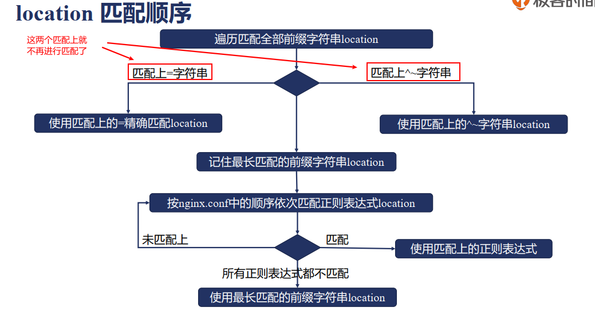

```nginx
server {
        server_name location.ocean.com;
        error_log  logs/error.log  debug;
        #root html/;
        default_type text/plain;
        merge_slashes off;
        location ~ /Test1/$ {
                return 200 'first regular expressions match!\n';
        }
        location ~* /Test1/(\w+)$ {
                return 200 'longest regular expressions match!\n';
        }
        location ^~ /Test1/ {
                return 200 'stop regular expressions match!\n';
        }
        location /Test1/Test2 {
                return 200 'longest prefix string match!\n';
        }
        location /Test1 {
                return 200 'prefix string match!\n';
        }
        location = /Test1 {
                return 200 'exact match!\n';
        }
}
```

以上配置文件，执行以下命令 看返回结果

```bash
curl location.ocean.com/Test1 #exact match!
curl location.ocean.com/Test1/ # stop regular expressions match!
curl location.ocean.com/Test1/Test2 # longest regular expressions match!
curl location.ocean.com/Test1/Test2/ # longest prefix string match!
```

总结：

1. 匹配精确匹配
2. 记住最长匹配
3. 带有~^的location匹配上的话，就停止匹配，使用该location,否则继续找
4. 接着按照正则出现在配置文件中的顺序去匹配
5. 正则都没匹配上，那就用步骤二中找到的最长匹配

## preaccess  模块

### limit_conn

ngx_http_limit_conn_module 模块用于限制每个客户端的的并发连接数


步骤1：限制共享内存的大小

```nginx
Syntax: limit_conn_zone key zone=name:size; # key表示根据什么关键字来限制请求
Default: —
Context: http
```

步骤2：限制并发连接数

```nginx
Syntax: limit_conn zone number; # 这里的zone为上面定义的zone名称
Default: —
Context: http, server, location
```

步骤3：设置日志级别

```nginx
Syntax: limit_conn_log_level info | notice | warn | error;
Default: limit_conn_log_level error;
Context: http, server, location
```

步骤4：限制发生时向客户端返回的错误码

```nginx
Syntax: limit_conn_status code;
Default: limit_conn_status 503;
Context: http, server, location
```

演示：

```nginx
limit_conn_zone $binary_remote_addr zone=addr:10m; # 定义10m的共享内存
server {
        server_name limit.ocean.com;
        root html/;
        error_log logs/myerror.log info;

        location /{
                limit_conn_status 500;
                limit_conn_log_level  warn;
                limit_rate 50;# 每秒种只向用户返回50个字节，为了创造并发的场景
                limit_conn addr 1;# 为了演示 这里设置为1
        }
}

```

同时用两个客户端访问，可以看到返回500的结果

```bash
#  curl limit.ocean.com
<html>
<head><title>500 Internal Server Error</title></head>
<body>
<center><h1>500 Internal Server Error</h1></center>
<hr><center>nginx/1.18.0</center>
</body>
</html>
# 查看日志
2020/08/03 22:24:25 [warn] 120054#0: *48 limiting connections by zone "addr", client: 127.0.0.1, server: limit.ocean.com, request: "GET / HTTP/1.1", host: "limit.ocean.com"

```

### limit_req

ngx_http_limit_req_module 模块限制每个客户端的每秒处理请求数

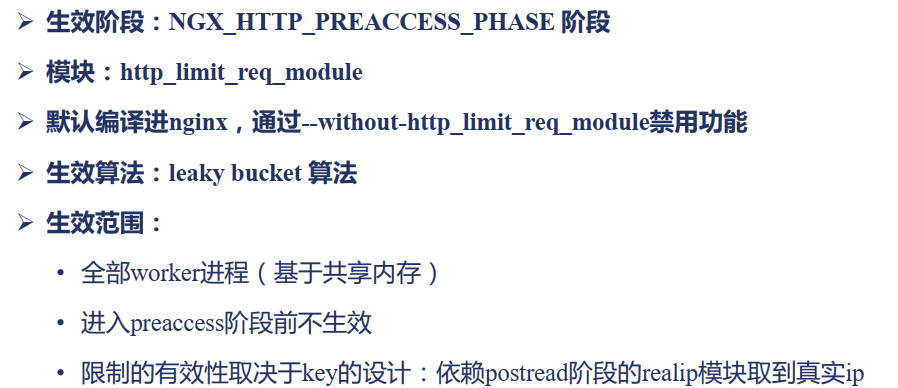

leaky bucket算法解释：


步骤1：定义共享内存，关键字和限制速率

```nginx
Syntax: limit_req_zone key zone=name:size rate=rate ;# rate单位为r/s或者r/m 每秒或者每分钟允许多少请求
Default: —
Context: http
```

步骤2：限制并发连接数

```nginx
Syntax: limit_req zone=name [burst=number] [nodelay];
Default: —
Context: http, server, location
# burst默认为0 burst表示上图中那个水盘允许的大小
# nodelay，对burst中的请求不再采用延迟处理的做法，而是立刻处理
```

步骤3：限制发生时的日志级别

```nginx
Syntax: limit_req_log_level info | notice | warn | error;
Default: limit_req_log_level error;
Context: http, server, location
```

步骤4：限制发生时向客户端返回的错误码

```nginx
Syntax: limit_red_status code;
Default: limit_red_status 503;
Context: http, server, location
```

演示配置1：

```nginx
limit_req_zone $binary_remote_addr zone=one:10m rate=2r/m; # 每分钟两次
server {
        server_name limit.ocean.com;
        root html/;
        error_log logs/myerror.log warn;
        location /{
                #limit_req zone=one burst=3 nodelay;
                limit_req zone=one;
        }
}
```

执行`curl limit.ocean.com` 第一次返回获取成功的结果，第二次时返回了503的报错信息

```bash
<html>
<head><title>503 Service Temporarily Unavailable</title></head>
<body>
<center><h1>503 Service Temporarily Unavailable</h1></center>
<hr><center>nginx/1.18.0</center>
</body>
</html>
```

配置2：

```nginx
limit_req_zone $binary_remote_addr zone=one:10m rate=2r/m;
server {
        server_name limit.ocean.com;
        root html/;
        error_log logs/myerror.log warn;

        location /{
                limit_req zone=one burst=3 nodelay;
                # limit_req zone=one;
        }
}
```

执行`curl limit.ocean.com` 前3次都返回了正常的结果，第四次时返回了503。`burst`生效。

配置3：验证`limit_req` 和 `limit_conn`哪个先生效

```nginx
limit_conn_zone $binary_remote_addr zone=addr:10m;
limit_req_zone $binary_remote_addr zone=one:10m rate=2r/m;

server {
        server_name limit.ocean.com;
        root html/;
        error_log logs/myerror.log warn;
        location /{
                limit_conn_status 500;
                limit_conn_log_level  warn;
                limit_rate 50;
                limit_conn addr 1;
                #limit_req zone=one burst=3 nodelay;
                limit_req zone=one;
        }
}
```

指定第二次``curl limit.ocean.com`时 返回的是503 表明`limit_req`先与`limit_conn`生效

## access阶段

### access模块


可以在此阶段限制默写ip的访问或者设置可以访问的白名单

```nginx
Syntax: allow address | CIDR | unix: | all;
Default: —
Context: http, server, location, limit_excep

Syntax: deny address | CIDR | unix: | all;
Default: —
Context: http, server, location, limit_except
```

示例：

```nginx
location / {
    deny 192.168.1.1;
    allow 192.168.1.0/24;
    allow 10.1.1.0/16;
    allow 2001:0db8::/32;
    deny all;
}
```

### auth_basic  

配置了该模块，在用户请求的时候会要求用户输入用户名和密码


```nginx
Syntax: auth_basic string | off; # string表示向用户提示时的展示信息
Default: auth_basic off; 
Context: http, server, location, limit_except

Syntax: auth_basic_user_file file;# 存储用户名和密码的文件
Default: —
Context: http, server, location, limit_except
```

```nginx
server {
	server_name access.ocean.ocean;
	error_log  logs/error.log  debug;
	#root html/;
	default_type text/plain;
	location / {
		satisfy any;
		auth_basic "test auth_basic";
		auth_basic_user_file examples/auth.pass;# 用httpd_tool工具生成的用户名跟密码文件
		deny all;
	}
}
```


### auth_request

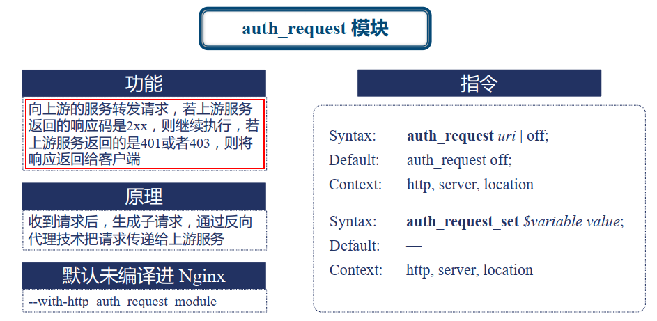

```nginx
Syntax: auth_request uri | off; # 配置上游服务器的uri
Default: auth_request off;
Context: http, server, location

Syntax: auth_request_set $variable value;
Default: —
Context: http, server, location
```

```nginx
server {
	server_name access.ocean.com;
	error_log  logs/error.log  debug;
	#root html/;
	default_type text/plain;
	location / {
		auth_request /test_auth; # 请求到这里时就会生成一个子请求 该请求访问去访问 /test_auth
        # 如果上游服务器返回成功，这个location就会继续访问默认的  root html/ 如果上游服务器拒绝了 则向客户端返回上游服务器的错误码
	}
	location = /test_auth {
		proxy_pass http://127.0.0.1:8090/auth_upstream; # 表示去访问另外一台服务器
		proxy_pass_request_body off;
    		proxy_set_header Content-Length "";
    		proxy_set_header X-Original-URI $request_uri;
	}
}
```

### satisfy指令

```nginx
Syntax: satisfy all | any;# all表示access模块，auth_basic跟auth_request这三个模块必须都放行这个请求，这个请求才能继续向下执行,，any表示任意一个模块同意这个请求放行了，那么就可以继续执行这个请求
Default: satisfy all;
Context: http, server, location
```

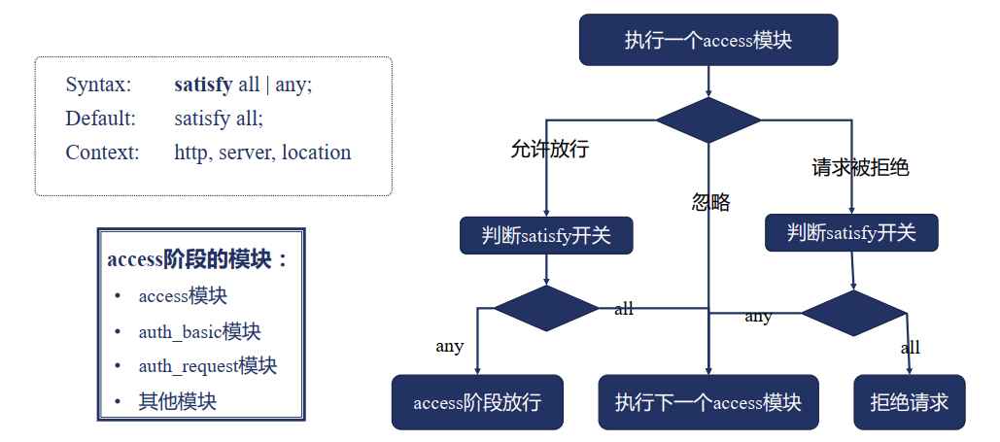

**问题一：如果有return指令，access阶段会生效吗？**

> return指令在server_rewrite跟rewrite阶段 领先于access阶段，所以有return指令则access阶段不会生效。跟配置在配置文件中的位置没有关系。

问题二：多个模块间的顺序是否有影响？

(`ngx_http_auth_request_module  `,`ngx_http_auth_basic_module  `,`ngx_http_access_module  `)

```nginx
location /{
    satisfy any; 
    auth_basic "test auth_basic";# http_auth_basic_module  `
    auth_basic_user_file examples/auth.pass; # http_auth_basic_module  `
    deny all;# access
}
```

这里`deny all`,但如果用户输入的用户名跟**密码正确**，同样能够访问到文件，因为配置了`satisfy any`。

```nginx
location /{
    satisfy any; 
    auth_basic "test auth_basic";# http_auth_basic_module  `
    auth_basic_user_file examples/auth.pass; # http_auth_basic_module  `
    allow all;# access 
}
```

配置成`allow all`用户则没有机会输入密码(因为只要一个阶段满足就可以继续访问)

## precontent阶段

### try_files指令

属于`ngx_http_try_files_module`模块 默认编译进nginx

功能：依次试图访问多个url对应的文件(由root或者alias执行指定)，当文件存在时则直接返回文件内容。如果所有文件都不存在，则按最后一个url结果或者code返回

```nginx
Syntax:  try_files file1 file2... uri;# 依次去找文件 找到了就返回 如果都没找到就返回访问uri的结果
		try_files file1 file2... =code;
Default: —
Context: server, location
```

```nginx
server {
        server_name tryfiles.ocean.com;
        error_log  logs/myerror.log  info;
        root html/;
        default_type text/plain;
        location /first {
                try_files /system/maintenance.html
                        $uri $uri/index.html $uri.html
                        @lasturl;
        }
        location @lasturl {
                return 200 'lasturl!\n';
        }
        location /second {
                try_files $uri $uri/index.html $uri.html =404;
        }
}
```

执行`tryfiles.ocean.com/first`返回`lasturl!`
执行`curl tryfiles.ocean.com/second` 返回404的页面

### mirror模块


```nginx
Syntax: mirror uri | off; # 子请求要去的uri
Default: mirror off;
Context: http, server, location
Syntax: mirror_request_body on | off;
Default: mirror_request_body on;
Context: http, server, location
```

```nginx
server {
    listen 8081;
    error_log logs/error.log debug;
    location / {
        mirror /mirror;
        mirror_request_body off;
    }
    location =/mirror {
        internal;
        proxy_pass http://127.0.0.1:10020$request_uri;
        proxy_set_header Content_Length "";
        proxy_set_header X-Original-URI	$request_uri;
    }
}
```

## content 阶段

### static模块:root与alias

**root指令：**

```nginx
Syntax: root path;
Default: root html;
Context: http, server, location, if in location
```

**alias指令：**

```nginx
Syntax: alias path;
Default: —
Context: location
```

共同点：将url映射为文件路径，以返回静态文件内容。
差别：root会将完整的url映射进文件路径中，alias只会将location后的URL

示例：

首先在html文件下建立一个1.txt的文件，下面是nginx的配置

```nginx
server {
        server_name static.ocean.com;
        error_log  logs/myerror.log  info;
        location /root {
                root html;
        }
        location /alias {
                alias html;
        }
        location ~ /root/(\w+\.txt) {
                root html/first/$1;
        }
        location ~ /alias/(\w+\.txt) {
                alias html/first/$1;
        }
}
```

访问`curl static.ocean.com/root/`返回404，查看日志可以看到实际的url为：
从日志可以看出root指令，会将location中的uri拼接到指令后面的路径中，这里默认访问index.html

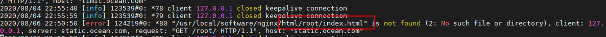

```nginx
<html>
<head><title>404 Not Found</title></head>
<body>
<center><h1>404 Not Found</h1></center>
<hr><center>nginx/1.18.0</center>
</body>
</html>
```

访问`curl static.ocean.com/root/1.txt` 则匹配到下面这个location

```nginx
location ~ /root/(\w+\.txt) {
                root html/first/$1;
       }
```

日志中看到实际的访问路径为：`html/first/1.txt/root/1.txt`

访问` curl static.ocean.com/alias/`则匹配到以下location

```nginx
 location /alias {
                alias html;
        }
```

实际访问路径为html目录下的index.html文件，该文件存在，返回首页信息

访问`curl static.ocean.com/alias/1.txt`则匹配到以下location

```nginx
location ~ /alias/(\w+\.txt) {
                alias html/first/$1;
        }
```

则实际映射路径为：`html/first/1.txt`,文件存在 访问成功

### 三个相关变量

变量 request_filename（待访问文件的完整路径） ，document_root （由URI和root/alias规则生成的文件夹路径） ，realpath_root  （将document_root中的软连接等转换成真实路径）

```nginx
server {
     server_name static.ocean.com;
     error_log  logs/myerror.log  info;
     location /RealPath/ {
	    alias html/realpath/; # 这里指向的是一个软连接 realpath -> first/   first/下面有个文件1.txt
        return 200 '$request_filename:$document_root:$realpath_root\n' # 返回这三个变量
}
```

执行` curl static.ocean.com/RealPath/1.txt` 有以下返回值

```bash
/usr/local/software/nginx/html/realpath/1.txt:/usr/local/software/nginx/html/realpath/:/usr/local/software/nginx/html/first
```

### content-type  

```nginx
Syntax: types { ... }
Default: types { text/html html; image/gif gif; image/jpeg jpg; }
Context: http, server, location
Syntax: default_type mime-type;
Default: default_type text/plain;
Context: http, server, location
Syntax: types_hash_bucket_size size;
Default: types_hash_bucket_size 64;
Context: http, server, location
Syntax: types_hash_max_size size;
Default: types_hash_max_size 1024;
Context: http, server, location
```

