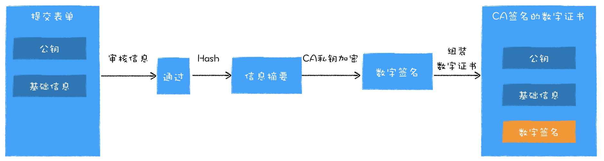

# Https

# 什么是网络安全

- **机密性（Secrecy/Confidentiality）**

  是指对数据的“保密”，只能由可信的人访问，对其他人是不可见的“秘密”，简单来说就是不能让不相关的人看到不该看的东西。

- 完整性（Integrity，也叫一致性）

  是指数据在传输过程中没有被篡改，不多也不少，“完完整整”地保持着原状。机密性虽然可以让数据成为“秘密”，但不能防止黑客对数据的修改，黑客可以替换数据，调整数据的顺序，或者增加、删除部分数据，破坏通信过程。

- 身份认证（Authentication）是指确认对方的真实身份，也就是“证明你真的是你”，保证消息只能发送给可信的人。如果通信时另一方是假冒的网站，那么数据再保密也没有用，黑客完全可以使用冒充的身份“套”出各种信息，加密和没加密一样。比如，小明给小红写了封情书：“我喜欢你”，但不留心发给了小强。小强将错就错，假冒小红回复了一个“白日做梦”，小明不知道这其实是小强的话，误以为是小红的，后果可想而知。

- 不可否认（Non-repudiation/Undeniable），也叫不可抵赖，意思是不能否认已经发生过的行为，不能“说话不算数”“耍赖皮”。使用前三个特性，可以解决安全通信的大部分问题，但如果缺了不可否认，那通信的事务真实性就得不到保证，有可能出现“老赖”。比如，小明借了小红一千元，没写借条，第二天矢口否认，小红也确实拿不出借钱的证据，只能认倒霉。另一种情况是小明借钱后还了小红，但没写收条，小红于是不承认小明还钱的事，说根本没还，要小明再掏出一千元。

# 什么是HTTPS

HTTPS 凭什么就能做到机密性、完整性这些安全特性呢？

秘密就在于 HTTPS 名字里的“S”，它把 HTTP 下层的传输协议由 TCP/IP 换成了 SSL/TLS，由“HTTP over TCP/IP”变成了“HTTP over SSL/TLS”，让 HTTP 运行在了安全的 SSL/TLS 协议上（可参考第 4 讲和第 5 讲），收发报文不再使用 Socket API，而是调用专门的安全接口。


## SSL/TLS

SSL 即安全套接层（Secure Sockets Layer），在 OSI 模型中处于第 5 层（会话层），由网景公司于 1994 年发明，有 v2 和 v3 两个版本。SSL 发展到 v3 时已经证明了它自身是一个非常好的安全通信协议，于是互联网工程组 IETF 在 1999 年把它改名为 TLS（传输层安全，Transport Layer Security），正式标准化，版本号从 1.0 重新算起，所以 TLS1.0 实际上就是 SSLv3.1。

目前应用的最广泛的 TLS 是 1.2，而之前的协议（TLS1.1/1.0、SSLv3/v2）都已经被认为是不安全的，各大浏览器即将在 2020 年左右停止支持，所以接下来的讲解都针对的是 TLS1.2。

TLS 包含几个子协议，你也可以理解为它是由几个不同职责的模块组成，比较常用的有记录协议、警报协议、握手协议、变更密码规范协议等。

- 记录协议（Record Protocol）规定了 TLS 收发数据的基本单位：记录（record）。它有点像是 TCP 里的 segment，所有的其他子协议都需要通过记录协议发出。但多个记录数据可以在一个 TCP 包里一次性发出，也并不需要像 TCP 那样返回 ACK。
- 警报协议（Alert Protocol）的职责是向对方发出警报信息，有点像是 HTTP 协议里的状态码。比如，protocol_version 就是不支持旧版本，bad_certificate 就是证书有问题，收到警报后另一方可以选择继续，也可以立即终止连接。
- 握手协议（Handshake Protocol）是 TLS 里最复杂的子协议，要比 TCP 的 SYN/ACK 复杂的多，浏览器和服务器会在握手过程中协商 TLS 版本号、随机数、密码套件等信息，然后交换证书和密钥参数，最终双方协商得到会话密钥，用于后续的混合加密系统。
- 更密码规范协议（Change Cipher Spec Protocol），它非常简单，就是一个“通知”，告诉对方，后续的数据都将使用加密保护。那么反过来，在它之前，数据都是明文的。

下面的这张图简要地描述了 TLS 的握手过程，其中每一个“框”都是一个记录，多个记录组合成一个 TCP 包发送。所以，最多经过两次消息往返（4 个消息）就可以完成握手，然后就可以在安全的通信环境里发送 HTTP 报文，实现 HTTPS 协议。


浏览器和服务器在使用 TLS 建立连接时需要选择一组恰当的加密算法来实现安全通信，这些算法的组合被称为“密码套件”（cipher suite，也叫加密套件）。如ECDHE-RSA-AES256-GCM-SHA384。TLS 的密码套件命名非常规范，格式很固定。基本的形式是“密钥交换算法 + 签名算法 + 对称加密算法 + 摘要算法”，比如刚才的密码套件的意思就是：“握手时使用 ECDHE 算法进行密钥交换，用 RSA 签名和身份认证，握手后的通信使用 AES 对称算法，密钥长度 256 位，分组模式是 GCM，摘要算法 SHA384 用于消息认证和产生随机数。”

## OpenSSL

说到 TLS，就不能不谈到 OpenSSL，它是一个著名的**开源密码学程序库和工具包**，几乎支持所有公开的加密算法和协议，已经成为了事实上的标准，许多应用软件都会使用它作为底层库来实现 TLS 功能，包括常用的 Web 服务器 Apache、Nginx 等。

## HTTPS如何做到安全

下面从http到https逐步演进https是如何保证了数据的机密性、完整性、身份认证和不可否认。

**第0版本**


从上图可以看出，我们使用 HTTP 传输的内容很容易被中间人窃取、伪造和篡改，通常我们把这种攻击方式称为中间人攻击。具体来讲，在将 HTTP 数据提交给 TCP 层之后，数据会经过用户电脑、WiFi 路由器、运营商和目标服务器，在这中间的每个环节中，数据都有可能被窃取或篡改。比如用户电脑被黑客安装了恶意软件，那么恶意软件就能抓取和篡改所发出的 HTTP 请求的内容。或者用户一不小心连接上了 WiFi 钓鱼路由器，那么数据也都能被黑客抓取或篡改。

**第一版本：对称加密**


提到加密，最简单的方式是使用对称加密。所谓对称加密是指加密和解密都使用的是相同的密钥。要在两台电脑上加解密同一个文件，我们至少需要知道加解密方式和密钥，因此，在 HTTPS 发送数据之前，浏览器和服务器之间需要协商加密方式和密钥。通过上图我们可以看出，HTTPS 首先要协商加解密方式，这个过程就是 HTTPS 建立安全连接的过程。为了让加密的密钥更加难以破解，我们让服务器和客户端同时决定密钥，具体过程如下：

- 浏览器发送它所支持的加密套件列表和一个随机数 client-random，这里的加密套件是指加密的方法，加密套件列表就是指浏览器能支持多少种加密方法列表。
- 服务器会从加密套件列表中选取一个加密套件，然后还会生成一个随机数 service-random，并将 service-random 和加密套件列表返回给浏览器。
- 最后浏览器和服务器分别返回确认消息

这样浏览器端和服务器端都有相同的 client-random 和 service-random 了，然后它们再使用相同的方法将 client-random 和 service-random 混合起来生成一个密钥 master secret，有了密钥 master secret 和加密套件之后，双方就可以进行数据的加密传输了。

通过将对称加密应用在安全层上，我们实现了第一个版本的 HTTPS，虽然这个版本能够很好地工作，但是其中传输 client-random 和 service-random 的过程却是明文的，这意味着黑客也可以拿到协商的加密套件和双方的随机数，由于利用随机数合成密钥的算法是公开的，所以黑客拿到随机数之后，也可以合成密钥，这样数据依然可以被破解，那么黑客也就可以使用密钥来伪造或篡改数据了。

**第二版本：非对称加密**

对称加密只有一个密钥不同，非对称加密算法有 A、B 两把密钥，如果你用 A 密钥来加密，那么只能使用 B 密钥来解密；反过来，如果你要 B 密钥来加密，那么只能用 A 密钥来解密。

在 HTTPS 中，服务器会将其中的一个密钥通过明文的形式发送给浏览器，我们把这个密钥称为公钥，服务器自己留下的那个密钥称为私钥。顾名思义，公钥是每个人都能获取到的，而私钥只有服务器才能知道，不对任何人公开。下图是使用非对称加密改造的 HTTPS 协议：


- 首先浏览器还是发送加密套件列表给服务器
- 然后服务器会选择一个加密套件，不过和对称加密不同的是，使用非对称加密时服务器上需要有用于浏览器加密的公钥和服务器解密 HTTP 数据的私钥，由于公钥是给浏览器加密使用的，因此服务器会将加密套件和公钥一道发送给浏览器。
- 最后就是浏览器和服务器返回确认消息。

这样浏览器端就有了服务器的公钥，在浏览器端向服务器端发送数据时，就可以使用该公钥来加密数据。由于公钥加密的数据只有私钥才能解密，所以即便黑客截获了数据和公钥，他也是无法使用公钥来解密数据的。因此采用非对称加密，就能保证浏览器发送给服务器的数据是安全的了，这看上去似乎很完美，不过这种方式依然存在两个严重的问题。

1. 非对称加密的效率太低。这会严重影响到加解密数据的速度，进而影响到用户打开页面的速度。
2. 无法保证服务器发送给浏览器的数据安全。虽然浏览器端可以使用公钥来加密，但是服务器端只能采用私钥来加密，私钥加密只有公钥能解密，但黑客也是可以获取得到公钥的，这样就不能保证服务器端数据的安全了

**第3版本：对称加密与非对称加密搭配使用**

在传输数据阶段依然使用对称加密，但是对称加密的密钥我们采用非对称加密来传输。下图就是改造后的版本：


- 首先浏览器向服务器发送对称加密套件列表、非对称加密套件列表和随机数 client-random；
- 服务器保存随机数 client-random，选择对称加密和非对称加密的套件，然后生成随机数 service-random，向浏览器发送选择的加密套件、service-random 和公钥；
- 浏览器保存公钥，并生成随机数 pre-master，然后利用公钥对 pre-master 加密，并向服务器发送加密后的数据；
- 最后服务器拿出自己的私钥，解密出 pre-master 数据，并返回确认消息。

到此为止，服务器和浏览器就有了共同的 client-random、service-random 和 pre-master，然后服务器和浏览器会使用这三组随机数生成对称密钥，因为服务器和浏览器使用同一套方法来生成密钥，所以最终生成的密钥也是相同的。

需要特别注意的一点，**pre-master 是经过公钥加密之后传输的，所以黑客无法获取到 pre-master，这样黑客就无法生成密钥，也就保证了黑客无法破解传输过程中的数据了**。

**第四版：添加数字证书**

过对称和非对称混合方式，我们完美地实现了数据的加密传输。不过这种方式依然存在着问题，比如我要打开github的官网，但是黑客通过 DNS 劫持将github的官网的 IP 地址替换成了黑客的 IP 地址，这样我访问的其实是黑客的服务器了，黑客就可以在自己的服务器上实现公钥和私钥，而对浏览器来说，它完全不知道现在访问的是个黑客的站点。所以我们还需要服务器向浏览器提供证明“我就是我”，那怎么证明呢？

这里我们结合实际生活中的一个例子，比如你要买房子，首先你需要给房管局提交你买房的材料，包括银行流水、银行证明、身份证等，然后房管局工作人员在验证无误后，会发给你一本盖了章的房产证，房产证上包含了你的名字、身份证号、房产地址、实际面积、公摊面积等信息。在这个例子中，你之所以能证明房子是你自己的，是因为引进了房管局这个权威机构，并通过这个权威机构给你颁发一个证书：房产证。同理，github的官网要证明这个服务器就是极客时间的，也需要使用权威机构颁发的证书，这个权威机构称为 CA（Certificate Authority），颁发的证书就称为数字证书（Digital Certificate)。对于浏览器来说，数字证书有两个作用：一个是通过数字证书向浏览器证明服务器的身份，另一个是数字证书里面包含了服务器公钥。


相较于第三版的 HTTPS 协议，这里主要有两点改变：

1. 服务器没有直接返回公钥给浏览器，而是返回了数字证书，而公钥正是包含在数字证书中的；
2. 在浏览器端多了一个证书验证的操作，验证了证书之后，才继续后续流程。

通过引入数字证书，我们就实现了服务器的身份认证功能，这样即便黑客伪造了服务器，但是由于证书是没有办法伪造的，所以依然无法欺骗用户。

## 数字证书申请和验证

### 如何申请证书

我们先来看看如何向 CA 申请证书。比如极客时间需要向某个 CA 去申请数字证书，通常的申请流程分以下几步：



- 首先极客时间需要准备一套私钥和公钥，私钥留着自己使用；
- 然后极客时间向 CA 机构提交公钥、公司、站点等信息并等待认证，这个认证过程可能是收费的；
- CA 通过线上、线下等多种渠道来验证极客时间所提供信息的真实性，如公司是否存在、企业是否合法、域名是否归属该企业等；
- 如信息审核通过，CA 会向极客时间签发认证的数字证书，包含了极客时间的公钥、组织信息、CA 的信息、有效时间、证书序列号等，这些信息都是明文的，同时包含一个 CA 生成的签名。

这样我们就完成了极客时间数字证书的申请过程。前面几步都很好理解，不过最后一步数字签名的过程还需要解释下：首先 CA 使用 Hash 函数来计算极客时间提交的明文信息，并得出信息摘要；然后 CA 再使用它的私钥对信息摘要进行加密，加密后的密文就是 CA 颁给极客时间的数字签名。这就相当于房管局在房产证上盖的章，这个章是可以去验证的，同样我们也可以通过数字签名来验证是否是该 CA 颁发的。

### 浏览器如何验证证书

有了 CA 签名过的数字证书，当浏览器向极客时间服务器发出请求时，服务器会返回数字证书给浏览器。

浏览器接收到数字证书之后，会对数字证书进行验证。首先浏览器读取证书中相关的明文信息，采用 CA 签名时相同的 Hash 函数来计算并得到信息摘要 A；然后再利用对应 CA 的公钥解密签名数据，得到信息摘要 B；对比信息摘要 A 和信息摘要 B，如果一致，则可以确认证书是合法的，即证明了这个服务器是极客时间的；同时浏览器还会验证证书相关的域名信息、有效时间等信息。

这时候相当于验证了 CA 是谁，但是这个 CA 可能比较小众，浏览器不知道该不该信任它，然后浏览器会继续查找给这个 CA 颁发证书的 CA，再以同样的方式验证它上级 CA 的可靠性。通常情况下，操作系统中会内置信任的顶级 CA 的证书信息（包含公钥），如果这个 CA 链中没有找到浏览器内置的顶级的 CA，证书也会被判定非法。

另外，在申请和使用证书的过程中，还需要注意以下三点：

1. 申请数字证书是不需要提供私钥的，要确保私钥永远只能由服务器掌握；
2. 数字证书最核心的是 CA 使用它的私钥生成的数字签名；
3. 内置 CA 对应的证书称为根证书，根证书是最权威的机构，它们自己为自己签名，我们把这称为自签名证书。

### 证书类型

我们知道CA是一个机构，它的职责是给一些公司或者个人颁发数字证书，在颁发证书之前，有一个重要的环节，就是审核申请者所提交资料的合法性和合规性。
不过申请者的类型有很多：

如果申请者是个人，CA只需要审核所域名的所有权就行了，审核域名所有权有很多中方法，在常用的方法是让申请者在域名上放一个文件，然后CA验证该文件是否存在，即可证明该域名是否是申请者的。我们把这类数字证书称为DV，审核这种个人域名信息是最简单的，因此CA收取的费用也是最低的，有些CA甚至免费为个人颁发数字证书。

如果申请者是普通公司，那么CA除了验证域名的所有权之外，还需要验证公司公司的合法性，这类证书通常称为OV。由于需要验证公司的信息，所有需要额外的资料，而且审核过程也更加复杂，申请OV证书的价格也更高，主要是由于验证公司的合法性是需要人工成本的。

如果申请者是一些金融机构、银行、电商平台等，所以还需额外的要验证一些经营资质是否合法合规，这类证书称为EV。申请EV的价格非常高，甚至达到好几万一年，因为需要人工验证更多的内容。

好了，我们了解了证书有很多种不同的类型，DV这种就可以自动审核，不过OV、EV这种类型的证书就需要人工验证了，而每个地方的验证方式又可能不同，比如你是一家美国本地的CA公司，要给中国的一些金融公司发放数字证书，这过程种验证证书就会遇到问题，因此就需要本地的CA机构，他们验证会更加容易。

因此，就全球就有很多家CA机构，然后就出现了一个问题，这些CA是怎么证明它自己是安全的？如果一个恶意的公司也成立了一个CA机构，然后给自己颁发证书，那么这就非常危险了，因此我们必须还要实现一个机制，让CA证明它自己是安全无公害的。

这就涉及到数字证书链了。

要讲数字证书链，就要了解我们的CA机构也是分两种类型的，中间CA(Intermediates CAs)和根CA(Root CAs)，通常申请者都是向中间CA去申请证书的，而根CA作用就是给中间CA做认证，通常，一个根CA会认证很多中间的CA，而这些中间CA又可以去认证其它的中间CA。

比如你可以在Chrome上打开极客时间的官网，然后点击地址栏前面的那把小锁，你就可以看到*.geekbang,org的证书是由中间CA GeoTrust RSA CA2018颁发的，而中间CA GeoTrust RSA CA2018又是由根CA DigiCert Global Root CA颁发的，所以这个证书链就是：*.geekbang,org--->GeoTrust RSA CA2018-->DigiCert Global Root CA。(新版浏览器f12，查看security选项就可看到)

因此浏览器验证极客时间的证书时，会先验证*.geekbang,org的证书，如果合法在验证中间CA的证书，如果中间CA也是合法的，那么浏览器会继续验证这个中间CA的根证书。

这时候问题又来了，怎么证明根证书是合法的？

浏览器的做法很简单，它会查找系统的根证书，如果这个根证书在操作系统里面，那么浏览器就认为这个根证书是合法的，如果验证的根证书不在操作系统里面，那么就是不合法的。

而操作系统里面这些内置的根证书也不是随便内置的，这些根CA都是通过WebTrust国际安全审计认证。

那么什么又是WebTrust认证？

WebTrust（网络信任）认证是电子认证服务行业中唯一的国际性认证标准，主要对互联网服务商的系统及业务运作的商业惯例和信息隐私，交易完整性和安全性。WebTrust认证是各大主流的浏览器、微软等大厂商支持的标准，是规范CA机构运营服务的国际标准。在浏览器厂商根证书植入项目中，必要的条件就是要通过WebTrust认证，才能实现浏览器与数字证书的无缝嵌入。

目前通过WebTrust认证的根CA有 Comodo，geotrust，rapidssl，symantec，thawte，digicert等。也就是说，这些根CA机构的根证书都内置在个大操作系统中，只要能从数字证书链往上追溯到这几个根证书，浏览器会认为使用者的证书是合法的。

### 浏览器验证证书的流程

我们知道，在浏览器和服务器建立 HTTPS 链接的过程中，浏览器首先会向服务器请求数字证书，之后浏览器要做的第一件事就是验证数字证书。那么，这里所说的“验证”，它到底是在验证什么呢？具体地讲，浏览器需要验证证书的有效期、证书是否被 CA 吊销、证书是否是合法的 CA 机构颁发的。

数字证书和身份证一样也是有时间期限的，所以第一部分就是验证证书的有效期，这部分比较简单，因为证书里面就含有证书的有效期，所以浏览器只需要判断当前时间是否在证书的有效期范围内即可。有时候有些数字证书被 CA 吊销了，吊销之后的证书是无法使用的，所以第二部分就是验证数字证书是否被吊销了。通常有两种方式，一种是下载吊销证书列表 -CRL (Certificate Revocation Lists)，第二种是在线验证方式 -OCSP (Online Certificate Status Protocol) ，它们各有优缺点，在这里我就不展开介绍了。

最后，还要验证极客时间的数字证书是否是 CA 机构颁发的，验证的流程非常简单：

- 首先，浏览器利用证书的原始信息计算出信息摘要；
- 然后，利用 CA 的公钥来解密数字证书中的数字签名，解密出来的数据也是信息摘要；
- 最后，判断这两个信息摘要是否相等就可以了。


通过这种方式就验证了数字证书是否是由 CA 机构所签发的，不过这种方式又带来了一个新的疑问：浏览器是怎么获取到 CA 公钥的？

### 浏览器如何获取公钥

当你部署 HTTP 服务器的时候，除了部署当前的数字证书之外，还需要部署 CA 机构的数字证书，CA 机构的数字证书包括了 CA 的公钥，以及 CA 机构的一些基础信息。因此，极客时间服务器就有了两个数字证书:

1. 给极客时间域名的数字证书；
2. 给极客时间签名的 CA 机构的数字证书。

然后在建立 HTTPS 链接时，服务器会将这两个证书一同发送给浏览器，于是浏览器就可以获取到 CA 的公钥了。如果有些服务器没有部署 CA 的数字证书，那么浏览器还可以通过网络去下载 CA 证书，不过这种方式多了一次证书下载操作，会拖慢首次打开页面的请求速度，一般不推荐使用。

现在浏览器端就有了极客时间的证书和 CA 的证书，完整的验证流程就如下图所示：


我们有了 CA 的数字证书，也就可以获取得 CA 的公钥来验证极客时间数字证书的可靠性了。解决了获取 CA 公钥的问题，新的问题又来了，如果这个证书是一个恶意的 CA 机构颁发的怎么办？所以我们还需要浏览器证明这个 CA 机构是个合法的机构。

### 证明 CA 机构的合法性

这里并没有一个非常好的方法来证明 CA 的合法性，妥协的方案是，直接在操作系统中内置这些 CA 机构的数字证书，如下图所示：


我们将所有 CA 机构的数字证书都内置在操作系统中，这样当需要使用某 CA 机构的公钥时，我们只需要依据 CA 机构名称，就能查询到对应的数字证书了，然后再从数字证书中取出公钥。可以看到，这里有一个假设条件，浏览器默认信任操作系统内置的证书为合法证书，虽然这种方式不完美，但是却是最实用的一个。

不过这种方式依然存在问题，因为在实际情况下，CA 机构众多，因此操作系统不可能将每家 CA 的数字证书都内置进操作系统。

### 数字证书链

于是人们又想出来一个折中的方案，将颁发证书的机构划分为两种类型，根 CA(Root CAs)和中间 CA(Intermediates CAs)，通常申请者都是向中间 CA 去申请证书的，而根 CA 作用就是给中间 CA 做认证，一个根 CA 会认证很多中间的 CA，而这些中间 CA 又可以去认证其他的中间 CA。因此，每个根 CA 机构都维护了一个树状结构，一个根 CA 下面包含多个中间 CA，而中间 CA 又可以包含多个中间 CA。这样就形成了一个证书链，你可以沿着证书链从用户证书追溯到根证书。

如何验证根证书的合法性

如果某个机构想要成为根 CA，并让它的根证书内置到操作系统中，那么这个机构首先要通过 WebTrust 国际安全审计认证。什么是 WebTrust 认证？

WebTrust 是由两大著名注册会计师协会 AICPA（美国注册会计师协会）和 CICA（加拿大注册会计师协会）共同制定的安全审计标准，主要对互联网服务商的系统及业务运作逻辑安全性、保密性等共计七项内容进行近乎严苛的审查和鉴证。 只有通过 WebTrust 国际安全审计认证，根证书才能预装到主流的操作系统，并成为一个可信的认证机构。目前通过 WebTrust 认证的根 CA 有 Comodo、geotrust、rapidssl、symantec、thawte、digicert 等。也就是说，这些根 CA 机构的根证书都内置在个大操作系统中，只要能从数字证书链往上追溯到这几个根证书，浏览器就会认为使用者的证书是合法的。


## TLS1.2连接过程

### ECDHE 握手过程


在 TCP 建立连接之后，浏览器会首先发一个“Client Hello”消息，也就是跟服务器“打招呼”。里面有客户端的版本号、支持的密码套件，还有一个随机数（Client Random），用于后续生成会话密钥。

```
Handshake Protocol: Client Hello
    Version: TLS 1.2 (0x0303)
    Random: 1cbf803321fd2623408dfe…
    Cipher Suites (17 suites)
        Cipher Suite: TLS_ECDHE_RSA_WITH_AES_128_GCM_SHA256 (0xc02f)
        Cipher Suite: TLS_ECDHE_RSA_WITH_AES_256_GCM_SHA384 (0xc030)
```

这个的意思就是：“我这边有这些这些信息，你看看哪些是能用的，关键的随机数可得留着。”作为“礼尚往来”，服务器收到“Client Hello”后，会返回一个“Server Hello”消息。把版本号对一下，也给出一个随机数（Server Random），然后从客户端的列表里选一个作为本次通信使用的密码套件，在这里它选择了“**TLS_ECDHE_RSA_WITH_AES_256_GCM_SHA384**”。

```

Handshake Protocol: Server Hello
    Version: TLS 1.2 (0x0303)
    Random: 0e6320f21bae50842e96…
    Cipher Suite: TLS_ECDHE_RSA_WITH_AES_256_GCM_SHA384 (0xc030)
```

这个的意思就是：“版本号对上了，可以加密，你的密码套件挺多，我选一个最合适的吧，用椭圆曲线加 RSA、AES、SHA384。我也给你一个随机数，你也得留着。”

然后，服务器为了证明自己的身份，就把证书也发给了客户端（Server Certificate）。接下来是一个关键的操作，因为服务器选择了 ECDHE 算法，所以它会在证书后发送“Server Key Exchange”消息，里面是椭圆曲线的公钥（Server Params），用来实现密钥交换算法，再加上自己的私钥签名认证。

```

Handshake Protocol: Server Key Exchange
    EC Diffie-Hellman Server Params
        Curve Type: named_curve (0x03)
        Named Curve: x25519 (0x001d)
        Pubkey: 3b39deaf00217894e...
        Signature Algorithm: rsa_pkcs1_sha512 (0x0601)
        Signature: 37141adac38ea4...
```

这相当于说：“刚才我选的密码套件有点复杂，所以再给你个算法的参数，和刚才的随机数一样有用，别丢了。为了防止别人冒充，我又盖了个章。”

之后是“Server Hello Done”消息，服务器说：“我的信息就是这些，打招呼完毕。”这样第一个消息往返就结束了（两个 TCP 包），结果是客户端和服务器通过明文共享了三个信息：Client Random、Server Random 和 Server Params。

然后，客户端按照密码套件的要求，也生成一个椭圆曲线的公钥（Client Params），用“Client Key Exchange”消息发给服务器。

```

Handshake Protocol: Client Key Exchange
    EC Diffie-Hellman Client Params
        Pubkey: 8c674d0e08dc27b5eaa…
```

现在客户端和服务器手里都拿到了密钥交换算法的两个参数（Client Params、Server Params），就用 ECDHE 算法一阵算，算出了一个新的东西，叫“Pre-Master”，其实也是一个随机数。至于具体的计算原理和过程，因为太复杂就不细说了，但算法可以保证即使黑客截获了之前的参数，也是绝对算不出这个随机数的。现在客户端和服务器手里有了三个随机数：Client Random、Server Random 和 Pre-Master。用这三个作为原始材料，就可以生成用于加密会话的主密钥，叫“Master Secret”。而黑客因为拿不到“Pre-Master”，所以也就得不到主密钥。

现在客户端和服务器手里有了三个随机数：Client Random、Server Random 和 Pre-Master。用这三个作为原始材料，就可以生成用于加密会话的主密钥，叫“Master Secret”。而黑客因为拿不到“Pre-Master”，所以也就得不到主密钥。

为什么非得这么麻烦，非要三个随机数呢？这就必须说 TLS 的设计者考虑得非常周到了，他们不信任客户端或服务器伪随机数的可靠性，为了保证真正的“完全随机”“不可预测”，把三个不可靠的随机数混合起来，那么“随机”的程度就非常高了，足够让黑客难以猜测。

有了主密钥和派生的会话密钥，握手就快结束了。客户端发一个“Change Cipher Spec”，然后再发一个“Finished”消息，把之前所有发送的数据做个摘要，再加密一下，让服务器做个验证。意思就是告诉服务器：“后面都改用对称算法加密通信了啊，用的就是打招呼时说的 AES，加密对不对还得你测一下。”服务器也是同样的操作，发“Change Cipher Spec”和“Finished”消息，双方都验证加密解密 OK，握手正式结束，后面就收发被加密的 HTTP 请求和响应了。

### RSA 握手过程

刚才说的其实是如今主流的 TLS 握手过程，这与传统的握手有两点不同。第一个，使用 ECDHE 实现密钥交换，而不是 RSA，所以会在服务器端发出“Server Key Exchange”消息。第二个，因为使用了 ECDHE，客户端可以不用等到服务器发回“Finished”确认握手完毕，立即就发出 HTTP 报文，省去了一个消息往返的时间浪费。这个叫“TLS False Start”，意思就是“抢跑”，和“TCP Fast Open”有点像，都是不等连接完全建立就提前发应用数据，提高传输的效率。


体的流程没有变，只是“Pre-Master”不再需要用算法生成，而是客户端直接生成随机数，然后用服务器的公钥加密，通过“Client Key Exchange”消息发给服务器。服务器再用私钥解密，这样双方也实现了共享三个随机数，就可以生成主密钥。

### 双向认证

上面说的是“单向认证”握手过程，只认证了服务器的身份，而没有认证客户端的身份。这是因为通常单向认证通过后已经建立了安全通信，用账号、密码等简单的手段就能够确认用户的真实身份。但为了防止账号、密码被盗，有的时候（比如网上银行）还会使用 U 盾给用户颁发客户端证书，实现“双向认证”，这样会更加安全。

双向认证的流程也没有太多变化，只是在“Server Hello Done”之后，“Client Key Exchange”之前，客户端要发送“Client Certificate”消息，服务器收到后也把证书链走一遍，验证客户端的身份。