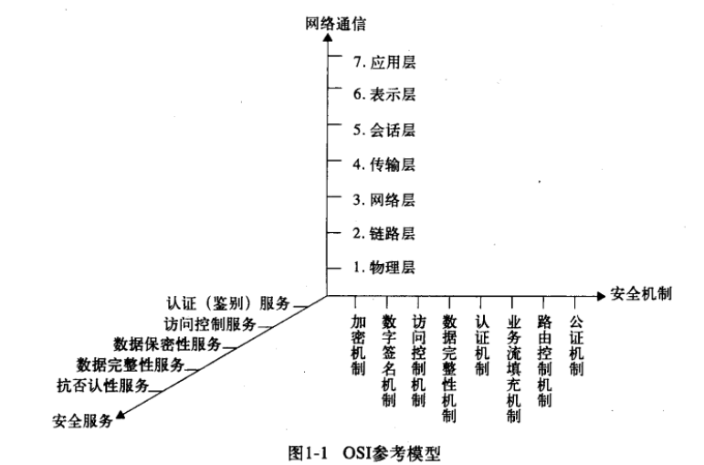
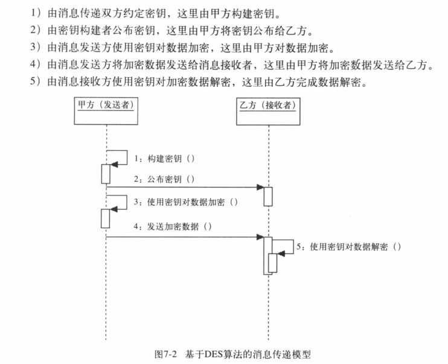
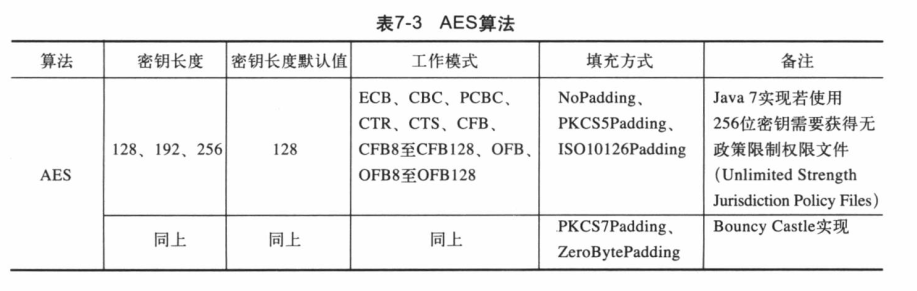

第一部分 基础篇

## 第1章 企业应用安全

### 安全技术目标

​	为数据处理系统建立和采取的技术和管理的安全保护，保护计算机硬件、软件数据不因偶然和恶意的原因遭到破坏，更改和泄露。

- 保密性：数据不能被未授权的第三方使用
- 完整性：数据不能被未授权的第三方修改
- 可用性：确保数据只在适当的时候可以由授权方访问
- 抗否认性：抗抵赖性
- 可控性：对信息及信息系统实施安全监控。
- 访问控制
- 认证

### OSI安全体系结构

​	五类安全服务包括：

- 认证服务

- 访问控制服务

- 数据保密性服务

- 数据完整性服务

- 抗否认性服务

  

安全机制是对安全服务的补充，两者关系如下：


- 加密机制：对应数据保密服务。常用的加密算法有对称加密算法(如***DES***)和非对称加密算法(如***RSA***算法)
- 数字签名机制：对应认证服务。可以实施用户身份认证和消息认证。有解决收发双方纠纷能力。常用算法有***RSA***和***DSA***算法。
- 访问控制机制：通常对用户的用户名和口令进行认证，其次验证用户角色，用户组等。一般有***RBAS***(基于用户角色的访问控制)
- 数据完整性机制：对应数据完整性服务。避免数据在**传输过程中**的干扰和篡改。常用机密算法有***MD5***算法和***SHA***算法。
- 认证机制：同数字签名机制

### TCP/IP安全体系结构

​	此体系结构包括以下几部分：

- 网络接口层安全：指链路层安全。通常依靠物理层实现。

- 网络层安全：确保数据包能顺利到达指定的目的地，一般通过路由器硬件提高响应的安全性。

- 传输层安全：***TCP***是可靠的面向连接的服务。***UDP***是无连接的数据包服务。确保传输层安全有相应的协议。如***SSL***（*Security Socket Layer*,安全套接层协议）和***TLS***（*Transport Layer Security*,传输层安全协议）。***SSL*是网景公司设计的主要用于Web安全传输协议，由*IETF*将其标准化，进而产生了TLS，TLS是SSL的继任者。SSL/TLS协议依赖于加密算法。**

- 应用层安全：***HTTPS***协议是Web上最为常用的安全范文协议。简单地说就是HTTP安全版。

  **HTTPS=SSL/TLS +HTTP**。得益于SSL/TLS的高度安全性，HTTPS广泛应用于互联网上的敏感数据交互。

### 密码学

加密算法：

- 单向加密算法：如***MD5***、***SHA***算法。是**数据完整性验证**的常用算法
- 对称加密算法：如***DES***算法。是数据存储加密的常用算法。
- 非对称加密算法：如***RSA***算法。是数据传输加密的常用算法。（相对对称加密算法来说，安全级别更高，但时间效率也低）

### 企业应用

- 访问控制：设定用户名、口令、划分用户的角色
- 数据加密：如用户个人数据加密、聊天信息加密、口令加密、用户文件加密
- 证书认证：证书认证可以鉴别用户身份、消息来源的可靠性。数字证书有权威的数字证书认证中心（*Certificate Authority,CA*）颁布。


##  第2章 密码学

### 发展

- 手工加密阶段
- 机械加密阶段
- 计算机加密阶段
  - 19491年之前，密码学是艺术；1949~1975年，密码学成为科学；1976年后，有公钥密码学。
  - 1976年，密钥分为加密的公钥和解密的私钥，提出了密钥交换算法。
  - 1977年，美国国家标准技术研究所，制定数据加密标准（*Data Encryption Standard,DES*）
  - 1977年，出现第一个较完善的公钥密码体制——***RSA***体制，这是一种建立在大数因子分解基础上的算法。***RSA***为技术签名奠定了基础。***RSA***源于整数因子分解问题，***DSA***源于离散对数问题。是两种最流行的数字签名机制。

### 定义、术语

定义：

- 密码学：密码编码学 + 密码分析学
- 密码编码学：主要研究如何对信息进行编码，如何实现对信息隐藏
- 密码分析学：信息的破译

术语：

- 加密密钥：指通过加密算法进行加密操作的密钥
- 解密密钥：指通过解密算法进行解密操作的密钥
- 被动攻击：指对一个保密系统采取截获密文并对密文进行分析和攻击的行为
- 主动攻击：指攻击者非法入侵密码系统，采用伪造、修改、删除等手段向系统注入假消息进行欺骗的行为。
- 密码体制：由明文空间、密文空间、密钥空间、加密算法、解密算法五部分组成
- 密码协议：又称为安全协议。以密码学为基础的消息交换的通信协议。
- 柯克霍夫原则：密码理论，即数据的安全基于密钥而不是算法的保密。换句话说，系统的安全性取决于密钥，对密钥保密，对算法公开。

### 密码学分类

- 按时间分

  - 古典密码学与现代密码学

- 按保密内容的算法分

  - 受限制算法密码学：算法的保密性基于保持算法的秘密
  - 基于密钥算法：算法的保密性基于对密钥的保密。

- 按密码体制划分

  - 对称密钥体制：又称单钥密码体制或私钥密码体制。该密码体制中的加密密钥与解密密钥相同。即加密过程与解密过程使用同一套密钥。
  - 非对称密码体制：又称双钥密码体制或公钥密码体制。该密码体制中的加密密钥与解密密钥不同，密钥分为公钥和私钥

  对应的算法：

  - 对称密码算法：又称单钥密码算法或私钥密码算法，指对应于**对称密码体制**的加密、解密算法。常见的有***DES***、***AES***。
  - 非对称加密算法：又称双钥密码算法或公钥密码算法。如RSA算法，多应用于数字签名、身份认证。非对称密码算法相对于对称密码算法有更高的安全性，但效率也更低些。
  
- 按明文的处理方法划分

  - 分组密码学：加密时将明文分成固定长度的组，用同一块密钥和算法对每一块加密输出也是固定长度的密文。分组密码多应用于网络加密。
  - 流密码：如***RC4***


### 保密通信模型

​	

​	在这个模型中，加密密钥可能和解密密钥是同一个密钥，或者说由一方的密钥可以推导出另一方密钥，这就是**对称加密密码体制**。加密密钥与解密密钥不同，由一方密钥难以推导出另一方密钥，这就是**非密钥密码体制**。

### 古典密码

### 对称密码体制

​	古典密码常用的技巧——替代和移位，仍然是对称密码体制中最重要的加密技巧。

​	

​	该体制分两种：流密码（对明文单个位（或字节）进行加密和解密），又称序列密码。另一种是把明文信息划分为不同的组，分别对每个组进行加解密，称为分组密码。

- 流密码：

  
  	1 同步流密码
  
  ​		特定：如果一个密文位发生变化，那么该位的变化只影响该位的恢复，对后续密文位不影响。具有同步性、无错误传递性及主动攻击型三种特性。使用与音频和视频数据提供版权保护。
  
  ​	2 自同步流密码
  
- 分组密码

  ​	多应用于网络加密。分组密码对固定长度的一组明文进行加密，这一固定长度称为**分组长度**。分组长度是分组密码的一个参数，与分组算法的安全性成正比。越长越安全，越短越实用。一般设置为<font color="red)128位</font>。
  
  ​	分组密码从本质上看是定义了一种从分组的明文到相应的密文的可逆变换。
  
  ​	分组密码是现代密码学的重要组成部分，具有代表性的分组加密算法有***DES***，***AES***。
  
  - 分组密码设计的原则
  
    分组密码的设计原则包括安全性和实现性。前者针对设计安全算法、分组长度、和密钥长度；后者考虑执行速度。
  
    - 安全原则：扩散原则+混乱原则
    - 实现原则：软件实现的设计原则+硬件实现的设计原则
  
  - 分组密码的工作模式
  
    加密算法的应用的复杂性，有的强调效率有的强调安全，有的强调容错性。更加数据加密时每个加密区块间的关联方式来区分可以分为四种工作模式。
  
    - 电子密码本模式(*Electronic Code Book,ECB*)
  
      
  
    - 密文连接模式(Cipher Book Chaining,CBC)
  
      
  
    - 密文反馈模式(Cipher Feed Back,CFB)
  
      
  
    - 输出反馈模式(Output Feed Back,OFB)
  
      
    
      
    
    - 计数器模式(Counter,CTR)
    
      


### 非对称密码体制

​	非对称密码体制的加密密钥和解密密钥不相同，分为两个密钥，一个公开，一个保密。公开的密钥称为公钥，保密的密钥称为私钥。公钥和私钥均可用于加密和解密操作。公钥加密需要私钥解密，私钥加密需要公钥解密。RSA为经典体制。**非对称密码体制算法的安全性依赖于计算复杂度难题**。如RSA源于整数因子分解，DSA——数字签名算法，源于离散对数问题。ECC-椭圆曲线加密算法，源于离散对数问题。

​	

完整会话介绍：

​	甲方（发送方）用私钥加密数据向乙方发送数据。乙方（接收方）接收到数据后使用公钥解密数据。

​	乙方（发送方）用公钥加密数据向甲方发送数据。甲方（接收方）接收到数据后使用私钥解密数据。


通常，**为了弥补效率问题，对称密码系统通常使用复合式：用高效率的对称密码算法对信息进行加密解密处理；用非对称密钥加密对称密码系统所使用的密钥。**

### 散列函数

​	**散列函数提供消息认证技术。**

​	散列函数，又称哈希函数、消息摘要函数、单向函数或杂凑函数；其主要作用不是完成数据加密与解密的工作，而是用来**验证数据完整性**的技术。通过散列函数，可以为数据创建“数字指纹”（散列值）。散列值通常是一个短的随机字母和数字组成的字符串。

​	

​	消息收发双方在通信前已经商定了具体的散列函数，并且该算法是公开的。如果消息在传递的过程中被篡改。则该消息不能与获得的数字指纹向匹配。

​	散列函数具有以下特性

​		1 消息的长度不受限制

​		2 对于给定的消息散列值的计算是很容易的

​		3 如果两个散列值不同，则这两个散列值的原始输入消息也不同。有确定性结果。

​		4 散列函数的运算过程是不可逆的

​		5 对于一个已知的消息及其散列值，要找到另一个消息使其获得相同的散列值是不可能的。此为抗弱碰撞性。防止伪造。

​		6 任意两个不同的消息的散列值一定不同。此为抗强碰撞性。

​	散列函数广泛用于信息完整性的验证。是数据签名的核心技术。**散列函数的常用算法有MD(消息摘要算法)**，**SHA（安全散列算法）**及**Mac(消息认证码算法)**。

### 数字签名

​	主要特性：**数据完整性、数据来源可认证（鉴别）性、数据发送行为的不可否认性。**

​	数字签名针对以数字形式存储的消息进行处理，产生一种带有操作者身份信息的编码。

​	签名者：执行数字签名的实体。

​	签名算法：签名过程中用到的算法。

​	数字签名：签名操作中生成的编码称为签名者对该消息的数字签名。

​	验证过程：接收者通过算法验证签名的真伪及识别相应的签名者的过程。

​	验证算法：验证过程使用的算法。

​	验证者：执行验证的实体。

​	数字签名离不开非对称密码体制，签名算法受私钥控制，且由签名者保密；验证算法受公钥控制。且对外公开。**RSA则既是最为常用的非对称加密算法，又是最为常用的签名算法。**DSA算法是典型的数字签名算法，虽然其本身属于非对称加密算法不具备数据加密与解密的功能。

​	

​	(我们可以对消息先加密，然后对加密后的消息做签名处理，这样乙方收到消息后先做验证处理。如果验证通过则对消息解密，验证失败则抛弃，这样可以提高效率。但即便如此，笔者仍然建议大家对消息先做签名，再加密。加密与签名都应该只针对原始消息（明文）做处理)。

上述的描述过程属于单向认证。也就是如果用公钥加密，私钥一方就无法辨别消息来源者的身份了。可以使用两套公私钥解决这个问题。

### 公钥基础设施(PKI)

​	公钥基础设施（Public Key Infrastructure,PKI）是一个基于X.509、用于创建、分配与撤回证书的模型。PKI能够为网络应用提供加密和数字签名等密码服务及所需要的密钥和证书管理。

​	PKI由公钥密码技术、数字证书、证书认证中心和关于公钥的安全策略等基本成分共同组成，对密钥和证书进行管理。

- PKI标准

- PKI系统组成
  
  - 认证中心(Certificat Authority,CA)：有注册服务器、注册机构(Registry Authority,RA)和认证中心服务器组成。有证书分发、更新、撤销、验证的功能。
  - 数字证书库：存储已发放的证书及公钥。
  - 密钥备份及恢复系统
  - 证书作废系统
  - 应用程序接口API
  
- 数字证书：

  数字证书是网络用户的身份标识，包括ID、公钥、和颁发机构的数字签名等内容。其形式主要有X.509公钥证书、SPKI证书、PGP证书和属性证书。其中X.509证书最为常见。我们俗称的数字证书，通常指的是X.509公钥证书。

  


### PGP、OpenPGP与GPG

- PGP:数字加密和数字签名的程序。
- OpenPGP:开发标准
- GPG:s实现了OpenPGP标准的免费程序

### 密码学的未来


## 第3章 Java加密利器

### Java 安全领域组成部分

- **JCA**(Java加密体系结构)：提供基本的加密框架。如证书、数字签名消息摘要和密钥对产生器。
- **JCE**(Java加密扩展包)：提供各种加密算法、消息摘要算法、密钥管理等功能。
- **JSSE**(Java安全套接字扩展包)：提供基于SSL的加密功能。
- **JAAS**(Java鉴别和安全服务)：提供了在Java平台上进行用户身份鉴别的功能。

JCA和JCE并不执行任何算法，它们只是连接应用和实际算法实现程序的一组接口。软件开发商可以根据**JEC**接口（又称安全提供者接口）将各种算法实现后，打包成一个Provider(安全提供者)，动态加载到运行环境中。**BouncyCastle JCE**就是一个安全提供者。

### 安全提供者体系结构

​	安全提供者实现了两个抽象的概念：**引擎和算法**。引擎可以理解为操作，如加密、解密等。算法则定义了操作如何执行。

​	安全提供者的目的就是提供一个简单的机制。从而可以很方便地改变或替换算法及其实现。

​	**Provider**类和**Security**类共同构成了安全提供者的概念。

### java.security包详解

- `Provider`类

  可以实现的服务：

  - 算法（如DSA、RSA、MD5或者SHA-1）
  - 密钥的生成、转换和管理设施。每个提供者都有一个名词和一个版本号。

- `Security`类

  ~~~java
  public class Client {
      public static void main(String[] args) {
          for (Provider provider : Security.getProviders()) {
              System.out.println(provider);
              for (Map.Entry<Object, Object> entry : provider.entrySet()) {
                  System.out.println("\t" + entry.getKey());
              }
          }
      }
  }
  ~~~

- `MessageDigest`类

  该类实现了**消息摘要算法（是散列函数，主要用于消息认证）**，是Java安全提供者体系结构中最简单的一个引擎类。

  ***JDK***目前支持***MD2,MD5,SHA-1,SHA-256,SHA-256,SHA-384,SHA-512***六种消息摘要算法。算法名不区分大小写。

  ~~~java
  // 获取实例
  public static MessageDigest getInstance(String algorithm)
  public static MessageDigest getInstance(String algorithm,Provider provider)
  public static MessageDigest getInstance(String algorithm, String provider)
   
  // 单字节更新摘要    
  public void update(byte input) 
  // 字节数组更新摘要    
  public void update(byte[] input)
  // 指定偏移量更新    
  public void update(byte[] input, int offset, int len)
  // 使用缓冲更新    
  public final void update(ByteBuffer input)
  //使用update方法后，执行该方法完成摘要计算    
  public byte[] digest()
  // 如果只执行一个update操作，可以直接使用该方法    
  public byte[] digest(byte[] input) 
  // 作用同上    
  public int digest(byte[] buf, int offset, int len)
  // 判断两个摘要是否相同：当两个摘要中的每个字节都相同，且长度相同时，则为true    
  public static boolean isEqual(byte[] digesta, byte[] digestb)
  // 返回算法的名称    
  public final String getAlgorithm()  
      
  public class DigestTest {
      public static void main(String[] args) throws NoSuchAlgorithmException {
          byte[] input = "ocean".getBytes();
          System.out.println(Arrays.toString(input));
          MessageDigest instance = MessageDigest.getInstance("SHA-256");
          instance.update(input);
          byte[] output = instance.digest();
          System.out.println(Arrays.toString(output));
      }
  }   
  ~~~

- 关于消息摘要算法的实现

  `MessageDigest`,`DigestInputStream`,`DigestOutputStream`,`Mac`都是消息认证技术的引擎类

  - `MessageDigest`提供核心的消息摘要实现
  
  - `DigestInpustStream`、`DigestOutputStream`提供以`MessageDigest`为核心的消息摘要流实现
  
  - `Mac`提供基于秘密密钥的安全消息摘要实现
  
    除了`MessageDigest`类提供的`MD`和`SHA`两大类算法外，还要一种摘要算法——`Mac`。它的算法实现是通过`Mac`类(*javax.crypto.Mac*)来实现的。
  
- `DigestInputStream`类

  ```java
  // 实例化对象
  public DigestInputStream(InputStream stream, MessageDigest digest)
  // 指定MessageDigest 与此流相关联    
  public void setMessageDigest(MessageDigest digest)
  // 返回与此流相关联的MessageDigest
  public MessageDigest getMessageDigest()
  
  // 使用实例
  public static void digestInputStream() throws NoSuchAlgorithmException, IOException {
      byte[] input = "Md5".getBytes();
      System.out.println(Arrays.toString(input));
      MessageDigest md = MessageDigest.getInstance("MD5");
      DigestInputStream dis = 
          new DigestInputStream(new ByteArrayInputStream(input), md);
      dis.read(input, 0, input.length);
      byte[] output = dis.getMessageDigest().digest();
      System.out.println(Arrays.toString(output));
      dis.close();
  }    
  ```

- `DigestOutputStream`类

  跟`DigestInputStream`相类似，使用示例

  ```java
  public static void digestOutputStream() throws NoSuchAlgorithmException, IOException {
     	byte[] input = "Md5".getBytes();
      System.out.println(Arrays.toString(input));
      MessageDigest md = MessageDigest.getInstance("MD5");
      DigestOutputStream dos = new DigestOutputStream(new ByteArrayOutputStream(), md);
      dos.write(input,0,input.length);
      byte[] output = dos.getMessageDigest().digest();
      System.out.println(Arrays.toString(output));
      dos.flush();
      dos.close();
  }
  ```

- `Key`接口

  `Key`接口是所有密钥接口的顶层接口，所有密钥都有以下三个特征：

  - 算法：即该密钥的算法，如***DES***和***DSA***,通过`getAlgorithm()`方法可获取。
  - 编码形式：密钥的外部编码形式，通过`getEncode()`方法可获取。
  - 格式：已编码密钥的格式的名称，可通过`getFormat()`方法获取。

  `SecretKey`,`PublicKey`,`priviateKey`继承`Key`接口。

  - `SecretKey`

  ​         该接口是对称密钥顶层接口;**Mac**算法通常使用`SecretKeySpec`来实现

  ​	

  - `PublicKey`跟`PrivateKey`

    

- `AlgorithmParameters`

  是个引擎类，提供密码参数的不透明表示

  ```java
  // 通常通过指定算法来实例化对象的方法
  public static AlgorithmParameters getInstance(String algorithm)
  // 实例化后根据paramSpec中的参数进行初始化    
  public final void init(AlgorithmParameterSpec paramSpec)
  public final void init(byte[] params)
  public final void init(byte[] params, String format)    
  // 获取参数对象规范
  public final <T extends AlgorithmParameterSpec> T getParameterSpec(Class<T> paramSpec)
  ```

  使用示例：

  ```java
  public static void main(String[] args) throws NoSuchAlgorithmException, IOException {
      AlgorithmParameters des = AlgorithmParameters.getInstance("DES");
      des.init(new BigInteger("19050619766489163472469").toByteArray());
      byte[] b = des.getEncoded();
      System.out.println(new BigInteger(b).toString());
  }
  ```

- `AlgorithmParameterGenerator`

  用于生成将在某个特定算法中使用的参数集合，是算法参数生成器，是引擎类

  ```java
  // 初始化实例
  public static AlgorithmParameterGenerator getInstance(String algorithm)
  public static AlgorithmParameterGenerator getInstance(String algorithm,
                                                            Provider provider)
  public static AlgorithmParameterGenerator getInstance(String algorithm,
                                                            String provider)    
  // 与算法无关的初始化
  public final void init(int size)
  public final void init(int size, SecureRandom random)
  // 特定算法的初始化
  public final void init(AlgorithmParameterSpec genParamSpec,SecureRandom random)    
  public final void init(AlgorithmParameterSpec genParamSpec)    
  ```

  示例：

  ```java
  public static void main(String[] args) throws NoSuchAlgorithmException, IOException {
          AlgorithmParameterGenerator apg = AlgorithmParameterGenerator.getInstance("DES");
          apg.init(56);
          AlgorithmParameters ap = apg.generateParameters();
          byte[] bytes = ap.getEncoded();
          System.out.println(new BigInteger(bytes).toString());
      }
  ```

- `KeyPair`类

  密钥对的载体，是对非对称密钥的扩展。包含两个信息：公钥和私钥

  ```java
  // 给定公钥和私钥初始化
  public KeyPair(PublicKey publicKey, PrivateKey privateKey)
  ```

  其通常有`KeyPairGenerator`的`generateKeyPair`提供

- `KeyPairGenerator`类

  密钥对生成器，实现生成公钥和私钥。非对称密钥算法的实现包括：**DG，ECDH，ECDSA，DSA，RSA**等多种非对称加密算法。

  ```java
  // 创建实例
  protected KeyPairGenerator(String algorithm)
  private static KeyPairGenerator getInstance(Instance instance,String algorithm) 
  public static KeyPairGenerator getInstance(String algorithm,
              String provider)    
      
  // 与算法无关的初始化
  public void initialize(int keysize) 
  public void initialize(int keysize, SecureRandom random)    
  // 特定于算法的初始化
  public void initialize(AlgorithmParameterSpec params)
  public void initialize(AlgorithmParameterSpec params,SecureRandom random)    
  ```

  示例

  ```java
  KeyPairGenerator dsa = KeyPairGenerator.getInstance("DSA");
  dsa.initialize(1024);
  java.security.KeyPair keyPair = dsa.genKeyPair();
  ```

- `KeyFactory`类

  密钥工厂，生成密钥(公钥和私钥)
  
  ```java
  public class KeyFactoryTest {
      public static void main(String[] args) throws NoSuchAlgorithmException, InvalidKeySpecException {
          // 实例化并制定算法
          KeyPairGenerator keyPairGen = KeyPairGenerator.getInstance("RSA");
          // 初始化
          keyPairGen.initialize(1024);
          // 生成KeyPair对象
          KeyPair keyPair = keyPairGen.generateKeyPair();
          // 获得私钥密钥字节数组。实际使用过程中该密钥以此种形式保存传递给另一方
          byte[] keyBytes = keyPair.getPrivate().getEncoded();
          // 由私钥密钥字节数组获得密钥规范
          PKCS8EncodedKeySpec pkcs8KeySpec = new PKCS8EncodedKeySpec(keyBytes);
          // 实例化密钥工厂、并指定RSA算法
          KeyFactory kf = KeyFactory.getInstance("RSA");
          //  生成私钥
          Key privateKey = kf.generatePrivate(pkcs8KeySpec);
      }
  }
  ```
  
- `SecureRandom`类

  `SecureRandom extends java.util.Random`是一个引擎类，提供安全随机数。**SHA1PNG**算法是`SecureRandom`的默认算法。

  ```java
  public static byte[] secureRandom(int len) {
          SecureRandom sr = new SecureRandom();
          byte[] bytes = new byte[len];
          sr.nextBytes(bytes);
          return bytes;
      }
  private static void secretKey() throws NoSuchAlgorithmException {
          SecureRandom random = new SecureRandom();
          KeyGenerator kg = KeyGenerator.getInstance("DES");
          kg.init(random);
          SecretKey secretKey = kg.generateKey();
      }
  
  ```

- `Signature`类

  用来生成和验证数字签名。`Signature`类目前支持`NONEwithDSA` `SHA1withDSA` ,`MD2withRSA` ,`MD5withRSA`, `SHA1withRSA`，`SHA256withRSA`，`SHA384withRSA`,`SHA512withRSA`

  ```java
  public class SignatureUtil {
      public static void main(String[] args) throws NoSuchAlgorithmException, InvalidKeyException, SignatureException {
          // 待做数字签名的原始信息
          byte[] data = "Data Signature".getBytes();
          // 实例化KeyPairGenerator对象
          KeyPairGenerator keyPairGen = KeyPairGenerator.getInstance("DSA");
          // 初始化
          keyPairGen.initialize(1024);
          //生成KeyPair对象
          KeyPair keyPair = keyPairGen.generateKeyPair();
          // 实例化Signature
          Signature signature = Signature.getInstance(keyPairGen.getAlgorithm());
          // 初始化用于签名操作Signature对象
          signature.initSign(keyPair.getPrivate());
          //更新
          signature.update(data);
          // 获得签名
          byte[] sign = signature.sign();
          // 私钥完成签名，公钥则用于完成验证
          //初始化用于验证操作的Signature对象
          signature.initVerify(keyPair.getPublic());
          // 更新
          signature.update(data);
          // 获取验证结果
          boolean result = signature.verify(sign);
      }
  }
  ```

- `SignedObject`类

  是一个用来创建实际运行时对象的类，在检测不到这些对象的情况下，其完整性不会遭到破坏

- `Timestamp`类

  封装有关签署时间戳的信息，且它是不可变的。

  ```java
  public static void timeStamp() throws CertificateException, FileNotFoundException {
          CertificateFactory instance = CertificateFactory.getInstance("X509");
          CertPath cp = instance.generateCertPath(new FileInputStream("D:\\x.cer"));
          Timestamp timestamp = new Timestamp(new Date(), cp);
      }
  ```

### javax.crypto包详解

- 该包为加密操作提供类和接口

- `Mac`类

  属于消息摘要的一种，但它不同于一般消息摘要(如MessageDigest提供的消息摘要实现)。它必须有一个由发送方和接收方共享的秘密密钥才能生成最终的消息摘要--安全消息摘要。安全消息摘要又称消息认证码

  Java7支持HmacMD5,HmacSHA1,HmacSHA256,HmacSHA384,HmacSHA512

  ```java
  public static void main(String[] args) throws NoSuchAlgorithmException, InvalidKeyException {
          // 待做安全消息摘要的原始信息
          byte[] input = "MAC".getBytes();
          //初始化KeyGenerator对象，使用HmacSHA256
          KeyGenerator generator = KeyGenerator.getInstance("HmacSHA256");
          SecretKey secretKey = generator.generateKey();
          Mac mac = Mac.getInstance(secretKey.getAlgorithm());
          mac.init(secretKey);
          byte[] output = mac.doFinal(input);
      }
  ```

- `Cipher`类

  为加密和解密提供密码功能

  ```java
  // 实例化格式：算法/工作模式/填充模式
  Cipher c = Cipher.getInstance("AEC/CBC/PKCS5Padding");
  // 初始化
  public final void init()
  // 通过指定输入的字节数组完成更新
  public final byte[] update(byte[] var1) 
  // 完成更新后调用以下方法
  public final byte[] doFinal()    
  ```


## 第4章 他山之石，可以攻玉

# 第二部分 实战篇

## 第5章 电子邮件传输-Base64

- Base64算法并不是加密算法，仅仅是加密算法的近亲。

### Base64算法的由来

- 该算法最早应用于解决电子邮件传输的问题。

### 定义

- **Base64**是基于64个字符的编码算法。**RFC2045**的定义：Base64内容传送编码是一种以任意8位字节序列组合的描述形式，这种形式不易被人直接识别。经过Base64编码后的数据会比原始数据略长，为原来的3/4倍。经Base64编码后的字符串的字符数是以4为单位的整数倍。

- 字符映射表

  

### Base64算法与加密算法的关系

- Base64算法不能称为加密算法，不过其变换法则遵从了单表置换算法。
- Base64算法常作为密钥、密文和证书的一种通用存储编码格式，与加密算法形影不离。

### 实现原理

- 原理描述
  - 将给定的字符串以字符为单位转换成对应的字符编码(如ASCII码)
  - 将获得的字符编码转换为二进制
  - 对二进制码做分组转换操作。每3个8位二进制码为一组，转换为每4个6位二进制码为一组(不足6位时低位补0)
  - 对获得的4个6位二进制码补位，向6位二进制码添加2位高位0，组成4个8位二进制码。
  - 将获得的4个8位二进制码转换为十进制
  - 将获得的十进制码转换为Base64字符表中对应的字符。

#### ASCII码字符编码

<img src = "../pic/secure/ASCII字符编码.png)

#### 非ASCII码字符编码


### 模型分析


### Base64算法实现

- 使用`org.bouncycastle.util.encoders.Base64`

  ```java
  public class Base64CoderTest {
      public static void main(String[] args) {
          String inputStr = "Java加密与解密的艺术";
          // 进行Base64编码
          byte[] encode = Base64.encode(inputStr.getBytes());
          String encodeStr = new String(encode);
          System.out.println(encodeStr);
          // 解码
          byte[] decode = Base64.decode(encodeStr);
          System.out.println(new String(decode).equals(inputStr));
      }
  }
  ```

- 使用`java.util.Base64`

  ```java
  private static void base64(){
          String input = "Java加密与解密的艺术";
          String encodedStr = java.util.Base64.getEncoder().encodeToString(input.getBytes());
          System.out.println(encodedStr);
      }
  ```


### Url Base64算法实现

- 如果要求使用Get方式传递本该由Post方式传递的私密数据时该怎么办？如果非要在Get方式下传递二进制数据该怎么办？此时，使用Url Base64算法是个不错的选择。

- 根据URL相关要求，符号"+"和符号"/"是不允许出现在URL中的，RFC4648给出了相应的替代符号"-"和"_"。

- 使用`org.bouncycastle.util.encoders.UrlBase64`实现,其使用符号"."进行填充。

  ```java
  public class UrlBase64CoderTest {
      public static void main(String[] args) {
          String input = "Java加密与解密的艺术";
          byte[] encode = UrlBase64.encode(input.getBytes());
          System.out.println(new String(encode));
      }
  }
  ```

- 使用`org.apache.commons.codec.binary.Base64`实现，其没有填充符

  ```java
  public class UrlBase64CoderTest {
      public static void main(String[] args) {
          String input = "Java加密与解密的艺术";
          byte[] bytes = Base64.encodeBase64URLSafe(input.getBytes());
          String encode = new String(bytes);
          System.out.println(encode);
      }
  }
  ```

### 应用举例

#### 电子邮件


#### 网络数据传输

#### 密钥存储

- 计算机世界里，密钥是一段二进制数据。可以通过`Key`接口的`getEncoder()`获取密钥数组。
- 可以将密钥以二进制形式转换成Base64编码后发送给对方。

#### 数字证书存储

- 数字证书可以有多种存储方式。常用的有DER编码二进制、Base64编码和加密消息语法标准等。

  


### 小结

- 电子邮件只允许使用ASCII码，而对于非ASCII码(如中文)就无能为力了。这时候就需要Base64编码。


## 第6章 验证数据完整性-消息摘要算法

### 简述

- 消息摘要算法包含**MD**、**SHA**和**MAC**共三大系列。常用于验证数据完整性，是数字签名算法的核心算法。

#### 消息摘要算法的由来

- 由时候通过比较`hashCode()`方法的值是否相同来辨别两个对象是否相同。`hashCode`就是散列值。任何消息经过散列函数处理后，都会获得唯一的散列值。这一过程称为"**消息摘要**"。其散列值称为**数字指纹**。其算法就是"消息摘要算法"
- 消息摘要算法成了校验数据完整性的主要手段。各大软件厂商提供软件下载的同时总要附带数字签名。
- 为了方便人们识别和阅读。数字指纹常以十六进制的字符串的形式出现。
- 消息摘要算法最初是用来构建数字签名的。数字签名操作中，签名操作其实是变相地使用消息摘要算法获得的数字指纹，而验证操作则是验证其数字指纹是否相等。

#### 消息摘要算法的家谱

- 又称为散列算法，其核心在于散列函数的单向性。
- 分为三大类：
  - MD(*Message Digest*，消息摘要算法)
    - MD2,MD4,MD5
  - SHA-1(*Secure Hash Algorithm*，安全散列函数)
    - SHA-1,SHA-224,SHA-256,SHA-384,SHA-512
  - HmacMD5(*Message Authentication code* ，消息认证码算法)
    - HmacMD5,HmacSHA1,HmacSHA256,HmacSHA384,HmacSHA512

### MD算法家族

- MD5算法是典型的消息摘要算法，其前身有MD2、MD3和MD4算法，它由MD4、MD3、MD2算法改进而来。不论是哪一种MD算法，它们都需要获得一个随机长度的信息并产生一个128位的信息摘要。如果将这个128位的二进制摘要信息换算成十六进制，可以得到一个32位（每4位二进制数转换为1位十六进制数）的字符串，故我们见到的大部分MD5算法的数字指纹都是32位十六进制的字符串，如本章开篇中，MySQL下载页上的数字指纹(MD5:5a077abefee447cbb27]e2aa7f6d5a47）就是32位的十六进制字符串。现在，各大主流计算机语言均支持MD5算法。

#### 模型


<img src ="../pic/secure/用户登录.png)

#### 实现


使用`java.security.MessageDigest`

```java
public class MDCoder {
    public static void main(String[] args) throws NoSuchAlgorithmException {
        String input = "MD5messageDigest";
        MessageDigest instance = MessageDigest.getInstance("MD5");
        byte[] digest = instance.digest(input.getBytes());
        System.out.println(new String(digest));
    }
}
```

使用`org.apache.commons.codec.digest.DigestUtils`:建议使用这种方式。

```java
public class MDCoder2 {
    public static void main(String[] args) {
        String hex = DigestUtils.md5Hex("MD5消息摘要");
        System.out.println(hex);
    }
}
```

### SHA算法家族

- SHA是消息摘要算法的一种，被认可为MD5的继任者。


#### 模型分析

- 甲方向乙方发送一则消息经过以下几个步骤：

  - 甲方公布消息摘要算法。这个被所有人知道
  - 甲方对待发送的消息进行摘要处理，并获得摘要信息。
  - 甲方向乙方发送摘要信息，这个数字指纹可以被其他人获取包括监听者。
  - 甲方向乙方发送消息。该消息可以是明文，有可能被监听者篡改。
  - 乙方获得消息后，使用甲方提供的消息摘要算法对其做摘要处理。获得数字指纹并对甲方传递过来的数字指纹比较是否匹配。

- 图形

  

#### 实现


- 使用`java.security.MessageDigest`

  ```java
  public class SHACoder {
      public static void main(String[] args) throws NoSuchAlgorithmException {
          String input = "sha消息摘要";
          byte[] encode1 = encodeSHA256(input.getBytes());
          byte[] encode2 = encodeSHA256(input.getBytes());
          System.out.println(Arrays.equals(encode1, encode2));
      }
  
      /**
       * SHA-1消息摘要
       *
       * @param data 待做摘要处理的数据
       * @return 消息摘要
       * @throws NoSuchAlgorithmException
       */
      private static byte[] encodeSHA(byte[] data) throws NoSuchAlgorithmException {
          MessageDigest sha = MessageDigest.getInstance("SHA");
          return sha.digest(data);
      }
  
      private static byte[] encodeSHA256(byte[] data) throws NoSuchAlgorithmException {
          MessageDigest sha = MessageDigest.getInstance("SHA-256");
          return sha.digest(data);
      }
  
      private static byte[] encodeSHA384(byte[] data) throws NoSuchAlgorithmException {
          MessageDigest sha = MessageDigest.getInstance("SHA-384");
          return sha.digest(data);
      }
  }
  ```

- 使用`org.apache.commons.codec.digest.DigestUtils`

  ```java
  public class SHACoder2 {
  
      /**
       * SHA-1消息摘要
       *
       * @param data 待做摘要处理的数据
       * @return 消息摘要
       * @throws NoSuchAlgorithmException
       */
      private static byte[] encodeSHA(byte[] data) throws NoSuchAlgorithmException {
         return DigestUtils.sha1(data);
      }
  
      private static String encodeSHAHex(String data) throws NoSuchAlgorithmException {
          return DigestUtils.sha1Hex(data);
      }
      private static byte[] encodeSHA256(String data) throws NoSuchAlgorithmException {
          return DigestUtils.sha256(data);
      }
      private static String encodeSHA256Hex(String data) throws NoSuchAlgorithmException {
          return DigestUtils.sha256Hex(data);
      }
  }
  ```

- SHA-1算法的摘要信息是一个40位的十六进制字符串，换算成二进制正好是160位；SHA-256算法的摘要信息是一个64位的十六进制字符串，换算成二进制正好是256位；

- 消息摘要长度与安全强度成正比。从这一点来看，SHA系列算法比MD系列算法更加具有优势。MD系列算法仅有128位，而sha算法则可以从160位扩展到512位。


### MAC算法家族

- **MAC**结合了**MD5**和**SHA**算法的优势，并加入密钥的支持，是一种更加安全的消息摘要算法。

#### 简述

- **MAC**(*Message Authentication Code*)算法融合了密钥散列函数(*keyed-Hash*),通常我们也把**MAC**称为**HMAC**(keyed-Hash Message Authentication Code)。
- MAC算法主要集合了MD和SHA两大系列算法。包括HmacMD2,HmacMD4,HmacMD5;和HmacSHA1, HmacSHA224, HmacSHA256,HmacSHA384,HmacSHA512。

#### 模型分析


#### 实现


- 使用`javax.crypto`

  ```java
  public class MACCoder {
      private static byte[] initHmacMD5key() throws NoSuchAlgorithmException {
          KeyGenerator kg = KeyGenerator.getInstance("HmacMD5");
          SecretKey secretKey = kg.generateKey();
          return secretKey.getEncoded();
      }
  
      /**
       * HmacMD5消息摘要
       *
       * @param data 待做摘要处理的数据
       * @param key  密钥
       * @return 消息摘要
       * @throws NoSuchAlgorithmException
       * @throws InvalidKeyException
       */
      private static byte[] encodeHmacMD5(byte[] data, byte[] key) throws NoSuchAlgorithmException, InvalidKeyException {
          // 还原密钥
          SecretKeySpec sk = new SecretKeySpec(key, "HmacMD5");
          Mac mac = Mac.getInstance(sk.getAlgorithm());
          mac.init(sk);
          return mac.doFinal(data);
      }
  
      private static byte[] initHmacSHA256() throws NoSuchAlgorithmException {
          KeyGenerator generator = KeyGenerator.getInstance("HmacSHA256");
          SecretKey secretKey = generator.generateKey();
          return secretKey.getEncoded();
      }
  
      public static byte[] encodeHmacSHA256(byte[] data, byte[] key) throws NoSuchAlgorithmException, InvalidKeyException {
          SecretKey hmacSHA256 = new SecretKeySpec(key, "HmacSHA256");
          Mac mac = Mac.getInstance(hmacSHA256.getAlgorithm());
          mac.init(hmacSHA256);
          return mac.doFinal(data);
  
      }
  }
  ```

- 使用`org.apache.commons.codec.digest`

  ```java
  public class MACCoder2 {
      private static String encodeHmacMD5(byte[] data, byte[] key) throws NoSuchAlgorithmException, InvalidKeyException {
          Mac mac = HmacUtils.getInitializedMac("HmacMD5", key);
          HmacUtils hmac = new HmacUtils("HmacMD5", key);
          String out = hmac.hmacHex(data);
          return out;
      }
  }
  ```

### 其他消息摘要算法

### 循环冗余校验算法—CRC算法

- 在压缩文件列表中能看到一个标有"CRC32"字样的内容。CRC算法并不属于机密算法范畴。CRC算法同属散列函数。

#### 简述

- **CRC**(*Cyclic Redundancy Check*，循环冗余校验)可以根据数据产生简短固定位数的一种散列数，主要用来检测或校验数据传输/保存后出现的错误。生成的散列值在传输或储存之前计算出来并且附加到数据后面。在使用数据之前，对数据的完整性做校验。一般来说，循环冗余校验的值都是32位的二进制数，以8位十六进制字符串形式表示。它是一类重要的线性分组码，编码和解码方法简单，检错和纠错能力强，在通信领域广泛地用于实现差错控制。

- 发展

  

#### 模型分析


#### 实现

- 使用`java.util.zip.CRC32`

  ```java
  public class CRCTest {
      public static void main(String[] args) {
          String  str = "测试CRC-32";
          CRC32 crc32 = new CRC32();
          crc32.update(str.getBytes());
          String hex = Long.toHexString(crc32.getValue());
          System.out.println("原文： " + str);
          System.out.println("CRC-32: " + hex);
      }
  }
  ```

### 实例——文件校验

- 场景：已知某个文件的MD5值，校验该文件是否破损

  ```java
  public class MD5Test {
      public static void main(String[] args) throws IOException, NoSuchAlgorithmException {
          String filePath = "";
          String originalHEX = "";
          try (FileInputStream in = new FileInputStream(new File(filePath));
               DigestInputStream din = new DigestInputStream(in, MessageDigest.getInstance("MD5"))) {
              int buf = 1024;
              byte[] buffer = new byte[buf];
              int read = din.read(buffer, 0, buf);
              while (read > -1) {
                  read = din.read(buffer, 0, buf);
              }
              MessageDigest md = din.getMessageDigest();
              byte[] b = md.digest();
              // 十六进制转换
              String md5Hex = Hex.encodeHexString(b);
              // 验证
              System.out.println(md5Hex.equals(originalHEX));
          }
      }
  }
  
  ```

# 第7章 初等数据加密-对称加密算法

- 写操作伴随加密，读操作伴随解密。加密和解密操作使用同一套密钥。这就是对称加密算法的核心。

### 简述

#### 由来

- 根据加密方式分为流密码和分组密码；其分组密码工作模式又可分为ECB、CBC、CFB、OFB和CTR

#### 对称加密算法家谱

- Java7仅提供了部分算法实现，如DES、DESede、AES、Blowfish，以及RC2和RC4算法等。其他算法（如IDEA算法）需要通过第三方加密软件包BouncyCastle提供实现。
- 对称加密算法中，DES算法最具有代表性，堪称典范；DESede是DES算法的变种；**AES算法则作为DES算法的替代者**，而IDEA算法作为一种强加密算法，成为电子邮件加密软件PGP（PrettyGoodPrivacy）的核心算法之一
- 在Java实现层面上，DES、DESede、AES和IDEA这4种算法略有不同。DES和DESede算法在使用密钥材料还原密钥时，建议使用各自相应的密钥材料实现类(DES算法对应DESKeySpec类，DESede算法对应DESedeKeySpec类）完成相应转换操作。AES算法在使用密钥材料还原密钥时，则需要使用一般密钥材料实现类(SecretKeySpec类）完成相应转换操作。

### 数据加密标准——DES

- DES算法和DESede算法统称DES系列算法

#### 简述

- DES算法作为现代密码学领域中第一个官方授权的加密算法受到全球各大密码学机构的关注。DES算法密钥偏短，仅有56位，迭代次数偏少，受到诸如查分密码分析和线性密码分析等各种攻击威胁，安全性受到严重威胁。不仅如此，由于DES算法具有半公开性质，被怀疑存在美国国家安全局（NationalSecurityAgency，NSA)安置的后门，受到各大密码学机构的强烈质疑。
- 实用化DES算法破译机的出现彻底宣告DES算法已不具备安全性；以当今计算机技术能力，经DES算法加密的数据在24小时内可能被破解。由此，DES算法正式退出历史舞台，AES算法成为它的替代者。

#### 模型分析

- 甲乙双方作为消息传递双方。我们假定甲乙在消息传递前已商定加密算法，步骤如下：

  

#### 实现


```java
public class DESCoder {
    /**
     * 密钥算法，
     * Java7仅支持56位密钥
     * Bouncy Castle支持64位密钥
     */
    public static final String KEY_ALGORITHM = "DES";
    // 算法/工作模式/填充方式
    public static final String CIPHER_ALGORITHM = "DES/ECB/PKCS5Padding";

    /**
     * 转换密钥
     *
     * @param key 二进制密钥
     * @return
     */
    private static Key toKey(byte[] key) throws Exception {
        // 实例化DES密钥材料
        DESKeySpec dks = new DESKeySpec(key);
        // 实例化秘密密钥工厂
        SecretKeyFactory factory = SecretKeyFactory.getInstance(KEY_ALGORITHM);
        // 生成秘密密钥
        SecretKey secretKey = factory.generateSecret(dks);
        return secretKey;
    }

    /**
     * 解密
     *
     * @param data 待解密数据
     * @param key  密钥
     * @return
     */
    public static byte[] decrypt(byte[] data, byte[] key) throws Exception {
        // 还原密钥
        Key k = toKey(key);
        // 实例化
        Cipher cipher = Cipher.getInstance(CIPHER_ALGORITHM);
        cipher.init(Cipher.DECRYPT_MODE, k);
        return cipher.doFinal(data);
    }

    /**
     * 加密
     *
     * @param data 待加密数据
     * @param key  密钥
     * @return
     */
    public static byte[] encrypt(byte[] data, byte[] key) throws Exception {
        // 还原密钥
        Key k = toKey(key);
        Cipher cipher = Cipher.getInstance(CIPHER_ALGORITHM);
        cipher.init(Cipher.ENCRYPT_MODE, k);
        return cipher.doFinal(data);
    }

    /**
     * 生成密钥
     * Java7只支持56位密钥
     * Bouncy Castle 支持64位
     * @return
     * @throws NoSuchAlgorithmException
     */
    public static byte[] initKey() throws NoSuchAlgorithmException {
       /* KeyGenerator kg = KeyGenerator.getInstance(CIPHER_ALGORITHM,"BC");
        kg.init(64);*/
        KeyGenerator kg = KeyGenerator.getInstance(KEY_ALGORITHM);
        kg.init(56);
        SecretKey secretKey = kg.generateKey();
        return secretKey.getEncoded();
    }
}

public class Client {
    public static void main(String[] args) throws Exception {
        String inputStr = "DES";
        byte[] inputData = inputStr.getBytes();
        byte[] key = DESCoder.initKey();
        System.out.println("密钥：" + Base64.encodeBase64String(inputData));
        // 加密
        inputData = DESCoder.encrypt(inputData, key);
        System.out.println("加密后：" + Base64.encodeBase64String(inputData));

        byte[] outputData = DESCoder.decrypt(inputData, key);
        String outputStr = new String(outputData);
        System.out.println("解密后：" + outputStr);
        System.out.println(inputStr.equals(outputStr));
    }
}
```


### 三重DES-DESede

- 对DES算法改良，针对其密钥长度偏短和迭代次数偏少做了改进
- DESede算法处理速度慢，密钥计算时间较长，加密效率不高

#### 简述

- 针对密钥太短和迭代偏少问题，有人提出了多重DES的方式来克服这些缺陷。比较典型的有两重DES(2DES)、三重DES(3DES)和四重DES(4DES)等几种形式，但在实际应用中一般采用3DES方案，它还有两个别名TripleDES和DESedeo。在Java中，我们通常称其为DESede算法。当然，其他两种名称在使用时同样可以获得支持。DESede算法将密钥长度增至112位或168位，抗穷举攻击的的能力显著增强，但核心仍是DES算法，虽然通过增加迭代次数提高了安全性，但同时也造成处理速度较慢、密钥计算时间加长、加密效率不高的问题。

#### 实现


```java
public class DESedeCoder {
    /**
     * 密钥算法
     * Java 7支持密钥长度为112位和168位
     * Bouncy Castle 支持密钥长度为128位和192位
     */
    public static final String KEY_ALGORITHM = "DESede";
    // 算法/工作模式/填充模式
    /**
     * Java仅支持PKCS5Padding
     * Bouncy Castle支持PKCS7Padding
     */
    public static final String CIPHER_ALGORITHM = "DESede/ECB/PKCS5Padding";

    /**
     * 转换密钥
     *
     * @param key 二进制密钥
     * @return
     * @throws Exception
     */
    private static Key toKey(byte[] key) throws Exception {
        // 实例化DES密钥材料
        DESedeKeySpec spec = new DESedeKeySpec(key);
        // 实例化秘密密钥工厂
        SecretKeyFactory keyFactory = SecretKeyFactory.getInstance(KEY_ALGORITHM);
        return keyFactory.generateSecret(spec);
    }

    /**
     * 解密
     *
     * @param data 待解密的数据
     * @param key  密钥
     * @return
     * @throws Exception
     */
    public static byte[] decrypt(byte[] data, byte[] key) throws Exception {
        // 还原密钥
        Key k = toKey(key);
        // Cipher.getInstance(CIPHER_ALGORITHM,"BC"); PKCS7Padding填充方式
        Cipher cipher = Cipher.getInstance(CIPHER_ALGORITHM);
        cipher.init(Cipher.DECRYPT_MODE, k);
        return cipher.doFinal(data);
    }

    public static byte[] initKey() throws NoSuchAlgorithmException {
        KeyGenerator kg = KeyGenerator.getInstance(KEY_ALGORITHM);
        /**
         * kg.init(128)
         * kg.init(192)
         */
        kg.init(168);
        SecretKey secretKey = kg.generateKey();
        return secretKey.getEncoded();
    }

    /**
     * 加密
     * @param data 待加密的数据
     * @param key
     * @return
     * @throws Exception
     */
    public static byte[] encrypt(byte[] data, byte[] key) throws Exception {
        // 还原key
        Key k = toKey(key);
        Cipher cipher = Cipher.getInstance(CIPHER_ALGORITHM);
        cipher.init(Cipher.ENCRYPT_MODE, k);
        return cipher.doFinal(data);
    }

}
```

与DES相比，上例的实现只是改变了密钥材料的实现l类，由``DESKeySpec`改为`DESedeKeySpec`


### 高级数据加密标准——AES

#### 简述

- AES(*Advanced Encryption Standard*)高级数据加密标准
- 具有128位的分组长度，支持128位、192位、和256位的密钥长度

#### 实现



```java
public class AESCoder {
    // 算法
    public static final String KEY_ALGORITHM = "AES";

    /**
     * java7仅支持PKCS5Padding
     * Bouncy Castle 支持PKCS7Padding的方式
     */
    public static final String CIPHER_ALGORITHM = "AES/ECB/PKCS5Padding";

    private static Key toKey(byte[] key) {
        SecretKeySpec spec = new SecretKeySpec(key, KEY_ALGORITHM);
        return spec;
    }

    public static byte[] decrypt(byte[] data, byte[] key) throws Exception {
        // 还原密钥
        Key k = toKey(key);
        // 实例化
        Cipher cipher = Cipher.getInstance(CIPHER_ALGORITHM);
        cipher.init(Cipher.DECRYPT_MODE, k);
        return cipher.doFinal(data);

    }

    public static byte[] encrypt(byte[] data, byte[] key) throws Exception {
        Key k = toKey(key);
        //Cipher.getInstance(CIPHER_ALGORITHM,"BC"); PKCS7Padding 方式填充
        Cipher cipher = Cipher.getInstance(CIPHER_ALGORITHM);
        cipher.init(Cipher.ENCRYPT_MODE, k);
        return cipher.doFinal(data);
    }

    public static byte[] initKey() throws NoSuchAlgorithmException {
        KeyGenerator kg = KeyGenerator.getInstance(KEY_ALGORITHM);
        // AES要求密钥长度为128位，192位后256位
        kg.init(256);
        SecretKey secretKey = kg.generateKey();
        return secretKey.getEncoded();
    }
}
```

上述代码实现当通用的，不仅**RC2、RC4**和**Bowfish**算法可以使用上述代码方式实现，包括已经实现的**DES**和**DESede**算法都可以参照上述代码实现方式，无须考虑密钥材料实现类，只要对算法名称稍作调整即可！


### 国际加密标准——IDEA

- IDEA算法使用长度为128密钥，数据块大小为64位。至今还没出现对该算法的有效攻击算法。

#### 实现


```java
public class IDEACoder {
    // 密钥算法
    public static final String KEY_ALGORITHM = "IDEA";

    public static final String CIPHER_ALGORITHM = "IDEA/ECB/ISO10126Padding";

    public static Key toKey(byte[] key) {
        SecretKeySpec secretKey = new SecretKeySpec(key, CIPHER_ALGORITHM);
        return secretKey;
    }

    public static byte[] decrypt(byte[] data, byte[] key) throws Exception {
        // 加入BouncyCastleProvider支持
        Security.addProvider(new BouncyCastleProvider());
        Key k = toKey(key);
        // 实例化
        Cipher cipher = Cipher.getInstance(CIPHER_ALGORITHM);
        cipher.init(Cipher.DECRYPT_MODE, k);
        return cipher.doFinal(data);
    }

    public static byte[] encrypt(byte[] data, byte[] key) throws Exception {
        Security.addProvider(new BouncyCastleProvider());
        Key k = toKey(key);
        Cipher cipher = Cipher.getInstance(CIPHER_ALGORITHM);
        cipher.init(Cipher.ENCRYPT_MODE, k);
        return cipher.doFinal(data);

    }

    public static byte[] initKey() throws NoSuchAlgorithmException {
        Security.addProvider(new BouncyCastleProvider());
        KeyGenerator gk = KeyGenerator.getInstance(KEY_ALGORITHM);
        gk.init(128);
        SecretKey secretKey = gk.generateKey();
        return secretKey.getEncoded();
    }

}
```


### 基于口令加密算法——PBE

- PEB算法综合了上述对称加密算法和消息摘要算法的优势，形成了对称加密算法的一个特例。

#### 简述

- PBE(*Password Based Encryption*,基于口令加密)。其特点是口令用户自己掌管。
- PBE算法没有密钥的概念，使用口令代替了密钥。密钥的长度直接影响了算法的安全性。
- 单纯的口令很容易通过穷举工具方式破译，这就引入了"盐"。将盐附加在口令上，通过消息摘要算法经过迭代计算获得构建密钥/初始化向量的基本材料

#### 模型分析


#### 实现


```java
public class PBECoder {
    // 算法
    public static final String ALGORITHM = "PBEWITHMD5andDES";
    // 迭代次数
    public static final int ITERATION_COUNT = 100;

    public static byte[] initSalt() {
        SecureRandom random = new SecureRandom();
        return random.generateSeed(8);
    }

    /**
     * 换行密钥
     *
     * @param password 密码
     * @return
     * @throws Exception
     */
    private static Key toKey(String password) throws Exception {
        // 密钥材料转换
        PBEKeySpec spec = new PBEKeySpec(password.toCharArray());
        SecretKeyFactory keyFactory = SecretKeyFactory.getInstance(ALGORITHM);
        SecretKey secretKey = keyFactory.generateSecret(spec);
        return secretKey;
    }

    public static byte[] encrypt(byte[] data, String password, byte[] salt) throws Exception {
        Key key = toKey(password);
        PBEParameterSpec spec = new PBEParameterSpec(salt, ITERATION_COUNT);
        Cipher cipher = Cipher.getInstance(ALGORITHM);
        cipher.init(Cipher.ENCRYPT_MODE, key, spec);
        return cipher.doFinal(data);
    }

    public static byte[] decrypt(byte[] data, String password, byte[] salt) throws Exception {
        Key key = toKey(password);
        PBEParameterSpec spec = new PBEParameterSpec(salt, ITERATION_COUNT);
        Cipher ci = Cipher.getInstance(ALGORITHM);
        ci.init(Cipher.DECRYPT_MODE, key, spec);
        return ci.doFinal(data);
    }
}
```


### 实例：对称加密网络应用

- 使用AES算法和SHA算法，对数据进行加密

- 导入`Commons Codec`和`httpclient`包来协助

  ```java
  public class AESCoder2 {
      // 算法
    public static final String KEY_ALGORITHM = "AES";
  
      /**
       * java7仅支持PKCS5Padding
       * Bouncy Castle 支持PKCS7Padding的方式
       */
      public static final String CIPHER_ALGORITHM = "AES/ECB/PKCS5Padding";
  
      private static Key toKey(byte[] key) {
          SecretKeySpec spec = new SecretKeySpec(key, KEY_ALGORITHM);
          return spec;
      }
  
      public static byte[] decrypt(byte[] data, byte[] key) throws Exception {
          // 还原密钥
          Key k = toKey(key);
          // 实例化
          Cipher cipher = Cipher.getInstance(CIPHER_ALGORITHM);
          cipher.init(Cipher.DECRYPT_MODE, k);
          return cipher.doFinal(data);
  
      }
  
      public static byte[] decrypt(byte[] data, String key) throws Exception {
          return decrypt(data, getKey(key));
      }
  
      public static byte[] encrypt(byte[] data, byte[] key) throws Exception {
          Key k = toKey(key);
          //Cipher.getInstance(CIPHER_ALGORITHM,"BC"); PKCS7Padding 方式填充
          Cipher cipher = Cipher.getInstance(CIPHER_ALGORITHM);
          cipher.init(Cipher.ENCRYPT_MODE, k);
          return cipher.doFinal(data);
      }
  
      public static byte[] encrypt(byte[] data, String key) throws Exception {
          return encrypt(data, getKey(key));
      }
  
      public static String initKeyString() throws NoSuchAlgorithmException {
          return Base64.encodeBase64String(initKey());
      }
  
      public static byte[] initKey() throws NoSuchAlgorithmException {
          KeyGenerator kg = KeyGenerator.getInstance(KEY_ALGORITHM);
          // AES要求密钥长度为128位，192位后256位
          kg.init(256);
          SecretKey secretKey = kg.generateKey();
          return secretKey.getEncoded();
      }
  
      public static byte[] getKey(String key) {
          return Base64.decodeBase64(key);
      }
  
      public static String shaHex(byte[] data) {
          return DigestUtils.md5Hex(data);
      }
  
      public static boolean validate(byte[] data, String messageDigest) {
          return messageDigest.equals(shaHex(data));
      }
  }
  ```
  


## 第8章 搞等数据加密——非对称加密算法

### 非对称加密算法简述

- 非对称加密算法相比对称加密算法更加安全，但加密速度也更慢。
- 非对称加密将密钥一分为二，公钥通过非安全通道发放，私钥则由发放者保留。
- 考虑安全跟性能问题，一般使用对称加密算法对数据进行加密/解密，使用公钥和私钥对对称加密算法的密钥加密/解密。非对称加密算法主要用于交换对称加密算法的秘密密钥，而非数据交换。

#### 非对称加密算法家谱


### 密钥交换算法-DH、ECDH

### 典型非对称加密算法——RSA

- RSA算法基于大数因子分解难题，而ELGamal算法和ECC算法则是基于离散对数问题
- 978年，美国麻省理工学院（MIT）的RonRivest、AdiShamir和LeonardAdlernan三位学者提出了一种新的非对称加密算法，这种算法以这三位学者的姓氏开头字母命名，被称为RSA算法。RSA算法是唯一被广泛接受并实现的通用公开加密算法，目前已经成为非对称加密算法国际标准。不仅如此，RSA算法既可用于数据加密也可用于数字签名。我们熟知的电子邮件加密软件PGP就采用了RSA算法对数据进行加密/解密和数字签名处理。

#### 模型分析

- 我们仍以甲乙两方收发消息为例。甲方作为消息的发送方，乙方作为消息的接收方。我们假设甲乙双方在消息传递之前已将RSA算法作为消息传递的加密算法。为完成加密消息传递，甲乙双方需要以下操作：

  - 由消息发送的一方构建密钥对，这里由甲方完成。
  - 由消息发送的一方公布公钥至消息接收方，这里由甲方将公钥公布给乙方。完成这两步操作后，甲乙双方就可以进行加密消息传递了

- 通信图形

  


#### 实现


```java
public class RSACoder {
    // 算法
    public static final String KEY_ALGORITHM = "RSA";

    private static final String PUBLIC_KEY = "RSAPublicKey";

    private static final String PRIVATE_KEY = "RSAPrivateKEy";
    /**
     * RSA密钥长度
     * 默认1024
     * 密钥长度必须是64的倍数
     * 范围在512~65536之间
     */
    private static final int KEY_SIZE = 512;

    /**
     * 私钥解密
     *
     * @param data 待解密数据
     * @param key  私钥
     * @return byte[] 解密后数据
     * @throws Exception
     */
    public static byte[] decryptByPrivateKey(byte[] data, byte[] key) throws Exception {
        // 生成私钥
        PKCS8EncodedKeySpec keySpec = new PKCS8EncodedKeySpec(key);
        KeyFactory keyFactory = KeyFactory.getInstance(KEY_ALGORITHM);
        PrivateKey privateKey = keyFactory.generatePrivate(keySpec);
        // 对数据解密
        Cipher cipher = Cipher.getInstance(keyFactory.getAlgorithm());
        cipher.init(Cipher.DECRYPT_MODE, privateKey);
        return cipher.doFinal(data);
    }

    public static byte[] decryptByPublicKey(byte[] data, byte[] key) throws Exception {
        X509EncodedKeySpec keySpec = new X509EncodedKeySpec(key);
        KeyFactory factory = KeyFactory.getInstance(KEY_ALGORITHM);
        PublicKey publicKey = factory.generatePublic(keySpec);
        Cipher cipher = Cipher.getInstance(factory.getAlgorithm());
        cipher.init(Cipher.DECRYPT_MODE, publicKey);
        return cipher.doFinal(data);
    }

    public static byte[] encryptByPublicKey(byte[] data, byte[] key) throws Exception {
        X509EncodedKeySpec keySpec = new X509EncodedKeySpec(key);
        KeyFactory factory = KeyFactory.getInstance(KEY_ALGORITHM);
        PublicKey publicKey = factory.generatePublic(keySpec);
        Cipher ci = Cipher.getInstance(factory.getAlgorithm());
        ci.init(Cipher.ENCRYPT_MODE, publicKey);
        return ci.doFinal(data);
    }

    public static byte[] encryptByPrivateKey(byte[] data, byte[] key) throws Exception {
        PKCS8EncodedKeySpec keySpec = new PKCS8EncodedKeySpec(key);
        KeyFactory factory = KeyFactory.getInstance(KEY_ALGORITHM);
        PrivateKey privateKey = factory.generatePrivate(keySpec);
        Cipher cipher = Cipher.getInstance(factory.getAlgorithm());
        cipher.init(Cipher.ENCRYPT_MODE, privateKey);
        return cipher.doFinal(data);
    }

    /**
     * 取得私钥
     *
     * @param keyMap
     * @return
     */
    public static byte[] getPrivateKey(Map<String, Object> keyMap) {
        Key key = (Key) keyMap.get(PRIVATE_KEY);
        return key.getEncoded();
    }

    /**
     * 取得公钥
     *
     * @param keyMap
     * @return
     */
    public static byte[] getPublicKey(Map<String, Object> keyMap) {
        Key key = (Key) keyMap.get(PUBLIC_KEY);
        return key.getEncoded();
    }

    public static Map<String,Object> initKey() throws Exception {
        // 实例化密钥对生成器
        KeyPairGenerator keyPairGenerator = KeyPairGenerator.getInstance(KEY_ALGORITHM);
        keyPairGenerator.initialize(KEY_SIZE);
        // 获取密钥对
        KeyPair keyPair = keyPairGenerator.generateKeyPair();
        //公钥
        RSAPublicKey publicKey = (RSAPublicKey)keyPair.getPublic();
        RSAPrivateKey privateKey = (RSAPrivateKey)keyPair.getPrivate();
        HashMap<String, Object> map = new HashMap<>();
        map.put(PUBLIC_KEY,publicKey);
        map.put(PRIVATE_KEY,privateKey);
        return map;
    }
}

```


### 常用非对称加密算法——ELGamal

### 实例：非对称加密网络应用


# 第三部分 综合应用篇


## 第10章 终结武器——数字证书

- 消息摘要算法用于验证数据完整性服务，对称加密算法和非对称加密算法用于保证数据保密性服务。数字签名用于抗否认性服务。

### 数字证书详解

- 数字证书(*Digital Certificate*)也称为电子证书，类似于我们生活中的身份证，用于标识网络中的用户(计算机)身份。需要由数字证书颁发机构(*Certificate Authority,CA*)签发。只有经过CA签发的证书在网络中才具备可认证性。

- VeriSign(http://www.verisign.com/)、GeoTrust(http://www.geotrust.com/)和Thawte（http、//www.thawte.com/）是国际权威数字证书颁发认证机构的“三巨头”。其中，应用最为广泛的是VeriSign签发的电子商务用数字证书。

- 证书的签发过程实际是对申请数字证书的公钥做数字签名。证书的验证过程实际上是对数字证书的公钥做验证签名。其中还包含证书有效期验证。

- 通过数字证书可以对网络上传输的数据进行加密/解密和签名/验证操作：

  - 非对称加密算法用于对数据进行加密/解密操作。确保数据机密性
  - 数字签名算法用于对数据进行签名/验证操作。确保数据的完整性和抗否认性
  - 消息摘要算法用于对数字证书本身做摘要处理，确保数字证书完整性。

- 目前，数字证书中最为常用的非对称加密算法是RSA算法，与之配套使用的签名算法是SHA1withRSA算法，而最为常用的消息摘要算法是SHA1算法

  

- 证书的编码主要有：CER编码、DER编码
  - CER(CanonicalEncodingRules，规范编码恪式）是数字证书的一种编码格式， 它是BER (BasicEncodingRules，基本编码格式） 的一个变种，比BER规定得更严格。
  - DER(DistinguishedEncodingRule，卓越编码格式）同样是BER的一个变种，与CER的不同之处在于，DER使用定长模式，而CER使用变长模式。
  
- 我们通过KeyToo和OpenSSL生成数字证书，并由此产生相应的密钥库文件或信任库文件。目前主要有JKS和PEM两种编码格式文件:

  JKS(Java Key store)，Java原生的密钥库/信任库文件。

  PEM（Privacy Enhanced Mail，隐私增强邮件）是使用多种加密方法提供机密性、认证和信息完整性的因特网电子邮件，在因特网中却没有被广泛配置，但在OpenSSL中，却是最为常见的密钥库文件。

### 模型分析

- 数据证书完全充当加密算法的载体，为必要数据做加密/解密和签名/验证等操作。

#### 证书签发

数字证书的颁发流程简述过程如下：

1 由数字证书需求方产生自己的密钥对。

2 由数字证书需求方将算法、公钥和证书申请者身份信息传送给认证机构。

3 由认证机构核实用户的身份，执行相应必要的步骤，确保请求确实由用户发送而来。

4 由认证机构将数字证书颁发给用户。

这里的认证机构如果是证书申请者本身，将获得自签名证书。


### 证书管理

- 要获得数字证书，我们需要使用数字证书管理工具(如*KeyTool*和*OpenSSL*)构建CSR(*Certificate Signing Request*,数字证书签发申请)，交由CA机构签发，形成最终的数字证书。

#### KeyTool证书管理

- KeyTool是Java中的数字证书管理工具，用于数字证书的申请、导入、导出和撤销等证书管理操作。

- KeyTool与本地密钥相关联，将私钥存于密钥库，公钥则以数字证书输出。

- 构建自签名证书

  - 申请数字证书之前，需要在密钥库中以别名的方式生成本地数字证书，建立相应的加密算法、密钥、有效期等信息，同时需要提供用户身份信息。

  - 使用alai作为别名，使用RSA作为加密算法，并规定密钥长度为2048位，使用SHA256withRSA作为数字签名算法，签发有效期36000天。生成过程需要输入口令

    ```java
    keytool -genkeypair -keyalg RSA -keysize 2048 -sigalg SHA256withRSA -validity 36000 -alias test -keystore zlex.keystore
    ```

    -genkeypair 生成密钥对 

    -keyalg 指定密钥算法，这里指定为RSA算法

    -keysize 指定密钥长度，默认1024位，这里指定为2048位。

    -sigalg 指定数字签名算法，这里指定为SHA256withRSA算法。

    -validity 指定证书有效期，这里指定为36000天。

    -alias 指定别名，这里是test

    -keystore 指定密钥库存储位置，这里是zlex.keystore。

    KeyTool工具支持RSA和DSA共2种算法，且DSA算法为默认算法。

    或者使用

    ```java
    keytool -genkeypair -keyalg RSA -keysize 2048 -sigalg SHA256withRSA -validity 36000 -alias test -keystore zlex.keystore -dname "CN=www.zlex.org, OU=zlex,O=zlex, L=SZ, ST=SZ, C=CN"
    ```

  - 使用上述命令可以生成数字证书，虽然还没经过CA认证，但并不影响使用。仍然可以将数字证书导出，发送给合作伙伴进行加密交互，导出命令如下,导出过程需要输入口令

    ```java
    keytool -exportcert -alais test -keystore zlex.keystore -file zlex.cer -rfc
    ```

    各参数的含义如下：

    -exportcert 证书导出操作

    -alias 指定导别名，这里为test

    -keystore 指定密钥库文件，这里为小zlex.keystore

    -file 指定导出文件路径，这里为小zlex.cer

    -rfc 指定以Base64编码格式输出。

    也可通过参数"-storepass"指定密码

  - 查看导出的证书的命令

    ```java
    keytool -printcert -file zlex.cert
    ```

    

- 通过KeeyTool工具直接导出的证书，是一个自签名的X.509第三版类型的根证书，并以base64编码保存。

- 构建CA签发证书

  ```java
  keytool -certreq -alias test -keystore zlex.keystore -file zlex.csr -v
  ```

  各参数的含义如下：

  -certreq 生成数字证书签发申请操作

  -alias  指定别名，这里test

  -keystore  指定密钥库文件，这里为zlex.keystoreo

  -file 指定导出文件路径，这里为zlex.csr

  -v 详细信息

  导入信任库

  ```java
  keytool -importcert -trustcacerts -alias test -file zlex.cer -keystore zlex.keystore
  ```

  各参数的含义如下：

  -importcert 导人数字证书

  -trustcacerts 将数字证书导人信任库

  -alias 指定导别名，这里为test

  -file 指定导人数字证书文件路径zlex.cer

  -keystore 指定密钥库文件，这里为zlex.keystore