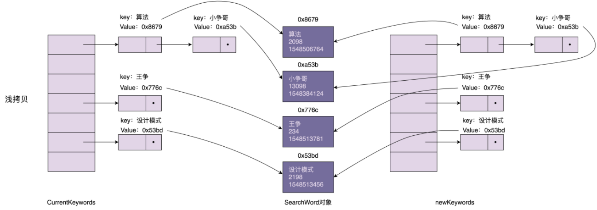

# 创建型

# 单例模式

## 概念

个类只允许创建唯一一个对象（或者实例），那这个类就是一个单例类，这种设计模式就叫作单例设计模式，简称单例模式。

定义中提到，“一个类只允许创建唯一一个对象”。那对象的唯一性的作用范围是什么呢？是指线程内只允许创建一个对象，还是指进程内只允许创建一个对象？答案是后者，也就是说，单例模式创建的对象是进程唯一的。

## 为什么使用单例

**处理资源访问冲突**

先看自定义打印日志例子：

```java
// 省略了异常的处理
public class Logger {
    private FileWriter writer;
    public Logger() {
        File file = new File("log.txt");
        writer = new FileWriter(file, true);// true表示追加 
    }
    public void log(String message) {
         writer.write(message); 
    }
}
public class UserController {
    private Logger logger = new Logger();

    public void create(OrderVo order) {
        // ... 省略业务逻辑代码 ...
        logger.log("Created an order:" + order.toString());
    }
}
```

在 `UserController `和 `OrderController `中，我们分别创建两个 `Logger `对象。在 Web 容器的 `Servlet `多线程环境下，如果两个 `Servlet` 线程同时分别执行 login() 和 create() 两个函数，并且同时写日志到 log.`txt` 文件中，那就有可能存在日志信息互相覆盖的情况。


如果如下使用对象锁的方式，依然解决不了问题：

```java

public class Logger {
  private FileWriter writer;

  public Logger() {
    File file = new File("log.txt");
    writer = new FileWriter(file, true); //true表示追加写入
  }
  public void log(String message) {
    synchronized(this) {
      writer.write(mesasge);
    }
  }
}
```

`FileWriter`的`writer`方法本身就加了对象级别的锁，不过依然解决不了覆盖的问题。在多线程的情况下，`Logger`有多个实例，那么就有多个`FileWriter`实例对象，就有覆盖的可能。

可以使用类级别的锁：

```java

public class Logger {
  private FileWriter writer;
  public Logger() {
    File file = new File("log.txt");
    writer = new FileWriter(file, true); //true表示追加写入
  }
  public void log(String message) {
    synchronized(Logger.class) { // 类级别的锁
      writer.write(mesasge);
    }
  }
}
```

除了使用类级别锁之外，实际上，解决资源竞争问题的办法还有很多，分布式锁是最常听到的一种解决方案。不过，实现一个安全可靠、无 bug、高性能的分布式锁，并不是件容易的事情。除此之外，并发队列（比如 Java 中的 `BlockingQueue`）也可以解决这个问题：多个线程同时往并发队列里写日志，一个单独的线程负责将并发队列中的数据，写入到日志文件。这种方式实现起来也稍微有点复杂。

使用单例模式：我们将 `Logger` 设计成一个单例类，程序中只允许创建一个 `Logger` 对象，**所有的线程共享使用的这一个 `Logger` 对象，共享一个 `FileWriter `对象**，而 `FileWriter `本身是对象级别线程安全的，也就避免了多线程情况下写日志会互相覆盖的问题。

```java
public class Logger {
    private FileWriter writer;
    private static final Logger INSTANCE = new Logger();
    private Logger() {
        File file = new File("log.txt");
		writer = new FileWriter(file, true);
    }
    public static Logger getInstance() {
        return INSTANCE;
    }
    public void log(String message) {
       writer.write(message);
    }
}
public class UserController {
    public void create(OrderVo order) {
        // ... 省略业务逻辑代码 ...
        Logger.getInstance().log("Created an order:" + order.toString());
    }
}
```

**表示全局唯一类**

**从业务概念上，如果有些数据在系统中只应保存一份，那就比较适合设计为单例类。**

比如，**配置信息类**。在系统中，我们只有一个配置文件，当配置文件被加载到内存之后，以对象的形式存在，也理所应当只有一份。

再比如，唯一递增 ID 号码生成器，如果程序中有两个对象，那就会存在生成重复 ID 的情况，所以，我们应该将 ID 生成器类设计为单例。

```java
public class IdGenerator {
    private AtomicLong id = new AtomicLong(0);
    private static final IdGenerator INSTANCE = new IdGenerator();
    private IdGenerator() {
    }
    public static IdGenerator getInstance() {
        return INSTANCE;
    }
    public long getId() {
        return id.incrementAndGet();
    }
}
class Application {
    public static void main(String[] args) {
        long id = IdGenerator.getInstance().getId();
    }
}
```

## 如何实现一个单例

需要考虑的点：

1. 构造函数需要是 private 访问权限的，这样才能避免外部通过 new 创建实例；
2. 考虑对象创建时的线程安全问题；
3. 考虑是否支持延迟加载；
4. 考虑 `getInstance()` 性能是否高（是否加锁）。

### 饿汉式

```java

public class IdGenerator { 
  private AtomicLong id = new AtomicLong(0);
  private static final IdGenerator instance = new IdGenerator();
  private IdGenerator() {}
  public static IdGenerator getInstance() {
    return instance;
  }
  public long getId() { 
    return id.incrementAndGet();
  }
}
```

有人觉得这种实现方式不好，因为不支持延迟加载，如果实例占用资源多（比如占用内存多）或初始化耗时长（比如需要加载各种配置文件），提前初始化实例是一种浪费资源的行为。最好的方法应该在用到的时候再去初始化。

如果初始化耗时长，那我们最好不要等到真正要用它的时候，才去执行这个耗时长的初始化过程，这会影响到系统的性能（比如，在响应客户端接口请求的时候，做这个初始化操作，会导致此请求的响应时间变长，甚至超时）。采用饿汉式实现方式，将耗时的初始化操作，提前到程序启动的时候完成，这样就能避免在程序运行的时候，再去初始化导致的性能问题。

如果实例占用资源多，按照 fail-fast 的设计原则（有问题及早暴露），那我们也希望在程序启动时就将这个实例初始化好。如果资源不够，就会在程序启动的时候触发报错（比如 Java 中的 `PermGen Space OOM`），我们可以立即去修复。这样也能避免在程序运行一段时间后，突然因为初始化这个实例占用资源过多，导致系统崩溃，影响系统的可用性。

### 懒汉式

```java

public class IdGenerator { 
  private AtomicLong id = new AtomicLong(0);
  private static IdGenerator instance;
  private IdGenerator() {}
  public static synchronized IdGenerator getInstance() { // 在方法上加锁
    if (instance == null) {
      instance = new IdGenerator();
    }
    return instance;
  }
  public long getId() { 
    return id.incrementAndGet();
  }
}
```

`getInstance`方法上加锁，如果频繁地用到，那频繁加锁、释放锁及并发度低等问题，会导致性能瓶颈，这种实现方式就不可取了。
### 双重检测

饿汉式不支持延迟加载，懒汉式有性能问题，不支持高并发。那我们再来看一种既支持延迟加载、又支持高并发的单例实现方式，也就是双重检测实现方式。

```java

public class IdGenerator { 
  private AtomicLong id = new AtomicLong(0);
  private static IdGenerator instance;
  private IdGenerator() {}
  public static IdGenerator getInstance() {
    if (instance == null) {
      synchronized(IdGenerator.class) { // 此处为类级别的锁
        if (instance == null) {
          instance = new IdGenerator();
        }
      }
    }
    return instance;
  }
  public long getId() { 
    return id.incrementAndGet();
  }
}
```

网上有人说，这种实现方式有些问题。因为指令重排序，可能会导致 `IdGenerator `对象被 new 出来，并且赋值给 `instance` 之后，还没来得及初始化（执行构造函数中的代码逻辑），就被另一个线程使用了。要解决这个问题，我们需要给 `instance` 成员变量加上 `volatile` 关键字，禁止指令重排序才行。

```java
public class IdGenerator {
    private AtomicLong id = new AtomicLong(0);
    private static volatile IdGenerator INSTANCE;

    private IdGenerator() {
    }

    public static IdGenerator getInstance() {
        IdGenerator localRef = INSTANCE; // 使用了局部变量
        if (localRef == null)
            synchronized (IdGenerator.class) {
                localRef = INSTANCE;
                if (localRef == null) {
                    INSTANCE = localRef = new IdGenerator();
                }
            }
        
        return localRef;
    }

    public long getId() {
        return id.incrementAndGet();
    }
}
```

使用局部变量的原因是，在初始化的时候减少对`volatile`变量的访问次数(由两次变成了一次，判断null值时一次，返回值时一次)，现在只在返回值时访问到。访问`volatile`变量内存是比较“昂贵”，因为涉及到了主内存。

参考：https://www.javacodemonk.com/threadsafe-singleton-design-pattern-java-806ad7e6

### 静态内部类

```java
public class IdGenerator {
    private AtomicLong id = new AtomicLong(0);
    private static volatile IdGenerator INSTANCE;

    private IdGenerator() {
    }

    private static class SingletonHolder{
        private static final IdGenerator INSTANCE = new IdGenerator();

    }

    public static IdGenerator getInstance() {
        return SingletonHolder.INSTANCE;
    }
    public long getId() {
        return id.incrementAndGet();
    }
}

```

`SingletonHolder `是一个静态内部类，当外部类 `IdGenerator `被加载的时候，并不会创建 `SingletonHolder `实例对象。只有当调用 `getInstance()` 方法时，`SingletonHolder `才会被加载，这个时候才会创建 instance。instance 的唯一性、创建过程的线程安全性，都由 JVM 来保证。所以，这种实现方法既保证了线程安全，又能做到延迟加载。

### 枚举

```java
public enum IdGenerator {
    INSTANCE;
    private AtomicLong id = new AtomicLong(0);

    public long getId() {
        return id.incrementAndGet();
    }
}

class Client {
    public static void main(String[] args) {
        long id = IdGenerator.INSTANCE.getId();
    }
}
```

基于枚举类型的单例实现。这种实现方式通过 Java 枚举类型本身的特性，保证了实例创建的线程安全性和实例的唯一性。


## 单例存在的问题

**单例对OOP特性的支持不友好**

OOP 的四大特性是封装、抽象、继承、多态。单例这种设计模式对于其中的抽象、继承、多态都支持得不好。

```java

public class Order {
  public void create(...) {
    //...
    long id = IdGenerator.getInstance().getId();
    //...
  }
}

public class User {
  public void create(...) {
    // ...
    long id = IdGenerator.getInstance().getId();
    //...
  }
}
```

`IdGenerator` 的使用方式违背了基于接口而非实现的设计原则，也就违背了广义上理解的 OOP 的抽象特性。如果未来某一天，我们希望针对不同的业务采用不同的 ID 生成算法。比如，订单 ID 和用户 ID 采用不同的 ID 生成器来生成。为了应对这个需求变化，我们需要修改所有用到 `IdGenerator `类的地方，这样代码的改动就会比较大。

**单例对代码的扩展性不友好**

连接池大部分情况下应该是单例的，但也有变化的时候。看一个例子：

系统设计初期，我们觉得系统中只应该有一个数据库连接池，这样能方便我们控制对数据库连接资源的消耗。所以，我们把数据库连接池类设计成了单例类。

但之后我们发现，系统中有些 SQL 语句运行得非常慢。这些 SQL 语句在执行的时候，长时间占用数据库连接资源，导致其他 SQL 请求无法响应。为了解决这个问题，我们希望将慢 SQL 与其他 SQL 隔离开来执行。为了实现这样的目的，我们可以在系统中创建两个数据库连接池，慢 SQL 独享一个数据库连接池，其他 SQL 独享另外一个数据库连接池，这样就能避免慢 SQL 影响到其他 SQL 的执行。

如果我们将数据库连接池设计成单例类，显然就无法适应这样的需求变更，也就是说，单例类在某些情况下会影响代码的扩展性、灵活性。所以，数据库连接池、线程池这类的资源池，最好还是不要设计成单例类。**实际上，一些开源的数据库连接池、线程池也确实没有设计成单例类。**

**单例不支持有参数的构造函数**

单例不支持有参数的构造函数，比如我们创建一个连接池的单例对象，我们没法通过参数来指定连接池的大小。针对这个问题，我们来看下都有哪些解决方案。

第一种解决思路是：创建完实例之后，再调用 `init() `函数传递参数。需要注意的是，我们在使用这个单例类的时候，要先调用 `init()` 方法，然后才能调用 `getInstance()` 方法，否则代码会抛出异常。

```java
public class Singleton {
    private static Singleton INSTANCE = null;

    private final int paramA;

    private final int paramB;

    public Singleton(int paramA, int paramB) {
        this.paramA = paramA;
        this.paramB = paramB;
    }

    public static Singleton getInstance() {
        if (INSTANCE == null) {
            throw new RuntimeException("Run init() first");
        }
        return INSTANCE;
    }

    public synchronized static Singleton init(int paramA, int paramB) {
        if (INSTANCE != null) {
            throw new RuntimeException("Singleton has been created");
        }
        INSTANCE = new Singleton(paramA, paramB);
        return INSTANCE;
    }
}

```

第二种方法是：将参数放到另外一个全局变量中，

```java
public class Config {
    public static final int PARAM_A = 123;

    public static final int PARAM_B = 456;
}
public class Singleton {
    private static Singleton INSTANCE = null;

    private final int paramA;

    private final int paramB;

    private Singleton() {
        this.paramA = Config.PARAM_A;
        this.paramB = Config.PARAM_B;
    }

    public synchronized static Singleton getInstance() {
        if (INSTANCE == null) {
            INSTANCE = new Singleton2();
        }
        return INSTANCE;
    }
}

```


## 进程唯一与线程唯一

我们编写的代码，通过编译、链接，组织在一起，就构成了一个操作系统可以执行的文件，也就是我们平时所说的“可执行文件”（比如 Windows 下的 exe 文件）。

可执行文件实际上就是代码被翻译成操作系统可理解的一组指令，你完全可以简单地理解为就是代码本身。当我们使用命令行或者双击运行这个可执行文件的时候，操作系统会启动一个进程，将这个执行文件从磁盘加载到自己的进程地址空间（可以理解操作系统为进程分配的内存存储区，用来存储代码和数据）。

接着，进程就一条一条地执行可执行文件中包含的代码。比如，当进程读到代码中的 User user = new User(); 这条语句的时候，它就在自己的地址空间中创建一个 user 临时变量和一个 User 对象。进程之间是不共享地址空间的，如果我们在一个进程中创建另外一个进程（比如，代码中有一个 fork() 语句，进程执行到这条语句的时候会创建一个新的进程），操作系统会给新进程分配新的地址空间，并且将老进程地址空间的所有内容，重新拷贝一份到新进程的地址空间中，这些内容包括代码、数据（比如 user 临时变量、User 对象）。

所以，单例类在老进程中存在且只能存在一个对象，在新进程中也会存在且只能存在一个对象。而且，这两个对象并不是同一个对象，这也就说，单例类中对象的唯一性的作用范围是进程内的，在进程间是不唯一的。

线程唯一”指的是线程内唯一，线程间可以不唯一。

在代码中，我们通过一个 `HashMap `来存储对象，其中 key 是线程 ID，value 是对象。这样我们就可以做到，不同的线程对应不同的对象，同一个线程只能对应一个对象。实际上，Java 语言本身提供了 `ThreadLocal `工具类，可以更加轻松地实现线程唯一单例。不过，`ThreadLocal` 底层实现原理也是基于下面代码中所示的 `HashMap`。

```java
public class IdGenerator {
    private AtomicLong id = new AtomicLong(0);

    private static final ConcurrentHashMap<Long, IdGenerator> INSTANCE =
            new ConcurrentHashMap<>();

    private IdGenerator() {
    }

    public static IdGenerator getInstance() {
        long currentThreadId = Thread.currentThread().getId();
        INSTANCE.putIfAbsent(currentThreadId, new IdGenerator4());
        return INSTANCE.get(currentThreadId);
    }

    public long getId() {
        return id.incrementAndGet();
    }
}
```

## 集群下的单例

经典的单例模式是进程内唯一的。

集群相当于多个进程构成的一个集合，“集群唯一”就相当于是进程内唯一、进程间也唯一。也就是说，不同的进程间共享同一个对象，不能创建同一个类的多个对象。

伪代码实现：

```java

public class IdGenerator {
  private AtomicLong id = new AtomicLong(0);
  private static IdGenerator instance;
  private static SharedObjectStorage storage = FileSharedObjectStorage(/*入参省略，比如文件地址*/);
  private static DistributedLock lock = new DistributedLock();
  
  private IdGenerator() {}

  public synchronized static IdGenerator getInstance() 
    if (instance == null) {
      lock.lock();
      instance = storage.load(IdGenerator.class);
    }
    return instance;
  }
  
  public synchroinzed void freeInstance() {
    storage.save(this, IdGeneator.class);
    instance = null; //释放对象
    lock.unlock();
  }
  
  public long getId() { 
    return id.incrementAndGet();
  }
}

// IdGenerator使用举例
IdGenerator idGeneator = IdGenerator.getInstance();
long id = idGenerator.getId();
IdGenerator.freeInstance();
```


## 多例模式

一个类可以创建多个对象，但是个数是有限制的，比如只能创建 3 个对象

```java
public class BackendServer {
    private long serverNo;

    private String serverAddr;

    private static final int SERVER_COUNT = 3;

    private static final Map<Long, BackendServer> serverInstances =
            new HashMap<>();

    private BackendServer(long serverNo, String serverAddr) {
        this.serverNo = serverNo;
        this.serverAddr = serverAddr;
    }

    static {
        serverInstances.put(1L, new BackendServer(1L, "192.168.11.110"))
        serverInstances.put(2L, new BackendServer(2L, "192.168.11.111"))
        serverInstances.put(3L, new BackendServer(3L, "192.168.11.112"))
    }

    public static BackendServer getInstance(long serverNo) {
        return serverInstances.get(serverNo);
    }

    public static BackendServer getRandomInstance() {
        Random r = new Random();
        int no = r.nextInt(SERVER_COUNT) + 1;
        return serverInstances.get(no);
    }
}
```

实际上，对于多例模式，还有一种理解方式：同一类型的只能创建一个对象，不同类型的可以创建多个对象。这里的“类型”如何理解呢？

```java

public class Logger {
  private static final ConcurrentHashMap<String, Logger> instances
          = new ConcurrentHashMap<>();

  private Logger() {}

  public static Logger getInstance(String loggerName) {
    instances.putIfAbsent(loggerName, new Logger());
    return instances.get(loggerName);
  }

  public void log() {
    //...
  }
}

//l1==l2, l1!=l3
Logger l1 = Logger.getInstance("User.class");
Logger l2 = Logger.getInstance("User.class");
Logger l3 = Logger.getInstance("Order.class");
```


# 工厂模式

## 简单工厂（Simple Factory）

背景：我们根据配置文件的后缀（`json`、`xml`、`yaml`、`properties`），选择不同的解析器（`JsonRuleConfigParser`、`XmlRuleConfigParser`……），将存储在文件中的配置解析成内存对象 `RuleConfig`。

简单工厂的第一种实现方法：

```java
public interface IRuleConfigParser {
    RuleConfig parse(String configText);
}
public class JsonRuleConfigParser implements IRuleConfigParser {
    @Override
    public RuleConfig parse(String configText) {
        return null;
    }
}
public class XmlRuleConfigParser implements IRuleConfigParser {
    @Override
    public RuleConfig parse(String configText) {
        return null;
    }
}
public class RuleConfigParserFactory {
    public static IRuleConfigParser createParser(String configFormat) throws InvalidPropertiesFormatException {
        IRuleConfigParser parser = null;
        if ("json".equalsIgnoreCase(configFormat)) {
            return new JsonRuleConfigParser();
        }
        if ("xml".equalsIgnoreCase(configFormat)) {
            return new XmlRuleConfigParser();
        }
        if ("yaml".equalsIgnoreCase(configFormat)) {
            return new YamlRuleConfigParser();
        }
        if ("properties".equalsIgnoreCase(configFormat)) {
            return new PropertiesRuleConfigParser();
        }
        throw new InvalidPropertiesFormatException("Rule config file format is not supported: " + configFormat);
    }
}
public class RuleConfigSource {
    public RuleConfig load(String ruleConfigFilePath) throws InvalidPropertiesFormatException {
        String fileExtension = getFileExtension(ruleConfigFilePath);
        IRuleConfigParser parser = RuleConfigParserFactory.createParser(fileExtension);
        String configText = "";
        RuleConfig config = parser.parse(configText);
        return config;
    }

    private String getFileExtension(String ruleConfigFilePath) {
        //...解析文件名获取扩展名，比如rule.json，返回json
        return "json";
    }
}
```

简单工厂第二种实现：将对象缓存起来

```java
public class RuleConfigParserFactory {
    private static final Map<String, IRuleConfigParser> cachedParsers =
            new HashMap<>();

    static {
        cachedParsers.put("json", new JsonRuleConfigParser());
        cachedParsers.put("xml", new XmlRuleConfigParser());
        cachedParsers.put("yaml", new YamlRuleConfigParser());
        cachedParsers.put("properties", new PropertiesRuleConfigParser());
    }

    public static IRuleConfigParser getParser(String configFormat) {
        configFormat == null || configFormat.isEmpty() {
            return null;
        }
        return cachedParsers.get(configFormat);
    }
}
```

对于上面两种简单工厂模式的实现方法，如果我们要添加新的 parser，那势必要改动到 `RuleConfigParserFactory `的代码，那这是不是违反开闭原则呢？实际上，如果不是需要频繁地添加新的 parser，只是偶尔修改一下 `RuleConfigParserFactory `代码，稍微不符合开闭原则，也是完全可以接受的。


## 工厂方法（Factory Method）

第一版：

```java
public interface IRuleConfigParserFactory {
    IRuleConfigParser createParser();
}
public class PropertiesRuleConfigParserFactory implements IRuleConfigParserFactory {
    @Override
    public IRuleConfigParser createParser() {
        return new PropertiesRuleConfigParser();
    }
}
public class JsonRuleConfigParserFactory implements IRuleConfigParserFactory {
    @Override
    public IRuleConfigParser createParser() {
        return new JsonRuleConfigParser();
    }
}
public class XmlRuleConfigParserFactory implements IRuleConfigParserFactory {
    @Override
    public IRuleConfigParser createParser() {
        return new XmlRuleConfigParser();
    }
}
// 使用
public class RuleConfigSource {
    public RuleConfig load(String ruleConfigFilePath) {
        String ruleConfigFileExtension = getFileExtension(ruleConfigFilePath);
        IRuleConfigParserFactory parserFactory = null;
        if ("json".equalsIgnoreCase(ruleConfigFileExtension)) {
            parserFactory = new JsonRuleConfigParserFactory();
        } else if ("xml".equalsIgnoreCase(ruleConfigFileExtension)) {
            parserFactory = new XmlRuleConfigParserFactory();
        } else if ("yaml".equalsIgnoreCase(ruleConfigFileExtension)) {
            parserFactory = new YamlRuleConfigParserFactory();
        } else if ("properties".equalsIgnoreCase(ruleConfigFileExtension)) {
            parserFactory = new PropertiesRuleConfigParserFactory();
        } else {
            throw new InvalidRuleConfigException("Rule config file format is not supported: " + ruleConfigFilePath);
        }
        IRuleConfigParser parser = parserFactory.createParser();
        RuleConfig ruleConfig = parser.parse(ruleConfigFileExtension);
        return ruleConfig;
    }
    private String getFileExtension(String ruleConfigFilePath) {
        // 省略实现
        return "json";
    }
}

```

第二版：

```java
    public class RuleConfigParserFactoryMap {
    private static final Map<String,IRuleConfigParserFactory> cachedFactories = new HashMap<>();

    static {
        cachedFactories.put("json", new JsonRuleConfigParserFactory());
        cachedFactories.put("xml", new XmlRuleConfigParserFactory());
        cachedFactories.put("yaml", new YamlRuleConfigParserFactory());
        cachedFactories.put("properties", new PropertiesRuleConfigParserFactory());
    }
    public static IRuleConfigParserFactory getParserFactory(String type) {
        if (type == null || type.isEmpty()) {
            return null;
        }
        IRuleConfigParserFactory parserFactory = cachedFactories.get(type.toLowerCase());
        return parserFactory;
    }
}

```

当我们需要添加新的规则配置解析器的时候，我们只需要创建新的 `parser `类和 `parser factory `类，并且在 `RuleConfigParserFactoryMap` 类中，将新的 `parser factory `对象添加到 `cachedFactories `中即可。代码的改动非常少，基本上符合开闭原则。

实际上，对于规则配置文件解析这个应用场景来说，工厂模式需要额外创建诸多 Factory 类，也会增加代码的复杂性，而且，每个 Factory 类只是做简单的 new 操作，功能非常单薄（只有一行代码），也没必要设计成独立的类，所以，在这个应用场景下，简单工厂模式简单好用，比工厂方法模式更加合适。

## 简单工厂or工厂方法？

我们前面提到，之所以将某个代码块剥离出来，独立为函数或者类，原因是这个代码块的逻辑过于复杂，剥离之后能让代码更加清晰，更加可读、可维护。

但是，如果代码块本身并不复杂，就几行代码而已，我们完全没必要将它拆分成单独的函数或者类。

基于这个设计思想，当对象的创建逻辑比较复杂，**不只是简单的 new 一下就可以，而是要组合其他类对象，做各种初始化操作的时候，我们推荐使用工厂方法模式，将复杂的创建逻辑拆分到多个工厂类中，让每个工厂类都不至于过于复杂。**

而使用简单工厂模式，将所有的创建逻辑都放到一个工厂类中，会导致这个工厂类变得很复杂。除此之外，在某些场景下，如果对象不可复用，那工厂类每次都要返回不同的对象。如果我们使用简单工厂模式来实现，就只能选择第一种包含 if 分支逻辑的实现方式。如果我们还想避免烦人的 if-else 分支逻辑，这个时候，我们就推荐使用工厂方法模式。

## Calendar类与工厂模式

`Calendar` 类提供了大量跟日期相关的功能代码，同时，又提供了一个 `getInstance()` 工厂方法，用来根据不同的 `TimeZone `和 `Locale `创建不同的 `Calendar `子类对象。

`Calendar `类的相关代码如下所示，大部分代码都已经省略。从`getInstance()`开始，`getInstance()` 方法可以根据不同 `TimeZone `和 `Locale`，创建不同的 `Calendar `子类对象，比如 `BuddhistCalendar`、`JapaneseImperialCalendar`、`GregorianCalendar`，这些细节完全封装在工厂方法中，使用者只需要传递当前的时区和地址，就能够获得一个 Calendar 类对象来使用，而获得的对象具体是哪个 Calendar 子类的对象

```java
public abstract class Calendar implements Serializable, Cloneable, Comparable<Calendar> {
  //...
  public static Calendar getInstance(TimeZone zone, Locale aLocale){
    return createCalendar(zone, aLocale);
  }

  private static Calendar createCalendar(TimeZone zone,Locale aLocale) {
    CalendarProvider provider = LocaleProviderAdapter.getAdapter(
        CalendarProvider.class, aLocale).getCalendarProvider();
    if (provider != null) {
      try {
        return provider.getInstance(zone, aLocale);
      } catch (IllegalArgumentException iae) {
        // fall back to the default instantiation
      }
    }

    Calendar cal = null;
    if (aLocale.hasExtensions()) {
      String caltype = aLocale.getUnicodeLocaleType("ca");
      if (caltype != null) {
        switch (caltype) {
          case "buddhist":
            cal = new BuddhistCalendar(zone, aLocale);
            break;
          case "japanese":
            cal = new JapaneseImperialCalendar(zone, aLocale);
            break;
          case "gregory":
            cal = new GregorianCalendar(zone, aLocale);
            break;
        }
      }
    }
    if (cal == null) {
      if (aLocale.getLanguage() == "th" && aLocale.getCountry() == "TH") {
        cal = new BuddhistCalendar(zone, aLocale);
      } else if (aLocale.getVariant() == "JP" && aLocale.getLanguage() == "ja" && aLocale.getCountry() == "JP") {
        cal = new JapaneseImperialCalendar(zone, aLocale);
      } else {
        cal = new GregorianCalendar(zone, aLocale);
      }
    }
    return cal;
  }
  //...
}
```


# 建造者模式

## 为什么实用建造者模式

背景：我们需要定义一个资源池配置类 `ResourcePoolConfig`。这里的资源池，你可以简单理解为线程池、连接池、对象池等。在这个资源池配置类中，有以下几个成员变量，也就是可配置项。现在，请你编写代码实现这个 `ResourcePoolConfig` 类。

```java
public class ResourcePoolConfig {
    private static final int DEFAULT_MAX_TOTAL = 8;

    private static final int DEFAULT_MAX_IDLE = 8;

    private static final int DEFAULT_MIN_IDLE = 0;

    private String name;

    private int maxTotal = DEFAULT_MAX_TOTAL;

    private int maxIdle = DEFAULT_MAX_IDLE;

    private int minIdle = DEFAULT_MIN_IDLE;

    public ResourcePoolConfig(String name, Integer maxTotal, Integer maxIdle, Integer minIdle) {
        if (name == null || name.isEmpty()) {
            throw new IllegalArgumentException("name should not be empty.");
        }
        this.name = name;
        if (maxTotal != null) {
            if (maxTotal <= 0) {
                throw new IllegalArgumentException("maxTotal should be positive.");
            }
            this.maxTotal = maxTotal;
        }
        if (maxIdle != null) {
            if (maxIdle < 0) {
                throw new IllegalArgumentException("maxIdle should not be negative.");
            }
            this.maxIdle = maxIdle;
        }
        if (minIdle != null) {
            if (minIdle < 0) {
                throw new IllegalArgumentException("minIdle should not be negative.");
            }
            this.minIdle = minIdle;
        }
    }
    // 省略setter getter方法
}
```

因为 `maxTotal`、`maxIdle`、`minIdle `不是必填变量，所以在创建 `ResourcePoolConfig `对象的时候，我们通过往构造函数中，给这几个参数传递 null 值，来表示使用默认值。


如果构造函数的参数很多，代码在可读性和易用性上都会变差，在使用构造函数的时候，我们就容易搞错个参数的顺序，传递进错误的参数值，导致非常隐蔽的bug。

解决这个问题可以使用`set()`函数

```java
public class ResourcePoolConfig {
    private static final int DEFAULT_MAX_TOTAL = 8;

    private static final int DEFAULT_MAX_IDLE = 8;

    private static final int DEFAULT_MIN_IDLE = 0;

    private String name;

    private int maxTotal = DEFAULT_MAX_TOTAL;

    private int maxIdle = DEFAULT_MAX_IDLE;

    private int minIdle = DEFAULT_MIN_IDLE;

    public ResourcePoolConfig(String name) {
        if (name == null || name.isEmpty()) {
            throw new IllegalArgumentException("name should not be empty.");
        }
    }

    public void setMaxTotal(int maxTotal) {
        if (maxTotal <= 0) {
            throw new IllegalArgumentException("maxTotal should be positive.");
        }
        this.maxTotal = maxTotal;
    }
    public void setMaxIdle(int maxIdle) {
        if (maxIdle < 0) {
            throw new IllegalArgumentException("maxIdle should not be negative.");
        }
        this.maxIdle = maxIdle;
    }
    public void setMinIdle(int minIdle) {
        if (minIdle < 0) {
            throw new IllegalArgumentException("minIdle should not be negative.");
        }
        this.minIdle = minIdle;
    } //...省略getter方法...
}
```

`set`函数设置可选配置项，就能实现我们的设计需求。考虑以下场景：

1. 我们希望 `ResourcePoolConfig `类对象是不可变对象，也就是说，对象在创建好之后，就不能再修改内部的属性值。要实现这个功能，我们就不能在 `ResourcePoolConfig `类中暴露 set() 方法。
2. 假设配置项之间有一定的依赖关系，比如，如果用户设置了 `maxTotal`、`maxIdle`、`minIdle `其中一个，就必须显式地设置另外两个；或者配置项之间有一定的约束条件，比如，`maxIdle` 和 `minIdle `要小于等于 `maxTotal`。如果我们继续使用现在的设计思路，那这些**配置项之间的依赖关系**或者约束条件的校验逻辑就无处安放了。

使用建造者模式可以解决上面两个问题：

```java
public class ResourcePoolConfig3 {
    private String name;
    private int maxTotal;
    private int maxIdle;
    private int minIdle;
    private ResourcePoolConfig3(Builder builder) {
        this.name = builder.name;
        this.maxTotal = builder.maxTotal;
        this.maxIdle = builder.maxIdle;
        this.minIdle = builder.minIdle;
    }

    public static class Builder {
        private static final int DEFAULT_MAX_TOTAL = 8;
        private static final int DEFAULT_MAX_IDLE = 8;
        private static final int DEFAULT_MIN_IDLE = 0;
        private String name;
        private int maxTotal = DEFAULT_MAX_TOTAL;
        private int maxIdle = DEFAULT_MAX_IDLE;
        private int minIdle = DEFAULT_MIN_IDLE;

        public ResourcePoolConfig3 build() {
            // 校验逻辑放到这里来做，包括必填项校验、依赖关系校验、约束条件校验等
            if (name == null || name.isEmpty()) {
                throw new IllegalArgumentException("...");
            }
            if (maxIdle > maxTotal) {
                throw new IllegalArgumentException("...");
            }
            // 可以让有关联的参数在一起进行校验
            if (minIdle > maxTotal || minIdle > maxIdle) { 
                throw new IllegalArgumentException("...");
            }
            return new ResourcePoolConfig3(this);
        }

        public Builder setName(String name) {
            if (name == null || name.isEmpty()) {
                throw new IllegalArgumentException("...");
            }
            this.name = name;
            return this;
        }

        public Builder setMaxTotal(int maxTotal) {
            if (maxTotal < 0) {
                throw new IllegalArgumentException("...");
            }
            this.maxTotal = maxTotal;
            return this;
        }

        public Builder setMinIdle(int minIdle) {
            if (minIdle < 0) {
                throw new IllegalArgumentException("...");
            }
            this.minIdle = minIdle;
            return this;
        }

        public Builder setMaxIdle(int maxIdle) {
            if (minIdle < 0) {
                throw new IllegalArgumentException("...");
            }
            this.maxIdle = maxIdle;
            return this;
        }
    }
}
class Application {
    public static void main(String[] args) {
        ResourcePoolConfig3 config = new ResourcePoolConfig3.Builder()
                .setName("dbconnetionpool")
                .setMaxTotal(16)
                .setMaxIdle(10)
                .setMinIdle(12)
                .build();
    }
}

```


实际上，**使用建造者模式创建对象，还能避免对象存在无效状态**。比如我们定义了一个长方形类，如果不使用建造者模式，采用先创建后 set 的方式，那就会导致在第一个 set 之后，对象处于无效状态。具体代码如下所示：

```java
Rectangle r = new Rectange(); // r is invalid
r.setWidth(2); // r is invalid
r.setHeight(3); // r is valid
```

为了避免这种无效状态的存在，我们就需要使用构造函数一次性初始化好所有的成员变量。

如果构造函数参数过多，我们就需要考虑使用建造者模式，先设置建造者的变量，然后再一次性地创建对象，让对象一直处于有效状态。

实际上，如果我们并不是很关心对象是否有短暂的无效状态，也不是太在意对象是否是可变的。比如，对象只是用来映射数据库读出来的数据，那我们直接暴露 set() 方法来设置类的成员变量值是完全没问题的。

而且，使用建造者模式来构建对象，代码实际上是有点重复的，`ResourcePoolConfig `类中的成员变量，要在 `Builder `类中重新再定义一遍。

## Calendar 类中的应用

```java

public abstract class Calendar implements Serializable, Cloneable, Comparable<Calendar> {
  //...
  public static class Builder {
    private static final int NFIELDS = FIELD_COUNT + 1;
    private static final int WEEK_YEAR = FIELD_COUNT;
    private long instant;
    private int[] fields;
    private int nextStamp;
    private int maxFieldIndex;
    private String type;
    private TimeZone zone;
    private boolean lenient = true;
    private Locale locale;
    private int firstDayOfWeek, minimalDaysInFirstWeek;

    public Builder() {}
    
    public Builder setInstant(long instant) {
        if (fields != null) {
            throw new IllegalStateException();
        }
        this.instant = instant;
        nextStamp = COMPUTED;
        return this;
    }
    //...省略n多set()方法
    
    public Calendar build() {
      if (locale == null) {
        locale = Locale.getDefault();
      }
      if (zone == null) {
        zone = TimeZone.getDefault();
      }
      Calendar cal;
      if (type == null) {
        type = locale.getUnicodeLocaleType("ca");
      }
      if (type == null) {
        if (locale.getCountry() == "TH" && locale.getLanguage() == "th") {
          type = "buddhist";
        } else {
          type = "gregory";
        }
      }
      switch (type) {
        case "gregory":
          cal = new GregorianCalendar(zone, locale, true);
          break;
        case "iso8601":
          GregorianCalendar gcal = new GregorianCalendar(zone, locale, true);
          // make gcal a proleptic Gregorian
          gcal.setGregorianChange(new Date(Long.MIN_VALUE));
          // and week definition to be compatible with ISO 8601
          setWeekDefinition(MONDAY, 4);
          cal = gcal;
          break;
        case "buddhist":
          cal = new BuddhistCalendar(zone, locale);
          cal.clear();
          break;
        case "japanese":
          cal = new JapaneseImperialCalendar(zone, locale, true);
          break;
        default:
          throw new IllegalArgumentException("unknown calendar type: " + type);
      }
      cal.setLenient(lenient);
      if (firstDayOfWeek != 0) {
        cal.setFirstDayOfWeek(firstDayOfWeek);
        cal.setMinimalDaysInFirstWeek(minimalDaysInFirstWeek);
      }
      if (isInstantSet()) {
        cal.setTimeInMillis(instant);
        cal.complete();
        return cal;
      }
      if (fields != null) {
        boolean weekDate = isSet(WEEK_YEAR) && fields[WEEK_YEAR] > fields[YEAR];
        if (weekDate && !cal.isWeekDateSupported()) {
          throw new IllegalArgumentException("week date is unsupported by " + type);
        }
        for (int stamp = MINIMUM_USER_STAMP; stamp < nextStamp; stamp++) {
          for (int index = 0; index <= maxFieldIndex; index++) {
            if (fields[index] == stamp) {
              cal.set(index, fields[NFIELDS + index]);
              break;
             }
          }
        }
        if (weekDate) {
          int weekOfYear = isSet(WEEK_OF_YEAR) ? fields[NFIELDS + WEEK_OF_YEAR] : 1;
          int dayOfWeek = isSet(DAY_OF_WEEK) ? fields[NFIELDS + DAY_OF_WEEK] : cal.getFirstDayOfWeek();
          cal.setWeekDate(fields[NFIELDS + WEEK_YEAR], weekOfYear, dayOfWeek);
        }
        cal.complete();
      }
      return cal;
    }
  }
}
```


# 原型模式

## 原理及应用

如果对象的创建成本比较大，而同一个类的不同对象之间差别不大（大部分字段都相同），在这种情况下，我们可以利用对已有对象（原型）进行复制（或者叫拷贝）的方式来创建新对象，以达到节省创建时间的目的。这种**基于原型来创建对象的方式就叫作原型设计模式**（Prototype Design Pattern），**简称原型模式**。

实际上，创建对象包含的申请内存、给成员变量赋值这一过程，本身并不会花费太多时间，或者说对于大部分业务系统来说，这点时间完全是可以忽略的。

应用一个复杂的模式，只得到一点点的性能提升，这就是所谓的过度设计，得不偿失。

但是，如果对象中的数据需要经过复杂的计算才能得到（比如排序、计算哈希值），或者需要从 RPC、网络、数据库、文件系统等非常慢速的 IO 中读取，这种情况下，我们就可以利用原型模式，从其他已有对象中直接拷贝得到，而不用每次在创建新对象的时候，都重复执行这些耗时的操作。

## 原型模式应用

场景：假设数据库中存储了大约 10 万条“搜索关键词”信息，每条信息包含关键词、关键词被搜索的次数、信息最近被更新的时间等。**系统 A 在启动**的时候会加载这份数据到内存中，用于处理某些其他的业务需求。为了方便快速地查找某个关键词对应的信息，我们给关键词建立一个散列表索引。

可以使用`HashMap`实现，其中，`HashMap `的 key 为搜索关键词，value 为关键词详细信息（比如搜索次数）。我们只需要将数据从数据库中读取出来，放入 `HashMap `就可以了。

不过，我们还有另外一个**系统 B**，专门用来分析搜索日志，定期（比如间隔 10 分钟）批量地更新数据库中的数据，并且标记为新的数据版本。比如，在下面的示例图中，我们对 v2 版本的数据进行更新，得到 v3 版本的数据。这里我们假设只有更新和新添关键词，没有删除关键词的行为。


为了保证**系统 A** 中数据的实时性（不一定非常实时，但数据也不能太旧），系统 A 需要定期根据数据库中的数据，更新内存中的索引和数据。

我们只需要在系统 A 中，记录当前数据的版本 Va 对应的更新时间 Ta，从数据库中捞出更新时间大于 Ta 的所有搜索关键词，也就是找出 Va 版本与最新版本数据的“差集”，然后针对差集中的每个关键词进行处理。如果它已经在散列表中存在了，我们就**更新相应的搜索次数、更新时间等信息**；如果它在散列表中不存在，我们就将它插入到散列表中。

```java
public class SearchWordsHandler {
    private HashMap<String, SearchWord> currentKeyWords = new HashMap<>();
    private long lastUpdateTime = -1;

    public void refresh() {
        List<SearchWord> toBeUpdatedSearchWords = getSearchWords(lastUpdateTime);
        long maxNewUpdatedTime = lastUpdateTime;
        for (SearchWord word : toBeUpdatedSearchWords) {
            if (word.getLastUpdateTime() > maxNewUpdatedTime) {
                maxNewUpdatedTime = word.getLastUpdateTime(); // 获取最大的时间时
            }
            if (currentKeyWords.containsKey(word.getKeyWord())) {
                currentKeyWords.replace(word.getKeyWord(), word);
            } else {
                currentKeyWords.put(word.getKeyWord(), word);
            }
        }
        lastUpdateTime = maxNewUpdatedTime; // 更每次查询时间
    }

    private List<SearchWord> getSearchWords(long lastUpdateTime) {
        // TODO get from db
        return null;
    }
}
```

增加需求：任何时刻，系统 A 中的所有数据都必须是同一个版本的，**要么都是版本 a，要么都是版本 b，不能有的是版本 a，有的是版本 b**。那刚刚的更新方式就不能满足这个要求了。除此之外，我们还要求：在更新内存数据的时候，系统 A 不能处于不可用状态，也就是不能停机更新数据。

```java
public class SearchWordsHandler2 {
    private HashMap<String, SearchWord> currentKeywords = new HashMap<>();

    public void refresh() {
        HashMap<String, SearchWord> newKeywords = new LinkedHashMap<>();
        List<SearchWord> toBeUpdatedSearchWords = getSearchWords();

        for (SearchWord searchWord : toBeUpdatedSearchWords) {
            newKeywords.put(searchWord.getKeyWord(), searchWord);
        }
        currentKeywords = newKeywords;
    }

    private List<SearchWord> getSearchWords() {
        // TODO get from db
        return null;
    }
}
```

不过，在上面的代码实现中，`newKeywords `构建的成本比较高。我们需要将这 10 万条数据从数据库中读出，然后计算哈希值，构建 `newKeywords`。这个过程显然是比较耗时。为了提高效率，原型模式就派上用场了。我们拷贝 `currentKeywords` 数据到 `newKeywords `中，然后从数据库中只捞出新增或者有更新的关键词，更新到 `newKeywords` 中。而相对于 10 万条数据来说，每次新增或者更新的关键词个数是比较少的，所以，这种策略大大提高了数据更新的效率。

```java
public class SearchWordsHandler3 {
    private HashMap<String, SearchWord> currentKeywords = new HashMap<>();
    private long lastUpdateTime = -1;

    public void refresh() {
        // 原型模式就这么简单，拷贝已有对象的数据，更新少量差值
        HashMap<String, SearchWord> newKeywords = (HashMap<String, SearchWord>) currentKeywords.clone();
        List<SearchWord> toBeUpdatedSearchWords = getSearchWords();
        long maxNewUpdatedTime = lastUpdateTime;
        for (SearchWord searchWord : toBeUpdatedSearchWords) {
            if (searchWord.getLastUpdateTime() > maxNewUpdatedTime) {
                maxNewUpdatedTime = searchWord.getLastUpdateTime();
            }
            if (newKeywords.containsKey(searchWord.getKeyWord())) {
                SearchWord old = newKeywords.get(searchWord.getKeyWord());
                old.setCount(searchWord.getCount());
                old.setLastUpdateTime(searchWord.getLastUpdateTime());
            } else {
                newKeywords.put(searchWord.getKeyWord(), searchWord);
            }
        }
        currentKeywords = newKeywords;
        lastUpdateTime = maxNewUpdatedTime;
    }

    private List<SearchWord> getSearchWords() {
        // TODO get from db
        return null;
    }
}
```

不过，上面的实现是存在问题，`HashMap `上的 `clone()`是 浅拷贝，当我们通过 `newKeywords `更新 `SearchWord` 对象的时候（比如，更新“设计模式”这个搜索关键词的访问次数），`newKeywords `和 `currentKeywords `因为指向相同的一组 `SearchWord` 对象，就会导致 `currentKeywords` 中指向的 `SearchWord`，有的是老版本的，有的是新版本的，就没法满足我们之前的需求：`currentKeywords `中的数据在任何时刻都是同一个版本的，不存在介于老版本与新版本之间的中间状态

## 深拷贝与浅拷贝



浅拷贝只会复制图中的索引（散列表），不会复制数据（`SearchWord` 对象）本身


深拷贝不仅仅会复制索引，还会复制数据本身。浅拷贝得到的对象（`newKeywords`）跟原始对象（`currentKeywords`）共享数据（`SearchWord` 对象），而深拷贝得到的是一份完完全全独立的对象

如何实现深拷贝：

第一种方法，递归拷贝对象、对象的引用对象以及引用对象的引用对象……直到要拷贝的对象只包含基本数据类型数据，没有引用对象为止。

```java
public class SearchWordsHandler4 {
    private HashMap<String, SearchWord> currentKeywords = new HashMap<>();
    private long lastUpdateTime = -1;

    public void refresh() {
        // 原型模式就这么简单，拷贝已有对象的数据，更新少量差值
        HashMap<String, SearchWord> newKeywords = new HashMap<>();
        for (Map.Entry<String, SearchWord> e : currentKeywords.entrySet()) {
            SearchWord searchWord = e.getValue();
            SearchWord newSearchWord = new SearchWord(searchWord.getLastUpdateTime(),
                    searchWord.getKeyWord(), searchWord.getCount());
            newKeywords.put(e.getKey(), newSearchWord);
        }

        List<SearchWord> toBeUpdatedSearchWords = getSearchWords();
        long maxNewUpdatedTime = lastUpdateTime;
        for (SearchWord searchWord : toBeUpdatedSearchWords) {
            if (searchWord.getLastUpdateTime() > maxNewUpdatedTime) {
                maxNewUpdatedTime = searchWord.getLastUpdateTime();
            }
            if (newKeywords.containsKey(searchWord.getKeyWord())) {
                SearchWord old = newKeywords.get(searchWord.getKeyWord());
                old.setCount(searchWord.getCount());
                old.setLastUpdateTime(searchWord.getLastUpdateTime());
            } else {
                newKeywords.put(searchWord.getKeyWord(), searchWord);
            }
        }
        currentKeywords = newKeywords;
        lastUpdateTime = maxNewUpdatedTime;
    }

    private List<SearchWord> getSearchWords() {
        // TODO get from db
        return null;
    }
}

```

第二种方法：先将对象序列化，然后再反序列化成新的对象

```java

public Object deepCopy(Object object) {
  ByteArrayOutputStream bo = new ByteArrayOutputStream();
  ObjectOutputStream oo = new ObjectOutputStream(bo);
  oo.writeObject(object);
  
  ByteArrayInputStream bi = new ByteArrayInputStream(bo.toByteArray());
  ObjectInputStream oi = new ObjectInputStream(bi);
  
  return oi.readObject();
}
```

更高效率

```java
package com.prototype;

import java.util.HashMap;
import java.util.List;
import java.util.Map;

/**
 * @author: ocean
 * @since: 2020-08-25
 **/
public class SearchWordsHandler5 {
    private HashMap<String, SearchWord> currentKeywords = new HashMap<>();
    private long lastUpdateTime = -1;

    public void refresh() {
        // 原型模式就这么简单，拷贝已有对象的数据，更新少量差值
        HashMap<String, SearchWord> newKeywords = (HashMap<String, SearchWord>)currentKeywords.clone();

        List<SearchWord> toBeUpdatedSearchWords = getSearchWords();
        long maxNewUpdatedTime = lastUpdateTime;
        for (SearchWord searchWord : toBeUpdatedSearchWords) {
            if (searchWord.getLastUpdateTime() > maxNewUpdatedTime) {
                maxNewUpdatedTime = searchWord.getLastUpdateTime();
            }
            if (newKeywords.containsKey(searchWord.getKeyWord())) {
                newKeywords.remove(searchWord.getKeyWord());
            }
            newKeywords.put(searchWord.getKeyWord(), searchWord);
        }
        currentKeywords = newKeywords;
        lastUpdateTime = maxNewUpdatedTime;
    }

    private List<SearchWord> getSearchWords() {
        // TODO get from db
        return null;
    }
}

```

