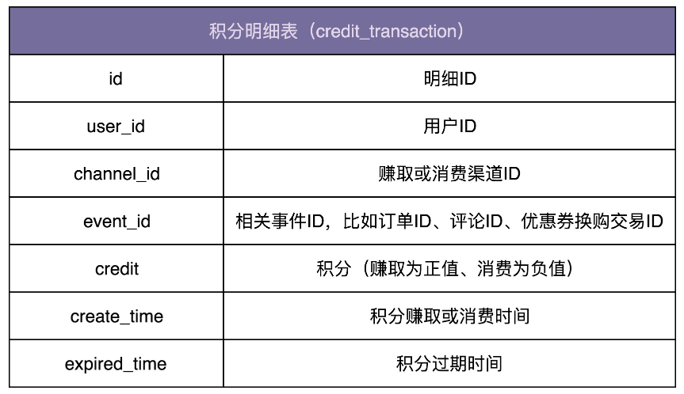
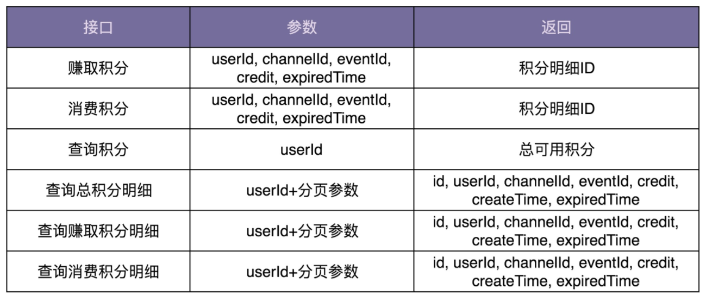

# 积分兑换系统开发

## 需求分析

- 找到类型的产品参考积分系统是符合实现的。如淘宝。或者直接百度“淘宝积分规则“
- 笼统地来讲，积分系统无外乎就两个大的功能点，一个是赚取积分，另一个是消费积分。赚取积分功能包括积分赚取渠道，比如下订单、每日签到、评论等；还包括积分兑换规则，比如订单金额与积分的兑换比例，每日签到赠送多少积分等。消费积分功能包括积分消费渠道，比如抵扣订单金额、兑换优惠券、积分换购、参与活动扣积分等；还包括积分兑换规则，比如多少积分可以换算成抵扣订单的多少金额，一张优惠券需要多少积分来兑换等等。
- 通过产品的线框图、用户用例（user case ）或者叫用户故事（user story）来细化业务流程，挖掘一些比较细节的、不容易想到的功能点。

### 积分赚取和兑换规则

积分的赚取渠道包括：下订单、每日签到、评论等。

积分兑换规则可以是比较通用的。比如，签到送 10 积分。再比如，按照订单总金额的 10% 兑换成积分，也就是 100 块钱的订单可以积累 10 积分。除此之外，积分兑换规则也可以是比较细化的。比如，不同的店铺、不同的商品，可以设置不同的积分兑换比例。对于积分的有效期，我们可以根据不同渠道，设置不同的有效期。积分到期之后会作废；在消费积分的时候，优先使用快到期的积分。

### 积分消费和兑换规则

积分的消费渠道包括：抵扣订单金额、兑换优惠券、积分换购、参与活动扣积分等。我们可以根据不同的消费渠道，设置不同的积分兑换规则。比如，积分换算成消费抵扣金额的比例是 10%，也就是 10 积分可以抵扣 1 块钱；100 积分可以兑换 15 块钱的优惠券等。

### 积分及其明细查询

查询用户的总积分，以及赚取积分和消费积分的历史记录。

## 系统设计

面向对象设计聚焦在代码层面（主要是针对类），那系统设计就是聚焦在架构层面（主要是针对模块），两者有很多相似之处。很多设计原则和思想不仅仅可以应用到代码设计中，还能用到架构设计中

### 合理地将功能划分到不同模块

前面讲到面向对象设计的时候，我们提到，面向对象设计的本质就是把合适的代码放到合适的类中。合理地划分代码可以实现代码的高内聚、低耦合，类与类之间的交互简单清晰，代码整体结构一目了然，那代码的质量就不会差到哪里去。类比面向对象设计，系统设计实际上就是将合适的功能放到合适的模块中。合理地划分模块也可以做到模块层面的高内聚、低耦合，架构整洁清晰。

下面有三种模块划分方法

1. 积分赚取渠道及兑换规则、消费渠道及兑换规则的管理和维护（增删改查），不划分到积分系统中，而是放到更上层的营销系统中。这样积分系统就会变得非常简单，只需要负责增加积分、减少积分、查询积分、查询积分明细等这几个工作。

   举个例子解释一下。比如，用户通过下订单赚取积分。订单系统通过异步发送消息或者同步调用接口的方式，告知营销系统订单交易成功。营销系统根据拿到的订单信息，查询订单对应的积分兑换规则（兑换比例、有效期等），计算得到订单可兑换的积分数量，然后调用积分系统的接口给用户增加积分

2. 积分赚取渠道及兑换规则、消费渠道及兑换规则的管理和维护，分散在各个相关业务系统中，比如订单系统、评论系统、签到系统、换购商城、优惠券系统等。还是刚刚那个下订单赚取积分的例子，在这种情况下，用户下订单成功之后，订单系统根据商品对应的积分兑换比例，计算所能兑换的积分数量，然后直接调用积分系统给用户增加积分。

3. 所有的功能都划分到积分系统中，包括积分赚取渠道及兑换规则、消费渠道及兑换规则的管理和维护。还是同样的例子，用户下订单成功之后，订单系统直接告知积分系统订单交易成功，积分系统根据订单信息查询积分兑换规则，给用户增加积分。

### 设计模块之间的关系

在面向对象设计中，类设计好之后，我们需要设计类之间的交互关系。类比到系统设计，系统职责划分好之后，接下来就是设计系统之间的交互，也就是确定有哪些系统跟积分系统之间有交互以及如何进行交互。比较常见的系统之间的交互方式有两种，一种是同步接口调用，另一种是利用消息中间件异步调用。第一种方式简单直接，第二种方式的解耦效果更好。比如，用户下订单成功之后，订单系统推送一条消息到消息中间件，营销系统订阅订单成功消息，触发执行相应的积分兑换逻辑。这样订单系统就跟营销系统完全解耦，订单系统不需要知道任何跟积分相关的逻辑，而营销系统也不需要直接跟订单系统交互。

###  设计模块的接口、数据库、业务模型

#### 数据库

针对积分系统，数据库的设计比较简单。只需要一张记录积分流水明细的表就可以了

#### 接口设计：

接口设计要符合单一职责原则，粒度越小通用性就越好。但是，接口粒度太小也会带来一些问题。比如，一个功能的实现要调用多个小接口，一方面如果接口调用走网络（特别是公网），多次远程接口调用会影响性能；另一方面，本该在一个接口中完成的原子操作，现在分拆成多个小接口来完成，就可能会涉及分布式事务的数据一致性问题（一个接口执行成功了，但另一个接口执行失败了）。所以，为了兼顾易用性和性能，我们可以借鉴 facade（外观）设计模式，在职责单一的细粒度接口之上，再封装一层粗粒度的接口给外部使用。

#### 业务模块

从代码实现角度来说，大部分业务系统的开发都可以分为 Controller、Service、Repository 三层。Controller 层负责接口暴露，Repository 层负责数据读写，Service 层负责核心业务逻辑，也就是这里说的业务模型。

## 为什么要分 MVC 三层开发 

### 能起到代码复用的作用

同一个 Repository 可能会被多个 Service 来调用，同一个 Service 可能会被多个 Controller 调用。比如，UserService 中的 getUserById() 接口封装了通过 ID 获取用户信息的逻辑，这部分逻辑可能会被 UserController 和 AdminController 等多个 Controller 使用。如果没有 Service 层，每个 Controller 都要重复实现这部分逻辑，显然会违反 DRY 原则。

### 隔离变化的作用

分层体现了一种抽象和封装的设计思想。比如，Repository 层封装了对数据库访问的操作，提供了抽象的数据访问接口。基于接口而非实现编程的设计思想，Service 层使用 Repository 层提供的接口，并不关心其底层依赖的是哪种具体的数据库。当我们需要替换数据库的时候，比如从 MySQL 到 Oracle，从 Oracle 到 Redis，只需要改动 Repository 层的代码，Service 层的代码完全不需要修改。

除此之外，Controller、Service、Repository 三层代码的稳定程度不同、引起变化的原因不同，所以分成三层来组织代码，能有效地隔离变化。比如，Repository 层基于数据库表，而数据库表改动的可能性很小，所以 Repository 层的代码最稳定，而 Controller 层提供适配给外部使用的接口，代码经常会变动。分层之后，Controller 层中代码的频繁改动并不会影响到稳定的 Repository 层。

### 隔离关注点的作用

Repository 层只关注数据的读写。Service 层只关注业务逻辑，不关注数据的来源。Controller 层只关注与外界打交道，数据校验、封装、格式转换，并不关心业务逻辑。三层之间的关注点不同，分层之后，职责分明，更加符合单一职责原则，代码的内聚性更好。

### 提高代码的可测试性

单元测试不依赖不可控的外部组件，比如数据库。分层之后，Repsitory 层的代码通过依赖注入的方式供 Service 层使用，当要测试包含核心业务逻辑的 Service 层代码的时候，我们可以用 mock 的数据源替代真实的数据库，注入到 Service 层代码中

### 应对系统的复杂性

所有的代码都放到一个类中，那这个类的代码就会因为需求的迭代而无限膨胀。我们知道，当一个类或一个函数的代码过多之后，可读性、可维护性就会变差。那我们就要想办法拆分。拆分有垂直和水平两个方向。水平方向基于业务来做拆分，就是模块化；垂直方向基于流程来做拆分，就是这里说的分层。还是那句话，不管是分层、模块化，还是 OOP、DDD，以及各种设计模式、原则和思想，都是为了应对复杂系统，应对系统的复杂性。对于简单系统来说，其实是发挥不了作用的，就是俗话说的“杀鸡焉用牛刀”。

## BO、VO、Entity 存在的意义

针对 Controller、Service、Repository 三层，每层都会定义相应的数据对象，它们分别是 VO（View Object）、BO（Business Object）、Entity，例如 UserVo、UserBo、UserEntity。在实际的开发中，VO、BO、Entity 可能存在大量的重复字段，甚至三者包含的字段完全一样。在开发的过程中，我们经常需要重复定义三个几乎一样的类，显然是一种重复劳动。

### 存在意义

每层都定义各自的数据对象这种设计思路，主要有以下 3 个方面的原因。

- VO、BO、Entity 并非完全一样。比如，我们可以在 UserEntity、UserBo 中定义 Password 字段，但显然不能在 UserVo 中定义 Password 字段，否则就会将用户的密码暴露出去。
- VO、BO、Entity 三个类虽然代码重复，但功能语义不重复，从职责上讲是不一样的。所以，也并不能算违背 DRY 原则。在前面讲到 DRY 原则的时候，针对这种情况，如果合并为同一个类，那也会存在后期因为需求的变化而需要再拆分的问题。
- 为了尽量减少每层之间的耦合，把职责边界划分明确，每层都会维护自己的数据对象，层与层之间通过接口交互。数据从下一层传递到上一层的时候，将下一层的数据对象转化成上一层的数据对象，再继续处理。虽然这样的设计稍微有些繁琐，每层都需要定义各自的数据对象，需要做数据对象之间的转化，但是分层清晰。对于非常大的项目来说，结构清晰是第一位的！

### 代码重复性问题

从设计的角度来说，VO、BO、Entity 的设计思路并不违反 DRY 原则，为了分层清晰、减少耦合，多维护几个类的成本也并不是不能接受的。但如何解决代码的重复问题呢。

我们前面讲到，继承可以解决代码重复问题。我们可以将公共的字段定义在父类中，让 VO、BO、Entity 都继承这个父类，各自只定义特有的字段。因为这里的继承层次很浅，也不复杂，所以使用继承并不会影响代码的可读性和可维护性。后期如果因为业务的需要，有些字段需要从父类移动到子类，或者从子类提取到父类，代码改起来也并不复杂。

### 分层之间的数据对象相互转换

当下一层的数据通过接口调用传递到上一层之后，我们需要将它转化成上一层对应的数据对象类型。比如，Service 层从 Repository 层获取的 Entity 之后，将其转化成 BO，再继续业务逻辑的处理。所以，整个开发的过程会涉及“Entity 到 BO”和“BO 到 VO”这两种转化。

简单的转化方式是手动复制。自己写代码在两个对象之间，一个字段一个字段的赋值。但这样的做法显然是没有技术含量的低级劳动。Java 中提供了多种数据对象转化工具，比如 BeanUtils、Dozer 等，可以大大简化繁琐的对象转化工作。如果你是用其他编程语言来做开发，也可以借鉴 Java 这些工具类的设计思路，自己在项目中实现对象转化工具类。

VO、BO、Entity 都是基于贫血模型的，而且为了兼容框架或开发库（比如 MyBatis、Dozer、BeanUtils），我们还需要定义每个字段的 set 方法。这些都违背 OOP 的封装特性，会导致数据被随意修改。那到底该怎么办好呢？前面我们也提到过，Entity 和 VO 的生命周期是有限的，都仅限在本层范围内。而对应的 Repository 层和 Controller 层也都不包含太多业务逻辑，所以也不会有太多代码随意修改数据，即便设计成贫血、定义每个字段的 set 方法，相对来说也是安全的。