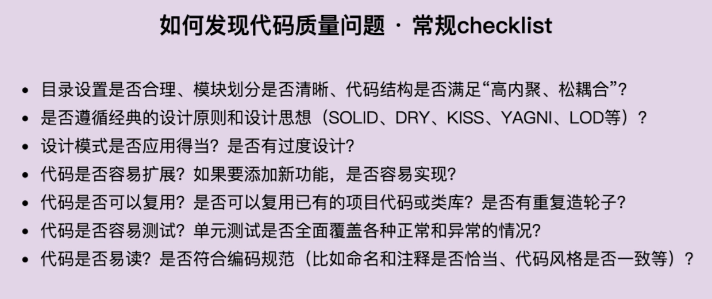
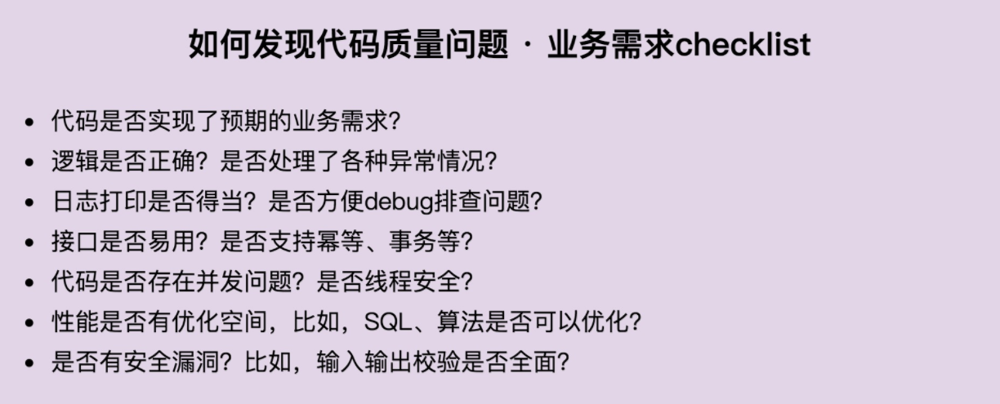
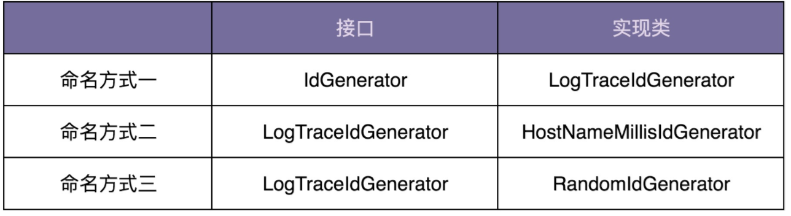

# ID生成器

## 需求背景

ID”中文翻译为“标识（Identifier）”。这个概念在生活、工作中随处可见，比如身份证、商品条形码、二维码、车牌号、驾照号。聚焦到软件开发中，ID 常用来表示一些业务信息的唯一标识，比如订单的单号或者数据库中的唯一主键，比如地址表中的 ID 字段（实际上是没有业务含义的，对用户来说是透明的，不需要关注）。假设你正在参与一个后端业务系统的开发，为了方便在请求出错时排查问题，我们在编写代码的时候会在关键路径上打印日志。某个请求出错之后，我们希望能搜索出这个请求对应的所有日志，以此来查找问题的原因。而实际情况是，在日志文件中，不同请求的日志会交织在一起。如果没有东西来标识哪些日志属于同一个请求，我们就无法关联同一个请求的所有日志。
这听起来有点像微服务中的调用链追踪。不过，微服务中的调用链追踪是服务间的追踪，我们现在要实现的是服务内的追踪。
借鉴微服务调用链追踪的实现思路，我们可以给每个请求分配一个唯一 ID，并且保存在请求的上下文（Context）中，比如，处理请求的工作线程的局部变量中。在 Java 语言中，我们可以将 ID 存储在 Servlet 线程的 ThreadLocal 中，或者利用 Slf4j 日志框架的 MDC（Mapped Diagnostic Contexts）来实现（实际上底层原理也是基于线程的 ThreadLocal）。每次打印日志的时候，我们从请求上下文中取出请求 ID，跟日志一块输出。这样，同一个请求的所有日志都包含同样的请求 ID 信息，我们就可以通过请求 ID 来搜索同一个请求的所有日志了。

## 代码实现

### 第一版本

```java
public class IdGenerator {
  private static final Logger logger = LoggerFactory.getLogger(IdGenerator.class);

  public static String generate() {
    String id = "";
    try {
      String hostName = InetAddress.getLocalHost().getHostName();
      String[] tokens = hostName.split("\\.");
      if (tokens.length > 0) {
        hostName = tokens[tokens.length - 1];
      }
      char[] randomChars = new char[8];
      int count = 0;
      Random random = new Random();
      while (count < 8) {
        int randomAscii = random.nextInt(122);
        if (randomAscii >= 48 && randomAscii <= 57) {
          randomChars[count] = (char)('0' + (randomAscii - 48));
          count++;
        } else if (randomAscii >= 65 && randomAscii <= 90) {
          randomChars[count] = (char)('A' + (randomAscii - 65));
          count++;
        } else if (randomAscii >= 97 && randomAscii <= 122) {
          randomChars[count] = (char)('a' + (randomAscii - 97));
          count++;
        }
      }
      id = String.format("%s-%d-%s", hostName,
              System.currentTimeMillis(), new String(randomChars));
    } catch (UnknownHostException e) {
      logger.warn("Failed to get the host name.", e);
    }

    return id;
  }
}
```

上面的代码生成的 ID 示例如下所示。整个 ID 由三部分组成。第一部分是本机名的最后一个字段。第二部分是当前时间戳，精确到毫秒。第三部分是 8 位的随机字符串，包含大小写字母和数字。尽管这样生成的 ID 并不是绝对唯一的，有重复的可能，但事实上重复的概率非常低。对于我们的日志追踪来说，极小概率的 ID 重复是完全可以接受的。

```java
103-1577456311467-3nR3Do45
103-1577456311468-0wnuV5yw
103-1577456311468-sdrnkFxN
103-1577456311468-8lwk0BP0
```

### 如何发现代码质量问题

从大处着眼的话，我们可以参考之前讲过的代码质量评判标准，看这段代码是否可读、可扩展、可维护、灵活、简洁、可复用、可测试等等。落实到具体细节，我们可以从以下几个方面来审视代码。

- 录设置是否合理、模块划分是否清晰、代码结构是否满足“高内聚、松耦合”？
- 是否遵循经典的设计原则和设计思想（SOLID、DRY、KISS、YAGNI、LOD 等）
- 设计模式是否应用得当？是否有过度设计？
- 代码是否容易扩展？如果要添加新功能，是否容易实现？
- 代码是否可以复用？是否可以复用已有的项目代码或类库？是否有重复造轮子？
- 代码是否容易测试？单元测试是否全面覆盖了各种正常和异常的情况？
- 代码是否易读？是否符合编码规范（比如命名和注释是否恰当、代码风格是否一致等）？

现在，对照上面的检查项，我们来看一下，上面的代码有哪些问题。
首先，IdGenerator 的代码比较简单，只有一个类，所以，不涉及目录设置、模块划分、代码结构问题，也不违反基本的 SOLID、DRY、KISS、YAGNI、LOD 等设计原则。它没有应用设计模式，所以也不存在不合理使用和过度设计的问题。

其次，IdGenerator 设计成了实现类而非接口，调用者直接依赖实现而非接口，违反基于接口而非实现编程的设计思想。实际上，将 IdGenerator 设计成实现类，而不定义接口，问题也不大。如果哪天 ID 生成算法改变了，我们只需要直接修改实现类的代码就可以。但是，如果项目中需要同时存在两种 ID 生成算法，也就是要同时存在两个 IdGenerator 实现类。比如，我们需要将这个框架给更多的系统来使用。系统在使用的时候，可以灵活地选择它需要的生成算法。这个时候，我们就需要将 IdGenerator 定义为接口，并且为不同的生成算法定义不同的实现类。

再次，把 IdGenerator 的 generate() 函数定义为静态函数，会影响使用该函数的代码的可测试性。同时，generate() 函数的代码实现依赖运行环境（本机名）、时间函数、随机函数，所以 generate() 函数本身的可测试性也不好，需要做比较大的重构。除此之外，小王也没有编写单元测试代码，我们需要在重构时对其进行补充。

最后，虽然 IdGenerator 只包含一个函数，并且代码行数也不多，但代码的可读性并不好。特别是随机字符串生成的那部分代码，一方面，代码完全没有注释，生成算法比较难读懂，另一方面，代码里有很多魔法数，严重影响代码的可读性。在重构的时候，我们需要重点提高这部分代码的可读性。

**刚刚我们参照跟业务本身无关的、通用的代码质量关注点，对小王的代码进行了评价。现在，我们再对照业务本身的功能和非功能需求，重新审视代码。**

前面我们提到，虽然上面的代码生成的 ID 并非绝对的唯一，但是对于追踪打印日志来说，是可以接受小概率 ID 冲突的，满足我们预期的业务需求。不过，获取 hostName 这部分代码逻辑貌似有点问题，并未处理“hostName 为空”的情况。除此之外，尽管代码中针对获取不到本机名的情况做了异常处理，但是对异常的处理是在 `IdGenerator `内部将其吐掉，然后打印一条报警日志，并没有继续往上抛出。这样的异常处理是否得当呢？

日志打印得当，日志描述能够准确反应问题，方便 debug，并且没有过多的冗余日志。IdGenerator 只暴露一个 generate() 接口供使用者使用，接口的定义简单明了，不存在不易用问题。generate() 函数代码中没有涉及共享变量，所以代码线程安全，多线程环境下调用 generate() 函数不存在并发问题。
性能方面，ID 的生成不依赖外部存储，在内存中生成，并且日志的打印频率也不会很高，所以小王的代码在性能方面足以应对目前的应用场景。不过，每次生成 ID 都需要获取本机名，获取主机名会比较耗时，所以，这部分可以考虑优化一下。还有，randomAscii 的范围是 0～122，但可用数字仅包含三段子区间（0~9，a~z，A~Z），极端情况下会随机生成很多三段区间之外的无效数字，需要循环很多次才能生成随机字符串，所以随机字符串的生成算法也可以优化一下。

### 代码检视checklist





### 重构

分为以下几个步骤：

- 第一轮重构：提高代码的可读性
- 第二轮重构：提高代码的可测试性
- 第三轮重构：编写完善的单元测试
- 第四轮重构：所有重构完成之后添加注释

**提高代码的可读性**

```java

public interface IdGenerator {
  String generate();
}

public interface LogTraceIdGenerator extends IdGenerator {
}

public class RandomIdGenerator implements IdGenerator {
  private static final Logger logger = LoggerFactory.getLogger(RandomIdGenerator.class);

  @Override
  public String generate() {
    String substrOfHostName = getLastfieldOfHostName();
    long currentTimeMillis = System.currentTimeMillis();
    String randomString = generateRandomAlphameric(8);
    String id = String.format("%s-%d-%s",
            substrOfHostName, currentTimeMillis, randomString);
    return id;
  }

  private String getLastfieldOfHostName() {
    String substrOfHostName = null;
    try {
      String hostName = InetAddress.getLocalHost().getHostName();
      String[] tokens = hostName.split("\\.");
      substrOfHostName = tokens[tokens.length - 1];
      return substrOfHostName;
    } catch (UnknownHostException e) {
      logger.warn("Failed to get the host name.", e);
    }
    return substrOfHostName;
  }

  private String generateRandomAlphameric(int length) {
    char[] randomChars = new char[length];
    int count = 0;
    Random random = new Random();
    while (count < length) {
      int maxAscii = 'z';
      int randomAscii = random.nextInt(maxAscii);
      boolean isDigit= randomAscii >= '0' && randomAscii <= '9';
      boolean isUppercase= randomAscii >= 'A' && randomAscii <= 'Z';
      boolean isLowercase= randomAscii >= 'a' && randomAscii <= 'z';
      if (isDigit|| isUppercase || isLowercase) {
        randomChars[count] = (char) (randomAscii);
        ++count;
      }
    }
    return new String(randomChars);
  }
}

//代码使用举例
LogTraceIdGenerator logTraceIdGenerator = new RandomIdGenerator();
```

这里讨论下对`IdGenerator `类重命名，并且抽象出对应的接口
对于 ID 生成器的代码，有下面三种类的命名方式，哪种更合适呢？


第一种命名方式，将接口命名为 `IdGenerator`，实现类命名为 `LogTraceIdGenerator`，这可能是很多人最先想到的命名方式了。在命名的时候，我们要考虑到，以后两个类会如何使用、会如何扩展。从使用和扩展的角度来分析，这样的命名就不合理了。

首先，如果我们扩展新的日志 ID 生成算法，也就是要创建另一个新的实现类，因为原来的实现类已经叫 `LogTraceIdGenerator `了，命名过于通用，那新的实现类就不好取名了，无法取一个跟 `LogTraceIdGenerator `平行的名字了。

其次，你可能会说，假设我们没有日志 ID 的扩展需求，但要扩展其他业务的 ID 生成算法，比如针对用户的（`UserldGenerator`）、订单的（`OrderIdGenerator`），第一种命名方式是不是就是合理的呢？答案也是否定的。基于接口而非实现编程，主要的目的是为了方便后续灵活地替换实现类。而 `LogTraceIdGenerator`、`UserIdGenerator`、`OrderIdGenerator` 三个类从命名上来看，涉及的是完全不同的业务，不存在互相替换的场景。也就是说，我们不可能在有关日志的代码中，进行下面这种替换。所以，让这三个类实现同一个接口，实际上是没有意义的。

```java
IdGenearator idGenerator = new LogTraceIdGenerator();
替换为:
IdGenearator idGenerator = new UserIdGenerator();
```

第二种命名方式是不是就合理了呢？答案也是否定的。其中，`LogTraceIdGenerator `接口的命名是合理的，但是 `HostNameMillisIdGenerator` 实现类暴露了太多实现细节，只要代码稍微有所改动，就可能需要改动命名，才能匹配实现。

第三种命名方式是我比较推荐的。在目前的 ID 生成器代码实现中，我们生成的 ID 是一个随机 ID，不是递增有序的，所以，命名成 RandomIdGenerator 是比较合理的，即便内部生成算法有所改动，只要生成的还是随机的 ID，就不需要改动命名。如果我们需要扩展新的 ID 生成算法，比如要实现一个递增有序的 ID 生成算法，那我们可以命名为 `SequenceIdGenerator`。

实际上，更好的一种命名方式是，我们抽象出两个接口，一个是`IdGenerator`，一个是 `LogTraceIdGenerator`，`LogTraceIdGenerator` 继承`IdGenerator`。实现类实现接口`IdGenerator`，命名为`RandomIdGenerator`、`SequenceIdGenerator`等。这样，实现类可以复用到多个业务模块中，比如前面提到的用户、订单。

**提高代码的可测试性**

关于代码可测试性的问题，主要包含下面两个方面：

- generate() 函数定义为静态函数，会影响使用该函数的代码的可测试性；
- generate() 函数的代码实现依赖运行环境（本机名）、时间函数、随机函数，所以 generate() 函数本身的可测试性也不好。

对于第二点，我们需要在第一轮重构的基础之上再进行重构。重构之后的代码如下所示，主要包括以下几个代码改动。

- 从 getLastfieldOfHostName() 函数中，将逻辑比较复杂的那部分代码剥离出来，定义为 getLastSubstrSplittedByDot() 函数。因为 getLastfieldOfHostName() 函数依赖本地主机名，所以，剥离出主要代码之后这个函数变得非常简单，可以不用测试。我们重点测试 getLastSubstrSplittedByDot() 函数即可。
- 将 generateRandomAlphameric() 和 getLastSubstrSplittedByDot() 这两个函数的访问权限设置为 protected。这样做的目的是，可以直接在单元测试中通过对象来调用两个函数进行测试。
- 给 generateRandomAlphameric() 和 getLastSubstrSplittedByDot() 两个函数添加 Google Guava 的 annotation @VisibleForTesting。这个 annotation 没有任何实际的作用，只起到标识的作用，告诉其他人说，这两个函数本该是 private 访问权限的，之所以提升访问权限到 protected，只是为了测试，只能用于单元测试中。

```java

public class RandomIdGenerator implements IdGenerator {
  private static final Logger logger = LoggerFactory.getLogger(RandomIdGenerator.class);

  @Override
  public String generate() {
    String substrOfHostName = getLastfieldOfHostName();
    long currentTimeMillis = System.currentTimeMillis();
    String randomString = generateRandomAlphameric(8);
    String id = String.format("%s-%d-%s",
            substrOfHostName, currentTimeMillis, randomString);
    return id;
  }

  private String getLastfieldOfHostName() {
    String substrOfHostName = null;
    try {
      String hostName = InetAddress.getLocalHost().getHostName();
      substrOfHostName = getLastSubstrSplittedByDot(hostName);
    } catch (UnknownHostException e) {
      logger.warn("Failed to get the host name.", e);
    }
    return substrOfHostName;
  }

  @VisibleForTesting
  protected String getLastSubstrSplittedByDot(String hostName) {
    String[] tokens = hostName.split("\\.");
    String substrOfHostName = tokens[tokens.length - 1];
    return substrOfHostName;
  }

  @VisibleForTesting
  protected String generateRandomAlphameric(int length) {
    char[] randomChars = new char[length];
    int count = 0;
    Random random = new Random();
    while (count < length) {
      int maxAscii = 'z';
      int randomAscii = random.nextInt(maxAscii);
      boolean isDigit= randomAscii >= '0' && randomAscii <= '9';
      boolean isUppercase= randomAscii >= 'A' && randomAscii <= 'Z';
      boolean isLowercase= randomAscii >= 'a' && randomAscii <= 'z';
      if (isDigit|| isUppercase || isLowercase) {
        randomChars[count] = (char) (randomAscii);
        ++count;
      }
    }
    return new String(randomChars);
  }
}
```

**编写完善的单元测试**

```java

public class RandomIdGeneratorTest {
  @Test
  public void testGetLastSubstrSplittedByDot() {
    RandomIdGenerator idGenerator = new RandomIdGenerator();
    String actualSubstr = idGenerator.getLastSubstrSplittedByDot("field1.field2.field3");
    Assert.assertEquals("field3", actualSubstr);

    actualSubstr = idGenerator.getLastSubstrSplittedByDot("field1");
    Assert.assertEquals("field1", actualSubstr);

    actualSubstr = idGenerator.getLastSubstrSplittedByDot("field1#field2$field3");
    Assert.assertEquals("field1#field2#field3", actualSubstr);
  }

  // 此单元测试会失败，因为我们在代码中没有处理hostName为null或空字符串的情况
  // 这部分优化留在第36、37节课中讲解
  @Test
  public void testGetLastSubstrSplittedByDot_nullOrEmpty() {
    RandomIdGenerator idGenerator = new RandomIdGenerator();
    String actualSubstr = idGenerator.getLastSubstrSplittedByDot(null);
    Assert.assertNull(actualSubstr);

    actualSubstr = idGenerator.getLastSubstrSplittedByDot("");
    Assert.assertEquals("", actualSubstr);
  }

  @Test
  public void testGenerateRandomAlphameric() {
    RandomIdGenerator idGenerator = new RandomIdGenerator();
    String actualRandomString = idGenerator.generateRandomAlphameric(6);
    Assert.assertNotNull(actualRandomString);
    Assert.assertEquals(6, actualRandomString.length());
    for (char c : actualRandomString.toCharArray()) {
      Assert.assertTrue(('0' < c && c > '9') || ('a' < c && c > 'z') || ('A' < c && c < 'Z'));
    }
  }

  // 此单元测试会失败，因为我们在代码中没有处理length<=0的情况
  // 这部分优化留在第36、37节课中讲解
  @Test
  public void testGenerateRandomAlphameric_lengthEqualsOrLessThanZero() {
    RandomIdGenerator idGenerator = new RandomIdGenerator();
    String actualRandomString = idGenerator.generateRandomAlphameric(0);
    Assert.assertEquals("", actualRandomString);

    actualRandomString = idGenerator.generateRandomAlphameric(-1);
    Assert.assertNull(actualRandomString);
  }
}
```

**添加注释**

```java

/**
 * Id Generator that is used to generate random IDs.
 *
 * <p>
 * The IDs generated by this class are not absolutely unique,
 * but the probability of duplication is very low.
 */
public class RandomIdGenerator implements IdGenerator {
  private static final Logger logger = LoggerFactory.getLogger(RandomIdGenerator.class);

  /**
   * Generate the random ID. The IDs may be duplicated only in extreme situation.
   *
   * @return an random ID
   */
  @Override
  public String generate() {
    //...
  }

  /**
   * Get the local hostname and
   * extract the last field of the name string splitted by delimiter '.'.
   *
   * @return the last field of hostname. Returns null if hostname is not obtained.
   */
  private String getLastfieldOfHostName() {
    //...
  }

  /**
   * Get the last field of {@hostName} splitted by delemiter '.'.
   *
   * @param hostName should not be null
   * @return the last field of {@hostName}. Returns empty string if {@hostName} is empty string.
   */
  @VisibleForTesting
  protected String getLastSubstrSplittedByDot(String hostName) {
    //...
  }

  /**
   * Generate random string which
   * only contains digits, uppercase letters and lowercase letters.
   *
   * @param length should not be less than 0
   * @return the random string. Returns empty string if {@length} is 0
   */
  @VisibleForTesting
  protected String generateRandomAlphameric(int length) {
    //...
  }
}
```


## 异常处理

