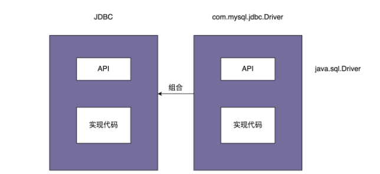
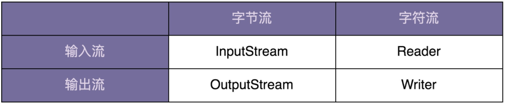
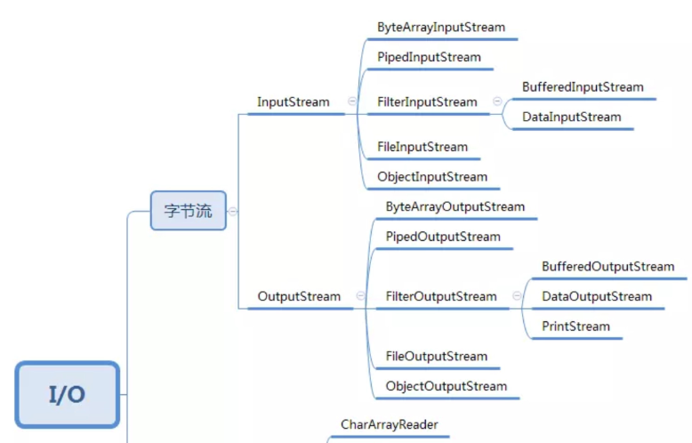
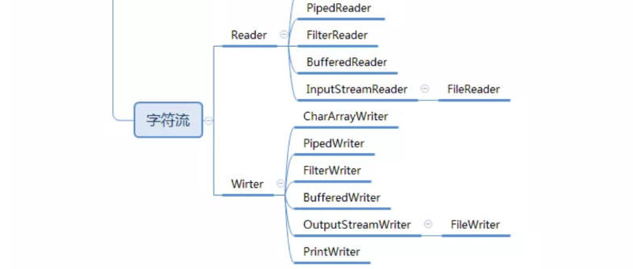

# 结构型模式

# 代理模式

代理模式（Proxy Design Pattern）在不改变原始类（或叫被代理类）代码的情况下，通过引入代理类来给原始类附加功能。

如前面提及到的性能计数器，当时我们开发了一个 `MetricsCollector `类，用来收集接口请求的原始数据，比如访问时间、处理时长等。在业务系统中，我们采用如下方式来使用这个 `MetricsCollector `类

```java

public class UserController {
  //...省略其他属性和方法...
  private MetricsCollector metricsCollector; // 依赖注入

  public UserVo login(String telephone, String password) {
    long startTimestamp = System.currentTimeMillis();

    // ... 省略login逻辑...
    long endTimeStamp = System.currentTimeMillis();
    long responseTime = endTimeStamp - startTimestamp;
    RequestInfo requestInfo = new RequestInfo("login", responseTime, startTimestamp);
    metricsCollector.recordRequest(requestInfo);
    //...返回UserVo数据...
  }

  public UserVo register(String telephone, String password) {
    long startTimestamp = System.currentTimeMillis();

    // ... 省略register逻辑...
    long endTimeStamp = System.currentTimeMillis();
    long responseTime = endTimeStamp - startTimestamp;
    RequestInfo requestInfo = new RequestInfo("register", responseTime, startTimestamp);
    metricsCollector.recordRequest(requestInfo);
    //...返回UserVo数据...
  }
}
```

很明显，上面的写法有两个问题。

第一，性能计数器框架代码侵入到业务代码中，跟业务代码高度耦合。如果未来需要替换这个框架，那替换的成本会比较大。

第二，收集接口请求的代码跟业务代码无关，本就不应该放到一个类中。业务类最好职责更加单一，只聚焦业务处理。为了将框架代码和业务代码解耦，代理模式就派上用场了。

**为了将框架代码和业务代码解耦，代理模式就派上用场了**。代理类 `UserControllerProxy `和原始类 `UserController `实现相同的接口 `IUserController`。`UserController` 类只负责业务功能。代理类 `UserControllerProxy` 负责在业务代码执行前后附加其他逻辑代码，并通过委托的方式调用原始类来执行业务代码

## 实现相同的接口

```java
public class UserControllerProxy implements IUserController {
    private MetricsCollector metricsCollector;
    private UserController userController;

    public UserControllerProxy(UserController userController, MetricsCollector metricsCollector) {
        this.userController = userController;
        this.metricsCollector = metricsCollector;
    }

    @Override
    public UserVo login(String telephone, String password) {
        long startTimestamp = System.currentTimeMillis();
        // 委托
        UserVo userVo = userController.login(telephone, password);
        long endTimeStamp = System.currentTimeMillis();
        long responseTime = endTimeStamp - startTimestamp;
        RequestInfo requestInfo = new RequestInfo("login", responseTime, startTimestamp);
        metricsCollector.recordRequest(requestInfo);
        return userVo;
    }

    @Override
    public UserVo register(String telephone, String password) {
        long startTimestamp = System.currentTimeMillis();
        UserVo userVo = userController.register(telephone, password);
        long endTimeStamp = System.currentTimeMillis();
        long responseTime = endTimeStamp - startTimestamp;
        RequestInfo requestInfo = new RequestInfo("register", responseTime, startTimestamp);
        metricsCollector.recordRequest(requestInfo);
        return userVo;
    }
}
//UserControllerProxy使用举例
//因为原始类和代理类实现相同的接口，是基于接口而非实现编程//将UserController类对象替换为UserControllerProxy类/对象，不需要改动太多代码
class Application{
    public static void main(String[] args) {
        IUserController userController =
                new UserControllerProxy(new UserController(),new MetricsCollector() )
    }
}
```

## 使用继承的方式

参照基于接口而非实现编程的设计思想，将原始类对象替换为代理类对象的时候，为了让代码改动尽量少，在刚刚的代理模式的代码实现中，代理类和原始类需要实现相同的接口。但是，如果原始类并没有定义接口，并且原始类代码并不是我们开发维护的（比如它来自一个第三方的类库），我们也没办法直接修改原始类，给它重新定义一个接口。在这种情况下，我们该如何实现代理模式呢？

```java

public class UserControllerProxy extends UserController {
  private MetricsCollector metricsCollector;
  public UserControllerProxy() {
    this.metricsCollector = new MetricsCollector();
  }
  public UserVo login(String telephone, String password) {
    long startTimestamp = System.currentTimeMillis();
    UserVo userVo = super.login(telephone, password);
    long endTimeStamp = System.currentTimeMillis();
    long responseTime = endTimeStamp - startTimestamp;
    RequestInfo requestInfo = new RequestInfo("login", responseTime, startTimestamp);
    metricsCollector.recordRequest(requestInfo);
    return userVo;
  }
  public UserVo register(String telephone, String password) {
    long startTimestamp = System.currentTimeMillis();
    UserVo userVo = super.register(telephone, password);
    long endTimeStamp = System.currentTimeMillis();
    long responseTime = endTimeStamp - startTimestamp;
    RequestInfo requestInfo = new RequestInfo("register", responseTime, startTimestamp);
    metricsCollector.recordRequest(requestInfo);
    return userVo;
  }
}
//UserControllerProxy使用举例
UserController userController = new UserControllerProxy();
```

## 动态代理

按照上面的方式，如如果有 50 个要添加附加功能的原始类，那我们就要创建 50 个对应的代理类。这会导致项目中类的个数成倍增加，增加了代码维护成本。这时候就可以用上动态代理了。

所谓动态代理（`Dynamic Proxy`），就是我们不事先为每个原始类编写代理类，而是在运行的时候，动态地创建原始类对应的代理类，然后在系统中用代理类替换掉原始类

```java
public class MetricsCollectorProxy {
    private MetricsCollector metricsCollector;

    public MetricsCollectorProxy(MetricsCollector metricsCollector) {
        this.metricsCollector = metricsCollector;
    }

    public Object createProxy(Object proxiedObject) {
        Class<?>[] interfaces = proxiedObject.getClass().getInterfaces();
        DynamicProxyHandler handler = new DynamicProxyHandler(proxiedObject);
        return Proxy.newProxyInstance(proxiedObject.getClass().getClassLoader(), interfaces, handler);

    }

    private class DynamicProxyHandler implements InvocationHandler {
        private Object proxiedObject;

        public DynamicProxyHandler(Object proxiedObject) {
            this.proxiedObject = proxiedObject;
        }

        @Override
        public Object invoke(Object proxy, Method method, Object[] args) throws Throwable {
            long startTimestamp = System.currentTimeMillis();
            Object result = method.invoke(proxiedObject, args);
            long endTimeStamp = System.currentTimeMillis();
            long responseTime = endTimeStamp - startTimestamp;
            String apiName = proxiedObject.getClass().getName() + ":" + method.getName();
            RequestInfo requestInfo = new RequestInfo(apiName, responseTime, startTimestamp);
            metricsCollector.recordRequest(requestInfo);
            return result;
        }
    }
}
class Client{
    public static void main(String[] args) {
        MetricsCollectorProxy proxy = new MetricsCollectorProxy();
        IUserController userController = (IUserController) proxy.createProxy(new UserController());
    }
}
```

## 应用场景

代理模式常用在业务系统中开发一些非功能性需求，比如：监控、统计、鉴权、限流、事务、幂等、日志。我们将这些附加功能与业务功能解耦，放到代理类统一处理，让程序员只需要关注业务方面的开发。除此之外，代理模式还可以用在 RPC、缓存等应用场景中


# 桥接模式

## 概念

定义：

> Decouple an abstraction from its implementation so that the two can vary independently。

**将抽象和实现解耦，让他们可以独立变化。**

结合`jdbc`的使用理解这段话：

```java
public class Application {
    public static void main(String[] args) throws ClassNotFoundException, SQLException {
        Class.forName("com.mysql.cj.jdbc");
        String url = "jdbc:mysql://localhost:3306/sample_db";
        Connection conn = DriverManager.getConnection(url,"user","password");
        Statement stmt = conn.createStatement();
        String query = "SELECT * FROM test";
        ResultSet result = stmt.executeQuery(query);
        while (result.next()) {
            result.getString(1);
            result.getInt(2);
        }
    }
}
```

如果我们想要把 MySQL 数据库换成 Oracle 数据库，只需要把第一行代码中的 `com.mysql.jdbc.Driver` 换成 `oracle.jdbc.driver.OracleDriver` 就可以了。当然，也有更灵活的实现方式，我们可以把需要加载的 `Driver` 类写到配置文件中，当程序启动的时候，自动从配置文件中加载，这样在切换数据库的时候，我们都不需要修改代码，只需要修改配置文件就可以了。

看`com.mysql.jdbc.Driver`的源码：

```java
public class Driver extends NonRegisteringDriver implements java.sql.Driver {
    public Driver() throws SQLException {
    }
    static {
        try {
            DriverManager.registerDriver(new Driver());
        } catch (SQLException var1) {
            throw new RuntimeException("Can't register driver!");
        }
    }
}
```

当执行 `Class.forName(“com.mysql.jdbc.Driver”) `这条语句的时候，实际上是做了两件事情。第一件事情是要求 JVM 查找并加载指定的 Driver 类，第二件事情是执行该类的静态代码，也就是将 `MySQL Driver `注册到 `DriverManager` 类中。

```java

public class DriverManager {
  private final static CopyOnWriteArrayList<DriverInfo> registeredDrivers = new CopyOnWriteArrayList<DriverInfo>();
  //...
  static {
    loadInitialDrivers();
    println("JDBC DriverManager initialized");
  }
  //...
  public static synchronized void registerDriver(java.sql.Driver driver) throws SQLException {
    if (driver != null) {
      registeredDrivers.addIfAbsent(new DriverInfo(driver));
    } else {
      throw new NullPointerException();
    }
  }

  public static Connection getConnection(String url, String user, String password) throws SQLException {
    java.util.Properties info = new java.util.Properties();
    if (user != null) {
      info.put("user", user);
    }
    if (password != null) {
      info.put("password", password);
    }
    return (getConnection(url, info, Reflection.getCallerClass()));
  }
  //...
}
```

当我们把具体的 `Driver` 实现类（比如，`com.mysql.jdbc.Driver`）注册到 `DriverManager `之后，后续所有对 `JDBC` 接口的调用，都会委派到对具体的 `Driver `实现类来执行。而 `Driver `实现类都实现了相同的接口（`java.sql.Driver `），这也是可以灵活切换 `Driver`的原因

桥接模式的定义是“将抽象和实现解耦，让它们可以独立变化”,实际上，JDBC 本身就相当于“抽象”。注意，这里所说的“抽象”，指的并非“抽象类”或“接口”，而是跟具体的数据库无关的、被抽象出来的一套“类库”。具体的 `Driver`（比如，`com.mysql.jdbc.Driver`）就相当于“实现”。注意，这里所说的“实现”，也并非指“接口的实现类”，而是跟具体数据库相关的一套“类库”。JDBC 和 Driver 独立开发，通过对象之间的组合关系，组装在一起。JDBC 的所有逻辑操作，最终都委托给 Driver 来执行。



## API接口监控告警

背景：根据不同的告警规则，触发不同类型的告警。告警支持多种通知渠道，包括：邮件、短信、微信、自动语音电话。通知的紧急程度有多种类型，包括：SEVERE（严重）、URGENCY（紧急）、NORMAL（普通）、TRIVIAL（无关紧要）。不同的紧急程度对应不同的通知渠道。比如，SERVE（严重）级别的消息会通过“自动语音电话”告知相关人员。

第一版本：

```java
public enum NotificationEmergencyLevel {
    URGENCY, SEVERE, NORMAL, TRIVIAL
}
public class Notification2 {
    private List<String> emailAddress;
    private List<String> telephones;
    private List<String> wechatIds;

    public void setEmailAddress(List<String> emailAddress) {
        this.emailAddress = emailAddress;
    }
    public void setTelephones(List<String> telephones) {
        this.telephones = telephones;
    }
    public void setWechatIds(List<String> wechatIds) {
        this.wechatIds = wechatIds;
    }
    public void notify(NotificationEmergencyLevel level, String message) {
        if (level.equals(NotificationEmergencyLevel.SEVERE)) {
            // 自动语音电话
        } else if (level.equals(NotificationEmergencyLevel.URGENCY)) {
            // 发微信
        } else if (level.equals(NotificationEmergencyLevel.NORMAL)) {
            // 发邮件
        } else if (level.equals(NotificationEmergencyLevel.TRIVIAL)) {
            // 发邮件
        }

    }
}
public class Alert2 {
    private AlertRule rule;
    private Notification2 notification;

    public Alert2(AlertRule rule, Notification2 notification) {
        this.rule = rule;
        this.notification = notification;
    }

    public void check(String api,
                      long requestCount, long errorCount,
                      long durationOfSeconds,
                      long timeoutCount) {
        long tps = requestCount / durationOfSeconds;
        if (tps > rule.getMatchedRule(api).getMaxTips()) {
            notification.notify(NotificationEmergencyLevel.URGENCY,"...");
        }
        if (errorCount > rule.getMatchedRule(api).getMaxErrorCount()) {
            notification.notify(NotificationEmergencyLevel.SEVERE,"...");
        }
        long timeoutTps = timeoutCount / durationOfSeconds;
        if (timeoutTps > rule.getMatchedRule(api).getMaxTimeoutTips()) {
            notification.notify(NotificationEmergencyLevel.URGENCY,"");
        }
    }
}

```

以上为最简单实现，当需要添加新的功能时，如：当每秒钟接口超时请求个数，超过某个预先设置的最大阈值时，我们也要触发告警发送通知。那么`Alert`类就要发生修改(增加入参跟接口超时处理逻辑)

重构一：

```java
public class Alert {
    private List<AlertHandler> handlerList = new ArrayList<>();

    public void addAlertHandler(AlertHandler handler) {
        this.handlerList.add(handler);
    }

    public void check(ApiStatInfo info) {
        for (AlertHandler handler : handlerList) {
            handler.check(info);
        }
    }
}
@Setter
@Getter
public class ApiStatInfo {
    private String api;
    private long requestCount;
    private long errorCount;
    private long durationOfSeconds;
}
public abstract class AlertHandler {
    protected AlertRule rule;
    protected Notification2 notification;

    public AlertHandler(AlertRule rule, Notification2 notification) {
        this.rule = rule;
        this.notification = notification;
    }

    public abstract void check(ApiStatInfo apiStatInfo);
}

public class TpsAlertHandler extends AlertHandler {
    public TpsAlertHandler(AlertRule rule, Notification2 notification) {
        super(rule, notification);
    }

    @Override
    public void check(ApiStatInfo apiStatInfo) {
        long tps = apiStatInfo.getRequestCount() / apiStatInfo.getDurationOfSeconds();
        if (tps > rule.getMatchedRule(apiStatInfo.getApi()).getMaxTips()) {
            notification.notify(NotificationEmergencyLevel.URGENCY, "...");
        }
    }
}
public class ErrorAlertHandler extends AlertHandler {
    public ErrorAlertHandler(AlertRule rule, Notification2 notification) {
        super(rule, notification);
    }

    @Override
    public void check(ApiStatInfo apiStatInfo) {
        if (apiStatInfo.getErrorCount() > rule.getMatchedRule(apiStatInfo.getApi()).getMaxErrorCount()) {
            notification.notify(NotificationEmergencyLevel.SEVERE, "...");
        }
    }
}

public class Notification2 {
    private List<String> emailAddress;
    private List<String> telephones;
    private List<String> wechatIds;

    public void setEmailAddress(List<String> emailAddress) {
        this.emailAddress = emailAddress;
    }

    public void setTelephones(List<String> telephones) {
        this.telephones = telephones;
    }

    public void setWechatIds(List<String> wechatIds) {
        this.wechatIds = wechatIds;
    }

    public void notify(NotificationEmergencyLevel level, String message) {
        if (level.equals(NotificationEmergencyLevel.SEVERE)) {
            // 自动语音电话
        } else if (level.equals(NotificationEmergencyLevel.URGENCY)) {
            // 发微信
        } else if (level.equals(NotificationEmergencyLevel.NORMAL)) {
            // 发邮件
        } else if (level.equals(NotificationEmergencyLevel.TRIVIAL)) {
            // 发邮件
        }
    }
}

public class ApplicationContext {
    private AlertRule rule;
    private Notification2 notification;
    private Alert alert;

    public void initializeBeans() {
        rule = new AlertRule();
        notification = new Notification2();
        alert = new Alert();
        alert.addAlertHandler(new TpsAlertHandler(rule, notification));
        alert.addAlertHandler(new ErrorAlertHandler(rule, notification));
    }

    public Alert getAlert() {
        return alert;
    }

    private static final ApplicationContext INSTANCE = new ApplicationContext();

    private ApplicationContext() {
        initializeBeans();
    }

    public static ApplicationContext getInstance() {
        return INSTANCE;
    }

}
class Demo {
    public static void main(String[] args) {
        ApiStatInfo info = new ApiStatInfo();
        // 设置属性值
        ApplicationContext.getInstance().getAlert().check(info);
    }
}

```

重构二：使用桥接模式

`Notification `类的代码实现有一个最明显的问题，那就是有很多 if-else 分支逻辑。实际上，如果每个分支中的代码都不复杂，后期也没有无限膨胀的可能（增加更多 if-else 分支判断），那这样的设计问题并不大，没必要非得一定要摒弃 if-else 分支逻辑。不过，`Notification `的代码显然不符合这个条件。因为每个 if-else 分支中的代码逻辑都比较复杂，发送通知的所有逻辑都扎堆在 `Notification `类中。我们知道，类的代码越多，就越难读懂，越难修改，维护的成本也就越高。很多设计模式都是试图将庞大的类拆分成更细小的类，然后再通过某种更合理的结构组装在一起。

针对 `Notification` 的代码，我们将不同渠道的发送逻辑剥离出来，形成独立的消息发送类（`MsgSender `相关类）。其中，`Notification` 类相当于抽象，`MsgSender` 类相当于实现，两者可以独立开发，通过组合关系（也就是桥梁）任意组合在一起。所谓任意组合的意思就是，不同紧急程度的消息和发送渠道之间的对应关系，不是在代码中固定写死的，我们可以动态地去指定（比如，通过读取配置来获取对应关系）。

```java
public interface MsgSender {
    void send(String message);
}
public class EmailMsgSender implements MsgSender {
    private List<String> emails;
    public EmailMsgSender(List<String> emails) {
        this.emails = emails;
    }
    @Override
    public void send(String message) {
    }
}
public class WechatMsgSender implements MsgSender {
    private List<String> wechats;
    public WechatMsgSender(List<String> wechats) {
        this.wechats = wechats;
    }
    @Override
    public void send(String message) {
    }
}
public abstract class Notification {
    protected MsgSender msgSender;
    public Notification(MsgSender msgSender) {
        this.msgSender = msgSender;
    }
    public abstract void notify(String message);
}
public abstract class Notification {
    protected MsgSender msgSender;
    public Notification(MsgSender msgSender) {
        this.msgSender = msgSender;
    }
    public abstract void notify(String message);
}
public class NormalNotification extends Notification {
    public NormalNotification(MsgSender msgSender) {
        super(msgSender);
    }
    @Override
    public void notify(String message) {
        msgSender.send(message);
    }
}
public class SevereNotification extends Notification {
    public SevereNotification(MsgSender msgSender) {
        super(msgSender);
    }
    @Override
    public void notify(String message) {
        msgSender.send(message);
    }
}
public class TrivialNotification extends Notification {
    public TrivialNotification(MsgSender msgSender) {
        super(msgSender);
    }
    @Override
    public void notify(String message) {
        msgSender.send(message);
    }
}
public class UrgencyNotification extends Notification {
    public UrgencyNotification(MsgSender msgSender) {
        super(msgSender);
    }
    @Override
    public void notify(String message) {
        msgSender.send(message);
    }
}

public class TpsAlertHandler extends AlertHandler {
    public TpsAlertHandler(AlertRule rule, Notification notification) {
        super(rule, notification);
    }

    @Override
    public void check(ApiStatInfo apiStatInfo) {
        long tps = apiStatInfo.getRequestCount() / apiStatInfo.getDurationOfSeconds();
        if (tps > rule.getMatchedRule(apiStatInfo.getApi()).getMaxTips()) {
            notification.notify( "...");
        }
    }
}
public class ErrorAlertHandler extends AlertHandler {
    public ErrorAlertHandler(AlertRule rule,Notification notification) {
        super(rule,notification);
    }

    @Override
    public void check(ApiStatInfo apiStatInfo) {
        if (apiStatInfo.getErrorCount() > rule.getMatchedRule(apiStatInfo.getApi()).getMaxErrorCount()) {
            notification.notify( "...");
        }
    }
}
public class ApplicationContext {
    private AlertRule rule;
    private Alert alert;

    public void initializeBeans() {
        rule = new AlertRule();
        MsgSender telephone = new TelephoneMsgSender(new ArrayList<>());
        Notification severe = new SevereNotification(telephone);
        EmailMsgSender emailMsgSender = new EmailMsgSender(new ArrayList<>());
        NormalNotification normal = new NormalNotification(emailMsgSender);
        alert = new Alert();
        alert.addAlertHandler(new TpsAlertHandler(rule, normal));
        alert.addAlertHandler(new ErrorAlertHandler(rule, severe));
    }

    public Alert getAlert() {
        return alert;
    }

    private static final ApplicationContext INSTANCE = new ApplicationContext();

    private ApplicationContext() {
        initializeBeans();
    }

    public static ApplicationContext getInstance() {
        return INSTANCE;
    }

}
```


# 装饰器模式

## Java IO类

我们可以从下面两个维度将它划分为四类：



Java IO 又在这四个父类基础之上，扩展出了很多子类:



  使用示范：

```java

InputStream in = new FileInputStream("/user/wangzheng/test.txt");
InputStream bin = new BufferedInputStream(in);
byte[] data = new byte[128];
while (bin.read(data) != -1) {
  //...
}
```

## 基于继承的方案

如上述示范，Java IO 为什么不设计一个继承 `FileInputStream `并且支持缓存的 `BufferedFileInputStream `类呢？这样我们就可以像下面的代码中这样，直接创建一个 `BufferedFileInputStream` 类对象，打开文件读取数据，用起来岂不是更加简单？

```java

InputStream bin = new BufferedFileInputStream("/user/wangzheng/test.txt");
byte[] data = new byte[128];
while (bin.read(data) != -1) {
  //...
}
```

如果 `InputStream` 只有一个子类 `FileInputStream` 的话，那我们在 `FileInputStream` 基础之上，再设计一个孙子类 `BufferedFileInputStream`，也算是可以接受的，毕竟继承结构还算简单。但实际上，继承 `InputStream` 的子类有很多。我们需要给每一个 `InputStream `的子类，再继续派生支持缓存读取的子类。如果需要的功能越来越多，类也越来越多。类继承结构变得无比复杂，代码既不好扩展，也不好维护。


## 基于装饰器模式

`InputStream`

```java
public abstract class InputStream implements Closeable {
    private static final int MAX_SKIP_BUFFER_SIZE = 2048;

    public abstract int read() throws IOException;

    public int read(byte b[]) throws IOException {
        return read(b, 0, b.length);
    }
    
    public int read(byte b[], int off, int len) throws IOException {
        if (b == null) {
            throw new NullPointerException();
        } else if (off < 0 || len < 0 || len > b.length - off) {
            throw new IndexOutOfBoundsException();
        } else if (len == 0) {
            return 0;
        }
        int c = read(); // 这里由子类实现
        if (c == -1) {
            return -1;
        }
        b[off] = (byte)c;
        int i = 1;
        try {
            for (; i < len ; i++) {
                c = read();
                if (c == -1) {
                    break;
                }
                b[off + i] = (byte)c;
            }
        } catch (IOException ee) {
        }
        return i;
    }

    public long skip(long n) throws IOException {
      // ...
    }
    public int available() throws IOException {
        return 0;
    }

    public void close() throws IOException {}

    public synchronized void mark(int readlimit) {}

    
    public synchronized void reset() throws IOException {
        throw new IOException("mark/reset not supported");
    }
    public boolean markSupported() {
        return false;
    }

}
```

`FilterInputStream`

```java
public class FilterInputStream extends InputStream {
   
    protected volatile InputStream in;

    protected FilterInputStream(InputStream in) {
        this.in = in;
    }

    public int read() throws IOException {
        return in.read();
    }

    public int read(byte b[]) throws IOException {
        return read(b, 0, b.length);
    }

    public int read(byte b[], int off, int len) throws IOException {
        return in.read(b, off, len);
    }

    public long skip(long n) throws IOException {
        return in.skip(n);
    }
    public int available() throws IOException {
        return in.available();
    }

    public void close() throws IOException {
        in.close();
    }
    public synchronized void mark(int readlimit) {
        in.mark(readlimit);
    }

    public synchronized void reset() throws IOException {
        in.reset();
    }
    public boolean markSupported() {
        return in.markSupported();
    }
}

```

`BufferedInputStream`

```java
public class BufferedInputStream extends FilterInputStream {
    private static int DEFAULT_BUFFER_SIZE = 8192;
    
    private static int MAX_BUFFER_SIZE = Integer.MAX_VALUE - 8;

    protected volatile byte buf[];

    
    private static final
        AtomicReferenceFieldUpdater<BufferedInputStream, byte[]> bufUpdater =
        AtomicReferenceFieldUpdater.newUpdater
        (BufferedInputStream.class,  byte[].class, "buf");

    protected int count;

    protected int pos;

    protected int markpos = -1;

    protected int marklimit;

    private InputStream getInIfOpen() throws IOException {
        InputStream input = in;
        if (input == null)
            throw new IOException("Stream closed");
        return input;
    }

   
    private byte[] getBufIfOpen() throws IOException {
        byte[] buffer = buf;
        if (buffer == null)
            throw new IOException("Stream closed");
        return buffer;
    }

   
    public BufferedInputStream(InputStream in) {
        this(in, DEFAULT_BUFFER_SIZE);
    }

    public BufferedInputStream(InputStream in, int size) {
        super(in);
        if (size <= 0) {
            throw new IllegalArgumentException("Buffer size <= 0");
        }
        buf = new byte[size];
    }

    private void fill() throws IOException {
        // ..
    }

    
    public synchronized int read() throws IOException {
        if (pos >= count) {
            fill();
            if (pos >= count)
                return -1;
        }
        return getBufIfOpen()[pos++] & 0xff;
    }

    private int read1(byte[] b, int off, int len) throws IOException {
        int avail = count - pos;
        if (avail <= 0) {
           
            if (len >= getBufIfOpen().length && markpos < 0) {
                return getInIfOpen().read(b, off, len);
            }
            fill();
            avail = count - pos;
            if (avail <= 0) return -1;
        }
        int cnt = (avail < len) ? avail : len;
        System.arraycopy(getBufIfOpen(), pos, b, off, cnt);
        pos += cnt;
        return cnt;
    }

    public synchronized int read(byte b[], int off, int len)
        throws IOException
    {
        getBufIfOpen(); // Check for closed stream
        if ((off | len | (off + len) | (b.length - (off + len))) < 0) {
            throw new IndexOutOfBoundsException();
        } else if (len == 0) {
            return 0;
        }

        int n = 0;
        for (;;) {
            int nread = read1(b, off + n, len - n);
            if (nread <= 0)
                return (n == 0) ? nread : n;
            n += nread;
            if (n >= len)
                return n;
            // if not closed but no bytes available, return
            InputStream input = in;
            if (input != null && input.available() <= 0)
                return n;
        }
    }
    public synchronized long skip(long n) throws IOException {
      // ...
    }

    public synchronized int available() throws IOException {
        int n = count - pos;
        int avail = getInIfOpen().available();
        return n > (Integer.MAX_VALUE - avail)
                    ? Integer.MAX_VALUE
                    : n + avail;
    }
    public synchronized void mark(int readlimit) {
        marklimit = readlimit;
        markpos = pos;
    }
    public synchronized void reset() throws IOException {
        getBufIfOpen(); // Cause exception if closed
        if (markpos < 0)
            throw new IOException("Resetting to invalid mark");
        pos = markpos;
    }
    public boolean markSupported() {
        return true;
    }
    public void close() throws IOException {
        // ...
    }
}
```

`IO`的装饰者模式有两个特点

特点一：**装饰器类和原始类继承同样的父类，这样我们可以对原始类“嵌套”多个装饰器类**。

比如，下面这样一段代码，我们对 `FileInputStream` 嵌套了两个装饰器类：`BufferedInputStream `和 `DataInputStream`，让它既支持缓存读取，又支持按照基本数据类型来读取数据。

```java

InputStream in = new FileInputStream("/user/wangzheng/test.txt");
InputStream bin = new BufferedInputStream(in);
DataInputStream din = new DataInputStream(bin);
int data = din.readInt();
```

特点二：**装饰器类是对功能的增强，这也是装饰器模式应用场景的一个重要特点**

实际上，符合“组合关系”这种代码结构的设计模式有很多，比如之前讲过的代理模式、桥接模式，还有现在的装饰器模式。尽管它们的代码结构很相似，**但是每种设计模式的意图是不同的**。就拿比较相似的代理模式和装饰器模式来说吧，**代理模式中，代理类附加的是跟原始类无关的功能，而在装饰器模式中，装饰器类附加的是跟原始类相关的增强功能**

```java

// 代理模式的代码结构(下面的接口也可以替换成抽象类)
public interface IA {
  void f();
}
public class A impelements IA {
  public void f() { //... }
}
public class AProxy impements IA {
  private IA a;
  public AProxy(IA a) {
    this.a = a;
  }
  
  public void f() {
    // 新添加的代理逻辑
    a.f();
    // 新添加的代理逻辑
  }
}

// 装饰器模式的代码结构(下面的接口也可以替换成抽象类)
public interface IA {
  void f();
}
public class A impelements IA {
  public void f() { //... }
}
public class ADecorator impements IA {
  private IA a;
  public ADecorator(IA a) {
    this.a = a;
  }
  
  public void f() {
    // 功能增强代码
    a.f();
    // 功能增强代码
  }
}
```

引入``FilterInputStream``的设计意图：

我们再重新来看一下 `BufferedInputStream `类的代码。`InputStream `是一个抽象类而非接口，而且它的大部分函数（比如 read()、available()）都有默认实现，按理来说，我们只需要在 `BufferedInputStream `类中重新实现那些需要增加缓存功能的函数就可以了，其他函数继承 `InputStream` 的默认实现。但实际上，这样做是行不通的。

对于即便是不需要增加缓存功能的函数来说，`BufferedInputStream `还是必须把它重新实现一遍，简单包裹对 `InputStream `对象的函数调用。具体的代码示例如下所示。如果不重新实现，那 `BufferedInputStream `类就无法将最终读取数据的任务，**委托给传递进来的 `InputStream` 对象来完成**

实际上，`DataInputStream `也存在跟 `BufferedInputStream `同样的问题。**为了避免代码重复，Java IO 抽象出了一个装饰器父类 `FilterInputStream`**，代码实现如下所示。`InputStream `的所有的装饰器类（`BufferedInputStream`、`DataInputStream`）都继承自这个装饰器父类。这样，装饰器类只需要实现它需要增强的方法就可以了，其他方法继承装饰器父类的默认实现。


## Collections 类中的应用

`Collections`类是一个集合容器的工具类，提供了很多静态方法，用来创建各种集合容器，比如通过 `unmodifiableColletion()` 静态方法，来创建 `UnmodifiableCollection `类对象。而这些容器类中的 `UnmodifiableCollection` 类就是针对 `Collection `类的装饰器类。

```java

public class Collections {
  private Collections() {}
    
  public static <T> Collection<T> unmodifiableCollection(Collection<? extends T> c) {
    return new UnmodifiableCollection<>(c);
  }

  static class UnmodifiableCollection<E> implements Collection<E>,   Serializable {
    private static final long serialVersionUID = 1820017752578914078L;
    final Collection<? extends E> c;

    UnmodifiableCollection(Collection<? extends E> c) {
      if (c==null)
        throw new NullPointerException();
      this.c = c;
    }

    public int size()                   {return c.size();}
    public boolean isEmpty()            {return c.isEmpty();}
    public boolean contains(Object o)   {return c.contains(o);}
    public Object[] toArray()           {return c.toArray();}
    public <T> T[] toArray(T[] a)       {return c.toArray(a);}
    public String toString()            {return c.toString();}

    public Iterator<E> iterator() {
      return new Iterator<E>() {
        private final Iterator<? extends E> i = c.iterator();

        public boolean hasNext() {return i.hasNext();}
        public E next()          {return i.next();}
        public void remove() {
          throw new UnsupportedOperationException();
        }
        @Override
        public void forEachRemaining(Consumer<? super E> action) {
          // Use backing collection version
          i.forEachRemaining(action);
        }
      };
    }

    public boolean add(E e) {
      throw new UnsupportedOperationException();
    }
    public boolean remove(Object o) {
       hrow new UnsupportedOperationException();
    }
    public boolean containsAll(Collection<?> coll) {
      return c.containsAll(coll);
    }
    public boolean addAll(Collection<? extends E> coll) {
      throw new UnsupportedOperationException();
    }
    public boolean removeAll(Collection<?> coll) {
      throw new UnsupportedOperationException();
    }
    public boolean retainAll(Collection<?> coll) {
      throw new UnsupportedOperationException();
    }
    public void clear() {
      throw new UnsupportedOperationException();
    }

    // Override default methods in Collection
    @Override
    public void forEach(Consumer<? super E> action) {
      c.forEach(action);
    }
    @Override
    public boolean removeIf(Predicate<? super E> filter) {
      throw new UnsupportedOperationException();
    }
    @SuppressWarnings("unchecked")
    @Override
    public Spliterator<E> spliterator() {
      return (Spliterator<E>)c.spliterator();
    }
    @SuppressWarnings("unchecked")
    @Override
    public Stream<E> stream() {
      return (Stream<E>)c.stream();
    }
    @SuppressWarnings("unchecked")
    @Override
    public Stream<E> parallelStream() {
      return (Stream<E>)c.parallelStream();
    }
  }
}
```

我们前面讲过，装饰器模式中的装饰器类是对原始类功能的增强。尽管 `UnmodifiableCollection `类可以算是对 `Collection` 类的一种功能增强。

实际上，最关键的一点是，`UnmodifiableCollection `的构造函数接收一个 `Collection `类对象，然后对其所有的函数进行了包裹（`Wrap`）：重新实现（比如 `add()` 函数）或者简单封装（比如 `stream()` 函数）。而简单的接口实现或者继承，并不会如此来实现 `UnmodifiableCollection` 类。所以，从代码实现的角度来说，`UnmodifiableCollection `类是典型的装饰器类。

# 适配器模式

## 原理与实现

适配器模式的英文翻译是 Adapter Design Pattern。顾名思义，这个模式就是用来做适配的，它将不兼容的接口转换为可兼容的接口，让原本由于接口不兼容而不能一起工作的类可以一起工作

适配器模式有两种实现方式：**类适配器和对象适配器。其中，类适配器使用继承关系来实现，对象适配器使用组合关系来实现。**

类适配器：

```java
public interface ITarget {
    void f();
    void f2();
    void fc();
}
public class Adaptee {
    public void fa() {
    }
    public void fb() {
    }
    public void fc() {
    }
}
public class Adaptor extends Adaptee implements ITarget {
    @Override
    public void f() {
        super.fa();
    }
    @Override
    public void f2() {
        // 重新实现f2()...
    }
    // 这里fc不需要重新实现，直接继承Adaptee,这是跟对象适配器最大的不同点
}
```

接口适配器：

```java
public interface ITarget {
    void f1();
    void f2();
    void fc();
}
public class Adaptee {
    public void fa() {
        //...
    }
    public void fb() {
        //...
    }
    public void fc() {
        //...
    }
}
public class Adaptor implements ITarget {
    private Adaptee adaptee;
    @Override
    public void f1() {
        adaptee.fa();
    }
    @Override
    public void f2() {
        adaptee.fb();
    }
    @Override
    public void fc() {
        adaptee.fc();
    }
}
```

实际的开发中，到底该如何选择使用哪一种呢？

1. 如果 `Adaptee `接口并不多，那两种实现方式都可以。
2. 如果 `Adaptee` 接口很多，而且 `Adaptee `和` ITarget `接口定义大部分都相同，那我们推荐使用类适配器，因为 `Adaptor` 复用父类 `Adaptee `的接口，比起对象适配器的实现方式，`Adaptor `的代码量要少一些
3. 如果 `Adaptee `接口很多，而且 `Adaptee `和 `ITarget `接口定义大部分都不相同，那我们推荐使用对象适配器，因为组合结构相对于继承更加灵活。

## 应用场景

一般来说，适配器模式可以看作一种“补偿模式”，用来补救设计上的缺陷。应用这种模式算是“无奈之举”。如果在设计初期，我们就能协调规避接口不兼容的问题，那这种模式就没有应用的机会了。

1. **封装有缺陷的接口**
   假设我们依赖的外部系统在接口设计方面有缺陷（比如包含大量静态方法），引入之后会影响到我们自身代码的可测试性。为了隔离设计上的缺陷，我们希望对外部系统提供的接口进行二次封装，抽象出更好的接口设计，这个时候就可以使用适配器模式了。

   ```java
   
   public class CD { //这个类来自外部sdk，我们无权修改它的代码
     //...
     public static void staticFunction1() { //... }
     
     public void uglyNamingFunction2() { //... }
   
     public void tooManyParamsFunction3(int paramA, int paramB, ...) { //... }
     
      public void lowPerformanceFunction4() { //... }
   }
   
   // 使用适配器模式进行重构
   public class ITarget {
     void function1();
     void function2();
     void fucntion3(ParamsWrapperDefinition paramsWrapper);
     void function4();
     //...
   }
   // 注意：适配器类的命名不一定非得末尾带Adaptor
   public class CDAdaptor extends CD implements ITarget {
     //...
     public void function1() {
        super.staticFunction1();
     }  
     public void function2() {
       super.uglyNamingFucntion2();
     }
     public void function3(ParamsWrapperDefinition paramsWrapper) {
        super.tooManyParamsFunction3(paramsWrapper.getParamA(), ...);
     }
     public void function4() {
       //...reimplement it...
     }
   }
   ```

   2. **同一多个类的接口设计**
      某个功能的实现依赖多个外部系统（或者说类）。通过适配器模式，将它们的接口适配为统一的接口定义，然后我们就可以使用多态的特性来复用代码逻辑。

      ```java
      
      public class ASensitiveWordsFilter { // A敏感词过滤系统提供的接口
        //text是原始文本，函数输出用***替换敏感词之后的文本
        public String filterSexyWords(String text) {
          // ...
        }  
        public String filterPoliticalWords(String text) {
          // ...
        } 
      }
      public class BSensitiveWordsFilter  { // B敏感词过滤系统提供的接口
        public String filter(String text) {
          //...
        }
      }
      public class CSensitiveWordsFilter { // C敏感词过滤系统提供的接口
        public String filter(String text, String mask) {
          //...
        }
      }
      
      // 未使用适配器模式之前的代码：代码的可测试性、扩展性不好
      public class RiskManagement {
        private ASensitiveWordsFilter aFilter = new ASensitiveWordsFilter();
        private BSensitiveWordsFilter bFilter = new BSensitiveWordsFilter();
        private CSensitiveWordsFilter cFilter = new CSensitiveWordsFilter();
        
        public String filterSensitiveWords(String text) {
          String maskedText = aFilter.filterSexyWords(text);
          maskedText = aFilter.filterPoliticalWords(maskedText);
          maskedText = bFilter.filter(maskedText);
          maskedText = cFilter.filter(maskedText, "***");
          return maskedText;
        }
      }
      
      // 使用适配器模式进行改造
      public interface ISensitiveWordsFilter { // 统一接口定义
        String filter(String text);
      }
      
      public class ASensitiveWordsFilterAdaptor implements ISensitiveWordsFilter {
        private ASensitiveWordsFilter aFilter;
        public String filter(String text) {
          String maskedText = aFilter.filterSexyWords(text);
          maskedText = aFilter.filterPoliticalWords(maskedText);
          return maskedText;
        }
      }
      //...省略BSensitiveWordsFilterAdaptor、CSensitiveWordsFilterAdaptor...
      
      // 扩展性更好，更加符合开闭原则，如果添加一个新的敏感词过滤系统，
      // 这个类完全不需要改动；而且基于接口而非实现编程，代码的可测试性更好。
      public class RiskManagement { 
        private List<ISensitiveWordsFilter> filters = new ArrayList<>();
       
        public void addSensitiveWordsFilter(ISensitiveWordsFilter filter) {
          filters.add(filter);
        }
        public String filterSensitiveWords(String text) {
          String maskedText = text;
          for (ISensitiveWordsFilter filter : filters) {
            maskedText = filter.filter(maskedText);
          }
          return maskedText;
        }
      }
      ```

   3. 兼容老版本接口

      在做版本升级的时候，对于一些要废弃的接口，我们不直接将其删除，而是暂时保留，并且标注为 `deprecated`，并将内部实现逻辑委托为新的接口实现。这样做的好处是，让使用它的项目有个过渡期，而不是强制进行代码修改。这也可以粗略地看作适配器模式的一个应用场景。
      `JDK1.0` 中包含一个遍历集合容器的类 `Enumeration`。`JDK2.0 `对这个类进行了重构，将它改名为 `Iterator` 类，并且对它的代码实现做了优化。但是考虑到如果将 `Enumeration `直接从` JDK2.0 `中删除，那使用 `JDK1.0` 的项目如果切换到 `JDK2.0`，代码就会编译不通过。为了避免这种情况的发生，我们必须把项目中所有使用到 `Enumeration` 的地方，都修改为使用 `Iterator` 才行。单独一个项目做 `Enumeration` 到 `Iterator `的替换，勉强还能接受。但是，使用 Java 开发的项目太多了，一次 JDK 的升级，导致所有的项目不做代码修改就会编译报错，这显然是不合理的。这就是我们经常所说的不兼容升级。为了做到兼容使用低版本 JDK 的老代码，我们可以暂时保留 `Enumeration `类，并将其实现替换为直接调用 `Itertor`。代码示例如下所示：

   ## Java日志的运用

   Java 中有很多日志框架，在项目开发中，我们常常用它们来打印日志信息。其中，比较常用的有 `log4j`、`logback`，以及 JDK 提供的 JUL(`java.util.logging`) 和 Apache 的 `JCL(Jakarta Commons Logging)` 等。大部分日志框架都提供了相似的功能，比如按照不同级别（`debug、info、warn、erro……`）打印日志等，但它们却并没有实现统一的接口。这主要可能是历史的原因，它不像 JDBC 那样，一开始就制定了数据库操作的接口规范。

   如果我们只是开发一个自己用的项目，那用什么日志框架都可以，`log4j`、`logback `随便选一个就好。但是，如果我们开发的是一个集成到其他系统的组件、框架、类库等，那日志框架的选择就没那么随意了。比如，项目中用到的某个组件使用 `log4j` 来打印日志，而我们项目本身使用的是 `logback`。将组件引入到项目之后，我们的项目就相当于有了两套日志打印框架。每种日志框架都有自己特有的配置方式。所以，我们要针对每种日志框架编写不同的配置文件（比如，日志存储的文件地址、打印日志的格式）。如果引入多个组件，每个组件使用的日志框架都不一样，那日志本身的管理工作就变得非常复杂。

   所以，为了解决这个问题，我们需要统一日志打印框架。

   如果你是做 Java 开发的，那 `Slf4j` 这个日志框架你肯定不陌生，它相当于 JDBC 规范，提供了一套打印日志的统一接口规范。不过，它只定义了接口，并没有提供具体的实现，需要配合其他日志框架（`log4j、logback`……）来使用。不仅如此，`Slf4j `的出现晚于 `JUL、JCL、log4j `等日志框架，所以，这些日志框架也不可能牺牲掉版本兼容性，将接口改造成符合 `Slf4j` 接口规范。`Slf4j` 也事先考虑到了这个问题，所以，它不仅仅提供了统一的接口定义，还提供了针对不同日志框架的适配器。对不同日志框架的接口进行二次封装，适配成统一的 `Slf4j` 接口定义。具体的代码示例如下所示：

   ```java
   
   // slf4j统一的接口定义
   package org.slf4j;
   public interface Logger {
     public boolean isTraceEnabled();
     public void trace(String msg);
     public void trace(String format, Object arg);
     public void trace(String format, Object arg1, Object arg2);
     public void trace(String format, Object[] argArray);
     public void trace(String msg, Throwable t);
    
     public boolean isDebugEnabled();
     public void debug(String msg);
     public void debug(String format, Object arg);
     public void debug(String format, Object arg1, Object arg2)
     public void debug(String format, Object[] argArray)
     public void debug(String msg, Throwable t);
   
     //...省略info、warn、error等一堆接口
   }
   
   // log4j日志框架的适配器
   // Log4jLoggerAdapter实现了LocationAwareLogger接口，
   // 其中LocationAwareLogger继承自Logger接口，
   // 也就相当于Log4jLoggerAdapter实现了Logger接口。
   package org.slf4j.impl;
   public final class Log4jLoggerAdapter extends MarkerIgnoringBase
     implements LocationAwareLogger, Serializable {
     final transient org.apache.log4j.Logger logger; // log4j
    
     public boolean isDebugEnabled() {
       return logger.isDebugEnabled();
     }
    
     public void debug(String msg) {
       logger.log(FQCN, Level.DEBUG, msg, null);
     }
    
     public void debug(String format, Object arg) {
       if (logger.isDebugEnabled()) {
         FormattingTuple ft = MessageFormatter.format(format, arg);
         logger.log(FQCN, Level.DEBUG, ft.getMessage(), ft.getThrowable());
       }
     }
    
     public void debug(String format, Object arg1, Object arg2) {
       if (logger.isDebugEnabled()) {
         FormattingTuple ft = MessageFormatter.format(format, arg1, arg2);
         logger.log(FQCN, Level.DEBUG, ft.getMessage(), ft.getThrowable());
       }
     }
    
     public void debug(String format, Object[] argArray) {
       if (logger.isDebugEnabled()) {
         FormattingTuple ft = MessageFormatter.arrayFormat(format, argArray);
         logger.log(FQCN, Level.DEBUG, ft.getMessage(), ft.getThrowable());
       }
     }
    
     public void debug(String msg, Throwable t) {
       logger.log(FQCN, Level.DEBUG, msg, t);
     }
     //...省略一堆接口的实现...
   }
   ```

   所以，在开发业务系统或者开发框架、组件的时候，我们统一使用 `Slf4j `提供的接口来编写打印日志的代码，具体使用哪种日志框架实现（`log4j、logback……`），是可以动态地指定的（使用 Java 的 SPI 技术，这里我不多解释，你自行研究吧），只需要将相应的 `SDK` 导入到项目中即可。不过，你可能会说，如果一些老的项目没有使用 `Slf4j`，而是直接使用比如` JCL `来打印日志，那如果想要替换成其他日志框架，比如 `log4j`，该怎么办呢？实际上，`Slf4j` 不仅仅提供了从其他日志框架到 `Slf4j `的适配器，还提供了反向适配器，也就是从 `Slf4j `到其他日志框架的适配。我们可以先将 `JCL` 切换为 `Slf4j`，然后再将 `Slf4j `切换为 `log4j`。经过两次适配器的转换，我们就能成功将 `log4j `切换为了 `logback`。

## 代理、桥接、装饰器、适配器

代理、桥接、装饰器、适配器，这 4 种模式是比较常用的结构型设计模式。它们的代码结构非常相似。笼统来说，它们都可以称为 Wrapper 模式，也就是通过 Wrapper 类二次封装原始类。

尽管代码结构相似，但这 4 种设计模式的用意完全不同，也就是说**要解决的问题、应用场景不同**，这也是它们的主要区别。这里我就简单说一下它们之间的区别

**代理模式**：在不改变原始类接口的的条件下，为原始类定义一个代理类，主要目的是控制访问，而非增强功能（或者说增强的是非业务性的功能），这是它跟装饰器模式最大的不同。

桥接模式：桥接模式的目的是将接口部分和实现部分分离，从而让他们可以较为容易、也相对独立地加以改变。

装饰器模式：装饰者模式在不改变原始类的情况下，对原始类功能进行增强，并且支持多个装饰器的嵌套作用。

适配器模式：适配器模式是一种事后的补救措施，适配器提供跟原始类不同的接口，而代理模式、装饰器模式提供的都是跟原始类相同的接口。


# 享元模式

## 原理和实现

所谓“享元”，顾名思义就是被共享的单元。

享元模式的意图是复用对象，节省内存，前提是享元对象是不可变对象。具体来讲，当一个系统中存在大量重复对象的时候，如果这些重复的对象是不可变对象，我们就可以利用享元模式将对象设计成享元，在内存中只保留一份实例，供多处代码引用。

这样可以减少内存中对象的数量，起到节省内存的目的。实际上，不仅仅相同对象可以设计成享元，对于相似对象，我们也可以将这些对象中相同的部分（字段）提取出来，设计成享元，让这些大量相似对象引用这些享元。

定义中的“不可变对象”指的是，一旦通过构造函数初始化完成之后，它的状态（对象的成员变量或者属性）就不会再被修改了。所以，不可变对象不能暴露任何 set() 等修改内部状态的方法。之所以要求享元是不可变对象，那是因为它会被多处代码共享使用，避免一处代码对享元进行了修改，影响到其他使用它的代码。


## 旗局

假设我们在开发一个棋牌游戏（比如象棋）。一个游戏厅中有成千上万个“房间”，每个房间对应一个棋局。棋局要保存每个棋子的数据，比如：棋子类型（将、相、士、炮等）、棋子颜色（红方、黑方）、棋子在棋局中的位置。利用这些数据，我们就能显示一个完整的棋盘给玩家。具体的代码如下所示。其中，`ChessPiece `类表示棋子，`ChessBoard` 类表示一个棋局，里面保存了象棋中 30 个棋子的信息。

```java
public class ChessPiece { // 棋子
    private int id;
    private String text;
    private Color color;
    private int positionX;
    private int positionY;

    public ChessPiece(int id, String text, Color color, int positionX, int positionY) {
        this.id = id;
        this.text = text;
        this.color = color;
        this.positionX = positionX;
        this.positionY = positionY;
    }
    public static enum Color {
        RED, BLACK;
    }
}
public class ChessBoard {
    private Map<Integer, ChessPiece> chessPieces = new HashMap<>();
    public ChessBoard() {
        init();
    }
    private void init() {
        chessPieces.put(1, new ChessPiece(1, "车", ChessPiece.Color.BLACK, 0, 0));
        chessPieces.put(1, new ChessPiece(2, "马", ChessPiece.Color.BLACK, 0, 1));
        // 省略
    }
}
```

为了记录每个房间当前的棋局情况，我们需要给每个房间都创建一个 `ChessBoard` 棋局对象。因为游戏大厅中有成千上万的房间（实际上，百万人同时在线的游戏大厅也有很多），那保存这么多棋局对象就会消耗大量的内存。有没有什么办法来节省内存呢？这个时候，享元模式就可以派上用场了。像刚刚的实现方式，在内存中会有大量的相似对象。这些相似对象的 `positionY `、`text`、`color `都是相同的，唯独 `positionX`、`positionY `不同。实际上，我们可以将棋子的 `id、text、color` 属性拆分出来，设计成独立的类，并且作为享元供多个棋盘复用。这样，棋盘只需要记录每个棋子的位置信息就可以了。具体的代码实现如下所示：

```java
public class ChessPieceUnit { // 享元类
    private int id;
    private String text;
    private Color color;
    public ChessPieceUnit(int id, String text, Color color) {
        this.id = id;
        this.text = text;
        this.color = color;
    }

    public static enum Color {
        RED, BLACK;
    }
}
public class ChessPieceUnitFactory {
    private static final Map<Integer, ChessPieceUnit> pieces = new HashMap<>();
    static {
        pieces.put(1, new ChessPieceUnit(1, "车", ChessPieceUnit.Color.BLACK));
        pieces.put(2, new ChessPieceUnit(1, "马", ChessPieceUnit.Color.BLACK));
        // 省略
    }
    public static ChessPieceUnit getChessPiece(int chessPieceId) {
        return pieces.get(chessPieceId);
    }
}
public class ChessPiece { // 棋子
    private ChessPieceUnit chessPieceUnit;
    private int positionX;
    private int positionY;

    public ChessPiece(ChessPieceUnit chessPieceUnit, int positionX, int positionY) {
        this.chessPieceUnit = chessPieceUnit;
        this.positionX = positionX;
        this.positionY = positionY;
    }
    
}
public class ChessBoard {
    private Map<Integer, ChessPiece> chessPieces = new HashMap<>();
    public ChessBoard() {
        init();
    }
    private void init() {
        chessPieces.put(1, new ChessPiece(ChessPieceUnitFactory.getChessPiece(1), 0, 0));
        chessPieces.put(1, new ChessPiece(ChessPieceUnitFactory.getChessPiece(2), 0, 1));
        // 省略
    }
    public void move(int chessPieceId, int toPositionX, int toPositionY) {
        //...省略...
    }
}
```

实际上，它的代码实现非常简单，主要是通过工厂模式，在工厂类中，通过一个 Map 来缓存已经创建过的享元对象，来达到复用的目的。


## 享元跟单例

在单例模式中，一个类只能创建一个对象，而在享元模式中，一个类可以创建多个对象，每个对象被多处代码引用共享。实际上，享元模式有点类似于之前讲到的单例的变体：多例。

我们前面也多次提到，区别两种设计模式，不能光看代码实现，而是要看设计意图，也就是要解决的问题。尽管从代码实现上来看，享元模式和多例有很多相似之处，但从设计意图上来看，它们是完全不同的。应用享元模式是为了对象复用，节省内存，而应用多例模式是为了限制对象的个数。


## 享元与对象池

对象池、连接池（比如数据库连接池）、线程池等也是为了复用，那它们跟享元模式有什么区别呢？

虽然对象池、连接池、线程池、享元模式都是为了复用，但是，如果我们再细致地抠一抠“复用”这个字眼的话，对象池、连接池、线程池等池化技术中的“复用”和享元模式中的“复用”实际上是不同的概念。

池化技术中的“复用”可以理解为“重复使用”，主要目的是节省时间（比如从数据库池中取一个连接，不需要重新创建）。在任意时刻，每一个对象、连接、线程，并不会被多处使用，而是被一个使用者独占，当使用完成之后，放回到池中，再由其他使用者重复利用。享元模式中的“复用”可以理解为“共享使用”，在整个生命周期中，都是被所有使用者共享的，主要目的是节省空间。

## 享元模式与Java Integer

先来看一段代码：

```java
Integer i1 = 56;
Integer i2 = 56;
Integer i3 = 129;
Integer i4 = 129;
System.out.println(i1 == i2);
System.out.println(i3 == i4);
```

最后打印出什么呢？

首先了解装箱与封箱

```java
Integer i = 56; //自动装箱
int j = i; //自动拆箱
```

值 56 是基本数据类型 int，当赋值给包装器类型（Integer）变量的时候，触发自动装箱操作，创建一个 Integer 类型的对象，并且赋值给变量 i。其底层相当于执行了下面这条语句：

```java

Integer i = 59；底层执行了：Integer i = Integer.valueOf(59);

int j = i; 底层执行了：int j = i.intValue();
```

再来分析开始的代码

前 4 行赋值语句都会触发自动装箱操作，也就是会创建 Integer 对象并且赋值给 `i1、i2、i3、i4` 这四个变量。根据刚刚的讲解，`i1、i2 `尽管存储的数值相同，都是 56，但是指向不同的 `Integer `对象，所以通过“==”来判定是否相同的时候，会返回 `false`。同理，`i3==i4 `判定语句也会返回 `false`。

不过，上面的分析还是不对，答案并非是两个 false，而是一个 true，一个 false。实际上，这正是因为 Integer 用到了**享元模式来复用对象，才导致了这样的运行结果**。当我们通过自动装箱，也就是调用 `valueOf()` 来创建 Integer 对象的时候，如果要创建的 Integer 对象的值在 -128 到 127 之间，会从 `IntegerCache` 类中直接返回，否则才调用 new 方法创建。看代码更加清晰一些，Integer 类的 `valueOf()` 函数的具体代码如下所示：

```java
public static Integer valueOf(int i) {
        if (i >= IntegerCache.low && i <= IntegerCache.high)
            return IntegerCache.cache[i + (-IntegerCache.low)];
        return new Integer(i);
    }

private static class IntegerCache {
        static final int low = -128;
        static final int high;
        static final Integer cache[];

        static {
            // high value may be configured by property
            int h = 127;
            String integerCacheHighPropValue =
                sun.misc.VM.getSavedProperty("java.lang.Integer.IntegerCache.high");
            if (integerCacheHighPropValue != null) { // 用来自定义最高点
                try {
                    int i = parseInt(integerCacheHighPropValue);
                    i = Math.max(i, 127);
                    // Maximum array size is Integer.MAX_VALUE
                    h = Math.min(i, Integer.MAX_VALUE - (-low) -1);
                } catch( NumberFormatException nfe) {
                    // If the property cannot be parsed into an int, ignore it.
                }
            }
            high = h;
            cache = new Integer[(high - low) + 1];// 创建一个数组
            int j = low;
            for(int k = 0; k < cache.length; k++)
                cache[k] = new Integer(j++);// 往数组中缓存对象

            // range [-128, 127] must be interned (JLS7 5.1.7)
            assert IntegerCache.high >= 127;
        }

        private IntegerCache() {}
    }
```

这里的 `IntegerCache `相当于，就是享元对象的工厂类，只不过名字不叫 `xxxFactory `而已。

现在，让我们再回到最开始的问题，因为 56 处于 -128 和 127 之间，`i1 `和` i2 `会指向相同的享元对象，所以 `i1==i2 `返回 `true`。而 129 大于 127，并不会被缓存，每次都会创建一个全新的对象，也就是说，`i3` 和 i`4 `指向不同的 `Integer` 对象，所以 `i3==i4 `返回 false。

在我们平时的开发中，对于下面这样三种创建整型对象的方式，**我们优先使用后两种。**

```java
Integer a = new Integer(123);
Integer a = 123;
Integer a = Integer.valueOf(123);
```

第一种创建方式并不会使用到 `IntegerCache`，而后面两种创建方法可以利用 `IntegerCache `缓存，返回共享的对象，以达到节省内存的目的。

## 享元模式与String

```java

String s1 = "ocean";
String s2 = "ocean";
String s3 = new String("ocean");

System.out.println(s1 == s2); // true
System.out.println(s1 == s3); // false
```

`Integer` 类的设计思路相似，`String` 类利用享元模式来复用相同的字符串常量（也就是代码中的“ocean”）。JVM 会专门开辟一块存储区来存储字符串常量，这块存储区叫作“字符串常量池”。

不过，`String `类的享元模式的设计，跟 `Integer `类稍微有些不同。`Integer `类中要共享的对象，是在类加载的时候，就集中一次性创建好的。但是，对于字符串来说，我们没法事先知道要共享哪些字符串常量，所以没办法事先创建好，只能在某个字符串常量第一次被用到的时候，存储到常量池中，当之后再用到的时候，直接引用常量池中已经存在的即可，就不需要再重新创建了。