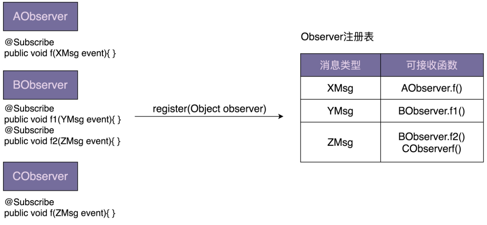
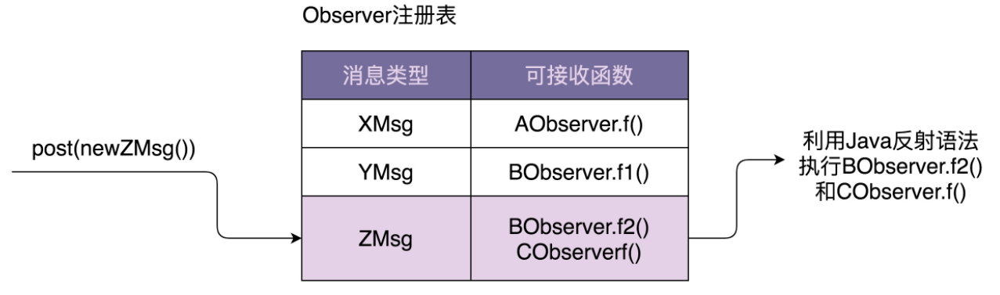

# 观察者模式

## 原理及应用场景剖析

观察者模式（`Observer Design Pattern`）也被称为发布订阅模式（`Publish-Subscribe Design Pattern`）。在 GoF 的《设计模式》一书中，它的定义是这样的：

> Define a one-to-many dependency between objects so that when one object changes state, all its dependents are notified and updated automatically.

在对象之间定义一个一对多的依赖，当一个对象状态改变的时候，所有依赖的对象都会自动收到通知。

一般情况下，被依赖的对象叫作被观察者（`Observable`），依赖的对象叫作观察者（`Observer`）。不过，在实际的项目开发中，这两种对象的称呼是比较灵活的，有各种不同的叫法，比如：`Subject-Observer`、`Publisher-Subscriber`、`Producer-Consumer`、`EventEmitter-EventListener`、`EventEmitter-EventListener`。不管怎么称呼，只要应用场景符合刚刚给出的定义，都可以看作观察者模式。
基本代码：

```java

public interface Subject {
  void registerObserver(Observer observer);
  void removeObserver(Observer observer);
  void notifyObservers(Message message);
}

public interface Observer {
  void update(Message message);
}

public class ConcreteSubject implements Subject {
  private List<Observer> observers = new ArrayList<Observer>();

  @Override
  public void registerObserver(Observer observer) {
    observers.add(observer);
  }

  @Override
  public void removeObserver(Observer observer) {
    observers.remove(observer);
  }

  @Override
  public void notifyObservers(Message message) {
    for (Observer observer : observers) {
      observer.update(message);
    }
  }

}

public class ConcreteObserverOne implements Observer {
  @Override
  public void update(Message message) {
    //TODO: 获取消息通知，执行自己的逻辑...
    System.out.println("ConcreteObserverOne is notified.");
  }
}

public class ConcreteObserverTwo implements Observer {
  @Override
  public void update(Message message) {
    //TODO: 获取消息通知，执行自己的逻辑...
    System.out.println("ConcreteObserverTwo is notified.");
  }
}

public class Demo {
  public static void main(String[] args) {
    ConcreteSubject subject = new ConcreteSubject();
    subject.registerObserver(new ConcreteObserverOne());
    subject.registerObserver(new ConcreteObserverTwo());
    subject.notifyObservers(new Message());
  }
}
```

假设我们在开发一个 P2P 投资理财系统，用户注册成功之后，我们会给用户发放投资体验金。代码实现大致是下面这个样子的

```java

public class UserController {
  private UserService userService; // 依赖注入
  private PromotionService promotionService; // 依赖注入

  public Long register(String telephone, String password) {
    //省略输入参数的校验代码
    //省略userService.register()异常的try-catch代码
    long userId = userService.register(telephone, password);
    promotionService.issueNewUserExperienceCash(userId);
    return userId;
  }
}
```

虽然注册接口做了两件事情，注册和发放体验金，违反单一职责原则，但是，如果没有扩展和修改的需求，现在的代码实现是可以接受的。如果非得用观察者模式，就需要引入更多的类和更加复杂的代码结构，反倒是一种过度设计。相反，如果需求频繁变动，比如，用户注册成功之后，不再发放体验金，而是改为发放优惠券，并且还要给用户发送一封“欢迎注册成功”的站内信。这种情况下，我们就需要频繁地修改 `register() `函数中的代码，违反开闭原则。而且，如果注册成功之后需要执行的后续操作越来越多，那 `register() ` 函数的逻辑会变得越来越复杂，也就影响到代码的可读性和可维护性。这个时候，观察者模式就能派上用场了。利用观察者模式，我对上面的代码进行了重构。重构之后的代码如下所示：

```java

public interface RegObserver {
  void handleRegSuccess(long userId);
}

public class RegPromotionObserver implements RegObserver {
  private PromotionService promotionService; // 依赖注入

  @Override
  public void handleRegSuccess(long userId) {
    promotionService.issueNewUserExperienceCash(userId);
  }
}

public class RegNotificationObserver implements RegObserver {
  private NotificationService notificationService;

  @Override
  public void handleRegSuccess(long userId) {
    notificationService.sendInboxMessage(userId, "Welcome...");
  }
}

public class UserController {
  private UserService userService; // 依赖注入
  private List<RegObserver> regObservers = new ArrayList<>();

  // 一次性设置好，之后也不可能动态的修改
  public void setRegObservers(List<RegObserver> observers) {
    regObservers.addAll(observers);
  }

  public Long register(String telephone, String password) {
    //省略输入参数的校验代码
    //省略userService.register()异常的try-catch代码
    long userId = userService.register(telephone, password);

    for (RegObserver observer : regObservers) {
      observer.handleRegSuccess(userId);
    }

    return userId;
  }
}
```

当我们需要添加新的观察者的时候，比如，用户注册成功之后，推送用户注册信息给大数据征信系统，基于观察者模式的代码实现，`UserController` 类的 `register() `函数完全不需要修改，只需要再添加一个实现了 `RegObserver `接口的类，并且通过 `setRegObservers()` 函数将它注册到 `UserController` 类中即可。

实际上，设计模式要干的事情就是解耦。创建型模式是将创建和使用代码解耦，结构型模式是将不同功能代码解耦，行为型模式是将不同的行为代码解耦，具体到观察者模式，它是将观察者和被观察者代码解耦。借助设计模式，我们利用更好的代码结构，将一大坨代码拆分成职责更单一的小类，让其满足开闭原则、高内聚松耦合等特性，以此来控制和应对代码的复杂性，提高代码的可扩展性。

## 实现异步非阻塞

观察者模式有四种不同的实现方式，包括：同步阻塞、异步非阻塞、进程内、进程间的实现方式。同步阻塞是最经典的实现方式，主要是为了代码解耦；异步非阻塞除了能实现代码解耦之外，还能提高代码的执行效率；进程间的观察者模式解耦更加彻底，一般是基于消息队列来实现，用来实现不同进程间的被观察者和观察者之间的交互。

**异步非阻塞观察者模式的简易实现**

我们有两种实现方式。其中一种是：在每个 `handleRegSuccess() `函数中创建一个新的线程执行代码逻辑；另一种是：在 `UserController `的 `register()` 函数中使用线程池来执行每个观察者的 `handleRegSuccess() `函数。两种实现方式的具体代码如下所示：

```java

// 第一种实现方式，其他类代码不变，就没有再重复罗列
public class RegPromotionObserver implements RegObserver {
  private PromotionService promotionService; // 依赖注入

  @Override
  public void handleRegSuccess(long userId) {
    Thread thread = new Thread(new Runnable() {
      @Override
      public void run() {
        promotionService.issueNewUserExperienceCash(userId);
      }
    });
    thread.start();
  }
}

// 第二种实现方式，其他类代码不变，就没有再重复罗列
public class UserController {
  private UserService userService; // 依赖注入
  private List<RegObserver> regObservers = new ArrayList<>();
  private Executor executor;

  public UserController(Executor executor) {
    this.executor = executor;
  }

  public void setRegObservers(List<RegObserver> observers) {
    regObservers.addAll(observers);
  }

  public Long register(String telephone, String password) {
    //省略输入参数的校验代码
    //省略userService.register()异常的try-catch代码
    long userId = userService.register(telephone, password);

    for (RegObserver observer : regObservers) {
      executor.execute(new Runnable() {
        @Override
        public void run() {
          observer.handleRegSuccess(userId);
        }
      });
    }

    return userId;
  }
}
```

对于第一种实现方式，频繁地创建和销毁线程比较耗时，并且并发线程数无法控制，创建过多的线程会导致堆栈溢出。第二种实现方式，尽管利用了线程池解决了第一种实现方式的问题，但线程池、异步执行逻辑都耦合在了 `register()` 函数中，增加了这部分业务代码的维护成本。如果我们的需求更加极端一点，需要在同步阻塞和异步非阻塞之间灵活切换，那就要不停地修改 `UserController` 的代码。除此之外，如果在项目中，不止一个业务模块需要用到异步非阻塞观察者模式，那这样的代码实现也无法做到复用。

## EventBus 框架

`EventBus` 翻译为“事件总线”，它提供了实现观察者模式的骨架代码。我们可以基于此框架，非常容易地在自己的业务场景中实现观察者模式，不需要从零开始开发。其中，`Google Guava EventBus `就是一个比较著名的 `EventBus `框架，它不仅仅支持异步非阻塞模式，同时也支持同步阻塞模式现在，我们就通过例子来看一下，`Guava EventBus` 具有哪些功能。还是上节课那个用户注册的例子，我们用 `Guava EventBus` 重新实现一下，代码如下所示：

```java

public class UserController {
  private UserService userService; // 依赖注入

  private EventBus eventBus;
  private static final int DEFAULT_EVENTBUS_THREAD_POOL_SIZE = 20;

  public UserController() {
    //eventBus = new EventBus(); // 同步阻塞模式
    eventBus = new AsyncEventBus(Executors.newFixedThreadPool(DEFAULT_EVENTBUS_THREAD_POOL_SIZE)); // 异步非阻塞模式
  }

  public void setRegObservers(List<Object> observers) {
    for (Object observer : observers) {
      eventBus.register(observer);
    }
  }

  public Long register(String telephone, String password) {
    //省略输入参数的校验代码
    //省略userService.register()异常的try-catch代码
    long userId = userService.register(telephone, password);

    eventBus.post(userId);

    return userId;
  }
}

public class RegPromotionObserver {
  private PromotionService promotionService; // 依赖注入

  @Subscribe
  public void handleRegSuccess(long userId) {
    promotionService.issueNewUserExperienceCash(userId);
  }
}

public class RegNotificationObserver {
  private NotificationService notificationService;

  @Subscribe
  public void handleRegSuccess(long userId) {
    notificationService.sendInboxMessage(userId, "...");
  }
}
```

利用 `EventBus` 框架实现的观察者模式，跟从零开始编写的观察者模式相比，从大的流程上来说，实现思路大致一样，都需要定义 `Observer`，并且通过 register() 函数注册 Observer，也都需要通过调用某个函数（比如，EventBus 中的 post() 函数）来给 Observer 发送消息（在 EventBus 中消息被称作事件 event）。但在实现细节方面，它们又有些区别。基于 EventBus，我们不需要定义 Observer 接口，任意类型的对象都可以注册到 EventBus 中，通过 @Subscribe 注解来标明类中哪个函数可以接收被观察者发送的消息。接下来，我们详细地讲一下，Guava EventBus 的几个主要的类和函数。

- `EventBus`、`AsyncEventBus`
  `Guava EventBus` 对外暴露的所有可调用接口，都封装在 `EventBus `类中。其中，`EventBus `实现了同步阻塞的观察者模式，`AsyncEventBus` 继承自 `EventBus`，提供了异步非阻塞的观察者模式。具体使用方式如下所示：

  ```java
  EventBus eventBus = new EventBus(); // 同步阻塞模式
  EventBus eventBus = new AsyncEventBus(Executors.newFixedThreadPool(8))；// 异步阻塞模式
  ```

- `register()` 函数
  `EventBus` 类提供了 `register()` 函数用来注册观察者。具体的函数定义如下所示。它可以接受任何类型（`Object`）的观察者。而在经典的观察者模式的实现中，register() 函数必须接受实现了同一 `Observer` 接口的类对象。

  ```java
  public void register(Object object);
  ```

- `unregister()` 函数
  相对于 `register()` 函数，`unregister()` 函数用来从 EventBus 中删除某个观察者。我就不多解释了，具体的函数定义如下所示：

  ```java
  public void unregister(Object object);
  ```

- `post()` 函数
  `EventBus` 类提供了 `post()` 函数，用来给观察者发送消息。具体的函数定义如下所示

  ```java
  public void post(Object event);
  ```

  跟经典的观察者模式的不同之处在于，当我们调用 `post()` 函数发送消息的时候，并非把消息发送给所有的观察者，而是发送给可匹配的观察者。所谓可匹配指的是，能接收的消息类型是发送消息（post 函数定义中的 event）类型的父类。我举个例子来解释一下。比如，`AObserver` 能接收的消息类型是 `XMsg`，`BObserver `能接收的消息类型是 `YMsg`，`CObserver` 能接收的消息类型是 ZMsg。其中，XMsg 是 YMsg 的父类。当我们如下发送消息的时候，相应能接收到消息的可匹配观察者如下所示：

  ```java
  
  XMsg xMsg = new XMsg();
  YMsg yMsg = new YMsg();
  ZMsg zMsg = new ZMsg();
  post(xMsg); => AObserver接收到消息
  post(yMsg); => AObserver、BObserver接收到消息
  post(zMsg); => CObserver接收到消息
  ```

- `@Subscribe `注解
  `EventBus` 通过 `@Subscribe `注解来标明，某个函数能接收哪种类型的消息。具体的使用代码如下所示。在 `DObserver` 类中，我们通过 `@Subscribe `注解了两个函数 f1()、f2()。

  ```java
  
  public DObserver {
    //...省略其他属性和方法...
    
    @Subscribe
    public void f1(PMsg event) { //... }
    
    @Subscribe
    public void f2(QMsg event) { //... }
  }
  ```

  当通过 `register()` 函数将 `DObserver `类对象注册到 `EventBus `的时候，`EventBus `会根据 `@Subscribe `注解找到 f1() 和 f2()，并且将两个函数能接收的消息类型记录下来（PMsg->f1，QMsg->f2）。当我们通过 `post()` 函数发送消息（比如 QMsg 消息）的时候，EventBus 会通过之前的记录（QMsg->f2），调用相应的函数（f2）。

## 手动实现EventBus

**实现原理图**





从图中我们可以看出，最关键的一个数据结构是 Observer 注册表，记录了消息类型和可接收消息函数的对应关系。当调用 register() 函数注册观察者的时候，EventBus 通过解析 @Subscribe 注解，生成 Observer 注册表。当调用 post() 函数发送消息的时候，EventBus 通过注册表找到相应的可接收消息的函数，然后通过 Java 的反射语法来动态地创建对象、执行函数。对于同步阻塞模式，EventBus 在一个线程内依次执行相应的函数。对于异步非阻塞模式，EventBus 通过一个线程池来执行相应的函数

**1.Subscribe**

```java
@Retention(RetentionPolicy.RUNTIME)
@Target(ElementType.METHOD)
@Beta
public @interface Subscribe {}
```

**2.ObserverAction**

```java

public class ObserverAction {
  private Object target;
  private Method method;

  public ObserverAction(Object target, Method method) {
    this.target = Preconditions.checkNotNull(target);
    this.method = method;
    this.method.setAccessible(true);
  }

  public void execute(Object event) { // event是method方法的参数
    try {
      method.invoke(target, event);
    } catch (InvocationTargetException | IllegalAccessException e) {
      e.printStackTrace();
    }
  }
}
```

**3.ObserverRegistry**

ObserverRegistry 类就是前面讲到的 Observer 注册表，是最复杂的一个类，框架中几乎所有的核心逻辑都在这个类中。这个类大量使用了 Java 的反射语法，不过代码整体来说都不难理解，其中，一个比较有技巧的地方是 CopyOnWriteArraySet 的使用。CopyOnWriteArraySet，顾名思义，在写入数据的时候，会创建一个新的 set，并且将原始数据 clone 到新的 set 中，在新的 set 中写入数据完成之后，再用新的 set 替换老的 set。这样就能保证在写入数据的时候，不影响数据的读取操作，以此来解决读写并发问题。除此之外，CopyOnWriteSet 还通过加锁的方式，避免了并发写冲突。具体的作用你可以去查看一下 CopyOnWriteSet 类的源码，一目了然。

```java

public class ObserverRegistry {
  private ConcurrentMap<Class<?>, CopyOnWriteArraySet<ObserverAction>> registry = new ConcurrentHashMap<>();

  public void register(Object observer) {
    Map<Class<?>, Collection<ObserverAction>> observerActions = findAllObserverActions(observer);
    for (Map.Entry<Class<?>, Collection<ObserverAction>> entry : observerActions.entrySet()) {
      Class<?> eventType = entry.getKey();
      Collection<ObserverAction> eventActions = entry.getValue();
      CopyOnWriteArraySet<ObserverAction> registeredEventActions = registry.get(eventType);
      if (registeredEventActions == null) {
        registry.putIfAbsent(eventType, new CopyOnWriteArraySet<>());
        registeredEventActions = registry.get(eventType);
      }
      registeredEventActions.addAll(eventActions);
    }
  }

  public List<ObserverAction> getMatchedObserverActions(Object event) {
    List<ObserverAction> matchedObservers = new ArrayList<>();
    Class<?> postedEventType = event.getClass();
    for (Map.Entry<Class<?>, CopyOnWriteArraySet<ObserverAction>> entry : registry.entrySet()) {
      Class<?> eventType = entry.getKey();
      Collection<ObserverAction> eventActions = entry.getValue();
      if (postedEventType.isAssignableFrom(eventType)) {
        matchedObservers.addAll(eventActions);
      }
    }
    return matchedObservers;
  }

  private Map<Class<?>, Collection<ObserverAction>> findAllObserverActions(Object observer) {
    Map<Class<?>, Collection<ObserverAction>> observerActions = new HashMap<>();
    Class<?> clazz = observer.getClass();
    for (Method method : getAnnotatedMethods(clazz)) {
      Class<?>[] parameterTypes = method.getParameterTypes();
      Class<?> eventType = parameterTypes[0];
      if (!observerActions.containsKey(eventType)) {
        observerActions.put(eventType, new ArrayList<>());
      }
      observerActions.get(eventType).add(new ObserverAction(observer, method));
    }
    return observerActions;
  }

  private List<Method> getAnnotatedMethods(Class<?> clazz) {
    List<Method> annotatedMethods = new ArrayList<>();
    for (Method method : clazz.getDeclaredMethods()) {
      if (method.isAnnotationPresent(Subscribe.class)) {
        Class<?>[] parameterTypes = method.getParameterTypes();
        Preconditions.checkArgument(parameterTypes.length == 1,
                "Method %s has @Subscribe annotation but has %s parameters."
                        + "Subscriber methods must have exactly 1 parameter.",
                method, parameterTypes.length);
        annotatedMethods.add(method);
      }
    }
    return annotatedMethods;
  }
}
```

**4.EventBus**

EventBus 实现的是阻塞同步的观察者模式。看代码你可能会有些疑问，这明明就用到了线程池 Executor 啊。实际上，MoreExecutors.directExecutor() 是 Google Guava 提供的工具类，看似是多线程，实际上是单线程。之所以要这么实现，主要还是为了跟 AsyncEventBus 统一代码逻辑，做到代码复用。

```java

public class EventBus {
  private Executor executor;
  private ObserverRegistry registry = new ObserverRegistry();

  public EventBus() {
    this(MoreExecutors.directExecutor());
  }

  protected EventBus(Executor executor) {
    this.executor = executor;
  }

  public void register(Object object) {
    registry.register(object);
  }

  public void post(Object event) {
    List<ObserverAction> observerActions = registry.getMatchedObserverActions(event);
    for (ObserverAction observerAction : observerActions) {
      executor.execute(new Runnable() {
        @Override
        public void run() {
          observerAction.execute(event);
        }
      });
    }
  }
}
```

**5.AsyncEventBus**

有了 EventBus，AsyncEventBus 的实现就非常简单了。为了实现异步非阻塞的观察者模式，它就不能再继续使用 MoreExecutors.directExecutor() 了，而是需要在构造函数中，由调用者注入线程池。

```java
public class AsyncEventBus extends EventBus {
  public AsyncEventBus(Executor executor) {
    super(executor);
  }
}
```

