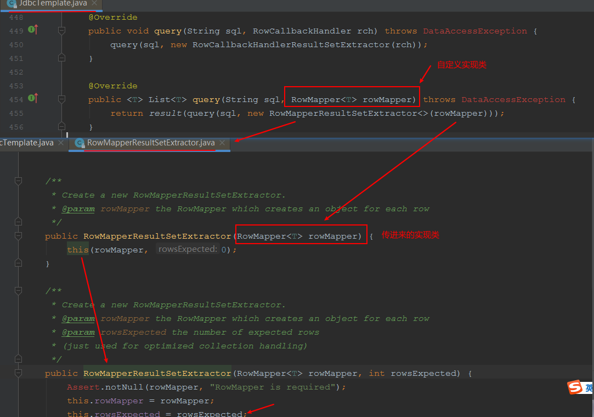
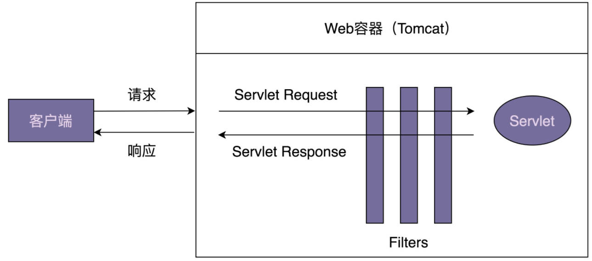
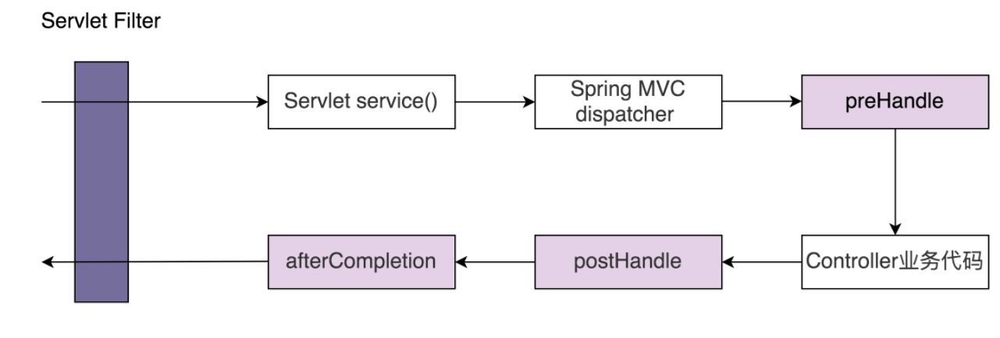
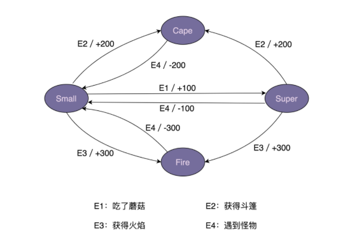
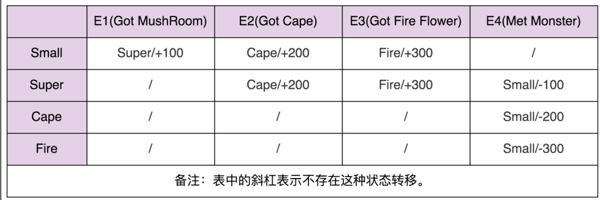

# 行为型模式

## 观察者模式

### 原理及应用场景剖析

观察者模式（`Observer Design Pattern`）也被称为发布订阅模式（`Publish-Subscribe Design Pattern`）。在 GoF 的《设计模式》一书中，它的定义是这样的：

> Define a one-to-many dependency between objects so that when one object changes state, all its dependents are notified and updated automatically.

在对象之间定义一个一对多的依赖，当一个对象状态改变的时候，所有依赖的对象都会自动收到通知。

一般情况下，被依赖的对象叫作被观察者（`Observable`），依赖的对象叫作观察者（`Observer`）。不过，在实际的项目开发中，这两种对象的称呼是比较灵活的，有各种不同的叫法，比如：`Subject-Observer`、`Publisher-Subscriber`、`Producer-Consumer`、`EventEmitter-EventListener`、`EventEmitter-EventListener`。不管怎么称呼，只要应用场景符合刚刚给出的定义，都可以看作观察者模式。
基本代码：

```java

public interface Subject {
  void registerObserver(Observer observer);
  void removeObserver(Observer observer);
  void notifyObservers(Message message);
}

public interface Observer {
  void update(Message message);
}

public class ConcreteSubject implements Subject {
  private List<Observer> observers = new ArrayList<Observer>();

  @Override
  public void registerObserver(Observer observer) {
    observers.add(observer);
  }

  @Override
  public void removeObserver(Observer observer) {
    observers.remove(observer);
  }

  @Override
  public void notifyObservers(Message message) {
    for (Observer observer : observers) {
      observer.update(message);
    }
  }

}

public class ConcreteObserverOne implements Observer {
  @Override
  public void update(Message message) {
    //TODO: 获取消息通知，执行自己的逻辑...
    System.out.println("ConcreteObserverOne is notified.");
  }
}

public class ConcreteObserverTwo implements Observer {
  @Override
  public void update(Message message) {
    //TODO: 获取消息通知，执行自己的逻辑...
    System.out.println("ConcreteObserverTwo is notified.");
  }
}

public class Demo {
  public static void main(String[] args) {
    ConcreteSubject subject = new ConcreteSubject();
    subject.registerObserver(new ConcreteObserverOne());
    subject.registerObserver(new ConcreteObserverTwo());
    subject.notifyObservers(new Message());
  }
}
```

假设我们在开发一个 P2P 投资理财系统，用户注册成功之后，我们会给用户发放投资体验金。代码实现大致是下面这个样子的

```java

public class UserController {
  private UserService userService; // 依赖注入
  private PromotionService promotionService; // 依赖注入

  public Long register(String telephone, String password) {
    //省略输入参数的校验代码
    //省略userService.register()异常的try-catch代码
    long userId = userService.register(telephone, password);
    promotionService.issueNewUserExperienceCash(userId);
    return userId;
  }
}
```

虽然注册接口做了两件事情，注册和发放体验金，**违反单一职责原则**，但是，如果没有扩展和修改的需求，现在的代码实现是可以接受的。如果非得用观察者模式，就需要引入更多的类和更加复杂的代码结构，反倒是一种过度设计。相反，如果需求频繁变动，比如，用户注册成功之后，不再发放体验金，而是改为发放优惠券，并且还要给用户发送一封“欢迎注册成功”的站内信。这种情况下，我们就需要频繁地修改 `register() `函数中的代码，**违反开闭原则**。而且，如果注册成功之后需要执行的后续操作越来越多，那 `register() ` 函数的逻辑会变得越来越复杂，也就影响到代码的可读性和可维护性。这个时候，观察者模式就能派上用场了。利用观察者模式，我对上面的代码进行了重构。重构之后的代码如下所示：

```java

public interface RegObserver {
  void handleRegSuccess(long userId);
}

public class RegPromotionObserver implements RegObserver {
  private PromotionService promotionService; // 依赖注入

  @Override
  public void handleRegSuccess(long userId) {
    promotionService.issueNewUserExperienceCash(userId);
  }
}

public class RegNotificationObserver implements RegObserver {
  private NotificationService notificationService;

  @Override
  public void handleRegSuccess(long userId) {
    notificationService.sendInboxMessage(userId, "Welcome...");
  }
}

public class UserController {
  private UserService userService; // 依赖注入
  private List<RegObserver> regObservers = new ArrayList<>();

  // 一次性设置好，之后也不可能动态的修改
  public void setRegObservers(List<RegObserver> observers) {
    regObservers.addAll(observers);
  }

  public Long register(String telephone, String password) {
    //省略输入参数的校验代码
    //省略userService.register()异常的try-catch代码
    long userId = userService.register(telephone, password);

    for (RegObserver observer : regObservers) {
      observer.handleRegSuccess(userId);
    }

    return userId;
  }
}
```

当我们需要添加新的观察者的时候，比如，用户注册成功之后，推送用户注册信息给大数据征信系统，基于观察者模式的代码实现，`UserController` 类的 `register() `函数完全不需要修改，只需要再添加一个实现了 `RegObserver `接口的类，并且通过 `setRegObservers()` 函数将它注册到 `UserController` 类中即可。

实际上，设计模式要干的事情就是解耦。创建型模式是将创建和使用代码解耦，结构型模式是将不同功能代码解耦，行为型模式是将不同的行为代码解耦，具体到观察者模式，它是将观察者和被观察者代码解耦。借助设计模式，我们利用更好的代码结构，将一大坨代码拆分成职责更单一的小类，让其满足开闭原则、高内聚松耦合等特性，以此来控制和应对代码的复杂性，提高代码的可扩展性。

### 实现异步非阻塞

观察者模式有四种不同的实现方式，包括：同步阻塞、异步非阻塞、进程内、进程间的实现方式。同步阻塞是最经典的实现方式，主要是为了代码解耦；异步非阻塞除了能实现代码解耦之外，还能提高代码的执行效率；进程间的观察者模式解耦更加彻底，一般是基于消息队列来实现，用来实现不同进程间的被观察者和观察者之间的交互。

**异步非阻塞观察者模式的简易实现**

我们有两种实现方式。其中一种是：在每个 `handleRegSuccess() `函数中创建一个新的线程执行代码逻辑；另一种是：在 `UserController `的 `register()` 函数中使用线程池来执行每个观察者的 `handleRegSuccess() `函数。两种实现方式的具体代码如下所示：

```java

// 第一种实现方式，其他类代码不变，就没有再重复罗列
public class RegPromotionObserver implements RegObserver {
  private PromotionService promotionService; // 依赖注入

  @Override
  public void handleRegSuccess(long userId) {
    Thread thread = new Thread(new Runnable() {
      @Override
      public void run() {
        promotionService.issueNewUserExperienceCash(userId);
      }
    });
    thread.start();
  }
}

// 第二种实现方式，其他类代码不变，就没有再重复罗列
public class UserController {
  private UserService userService; // 依赖注入
  private List<RegObserver> regObservers = new ArrayList<>();
  private Executor executor;

  public UserController(Executor executor) {
    this.executor = executor;
  }

  public void setRegObservers(List<RegObserver> observers) {
    regObservers.addAll(observers);
  }

  public Long register(String telephone, String password) {
    //省略输入参数的校验代码
    //省略userService.register()异常的try-catch代码
    long userId = userService.register(telephone, password);

    for (RegObserver observer : regObservers) {
      executor.execute(new Runnable() {
        @Override
        public void run() {
          observer.handleRegSuccess(userId);
        }
      });
    }

    return userId;
  }
}
```

对于第一种实现方式，频繁地创建和销毁线程比较耗时，并且并发线程数无法控制，创建过多的线程会导致堆栈溢出。第二种实现方式，尽管利用了线程池解决了第一种实现方式的问题，但线程池、异步执行逻辑都耦合在了 `register()` 函数中，增加了这部分业务代码的维护成本。如果我们的需求更加极端一点，需要在同步阻塞和异步非阻塞之间灵活切换，那就要不停地修改 `UserController` 的代码。除此之外，如果在项目中，不止一个业务模块需要用到异步非阻塞观察者模式，那这样的代码实现也无法做到复用。

### EventBus 框架

`EventBus` 翻译为“事件总线”，它提供了实现观察者模式的骨架代码。我们可以基于此框架，非常容易地在自己的业务场景中实现观察者模式，不需要从零开始开发。其中，`Google Guava EventBus `就是一个比较著名的 `EventBus `框架，它不仅仅支持异步非阻塞模式，同时也支持同步阻塞模式现在，我们就通过例子来看一下，`Guava EventBus` 具有哪些功能。还是上节课那个用户注册的例子，我们用 `Guava EventBus` 重新实现一下，代码如下所示：

```java

public class UserController {
  private UserService userService; // 依赖注入

  private EventBus eventBus;
  private static final int DEFAULT_EVENTBUS_THREAD_POOL_SIZE = 20;

  public UserController() {
    //eventBus = new EventBus(); // 同步阻塞模式
    eventBus = new AsyncEventBus(Executors.newFixedThreadPool(DEFAULT_EVENTBUS_THREAD_POOL_SIZE)); // 异步非阻塞模式
  }

  public void setRegObservers(List<Object> observers) {
    for (Object observer : observers) {
      eventBus.register(observer);
    }
  }

  public Long register(String telephone, String password) {
    //省略输入参数的校验代码
    //省略userService.register()异常的try-catch代码
    long userId = userService.register(telephone, password);

    eventBus.post(userId);

    return userId;
  }
}

public class RegPromotionObserver {
  private PromotionService promotionService; // 依赖注入

  @Subscribe
  public void handleRegSuccess(long userId) {
    promotionService.issueNewUserExperienceCash(userId);
  }
}

public class RegNotificationObserver {
  private NotificationService notificationService;

  @Subscribe
  public void handleRegSuccess(long userId) {
    notificationService.sendInboxMessage(userId, "...");
  }
}
```

利用 `EventBus` 框架实现的观察者模式，跟从零开始编写的观察者模式相比，从大的流程上来说，实现思路大致一样，都需要定义 `Observer`，并且通过 register() 函数注册 Observer，也都需要通过调用某个函数（比如，EventBus 中的 post() 函数）来给 Observer 发送消息（在 EventBus 中消息被称作事件 event）。但在实现细节方面，它们又有些区别。基于 EventBus，我们不需要定义 Observer 接口，任意类型的对象都可以注册到 EventBus 中，通过 @Subscribe 注解来标明类中哪个函数可以接收被观察者发送的消息。接下来，我们详细地讲一下，Guava EventBus 的几个主要的类和函数。

- `EventBus`、`AsyncEventBus`
  `Guava EventBus` 对外暴露的所有可调用接口，都封装在 `EventBus `类中。其中，`EventBus `实现了同步阻塞的观察者模式，`AsyncEventBus` 继承自 `EventBus`，提供了异步非阻塞的观察者模式。具体使用方式如下所示：

  ```java
  EventBus eventBus = new EventBus(); // 同步阻塞模式
  EventBus eventBus = new AsyncEventBus(Executors.newFixedThreadPool(8))；// 异步阻塞模式
  ```

- `register()` 函数
  `EventBus` 类提供了 `register()` 函数用来注册观察者。具体的函数定义如下所示。它可以接受任何类型（`Object`）的观察者。而在经典的观察者模式的实现中，register() 函数必须接受实现了同一 `Observer` 接口的类对象。

  ```java
  public void register(Object object);
  ```

- `unregister()` 函数
  相对于 `register()` 函数，`unregister()` 函数用来从 EventBus 中删除某个观察者。我就不多解释了，具体的函数定义如下所示：

  ```java
  public void unregister(Object object);
  ```

- `post()` 函数
  `EventBus` 类提供了 `post()` 函数，用来给观察者发送消息。具体的函数定义如下所示

  ```java
  public void post(Object event);
  ```

  跟经典的观察者模式的不同之处在于，当我们调用 `post()` 函数发送消息的时候，并非把消息发送给所有的观察者，而是发送给可匹配的观察者。所谓可匹配指的是，能接收的消息类型是发送消息（post 函数定义中的 event）类型的父类。我举个例子来解释一下。比如，`AObserver` 能接收的消息类型是 `XMsg`，`BObserver `能接收的消息类型是 `YMsg`，`CObserver` 能接收的消息类型是 ZMsg。其中，XMsg 是 YMsg 的父类。当我们如下发送消息的时候，相应能接收到消息的可匹配观察者如下所示：

  ```java
  
  XMsg xMsg = new XMsg();
  YMsg yMsg = new YMsg();
  ZMsg zMsg = new ZMsg();
  post(xMsg); => AObserver接收到消息
  post(yMsg); => AObserver、BObserver接收到消息
  post(zMsg); => CObserver接收到消息
  ```

- `@Subscribe `注解
  `EventBus` 通过 `@Subscribe `注解来标明，某个函数能接收哪种类型的消息。具体的使用代码如下所示。在 `DObserver` 类中，我们通过 `@Subscribe `注解了两个函数 f1()、f2()。

  ```java
  
  public DObserver {
    //...省略其他属性和方法...
    
    @Subscribe
    public void f1(PMsg event) { //... }
    
    @Subscribe
    public void f2(QMsg event) { //... }
  }
  ```

  当通过 `register()` 函数将 `DObserver `类对象注册到 `EventBus `的时候，`EventBus `会根据 `@Subscribe `注解找到 f1() 和 f2()，并且将两个函数能接收的消息类型记录下来（PMsg->f1，QMsg->f2）。当我们通过 `post()` 函数发送消息（比如 QMsg 消息）的时候，EventBus 会通过之前的记录（QMsg->f2），调用相应的函数（f2）。

### 手动实现EventBus

**实现原理图**


从图中我们可以看出，最关键的一个数据结构是 Observer 注册表，记录了消息类型和可接收消息函数的对应关系。当调用 register() 函数注册观察者的时候，EventBus 通过解析 @Subscribe 注解，生成 Observer 注册表。当调用 post() 函数发送消息的时候，EventBus 通过注册表找到相应的可接收消息的函数，然后通过 Java 的反射语法来动态地创建对象、执行函数。对于同步阻塞模式，EventBus 在一个线程内依次执行相应的函数。对于异步非阻塞模式，EventBus 通过一个线程池来执行相应的函数

**1.Subscribe**

```java
@Retention(RetentionPolicy.RUNTIME)
@Target(ElementType.METHOD)
@Beta
public @interface Subscribe {}
```

**2.ObserverAction**

```java

public class ObserverAction {
  private Object target;
  private Method method;

  public ObserverAction(Object target, Method method) {
    this.target = Preconditions.checkNotNull(target);
    this.method = method;
    this.method.setAccessible(true);
  }

  public void execute(Object event) { // event是method方法的参数
    try {
      method.invoke(target, event);
    } catch (InvocationTargetException | IllegalAccessException e) {
      e.printStackTrace();
    }
  }
}
```

**3.ObserverRegistry**

ObserverRegistry 类就是前面讲到的 Observer 注册表，是最复杂的一个类，框架中几乎所有的核心逻辑都在这个类中。这个类大量使用了 Java 的反射语法，不过代码整体来说都不难理解，其中，一个比较有技巧的地方是 CopyOnWriteArraySet 的使用。CopyOnWriteArraySet，顾名思义，在写入数据的时候，会创建一个新的 set，并且将原始数据 clone 到新的 set 中，在新的 set 中写入数据完成之后，再用新的 set 替换老的 set。这样就能保证在写入数据的时候，不影响数据的读取操作，以此来解决读写并发问题。除此之外，CopyOnWriteSet 还通过加锁的方式，避免了并发写冲突。具体的作用你可以去查看一下 CopyOnWriteSet 类的源码，一目了然。

```java

public class ObserverRegistry {
  private ConcurrentMap<Class<?>, CopyOnWriteArraySet<ObserverAction>> registry = new ConcurrentHashMap<>();

  public void register(Object observer) {
    Map<Class<?>, Collection<ObserverAction>> observerActions = findAllObserverActions(observer);
    for (Map.Entry<Class<?>, Collection<ObserverAction>> entry : observerActions.entrySet()) {
      Class<?> eventType = entry.getKey();
      Collection<ObserverAction> eventActions = entry.getValue();
      CopyOnWriteArraySet<ObserverAction> registeredEventActions = registry.get(eventType);
      if (registeredEventActions == null) {
        registry.putIfAbsent(eventType, new CopyOnWriteArraySet<>());
        registeredEventActions = registry.get(eventType);
      }
      registeredEventActions.addAll(eventActions);
    }
  }

  public List<ObserverAction> getMatchedObserverActions(Object event) {
    List<ObserverAction> matchedObservers = new ArrayList<>();
    Class<?> postedEventType = event.getClass();
    for (Map.Entry<Class<?>, CopyOnWriteArraySet<ObserverAction>> entry : registry.entrySet()) {
      Class<?> eventType = entry.getKey();
      Collection<ObserverAction> eventActions = entry.getValue();
      if (postedEventType.isAssignableFrom(eventType)) {
        matchedObservers.addAll(eventActions);
      }
    }
    return matchedObservers;
  }

  private Map<Class<?>, Collection<ObserverAction>> findAllObserverActions(Object observer) {
    Map<Class<?>, Collection<ObserverAction>> observerActions = new HashMap<>();
    Class<?> clazz = observer.getClass();
    for (Method method : getAnnotatedMethods(clazz)) {
      Class<?>[] parameterTypes = method.getParameterTypes();
      Class<?> eventType = parameterTypes[0];
      if (!observerActions.containsKey(eventType)) {
        observerActions.put(eventType, new ArrayList<>());
      }
      observerActions.get(eventType).add(new ObserverAction(observer, method));
    }
    return observerActions;
  }

  private List<Method> getAnnotatedMethods(Class<?> clazz) {
    List<Method> annotatedMethods = new ArrayList<>();
    for (Method method : clazz.getDeclaredMethods()) {
      if (method.isAnnotationPresent(Subscribe.class)) {
        Class<?>[] parameterTypes = method.getParameterTypes();
        Preconditions.checkArgument(parameterTypes.length == 1,
                "Method %s has @Subscribe annotation but has %s parameters."
                        + "Subscriber methods must have exactly 1 parameter.",
                method, parameterTypes.length);
        annotatedMethods.add(method);
      }
    }
    return annotatedMethods;
  }
}
```

**4.EventBus**

EventBus 实现的是阻塞同步的观察者模式。看代码你可能会有些疑问，这明明就用到了线程池 Executor 啊。实际上，MoreExecutors.directExecutor() 是 Google Guava 提供的工具类，看似是多线程，实际上是单线程。之所以要这么实现，主要还是为了跟 AsyncEventBus 统一代码逻辑，做到代码复用。

```java

public class EventBus {
  private Executor executor;
  private ObserverRegistry registry = new ObserverRegistry();

  public EventBus() {
    this(MoreExecutors.directExecutor());
  }

  protected EventBus(Executor executor) {
    this.executor = executor;
  }

  public void register(Object object) {
    registry.register(object);
  }

  public void post(Object event) {
    List<ObserverAction> observerActions = registry.getMatchedObserverActions(event);
    for (ObserverAction observerAction : observerActions) {
      executor.execute(new Runnable() {
        @Override
        public void run() {
          observerAction.execute(event);
        }
      });
    }
  }
}
```

**5.AsyncEventBus**

有了 EventBus，AsyncEventBus 的实现就非常简单了。为了实现异步非阻塞的观察者模式，它就不能再继续使用 MoreExecutors.directExecutor() 了，而是需要在构造函数中，由调用者注入线程池。

```java
public class AsyncEventBus extends EventBus {
  public AsyncEventBus(Executor executor) {
    super(executor);
  }
}
```


## 模板方法模式

### 概念

模板模式，全称是模板方法设计模式，英文是 Template Method Design Pattern。在 GoF 的《设计模式》一书中，它是这么定义的

> Define the skeleton of an algorithm in an operation, deferring some steps to subclasses. Template Method lets subclasses redefine certain steps of an algorithm without changing the algorithm’s structure.

意思就是在一个方法中定义一个算法骨架，在不同的子类中实现。

基本框架代码：

```java
public abstract class AbstractClass { 
    public final void templateMethod() { 
        method1(); 
        method2();
    }
    protected abstract void method1(); 
    protected abstract void method2();   
}  
public class ConcreteClass1 extends AbstractClass {
    @Override protected void method1() { //... 
    } 
    @Override protected void method2() { //... 
    }
}
public class ConcreteClass2 extends AbstractClass { 
    @Override protected void method1() { //... 
    }
    @Override protected void method2() { //... 
    }
}
```

### JDK中的模板方法

1. `InputStream`中`read`方法

```java

public abstract class InputStream implements Closeable {
  //...省略其他代码...
  public int read(byte b[], int off, int len) throws IOException {
    if (b == null) {
      throw new NullPointerException();
    } else if (off < 0 || len < 0 || len > b.length - off) {
      throw new IndexOutOfBoundsException();
    } else if (len == 0) {
      return 0;
    }
    int c = read();
    if (c == -1) {
      return -1;
    }
    b[off] = (byte)c;
    int i = 1;
    try {
      for (; i < len ; i++) {
        c = read();
        if (c == -1) {
          break;
        }
        b[off + i] = (byte)c;
      }
    } catch (IOException ee) {
    }
    return i;
  }
  public abstract int read() throws IOException;
}
public class ByteArrayInputStream extends InputStream {
  //...省略其他代码...
  @Override
  public synchronized int read() {
    return (pos < count) ? (buf[pos++] & 0xff) : -1;
  }
}
```

2. `AbstractList`的`AddAll`方法

   ```java
   public boolean addAll(int index, Collection<? extends E> c) {
       rangeCheckForAdd(index);
       boolean modified = false;
       for (E e : c) {
           add(index++, e);
           modified = true;
       }
       return modified;
   }
   public void add(int index, E element) {
       throw new UnsupportedOperationException();
   }
   ```

3. `HttpServlet`中的`service`方法

   ```java
   
   public void service(ServletRequest req, ServletResponse res)
       throws ServletException, IOException
   {
       HttpServletRequest  request;
       HttpServletResponse response;
       if (!(req instanceof HttpServletRequest &&
               res instanceof HttpServletResponse)) {
           throw new ServletException("non-HTTP request or response");
       }
       request = (HttpServletRequest) req;
       response = (HttpServletResponse) res;
       service(request, response);
   }
   
   protected void service(HttpServletRequest req, HttpServletResponse resp)
       throws ServletException, IOException
   {
       String method = req.getMethod();
       if (method.equals(METHOD_GET)) {
           long lastModified = getLastModified(req);
           if (lastModified == -1) {
               // servlet doesn't support if-modified-since, no reason
               // to go through further expensive logic
               doGet(req, resp);
           } else {
               long ifModifiedSince = req.getDateHeader(HEADER_IFMODSINCE);
               if (ifModifiedSince < lastModified) {
                   // If the servlet mod time is later, call doGet()
                   // Round down to the nearest second for a proper compare
                   // A ifModifiedSince of -1 will always be less
                   maybeSetLastModified(resp, lastModified);
                   doGet(req, resp);
               } else {
                   resp.setStatus(HttpServletResponse.SC_NOT_MODIFIED);
               }
           }
       } else if (method.equals(METHOD_HEAD)) {
           long lastModified = getLastModified(req);
           maybeSetLastModified(resp, lastModified);
           doHead(req, resp);
       } else if (method.equals(METHOD_POST)) {
           doPost(req, resp);
       } else if (method.equals(METHOD_PUT)) {
           doPut(req, resp);
       } else if (method.equals(METHOD_DELETE)) {
           doDelete(req, resp);
       } else if (method.equals(METHOD_OPTIONS)) {
           doOptions(req,resp);
       } else if (method.equals(METHOD_TRACE)) {
           doTrace(req,resp);
       } else {
           String errMsg = lStrings.getString("http.method_not_implemented");
           Object[] errArgs = new Object[1];
           errArgs[0] = method;
           errMsg = MessageFormat.format(errMsg, errArgs);
           resp.sendError(HttpServletResponse.SC_NOT_IMPLEMENTED, errMsg);
       }
   }
   ```


### 作用

复用和扩展是模板模式的两大作用

### 回调

调是一种双向调用关系。A 类事先注册某个函数 F 到 B 类，A 类在调用 B 类的 P 函数的时候，B 类反过来调用 A 类注册给它的 F 函数。这里的 F 函数就是“回调函数”。A 调用 B，B 反过来又调用 A，这种调用机制就叫作“回调”

```java
public interface ICallback {
    void methodToCallBack();
}
public class BClass {
    public void process(ICallback callback) {
        // ...
        System.out.println("before call back");
        callback.methodToCallBack();
        // ...
        System.out.println("after call back");
    }
}
public class AClass {
    public static void main(String[] args) {
        BClass b = new BClass();
        b.process(() -> System.out.println("Call back me"));
    }
}
```

实际上，回调不仅可以应用在代码设计上，在更高层次的架构设计上也比较常用。比如，通过三方支付系统来实现支付功能，用户在发起支付请求之后，一般不会一直阻塞到支付结果返回，而是注册回调接口（类似回调函数，一般是一个回调用的 URL）给三方支付系统，等三方支付系统执行完成之后，将结果通过回调接口返回给用户。

**回调可以分为同步回调和异步回调（或者延迟回调）**。同步回调指在函数返回之前执行回调函数；异步回调指的是在函数返回之后执行回调函数。上面的代码实际上是同步回调的实现方式，在 process() 函数返回之前，执行完回调函数 `methodToCallback()`。而上面支付的例子是异步回调的实现方式，发起支付之后不需要等待回调接口被调用就直接返回。从应用场景上来看，**同步回调看起来更像模板模式，异步回调看起来更像观察者模式。**

**应用举例一：`JdbcTemplate`**

先来看原生`jdbc`

```java
public class JdbcDemo {
    public Optional<User> queryUser(long id) {
        // 注册驱动，获取连接，创建statement，关闭连接，关闭statement都是样板代码
        try (Connection connection =
                     DriverManager.getConnection("jdbc:mysql://localhost:3306/demo");
             Statement statement = connection.createStatement()) {
            Class.forName("com.mysql.jdbc.Driver");
            String sql = "SELECT * FROM user where id = " + id;
            ResultSet resultSet = statement.executeQuery(sql);
            while (resultSet.next()) {
                User user = new User();
                user.setId(resultSet.getLong("id"));
                user.setName(resultSet.getString("name"));
                user.setTelephone(resultSet.getString("telephone"));
                return Optional.of(user);
            }
        } catch (SQLException | ClassNotFoundException e) {
            e.printStackTrace();
        }
        return Optional.empty();
    }
}
```

下面使用`jdbcTemplate`改进，并对其源码进行分析

```java
public class JdbcTemplateDemo {
    private JdbcTemplate jdbcTemplate;

    public User queryUser(long id) {
        String sql = "SELECT * FROM user where id = " + id;
        return jdbcTemplate.query(sql, new UserRowMapper()).get(0);
    }
}
class UserRowMapper implements RowMapper<User> {
    @Override
    public User mapRow(ResultSet resultSet, int i) throws SQLException {
        User user = new User();
        user.setId(resultSet.getLong("id"));
        user.setName(resultSet.getString("name"));
        user.setTelephone(resultSet.getString("telephone"));
        return user;
    }
}
```

下面看`jdbcTemplate`是如何实现的。



接下来看`JdbcTemplate`中的`query`方法

```java
@Override
public <T> List<T> query(String sql, RowMapper<T> rowMapper) throws DataAccessException {
		return result(query(sql, new RowMapperResultSetExtractor<>(rowMapper)));
}
@Override
@Nullable
public <T> T query(final String sql, final ResultSetExtractor<T> rse) throws DataAccessException {
		Assert.notNull(sql, "SQL must not be null");
		Assert.notNull(rse, "ResultSetExtractor must not be null");
		if (logger.isDebugEnabled()) {
			logger.debug("Executing SQL query [" + sql + "]");
		}
	class QueryStatementCallback implements StatementCallback<T>, SqlProvider {
		@Override
		@Nullable
		public T doInStatement(Statement stmt) throws SQLException {
			ResultSet rs = null;
			try {
				rs = stmt.executeQuery(sql);
				return rse.extractData(rs);// 这里为自定义实现
			}finally {
				JdbcUtils.closeResultSet(rs);
			}
		}
		@Override
		public String getSql() {
			return sql;
		}
	}
	return execute(new QueryStatementCallback());// 回调
}

@Override
@Nullable
public <T> T execute(StatementCallback<T> action) throws DataAccessException {
	Assert.notNull(action, "Callback object must not be null");
	Connection con = DataSourceUtils.getConnection(obtainDataSource());
	Statement stmt = null;
	try {
			stmt = con.createStatement();
			applyStatementSettings(stmt); // 执行回调
			T result = action.doInStatement(stmt);// 这里执行回调
            // 执行回调后
			handleWarnings(stmt);
			return result;
	}catch (SQLException ex) {
			// Release Connection early, to avoid potential connection pool deadlock
			// in the case when the exception translator hasn't been initialized yet.
			String sql = getSql(action);
			JdbcUtils.closeStatement(stmt);
			stmt = null;
			DataSourceUtils.releaseConnection(con, getDataSource());
			con = null;
			throw translateException("StatementCallback", sql, ex);
		}
		finally {
			JdbcUtils.closeStatement(stmt);
			DataSourceUtils.releaseConnection(con, getDataSource());
		}
}
```

在回调方法中`RowMapperResultSetExtractor`对象执行了`extractData`方法

```java
@Override
	public List<T> extractData(ResultSet rs) throws SQLException {
		List<T> results = (this.rowsExpected > 0 ? new ArrayList<>(this.rowsExpected) : new ArrayList<>());
		int rowNum = 0;
		while (rs.next()) {
			results.add(this.rowMapper.mapRow(rs, rowNum++)); 
		}
		return results;
	}
// 其中的rowMapper为客户端自定义的实现类
```

**应用举例三：`addShutdownHook()`**

网上有人认为 `Hook `就是 `Callback`，两者说的是一回事儿，只是表达不同而已。而有人觉得 `Hook `是 `Callback `的一种应用。`Callback `更侧重语法机制的描述，`Hook `更加侧重应用场景的描述。我个人比较认可后面一种说法。不过，这个也不重要，我们只需要见了代码能认识，遇到场景会用就可以了

```java

public class ShutdownHookDemo {

  private static class ShutdownHook extends Thread {
    public void run() {
      System.out.println("I am called during shutting down.");
    }
  }
  public static void main(String[] args) {
    Runtime.getRuntime().addShutdownHook(new ShutdownHook());
  }
}
```

我们再来看 `addShutdownHook()` 的代码实现，如下所示。这里我只给出了部分相关代码。

```java

public class Runtime {
  public void addShutdownHook(Thread hook) {
    SecurityManager sm = System.getSecurityManager();
    if (sm != null) {
      sm.checkPermission(new RuntimePermission("shutdownHooks"));
    }
    ApplicationShutdownHooks.add(hook);
  }
}
class ApplicationShutdownHooks {
    /* The set of registered hooks */
    private static IdentityHashMap<Thread, Thread> hooks;
    static {
            hooks = new IdentityHashMap<>();
        } catch (IllegalStateException e) {
            hooks = null;
        }
    }
    static synchronized void add(Thread hook) {
        if(hooks == null)
            throw new IllegalStateException("Shutdown in progress");
        if (hook.isAlive())
            throw new IllegalArgumentException("Hook already running");
        if (hooks.containsKey(hook))
            throw new IllegalArgumentException("Hook previously registered");
        hooks.put(hook, hook);
    }
   static void runHooks() {
        Collection<Thread> threads;
        synchronized(ApplicationShutdownHooks.class) {
            threads = hooks.keySet();
            hooks = null;
        }
        for (Thread hook : threads) {
            hook.start();
        }
        for (Thread hook : threads) {
            while (true) {
                try {
                    hook.join();
                    break;
                } catch (InterruptedException ignored) {
                }
            }
        }
    }
}
```

从代码中我们可以发现，有关 `Hook `的逻辑都被封装到 `ApplicationShutdownHooks `类中了。当应用程序关闭的时候，JVM 会调用这个类的 `runHooks()` 方法，创建多个线程，并发地执行多个 `Hook`。我们在注册完 Hook 之后，并不需要等待 `Hook` 执行完成，所以，这也算是一种异步回调。

### 模板模式 VS 回调

从应用场景上来看，同步回调跟模板模式几乎一致。它们都是在一个大的算法骨架中，自由替换其中的某个步骤，起到代码复用和扩展的目的。而异步回调跟模板模式有较大差别，更像是观察者模式。

从代码实现上来看，回调和模板模式完全不同。**回调基于组合关系来实现**，把一个对象传递给另一个对象，是一种对象之间的关系；**模板模式基于继承关系来实现**，子类重写父类的抽象方法，是一种类之间的关系。前面我们也讲到，组合优于继承。实际上，这里也不例外。在代码实现上，回调相对于模板模式会更加灵活，主要体现在下面几点。

1. 像 Java 这种只支持单继承的语言，基于模板模式编写的子类，已经继承了一个父类，不再具有继承的能力。
2. 回调可以使用匿名类来创建回调对象，可以不用事先定义类；而模板模式针对不同的实现都要定义不同的子类。
3. 如果某个类中定义了多个模板方法，每个方法都有对应的抽象方法，那即便我们只用到其中的一个模板方法，子类也必须实现所有的抽象方法。而回调就更加灵活，我们只需要往用到的模板方法中注入回调对象即可。

### Collections.sort()的应用

先来看`Collections`的`sort`方法是如何应用的，再来分析源码

```java
public class Demo {
    public static void main(String[] args) {
        List<Student> students = new ArrayList<>();
        students.add(new Student("Alice", 19, 89.0F));
        students.add(new Student("Peter", 20, 78.0F));
        students.add(new Student("Leo", 18, 99.0F));
        Collections.sort(students, Comparator.comparingInt(Student::getAge));
        print(students);
        Collections.sort(students, Comparator.comparing(Student::getName));
        print(students);
        Collections.sort(students, (s1, s2) -> {
            if (Math.abs(s1.getScore() - s2.getScore()) < 0.001) {
                return 0;
            } else if (s1.getScore() < s2.getScore()) {
                return 1;
            } else {
                return -1;
            }
        });
    }
    private static void print(List<Student> students) {
        students.forEach(System.out::println);
    }

}
```

`Collections.sort()` 实现了对集合的排序。为了扩展性，它将其中“比较大小”这部分逻辑，委派给用户来实现。如果我们把比较大小这部分逻辑看作整个排序逻辑的其中一个步骤，那我们就**可以把它看作模板模式**。不过，从代码实现的角度来看，它看起来有点类似之前讲过的 `JdbcTemplate`，并不是模板模式的经典代码实现，而是基于 `Callback` 回调机制来实现的。

```java
public class ArrayList<E> extends AbstractList<E>
        implements List<E>{
     @Override
    @SuppressWarnings("unchecked")
    public void sort(Comparator<? super E> c) {
        final int expectedModCount = modCount;
        Arrays.sort((E[]) elementData, 0, size, c);
        if (modCount != expectedModCount) {
            throw new ConcurrentModificationException();
        }
        modCount++;
    }
}
public class Arrays {
    public static <T> void sort(T[] a, Comparator<? super T> c) {
        if (c == null) {
            sort(a);
        } else {
            if (LegacyMergeSort.userRequested)
                legacyMergeSort(a, c);
            else
                TimSort.sort(a, 0, a.length, c, null, 0, 0);// 走这里
        }
    }
}
class TimSort<T> {
    static <T> void sort(T[] a, int lo, int hi, Comparator<? super T> c,
                         T[] work, int workBase, int workLen) {
        assert c != null && a != null && lo >= 0 && lo <= hi && hi <= a.length;

        int nRemaining  = hi - lo;
        if (nRemaining < 2)
            return;  // Arrays of size 0 and 1 are always sorted

        // If array is small, do a "mini-TimSort" with no merges
        if (nRemaining < MIN_MERGE) {
            int initRunLen = countRunAndMakeAscending(a, lo, hi, c);
            binarySort(a, lo, hi, lo + initRunLen, c); // 这里使用回调的方式 调用了用户的自定义实现
            return;
    	}
        // 省略下面。。。
    }
}
```


## 策略模式

英文全称是 Strategy Design Pattern，定义：

> Define a family of algorithms, encapsulate each one, and make them interchangeable. Strategy lets the algorithm vary independently from clients that use it.

### 策略的定义

策略类的定义比较简单，包含一个策略接口和一组实现这个接口的策略类。因为所有的策略类都实现相同的接口，所以，客户端代码基于接口而非实现编程，可以灵活地替换不同的策略。

```java
public interface IStrategy {
    void algorithmInterface();
}
public class ConcreteStrategyA implements IStrategy {
    @Override
    public void algorithmInterface() {
        System.out.println("ConcreteStrategyA");
    }
}
public class ConcreteStrategyB implements IStrategy {
    @Override
    public void algorithmInterface() {
        System.out.println("ConcreteStrategyB");
    }
}
```

### 策略的创建

使用它们的时候，一般会通过类型（type）来判断创建哪个策略来使用。为了封装创建逻辑，我们需要对客户端代码屏蔽创建细节。我们可以把根据 type 创建策略的逻辑抽离出来，放到工厂类中

```java
public class StrategyFactory {
    private static final Map<String, IStrategy> strategies = new HashMap<>();
    static {
        strategies.put("A", new ConcreteStrategyA());
        strategies.put("B", new ConcreteStrategyB());
    }
    public static IStrategy getStrategy(String type) {
        if (type == null || type.isEmpty()) {
            throw new IllegalArgumentException("type should not be empty.");
        }
        return strategies.get(type);
    }
}
```

一般来讲，如果策略类是无状态的，不包含成员变量，只是纯粹的算法实现，这样的策略对象是可以被共享使用的，不需要在每次调用 `getStrategy() `的时候，都创建一个新的策略对象。针对这种情况就可以使用上面的创建方式。想法如果策略类有状态，则需要每次用时再创建：

```java

public class StrategyFactory {
  public static Strategy getStrategy(String type) {
    if (type == null || type.isEmpty()) {
      throw new IllegalArgumentException("type should not be empty.");
    }
    if (type.equals("A")) {
      return new ConcreteStrategyA();
    } else if (type.equals("B")) {
      return new ConcreteStrategyB();
    }
    return null;
  }
}
```

### 策略的使用

一般在运行时选择策略

```java
public class Service {
    private IStrategy strategy;
    public Service(IStrategy strategy) {
        this.strategy = strategy;
    }
    public void serviceMethod() {
        strategy.algorithmInterface();
    }
}
public class Client {
    public static void main(String[] args) throws IOException {
        Properties props = new Properties();
        props.load(new FileInputStream("./config.properties"));
        String type = props.getProperty("strategy_type");
        Service service = new Service(StrategyFactory.getStrategy(type));// 动态选择
        service.serviceMethod();
    }
}
```


### 如何避免分支判断

```java
public class OrderService {
    public double discount(Order order) {
        double discount = 0.0;
        OrderType type = order.getType();
        if (type.equals(OrderType.NORMAL)) { // 普通订单
            discount = normal(order);
        } else if (type.equals(OrderType.GROUPON)) { // 团购订单
            discount = group(order);
        } else if (type.equals(OrderType.PROMOTION)) { // 促销订单
            discount = promotion(order);
        }
        return discount;
    }
}
```

将不同类型订单的打折策略设计成策略类，并由工厂类来负责创建策略对象

```java
public class DiscountStrategyFactory {
    private static final Map<OrderType, DiscountStrategy> strategies =
            new HashMap<>();
    static {
        strategies.put(OrderType.NORMAL, new NormalDiscountStrategy());
        strategies.put(OrderType.GROUPON, new GrouponDiscountStrategy());
        strategies.put(OrderType.PROMOTION, new PromotionDiscountStrategy());
    }
    public static DiscountStrategy getDiscountStrategy(OrderType type) {
        return strategies.get(type);
    }
}
// 使用
public class OrderService {
    public double discount(Order order) {
        OrderType type = order.getType();
        DiscountStrategy strategy = DiscountStrategyFactory.getDiscountStrategy(type);
        return strategy.calDiscount(order);
    }
}

```

上面明显少了`if else` 判断，但是，如果业务场景需要每次都创建不同的策略对象，我们就要用另外一种工厂类的实现方式了。具体的代码如下所示：

```java

public class DiscountStrategyFactory {
  public static DiscountStrategy getDiscountStrategy(OrderType type) {
    if (type == null) {
      throw new IllegalArgumentException("Type should not be null.");
    }
    if (type.equals(OrderType.NORMAL)) {
      return new NormalDiscountStrategy();
    } else if (type.equals(OrderType.GROUPON)) {
      return new GrouponDiscountStrategy();
    } else if (type.equals(OrderType.PROMOTION)) {
      return new PromotionDiscountStrategy();
    }
    return null;
  }
}
```

这种实现方式相当于把原来的 `if-else `分支逻辑，从 `OrderService `类中转移到了工厂类中，实际上并没有真正将它移除。

### 文件排序设计

需求背景：希望写一个小程序，实现对一个文件进行排序的功能。文件中只包含整型数，并且，相邻的数字通过逗号来区隔

1. 文件很小时，只需要将文件中的内容读取出来，并且通过逗号分割成一个一个的数字，放到内存数组中，然后编写某种排序算法（比如快排），或者直接使用编程语言提供的排序函数，对数组进行排序，最后再将数组中的数据写入文件
2. 如果文件有`10GB` 大小，因为内存有限（比如只有 `8GB` 大小），我们没办法一次性加载文件中的所有数据到内存中，这个时候，我们就要利用外部排序算法
3. 文件更大，比如有 `100GB `大小，我们为了利用 CPU 多核的优势，可以在外部排序的基础之上进行优化，加入多线程并发排序的功能，这就有点类似“单机版”的 `MapReduce`。
4. 如果文件非常大，比如有 `1TB `大小，即便是单机多线程排序，这也算很慢了。这个时候，我们可以使用真正的 `MapReduce` 框架，利用多机的处理能力，提高排序的效率

```java
public class Sorter {
    private static final long GB = 1000 * 1000 * 1000;
    public void sortFile(String filePath) {
        // 省略校验逻辑
        File file = new File(filePath);
        long fileSize = file.length();
        if (fileSize < 6 * GB) { // [0, 6GB)
            quickSort(filePath); // 快速排序
        } else if (fileSize < 10 * GB) { // [6GB, 10GB)
            externalSort(filePath); // 外部排序
        } else if (fileSize < 100 * GB) { // [10GB, 100GB)
            concurrentExternalSort(filePath); // 多线程外部排序
        } else { // [100GB, ~)
            mapreduceSort(filePath); // MapReduce多机排序
        }
    }
}
```

重构：

```java
public interface ISortAlg {
    void sort(String filePath);
}
public class SortAlgFactory {
    private static final Map<String,ISortAlg> algs = new HashMap<>();
    static {
        algs.put("QuickSort", new QuickSort());
        algs.put("ExternalSort", new ExternalSort());
        algs.put("ConcurrentExternalSort", new ConcurrentExternalSort());
        algs.put("MapReduceSort", new MapReduceSort());
    }
    public static ISortAlg getSortAlg(String type) {
        if (type == null || type.isEmpty()) {
            throw new IllegalArgumentException("type should not be empty.");
        }
        return algs.get(type);
    }
}
public class Sorter {
    private static final long GB = 1000 * 1000 * 1000;
    public void sortFile(String filePath) {
        // 省略校验逻辑 
        File file = new File(filePath);
        long fileSize = file.length();
        ISortAlg sortAlg;
        if (fileSize < 6 * GB) { // [0, 6GB)
            sortAlg = new QuickSort();
        } else if (fileSize < 10 * GB) { // [6GB, 10GB) 
            sortAlg = new ExternalSort();
        } else if (fileSize < 100 * GB) { // [10GB, 100GB) 
            sortAlg = new ConcurrentExternalSort();
        } else { // [100GB, ~)
            sortAlg = new MapReduceSort();
        }
        sortAlg.sort(filePath);
    }
}
```

重构之后，现在的代码实际上已经符合策略模式的代码结构了,过，`Sorter `类中的 `sortFile() `函数还是有一堆 `if-else` 逻辑。这里的 `if-else `逻辑分支不多、也不复杂，这样写完全没问题。但如果你特别想将 `if-else `分支判断移除掉，那也是有办法的

```java
public class Sorter2 {
    private static final long GB = 1000 * 1000 * 1000;
    private static final List<AlgRange> algs = new ArrayList<>();

    static {
        algs.add(new AlgRange(0, 6 * GB, SortAlgFactory.getSortAlg("QuickSort")));
        algs.add(new AlgRange(6 * GB, 10 * GB, SortAlgFactory.getSortAlg("ExternalSort")));
        algs.add(new AlgRange(10 * GB, 100 * GB, SortAlgFactory.getSortAlg("ConcurrentExternalSort")));
        algs.add(new AlgRange(100 * GB, Long.MAX_VALUE, SortAlgFactory.getSortAlg("MapReduceSort")));
    }

    public void sortFile(String filePath) {
        // 校验
        File file = new File(filePath);
        long length = file.length();
        ISortAlg alg = null;
        for (AlgRange algRange : algs) {
            if (algRange.inRange(length)) {
                alg = algRange.getAlg();
            }
        }
        alg.sort(filePath);
    }
    private static class AlgRange {
        private long start;
        private long end;
        private ISortAlg alg;

        public AlgRange(long start, long end, ISortAlg alg) {
            this.start = start;
            this.end = end;
            this.alg = alg;
        }
        public ISortAlg getAlg() {
            return alg;
        }
        public boolean inRange(long size) {
            return size >= start && size < end;
        }
    }
}
```

对于 Java 语言来说，我们可以通过反射来避免对策略工厂类的修改。具体是这么做的：我们通过一个配置文件或者自定义的 `annotation` 来标注都有哪些策略类；策略工厂类读取配置文件或者搜索被 `annotation `标注的策略类，然后通过反射动态地加载这些策略类、创建策略对象；当我们新添加一个策略的时候，只需要将这个新添加的策略类添加到配置文件或者用 `annotation` 标注即可

对于 Sorter 来说，我们可以通过同样的方法来避免修改。我们通过将文件大小区间和算法之间的对应关系放到配置文件中。当添加新的排序算法时，我们只需要改动配置文件即可，不需要改动代码。

## 责任链模式

### 原理和实现

> Avoid coupling the sender of a request to its receiver by giving more than one object a chance to handle the request. Chain the receiving objects and pass the request along the chain until an object handles it.

将请求的发送和接收解耦，让多个接收对象都有机会处理这个请求。将这些接收对象串成一条链，并沿着这条链传递这个请求，直到链上的某个接收对象能够处理它为止。

**第一种实现：**

`HandlerChain `是处理器链，从数据结构的角度来看，它就是一个记录了链头、链尾的链表。其中，记录链尾是为了方便添加处理器。

```java
public abstract class Handler {
    protected Handler successor = null;
    public void setSuccessor(Handler successor) {
        this.successor = successor;
    }
    public abstract void handle();
}
public class HandlerA extends Handler {
    @Override
    public void handle() {
        boolean handled = false;
        //...
        System.out.println("HandlerA");
        if (!handled && successor != null) {
            successor.handle();
        }
    }
}
public class HandlerB extends Handler {
    @Override
    public void handle() {
        boolean handled = false;
        // ...
        System.out.println("HandlerB");
        if (!handled && successor != null) {
            successor.handle();
        }
    }
}
public class HandlerChain {
    private Handler head = null;
    private Handler tail = null;
    public void addHandler(Handler handler) {
        handler.setSuccessor(null);
        if (head == null) {
            head = handler;
            tail = handler;
            return;
        }
        tail.setSuccessor(handler);
        tail = handler;
    }
    public void handle() {
        if (head != null) {
            head.handle();
        }
    }
}

class Application {
    public static void main(String[] args) {
        HandlerChain chain = new HandlerChain();
        chain.addHandler(new HandlerA());
        chain.addHandler(new HandlerB());
        chain.handle();
    }
}
```

上面的代码实现不够优雅。处理器类的 `handle()` 函数，不仅包含自己的业务逻辑，还包含对下一个处理器的调用，也就是代码中的 `successor.handle()`。在添加新的处理器类的时候，很有可能忘记在 `handle()` 函数中调用 `successor.handle()`，这就会导致代码出现 bug。

利用模板模式，将调用 `successor.handle()` 的逻辑从具体的处理器类中剥离出来，放到抽象父类中
**重构后：**

```java
public abstract class Handler2 {
    protected Handler successor = null;

    public void setSuccessor(Handler successor) {
        this.successor = successor;
    }
    public final void handle() {
        boolean handled = doHandle();
        if (successor != null && !handled) {
            successor.handle();
        }
    }
    protected abstract boolean doHandle();
}
public class ConcreteHandlerA extends Handler2 {
    @Override
    protected boolean doHandle() {
        boolean handle = false;
        //....
        System.out.println("ConcreteHandlerA");
        return handle;
    }
}
public class ConcreteHandlerB extends Handler2 {
    @Override
    protected boolean doHandle() {
        boolean handled = false;
        //...
        System.out.println("ConcreteHandlerB");
        return handled;
    }
}
```

**第二种实现：**

```java
interface IHandler {
    boolean handle();
}
class HandlerA  implements IHandler{
    @Override
    public boolean handle() {
        boolean handled = false; //...
         return handled;
    }
}

 class HandlerB implements IHandler{
    @Override
    public boolean handle() {
        boolean handled = false;
        // ...
        return handled;
    }
}
class HandlerChain {
    private List<IHandler> handlers = new ArrayList<>();

    public void addHandler(IHandler iHandler) {
        this.handlers.add(iHandler);
    }

    public void handle() {
        for (IHandler handler : handlers) {
            boolean handled = handler.handle();
            if (handled) {
                break;
            }
        }
    }
}

class Application {
    public static void main(String[] args) {
        HandlerChain chain = new HandlerChain();
        chain.addHandler(new HandlerA());
        chain.addHandler(new HandlerB());
        chain.handle();
    }
}
```

上面实现的都是：处理器链上的某个处理器能够处理这个请求，那就不会继续往下传递请求(通过`boolean handled`参数进行控制)，职责链模式还有一种变体，那就是请求会被所有的处理器都处理一遍，不存在中途终止的情况。这种变体也有两种实现方式：用链表存储处理器和用数组存储处理器，跟上面的两种实现方式类似，只需要稍微修改即可（将控制参数`boolean handled`去掉）。

### 敏感词过滤

对于包含敏感词的内容，我们有两种处理方式，一种是直接禁止发布，另一种是给敏感词打马赛克（比如，用 *** 替换敏感词）之后再发布。第一种处理方式符合 GoF 给出的职责链模式的定义，第二种处理方式是职责链模式的变体。

先看不用责任链模式的情况

```java
public class SensitiveWordFilter {
    public boolean filter(Content content) {
        if (!filterSexyWord(content)) {
            return false;
        }
        if (!filterAdsWord(content)) {
            return false;
        }
        if (!filterPoliticalWord(content)) {
            return false;
        }
        return true;
    }
    private boolean filterSexyWord(Content content) {
        // ...
        return false;
    }
    private boolean filterAdsWord(Content content) {
        // ...
        return false;
    }
    private boolean filterPoliticalWord(Content content) {
        // ...
        return false;
    }
}
```

### 敏感词过滤—责任链模式

```java
public interface SensitiveWordFilter {
    boolean doFilter(Content content);
}
public class SexyWordFilter implements SensitiveWordFilter {
    @Override
    public boolean doFilter(Content content) {
        boolean legal = true;
        // ...
        return legal;
    }
}
public class AdsWordFilter implements SensitiveWordFilter {
    @Override
    public boolean doFilter(Content content) {
        boolean legal = true;
        return legal;
    }
}
public class SensitiveWordFilterChain {
    private List<SensitiveWordFilter> filters = new ArrayList<>();
    public void addFilter(SensitiveWordFilter filter) {
        filters.add(filter);
    }
    public boolean filter(Content content){
        for (SensitiveWordFilter filter : filters) {
            if (!filter.doFilter(content)) {
                return false;
            }
        }
        return true;
    }
}
```


### 责任链模式作用总结

很明显，不使用模式时，也能实现该功能，代码也更简单，为什么非要用责任链模式呢？是不是过度设计？

1. 应对代码的复杂性

   大块代码逻辑拆分成函数，将大类拆分成小类，是应对代码复杂性的常用方法。应用职责链模式，我们把各个敏感词过滤函数继续拆分出来，设计成独立的类，进一步简化了 `SensitiveWordFilter `类，让 `SensitiveWordFilter `类的代码不会过多，过复杂。

2. 让代码满足开闭原则，提高代码的扩展性
   当我们要扩展新的过滤算法的时候，比如，我们还需要过滤特殊符号，按照非职责链模式的代码实现方式，我们需要修改 `SensitiveWordFilter `的代码，违反开闭原则。不过，这样的修改还算比较集中，也是可以接受的。而职责链模式的实现方式更加优雅，只需要新添加一个 `Filter` 类，并且通过` addFilter()` 函数将它添加到 `FilterChain `中即可，其他代码完全不需要修改。

### Servlet Filter

`Servlet Filter`使用了责任链模式

职责链模式的实现包含处理器接口（`IHandler`）或抽象类（`Handler`），以及处理器链（`HandlerChain`）。对应到 `Servlet Filter`，`javax.servlet.Filter` 就是处理器接口，`FilterChain` 就是处理器链



使用：

```java
public class LogFilter implements Filter {
    @Override
    public void init(FilterConfig filterConfig) throws ServletException {
        // 在创建filter时自动调用
        // 其中filterConfig包含这个Filter的配置参数，比如name之类的(从配置文件中读取)
    }
    @Override
    public void doFilter(ServletRequest request, ServletResponse response, FilterChain chain) throws IOException, ServletException {
        System.out.println("拦截客户端发送的请求");
        chain.doFilter(request, response);
        System.out.println("拦截发送给客户端的请求");
    }

    @Override
    public void destroy() {
        System.out.println("在销毁filter时自动调用");
    }
}
// 在web.xml配置文件中如下配置：
<filter>
  <filter-name>logFilter</filter-name>
  <filter-class>com.xzg.cd.LogFilter</filter-class>
</filter>
<filter-mapping>
    <filter-name>logFilter</filter-name>
    <url-pattern>/*</url-pattern>
</filter-mapping>
```

分析(省略部分代码)：

```java

public final class ApplicationFilterChain implements FilterChain {
  private int pos = 0; //当前执行到了哪个filter
  private int n; //filter的个数
  private ApplicationFilterConfig[] filters;
  private Servlet servlet; 
  @Override
  public void doFilter(ServletRequest request, ServletResponse response) {
    if (pos < n) {
      ApplicationFilterConfig filterConfig = filters[pos++];
      Filter filter = filterConfig.getFilter();
      filter.doFilter(request, response, this);
    } else {
      // filter都处理完毕后，执行servlet
      servlet.service(request, response);
    }
  }
  public void addFilter(ApplicationFilterConfig filterConfig) {
    for (ApplicationFilterConfig filter:filters)
      if (filter==filterConfig)
         return;
    if (n == filters.length) {//扩容
      ApplicationFilterConfig[] newFilters = new ApplicationFilterConfig[n + INCREMENT];
      System.arraycopy(filters, 0, newFilters, 0, n);
      filters = newFilters;
    }
    filters[n++] = filterConfig;
  }
}
```

`Filter`使用了递归调用的方式(没看出来)，使得每个`Filter`都可以实现拦截前后

### Spring Interceptor

`Servlet Filter `是 `Servlet `规范的一部分，实现依赖于 Web 容器。`Spring Interceptor `是 `Spring MVC `框架的一部分，由 `Spring MVC` 框架来提供实现。客户端发送的请求，会先经过 `Servlet Filter`，然后再经过 `Spring Interceptor`，最后到达具体的业务代码中


使用：

```java
public class LogInterceptor implements HandlerInterceptor {
    @Override
    public boolean preHandle(HttpServletRequest request, HttpServletResponse response, Object handler) throws Exception {
        System.out.println("拦截客户端发送来的请求.");
        return true;
    }
    @Override
    public void postHandle(HttpServletRequest request, HttpServletResponse response, Object handler, ModelAndView modelAndView) throws Exception {
        System.out.println("拦截发送给客户端的响应.");
    }
    @Override
    public void afterCompletion(HttpServletRequest request, HttpServletResponse response, Object handler, Exception ex) throws Exception {
        System.out.println("这里总是被执行.");
    }
}
// 在Spring MVC配置文件中配置interceptors
<mvc:interceptors>
   <mvc:interceptor>
       <mvc:mapping path="/*"/>
       <bean class="com.xzg.cd.LogInterceptor" />
   </mvc:interceptor>
</mvc:interceptors>
```

分析

```java

public class HandlerExecutionChain {
 private final Object handler;
 private HandlerInterceptor[] interceptors;
 
 public void addInterceptor(HandlerInterceptor interceptor) {
  initInterceptorList().add(interceptor);
 }

 boolean applyPreHandle(HttpServletRequest request, HttpServletResponse response) throws Exception {
  HandlerInterceptor[] interceptors = getInterceptors();
  if (!ObjectUtils.isEmpty(interceptors)) {
   for (int i = 0; i < interceptors.length; i++) {
    HandlerInterceptor interceptor = interceptors[i];
    if (!interceptor.preHandle(request, response, this.handler)) {
     triggerAfterCompletion(request, response, null);
     return false;
    }
   }
  }
  return true;
 }

 void applyPostHandle(HttpServletRequest request, HttpServletResponse response, ModelAndView mv) throws Exception {
  HandlerInterceptor[] interceptors = getInterceptors();
  if (!ObjectUtils.isEmpty(interceptors)) {
   for (int i = interceptors.length - 1; i >= 0; i--) {
    HandlerInterceptor interceptor = interceptors[i];
    interceptor.postHandle(request, response, this.handler, mv);
   }
  }
 }

 void triggerAfterCompletion(HttpServletRequest request, HttpServletResponse response, Exception ex)
   throws Exception {
  HandlerInterceptor[] interceptors = getInterceptors();
  if (!ObjectUtils.isEmpty(interceptors)) {
   for (int i = this.interceptorIndex; i >= 0; i--) {
    HandlerInterceptor interceptor = interceptors[i];
    try {
     interceptor.afterCompletion(request, response, this.handler, ex);
    } catch (Throwable ex2) {
     logger.error("HandlerInterceptor.afterCompletion threw exception", ex2);
    }
   }
  }
 }
}
```


## 状态模式

### 有限状态机

状态机有 3 个组成部分：状态（State）、事件（Event）、动作（Action）。其中，事件也称为转移条件（Transition Condition）。事件触发状态的转移及动作的执行。不过，动作不是必须的，也可能只转移状态，不执行任何动作。

在游戏中，马里奥可以变身为多种形态，比如小马里奥（Small Mario）、超级马里奥（Super Mario）、火焰马里奥（Fire Mario）、斗篷马里奥（Cape Mario）等等。在不同的游戏情节下，各个形态会互相转化，并相应的增减积分。比如，初始形态是小马里奥，吃了蘑菇之后就会变成超级马里奥，并且增加 100 积分。

实际上，马里奥形态的转变就是一个状态机。其中，马里奥的不同形态就是状态机中的“状态”，游戏情节（比如吃了蘑菇）就是状态机中的“事件”，加减积分就是状态机中的“动作”。比如，吃蘑菇这个事件，会触发状态的转移：从小马里奥转移到超级马里奥，以及触发动作的执行（增加 100 积分）。



### 分支逻辑法

简单地将上述描述翻译成代码：

```java
public enum State {
    SMALL(0), SUPER(1), FIRE(2), CAPE(3);
    private int value;
    State(int value) {
        this.value = value;
    }
    public int getValue() {
        return value;
    }
}
public class MarioStateMachine {
    private int score;
    private State currentState;
    public MarioStateMachine() {
        this.score = 0;
        this.currentState = State.SMALL;
    }
    public void obtainMushRoom() {
        if (currentState == State.SMALL) {
            score += 100;
            currentState = State.SUPER;
        }
    }
    public void obtainCape() {
        if (currentState == State.SMALL || currentState == State.SUPER) {
            score += 200;
            currentState = State.CAPE;
        }
    }
    public void obtainFireFlower() {
        if (currentState == State.SMALL || currentState == State.SUPER) {
            score += 300;
            currentState = State.FIRE;
        }
    }
    private void meetMonster() {
        if (currentState == State.CAPE) {
            score -= 200;
            currentState = State.SMALL;
            return;
        }
        if (currentState == State.SUPER) {
            score -= 100;
            currentState = State.SMALL;
            return;
        }
        if (currentState == State.FIRE) {
            score -= 300;
            currentState = State.SMALL;
        }
    }
    public int getScore() {
        return score;
    }
    public State getCurrentState() {
        return currentState;
    }
}
```

对于复杂的状态机来说，这种实现方式极易漏写或者错写某个状态转移。除此之外，代码中充斥着大量的 if-else 或者 switch-case 分支判断逻辑，可读性和可维护性都很差。

### 查表法

如下所示。在这个二维表中，第一维表示当前状态，第二维表示事件，值表示当前状态经过事件之后，转移到的新状态及其执行的动作。



相对于分支逻辑的实现方式，查表法的代码实现更加清晰，可读性和可维护性更好。当修改状态机时，我们只需要修改 `transitionTable` 和 `actionTable` 两个二维数组即可。

```java
public enum Event {
    GOT_MUSHROOM(0), GOT_CAPE(1), GOT_FIRE(2), MET_MONSTER(3);
    private int value;
    public int getValue() {
        return value;
    }
    Event(int value) {
        this.value = value;
    }
}
public class MarioStateMachine2 {
    private int score;
    private State currentState;
    private static final State[][] transitionTable = {
            {SUPER, CAPE, FIRE, SMALL},
            {SUPER, CAPE, FIRE, SMALL},
            {CAPE, CAPE, CAPE, SMALL},
            {FIRE, FIRE, FIRE, SMALL}
    };
    private static final int[][] actionTable = {
            {+100, +200, +300, +0},
            {+0, +200, +300, -100},
            {+0, +0, +0, -200},
            {+0, +0, +0, -300}
    };

    public MarioStateMachine2() {
        this.score = 0;
        this.currentState = SMALL;
    }

    public void obtainMushRoom() {
        executeEvent(Event.GOT_MUSHROOM);
    }

    public void obtainCape() {
        executeEvent(Event.GOT_CAPE);
    }

    public void obtainFireFlower() {
        executeEvent(Event.GOT_FIRE);
    }

    public void meetMonster() {
        executeEvent(Event.MET_MONSTER);
    }

    private void executeEvent(Event event) {
        int stateValue = currentState.getValue();
        int eventValue = event.getValue();
        this.currentState = transitionTable[stateValue][eventValue];
        this.score = actionTable[stateValue][eventValue];
    }
}
```

### 状态模式

在查表法的代码实现中，事件触发的动作只是简单的积分加减，所以，我们用一个 int 类型的二维数组 `actionTable `就能表示，二维数组中的值表示积分的加减值。但是，如果要执行的动作并非这么简单，而是一系列复杂的逻辑操作（比如加减积分、写数据库，还有可能发送消息通知等等），我们就没法用如此简单的二维数组来表示了。这也就是说，查表法的实现方式有一定局限性。

状态模式通过将事件触发的状态转移和动作执行，拆分到不同的状态类中，来避免分支判断逻辑

```java
public interface IMario {
    State getName();
    void obtainMushRoom();
    void obtainCape();
    void obtainFireFlower();
    void meetMonster();
}
public class SmallMario implements IMario {
    private MarioStateMachine3 stateMachine;
    public SmallMario(MarioStateMachine3 stateMachine) {
        this.stateMachine = stateMachine;
    }
    @Override
    public State getName() {
        return State.SMALL;
    }
    @Override
    public void obtainMushRoom() {
        stateMachine.setCurrentState(new SuperMario(stateMachine));
        stateMachine.setScore(stateMachine.getScore() + 100);
    }
    @Override
    public void obtainCape() {
        stateMachine.setCurrentState(new CapeMario(stateMachine));
        stateMachine.setScore(stateMachine.getScore() + 200);
    }
    @Override
    public void obtainFireFlower() {
        stateMachine.setCurrentState(new FireMario(stateMachine));
        stateMachine.setScore(stateMachine.getScore() + 300);
    }
    @Override
    public void meetMonster() {
        // do nothing
    }
}
public class SuperMario implements IMario {
    private MarioStateMachine3 stateMachine;

    public SuperMario(MarioStateMachine3 stateMachine) {
        this.stateMachine = stateMachine;
    }

    @Override
    public State getName() {
        return State.SUPER;
    }

    @Override
    public void obtainMushRoom() {
        // do nothing
    }

    @Override
    public void obtainCape() {
        stateMachine.setCurrentState(new CapeMario(stateMachine));
        stateMachine.setScore(stateMachine.getScore() + 200);
    }

    @Override
    public void obtainFireFlower() {
        stateMachine.setCurrentState(new FireMario(stateMachine));
        stateMachine.setScore(stateMachine.getScore() + 300);
    }

    @Override
    public void meetMonster() {
        stateMachine.setCurrentState(new SmallMario(stateMachine));
        stateMachine.setScore(stateMachine.getScore() - 100);
    }
}
```

`MarioStateMachine` 和各个状态类之间是双向依赖关系。`MarioStateMachine `依赖各个状态类是理所当然的，但是，反过来，各个状态类为什么要依赖 `MarioStateMachine` 呢？这是因为，各个状态类需要更新 `MarioStateMachine `中的两个变量，`score` 和 `currentState`。

上面的代码还可以继续优化，我们可以将状态类设计成单例，毕竟状态类中不包含任何成员变量。但是，当将状态类设计成单例之后，我们就无法通过构造函数来传递 `MarioStateMachine `了，而状态类又要依赖 `MarioStateMachine`，那该如何解决这个问题呢？通过传递方法参数

### 重构状态模式

```java
public interface IMario {
    State getName();

    void obtainMushRoom(MarioStateMachine stateMachine);

    void obtainCape(MarioStateMachine stateMachine);

    void obtainFireFlower(MarioStateMachine stateMachine);

    void meetMonster(MarioStateMachine stateMachine);
}
public class SmallMario implements IMario {
    private static final SmallMario instance = new SmallMario();
    private SmallMario() {
    }
    public static SmallMario getInstance() {
        return instance;
    }
    @Override
    public State getName() {
        return State.SMALL;
    }
    @Override
    public void obtainMushRoom(MarioStateMachine stateMachine) {
        stateMachine.setCurrentState(SuperMario.getInstance());
        stateMachine.setScore(stateMachine.getScore() + 100);
    }
    @Override
    public void obtainCape(MarioStateMachine stateMachine) {
        stateMachine.setCurrentState(CapeMario.getInstance());
        stateMachine.setScore(stateMachine.getScore() + 200);
    }
    @Override
    public void obtainFireFlower(MarioStateMachine stateMachine) {
        stateMachine.setCurrentState(FireMario.getInstance());
        stateMachine.setScore(stateMachine.getScore() + 300);
    }
    @Override
    public void meetMonster(MarioStateMachine stateMachine) {
        // do nothing
    }
}
public class MarioStateMachine {
    private int score;
    private IMario currentState;

    public MarioStateMachine() {
        this.score = 0;
        this.currentState = SmallMario.getInstance();
    }

    public void obtainCape() {
        this.currentState.obtainCape(this);
    }

    public void obtainFireFlower() {
        this.currentState.obtainFireFlower(this);
    }

    public void meetMonster() {
        this.currentState.meetMonster(this);
    }

    public int getScore() {
        return this.score;
    }

    public State getCurrentState() {
        return this.currentState.getName();
    }

    public void setScore(int score) {
        this.score = score;
    }

    public void setCurrentState(IMario currentState) {
        this.currentState = currentState;
    }
    
}
```

### 总结

像游戏这种比较复杂的状态机，包含的状态比较多，推荐使用查表法，而状态模式会引入非常多的状态类，会导致代码比较难维护。相反，像电商下单、外卖下单这种类型的状态机，它们的状态并不多，状态转移也比较简单，但事件触发执行的动作包含的业务逻辑可能会比较复杂，所以，更加推荐使用状态模式来实现。

