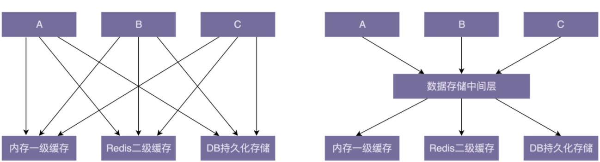

# 规范与重构

## 为什么要重构（why）

重构是一种对软件内部结构的改善，目的是在不改变软件的可见行为的情况下，使其更易理解，修改成本更低。”

- 重构是时刻保证代码质量的一个极其有效的手段，不至于让代码腐化到无可救药的地步。
- 优秀的代码或架构不是一开始就能完全设计好的，就像优秀的公司和产品也都是迭代出来的。
- 重构是避免过度设计的有效手段。在我们维护代码的过程中，真正遇到问题的时候，再对代码进行重构，能有效避免前期投入太多时间做过度的设计，做到有的放矢。

## 什么是单元测试

单元测试由研发工程师自己来编写，用来测试自己写的代码的正确性。我们常常将它跟集成测试放到一块来对比。单元测试相对于集成测试（Integration Testing）来说，测试的粒度更小一些。集成测试的测试对象是整个系统或者某个功能模块，比如测试用户注册、登录功能是否正常，是一种端到端（end to end）的测试。而单元测试的测试对象是类或者函数，用来测试一个类和函数是否都按照预期的逻辑执行。这是代码层级的测试。

```java

public class Text {
  private String content;

  public Text(String content) {
    this.content = content;
  }

  /**
   * 将字符串转化成数字，忽略字符串中的首尾空格；
   * 如果字符串中包含除首尾空格之外的非数字字符，则返回null。
   */
  public Integer toNumber() {
    if (content == null || content.isEmpty()) {
      return null;
    }
    //...省略代码实现...
    return null;
  }
}
```

如果我们要测试 Text 类中的 toNumber() 函数的正确性，应该如何编写单元测试呢？

为了保证测试的全面性，针对 toNumber() 函数，我们需要设计下面这样几个测试用例。

- 如果字符串只包含数字：“123”，toNumber() 函数输出对应的整数：123
- 如果字符串是空或者 null，toNumber() 函数返回：null。
- 如果字符串包含首尾空格：“ 123”，“123 ”，“ 123 ”，toNumber() 返回对应的整数：123。
- 如果字符串包含多个首尾空格：“ 123 ”，toNumber() 返回对应的整数：123；
- 如果字符串包含非数字字符：“123a4”，“123 4”，toNumber() 返回 null；

```java

public class Assert {
  public static void assertEquals(Integer expectedValue, Integer actualValue) {
    if (actualValue != expectedValue) {
      String message = String.format(
              "Test failed, expected: %d, actual: %d.", expectedValue, actualValue);
      System.out.println(message);
    } else {
      System.out.println("Test succeeded.");
    }
  }

  public static boolean assertNull(Integer actualValue) {
    boolean isNull = actualValue == null;
    if (isNull) {
      System.out.println("Test succeeded.");
    } else {
      System.out.println("Test failed, the value is not null:" + actualValue);
    }
    return isNull;
  }
}

public class TestCaseRunner {
  public static void main(String[] args) {
    System.out.println("Run testToNumber()");
    new TextTest().testToNumber();

    System.out.println("Run testToNumber_nullorEmpty()");
    new TextTest().testToNumber_nullorEmpty();

    System.out.println("Run testToNumber_containsLeadingAndTrailingSpaces()");
    new TextTest().testToNumber_containsLeadingAndTrailingSpaces();

    System.out.println("Run testToNumber_containsMultiLeadingAndTrailingSpaces()");
    new TextTest().testToNumber_containsMultiLeadingAndTrailingSpaces();

    System.out.println("Run testToNumber_containsInvalidCharaters()");
    new TextTest().testToNumber_containsInvalidCharaters();
  }
}

public class TextTest {
  public void testToNumber() {
    Text text = new Text("123");
    Assert.assertEquals(123, text.toNumber());
  }

  public void testToNumber_nullorEmpty() {
    Text text1 = new Text(null);
    Assert.assertNull(text1.toNumber());

    Text text2 = new Text("");
    Assert.assertNull(text2.toNumber());
  }

  public void testToNumber_containsLeadingAndTrailingSpaces() {
    Text text1 = new Text(" 123");
    Assert.assertEquals(123, text1.toNumber());

    Text text2 = new Text("123 ");
    Assert.assertEquals(123, text2.toNumber());

    Text text3 = new Text(" 123 ");
    Assert.assertEquals(123, text3.toNumber());
  }

  public void testToNumber_containsMultiLeadingAndTrailingSpaces() {
    Text text1 = new Text("  123");
    Assert.assertEquals(123, text1.toNumber());

    Text text2 = new Text("123  ");
    Assert.assertEquals(123, text2.toNumber());

    Text text3 = new Text("  123  ");
    Assert.assertEquals(123, text3.toNumber());
  }

  public void testToNumber_containsInvalidCharaters() {
    Text text1 = new Text("123a4");
    Assert.assertNull(text1.toNumber());

    Text text2 = new Text("123 4");
    Assert.assertNull(text2.toNumber());
  }
}
```


## 单元测试作用

1. 单元测试能有效地帮你发现代码中的 bug

2. 写单元测试能帮你发现代码设计上的问题

   代码的可测试性是评判代码质量的一个重要标准。对于一段代码，如果很难为其编写单元测试，或者单元测试写起来很吃力，需要依靠单元测试框架里很高级的特性才能完成，那往往就意味着代码设计得不够合理，比如，没有使用依赖注入、大量使用静态函数、全局变量、代码高度耦合等。

3. 单元测试是对集成测试的有力补充

4. 写单元测试的过程本身就是代码重构的过程

5. 阅读单元测试能帮助你快速熟悉代码

## 如何编写单元测试？

oNumber() 函数的测试用例，我们利用 Junit 单元测试框架重新实现一下，具体代码如下所示

```java

import org.junit.Assert;
import org.junit.Test;

public class TextTest {
  @Test
  public void testToNumber() {
    Text text = new Text("123");
    Assert.assertEquals(new Integer(123), text.toNumber());
  }

  @Test
  public void testToNumber_nullorEmpty() {
    Text text1 = new Text(null);
    Assert.assertNull(text1.toNumber());

    Text text2 = new Text("");
    Assert.assertNull(text2.toNumber());
  }

  @Test
  public void testToNumber_containsLeadingAndTrailingSpaces() {
    Text text1 = new Text(" 123");
    Assert.assertEquals(new Integer(123), text1.toNumber());

    Text text2 = new Text("123 ");
    Assert.assertEquals(new Integer(123), text2.toNumber());

    Text text3 = new Text(" 123 ");
    Assert.assertEquals(new Integer(123), text3.toNumber());
  }

  @Test
  public void testToNumber_containsMultiLeadingAndTrailingSpaces() {
    Text text1 = new Text("  123");
    Assert.assertEquals(new Integer(123), text1.toNumber());

    Text text2 = new Text("123  ");
    Assert.assertEquals(new Integer(123), text2.toNumber());

    Text text3 = new Text("  123  ");
    Assert.assertEquals(new Integer(123), text3.toNumber());
  }

  @Test
  public void testToNumber_containsInvalidCharaters() {
    Text text1 = new Text("123a4");
    Assert.assertNull(text1.toNumber());

    Text text2 = new Text("123 4");
    Assert.assertNull(text2.toNumber());
  }
}
```


## 代码可测试性

如下代码中，Transaction 是简化之后的一个电商系统的交易类，用来记录每笔订单交易的情况。Transaction 类中的 execute() 函数负责执行转账操作，将钱从买家的钱包转到卖家的钱包中。真正的转账操作是通过调用 WalletRpcService RPC 服务来完成的。除此之外，代码中还涉及一个分布式锁 DistributedLock 单例类，用来避免 Transaction 并发执行，导致用户的钱被重复转出。

```java

public class Transaction {
  private String id;
  private Long buyerId;
  private Long sellerId;
  private Long productId;
  private String orderId;
  private Long createTimestamp;
  private Double amount;
  private STATUS status;
  private String walletTransactionId;
  
  // ...get() methods...
  
  public Transaction(String preAssignedId, Long buyerId, Long sellerId, Long productId, String orderId) {
    if (preAssignedId != null && !preAssignedId.isEmpty()) {
      this.id = preAssignedId;
    } else {
      this.id = IdGenerator.generateTransactionId();
    }
    if (!this.id.startWith("t_")) {
      this.id = "t_" + preAssignedId;
    }
    this.buyerId = buyerId;
    this.sellerId = sellerId;
    this.productId = productId;
    this.orderId = orderId;
    this.status = STATUS.TO_BE_EXECUTD;
    this.createTimestamp = System.currentTimestamp();
  }
  
  public boolean execute() throws InvalidTransactionException {
    if ((buyerId == null || (sellerId == null || amount < 0.0) {
      throw new InvalidTransactionException(...);
    }
    if (status == STATUS.EXECUTED) return true;
    boolean isLocked = false;
    try {
      isLocked = RedisDistributedLock.getSingletonIntance().lockTransction(id);
      if (!isLocked) {
        return false; // 锁定未成功，返回false，job兜底执行
      }
      if (status == STATUS.EXECUTED) return true; // double check
      long executionInvokedTimestamp = System.currentTimestamp();
      if (executionInvokedTimestamp - createdTimestap > 14days) {
        this.status = STATUS.EXPIRED;
        return false;
      }
      WalletRpcService walletRpcService = new WalletRpcService();
      String walletTransactionId = walletRpcService.moveMoney(id, buyerId, sellerId, amount);
      if (walletTransactionId != null) {
        this.walletTransactionId = walletTransactionId;
        this.status = STATUS.EXECUTED;
        return true;
      } else {
        this.status = STATUS.FAILED;
        return false;
      }
    } finally {
      if (isLocked) {
       RedisDistributedLock.getSingletonIntance().unlockTransction(id);
      }
    }
  }
}
```

对比上面的Text 类的代码，这段代码要复杂很多。如果让你给这段代码编写单元测试，你会如何来写呢？

在 Transaction 类中，主要逻辑集中在 execute() 函数中，所以它是我们测试的重点对象。为了尽可能全面覆盖各种正常和异常情况，针对这个函数，我设计了下面 6 个测试用例。

- 正常情况下，交易执行成功，回填用于对账（交易与钱包的交易流水）用的 walletTransactionId，交易状态设置为 EXECUTED，函数返回 true。
- buyerId、sellerId 为 null、amount 小于 0，返回 InvalidTransactionException。
- 交易已过期（createTimestamp 超过 14 天），交易状态设置为 EXPIRED，返回 false。
- 交易已经执行了（status==EXECUTED），不再重复执行转钱逻辑，返回 true。
- 钱包（WalletRpcService）转钱失败，交易状态设置为 FAILED，函数返回 false。
- 交易正在执行着，不会被重复执行，函数直接返回 false。

我们就来看测试用例 1 的代码实现

```java

public void testExecute() {
  Long buyerId = 123L;
  Long sellerId = 234L;
  Long productId = 345L;
  Long orderId = 456L;
  Transction transaction = new Transaction(null, buyerId, sellerId, productId, orderId);
  boolean executedResult = transaction.execute();
  assertTrue(executedResult);
}
```

execute() 函数的执行依赖两个外部的服务，一个是 RedisDistributedLock，一个 WalletRpcService。这就导致上面的单元测试代码存在下面几个问题。

- 如果要让这个单元测试能够运行，我们需要搭建 Redis 服务和 Wallet RPC 服务。搭建和维护的成本比较高。
- 我们还需要保证将伪造的 transaction 数据发送给 Wallet RPC 服务之后，能够正确返回我们期望的结果，然而 Wallet RPC 服务有可能是第三方（另一个团队开发维护的）的服务，并不是我们可控的。换句话说，并不是我们想让它返回什么数据就返回什么。
- Transaction 的执行跟 Redis、RPC 服务通信，需要走网络，耗时可能会比较长，对单元测试本身的执行性能也会有影响。
- 网络的中断、超时、Redis、RPC 服务的不可用，都会影响单元测试的执行。

我们回到单元测试的定义上来看一下。单元测试主要是测试程序员自己编写的代码逻辑的正确性，并非是端到端的集成测试，它不需要测试所依赖的外部系统（分布式锁、Wallet RPC 服务）的逻辑正确性。所以，如果代码中依赖了外部系统或者不可控组件，比如，需要依赖数据库、网络通信、文件系统等，那我们就需要将被测代码与外部系统解依赖，而这种解依赖的方法就叫作“mock”。所谓的 mock 就是用一个“假”的服务替换真正的服务。mock 的服务完全在我们的控制之下，模拟输出我们想要的数据。

我们通过继承 WalletRpcService 类，并且重写其中的 moveMoney() 函数的方式来实现 mock。具体的代码实现如下所示。通过 mock 的方式，我们可以让 moveMoney() 返回任意我们想要的数据，完全在我们的控制范围内，并且不需要真正进行网络通信。

```java

public class MockWalletRpcServiceOne extends WalletRpcService {
  public String moveMoney(Long id, Long fromUserId, Long toUserId, Double amount) {
    return "123bac";
  } 
}

public class MockWalletRpcServiceTwo extends WalletRpcService {
  public String moveMoney(Long id, Long fromUserId, Long toUserId, Double amount) {
    return null;
  } 
}
```

因为 WalletRpcService 是在 execute() 函数中通过 new 的方式创建的，我们无法动态地对其进行替换。也就是说，Transaction 类中的 execute() 方法的可测试性很差，需要通过重构来让其变得更容易测试。该如何重构这段代码呢？依赖注入是实现代码可测试性的最有效的手段。我们可以应用依赖注入，将 WalletRpcService 对象的创建反转给上层逻辑，在外部创建好之后，再注入到 Transaction 类中。重构之后的 Transaction 类的代码如下所示：

```java

public class Transaction {
  //...
  // 添加一个成员变量及其set方法
  private WalletRpcService walletRpcService;
  
  public void setWalletRpcService(WalletRpcService walletRpcService) {
    this.walletRpcService = walletRpcService;
  }
  // ...
  public boolean execute() {
    // ...
    // 删除下面这一行代码
    // WalletRpcService walletRpcService = new WalletRpcService();
    // ...
  }
}
```

现在，我们就可以在单元测试中，非常容易地将 WalletRpcService 替换成 MockWalletRpcServiceOne 或 WalletRpcServiceTwo 了。重构之后的代码对应的单元测试如下所示：

```java

public void testExecute() {
  Long buyerId = 123L;
  Long sellerId = 234L;
  Long productId = 345L;
  Long orderId = 456L;
  Transction transaction = new Transaction(null, buyerId, sellerId, productId, orderId);
  // 使用mock对象来替代真正的RPC服务
  transaction.setWalletRpcService(new MockWalletRpcServiceOne()):
  boolean executedResult = transaction.execute();
  assertTrue(executedResult);
  assertEquals(STATUS.EXECUTED, transaction.getStatus());
}
```

WalletRpcService 的 mock 和替换问题解决了，我们再来看 RedisDistributedLock。它的 mock 和替换要复杂一些，主要是因为 RedisDistributedLock 是一个单例类。单例相当于一个全局变量，我们无法 mock（无法继承和重写方法），也无法通过依赖注入的方式来替换。

我们可以对 transaction 上锁这部分逻辑重新封装一下。具体代码实现如下所示：

```java

public class TransactionLock {
  public boolean lock(String id) {
    return RedisDistributedLock.getSingletonIntance().lockTransction(id);
  }
  
  public void unlock() {
    RedisDistributedLock.getSingletonIntance().unlockTransction(id);
  }
}

public class Transaction {
  //...
  private TransactionLock lock;
  
  public void setTransactionLock(TransactionLock lock) {
    this.lock = lock;
  }
 
  public boolean execute() {
    //...
    try {
      isLocked = lock.lock();
      //...
    } finally {
      if (isLocked) {
        lock.unlock();
      }
    }
    //...
  }
}
```

针对重构过的代码，我们的单元测试代码修改为下面这个样子。这样，我们就能在单元测试代码中隔离真正的 RedisDistributedLock 分布式锁这部分逻辑了。

```java

public void testExecute() {
  Long buyerId = 123L;
  Long sellerId = 234L;
  Long productId = 345L;
  Long orderId = 456L;
  
  TransactionLock mockLock = new TransactionLock() {
    public boolean lock(String id) {
      return true;
    }
  
    public void unlock() {}
  };
  
  Transction transaction = new Transaction(null, buyerId, sellerId, productId, orderId);
  transaction.setWalletRpcService(new MockWalletRpcServiceOne());
  transaction.setTransactionLock(mockLock);
  boolean executedResult = transaction.execute();
  assertTrue(executedResult);
  assertEquals(STATUS.EXECUTED, transaction.getStatus());
}
```

现在，我们再来看测试用例 3：交易已过期（createTimestamp 超过 14 天），交易状态设置为 EXPIRED，返回 false。针对这个单元测试用例，我们还是先把代码写出来，然后再来分析。

```java

public void testExecute_with_TransactionIsExpired() {
  Long buyerId = 123L;
  Long sellerId = 234L;
  Long productId = 345L;
  Long orderId = 456L;
  Transction transaction = new Transaction(null, buyerId, sellerId, productId, orderId);
  transaction.setCreatedTimestamp(System.currentTimestamp() - 14days);
  boolean actualResult = transaction.execute();
  assertFalse(actualResult);
  assertEquals(STATUS.EXPIRED, transaction.getStatus());
}
```

上面的代码看似没有任何问题。我们将 transaction 的创建时间 createdTimestamp 设置为 14 天前，也就是说，当单元测试代码运行的时候，transaction 一定是处于过期状态。但是，如果在 Transaction 类中，并没有暴露修改 createdTimestamp 成员变量的 set 方法（也就是没有定义 setCreatedTimestamp() 函数）呢？你可能会说，如果没有 createTimestamp 的 set 方法，我就重新添加一个呗！实际上，这违反了类的封装特性。在 Transaction 类的设计中，createTimestamp 是在交易生成时（也就是构造函数中）自动获取的系统时间，本来就不应该人为地轻易修改，所以，暴露 createTimestamp 的 set 方法，虽然带来了灵活性，但也带来了不可控性。因为，我们无法控制使用者是否会调用 set 方法重设 createTimestamp，而重设 createTimestamp 并非我们的预期行为。

那如果没有针对 createTimestamp 的 set 方法，那测试用例 3 又该如何实现呢？实际上，这是一类比较常见的问题，就是代码中包含跟“时间”有关的“未决行为”逻辑。我们一般的处理方式是将这种未决行为逻辑重新封装。针对 Transaction 类，我们只需要将交易是否过期的逻辑，封装到 isExpired() 函数中即可，具体的代码实现如下所示：

```java

public class Transaction {

  protected boolean isExpired() {
    long executionInvokedTimestamp = System.currentTimestamp();
    return executionInvokedTimestamp - createdTimestamp > 14days;
  }
  
  public boolean execute() throws InvalidTransactionException {
    //...
      if (isExpired()) {
        this.status = STATUS.EXPIRED;
        return false;
      }
    //...
  }
}
```

针对重构之后的代码，测试用例 3 的代码实现如下所示：

```java

public void testExecute_with_TransactionIsExpired() {
  Long buyerId = 123L;
  Long sellerId = 234L;
  Long productId = 345L;
  Long orderId = 456L;
  Transction transaction = new Transaction(null, buyerId, sellerId, productId, orderId) {
    protected boolean isExpired() {
      return true;
    }
  };
  boolean actualResult = transaction.execute();
  assertFalse(actualResult);
  assertEquals(STATUS.EXPIRED, transaction.getStatus());
}
```

## 常见的 Anti-Patterns

通过一个实战案例，讲解了如何利用依赖注入来提高代码的可测试性，以及编写单元测试中最复杂的一部分内容：如何通过 mock、二次封装等方式解依赖外部服务。现在，我们再来总结一下，有哪些典型的、常见的测试性不好的代码，也就是我们常说的 Anti-Patterns。

### 未决行为

所谓的未决行为逻辑就是，代码的输出是随机或者说不确定的，比如，跟时间、随机数有关的代码。

### 全局变量

全局变量是一种面向过程的编程风格，有种种弊端。实际上，滥用全局变量也让编写单元测试变得困难。我举个例子来解释一下。

RangeLimiter 表示一个[-5, 5]的区间，position 初始在 0 位置，move() 函数负责移动 position。其中，position 是一个静态全局变量。RangeLimiterTest 类是为其设计的单元测试，不过，这里面存在很大的问题

```java

public class RangeLimiter {
  private static AtomicInteger position = new AtomicInteger(0);
  public static final int MAX_LIMIT = 5;
  public static final int MIN_LIMIT = -5;

  public boolean move(int delta) {
    int currentPos = position.addAndGet(delta);
    boolean betweenRange = (currentPos <= MAX_LIMIT) && (currentPos >= MIN_LIMIT);
    return betweenRange;
  }
}

public class RangeLimiterTest {
  public void testMove_betweenRange() {
    RangeLimiter rangeLimiter = new RangeLimiter();
    assertTrue(rangeLimiter.move(1));
    assertTrue(rangeLimiter.move(3));
    assertTrue(rangeLimiter.move(-5));
  }

  public void testMove_exceedRange() {
    RangeLimiter rangeLimiter = new RangeLimiter();
    assertFalse(rangeLimiter.move(6));
  }
}
```

上面的单元测试有可能会运行失败。假设单元测试框架顺序依次执行 testMove_betweenRange() 和 testMove_exceedRange() 两个测试用例。在第一个测试用例执行完成之后，position 的值变成了 -1；再执行第二个测试用例的时候，position 变成了 5，move() 函数返回 true，assertFalse 语句判定失败。所以，第二个测试用例运行失败。

### 静态方法

静态方法跟全局变量一样，也是一种面向过程的编程思维。在代码中调用静态方法，有时候会导致代码不易测试。主要原因是静态方法也很难 mock。但是，这个要分情况来看。只有在这个静态方法执行耗时太长、依赖外部资源、逻辑复杂、行为未决等情况下，我们才需要在单元测试中 mock 这个静态方法。除此之外，如果只是类似 Math.abs() 这样的简单静态方法，并不会影响代码的可测试性，因为本身并不需要 mock。

### 复杂继承

相比组合关系，继承关系的代码结构更加耦合、不灵活，更加不易扩展、不易维护。实际上，继承关系也更加难测试。这也印证了代码的可测试性跟代码质量的相关性。

### 高耦合代码

如果一个类职责很重，需要依赖十几个外部对象才能完成工作，代码高度耦合，那我们在编写单元测试的时候，可能需要 mock 这十几个依赖的对象。不管是从代码设计的角度来说，还是从编写单元测试的角度来说，这都是不合理的。

## 解耦

高内聚、松耦合”的特性可以让我们聚焦在某一模块或类中，不需要了解太多其他模块或类的代码，让我们的焦点不至于过于发散，降低了阅读和修改代码的难度。而且，因为依赖关系简单，耦合小，修改代码不至于牵一发而动全身，代码改动比较集中，引入 bug 的风险也就减少了很多。同时，“高内聚、松耦合”的代码可测试性也更加好，容易 mock 或者很少需要 mock 外部依赖的模块或者类。

### 封装与抽象

封装和抽象作为两个非常通用的设计思想，可以应用在很多设计场景中，比如系统、模块、lib、组件、接口、类等等的设计。封装和抽象可以有效地隐藏实现的复杂性，隔离实现的易变性，给依赖的模块提供稳定且易用的抽象接口。

比如，Unix 系统提供的 open() 文件操作函数，我们用起来非常简单，但是底层实现却非常复杂，涉及权限控制、并发控制、物理存储等等。我们通过将其封装成一个抽象的 open() 函数，能够有效控制代码复杂性的蔓延，将复杂性封装在局部代码中。除此之外，因为 open() 函数基于抽象而非具体的实现来定义，所以我们在改动 open() 函数的底层实现的时候，并不需要改动依赖它的上层代码，也符合我们前面提到的“高内聚、松耦合”代码的评判标准。

### 中间层

引入中间层能简化模块或类之间的依赖关系。下面这张图是引入中间层前后的依赖关系对比图。在引入数据存储中间层之前，A、B、C 三个模块都要依赖内存一级缓存、Redis 二级缓存、DB 持久化存储三个模块。在引入中间层之后，三个模块只需要依赖数据存储一个模块即可。从图上可以看出，中间层的引入明显地简化了依赖关系，让代码结构更加清晰。



除此之外，我们在进行重构的时候，引入中间层可以起到过渡的作用，能够让开发和重构同步进行，不互相干扰。比如，某个接口设计得有问题，我们需要修改它的定义，同时，所有调用这个接口的代码都要做相应的改动。如果新开发的代码也用到这个接口，那开发就跟重构冲突了。为了让重构能小步快跑，我们可以分下面四个阶段来完成接口的修改。

- 第一阶段：引入一个中间层，包裹老的接口，提供新的接口定义。
- 第二阶段：新开发的代码依赖中间层提供的新接口。
- 第三阶段：将依赖老接口的代码改为调用新接口。
- 第四阶段：确保所有的代码都调用新接口之后，删除掉老的接口

### 模块化

模块化是构建复杂系统常用的手段。不仅在软件行业，在建筑、机械制造等行业，这个手段也非常有用。对于一个大型复杂系统来说，没有人能掌控所有的细节。之所以我们能搭建出如此复杂的系统，并且能维护得了，最主要的原因就是将系统划分成各个独立的模块，让不同的人负责不同的模块，这样即便在不了解全部细节的情况下，管理者也能协调各个模块，让整个系统有效运转。

