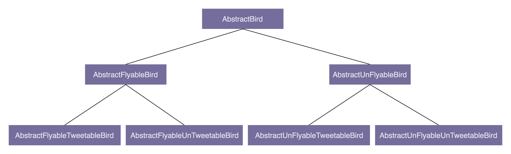

# 设计原则与思想

> 阿来

## 评价代码好坏的常用标准

1. **可维护性（maintainability）**

   所谓的“维护”无外乎就是修改 bug、修改老的代码、添加新的代码之类的工作。所谓“代码易维护”就是指，在不破坏原有代码设计、不引入新的 bug 的情况下，能够快速地修改或者添加代码。所谓“代码不易维护”就是指，修改或者添加代码需要冒着极大的引入新 bug 的风险，并且需要花费很长的时间才能完成。

2. **可读性（readability）**

   软件设计大师 Martin Fowler 曾经说过：“Any fool can write code that a computer can understand. Good programmers write code that humans can understand.”。代码的可读性应该是评价代码质量最重要的指标之一。我们在编写代码的时候，时刻要考虑到代码是否易读、易理解。除此之外，代码的可读性在非常大程度上会影响代码的可维护性。实际上，code review 是一个很好的测验代码可读性的手段。如果你的同事可以轻松地读懂你写的代码，那说明你的代码可读性很好；如果同事在读你的代码时，有很多疑问，那就说明你的代码可读性有待提高了。

3. **可扩展性（extensibility）**

   可扩展性也是一个评价代码质量非常重要的标准。它表示我们的代码应对未来需求变化的能力。跟可读性一样，代码是否易扩展也很大程度上决定代码是否易维护。说直白点就是，代码预留了一些功能扩展点，你可以把新功能代码，直接插到扩展点上，而不需要因为要添加一个功能而大动干戈，改动大量的原始代码。

4. **灵活性（flexibility）**

   当我们添加一个新的功能代码的时候，原有的代码已经预留好了扩展点，我们不需要修改原有的代码，只要在扩展点上添加新的代码即可

   当我们要实现一个功能的时候，发现原有代码中，已经抽象出了很多底层可以复用的模块、类等代码，我们可以拿来直接使用

5. **简洁性（simplicity）**

   KISS 原则：“Keep It Simple，Stupid”。这个原则说的意思就是，尽量保持代码简单。代码简单、逻辑清晰，也就意味着易读、易维护。

6. **可复用性（reusability）**

   代码的可复用性可以简单地理解为，尽量减少重复代码的编写，复用已有的代码。代码可复用性跟DRY （Don’t Repeat Yourself）这条设计原则的关系挺紧密

7. **可测试性（testability）**

## 面向对象

### 面向对象与面向对象编程语言

面向对象编程的英文缩写是 OOP，全称是 Object Oriented Programming。对应地，面向对象编程语言的英文缩写是 OOPL，全称是 Object Oriented Programming Language。

面向对象的四大特性：封装、抽象、继承、多态。

个人觉得，只要某种编程语言支持类或对象的语法概念，并且以此作为组织代码的基本单元，那就可以被粗略地认为它就是面向对象编程语言了。至于是否有现成的语法机制，完全地支持了面向对象编程的四大特性、是否对四大特性有所取舍和优化，可以不作为判定的标准。基于此，我们才有了前面的说法，按照严格的定义，很多语言都不能算得上面向对象编程语言，但按照不严格的定义来讲，现在流行的大部分编程语言都是面向对象编程语言。

### 面向对象分析和面向对象设计

面向对象分析英文缩写是 OOA，全称是 Object Oriented Analysis；面向对象设计的英文缩写是 OOD，全称是 Object Oriented Design。OOA、OOD、OOP 三个连在一起就是面向对象分析、设计、编程（实现），正好是面向对象软件开发要经历的三个阶段。

面向对象分析就是要搞清楚做什么，面向对象设计就是要搞清楚怎么做，面向对象编程就是将分析和设计的的结果翻译成代码的过程

### 封装（Encapsulation）

装也叫作信息隐藏或者数据访问保护。类通过暴露有限的访问接口，授权外部仅能通过类提供的方式（或者叫函数）来访问内部信息或者数据。

对于封装这个特性，我们需要编程语言本身提供一定的语法机制来支持。这个语法机制就是访问权限控制。例子中的 private、public 等关键字就是 Java 语言中的访问权限控制语法。

如果我们对类中属性的访问不做限制，那任何代码都可以访问、修改类中的属性，虽然这样看起来更加灵活，但从另一方面来说，过度灵活也意味着不可控，属性可以随意被以各种奇葩的方式修改，而且修改逻辑可能散落在代码中的各个角落，势必影响代码的可读性、可维护性。

### 抽象（Abstraction）

抽象讲的是如何隐藏方法的具体实现，让调用者只需要关心方法提供了哪些功能，并不需要知道这些功能是如何实现的。

在面向对象编程中，我们常借助编程语言提供的接口类（比如 Java 中的 interface 关键字语法）或者抽象类（比如 Java 中的 abstract 关键字语法）这两种语法机制，来实现抽象这一特性。

```java
public interface IPictureStorage {
  void savePicture(Picture picture);
  Image getPicture(String pictureId);
  void deletePicture(String pictureId);
  void modifyMetaInfo(String pictureId, PictureMetaInfo metaInfo);
}

public class PictureStorage implements IPictureStorage {
  // ...省略其他属性...
  @Override
  public void savePicture(Picture picture) { ... }
  @Override
  public Image getPicture(String pictureId) { ... }
  @Override
  public void deletePicture(String pictureId) { ... }
  @Override
  public void modifyMetaInfo(String pictureId, PictureMetaInfo metaInfo) { ... }
}
```

我们利用 Java 中的 interface 接口语法来实现抽象特性。调用者在使用图片存储功能的时候，只需要了解 IPictureStorage 这个接口类暴露了哪些方法就可以了，不需要去查看 PictureStorage 类里的具体实现逻辑。

纯的 PictureStorage 类本身就满足抽象特性。类的方法是通过编程语言中的“函数”这一语法机制来实现的。通过函数包裹具体的实现逻辑，这本身就是一种抽象。调用者在使用函数的时候，并不需要去研究函数内部的实现逻辑，只需要通过函数的命名、注释或者文档，了解其提供了什么功能，就可以直接使用了

换一个角度来考虑，我们在定义（或者叫命名）类的方法的时候，也要有抽象思维，不要在方法定义中，暴露太多的实现细节，以保证在某个时间点需要改变方法的实现逻辑的时候，不用去修改其定义。举个简单例子，比如 getAliyunPictureUrl() 就不是一个具有抽象思维的命名，因为某一天如果我们不再把图片存储在阿里云上，而是存储在私有云上，那这个命名也要随之被修改。相反，如果我们定义一个比较抽象的函数，比如叫作 getPictureUrl()，那即便内部存储方式修改了，我们也不需要修改命名。

### 继承（Inheritance）

继承最大的一个好处就是代码复用。

如果我们再上升一个思维层面，去思考继承这一特性，可以这么理解：我们代码中有一个猫类，有一个哺乳动物类。猫属于哺乳动物，从人类认知的角度上来说，是一种 is-a 关系。我们通过继承来关联两个类，反应真实世界中的这种关系，非常符合人类的认知，而且，从设计的角度来说，也有一种结构美感。

### 多态（Polymorphism）

态是指子类可以替换父类，在实际的代码运行过程中，调用子类的方法实现

对于多态特性的实现方式，除了利用“继承加方法重写”这种实现方式之外，我们还有比较常见的的实现方式，是利用接口类语法。

多态特性能提高代码的可扩展性和复用性。

除此之外，多态也是很多设计模式、设计原则、编程技巧的代码实现基础，比如策略模式、基于接口而非实现编程、依赖倒置原则、里式替换原则、利用多态去掉冗长的 if-else 语句等等

### 面向过程与面向对象

- 面向过程编程也是一种编程范式或编程风格。它以过程（可以理解为方法、函数、操作）作为组织代码的基本单元，以数据（可以理解为成员变量、属性）与方法相分离为最主要的特点。面向过程风格是一种流程化的编程风格，通过拼接一组顺序执行的方法来操作数据完成一项功能。
- 面向过程编程语言首先是一种编程语言。它最大的特点是不支持类和对象两个语法概念，不支持丰富的面向对象编程特性（比如继承、多态、封装），仅支持面向过程编程。
- OOP 更加能够应对大规模复杂程序的开发
- OOP 风格的代码更易复用、易扩展、易维护

### “伪”面向对象

有些代码看起来是面向对象，实则是面向过程。

1. **滥用 getter、setter 方法**

   滥用getter、setter 方法违反了面向对象编程的封装特性，相当于将面向对象编程风格退化成了面向过程编程风格。

   ```java
   public class ShoppingCart {
     private int itemsCount;
     private double totalPrice;
     private List<ShoppingCartItem> items = new ArrayList<>();
     
     public int getItemsCount() {
       return this.itemsCount;
     }
     
     public void setItemsCount(int itemsCount) {
       this.itemsCount = itemsCount;
     }
     
     public double getTotalPrice() {
       return this.totalPrice;
     }
     
     public void setTotalPrice(double totalPrice) {
       this.totalPrice = totalPrice;
     }
   
     public List<ShoppingCartItem> getItems() {
       return this.items;
     }
     
     public void addItem(ShoppingCartItem item) {
       items.add(item);
       itemsCount++;
       totalPrice += item.getPrice();
     }
     // ...省略其他方法...
   }
   ```

   `ShoppingCart`为一个购物车类，`itemsCount`为购物中的商品数量，`totalPrice`为购物车中的总的价格。`items`代表购物车中的商品集合。很明显三者存在关联跟统一的关系。上述代码存在以下问题：

   1. `itemsCount`跟`totalPrice`提供了`setter`方法，可以随意被客户端修改，容易造成跟`items`不一致。
   2. `items`提供了`getter`方法。客户端可以修修改`items`中的数据或是改变对象的引用。也会造成数据的不一致。

   修改：

   ```java
   public class ShoppingCart {
       private int itemsCount;
       private double totalPrice;
       private List<ShoppingCartItem> items = new ArrayList<>();
       public int getItemsCount() {
           return itemsCount;
       }
       public double getTotalPrice() {
           return totalPrice;
       }
       public void addItem(ShoppingCartItem item) {
           items.add(item);
           itemsCount++;
           totalPrice += item.getPrice();
       }
       public List<ShoppingCartItem> getItems() {
           return  Collections.unmodifiableList(this.items);
       }
   }
   ```

   面向对象封装的定义是：通过访问权限控制，隐藏内部数据，外部仅能通过类提供的有限的接口访问、修改内部数据。所以，暴露不应该暴露的 setter 方法，明显违反了面向对象的封装特性。数据没有访问权限控制，任何代码都可以随意修改它，代码就退化成了面向过程编程风格的了。

2. **滥用全局变量和全局方法**

   项目中常用到`Constants`和`Utils`；静态方法将方法与数据分离，破坏了封装特性，是典型的面向过程风格。

   ```java
   
   public class Constants {
     public static final String MYSQL_ADDR_KEY = "mysql_addr";
     public static final String MYSQL_DB_NAME_KEY = "db_name";
     public static final String MYSQL_USERNAME_KEY = "mysql_username";
     public static final String MYSQL_PASSWORD_KEY = "mysql_password";
     
     public static final String REDIS_DEFAULT_ADDR = "192.168.7.2:7234";
     public static final int REDIS_DEFAULT_MAX_TOTAL = 50;
     public static final int REDIS_DEFAULT_MAX_IDLE = 50;
     public static final int REDIS_DEFAULT_MIN_IDLE = 20;
     public static final String REDIS_DEFAULT_KEY_PREFIX = "rt:";
     
     // ...省略更多的常量定义...
   }
   ```

   存在问题：

   1. 不好维护：多个开发人员可能都会修改此类，此类会越来越大，同时还会发生代码冲突。
   2. 增加编译时间。常量增多意味着依赖的类也多。编译就耗时。
   3. 影响代码的复用性：如果我们要在另一个项目中，复用本项目开发的某个类，而这个类又依赖 Constants 类。即便这个类只依赖 Constants 类中的一小部分常量，我们仍然需要把整个 Constants 类也一并引入，也就引入了很多无关的常量到新的项目中

   更改思路：

   1. 将`Constants`类功能拆解，如`MySqlContants`,`RedisConstants`
   2. 不单独设立`Constants`类，而是哪个类用到了直接定义在哪各类。如`RedisConfig`定义`Redis`配置相关的常量。

   `Utils`类存在的初衷：如果我们有两个类 A 和 B，它们要用到一块相同的功能逻辑；而且A 类和 B 类并不一定具有继承关系。为了避免代码重复，这个时候，我们就可以把它定义为只包含静态方法的 Utils 类了。

   实际上，只包含静态方法不包含任何属性的 Utils 类，是彻彻底底的面向过程的编程风格。但这并不是说，我们就要杜绝使用 Utils 类了。实际上，从刚刚讲的 Utils 类存在的目的来看，它在软件开发中还是挺有用的，能解决代码复用问题。所以，这里并不是说完全不能用 Utils 类，而是说，要尽量避免滥用，不要不加思考地随意去定义 Utils 类。

   我们设计 Utils 类的时候，最好也能细化一下，针对不同的功能，设计不同的 `Utils `类，比如 `FileUtils`、`IOUtils`、`StringUtils`、`UrlUtils `等，不要设计一个过于大而全的 Utils 类。

3. 定义数据和方法分离的类

   数据定义在一个类中，方法定义在另一个类中。Web 项目的开发模式中，Controller 层负责暴露接口给前端调用，Service 层负责核心业务逻辑，Repository 层负责数据读写。而在每一层中，我们又会定义相应的 VO（View Object）、BO（Business Object）、Entity。一般情况下，VO、BO、Entity 中只会定义数据，不会定义方法，所有操作这些数据的业务逻辑都定义在对应的 Controller 类、Service 类、Repository 类中。这就是典型的面向过程的编程风格。

## 接口vs抽象类

### 抽象类和接口的区别

先看如何定义抽象类,下面这段代码是一个比较典型的抽象类的使用场景（模板设计模式）

```java

// 抽象类
public abstract class Logger {
  private String name;
  private boolean enabled;
  private Level minPermittedLevel;

  public Logger(String name, boolean enabled, Level minPermittedLevel) {
    this.name = name;
    this.enabled = enabled;
    this.minPermittedLevel = minPermittedLevel;
  }
  
  public void log(Level level, String message) {
    boolean loggable = enabled && (minPermittedLevel.intValue() <= level.intValue());
    if (!loggable) return;
    doLog(level, message);
  }
  
  protected abstract void doLog(Level level, String message);
}
// 抽象类的子类：输出日志到文件
public class FileLogger extends Logger {
  private Writer fileWriter;

  public FileLogger(String name, boolean enabled,
    Level minPermittedLevel, String filepath) {
    super(name, enabled, minPermittedLevel);
    this.fileWriter = new FileWriter(filepath); 
  }
  
  @Override
  public void doLog(Level level, String mesage) {
    // 格式化level和message,输出到日志文件
    fileWriter.write(...);
  }
}
// 抽象类的子类: 输出日志到消息中间件(比如kafka)
public class MessageQueueLogger extends Logger {
  private MessageQueueClient msgQueueClient;
  
  public MessageQueueLogger(String name, boolean enabled,
    Level minPermittedLevel, MessageQueueClient msgQueueClient) {
    super(name, enabled, minPermittedLevel);
    this.msgQueueClient = msgQueueClient;
  }
  
  @Override
  protected void doLog(Level level, String mesage) {
    // 格式化level和message,输出到消息中间件
    msgQueueClient.send(...);
  }
}
```

抽象类特点：

1. 不允许被实例化，只能被继承
2. 可以包含属性和方法。方法既可以包含代码实现（比如 Logger 中的 log() 方法），也可以不包含代码实现（比如 Logger 中的 doLog() 方法）
3. 子类继承抽象类，必须实现抽象类中的所有抽象方法。

再看接口的定义

```java

// 接口
public interface Filter {
  void doFilter(RpcRequest req) throws RpcException;
}
// 接口实现类：鉴权过滤器
public class AuthencationFilter implements Filter {
  @Override
  public void doFilter(RpcRequest req) throws RpcException {
    //...鉴权逻辑..
  }
}
// 接口实现类：限流过滤器
public class RateLimitFilter implements Filter {
  @Override
  public void doFilter(RpcRequest req) throws RpcException {
    //...限流逻辑...
  }
}
// 过滤器使用demo
public class Application {
  // filters.add(new AuthencationFilter());
  // filters.add(new RateLimitFilter());
  private List<Filter> filters = new ArrayList<>();
  
  public void handleRpcRequest(RpcRequest req) {
    try {
      for (Filter filter : fitlers) {
        filter.doFilter(req);
      }
    } catch(RpcException e) {
      // ...处理过滤结果...
    }
    // ...省略其他处理逻辑...
  }
}
```

接口特点：

1. 接口不能包含属性（也就是成员变量）
2. 可以有默认方法

### 抽象类的作用

抽象类不能实例化，只能被继承。而前面的章节中，我们还讲到，继承能解决代码复用的问题。所以，抽象类也是为代码复用而生的。多个子类可以继承抽象类中定义的属性和方法，避免在子类中，重复编写相同的代码。不过，既然继承本身就能达到代码复用的目的，而继承也并不要求父类一定是抽象类，那我们不使用抽象类，照样也可以实现继承和复用。从这个角度上来讲，我们貌似并不需要抽象类这种语法呀。该进`Logger`使其不是抽象类，其他两个类依然继承他

```java
public class Logger {
    private String name;
    private boolean enabled;
    private Level minPermittedLevel;

    public Logger(String name, boolean enabled, Level minPermittedLevel) {
        this.name = name;
        this.enabled = enabled;
        this.minPermittedLevel = minPermittedLevel;
    }

    protected boolean isLoggable() {
        boolean loggable = enabled &&
                (minPermittedLevel.intValue() <= level.intValue());
        return loggable;
    }
}
public class FileLogger extends Logger {
    private Writer fileWriter;
    public FileLogger(String name, boolean enabled, Level minPermittedLevel,String path) throws IOException {
        super(name, enabled, minPermittedLevel);
        this.fileWriter = new FileWriter(path);
    }

    protected void log(Level level, String message) throws IOException {
    // 格式化level和message,输出到日志文件
        fileWriter.write("...");
    }
}
public class MessageQueueLogger extends Logger {
    private MessageQueueClient msgQueueClient;
    public MessageQueueLogger(String name, boolean enabled,
                              Level minPermittedLevel, MessageQueueClient msgQueueClient) {
        super(name, enabled, minPermittedLevel);
        this.msgQueueClient = msgQueueClient;
    }
    protected void log(Level level, String mesage) {
        // 格式化level和message,输出到消息中间件
        msgQueueClient.send("...");
    }
}
```

这个时候就无法像下面这样使用多态的特性了,因为`Logger`中没有`log()`：

```java
 Logger log  = new FileLogger("access-log", true, Level.WARN, "/users/wangzheng/access.log");
 log.log(Level.ERROR, "This is a test log message."); // eror
```

当然，有也可以在父类`Log`中增加`log`方法，然后空实现，但这样存在以下几个问题

1. 在 `Logger` 中定义一个空的方法，会影响代码的可读性。如果我们不熟悉 `Logger `背后的设计思想，代码注释又不怎么给力，我们在阅读 `Logger` 代码的时候，就可能对为什么定义一个空的 `log() `方法而感到疑惑，需要查看 `Logger`、`FileLogger`、`MessageQueueLogger `之间的继承关系，才能弄明白其设计意图。
2. 当创建一个新的子类继承 `Logger `父类的时候，我们有可能会忘记重新实现 `log()` 方法。之前基于抽象类的设计思路，编译器会强制要求子类重写 `log() `方法，否则会报编译错误。你可能会说，我既然要定义一个新的 `Logger` 子类，怎么会忘记重新实现 `log()` 方法呢？我们举的例子比较简单，`Logger `中的方法不多，代码行数也很少。但是，如果 `Logger `有几百行，有 n 多方法，除非你对 `Logger `的设计非常熟悉，否则忘记重新实现 `log()` 方法，也不是不可能的。

总得来说，以上的实现方式没有抽象类来得优雅。

### 接口的作用

抽象类更多的是为了代码复用，而接口就更侧重于解耦。接口是对行为的一种抽象，相当于一组协议或者契约，你可以联想类比一下 API 接口。调用者只需要关注抽象的接口，不需要了解具体的实现，具体的实现代码对调用者透明。接口实现了约定和实现相分离，可以降低代码间的耦合性，提高代码的可扩展性。


实际上，判断的标准很简单。如果我们要表示一种 is-a 的关系，并且是为了解决代码复用的问题，我们就用抽象类；如果我们要表示一种 has-a 关系，并且是为了解决抽象而非代码复用的问题，那我们就可以使用接口。

从类的继承层次上来看，**抽象类是一种自下而上的设计思路，先有子类的代码重复，然后再抽象成上层的父类（也就是抽象类）。而接口正好相反，它是一种自上而下的设计思路。我们在编程的时候，一般都是先设计接口，再去考虑具体的实现。**

## 为什么基于接口而非实现编程

在这里，基于接口而非实现编程”这条原则中的“接口”，可以理解为编程语言中的接口或者抽象类。

这条原则能非常有效地提高代码质量，之所以这么说，那是因为，应用这条原则，可以将接口和实现相分离，封装不稳定的实现，暴露稳定的接口。上游系统面向接口而非实现编程，不依赖不稳定的实现细节，这样当实现发生变化的时候，上游系统的代码基本上不需要做改动，以此来降低耦合性，提高扩展性。

越抽象、越顶层、越脱离具体某一实现的设计，越能提高代码的灵活性，越能应对未来的需求变化。好的代码设计，不仅能应对当下的需求，而且在将来需求发生变化的时候，仍然能够在不破坏原有代码设计的情况下灵活应对。而抽象就是提高代码扩展性、灵活性、可维护性最有效的手段之一。

假设我们的系统中有很多涉及图片处理和存储的业务逻辑。图片经过处理之后被上传到阿里云上。为了代码复用，我们封装了图片存储相关的代码逻辑，提供了一个统一的 AliyunImageStore 类，供整个系统来使用。具体的代码实现如下所示：

```java

public class AliyunImageStore {
  //...省略属性、构造函数等...
  
  public void createBucketIfNotExisting(String bucketName) {
    // ...创建bucket代码逻辑...
    // ...失败会抛出异常..
  }
  
  public String generateAccessToken() {
    // ...根据accesskey/secrectkey等生成access token
  }
  
  public String uploadToAliyun(Image image, String bucketName, String accessToken) {
    //...上传图片到阿里云...
    //...返回图片存储在阿里云上的地址(url）...
  }
  
  public Image downloadFromAliyun(String url, String accessToken) {
    //...从阿里云下载图片...
  }
}

// AliyunImageStore类的使用举例
public class ImageProcessingJob {
  private static final String BUCKET_NAME = "ai_images_bucket";
  //...省略其他无关代码...
  /**
   * image 待处理的图片，并封装为Image对象
   *
   */
  public void process(AliyunImageStore imageStore,Image image) {
    imageStore.createBucketIfNotExisting(BUCKET_NAME);
    String accessToken = imageStore.generateAccessToken();
    imagestore.uploadToAliyun(image, BUCKET_NAME, accessToken);
  }
}
```

`AliyunImageStore`中的代码看似逻辑清晰，客户端`ImageProcessingJob`的调用也一目了然。但过了一段时间，项目组自建了私有云，不再将图片存储到阿里云了，而是将图片存储到自建私有云上。为了满足这样一个需求的变化，我们该如何修改代码呢？

从客户端`ImageProcessingJob`的`process`看出，我们要全面改动这个方法。而且还整个项目中可能存在许许多多个这样的客户端。这样我们的改动就非常地大。甚至还有改漏的可能。同时，图片存储到阿里云的流程，跟存储到私有云的流程，可能并不是完全一致的。造成这种现象的原因总结如下：

1. `AliyunImageStore ` 类中有些函数命名暴露了实现细节，比如，`uploadToAliyun() ` 和      			`downloadFromAliyun()`
2. 将图片存储到阿里云的流程，跟存储到私有云的流程，可能并不是完全一致的。而``AliyunImageStore `向客户端暴露了所有的实现上传下载的实现细节。
3. 客户端的方法入参中直接饮用了`AliyunImageStore`实现类，新增实现了必定改动。

遵从“基于接口而非实现编程”的原则，从下面3点进行改进：

1. 函数命名不能暴露任何实现细节。如`uploadToAliyun()`改为更抽象的命名方式`upload()`。
2. 封装具体的实现细节。比如，跟阿里云相关的特殊上传（或下载）流程不应该暴露给调用者。我们对上传（或下载）流程进行封装，对外提供一个包裹所有上传（或下载）细节的方法，给调用者使用。
3. 为实现类定义抽象的接口。具体的实现类都依赖统一的接口定义，遵从一致的上传功能协议。客户端依赖接口，而不是具体的实现类来编程。

按照以上思路，重构如下：

```java

public interface ImageStore {
  String upload(Image image, String bucketName);
  Image download(String url);
}

public class AliyunImageStore implements ImageStore {
  //...省略属性、构造函数等...

  public String upload(Image image, String bucketName) {
    createBucketIfNotExisting(bucketName);
    String accessToken = generateAccessToken();
    //...上传图片到阿里云...
    //...返回图片在阿里云上的地址(url)...
  }

  public Image download(String url) {
    String accessToken = generateAccessToken();
    //...从阿里云下载图片...
  }

  private void createBucketIfNotExisting(String bucketName) {
    // ...创建bucket...
    // ...失败会抛出异常..
  }

  private String generateAccessToken() {
    // ...根据accesskey/secrectkey等生成access token
  }
}

// 上传下载流程改变：私有云不需要支持access token
public class PrivateImageStore implements ImageStore  {
  public String upload(Image image, String bucketName) {
    createBucketIfNotExisting(bucketName);
    //...上传图片到私有云...
    //...返回图片的url...
  }

  public Image download(String url) {
    //...从私有云下载图片...
  }

  private void createBucketIfNotExisting(String bucketName) {
    // ...创建bucket...
    // ...失败会抛出异常..
  }
}

// ImageStore的使用举例
public class ImageProcessingJob {
  private static final String BUCKET_NAME = "ai_images_bucket";
  //...省略其他无关代码...
  
  public void process(ImageStore imageStore,Image image) {
    imagestore.upload(image, BUCKET_NAME);// 通用代码
  }
}
```

除此之外，很多人在定义接口的时候，希望通过实现类来反推接口的定义。先把实现类写好，然后看实现类中有哪些方法，照抄到接口定义中。如果按照这种思考方式，就有可能导致接口定义不够抽象，依赖具体的实现。这样的接口设计就没有意义了。不过，如果你觉得这种思考方式更加顺畅，那也没问题，只是将实现类的方法搬移到接口定义中的时候，要有选择性的搬移，不要将跟具体实现相关的方法搬移到接口中，比如`AliyunImageStore`中的 `generateAccessToken()`方法。

总结一下，我们在做软件开发的时候，一定要有**抽象意识、封装意识、接口意识**。在定义接口的时候，不要暴露任何实现细节。接口的定义**只表明做什么，而不是怎么做**。而且，在设计接口的时候，**我们要多思考一下，这样的接口设计是否足够通用，是否能够做到在替换具体的接口实现的时候，不需要任何接口定义的改动。**

### 是否要为每个类定义接口

做任何事情都要讲求一个“度”，过度使用这条原则，非得给每个类都定义接口，接口满天飞，也会导致不必要的开发负担。至于什么时候，该为某个类定义接口，实现基于接口的编程，什么时候不需要定义接口，直接使用实现类编程，我们做权衡的根本依据，还是要回归到设计原则诞生的初衷上来。

“基于接口编程”原则的设计初衷是，将接口和实现相分离，封装不稳定的实现，暴露稳定的接口。上游系统面向接口而非实现编程，不依赖不稳定的实现细节，**这样当实现发生变化的时候，上游系统的代码基本上不需要做改动**，以此来降低代码间的耦合性，提高代码的扩展性。从这个设计初衷上来看，如果在我们的业务场景中，**某个功能只有一种实现方式，未来也不可能被其他实现方式替换，那我们就没有必要为其设计接口**，也没有必要基于接口编程，直接使用实现类就可以了。

除此之外，越是不稳定的系统，我们越是要在代码的扩展性、维护性上下功夫。相反，如果某个系统特别稳定，在开发完之后，基本上不需要做维护，那我们就没有必要为其扩展性，投入不必要的开发时间。

## 多用组合少用继承

### 少用继承的原因

继承是面向对象的四大特性之一，用来表示类之间的 is-a 关系，可以解决代码复用的问题。虽然继承有诸多作用，但**继承层次过深、过复杂，也会影响到代码的可维护性**。

假设我们要设计一个关于鸟的类。我们将“鸟类”这样一个抽象的事物概念，定义为一个抽象类 AbstractBird。所有更细分的鸟，比如麻雀、鸽子、乌鸦等，都继承这个抽象类。

大部分鸟都会飞，那我们可不可以在 `AbstractBird `抽象类中，定义一个 `fly()` 方法呢？答案是否定的。因为有特例，比如鸵鸟就不会飞。鸵鸟继承具有 `fly()` 方法的父类，那鸵鸟就具有“飞”这样的行为，这显然不符合我们对现实世界中事物的认识。当然，你可能会说，我在鸵鸟这个子类中重写（override）`fly() `方法，让它抛出 UnSupportedMethodException 异常不就可以了吗？具体的代码实现如下所示：

```java

public class AbstractBird {
  //...省略其他属性和方法...
  public void fly() { //... }
}

public class Ostrich extends AbstractBird { //鸵鸟
  //...省略其他属性和方法...
  public void fly() {
    throw new UnSupportedMethodException("I can't fly.'");
  }
}
```

这种设计思路虽然可以解决问题，但不够优美。因为除了鸵鸟之外，不会飞的鸟还有很多，比如企鹅。对于这些不会飞的鸟来说，我们都需要重写 `fly()` 方法，抛出异常。这样的设计，一方面，徒增了编码的工作量；另一方面，也违背了我们之后要讲的最小知识原则（Least Knowledge Principle，也叫最少知识原则或者迪米特法则），暴露不该暴露的接口给外部，增加了类使用过程中被误用的概率。

当然，我们再通过 `AbstractBird `类派生出两个更加细分的抽象类：会飞的鸟类 `AbstractFlyableBird `和不会飞的鸟类 `AbstractUnFlyableBird`，让麻雀、乌鸦这些会飞的鸟都继承 `AbstractFlyableBird`，让鸵鸟、企鹅这些不会飞的鸟，都继承 `AbstractUnFlyableBird`类。具体的继承关系如下图所示：


现在增加一种情况，把鸟叫的功能加上。但并不是所有鸟的都能叫。情况就变成了：会飞会叫、不会飞会叫、会飞不会叫、不会飞不会叫。继续按照以上的思路来实现：



如果再增加"是否会下蛋"的情况，那就出现"类爆炸"的情形了。一方面，会导致代码的可读性变差。因为我们要搞清楚某个类具有哪些方法、属性，必须阅读父类的代码、父类的父类的代码……一直追溯到最顶层父类的代码。另一方面，这也破坏了类的封装特性，将父类的实现细节暴露给了子类。子类的实现依赖父类的实现，两者高度耦合，一旦父类代码修改，就会影响所有子类的逻辑。

### 组合的优势

我们可以利用组合（composition）、接口、委托（delegation）三个技术手段，一块儿来解决刚刚继承存在的问题。

```java
public interface Flyable {
  void fly();
}
public interface Tweetable {
  void tweet();
}
public interface EggLayable {
  void layEgg();
}
public class Ostrich implements Tweetable, EggLayable {//鸵鸟
  //... 省略其他属性和方法...
  @Override
  public void tweet() { //... }
  @Override
  public void layEgg() { //... }
}
public class Sparrow impelents Flayable, Tweetable, EggLayable {//麻雀
  //... 省略其他属性和方法...
  @Override
  public void fly() { //... }
  @Override
  public void tweet() { //... }
  @Override
  public void layEgg() { //... }
}
```

不过，我们知道，接口只声明方法，不定义实现。也就是说，每个会下蛋的鸟都要实现一遍 `layEgg() `方法，并且实现逻辑是一样的，这就会导致代码重复的问题。那这个问题又该如何解决呢？我们可以针对三个接口再定义三个实现类，它们分别是：实现了 fly() 方法的 `FlyAbility` 类、实现了 `tweet() `方法的 `TweetAbility `类、实现了 `layEgg()` 方法的 `EggLayAbility `类。然后，通过组合和委托技术来消除代码重复。具体的代码实现如下所示：

```java

public interface Flyable {
  void fly()；
}
public class FlyAbility implements Flyable {
  @Override
  public void fly() { //... }
}
//省略Tweetable/TweetAbility/EggLayable/EggLayAbility

public class Ostrich implements Tweetable, EggLayable {//鸵鸟
  private TweetAbility tweetAbility = new TweetAbility(); //组合
  private EggLayAbility eggLayAbility = new EggLayAbility(); //组合
  //... 省略其他属性和方法...
  @Override
  public void tweet() {
    tweetAbility.tweet(); // 委托
  }
  @Override
  public void layEgg() {
    eggLayAbility.layEgg(); // 委托
  }
}
```

### 该用组合还是继承？

如果类之间的继承结构稳定（不会轻易改变），继承层次比较浅（比如，最多有两层继承关系），继承关系不复杂，我们就可以大胆地使用继承。反之，系统越不稳定，继承层次很深，继承关系复杂，我们就尽量使用组合来替代继承。

除此之外，还有一些设计模式会固定使用继承或者组合。比如，装饰者模式（decorator pattern）、策略模式（strategy pattern）、组合模式（composite pattern）等都使用了组合关系，而模板模式（template pattern）使用了继承关系。

两个类之间不存在is-a关系，但存在重复代码的使用，这个时候可使用组合

```java

public class Url {
  //...省略属性和方法
}
public class Crawler {
  private Url url; // 组合
  public Crawler() {
    this.url = new Url();
  }
  //...
}
public class PageAnalyzer {
  private Url url; // 组合
  public PageAnalyzer() {
    this.url = new Url();
  }
  //..
}
```

组合并不完美，继承也不是一无是处。只要我们控制好它们的副作用、发挥它们各自的优势，在不同的场合下，恰当地选择使用继承还是组合。


## 基于贫血模式的MVC框架

很多业务系统都是基于 MVC 三层架构来开发的。实际上，更确切点讲，这是一种基于贫血模型的 MVC 三层架构开发模式。

虽然这种开发模式已经成为标准的 Web 项目的开发模式，但它却违反了面向对象编程风格，是一种彻彻底底的面向过程的编程风格。

### 基于贫血模型的传统开发模式？

MVC 三层架构中的 M 表示 Model，V 表示 View，C 表示 Controller。它将整个项目分为三层：展示层、逻辑层、数据层。

实际开发过程会根据具体的项目需求，做适当的调整。比如，现在很多 Web 或者 App 项目都是前后端分离的，后端负责暴露接口给前端调用。这种情况下，我们一般就将后端项目分为 Repository 层、Service 层、Controller 层。其中，Repository 层负责数据访问，Service 层负责业务逻辑，Controller 层负责暴露接口。

贫血模式

```java
////////// Controller+VO(View Object) //////////
public class UserController {
  private UserService userService; //通过构造函数或者IOC框架注入
  
  public UserVo getUserById(Long userId) {
    UserBo userBo = userService.getUserById(userId);
    UserVo userVo = [...convert userBo to userVo...];
    return userVo;
  }
}

public class UserVo {//省略其他属性、get/set/construct方法
  private Long id;
  private String name;
  private String cellphone;
}

////////// Service+BO(Business Object) //////////
public class UserService {
  private UserRepository userRepository; //通过构造函数或者IOC框架注入
  
  public UserBo getUserById(Long userId) {
    UserEntity userEntity = userRepository.getUserById(userId);
    UserBo userBo = [...convert userEntity to userBo...];
    return userBo;
  }
}

public class UserBo {//省略其他属性、get/set/construct方法
  private Long id;
  private String name;
  private String cellphone;
}
////////// Repository+Entity //////////
public class UserRepository {
  public UserEntity getUserById(Long userId) { //... }
}

public class UserEntity {//省略其他属性、get/set/construct方法
  private Long id;
  private String name;
  private String cellphone;
}
```

从代码中，我们可以发现，`UserBo` 是一个纯粹的数据结构，只包含数据，不包含任何业务逻辑。业务逻辑集中在 `UserService` 中。我们通过 `UserService `来操作 `UserBo`。换句话说，`Service `层的数据和业务逻辑，被分割为 `BO` 和 `Service `两个类中。像 `UserBo `这样，只包含数据，不包含业务逻辑的类，就叫作贫血模型（Anemic Domain Model）。同理，`UserEntity`、`UserVo `都是基于贫血模型设计的。这种贫血模型将数据与操作分离，破坏了面向对象的封装特性，是一种典型的面向过程的编程风格。

### 基于充血模型的 DDD 开发模式

在贫血模型中，数据和业务逻辑被分割到不同的类中。充血模型（Rich Domain Model）正好相反，数据和对应的业务逻辑被封装到同一个类中。因此，这种充血模型满足面向对象的封装特性，是典型的面向对象编程风格。

领域驱动设计，即 DDD，主要是用来指导如何解耦业务系统，划分业务模块，定义业务领域模型及其交互。

我们知道，除了监控、调用链追踪、API 网关等服务治理系统的开发之外，微服务还有另外一个更加重要的工作，那就是针对公司的业务，合理地做微服务拆分。而领域驱动设计恰好就是用来指导划分服务的。所以，微服务加速了领域驱动设计的盛行。

实际上，基于充血模型的 DDD 开发模式实现的代码，也是按照 MVC 三层架构分层的。Controller 层还是负责暴露接口，Repository 层还是负责数据存取，Service 层负责核心业务逻辑。它跟基于贫血模型的传统开发模式的区别主要在 Service 层。

在基于贫血模型的传统开发模式中，Service 层包含 Service 类和 BO 类两部分，BO 是贫血模型，只包含数据，不包含具体的业务逻辑。业务逻辑集中在 Service 类中。在基于充血模型的 DDD 开发模式中，Service 层包含 Service 类和 Domain 类两部分。Domain 就相当于贫血模型中的 BO。不过，Domain 与 BO 的区别在于它是基于充血模型开发的，既包含数据，也包含业务逻辑。而 Service 类变得非常单薄。总结一下的话就是，基于贫血模型的传统的开发模式，重 Service 轻 BO；基于充血模型的 DDD 开发模式，轻 Service 重 Domain。

### 基于贫血模型为何如此受欢迎

第一点原因是，大部分情况下，我们开发的系统业务可能都比较简单，简单到就是基于 SQL 的 CRUD 操作，所以，我们根本不需要动脑子精心设计充血模型，贫血模型就足以应付这种简单业务的开发工作。

第二点原因是，充血模型的设计要比贫血模型更加有难度。因为充血模型是一种面向对象的编程风格。我们从一开始就要设计好针对数据要暴露哪些操作，定义哪些业务逻辑。

三点原因是，思维已固化，转型有成本。程序员的习惯问题。


什么项目适合使用充血模型的 DDD 开发模式？

刚刚我们讲到，基于贫血模型的传统的开发模式，比较适合业务比较简单的系统开发。相对应的，基于充血模型的 DDD 开发模式，更适合业务复杂的系统开发。比如，包含各种利息计算模型、还款模型等复杂业务的金融系统。

这两种模式非常重要的一个区别是，种不同的开发模式会导致不同的开发流程。基于充血模型的 DDD 开发模式的开发流程，在应对复杂业务系统的开发的时候更加有优势