# git的使用

## 版本管理演变

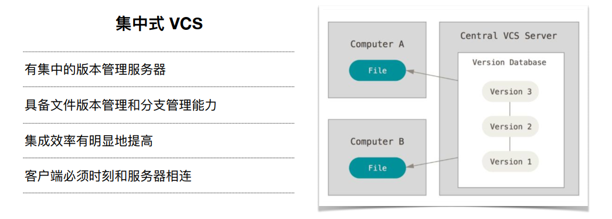

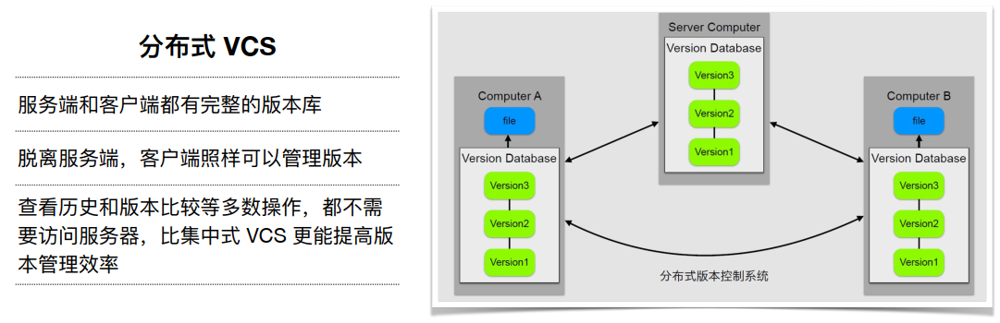

## 配置

### git config

**添加配置**

```bash
git config --local  # 该配置只对仓库生效（在缺省的情况下，默认使用local）
git config --global # 对登陆用户所有仓库有效
git config --system # 对系统的所有用户生效
```

**查询配置 --list**

```bash
git config --list --local # 缺省的情况下会将三个作用域下的配置展示出来
git config --list --global
git config --list --system
```

**设置与清除 --unset**

```bash
git config --unset --local user.name
git config --unset --global user.name
git config --unset --system user.name
# 编辑Git配置文件
git config -e [--local][--global]
```

**使用举例**

```bash
# 新建一个git仓库
$ git init simple
$ cd simple/
$ git config --local user.name 'linmiaolai' # 这里不需要加=号
$ git config --local user.email 'linmiaolai@qq.com'
# 查看 global下的配置信息
$ git config --list --global
http.sslverify=false
user.email=13650968987@163.com
user.name=ocean
# 提交空的commit
$ git commit --allow-empty -m 'Initial'
[master (root-commit) b6f8476] Initial
# 查看提交信息
$ git log
commit b6f8476b4d7c13bb19d5ea277b0701964fa9cffd (HEAD -> master)
Author: linmiaolai <linmiaolai@qq.com>
Date:   Thu Jun 11 22:22:33 2020 +0800

    Initial
# 从上面看出 在仓库下提交时使用的是local下的配置信息
# 在不设置local的情况下 则使用global的配置
$ git init global
$ cd global/
$ git commit --allow-empty -m 'Initial'
$ git log
commit 5c72aba8b0ee891fa834787bfaa37cb9fd8f64e9 (HEAD -> master)
Author: ocean <13650968987@163.com>
Date:   Thu Jun 11 22:31:04 2020 +0800

    Initial
```

## 工作区和暂存区

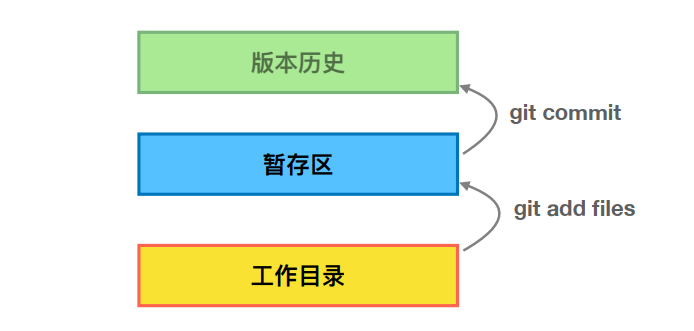

## git对象

### 目录介绍

```bash
# HEAD目录包含当前分支的引用(正在工作的分支引用)
$ cat HEAD
ref: refs/heads/master
# 切换分支再查看
mp)
$ git checkout temp
Already on 'temp'
Administrator@-20191005ZRXKPW MINGW32 /d/votal/docs/项目管理/practice/simple (temp)
$ cat .git/HEAD
ref: refs/heads/temp
# 配置信息存储在config文件中
$ cat .git/config
[core]
        repositoryformatversion = 0
        filemode = false
        bare = false
        logallrefupdates = true
        symlinks = false
        ignorecase = false
[user]
        name = alai
        email = linmiaolai@qq.com
[gui]
        wmstate = normal
        geometry = 841x483+75+75 189 218
# 查看git的引用
$ cd refs/
$ ll
total 0
drwxr-xr-x 1 Administrator 197121 0 六月   14 20:15 heads/ # 对应分支
drwxr-xr-x 1 Administrator 197121 0 六月   11 22:15 tags # 标签可以理解为“里程碑”
$ cd heads/ # 此时可以看到有两个分支了
$ ll
total 2
-rw-r--r-- 1 Administrator 197121 41 六月   12 22:26 master
-rw-r--r-- 1 Administrator 197121 41 六月   14 20:15 temp
$ cat master 
1f0ddace76adb18d01aa5bf7e4e2ce25d13011b1
# 查看对象对应的类型
$ git cat-file -t 1f0ddace76adb1
commit # 表明是一个commit类型
$ git branch -av # 表明查看出的master分支其对应commit跟存放在master文件中的commit是对应的
* master 1f0ddac rename readme.md to Readme.md
  temp   455b5e8 Add test
# 查看指定对象的具体信息
$ git cat-file -p 1f0ddace7
tree 70966bb9ee63c4c78e06faaeae8ed92a66833e0e
parent a188b1ceb2f75f6ac7dc102d27b000c96260f6c7
author alai <linmiaolai@qq.com> 1591971973 +0800
committer alai <linmiaolai@qq.com> 1591971973 +0800

rename readme.md to Readme.md
# 查看objects目录 pack类型表示对两个字母的类型进行了打包
drwxr-xr-x 1 Administrator 197121 0 六月   12 21:52 e3/
drwxr-xr-x 1 Administrator 197121 0 六月   12 08:34 ec/
drwxr-xr-x 1 Administrator 197121 0 六月   12 21:24 ef/
drwxr-xr-x 1 Administrator 197121 0 六月   11 22:15 info/
drwxr-xr-x 1 Administrator 197121 0 六月   11 22:15 pack/
# 随机进入上面看到的2d,会出现一段hash值，将其跟2d进行拼接可得到真正的hash值
# objects：存放对象 .git/objects/ 文件夹中的子文件夹都是以哈希值的前两位字符命名 每个object由40位字符组成，前两位字符用来当文件夹，后38位做文件。
$ git cat-file -t 2dca769e9d9e267d3f0c9615ef3907bdf603696a
tree # 表明是tree类型
# 查看该tree的内容
$ git cat-file -p 2dca769e9d9e267d3f0c9615ef3907bdf603696a
040000 tree 96b67e399c8496ec36cbbbcb776eb924fad7f9a7    images
100644 blob 6ad4c68d567a1a5b415dcfce2010fce1a60b245f    index.html
040000 tree 87b3e92f70e7dfa555f141afeae28a2bc4a343b6    js
100644 blob ec927737da206d0e3924fa01d32991923cbce1ff    readme.txt
040000 tree aee37060401d19e7bd9f80b7b33920a000e96b5b    styles
# 查看blob类型的的内容,即可看到该blob中的具体文件内容
$ git cat-file -p 6ad4c68d567a1a5b415dcfce2010fce1a60b245f
<!DOCTYPE html>
...

```

### commit、tree、blob

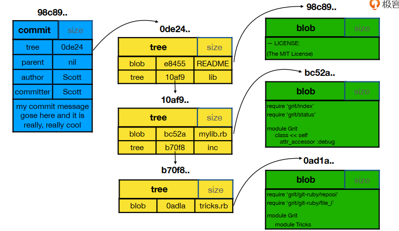

**一个commit会对应一个tree，tree可以理解为是一个文件夹，文件夹下的文件就与blob相对应。**通过`git cat-file p blob(id)`可以看到具体的文件内容

### tree跟blob的产生

在一个裸仓库中，添加一个文件，并使用`add`命令添加到暂存区，接着查看objects目录下的内容，发现出现一个blob

```bash
$ git init watch_git_objects
$ cd watch_git_objects/
$ mkdir doc
$ echo "hello word,git" > doc/readm
$ git add doc/
$ cd objects/
$ ll
total 0
drwxr-xr-x 1 Administrator 197121 0 六月   17 20:25 38/
drwxr-xr-x 1 Administrator 197121 0 六月   17 20:22 info/
drwxr-xr-x 1 Administrator 197121 0 六月   17 20:22 pack/
$ cd 38/
$ ll
total 1
-r--r--r-- 1 Administrator 197121 31 六月   17 20:25 ecbc7649922cb7c9a17271ca3933577f004f67
$ git cat-file -t 38ecbc76
blob
```

接着使用commit命令，查看对应的类型和具体的信息

```bash
$ git commit -m "Add readme"
[master (root-commit) ef7f08e] Add readme
 1 file changed, 1 insertion(+)
 create mode 100644 doc/readme
$ cd .git/objects/
$ ll
total 0
drwxr-xr-x 1 Administrator 197121 0 六月   17 20:25 38/
drwxr-xr-x 1 Administrator 197121 0 六月   17 20:35 68/
drwxr-xr-x 1 Administrator 197121 0 六月   17 20:35 ac/
drwxr-xr-x 1 Administrator 197121 0 六月   17 20:35 ef/
drwxr-xr-x 1 Administrator 197121 0 六月   17 20:22 info/
drwxr-xr-x 1 Administrator 197121 0 六月   17 20:22 pack
$ cd 38 # 这里接着使用ll命令查看到对象的hash值
$ git cat-file -t 38ecbc7
blob
$ git cat-file -p 38ecbc7
hello word,git
$ cd 68
$ git cat-file -t 689a0752c
tree
$ git cat-file -p 689a0752c
100644 blob 38ecbc7649922cb7c9a17271ca3933577f004f67    readme # 这里看到包含的是上面的出现的blob
$ cd ac/
$ git cat-file -t ac538fb6
tree
$ git cat-file -p ac538fb6
040000 tree 689a0752c579dbda3672fcce12de3529ac0c8c62    doc # 这里看到这个tree下面包含的是上面出现的tree
$ cd ef
$ git cat-file -t ef7f08efc66
commit
$ git cat-file -p ef7f08efc66
tree ac538fb6b83d11ee17ba2a6cbb2f126a286efe14
author ocean <13650968987@163.com> 1592397335 +0800
committer ocean <13650968987@163.com> 1592397335 +0800

Add readme

```

总结：一个commit肯定有一个tree，加入为A,如果这commit中提交了文件夹，那么也就是tree A里面会包含另外一个tree，因为tree与文件夹对应，而文件与blob对应。
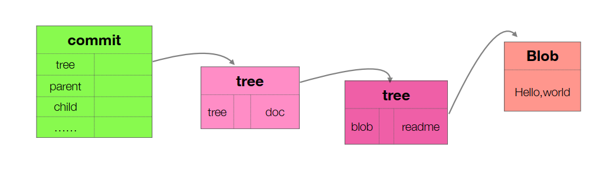

### 分离头指针

先来执行以下命令

```bash
# 查看版本历史
$ git log
commit 1f0ddace76adb18d01aa5bf7e4e2ce25d13011b1 (HEAD -> master)
Author: alai <linmiaolai@qq.com>
Date:   Fri Jun 12 22:26:13 2020 +0800

    rename readme.md to Readme.md

commit a188b1ceb2f75f6ac7dc102d27b000c96260f6c7
Author: alai <linmiaolai@qq.com>
Date:   Fri Jun 12 22:21:21 2020 +0800

    Move readme.txt to readme.md

commit e3c79a061d6f8cbf7beddd9eae7612d78023f05d
Author: alai <linmiaolai@qq.com>
Date:   Fri Jun 12 21:52:49 2020 +0800

    Add refering project

commit 22c84655db6f37f8818434d64b06445587baa119
Author: linmiaolai <linmiaolai@qq.com>
Date:   Fri Jun 12 21:25:16 2020 +0800

    Add js + styles

commit 78c0bba88f578368e873962474c8710962078be7
# 使用checkout命令 然后指定commmit,以下提示，表明正此时正处于分离头指针的状态
$ git checkout e3c79a061d6f8cbf7beddd9eae7612d78023f05d
Note: switching to 'e3c79a061d6f8cbf7beddd9eae7612d78023f05d'.

You are in 'detached HEAD' state. You can look around, make experimental
changes and commit them, and you can discard any commits you make in this
state without impacting any branches by switching back to a branch.

If you want to create a new branch to retain commits you create, you may
do so (now or later) by using -c with the switch command. Example:

  git switch -c <new-branch-name>

Or undo this operation with:

  git switch -

Turn off this advice by setting config variable advice.detachedHead to false

HEAD is now at e3c79a0 Add refering project

```

分离头指针就是：此时的指针的指向是一个commit而不是任何分支，没有与任何分支挂钩，也就是此时的任何commit都处于“游离”状态，除非新建一个分支并产生关联。

```bash
$ vi index.html
$ git status
HEAD detached at e3c79a0
Changes not staged for commit:
  (use "git add <file>..." to update what will be committed)
  (use "git restore <file>..." to discard changes in working directory)
        modified:   index.html

no changes added to commit (use "git add" and/or "git commit -a")
# 直接提交到版本库
$ git commit -am "refering change"
warning: LF will be replaced by CRLF in index.html.
The file will have its original line endings in your working directory
[detached HEAD 7bf67c6] refering change
 1 file changed, 1 insertion(+), 1 deletion(-)
# 查看历史
$ git log
commit 7bf67c601e9ed2735abcb3b7549cff7ca22de3cb (HEAD) # 注意这里
Author: alai <linmiaolai@qq.com>
Date:   Wed Jun 17 21:05:51 2020 +0800

    refering change

commit e3c79a061d6f8cbf7beddd9eae7612d78023f05d
Author: alai <linmiaolai@qq.com>
Date:   Fri Jun 12 21:52:49 2020 +0800

    Add refering project
# 此时切换分支，下面的提示信息就非常明显了
$ git checkout master
Warning: you are leaving 1 commit behind, not connected to
any of your branches:

  7bf67c6 refering change

If you want to keep it by creating a new branch, this may be a good time
to do so with:

 git branch <new-branch-name> 7bf67c6

Switched to branch 'master'
# 查看
$ gitk -all # 并未找到上面的那个commit，在我们没有处理的情况下，git认为其不重要
# 将上面的commit按照git的提示重新建立分支
$ git branch new_refering 7bf67c6
# 再查看时该commit就出现了
$ gitk --all
```

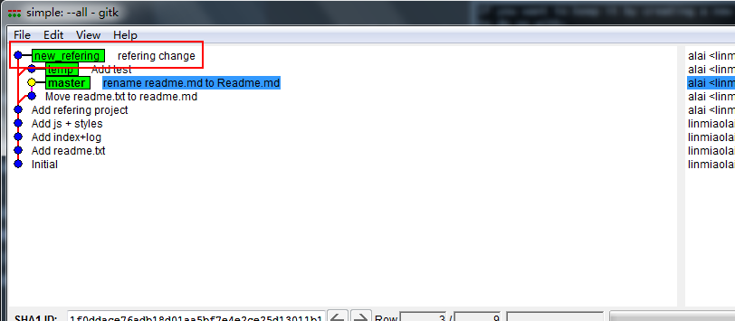

### HEAD跟branch

```bash
# 查看所有的分支
$ git branch -av
* master       1f0ddac rename readme.md to Readme.md
  new_refering 7bf67c6 refering change
  temp         455b5e8 Add test
# 创建新的分支并切换到该分支
$ git checkout -b refering_readme new_refering # 表示基于指定的分支来创建新的分支
Switched to a new branch 'refering_readme'
$ git log -n1 # 从下面可以看出，基于分支创建的新分支，新分支所在的commit与指定的分支最新的commit相同
commit 7bf67c601e9ed2735abcb3b7549cff7ca22de3cb (HEAD -> refering_readme, new_refering) 
Author: alai <linmiaolai@qq.com>
Date:   Wed Jun 17 21:05:51 2020 +0800

    refering change
$ cat .git/HEAD
ref: refs/heads/refering_readme
$ cat .git/refs/heads/refering_readme
7bf67c601e9ed2735abcb3b7549cff7ca22de3cb
$ git cat-file -t 7bf67c601e9ed2735abcb3b7549cff7ca22de3cb
commit

```

HEAD与branch关系：

1. HEAD可以指向某一个commit（如分离头指针），也可与指向branch
2. 新创建分支并切换到该分支时，HEAD指向该分支
3. 分支最终也是出于某个commit的状态

**HEAD的一些使用小技巧**

```bash
# 比较两个commit的差异
$ git diff 7bf67c601 e3c79a061
diff --git a/index.html b/index.html
index 32a5d1c..3d3698e 100644
--- a/index.html
+++ b/index.html
@@ -45,7 +45,7 @@
     </section>
       <footer>
         <p>
-            <a href="https://github.com/TTN-js/unforGITtable">改一下这里参考项目01</a>
+            <a href="https://github.com/TTN-js/unforGITtable">参考项目01</a>
         </p>
     </footer>
     <script src="js/script.js"></script>
# 或者使用
$ git diff HEAD HEAD^
diff --git a/index.html b/index.html
index 32a5d1c..3d3698e 100644
--- a/index.html
+++ b/index.html
@@ -45,7 +45,7 @@
     </section>
       <footer>
         <p>
-            <a href="https://github.com/TTN-js/unforGITtable">改一下这里参考项目01</a>
+            <a href="https://github.com/TTN-js/unforGITtable">参考项目01</a>
         </p>
     </footer>
     <script src="js/script.js"></script>
# 或者
$ git diff HEAD HEAD~1
diff --git a/index.html b/index.html
index 32a5d1c..3d3698e 100644
--- a/index.html
+++ b/index.html
@@ -45,7 +45,7 @@
     </section>
       <footer>
         <p>
-            <a href="https://github.com/TTN-js/unforGITtable">改一下这里参考项目01</a>
+            <a href="https://github.com/TTN-js/unforGITtable">参考项目01</a>
         </p>
     </footer>
     <script src="js/script.js"></script>

```

总结：

1. 一个节点，可以包含多个子节点（checkout 出多个分支）
2. 一个节点可以有多个父节点（多个分支合并）
3. ^是\~都是父节点，区别是跟随数字时候，^2 是第二个父节点，而\~2是父节点的父节点
4. ^和\~可以组合使用,例如 HEAD\~2^2

## 常用场景

### 删除分支

```bash
$ git branch -av
* master          1f0ddac rename readme.md to Readme.md
  new_refering    7bf67c6 refering change
  refering_readme 7bf67c6 refering change
  temp            455b5e8 Add test
  test_branch     22c8465 Add js + styles
# 查看分支的结构
$ gitk --all
```

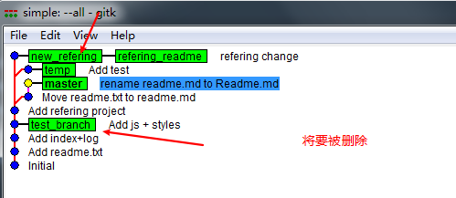

```bash
$ git branch -D test_branch
Deleted branch test_branch (was 22c8465).
$ git branch -d refering_readme
error: The branch 'refering_readme' is not fully merged. # 该提示表明该分支未曾合如到其他的分支，删除有风险，固有该提示
If you are sure you want to delete it, run 'git branch -D refering_readme'.

Administrator@-20191005ZRXKPW MINGW32 /d/votal/docs/项目管理/practice/simple (master)
$ git branch -D refering_readme
Deleted branch refering_readme (was 7bf67c6).

Administrator@-20191005ZRXKPW MINGW32 /d/votal/docs/项目管理/practice/simple (master)
$ gitk --all

```

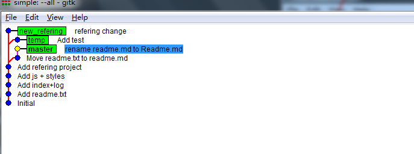

### 修改commit的message

**修改最新的commit的message**

```bash
$ git log -n1
commit 1f0ddace76adb18d01aa5bf7e4e2ce25d13011b1 (HEAD -> master)
Author: alai <linmiaolai@qq.com>
Date:   Fri Jun 12 22:26:13 2020 +0800

    rename readme.md to Readme.md

$ git commit --amend # 此命令之后，进入编辑页面，编辑保存退出
[master ab8c9fa] rename filename readme.md to Readme.md
 Date: Fri Jun 12 22:26:13 2020 +0800
 1 file changed, 0 insertions(+), 0 deletions(-)
 rename readme.md => Readme.md (100%)
$ git log -n1
commit ab8c9fa72603e60d1641e491eb497f6ffcacb965 (HEAD -> master)
Author: alai <linmiaolai@qq.com>
Date:   Fri Jun 12 22:26:13 2020 +0800

    rename filename readme.md to Readme.md

```

**修改老旧commit的message**

```bash
$ git log -n3
commit fc4a242621356d9422f9117002c9a96a2c4035bb (HEAD -> master)
Author: alai <linmiaolai@qq.com>
Date:   Fri Jun 12 22:21:21 2020 +0800

    Move readme.txt to readme.md

commit 1e9a3a1e9e0c46fc843b4da6e05bf92800acacd6
Author: alai <linmiaolai@qq.com>
Date:   Fri Jun 12 21:52:49 2020 +0800

    Add a refering project

commit 22c84655db6f37f8818434d64b06445587baa119
Author: linmiaolai <linmiaolai@qq.com>
Date:   Fri Jun 12 21:25:16 2020 +0800

    Add js + styles
$ git rebase -i 22c84655db6 # commit id要选择需要变更的commit的上一个commit的id,此时进入交互页面，如下图，输入想要的命令后，进入另一个修改messge的页面，保存退出
[detached HEAD e6634bf] Add  refering project
 Date: Fri Jun 12 21:52:49 2020 +0800
 2 files changed, 18 insertions(+), 1 deletion(-)
Successfully rebased and updated refs/heads/master. # 修改成功
$ git log -n3
commit df9dec2ac4f40554a2cf6c8fa997b3c08f1cdf24 (HEAD -> master)
Author: alai <linmiaolai@qq.com>
Date:   Fri Jun 12 22:21:21 2020 +0800

    Move readme.txt to readme.md

commit e6634bff4872a4d0c612beec6addc07e1b294503
Author: alai <linmiaolai@qq.com>
Date:   Fri Jun 12 21:52:49 2020 +0800

    Add  refering project # 这里已经修改成功

commit 22c84655db6f37f8818434d64b06445587baa119
Author: linmiaolai <linmiaolai@qq.com>
Date:   Fri Jun 12 21:25:16 2020 +0800

    Add js + styles

```

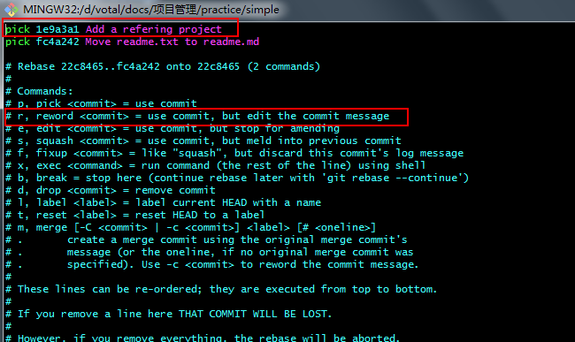

### 整合多个commit为一个commit

整合多个**连续的commit**

```bash
$ git log
commit df9dec2ac4f40554a2cf6c8fa997b3c08f1cdf24 (HEAD -> master)
Author: alai <linmiaolai@qq.com>
Date:   Fri Jun 12 22:21:21 2020 +0800

    Move readme.txt to readme.md

commit e6634bff4872a4d0c612beec6addc07e1b294503
Author: alai <linmiaolai@qq.com>
Date:   Fri Jun 12 21:52:49 2020 +0800

    Add  refering project

commit 22c84655db6f37f8818434d64b06445587baa119
Author: linmiaolai <linmiaolai@qq.com>
Date:   Fri Jun 12 21:25:16 2020 +0800

    Add js + styles

commit 78c0bba88f578368e873962474c8710962078be7
Author: linmiaolai <linmiaolai@qq.com>
Date:   Fri Jun 12 21:23:04 2020 +0800

    Add index+log

commit 5db6f67264369f61b97c802b83459d11991ecc83
Author: linmiaolai <linmiaolai@qq.com>
Date:   Fri Jun 12 08:35:14 2020 +0800

    Add readme.txt

commit b6f8476b4d7c13bb19d5ea277b0701964fa9cffd
Author: linmiaolai <linmiaolai@qq.com>
Date:   Thu Jun 11 22:22:33 2020 +0800

    Initial
# 现在要将“Add  refering project”，“ Add js + styles”，“Add index+log” 这三个合为一个commit的
$ git rebase -i 5db6f6726 # 这个commit id 应该是“Add readme.txt”的commit id
# 如下图 输入对应的命令后，会进入另外一个交互页面 保存退出
[detached HEAD 4834df0] Create a complete web page
 Author: linmiaolai <linmiaolai@qq.com>
 Date: Fri Jun 12 21:23:04 2020 +0800
 4 files changed, 131 insertions(+)
 create mode 100644 images/git-logo.png
 create mode 100644 index.html
 create mode 100644 js/script.js
 create mode 100644 styles/style.css
Successfully rebased and updated refs/heads/master.
$ git log
commit c8af375b2b87b82e12dbcbe0f812cd0cd639822e (HEAD -> master) # 这里的id号也发生了变化
Author: alai <linmiaolai@qq.com>
Date:   Fri Jun 12 22:21:21 2020 +0800

    Move readme.txt to readme.md

commit 4834df000bce82aa37bd037547bab3342f88543c # 这里可以看出已经合并成功了
Author: linmiaolai <linmiaolai@qq.com>
Date:   Fri Jun 12 21:23:04 2020 +0800

    Create a complete web page

    Add index+log

    Add js + styles

    Add  refering project

commit 5db6f67264369f61b97c802b83459d11991ecc83
Author: linmiaolai <linmiaolai@qq.com>
Date:   Fri Jun 12 08:35:14 2020 +0800

    Add readme.txt

commit b6f8476b4d7c13bb19d5ea277b0701964fa9cffd
Author: linmiaolai <linmiaolai@qq.com>
Date:   Thu Jun 11 22:22:33 2020 +0800

    Initial

```

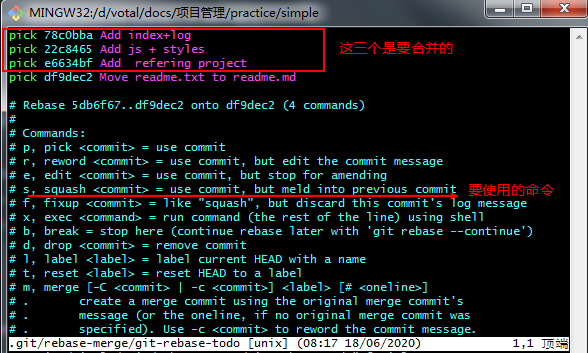

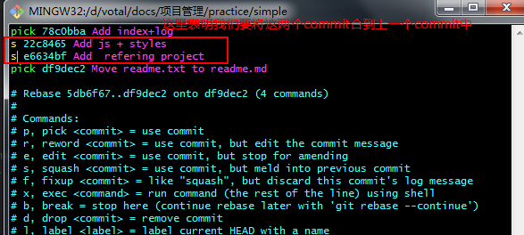

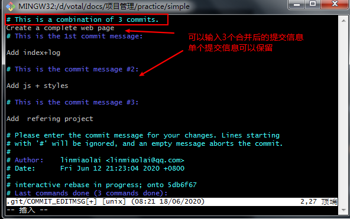

**整合不连续的commit**

```bash
$ git log
commit c8af375b2b87b82e12dbcbe0f812cd0cd639822e (HEAD -> master)
Author: alai <linmiaolai@qq.com>
Date:   Fri Jun 12 22:21:21 2020 +0800

    Move readme.txt to readme.md

commit 4834df000bce82aa37bd037547bab3342f88543c
Author: linmiaolai <linmiaolai@qq.com>
Date:   Fri Jun 12 21:23:04 2020 +0800

    Create a complete web page

    Add index+log

    Add js + styles

    Add  refering project

commit 5db6f67264369f61b97c802b83459d11991ecc83
Author: linmiaolai <linmiaolai@qq.com>
Date:   Fri Jun 12 08:35:14 2020 +0800

    Add readme.txt

commit b6f8476b4d7c13bb19d5ea277b0701964fa9cffd
Author: linmiaolai <linmiaolai@qq.com>
Date:   Thu Jun 11 22:22:33 2020 +0800

    Initial

```

如上所示，现在要将“Move readme.txt to readme.md”这个commit跟“Add readme.txt”这个commit进行合并成一个commit，可以选择“b6f8476b4”这个commit作为rebase也可以选择“5db6f672643”这个commit作为rebase。下面演示后者

```bash
$ git rebase -i 5db6f672643 # 单执行该命令时，出现下面交互界面，很明显少了我们要合并的一个commit,这个时候需要手动添加进来。
```

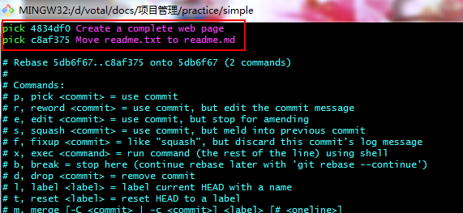

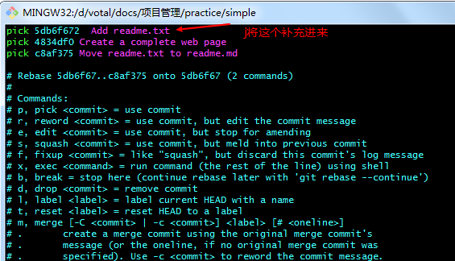

如上图，将要合并的commit补充进来后，将要合并的两个分支放在一起，然后更改命令
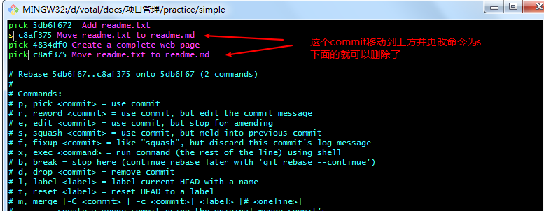

完成上述操作后保存退出，出现了下面的提示

```bash
$ git rebase -i 5db6f6726436
interactive rebase in progress; onto 5db6f67
Last command done (1 command done):
   pick 5db6f67  Add readme.txt
Next commands to do (2 remaining commands):
   s c8af375 Move readme.txt to readme.md
   pick 4834df0 Create a complete web page
  (use "git rebase --edit-todo" to view and edit)
You are currently rebasing branch 'master' on '5db6f67'.
  (all conflicts fixed: run "git rebase --continue")

nothing to commit, working tree clean
The previous cherry-pick is now empty, possibly due to conflict resolution.
If you wish to commit it anyway, use:

    git commit --allow-empty

Otherwise, please use 'git cherry-pick --skip'
Could not apply 5db6f67... Add readme.txt
# 接着执行
$ git rebase --continue # 进入编辑commit message信息的页面，保存退出
[detached HEAD 53a7441] combine
 Author: linmiaolai <linmiaolai@qq.com>
 Date: Fri Jun 12 08:35:14 2020 +0800
 1 file changed, 1 insertion(+)
 create mode 100644 readme.md
Successfully rebased and updated refs/heads # 表明成功合并
$ git log
commit 9673147ab3db97f93077e83101e942b4bd932787 (HEAD -> master)
Author: linmiaolai <linmiaolai@qq.com>
Date:   Fri Jun 12 21:23:04 2020 +0800

    Create a complete web page

    Add index+log

    Add js + styles

    Add  refering project

commit 53a744163b10f89c4808c6b81d66ac4d080ac3b7
Author: linmiaolai <linmiaolai@qq.com>
Date:   Fri Jun 12 08:35:14 2020 +0800

    combine

    Add readme.txt

    Move readme.txt to readme.md

commit b6f8476b4d7c13bb19d5ea277b0701964fa9cffd
Author: linmiaolai <linmiaolai@qq.com>
Date:   Thu Jun 11 22:22:33 2020 +0800

    Initial

```

总结：如果要重写根提交（第一个提交），它并没有父节点，该怎么办？在提交列表中，可以手工将根提交添加进来。更简单的方式是使用 `git rebase -i --root` 命令，该命令允许你在分支上变基根提交。也就是说，Git 提供的提交列表会包含从根提交直到当前提交的所有提交。

### 比较暂存区跟HEAD所在文件差异

```bash
$ git status
On branch master
nothing to commit, working tree clean
$ vi index.html
$ git add index.html
$ git status
On branch master
Changes to be committed:
  (use "git restore --staged <file>..." to unstage)
        modified:   index.html
$ git diff --cached # 加上--cached 表示比较暂存区跟HEAD指向的差异
diff --git a/index.html b/index.html
index 3d3698e..43741a1 100644
--- a/index.html
+++ b/index.html
@@ -29,7 +29,7 @@
         <div class="accordion"><h1>Basic Commands</h1></div>
             <div class="panel">
                 <ol>
-                    <li></li> # -号表示这行已被删除
+                    <li>add</li> # +号表示增加了这一行
                     <li></li>
                     <li></li>
                     <li></li>

```

### 比较工作区跟和暂存区的文件差异

```bash
$ vi index.html
$ git add index.html
$ vi styles/style.css
$ git diff # 从下面的比较看出，该命令默认比较的是工作区跟暂存区的不同(因为更改过的style.css文件还没添加到暂存区)
diff --git a/styles/style.css b/styles/style.css
index 519832b..c3fd823 100644
--- a/styles/style.css
+++ b/styles/style.css
@@ -1,7 +1,7 @@
 body{
   background-color: orange;
   font-family: 'Monaco', sans-serif;
-  color: white;
+  color: black;
 }

 body a{
$ git diff -- readme.md # 增加文件名，则比较指定的文件差异，可以指定多个文件
$ git diff -- readme.md
warning: LF will be replaced by CRLF in readme.md.
The file will have its original line endings in your working directory
diff --git a/readme.md b/readme.md
index ec92773..6af2e38 100644
--- a/readme.md
+++ b/readme.md
@@ -1 +1,3 @@
-There is not thing in here
\ No newline at end of file
+
+# say hello
+There is not thing in here

```

### 暂存区恢复成HEAD

```shell
$ git status
On branch master
Changes to be committed:
  (use "git restore --staged <file>..." to unstage)
        modified:   index.html
        modified:   readme.md
        modified:   styles/style.css
$ git reset HEAD # 这里不添加具体的文件
Unstaged changes after reset:
M       index.html
M       readme.md
M       styles/style.css

$ git status # 查看状态发现已经恢复
On branch master
Changes not staged for commit:
  (use "git add <file>..." to update what will be committed)
  (use "git restore <file>..." to discard changes in working directory)
        modified:   index.html
        modified:   readme.md
        modified:   styles/style.css

no changes added to commit (use "git add" and/or "git commit -a")
$ git diff --cached # 比价暂存区跟HEAD的差异

```

小结：git reset 有三个参数
--soft 这个只是把 HEAD 指向的 commit 恢复到你指定的 commit，暂存区 工作区不变
--hard 这个是 把 HEAD， 暂存区， 工作区 都修改为 你指定的 commit 的时候的文件状态
--mixed 这个是不加时候的默认参数，把 HEAD，暂存区 修改为 你指定的 commit 的时候的文件状态，工作区保持不变

### 工作区文件恢复和暂存区一样

```shell
$ git status
On branch master
Changes not staged for commit:
  (use "git add <file>..." to update what will be committed)
  (use "git restore <file>..." to discard changes in working directory)
        modified:   index.html
        modified:   readme.md
        modified:   styles/style.css

no changes added to commit (use "git add" and/or "git commit -a")

$ git add index.html # 将该文件纳入暂存区
$ git status
On branch master
Changes to be committed:
  (use "git restore --staged <file>..." to unstage)
        modified:   index.html

Changes not staged for commit:
  (use "git add <file>..." to update what will be committed)
  (use "git restore <file>..." to discard changes in working directory)
        modified:   readme.md
        modified:   styles/style.css
$ vi index.html # 再次修改该文件
$ git status
On branch master
Changes to be committed:
  (use "git restore --staged <file>..." to unstage)
        modified:   index.html

Changes not staged for commit:
  (use "git add <file>..." to update what will be committed)
  (use "git restore <file>..." to discard changes in working directory)
        modified:   index.html
        modified:   readme.md
        modified:   styles/style.css

$ git diff -- index.html # 比较工作区跟暂存区的差异
diff --git a/index.html b/index.html
index 5f789c6..b300eb9 100644
--- a/index.html
+++ b/index.html
@@ -14,7 +14,7 @@
         <div class="accordion"><h1>Terminologys</h1></div>
             <div class="panel">
                 <ol>
-                    <li>bare repository</li>
+                    <li>裸仓库</li>
                     <li></li>
                     <li></li>
                     <li></li>
$ git checkout -- index.html # 恢复工作区跟暂存区一致
$ git diff -- index.html # 再进行比较，发现已经不存在差异
```

### 取消暂存区部分文件的修改

```shell
$ git status
On branch master
Changes to be committed:
  (use "git restore --staged <file>..." to unstage)
        modified:   index.html
        modified:   readme.md
        modified:   styles/style.css
$ git reset HEAD -- styles/style.css # 指定文件恢复到HEAD 可接多个文件
Unstaged changes after reset:
M       styles/style.css
$ git status
On branch master
Changes to be committed:
  (use "git restore --staged <file>..." to unstage)
        modified:   index.html
        modified:   readme.md

Changes not staged for commit:
  (use "git add <file>..." to update what will be committed)
  (use "git restore <file>..." to discard changes in working directory)
        modified:   styles/style.css
$ git reset HEAD -- index.html readme.md
Unstaged changes after reset:
M       index.html
M       readme.md
M       styles/style.css

$ git status
On branch master
Changes not staged for commit:
  (use "git add <file>..." to update what will be committed)
  (use "git restore <file>..." to discard changes in working directory)
        modified:   index.html
        modified:   readme.md
        modified:   styles/style.css

no changes added to commit (use "git add" and/or "git commit -a")
        
```

### 清除最近几次commit

```shell
$ git log
commit 7866712654e93d3d29fd85d8839f5641fc934679 (HEAD -> temp)
Author: alai <linmiaolai@qq.com>
Date:   Wed Jun 24 07:59:49 2020 +0800

    test --hard

commit 455b5e8beb4cd17ad3a6986da5c26926e5d915a0
Author: alai <linmiaolai@qq.com>
Date:   Sun Jun 14 20:15:09 2020 +0800

    Add test

commit e3c79a061d6f8cbf7beddd9eae7612d78023f05d
Author: alai <linmiaolai@qq.com>
Date:   Fri Jun 12 21:52:49 2020 +0800

    Add refering project
# 假如现在想让工作区，暂存区和HEAD恢复到指定的commit
$ git reset --hard 455b5e8be # 指定想要恢复到的commit id
HEAD is now at 455b5e8 Add test
$ git log # 查看历史已经发生更改
commit 455b5e8beb4cd17ad3a6986da5c26926e5d915a0 (HEAD -> temp)
Author: alai <linmiaolai@qq.com>
Date:   Sun Jun 14 20:15:09 2020 +0800

    Add test

commit e3c79a061d6f8cbf7beddd9eae7612d78023f05d
Author: alai <linmiaolai@qq.com>
Date:   Fri Jun 12 21:52:49 2020 +0800


```

### 查看不同提交中指定文件差异

```shell
# 查看不同分支之间的差异
$ git diff branchName1 branchName2
# 不同分支间，同一个文件的差异
$ git diff commitId1 commitId2 -- filePath/fileName
# 不同分支间，同一个文件的差异
$ git diff branch1 branch2 -- filePath/fileName
```

### 删除文件

```shell
$ git rm fileName
```

### 暂时保存工作区的状态

```shell
$ git status
On branch master
Changes not staged for commit:
  (use "git add <file>..." to update what will be committed)
  (use "git restore <file>..." to discard changes in working directory)
        modified:   index.html

no changes added to commit (use "git add" and/or "git commit -a")
$ git stash # 将工作区的东西暂存起来
Saved working directory and index state WIP on master: d9bfd4c 修改
$ git stash list # 查看
stash@{0}: WIP on master: d9bfd4c 修改
$ git status # 此时显示工作区是干净的
On branch master
nothing to commit, working tree clean
$ git stash apply # 引用存储起来的修改
On branch master
Changes not staged for commit:
  (use "git add <file>..." to update what will be committed)
  (use "git restore <file>..." to discard changes in working directory)
        modified:   index.html

no changes added to commit (use "git add" and/or "git commit -a")
$ git status
On branch master
Changes not staged for commit:
  (use "git add <file>..." to update what will be committed)
  (use "git restore <file>..." to discard changes in working directory)
        modified:   index.html

no changes added to commit (use "git add" and/or "git commit -a")

```

`stash apply`跟`stash pop`的区别：可以理解为存储下的变更是保存在栈中，`apply`命令为应用栈中的某一次存储，应用完后还保留下来，可以通过`stash list`查看到，`stash pop`为弹栈，`stash list`查不到了

### 指定不需要git管理的文件

```shell
$ git status # 此时查看出 doc/文件夹下有未被管理的文件夹及下面的文件
On branch master
Untracked files:
  (use "git add <file>..." to include in what will be committed)
        doc/

nothing added to commit but untracked files present (use "git add" to trac
$ vi .gitignore #  创建这个文件，并在这文件中输入 doc
$ git status # 再次查看发现 doc文件夹已经被忽略了
On branch master
Untracked files:
  (use "git add <file>..." to include in what will be committed)
        .gitignore

```

假如`.gitignore`文件中有两个值`doc/`跟`doc`，两者的区别是：`doc/`表示，`doc`文件下的文件被git忽略，但如果有个文件名为`doc`的文件，则依然会被git管理到。而`doc`则表示，无论是doc文件还是doc文件夹及子下面的文件，都会被git忽略

### 仓库备份

场景协议：

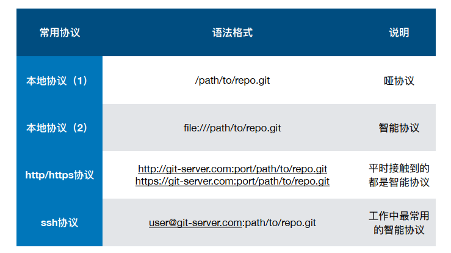

```shell
$ cd backup/ # 进入到需要备份的目录
# 使用哑协议 --bare表示不克隆工作区 重命名为 ya.git
$ git clone --bare /d/votal/docs/项目管理/practice/simple/.git ya.git 
Cloning into 'ya.git'...
done.

# 使用智能协议克隆，可以看到进度
$ git clone --bare file:///d/votal/docs/项目管理/practice/simple/.git zhineng.git
Cloning into bare repository 'zhineng.git'...
remote: Enumerating objects: 43, done.
remote: Counting objects: 100% (43/43), done.
remote: Compressing objects: 100% (32/32), done.
remote: Total 43 (delta 13), reused 0 (delta 0)
Receiving objects: 100% (43/43), 23.55 KiB | 2.62 MiB/s, done.
Resolving deltas: 100% (13/13), done.


```

### 本地仓库关联到远方仓库

```shell
$ git remote -v
zhineng file:///d/votal/docs/项目管理/practice/backup/zhineng.git (fetch) # 这里表示的是本地备份下来的远端仓库
zhineng file:///d/votal/docs/项目管理/practice/backup/zhineng.git (push)

# 这里表示新增一个名称为git_learing的远端仓库 地址放在后面
$ git remote add git_learing git@github.com:LinOcean/git_learning.git 
$ git remote -v # 这里可以查看到远端的仓库
git_learing     git@github.com:LinOcean/git_learning.git (fetch)
git_learing     git@github.com:LinOcean/git_learning.git (push)
zhineng file:///d/votal/docs/项目管理/practice/backup/zhineng.git (fetch)
zhineng file:///d/votal/docs/项目管理/practice/backup/zhineng.git (push)

$ git push git_learing --all # 表示将本地所有分支都push到远端 git_learing表示远端仓库名称
Warning: Permanently added the RSA host key for IP address '140.82.114.4' to the list of known hosts.
Enumerating objects: 43, done.
Counting objects: 100% (43/43), done.
Delta compression using up to 4 threads
Compressing objects: 100% (32/32), done.
Writing objects: 100% (43/43), 23.55 KiB | 1.57 MiB/s, done.
Total 43 (delta 13), reused 0 (delta 0)
remote: Resolving deltas: 100% (13/13), done.
To github.com:LinOcean/git_learning.git
 * [new branch]      new_refering -> new_refering # 这里看到这两个分支已经push成功了
 * [new branch]      temp -> temp
 ! [rejected]        master -> master (fetch first) # master分支被拒接，提示要先pull在push
error: failed to push some refs to 'git@github.com:LinOcean/git_learning.git'
hint: Updates were rejected because the remote contains work that you do
hint: not have locally. This is usually caused by another repository pushing
hint: to the same ref. You may want to first integrate the remote changes
hint: (e.g., 'git pull ...') before pushing again.
hint: See the 'Note about fast-forwards' in 'git push --help' for details.
# 上述看到操作失败的原因是 远端的仓库有文件，要先更新到本地来

$ git fetch git_learing master # 从远端 git_learing fetch到本地的master
remote: Enumerating objects: 3, done.
remote: Counting objects: 100% (3/3), done.
remote: Compressing objects: 100% (2/2), done.
remote: Total 3 (delta 0), reused 0 (delta 0), pack-reused 0
Unpacking objects: 100% (3/3), 1.17 KiB | 50.00 KiB/s, done.
From github.com:LinOcean/git_learning
 * branch            master     -> FETCH_HEAD
 * [new branch]      master     -> git_learing/master
 $ gitk -all # 查看分支状况
 $ git branch -va # 查看所有的分支 包括远端的分支
* master                           15ea60c update index.html
  new_refering                     7bf67c6 refering change
  temp                             455b5e8 Add test
  remotes/git_learing/master       339a91d Initial commit
  remotes/git_learing/new_refering 7bf67c6 refering change
  remotes/git_learing/temp         455b5e8 Add test
# 从上面的查看和下面的图片可以看出，远端的master分支跟本地的master没有指向同一个commit
$ git checkout master # 切换到本地的master
Already on 'master'
# --allow-unrelated-histories 表示不想干的 从下图看出远端的master跟本地master不相干
$ git merge --allow-unrelated-histories git_learing/master # 表示将远端的master跟本地的master相merge
Merge made by the 'recursive' strategy.
 LICENSE | 21 +++++++++++++++++++++
 1 file changed, 21 insertions(+)
 create mode 100644 LICENSE
$ git push git_learing master # push主干到远端的git_learing
Enumerating objects: 28, done.
Counting objects: 100% (28/28), done.
Delta compression using up to 4 threads
Compressing objects: 100% (19/19), done.
Writing objects: 100% (26/26), 22.18 KiB | 1.85 MiB/s, done.
Total 26 (delta 7), reused 0 (delta 0)
remote: Resolving deltas: 100% (7/7), done.
To github.com:LinOcean/git_learning.git
   339a91d..c6c6a11  master -> master
$ gitk --all # 查看 出现下面第3幅图的情况
```

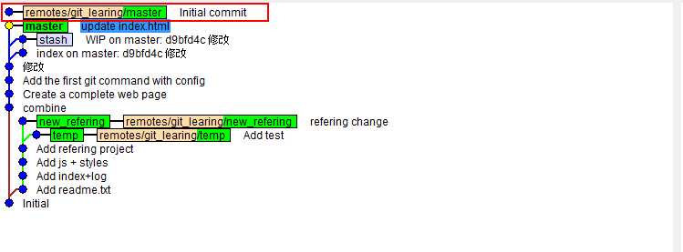

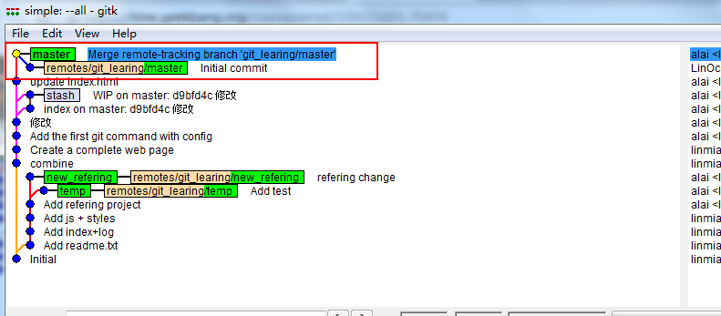


**总结：**
git remote -v 查看远程版本库信息
git remote add githup <url> 添加githup远程版本库
git fetch githup 拉取远程版本库
git merge -h 查看合并帮助信息
git merge --allow-unrelated-histories githup/master 合并githup上的master分支（两分支不是父子关系，所以合并需要添加 --allow-unrelated-histories）
git push githup 推送同步到githup仓库

### 不同人修改了不同文件

成员A从clone远端仓库

```shell
$ git branch -av # 查看分支信息
* master                                  c6c6a11 Merge remote-tracking branch 'git_learing/master'
  remotes/origin/HEAD                     -> origin/master
  remotes/origin/feature/add_git_commands c6c6a11 Merge remote-tracking branch 'git_learing/master'
  remotes/origin/master                   c6c6a11 Merge remote-tracking branch 'git_learing/master'
  remotes/origin/new_refering             7bf67c6 refering change
  remotes/origin/temp                     455b5e8 Add test
 
 # 基于远端分支origin/feature/add_git_commands 创建一个与之关联的本地分支 feature/add_git_commands 并切换到该分支
 $ git checkout -b feature/add_git_commands origin/feature/add_git_commands
Switched to a new branch 'feature/add_git_commands'
Branch 'feature/add_git_commands' set up to track remote branch 'feature/add_git_commands' from 'origin'. 
$ git branch -v
* feature/add_git_commands c6c6a11 Merge remote-tracking branch 'git_learing/master'
  master                   c6c6a11 Merge remote-tracking branch 'git_learing/master'
$ vi readme.md
$ git add -u
$ git status
On branch feature/add_git_commands
Your branch is up to date with 'origin/feature/add_git_commands'.

Changes to be committed:
  (use "git restore --staged <file>..." to unstage)
        modified:   readme.md
$ git commit -m "add git commands description in readme"
[feature/add_git_commands 7febef6] add git commands description in readme
 1 file changed, 2 insertions(+)
 $ git push # 可以直接使用push命令
Enumerating objects: 5, done.
Counting objects: 100% (5/5), done.
Delta compression using up to 4 threads
Compressing objects: 100% (3/3), done.
Writing objects: 100% (3/3), 329 bytes | 329.00 KiB/s, done.
Total 3 (delta 1), reused 0 (delta 0)
remote: Resolving deltas: 100% (1/1), completed with 1 local object.
To github.com:LinOcean/git_learning.git
   c6c6a11..7febef6  feature/add_git_commands -> feature/add_git_commands # 这里显示了关联的分支

```

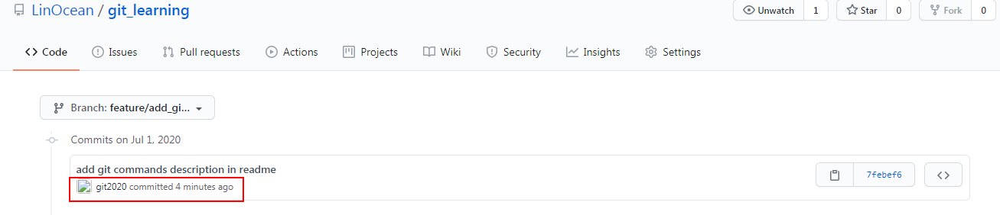

成员B本身已经存在仓库

```shell
$ git branch -av
* master                           c6c6a11 Merge remote-tracking branch 'git_learing/master'
  new_refering                     7bf67c6 refering change
  temp                             455b5e8 Add test
  remotes/git_learing/master       c6c6a11 Merge remote-tracking branch 'git_learing/master'
  remotes/git_learing/new_refering 7bf67c6 refering change
  remotes/git_learing/temp         455b5e8 Add test
$ git fetch git_learing
remote: Enumerating objects: 5, done.
remote: Counting objects: 100% (5/5), done.
remote: Compressing objects: 100% (2/2), done.
remote: Total 3 (delta 1), reused 3 (delta 1), pack-reused 0
Unpacking objects: 100% (3/3), 309 bytes | 61.00 KiB/s, done.
From github.com:LinOcean/git_learning
 * [new branch]      feature/add_git_commands -> git_learing/feature/add_git_commands # 这里把新分支fetch下来
 $ git branch -av
* feature/add_git_commands                7febef6 add git commands description in readme
  master                                  c6c6a11 Merge remote-tracking branch 'git_learing/master'
  remotes/origin/HEAD                     -> origin/master
  remotes/origin/feature/add_git_commands 7febef6 add git commands description in readme
  remotes/origin/master                   c6c6a11 Merge remote-tracking branch 'git_learing/master'
  remotes/origin/new_refering             7bf67c6 refering change
  remotes/origin/temp                     455b5e8 Add test
# 要创建与其相关联的本地分支
$ git checkout -b feature/add_git_commands git_learing/feature/add_git_commands
Switched to a new branch 'feature/add_git_commands'
Branch 'feature/add_git_commands' set up to track remote branch 'feature/add_git_commands' from 'git_learing'.
$ git branch -av
* feature/add_git_commands                7febef6 add git commands description in readme
  master                                  c6c6a11 Merge remote-tracking branch 'git_learing/master'
  remotes/origin/HEAD                     -> origin/master
  remotes/origin/feature/add_git_commands 7febef6 add git commands description in readme
  remotes/origin/master                   c6c6a11 Merge remote-tracking branch 'git_learing/master'
  remotes/origin/new_refering             7bf67c6 refering change
  remotes/origin/temp                     455b5e8 Add test
$ vi index.html
$ git add -u
$ git commit -m "add git add command in index"
[feature/add_git_commands 67de72d] add git add command in index
 1 file changed, 1 insertion(+), 1 deletion(-)
$ gitk --all
# 可以看到成员A的commit跟成员B的commit是一个父子关系，此时如果成员B push到远端 是没有任何问题的
```

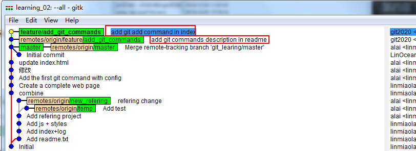

下面切换回成员A（也就是在成员Bcommit之前，成员A再进行修改）

```shell
$ vi readme.md
$ git commit -am 'Fix readme'
[feature/add_git_commands 15847b8] Fix readme
 1 file changed, 1 insertion(+), 1 deletion(-)
 $ git push
Enumerating objects: 5, done.
Counting objects: 100% (5/5), done.
Delta compression using up to 4 threads
Compressing objects: 100% (3/3), done.
Writing objects: 100% (3/3), 298 bytes | 298.00 KiB/s, done.
Total 3 (delta 2), reused 0 (delta 0)
remote: Resolving deltas: 100% (2/2), completed with 2 local objects.
To github.com:LinOcean/git_learning.git
   7febef6..15847b8  feature/add_git_commands -> feature/add_git_commands

```

再切换回成员B，此时成员B要push

```shell
$ git status
On branch feature/add_git_commands
Your branch is ahead of 'origin/feature/add_git_commands' by 1 commit.
  (use "git push" to publish your local commits)

nothing to commit, working tree clean
$ git push
To github.com:LinOcean/git_learning.git
 ! [rejected]        feature/add_git_commands -> feature/add_git_commands (fetch first)
error: failed to push some refs to 'git@github.com:LinOcean/git_learning.git'
hint: Updates were rejected because the remote contains work that you do
hint: not have locally. This is usually caused by another repository pushing
hint: to the same ref. You may want to first integrate the remote changes
hint: (e.g., 'git pull ...') before pushing again.
hint: See the 'Note about fast-forwards' in 'git push --help' for details.

# 很明显此时会报错，因为远端仓库跟本地仓库已经不是fast-forwards的关系
$ git fetch # 先更新
remote: Enumerating objects: 5, done.
remote: Counting objects: 100% (5/5), done.
remote: Compressing objects: 100% (1/1), done.
remote: Total 3 (delta 2), reused 3 (delta 2), pack-reused 0
Unpacking objects: 100% (3/3), 278 bytes | 55.00 KiB/s, done.
From github.com:LinOcean/git_learning
   7febef6..15847b8  feature/add_git_commands -> origin/feature/add_git_commands
$ git branch -av
# [ahead 1, behind 1] 这里看到本地分支的commit不是最新的
* feature/add_git_commands                67de72d [ahead 1, behind 1] add git add command in index
  master                                  c6c6a11 Merge remote-tracking branch 'git_learing/master' 
  remotes/origin/HEAD                     -> origin/master
  remotes/origin/feature/add_git_commands 15847b8 Fix readme # 这个分支的指向发生了改变
  remotes/origin/master                   c6c6a11 Merge remote-tracking branch 'git_learing/master'
  remotes/origin/new_refering             7bf67c6 refering change
  remotes/origin/temp                     455b5e8 Add test
$ git merge git_learning/feature/add_git_commands # 表示将远端的commit与本地的commit进行合并
merge: git_learning/feature/add_git_commands - not something we can merge
 readme.md | 2 +-
 1 file changed, 1 insertion(+), 1 deletion(-)
 $ git push # 这样就可以成功推送到远端仓库
Enumerating objects: 9, done.
Counting objects: 100% (8/8), done.
Delta compression using up to 4 threads
Compressing objects: 100% (5/5), done.
Writing objects: 100% (5/5), 568 bytes | 568.00 KiB/s, done.
Total 5 (delta 3), reused 0 (delta 0)
remote: Resolving deltas: 100% (3/3), completed with 2 local objects.
To github.com:LinOcean/git_learning.git
   15847b8..927a4a7  feature/add_git_commands -> feature/add_git_commands


```

### 不同人修改同文件不同区域

以下为成员A，先拉去最新代码

```shell
$ git branch -av
* feature/add_git_commands                     15847b8 Fix readme
  master                                       c6c6a11 Merge remote-tracking branch 'git_learing/master'
  new_refering                                 7bf67c6 refering change
  temp                                         455b5e8 Add test
  remotes/git_learing/feature/add_git_commands 15847b8 Fix readme
  remotes/git_learing/master                   c6c6a11 Merge remote-tracking branch 'git_learing/master'
  remotes/git_learing/new_refering             7bf67c6 refering change
  remotes/git_learing/temp   
$ git pull
remote: Enumerating objects: 9, done.
remote: Counting objects: 100% (8/8), done.
remote: Compressing objects: 100% (2/2), done.
remote: Total 5 (delta 3), reused 5 (delta 3), pack-reused 0
Unpacking objects: 100% (5/5), 548 bytes | 14.00 KiB/s, done.
From github.com:LinOcean/git_learning
   15847b8..927a4a7  feature/add_git_commands -> git_learing/feature/add_git_commands
Updating 15847b8..927a4a7
Fast-forward
 index.html | 2 +-
 1 file changed, 1 insertion(+), 1 deletion(-)

# 修改文件
$ vi index.html 
# 提交文件
$ git commit -am 'Add non fast forward'
[feature/add_git_commands 640ed60] Add non fast forward
 1 file changed, 1 insertion(+), 1 deletion(-)

```

以下为成员B

```shell
$ git  branch -av
* feature/add_git_commands                927a4a7 Merge remote-tracking branch 'remotes/origin/feature/add_git_commands' into feature/add_git_commands
  master                                  c6c6a11 Merge remote-tracking branch 'git_learing/master'
  remotes/origin/HEAD                     -> origin/master
  remotes/origin/feature/add_git_commands 927a4a7 Merge remote-tracking branch 'remotes/origin/feature/add_git_commands' into feature/add_git_commands
  remotes/origin/master                   c6c6a11 Merge remote-tracking branch 'git_learing/master'
  remotes/origin/new_refering             7bf67c6 refering change
  remotes/origin/temp                     455b5e8 Add test
  
$ git pull
Already up to date.  
# 这里跟成员A修改了同一文件 但不同区域
$ vi index.html 
$ git commit -am 'Add commit command'
[feature/add_git_commands a2df06a] Add commit command
 1 file changed, 1 insertion(+), 1 deletion(-)

$ git push # 这里比成员A先推送到了远端仓库
Enumerating objects: 5, done.
Counting objects: 100% (5/5), done.
Delta compression using up to 4 threads
Compressing objects: 100% (3/3), done.
Writing objects: 100% (3/3), 299 bytes | 299.00 KiB/s, done.
Total 3 (delta 2), reused 0 (delta 0)
remote: Resolving deltas: 100% (2/2), completed with 2 local objects.
To github.com:LinOcean/git_learning.git
   927a4a7..a2df06a  feature/add_git_commands -> feature/add_git_commands

```

回去成员A，要将代码push

```shell
$ git push
To github.com:LinOcean/git_learning.git
 ! [rejected]        feature/add_git_commands -> feature/add_git_commands (fetch first)
error: failed to push some refs to 'git@github.com:LinOcean/git_learning.git'
hint: Updates were rejected because the remote contains work that you do
hint: not have locally. This is usually caused by another repository pushing
hint: to the same ref. You may want to first integrate the remote changes
hint: (e.g., 'git pull ...') before pushing again.
hint: See the 'Note about fast-forwards' in 'git push --help' for details.
# 会被远端拒绝 因为已经有成员B push
$ git fetch # 这里也可以直接pull
remote: Enumerating objects: 5, done.
remote: Counting objects: 100% (5/5), done.
remote: Compressing objects: 100% (1/1), done.
remote: Total 3 (delta 2), reused 3 (delta 2), pack-reused 0
Unpacking objects: 100% (3/3), 279 bytes | 46.00 KiB/s, done.
From github.com:LinOcean/git_learning
   927a4a7..a2df06a  feature/add_git_commands -> git_learing/feature/add_git_commands
$ git branch -av
* feature/add_git_commands                     640ed60 [ahead 1, behind 1] Add non fast forward
  master                                       c6c6a11 Merge remote-tracking branch 'git_learing/master'
  new_refering                                 7bf67c6 refering change
  temp                                         455b5e8 Add test
  remotes/git_learing/feature/add_git_commands a2df06a Add commit command
  remotes/git_learing/master                   c6c6a11 Merge remote-tracking branch 'git_learing/master'
  remotes/git_learing/new_refering             7bf67c6 refering change
  remotes/git_learing/temp                     455b5e8 Add test
  
$ git merge git_learing/feature/add_git_commands # 执行该命令后，会弹出编辑commit message的窗口，表示git已经自动帮我们对index文件进行了合并
Auto-merging index.html
Merge made by the 'recursive' strategy.
 index.html | 2 +-
 1 file changed, 1 insertion(+), 1 deletion(-)

$ cat index.html # 可以查看到该文件已经被更新 合并
$ gitk --all 
$ git branch -av
# 可以看到这里的状态发生了改变
* feature/add_git_commands                     1b75367 [ahead 2] Merge remote-tracking branch 'git_learing/feature/add_git_commands' into feature/add_git_commands
  master                                       c6c6a11 Merge remote-tracking branch 'git_learing/master'
  new_refering                                 7bf67c6 refering change
  temp                                         455b5e8 Add test
  remotes/git_learing/feature/add_git_commands a2df06a Add commit command
  remotes/git_learing/master                   c6c6a11 Merge remote-tracking branch 'git_learing/master'
  remotes/git_learing/new_refering             7bf67c6 refering change
  remotes/git_learing/temp                     455b5e8 Add test
$ git push
Enumerating objects: 10, done.
Counting objects: 100% (10/10), done.
Delta compression using up to 4 threads
Compressing objects: 100% (6/6), done.
Writing objects: 100% (6/6), 640 bytes | 640.00 KiB/s, done.
Total 6 (delta 4), reused 0 (delta 0)
remote: Resolving deltas: 100% (4/4), completed with 2 local objects.
To github.com:LinOcean/git_learning.git
   a2df06a..1b75367  feature/add_git_commands -> feature/add_git_commands
# 这里状态又发生了改变   
$ git branch -av
* feature/add_git_commands                     1b75367 Merge remote-tracking branch 'git_learing/feature/add_git_commands' into feature/add_git_commands
  master                                       c6c6a11 Merge remote-tracking branch 'git_learing/master'
  new_refering                                 7bf67c6 refering change
  temp                                         455b5e8 Add test
  remotes/git_learing/feature/add_git_commands 1b75367 Merge remote-tracking branch 'git_learing/feature/add_git_commands' into feature/add_git_commands
  remotes/git_learing/master                   c6c6a11 Merge remote-tracking branch 'git_learing/master'
  remotes/git_learing/new_refering             7bf67c6 refering change
  remotes/git_learing/temp                     455b5e8 Add test
   
```

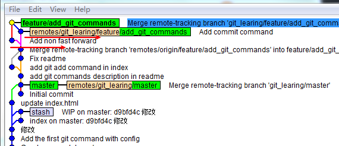

### 不同人修改了同一文件的同一区域

成员A

```shell
$ vi index.html
$ git commit -am 'Add mv and rm commands'
[feature/add_git_commands 2aea406] Add mv and rm commands
 1 file changed, 2 insertions(+), 2 deletions(-)
$ git push # 修改完后就推送到远端了
```

成员B

```shell
$ vi index.html # 这里修改了跟成员A的同一区域
$ git commit -am 'Add stash and log commands'
[feature/add_git_commands b45ffdb] Add stash and log commands
 1 file changed, 2 insertions(+), 2 deletions(-)
$ git push
To github.com:LinOcean/git_learning.git
 ! [rejected]        feature/add_git_commands -> feature/add_git_commands (fetch first)
error: failed to push some refs to 'git@github.com:LinOcean/git_learning.git'
hint: Updates were rejected because the remote contains work that you do
hint: not have locally. This is usually caused by another repository pushing
hint: to the same ref. You may want to first integrate the remote changes
hint: (e.g., 'git pull ...') before pushing again.
hint: See the 'Note about fast-forwards' in 'git push --help' for details.
$ git pull
remote: Enumerating objects: 10, done.
remote: Counting objects: 100% (10/10), done.
remote: Compressing objects: 100% (2/2), done.
remote: Total 6 (delta 4), reused 6 (delta 4), pack-reused 0
Unpacking objects: 100% (6/6), 604 bytes | 54.00 KiB/s, done.
From github.com:LinOcean/git_learning
   1b75367..66195a9  feature/add_git_commands -> git_learing/feature/add_git_commands
Auto-merging index.html
CONFLICT (content): Merge conflict in index.html # 自动merge 但有冲突 并指明了冲突的文件
Automatic merge failed; fix conflicts and then commit the result.
$ vi index.html 
$ git status # 手动处理后查看状态
On branch feature/add_git_commands
Your branch and 'git_learing/feature/add_git_commands' have diverged,
and have 1 and 2 different commits each, respectively.
  (use "git pull" to merge the remote branch into yours)

You have unmerged paths.
  (fix conflicts and run "git commit")
  (use "git merge --abort" to abort the merge)

Unmerged paths:
  (use "git add <file>..." to mark resolution)
        both modified:   index.html
$ git commit -am 'Resolved confilict'
[feature/add_git_commands 3259dc3] Resolved confilict
$ git status
On branch feature/add_git_commands
Your branch is ahead of 'git_learing/feature/add_git_commands' by 2 commits.
  (use "git push" to publish your local commits)
$ git push
Enumerating objects: 10, done.
Counting objects: 100% (10/10), done.
Delta compression using up to 4 threads
Compressing objects: 100% (6/6), done.
Writing objects: 100% (6/6), 601 bytes | 601.00 KiB/s, done.
Total 6 (delta 4), reused 0 (delta 0)
remote: Resolving deltas: 100% (4/4), completed with 2 local objects.
To github.com:LinOcean/git_learning.git
   66195a9..3259dc3  feature/add_git_commands -> feature/add_git_commands
$ gitk --all
```

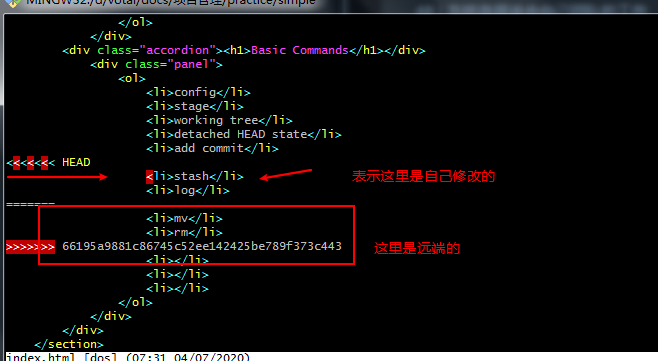

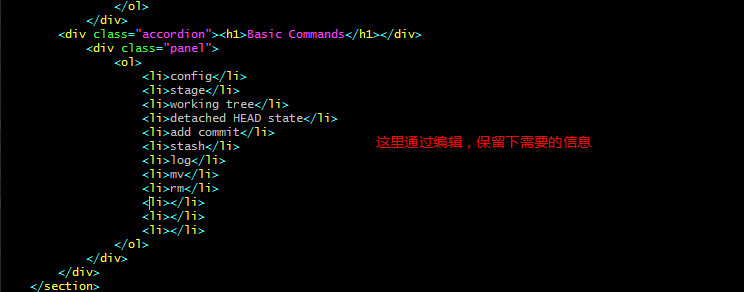

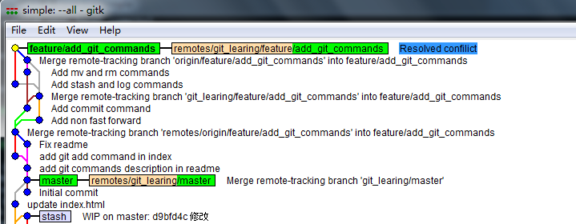

### 同时变更了文件名跟文件内容

成员A更改文件名，并先提交到远端

```shell
$ git mv index.html index.htm
$ git commit -am 'mv index name'
[feature/add_git_commands 9127448] mv index name
 1 file changed, 0 insertions(+), 0 deletions(-)
 rename index.html => index.htm (100%)
$ git push
Enumerating objects: 3, done.
Counting objects: 100% (3/3), done.
Delta compression using up to 4 threads
Compressing objects: 100% (2/2), done.
Writing objects: 100% (2/2), 216 bytes | 216.00 KiB/s, done.
Total 2 (delta 1), reused 0 (delta 0)
remote: Resolving deltas: 100% (1/1), completed with 1 local object.
To github.com:LinOcean/git_learning.git
   b1928fc..9127448  feature/add_git_commands -> feature/add_git_commands

```

成员B更改文件该文件内容，并将其push

```shell
$ vi index.html
$ git commit -am 'change index'
[feature/add_git_commands bfb4b9b] change index
 1 file changed, 1 insertion(+), 1 deletion(-)
$ git push
To github.com:LinOcean/git_learning.git
 ! [rejected]        feature/add_git_commands -> feature/add_git_commands (fetch first)
error: failed to push some refs to 'git@github.com:LinOcean/git_learning.git'
hint: Updates were rejected because the remote contains work that you do
hint: not have locally. This is usually caused by another repository pushing
hint: to the same ref. You may want to first integrate the remote changes
hint: (e.g., 'git pull ...') before pushing again.
hint: See the 'Note about fast-forwards' in 'git push --help' for details.
$ git pull # 执行该命令后，弹出合并 要合并的message编辑页面 也就是git能识别到index.html更改名字了
remote: Enumerating objects: 3, done.
remote: Counting objects: 100% (3/3), done.
remote: Compressing objects: 100% (1/1), done.
remote: Total 2 (delta 1), reused 2 (delta 1), pack-reused 0
Unpacking objects: 100% (2/2), 196 bytes | 65.00 KiB/s, done.
From github.com:LinOcean/git_learning
   b1928fc..9127448  feature/add_git_commands -> git_learing/feature/add_git_commands
Merge made by the 'recursive' strategy.
 index.html => index.htm | 0
 1 file changed, 0 insertions(+), 0 deletions(-)
 rename index.html => index.htm (100%)

```


## github使用

1. 进入高级搜索页面：https://github.com/search/advanced
2. 搭建个人博客：搜索仓库：barryclark/jekyll-now


## 基本命令

### 新建代码库

```bash
# 当前目录建立一个仓库
$ git init
# 新建一个目录并将其初始化为Git代码仓库
$ git init [project-name]
# 下载一个项目和他的整个代码历史
$ git clone [url]
```

### 增加/删除/修改文件

```bash
# 查看状态
$ git status
# 添加指定文件到暂存区
$ git add [file1] [file2] 
# 添加指定目录到暂存区，包括指定目录
$ git add [dir]
# 添加当前目录的所有文件到暂存区
$ git add .
# 将工作区中已经被git管理的文件，一起提交到暂存区（可以省略文件名）
$ git add -u
```

### 重命名文件

```bash
$ git mv filesrc filedes
# 测试重命名是大小写是否敏感的情况
# 查询当前的配置
$ git config --list --local
core.repositoryformatversion=0
core.filemode=false
core.bare=false
core.logallrefupdates=true
core.symlinks=false
core.ignorecase=true # 注意这里的配置
user.name=alai
user.email=linmiaolai@qq.com
gui.wmstate=normal
gui.geometry=841x483+75+75 189 218
# 指定更改名字
$ git mv readme.md Readme.md
$ git status # 这里查看名字更改成功了
On branch master
Changes to be committed:
  (use "git restore --staged <file>..." to unstage)
        renamed:    readme.md -> Readme.md    
 # 更改配置 将core.ignorecase改为false
$ git config -e --local
$ git config --list --local
core.repositoryformatversion=0
core.filemode=false
core.bare=false
core.logallrefupdates=true
core.symlinks=false
core.ignorecase=false
user.name=alai
user.email=linmiaolai@qq.com
gui.wmstate=normal
gui.geometry=841x483+75+75 189 218
# 再重新更改名字，发现更改失败
$ git mv Readme.md readme.md
fatal: destination exists, source=Readme.md, destination=readme.md
```

### 查看信息

```bash
# 显示有变更的文件
$ git status
# 显示当前分支的版本历史
$ git log
# 显示commit历史，以及每次commit发生变更的文件
$ git log --stat
# 只显示commit信息一行
$ git log --oneline
1f0ddac (HEAD -> master) rename readme.md to Readme.md
a188b1c Move readme.txt to readme.md
e3c79a0 Add refering project
22c8465 Add js + styles
78c0bba Add index+log
5db6f67 Add readme.txt
b6f8476 Initial
# 根据更改过的关键字查询历史，比如有个配置项tcs.conf改动过，则可以以下搜索
$ git log -S tcs.conf
# 查看指定文件的历史
$ git log -- [filename]
$ ll
total 5
drwxr-xr-x 1 Administrator 197121    0 六月   12 21:20 images/
-rw-r--r-- 1 Administrator 197121 1433 六月   12 21:29 index.html
drwxr-xr-x 1 Administrator 197121    0 六月   12 21:20 js/
-rw-r--r-- 1 Administrator 197121   26 六月   12 08:32 Readme.md
drwxr-xr-x 1 Administrator 197121    0 六月   12 21:19 styles/

Administrator@-20191005ZRXKPW MINGW32 /d/votal/docs/项目管理/practice/simple (master)
$ git log -- Readme.md
commit 1f0ddace76adb18d01aa5bf7e4e2ce25d13011b1 (HEAD -> master)
Author: alai <linmiaolai@qq.com>
Date:   Fri Jun 12 22:26:13 2020 +0800

    rename readme.md to Readme.md
# 查看指定时间的范围的提交记录
$ git log  --since="2008-10-01" --before="2008-11-01" 
```

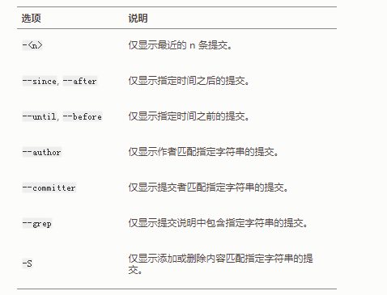


